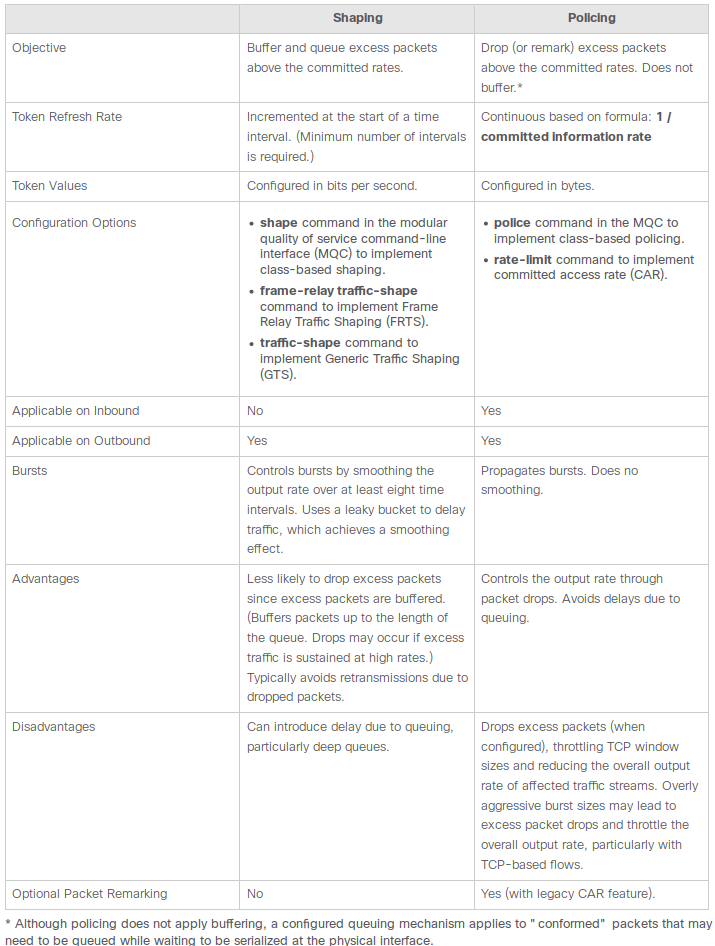
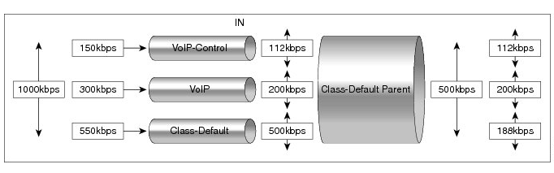
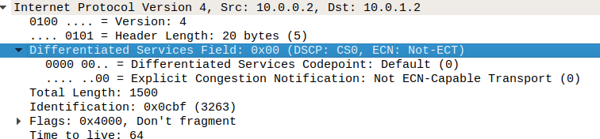

# AN Lab 1 - QoS

#### Artem Abramov SNE19


## 1. Preparation

### a. Select a virtual routing solution that you would like to try. For example (Mikrotik, vyos, Pfsense).

In the previous labs I used Mikrotik, so this time I wanted to try using Cisco 7200.

### b. GNS3 already have a template for these routers (Mikrotik, vyos, Pfsense), try to use these template as it will save you a lot of time and troubleshooting.

Installing the Cisco 7200 image took some effort. A friend shared the system image with me, but getting it to work with GNS3 took a bit more effort. GNS3 comes with an appliance template for Cisco 7200, it is availiable for download from

  1. Github at https://raw.githubusercontent.com/GNS3/gns3-registry/master/appliances/cisco-7200.gns3a
  2. GNS3 Marketplace at https://gns3.com/marketplace/appliances

It is shown below for completeness:
```
$ cat cisco-7200.gns3a.official
{
    "name": "Cisco 7200",
    "category": "router",
    "description": "Cisco 7200 Router",
    "vendor_name": "Cisco",
    "vendor_url": "http://www.cisco.com",
    "documentation_url": "http://www.cisco.com/c/en/us/products/routers/7200-series-routers/index.html",
    "product_name": "7200",
    "registry_version": 3,
    "status": "experimental",
    "maintainer": "GNS3 Team",
    "maintainer_email": "developers@gns3.net",
    "dynamips": {
        "platform": "c7200",
        "ram": 512,
        "nvram": 512,
        "startup_config": "ios_base_startup-config.txt",
        "slot0": "C7200-IO-FE",
        "midplane": "vxr",
        "npe": "npe-400"
    },
    "images": [
        {
            "filename": "c7200-adventerprisek9-mz.124-24.T5.image",
            "version": "124-24.T5",
            "md5sum": "6b89d0d804e1f2bb5b8bda66b5692047",
            "filesize": 102345240
        }
    ],
    "versions": [
        {
            "name": "124-24.T5",
            "idlepc": "0x606df838",
            "images": {
                "image": "c7200-adventerprisek9-mz.124-24.T5.image"
            }
        }
    ]
}
```

The Cisco 7200 image file I had looked as below:
```
$ ls -la c7200-advipservicesk9-mz.152-4.S5.bin 
-rw-r--r-- 1 artem artem 34783116 Oct 20 21:08 c7200-advipservicesk9-mz.152-4.S5.bin
$ md5sum c7200-advipservicesk9-mz.152-4.S5.bin
c07432e186715bbb6d2db20786517d91  c7200-advipservicesk9-mz.152-4.S5.bin
```

Using this information I created a new appliance file that I imported into GNS3, the file is shown below for completeness:
```
$ cat cisco-7200.gns3a
{
    "name": "Cisco 7200 custom",
    "category": "router",
    "description": "Cisco 7200 Router",
    "vendor_name": "Cisco",
    "vendor_url": "http://www.cisco.com",
    "documentation_url": "http://www.cisco.com/c/en/us/products/routers/7200-series-routers/index.html",
    "product_name": "7200",
    "registry_version": 3,
    "status": "experimental",
    "maintainer": "GNS3 Team",
    "maintainer_email": "developers@gns3.net",
    "dynamips": {
        "platform": "c7200",
        "ram": 512,
        "nvram": 512,
        "startup_config": "ios_base_startup-config.txt",
        "slot0": "C7200-IO-FE",
        "midplane": "vxr",
        "npe": "npe-400"
    },
    "images": [
        {
            "filename": "c7200-advipservicesk9-mz.152-4.S5.bin",
            "version": "152-4.S5",
            "md5sum": "c07432e186715bbb6d2db20786517d91",
            "filesize": 34783116
        }
    ],
    "versions": [
        {
            "name":  "152-4.S5",
            "idlepc": "0x606df838",
            "images": {
                "image": "c7200-advipservicesk9-mz.152-4.S5.bin"
            }
        }
    ]
}
```

### c. Try to draw a network scheme before you start the lab. This will help you in the deployment phase.

### d. The network scheme should include at least 2 hosts and 1 router

My network scheme is shown below:


## 2. Deployment

The first step was configuring the R1 router and the two hosts. To configure the Cisco 7200 router I used the manual of all the commands presented in the `Cisco IOS Master Command List, All Releases` at  https://www.cisco.com/c/en/us/td/docs/ios-xml/ios/mcl/allreleasemcl/all-book.pdf

To interact with Cisco one has to use the modes. Configuring the ip address on the interfaces is shown below:
```
R1#configure terminal 
Enter configuration commands, one per line.  End with CNTL/Z.    
R1(config)#do show ip interface br
Interface              IP-Address      OK? Method Status                Protocol
FastEthernet0/0        unassigned      YES unset  administratively down down    
FastEthernet0/1        unassigned      YES unset  administratively down down    
FastEthernet1/0        unassigned      YES unset  administratively down down    
FastEthernet1/1        unassigned      YES unset  administratively down down    
R1(config)#interface fastEthernet 0/1
R1(config-if)#ip add 10.0.0.1 255.255.255.0
R1(config-if)#no shutdown 
*Oct 21 18:40:18.175: %LINK-3-UPDOWN: Interface FastEthernet0/1, changed state to up
*Oct 21 18:40:19.175: %LINEPROTO-5-UPDOWN: Line protocol on Interface FastEthernet0/1, changed state to up
R1(config-if)#do show ip interface br      
Interface              IP-Address      OK? Method Status                Protocol
FastEthernet0/0        unassigned      YES unset  administratively down down    
FastEthernet0/1        10.0.0.1        YES manual up                    up      
FastEthernet1/0        unassigned      YES unset  administratively down down    
FastEthernet1/1        unassigned      YES unset  administratively down down    
R1(config-if)#exit
```


Step-by-step the configuration is described below. Change to config mode:
```
R1#configure terminal 
Enter configuration commands, one per line.  End with CNTL/Z.
```

List current ip config on the interfaces in brief style:
```
R1(config)#do show ip interface br
Interface              IP-Address      OK? Method Status                Protocol
FastEthernet0/0        unassigned      YES unset  administratively down down    
FastEthernet0/1        unassigned      YES unset  administratively down down    
FastEthernet1/0        unassigned      YES unset  administratively down down    
FastEthernet1/1        unassigned      YES unset  administratively down down
```

Configure the interface `fastEthernet0/1` with ip `10.0.0.1` and netmask `255.255.255.0`:
```
R1(config)#interface fastEthernet 0/1
R1(config-if)#ip add 10.0.0.1 255.255.255.0
```

Bring the interface up:
```
R1(config-if)#no shutdown 
*Oct 21 18:40:18.175: %LINK-3-UPDOWN: Interface FastEthernet0/1, changed state to up
*Oct 21 18:40:19.175: %LINEPROTO-5-UPDOWN: Line protocol on Interface FastEthernet0/1, changed state to up
```

Check the state of the interface and exit the interface config mode:
```
R1(config-if)#do show ip interface br      
Interface              IP-Address      OK? Method Status                Protocol
FastEthernet0/0        unassigned      YES unset  administratively down down    
FastEthernet0/1        10.0.0.1        YES manual up                    up      
FastEthernet1/0        unassigned      YES unset  administratively down down    
FastEthernet1/1        unassigned      YES unset  administratively down down    
R1(config-if)#exit
```


The interface `fastEthernet1/0` was configured in a similar manner with ip `10.0.1.1` and netmask `255.255.255.0`.

To list the current running configuration (what is in RAM) of Cisco 7200 use the command `show run`. The output of the `show run` command can be backed up by copy-paste and can be used to restore configuration by feeding it directly to the `configure terminal` command. To make the run configuration persistent, you must save it to storage. To show the configuration for next reboot use `show start` command. To save the running configuration to a startup configuration use either the `write` command OR  use `copy running-config startup-config` which is better because its explicit (hit ENTER to gt default file).

Finally after configuring the router and the hosts pinging worked correctly. Ping from router to Alice is shown below:

```
R1#ping 10.0.0.2
Type escape sequence to abort.
Sending 5, 100-byte ICMP Echos to 10.0.0.2, timeout is 2 seconds:
!!!!!
Success rate is 100 percent (5/5), round-trip min/avg/max = 4/8/12 ms
```

Ping from router to Bob is shown below:

```
R1#ping 10.0.1.2
Type escape sequence to abort.
Sending 5, 100-byte ICMP Echos to 10.0.1.2, timeout is 2 seconds:
.!!!!
Success rate is 80 percent (4/5), round-trip min/avg/max = 4/8/12 ms
```


It turned out that internet connection was necessary for the two hosts to install `iperf3`. Configuring internet access on the Cisco 7200 router turned out to be more complicated than originally anticipated, therefore I present the steps below. 

```
R1#config term
Enter configuration commands, one per line.  End with CNTL/Z.
R1(config)#interface fastEthernet 0/0 
R1(config-if)#ip address dhcp
R1(config-if)#no shut
*Oct 21 20:13:03.247: %LINK-3-UPDOWN: Interface FastEthernet0/0, changed state to up
*Oct 21 20:13:04.247: %LINEPROTO-5-UPDOWN: Line protocol on Interface FastEthernet0/0, changed state to up
*Oct 21 20:13:13.783: %DHCP-6-ADDRESS_ASSIGN: Interface FastEthernet0/0 assigned DHCP address 192.168.122.45, mask 255.255.255.0, hostname R1
R1(config-if)#do show ip interface brief
Interface              IP-Address      OK? Method Status                Protocol
FastEthernet0/0        192.168.122.45  YES DHCP   up                    up      
FastEthernet0/1        10.0.0.1        YES manual up                    up      
FastEthernet1/0        10.0.1.1        YES manual up                    up      
FastEthernet1/1        unassigned      YES unset  administratively down down    
R1(config-if)#ip nat outside 
R1(config-if)#exit
R1(config)#
R1(config)#interface fa0/1        
R1(config-if)#ip nat inside 
R1(config-if)#exit
R1(config)#
R1(config)#interface fa1/0
R1(config-if)#ip nat inside
R1(config-if)#exit
R1(config)#
R1(config)#ip nat inside source list 1 interface fastEthernet 0/0 overload
R1(config)#access-list 1 permit 10.0.0.0 0.0.0.255
R1(config)#access-list 1 permit 10.0.1.0 0.0.0.255
R1(config)#exit
R1#
R1#ping 8.8.8.8
Type escape sequence to abort.
Sending 5, 100-byte ICMP Echos to 8.8.8.8, timeout is 2 seconds:
!!!!!
Success rate is 100 percent (5/5), round-trip min/avg/max = 40/40/40 ms
```


Going over step-by-step. Enter configuration mode for interface 0/0 that is connnected to the Cloud as shown below:
```
R1#config term
Enter configuration commands, one per line.  End with CNTL/Z.
R1(config)#interface fastEthernet 0/0 
```

Configure dhcp client and bring the interface up:
```
R1(config-if)#ip address dhcp
R1(config-if)#no shut
*Oct 21 20:13:03.247: %LINK-3-UPDOWN: Interface FastEthernet0/0, changed state to up
*Oct 21 20:13:04.247: %LINEPROTO-5-UPDOWN: Line protocol on Interface FastEthernet0/0, changed state to up
*Oct 21 20:13:13.783: %DHCP-6-ADDRESS_ASSIGN: Interface FastEthernet0/0 assigned DHCP address 192.168.122.45, mask 255.255.255.0, hostname R1
```

Check interface status:
```
R1(config-if)#do show ip interface brief
Interface              IP-Address      OK? Method Status                Protocol
FastEthernet0/0        192.168.122.45  YES DHCP   up                    up      
FastEthernet0/1        10.0.0.1        YES manual up                    up      
FastEthernet1/0        10.0.1.1        YES manual up                    up      
FastEthernet1/1        unassigned      YES unset  administratively down down    
```

Test internet connection by pinging google's servers from the router R1:
```
R1#ping 8.8.8.8
Type escape sequence to abort.
Sending 5, 100-byte ICMP Echos to 8.8.8.8, timeout is 2 seconds:
!!!!!
Success rate is 100 percent (5/5), round-trip min/avg/max = 40/40/40 ms
```

Then I have setup NAT on the router R1. This is not actually necessary because `virsh` sets up NAT on the default network, but it was an interesting exercise to configure it on Cisco. The steps to configure NAT are below. Change mode to configuration for 0/0 interface and set it as NAT output (outer) interface:
```
R1(config)#interface fastEthernet 0/0
R1(config-if)#ip nat outside 
R1(config-if)#exit
```

Set the interfaces 0/1 and 1/0 to be NAT inside (input) interfaces:
```
R1(config)#interface fa0/1        
R1(config-if)#ip nat inside 
R1(config-if)#exit
R1(config)#interface fa1/0
R1(config-if)#ip nat inside
R1(config-if)#exit
```

Set the NAT mode to be `overload` (this is like the normal NAT mode) for access-list 1 on interface 0/0:
```
R1(config)#
R1(config)#ip nat inside source list 1 interface fastEthernet 0/0 overload
```

Configure access-list 1 to allow traffic from the two inner networks by specifying their ip prefix `10.0.0.0` and inverted netmask `0.0.0.255`:
```
R1(config)#access-list 1 permit 10.0.0.0 0.0.0.255
R1(config)#access-list 1 permit 10.0.1.0 0.0.0.255
```

Overall router config is shown below for completeness:
```
R1#show run
Building configuration...

Current configuration : 1218 bytes
!
! Last configuration change at 20:17:30 UTC Mon Oct 21 2019
!
version 15.2
service timestamps debug datetime msec
service timestamps log datetime msec
!
hostname R1
!
boot-start-marker
boot-end-marker
!
!
!
no aaa new-model
no ip icmp rate-limit unreachable
ip cef
!
!
!
!
!         
!         
no ip domain lookup
no ipv6 cef
!         
!         
multilink bundle-name authenticated
!         
!         
!         
!         
!         
!         
!         
!         
!         
ip tcp synwait-time 5
!         
!         
!         
!         
!         
!         
!         
!         
!         
!         
!         
!         
interface FastEthernet0/0
 ip address dhcp
 ip nat outside
 speed auto
 duplex auto
!         
interface FastEthernet0/1
 ip address 10.0.0.1 255.255.255.0
 ip nat inside
 speed auto
 duplex auto
!         
interface FastEthernet1/0
 ip address 10.0.1.1 255.255.255.0
 ip nat inside
 speed auto
 duplex auto
!         
interface FastEthernet1/1
 no ip address
 shutdown 
 speed auto
 duplex auto
!         
ip nat inside source list 1 interface FastEthernet0/0 overload
ip forward-protocol nd
!         
!         
no ip http server
no ip http secure-server
!         
access-list 1 permit 10.0.0.0 0.0.0.255
access-list 1 permit 10.0.1.0 0.0.0.255
!         
!         
!         
control-plane
!         
!         
line con 0
 exec-timeout 0 0
 privilege level 15
 logging synchronous
 stopbits 1
line aux 0
 exec-timeout 0 0
 privilege level 15
 logging synchronous
 stopbits 1
line vty 0 4
 login    
!         
!         
end 
```


### a. Try to set a speed limitation (traffic shaping) between the 2 hosts (for example set the max speed to 1Mbps).

Before setting a limit on the network I wanted to investigate the actual throughput possible. For this I decided to use the `iperf3` tool. To install the tool I configured the `/etc/resolv.conf` to point to google's nameserver and edited `/etc/apt/sources.list` to point to default KaliLinux package repository by adding the line:
```
deb http://http.kali.org/kali kali-rolling main non-free contrib
```

Then I installed `iperf3` and run a client-server test. The test results are shown below and reveal that the maximum speed is around 12 Mbits/s.

The screenshot of running the iperf3 server is shown below:

%20-%20TigerVNC_422.png)


The screenshot of running the client is shown below:

%20-%20TigerVNC_423.png)


There are two ways to limit traffic - Policing and Shaping. See https://www.cisco.com/c/en/us/support/docs/quality-of-service-qos/qos-policing/19645-policevsshape.html for details. The main differences are outlined below:




Note that the `bandwidth` command on cisco systems is used to reserve a minimal bandwidth on the connection. 

Out of interest I decided to first implement the policy based routing. For this I created the policy map and assigned the policy to the 0/1 interface. Because I wanted to shape the traffic between the two machines only, I set the policy on only one of the interfaces. The router configuration is shown below (the output of the command gets updated with time):

```
R1#show run
Building configuration...

Current configuration : 1412 bytes
!
! Last configuration change at 00:53:48 UTC Tue Oct 22 2019
!
version 15.2
service timestamps debug datetime msec
service timestamps log datetime msec
!
hostname R1
!
boot-start-marker
boot-end-marker
!
!
!
no aaa new-model
no ip icmp rate-limit unreachable
ip cef
!
!
!
!
!         
!         
no ip domain lookup
no ipv6 cef
!         
!         
multilink bundle-name authenticated
!         
!         
!         
!         
!         
!         
!         
!         
!         
ip tcp synwait-time 5
!         
policy-map limitpolice
 class class-default
  police cir 3000000 pir 3000000
   conform-action transmit 
   exceed-action transmit 
   violate-action drop 
!         
!         
!         
!         
!         
!         
!         
!         
!         
!         
!         
!         
!         
interface FastEthernet0/0
 ip address dhcp
 ip nat outside
 speed auto
 duplex auto
!         
interface FastEthernet0/1
 ip address 10.0.0.1 255.255.255.0
 ip nat inside
 speed auto
 duplex auto
 service-policy input limitpolice
!         
interface FastEthernet1/0
 ip address 10.0.1.1 255.255.255.0
 ip nat inside
 speed auto
 duplex auto
!         
interface FastEthernet1/1
 no ip address
 shutdown 
 speed auto
 duplex auto
!         
ip nat inside source list 1 interface FastEthernet0/0 overload
ip forward-protocol nd
!         
!         
no ip http server
no ip http secure-server
!         
access-list 1 permit 10.0.0.0 0.0.0.255
access-list 1 permit 10.0.1.0 0.0.0.255
!         
!         
!         
control-plane
!         
!         
line con 0
 exec-timeout 0 0
 privilege level 15
 logging synchronous
 stopbits 1
line aux 0
 exec-timeout 0 0
 privilege level 15
 logging synchronous
 stopbits 1
line vty 0 4
 login    
!         
!         
end       
```


The command `show policy-map interface` will show up to date statistics on actions undertaken on packets (dropped, transmitted, etc.) as shown below:

```
R1#show policy-map interface 
 FastEthernet0/1 

  Service-policy input: limitpolice

    Class-map: class-default (match-any)  
      21017 packets, 19074037 bytes
      5 minute offered rate 0000 bps, drop rate 0000 bps
      Match: any 
      police:
          cir 3000000 bps, bc 93750 bytes
          pir 3000000 bps, be 93750 bytes
        conformed 10423 packets, 7891594 bytes; actions:
          transmit 
        exceeded 0 packets, 0 bytes; actions:
          transmit 
        violated 425 packets, 611594 bytes; actions:
          drop 
        conformed 0000 bps, exceeded 0000 bps, violated 0000 bps
```


The result of iperf3 test is shown below. The server log is shown below:

%20-%20TigerVNC_429.png)


The client output is shown below:

%20-%20TigerVNC_428.png)

Clearly the output has been limited as desired.


The next step was clearing this policy configuration and setting up traffic shaping. This time I set up traffic shaping on both interfaces 1/0 and 0/1. The target bit rate was chosen as 8000000 bits / seconds which is 1 MByte/s. The resulting config for traffic is shaping is shown below:

```
R1#show run
Building configuration...

Current configuration : 1351 bytes
!
! Last configuration change at 17:06:10 UTC Tue Oct 22 2019
!
version 15.2
service timestamps debug datetime msec
service timestamps log datetime msec
!
hostname R1
!
boot-start-marker
boot-end-marker
!
!
!
no aaa new-model
no ip icmp rate-limit unreachable
ip cef
!
!
!
!
!         
!         
no ip domain lookup
no ipv6 cef
!         
!         
multilink bundle-name authenticated
!         
!         
!         
!         
!         
!         
!         
!         
!         
ip tcp synwait-time 5
!         
policy-map maxshape
 class class-default
  shape average 8000000
!         
!         
!         
!         
!         
!         
!         
!         
!         
!         
!         
!         
!         
interface FastEthernet0/0
 ip address dhcp
 ip nat outside
 speed auto
 duplex auto
!         
interface FastEthernet0/1
 ip address 10.0.0.1 255.255.255.0
 ip nat inside
 speed auto
 duplex auto
 service-policy output maxshape
!         
interface FastEthernet1/0
 ip address 10.0.1.1 255.255.255.0
 ip nat inside
 speed auto
 duplex auto
 service-policy output maxshape
!         
interface FastEthernet1/1
 no ip address
 shutdown 
 speed auto
 duplex auto
!         
ip nat inside source list 1 interface FastEthernet0/0 overload
ip forward-protocol nd
!         
!         
no ip http server
no ip http secure-server
!         
access-list 1 permit 10.0.0.0 0.0.0.255
access-list 1 permit 10.0.1.0 0.0.0.255
!         
!         
!         
control-plane
!         
!         
line con 0
 exec-timeout 0 0
 privilege level 15
 logging synchronous
 stopbits 1
line aux 0
 exec-timeout 0 0
 privilege level 15
 logging synchronous
 stopbits 1
line vty 0 4
 login    
!         
!         
end       
```

sources: 

1. Guide by Cisco  `QoS: Policing and Shaping Configuration Guide ` https://www.cisco.com/c/en/us/td/docs/ios-xml/ios/qos_plcshp/configuration/xe-16/qos-plcshp-xe-16-book/qos-plcshp-oview.html


### b. Run a bandwidth testing tool (iperf3 for example) and see what is the max speed you can get.

After applying the traffic shaping configuration I ran the tests again. The server output is shown below:

%20-%20TigerVNC_430.png)


The client output is shown below:

%20-%20TigerVNC_431.png)

The traffic is limited to around 1 MByte/s as desired.


### c. While your bandwidth test is still running, try to download a file from one host to the other host (you can use any other scenario other than download a file, for example, a VoIP call) and see what is the max speed you get.

On Bob I created a file that was to be downloaded with `dd`:
```
$ dd if=/dev/urandom of=randomtest bs=10M count=1
```
Then I started up a busybox httpd server on Bob and tested that the randomfile was served by it and could be downloaded to Alice.

```
$ sudo busybox httpd -p 0.0.0.0:80 -f -v -h . 
```
On Alice the file could be downloaded with the command below:
```
$ wget http://10.0.1.2/randomtest -t 20
```

To test the speed I started the iperf3 test with a larger timeout of 20 seconds. Then I executed iperf and wget simultaneously. The screenshot below shows Alice running the speed test and downloading a file:

%20-%20TigerVNC_433.png)


On Bob a simple web server is hosted to serve the `randomtest` file. The screenshot from the Bob machine is shown below:

%20-%20TigerVNC_434.png)


The difference in speed is not that big. The iperf test shows that the speed went down from 7.90 Mbits/s to 7.30 Mbits/sec. The potential download speed for the file is 1 MByte/s if there was no iperf3 running. With the two programs running at the same time, the download speed for the file went down to 822 KBytes/s.  


### d. Deploy and test your QoS rules to prioritize the downloading of a file (or any other scenario) over the bandwidth test.

To prioritize the connection traffic in this way requires a hierarchy of policies. This is described in https://www.cisco.com/c/en/us/td/docs/ios-xml/ios/qos_plcshp/configuration/xe-16/qos-plcshp-xe-16-book/qos-plcshp-hier-clr-plc.html

Shown below is an extract from the link above describing the idea behind hierarchal traffic policing:



1. First the child policies are applied: Police the traffic in the child classes, police VoIP-Control class to 112 kb/s, police VoIP class to 200 kb/s,  and do NOT police class-default.
2.  Then the parent policy is applied and the overall bandwidth is forced to 500 kb/s and must only drop packets from the class-default class. Voice and  voice-control must remain unaffected. Police the traffic in the class default of the parent policy map, but  only drop the traffic from the child class default. Therefore 112 kb/s  VoIP-Control and 200 kb/s VoIP traffic are unaffected at the parent policer, but 500 kb/s class default from the child is policed to 188kb/s to meet the overall police policy of 500 kb/s at the parent level.  	


We can apply different rules based on the Differentiated Services Field (DSCP) flags in the packet. Currently the iperf3 traffic has the same DSCP flags as wget traffic, which is its `000000`. This is seen in the Wireshark below:



To distinguish the wget traffic I will apply an `iptables` rule to mark the packets with DSCP flags =  `AF11`. This `iptables` rule will be applied on both machines, so traffic going to the `busybox` webserver and traffic returning from it will be prioritized over any other traffic.

To do this I configure the following rule on Alice:

```bash
$ iptables -t mangle -A OUTPUT -p tcp --dport 80 -j DSCP --set-dscp-class AF11
```

And the following rule on Bob:

```bash
$ iptables -t mangle -A OUTPUT -p tcp --sport 80 -j DSCP --set-dscp-class AF11
```

After setting the rule I confirmed that it was applied by running the download and inspecting the packets with wireshark as shown below. First I inspected the outgoing packet (destined to port 80):

![-Standard input [Alice Ethernet1 to R1 FastEthernet0-1]_437](AN-Lab-1-qos.assets/-Standard%20input%20%5BAlice%20Ethernet1%20to%20R1%20FastEthernet0-1%5D_437.png)


Indeed we can see that Assured Forwarding 11 is present. Then I checked the response packet (with source port 80) as shown below:

![-Standard input [Alice Ethernet1 to R1 FastEthernet0-1]_438](AN-Lab-1-qos.assets/-Standard%20input%20%5BAlice%20Ethernet1%20to%20R1%20FastEthernet0-1%5D_438.png)


This packet also has the AF11 set. This means that the router will now be able to differentiate this traffic. The next step is configuring the router. The QoS configuration consists of three steps:

1. Class definitions (matches packets with certain DSCP class to a class name)
2. Policy creation (defines shaping and how much bandwidth each class gets)
3. Policy application (defines on which interfaces the policy is active, this step is already done)

Configuring the class definition is shown below:

```
R1#conf t
Enter configuration commands, one per line.  End with CNTL/Z.
R1(config)#class-map match-all Wget
R1(config-cmap)#match dscp af11
R1(config-cmap)#end
```

Configuring the policy creation is shown below:

```
R1#conf t
Enter configuration commands, one per line.  End with CNTL/Z.
R1(config)#policy-map maxshape-child     
R1(config-pmap)#class Wget
R1(config-pmap-c)#priority percent 90
R1(config-pmap-c)#end
R1#conf t
Enter configuration commands, one per line.  End with CNTL/Z.
R1(config)#policy-map maxshape
R1(config-pmap)#class class-default
R1(config-pmap-c)#service-policy maxshape-child
R1(config-pmap-c)#end
```

The next step is verifying the configuration as shown below.

Verify the configuration for policy as shown below:

```
R1#show policy-map
  Policy Map maxshape
    Class class-default
      Average Rate Traffic Shaping
      cir 8000000 (bps)
      service-policy maxshape-child

  Policy Map maxshape-child
    Class Wget
      priority 90 (%)
```

Verify the configuration for classes as shown below:
```
R1#show class-map 
 Class Map match-all Wget (id 1)
   Match   dscp af11 (10)

 Class Map match-any class-default (id 0)
   Match any  
```

The full router configuration is given below for reference:

```
R1#show run
Building configuration...

Current configuration : 1489 bytes
!
! Last configuration change at 22:19:31 UTC Tue Oct 22 2019
!
version 15.2
service timestamps debug datetime msec
service timestamps log datetime msec
!
hostname R1
!
boot-start-marker
boot-end-marker
!
!
!
no aaa new-model
no ip icmp rate-limit unreachable
ip cef
!
!
!
!
!         
!         
no ip domain lookup
no ipv6 cef
!         
!         
multilink bundle-name authenticated
!         
!         
!         
!         
!         
!         
!         
!         
!         
ip tcp synwait-time 5
!         
class-map match-all Wget
 match dscp af11 
!         
policy-map maxshape-child
 class Wget
  priority percent 90
policy-map maxshape
 class class-default
  shape average 8000000
   service-policy maxshape-child
!         
!         
!         
!         
!         
!         
!         
!         
!         
!         
!         
!         
!         
interface FastEthernet0/0
 ip address dhcp
 ip nat outside
 speed auto
 duplex auto
!         
interface FastEthernet0/1
 ip address 10.0.0.1 255.255.255.0
 ip nat inside
 speed auto
 duplex auto
 service-policy output maxshape
!         
interface FastEthernet1/0
 ip address 10.0.1.1 255.255.255.0
 ip nat inside
 speed auto
 duplex auto
 service-policy output maxshape
!         
interface FastEthernet1/1
 no ip address
 shutdown 
 speed auto
 duplex auto
!         
ip nat inside source list 1 interface FastEthernet0/0 overload
ip forward-protocol nd
!         
!         
no ip http server
no ip http secure-server
!         
access-list 1 permit 10.0.0.0 0.0.0.255
access-list 1 permit 10.0.1.0 0.0.0.255
!         
!         
!         
control-plane
!         
!         
line con 0
 exec-timeout 0 0
 privilege level 15
 logging synchronous
 stopbits 1
line aux 0
 exec-timeout 0 0
 privilege level 15
 logging synchronous
 stopbits 1
line vty 0 4
 login    
!         
!         
end       
```


The next step is testing the configuration by running iperf3 and wget at the same time. Running the commands on Alice is shown below:

%20-%20TigerVNC_439.png)


We can clearly see that the iperf3 traffic drops to almost zero between seconds 3.00 to 13.00 which is when the wget download is running. The wget download completes at a higher speed of 906 KB/s compared to its speed when wget traffic was not prioritized of 822 KB/s.


### e. Try to set QoS rules to traffic allocation once and then set it to priority-based QoS, whar are the difference?

Traffic allocation refers to reserving some bandwidth or imposing a hard limit on the bandwidth (in kilobytes or kilobits or any other concrete unit of bits). Priority based QoS refers to prioritizing which traffic will be the first to be served and using some sort of a scheduler or perhaps an adjusted coefficient for the leaky bucket to regulate which class of packet to next put on the hardware wire. Imposing a hard limit is useful if the network hardware is expected to remain the same for a long time (otherwise the hard limits will have to be adjusted when the hardware changes). It can also be useful to reserve a certain small bandwidth for specific traffic such as voice calls which packets are relatively small, but sensitive to lag.


### f. What are CoS, COS, ToS, Diffserv, DSCP, DS? (brief explanation, one sentence per acronym will be enough)

CoS - Is a 3-bit field that operates only on VLAN tagged Ethernet at the data link layer (layer 2). The field specifies a priority value, that can be used by quality of service (QoS) disciplines to differentiate and shape/police network traffic.

COS -  Related to legacy telephone systems, COS can define permissions for voice traffic.

ToS - Second byte of the IPv4 header. Also referred to as the differentiated services field (DS field) which consists of a 6-bit Differentiated Services Code Point (DSCP) field and a 2-bit Explicit Congestion Notification (ECN) field.

Diffserv - Operates at the IP network layer (layer 3),  is a new model for quality of service control. Packets are individually classified and marked; policy decisions are made
independently by each node in a path. (see IntServ - Integrated Services)

DSCP - The first six bits of the IP TOS are evaluated to provide more granular
classification; backward-compatible with IP Precedence

DS - The DiffServ architecture defines the DiffServ (DS) field, which  supersedes the ToS field in IPv4 to make per-hop behavior (PHB)  decisions about packet classification and traffic conditioning  functions, such as metering, marking, shaping, and policing.


## 3. Verification

### a. How can you check if your QoS rules are applied correctly?

For small networks using tools such as iperf3 and running test data is enough. Stress testing should also be performed, for this applications such as JMeter from Apache foundation can be used. Finally in large networks a much more standardised process is needed such as creating a model of the topology to find dicepancies. This complex verification is descibed in more details here: `End-to-end Verification of QoS Policies` https://static.googleusercontent.com/media/research.google.com/en//pubs/archive/37516.pdf

### b. Can you use Wireshark to see the QoS packets?

When the packets use Diffserv model, the QoS information is carried in the seconds byte of the IPv4 header - the DS (aka ToS) field. Therefore this information is definately  visible with wireshark. Indeed in this Lab I provided multiple screenshots showing the QoS information contained in the packet.