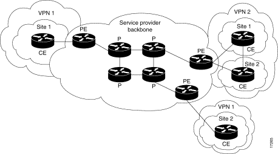

# AN Lab 1 - MPLS

#### Artem Abramov SNE19


## 1. Preparation

### a. Select a virtual routing solution that you would like to try. For example (Mikrotik, vyos, Pfsense).

I will be using Cisco 7200.

### b. GNS3 already have a template for these routers (Mikrotik, vyos, Pfsense), try to use these template as it will save you a lot of time and troubleshooting.

Installing the Cisco 7200 image took some effort. A friend shared the system image with me, but getting it to work with GNS3 took a bit more effort. GNS3 comes with an appliance template for Cisco 7200, it is availiable for download from

  1. Github at https://raw.githubusercontent.com/GNS3/gns3-registry/master/appliances/cisco-7200.gns3a
  2. GNS3 Marketplace at https://gns3.com/marketplace/appliances

It is shown below for completeness:
```
$ cat cisco-7200.gns3a.official
{
    "name": "Cisco 7200",
    "category": "router",
    "description": "Cisco 7200 Router",
    "vendor_name": "Cisco",
    "vendor_url": "http://www.cisco.com",
    "documentation_url": "http://www.cisco.com/c/en/us/products/routers/7200-series-routers/index.html",
    "product_name": "7200",
    "registry_version": 3,
    "status": "experimental",
    "maintainer": "GNS3 Team",
    "maintainer_email": "developers@gns3.net",
    "dynamips": {
        "platform": "c7200",
        "ram": 512,
        "nvram": 512,
        "startup_config": "ios_base_startup-config.txt",
        "slot0": "C7200-IO-FE",
        "midplane": "vxr",
        "npe": "npe-400"
    },
    "images": [
        {
            "filename": "c7200-adventerprisek9-mz.124-24.T5.image",
            "version": "124-24.T5",
            "md5sum": "6b89d0d804e1f2bb5b8bda66b5692047",
            "filesize": 102345240
        }
    ],
    "versions": [
        {
            "name": "124-24.T5",
            "idlepc": "0x606df838",
            "images": {
                "image": "c7200-adventerprisek9-mz.124-24.T5.image"
            }
        }
    ]
}
```

The Cisco 7200 image file I had looked as below:
```
$ ls -la c7200-advipservicesk9-mz.152-4.S5.bin 
-rw-r--r-- 1 artem artem 34783116 Oct 20 21:08 c7200-advipservicesk9-mz.152-4.S5.bin
$ md5sum c7200-advipservicesk9-mz.152-4.S5.bin
c07432e186715bbb6d2db20786517d91  c7200-advipservicesk9-mz.152-4.S5.bin
```

Using this information I created a new appliance file that I imported into GNS3, the file is shown below for completeness:
```
$ cat cisco-7200.gns3a
{
    "name": "Cisco 7200 custom",
    "category": "router",
    "description": "Cisco 7200 Router",
    "vendor_name": "Cisco",
    "vendor_url": "http://www.cisco.com",
    "documentation_url": "http://www.cisco.com/c/en/us/products/routers/7200-series-routers/index.html",
    "product_name": "7200",
    "registry_version": 3,
    "status": "experimental",
    "maintainer": "GNS3 Team",
    "maintainer_email": "developers@gns3.net",
    "dynamips": {
        "platform": "c7200",
        "ram": 512,
        "nvram": 512,
        "startup_config": "ios_base_startup-config.txt",
        "slot0": "C7200-IO-FE",
        "midplane": "vxr",
        "npe": "npe-400"
    },
    "images": [
        {
            "filename": "c7200-advipservicesk9-mz.152-4.S5.bin",
            "version": "152-4.S5",
            "md5sum": "c07432e186715bbb6d2db20786517d91",
            "filesize": 34783116
        }
    ],
    "versions": [
        {
            "name":  "152-4.S5",
            "idlepc": "0x606df838",
            "images": {
                "image": "c7200-advipservicesk9-mz.152-4.S5.bin"
            }
        }
    ]
}
```

### c. Try to draw a network scheme before you start the lab. This will help you in the deployment phase.

### d. The network scheme should include at least 2 hosts and 3 routers, each one of them has a different subnet, and the routers should be able to reach each other (for example a bus topology with dynamic routing).

My network scheme is shown below:


## 2. Deployment

I will re-implement the network scheme shown above with Cisco routers instead of Mikrotik and then continue with deployment.

Briefly the process was:

1. Configure ip on interface (repeat similarly for each interface) 
   1. `R2(config)#interface e1/1` 
   2. `R2(config-if)#ip addr 10.2.0.1 255.255.255.0`
2. Check ip config 
   1. `R2#show ip interface brief`
3. Configure ospf process 
   1. `R2(config)#router ospf 1`
4. Configure router-id 
   1. `R2(config-router)#router-id 255.255.255.2`
5. Configure ospf on all interfaces 
   1. `R2(config-router)#network 0.0.0.0 255.255.255.255 area 0`
6. Restart OSPF process
   1. `clear ip ospf process`
7. Check ospf process 
   1. `R2# show ip ospf `
8. Check routes 
   1. `R2# show ip route`


Below is the sample configuration output for router R1:

```
R1#show run
Building configuration...

Current configuration : 1378 bytes
!
! Last configuration change at 19:09:32 UTC Wed Oct 23 2019
!
version 15.2
service timestamps debug datetime msec
service timestamps log datetime msec
!
hostname R1
!
boot-start-marker
boot-end-marker
!
!
!
no aaa new-model
no ip icmp rate-limit unreachable
ip cef
!
!
!
!
!         
!         
no ip domain lookup
no ipv6 cef
!         
!         
multilink bundle-name authenticated
!         
!         
!         
!         
!         
!         
!         
!         
!         
ip tcp synwait-time 5
!         
!         
!         
!         
!         
!         
!         
!         
!         
!         
!         
!         
interface FastEthernet0/0
 no ip address
 shutdown 
 duplex full
!         
interface Ethernet1/0
 no ip address
 shutdown 
 duplex full
!         
interface Ethernet1/1
 ip address 10.2.0.2 255.255.255.0
 duplex full
!         
interface Ethernet1/2
 ip address 10.8.0.1 255.255.255.0
 duplex full
!         
interface Ethernet1/3
 no ip address
 shutdown 
 duplex full
!         
interface Ethernet1/4
 no ip address
 shutdown 
 duplex full
!         
interface Ethernet1/5
 no ip address
 shutdown 
 duplex full
!         
interface Ethernet1/6
 no ip address
 shutdown 
 duplex full
!         
interface Ethernet1/7
 ip address 10.1.0.2 255.255.255.0
 duplex full
!         
router ospf 1
 router-id 255.255.255.1
 network 0.0.0.0 255.255.255.255 area 0
!         
ip forward-protocol nd
!         
!         
no ip http server
no ip http secure-server
!         
!         
!         
!         
control-plane
!         
!         
line con 0
 exec-timeout 0 0
 privilege level 15
 logging synchronous
 stopbits 1
line aux 0
 exec-timeout 0 0
 privilege level 15
 logging synchronous
 stopbits 1
line vty 0 4
 login    
!         
!         
end       
```


Interface configuration for R2 is below:

```
interface FastEthernet0/0
 no ip address
 shutdown 
 duplex full
!         
interface Ethernet1/0
 no ip address
 shutdown 
 duplex full
!         
interface Ethernet1/1
 ip address 10.2.0.1 255.255.255.0
 duplex full
!         
interface Ethernet1/2
 ip address 10.7.0.1 255.255.255.0
 duplex full
!         
interface Ethernet1/3
 no ip address
 shutdown 
 duplex full
!         
interface Ethernet1/4
 no ip address
 shutdown 
 duplex full
!         
interface Ethernet1/5
 no ip address
 shutdown 
 duplex full
!         
interface Ethernet1/6
 ip address 10.3.0.1 255.255.255.0
 duplex full
!         
interface Ethernet1/7
 ip address 10.1.0.1 255.255.255.0
 duplex full
!
```


Interface configuration for R3 is below:

```
interface FastEthernet0/0
 no ip address
 shutdown 
 duplex full
!         
interface Ethernet1/0
 no ip address
 shutdown 
 duplex full
!         
interface Ethernet1/1
 no ip address
 shutdown 
 duplex full
!         
interface Ethernet1/2
 ip address 10.6.0.1 255.255.255.0 
 duplex full
!         
interface Ethernet1/3
 no ip address
 shutdown 
 duplex full
!         
interface Ethernet1/4
 no ip address
 shutdown 
 duplex full
!         
interface Ethernet1/5
 ip address 10.4.0.2 255.255.255.0 
 duplex full
!         
interface Ethernet1/6
 ip address 10.3.0.2 255.255.255.0 
 duplex full  
!         
interface Ethernet1/7
 no ip address
 shutdown 
 duplex full
```


Interface configuration for R4 is below:

```
interface FastEthernet0/0
 no ip address
 shutdown 
 duplex full
!         
interface Ethernet1/0
 no ip address
 shutdown 
 duplex full
!         
interface Ethernet1/1
 ip address 10.2.0.3 255.255.255.0
 duplex full
!         
interface Ethernet1/2
 ip address 10.5.0.1 255.255.255.0
 duplex full
!         
interface Ethernet1/3
 no ip address
 shutdown 
 duplex full
!         
interface Ethernet1/4
 no ip address
 shutdown 
 duplex full
!         
interface Ethernet1/5
 ip address 10.4.0.1 255.255.255.0
 duplex full
!         
interface Ethernet1/6
 no ip address
 shutdown 
 duplex full
!         
interface Ethernet1/7
 no ip address
 shutdown 
 duplex full
```


The final deployment looks as below:


sources:

1. https://www.cisco.com/c/en/us/td/docs/ios-xml/ios/iproute_ospf/configuration/xe-16/iro-xe-16-book/iro-cfg.html#GUID-51A06D7A-7099-453C-A9FD-34CE45080796
2. https://www.dummies.com/programming/networking/cisco-networking-all-in-one-for-dummies-cheat-sheet/
3. Cisco OSPF cheatsheet: https://packetlife.net/media/library/10/OSPF.pdf

An interesting presentation by Radia Perlman related to network layers (MPLS is described as connection-oriented datagram protocol)  : https://archive.nanog.org/meetings/nanog34/presentations/perlman.routers.pdf

### a. Configure MPLS domain on your OSPF network, first without authentication.

Configuration and description of MPLS for Cisco devices can be found at  a number of sources:

1. MPLS FAQ - https://www.cisco.com/c/en/us/support/docs/multiprotocol-label-switching-mpls/mpls/4649-mpls-faq-4649.html
2. Detailed MPLS configuration guide: https://www.cisco.com/c/en/us/td/docs/switches/lan/catalyst6500/ios/12-2SX/configuration/guide/book/pfc3mpls.pdf
3. Excellent introduction to MPLS with Cisco MPLS and TE related commands: https://www.cisco.com/c/dam/global/fr_ca/training-events/pdfs/Intro_to_mpls.pdf
4. Cisco MPLS cheatsheet: https://packetlife.net/media/library/18/Frame_Mode_MPLS.pdf
5. Configuring MPLS using OSPF (not 100% useful, but interesting): https://www.cisco.com/c/en/us/support/docs/multiprotocol-label-switching-mpls/mpls/13736-mplsospf.html

Labels can be distributed with BGP, LDP, RSVP. If traffic engineering is required the IGP protocol must be link-state based such as OSPF or IS-IS, because the MPLS enabled router must have a picture of the entire network.

Label range is theoretically from 0 through 1048575 (2**20 - 1). Label values 0-15 are reserved. Values 0-3 are already defined and values 4-15 are reserved for future use.

LDP uses TCP port 646.

To set up MPLS on Cisco the following steps should be taken:

1. Enable Cisco Express Forwarding
   1. `R1(config)#ip cef`
2. Choose an interface (must be done for all interfaces with MPLS)
   1. `R1(config)#interface e1/7`
3. Configure MPLS hop-by-hop forwarding
   1. `R1(config-if)#mpls ip`
4. After setting up the necessary interfaces configure use of LDP for label distribution
   1. `R1(config)#mpls label protocol ldp `
5. Check interfaces
   1. `R1#show mpls interfaces `
6. Check labels
   1. `R1#show mpls forwarding-table `


Output from R1 for `R1#show mpls interfaces ` is shown below:

```
R1#show mpls interfaces 
Interface              IP            Tunnel   BGP Static Operational
Ethernet1/1            Yes (ldp)     No       No  No     Yes        
Ethernet1/2            Yes (ldp)     No       No  No     Yes        
Ethernet1/7            Yes (ldp)     No       No  No     Yes 
```

Output from R1 for `R1#show mpls forwarding-table` is shown below:

```
R1#show mpls forwarding-table 
Local      Outgoing   Prefix           Bytes Label   Outgoing   Next Hop    
Label      Label      or Tunnel Id     Switched      interface              
16         Pop Label  10.3.0.0/24      0             Et1/7      10.1.0.1    
           Pop Label  10.3.0.0/24      0             Et1/1      10.2.0.1    
17         Pop Label  10.7.0.0/24      0             Et1/7      10.1.0.1    
           Pop Label  10.7.0.0/24      0             Et1/1      10.2.0.1    
18         Pop Label  10.4.0.0/24      0             Et1/1      10.2.0.3    
19         Pop Label  10.5.0.0/24      0             Et1/1      10.2.0.3    
20         19         10.6.0.0/24      0             Et1/7      10.1.0.1    
           19         10.6.0.0/24      0             Et1/1      10.2.0.1    
           18         10.6.0.0/24      0             Et1/1      10.2.0.3
```


Output for the two commands from R2 is shown below:

```
R2#show mpls interfaces 
Interface              IP            Tunnel   BGP Static Operational
Ethernet1/1            Yes (ldp)     No       No  No     Yes        
Ethernet1/2            Yes (ldp)     No       No  No     Yes        
Ethernet1/6            Yes (ldp)     No       No  No     Yes        
Ethernet1/7            Yes (ldp)     No       No  No     Yes        
R2#
R2#show mpls forwarding-table 
Local      Outgoing   Prefix           Bytes Label   Outgoing   Next Hop    
Label      Label      or Tunnel Id     Switched      interface              
16         Pop Label  10.8.0.0/24      0             Et1/7      10.1.0.2    
           Pop Label  10.8.0.0/24      1224          Et1/1      10.2.0.2    
17         Pop Label  10.4.0.0/24      0             Et1/1      10.2.0.3    
           Pop Label  10.4.0.0/24      0             Et1/6      10.3.0.2    
18         Pop Label  10.5.0.0/24      0             Et1/1      10.2.0.3    
19         Pop Label  10.6.0.0/24      0             Et1/6      10.3.0.2 
```

R2 always pops the label because it is always the second to last router to any network.


Output for the two command from R3 is shown below:

```
R3#show mpls interfaces 
Interface              IP            Tunnel   BGP Static Operational
Ethernet1/2            Yes (ldp)     No       No  No     Yes        
Ethernet1/5            Yes (ldp)     No       No  No     Yes        
Ethernet1/6            Yes (ldp)     No       No  No     Yes        
R3#
R3#show mpls forwarding-table 
Local      Outgoing   Prefix           Bytes Label   Outgoing   Next Hop    
Label      Label      or Tunnel Id     Switched      interface              
16         Pop Label  10.1.0.0/24      0             Et1/6      10.3.0.1    
17         Pop Label  10.2.0.0/24      0             Et1/6      10.3.0.1    
           Pop Label  10.2.0.0/24      0             Et1/5      10.4.0.1    
18         Pop Label  10.5.0.0/24      0             Et1/5      10.4.0.1    
19         Pop Label  10.7.0.0/24      0             Et1/6      10.3.0.1    
20         16         10.8.0.0/24      0             Et1/6      10.3.0.1    
           20         10.8.0.0/24      0             Et1/5      10.4.0.1 
```


Finally output for R4 is shown below:

```
R4#show mpls interfaces 
Interface              IP            Tunnel   BGP Static Operational
Ethernet1/1            Yes (ldp)     No       No  No     Yes        
Ethernet1/2            Yes (ldp)     No       No  No     Yes        
Ethernet1/5            Yes (ldp)     No       No  No     Yes        
R4#
R4#show mpls forwarding-table 
Local      Outgoing   Prefix           Bytes Label   Outgoing   Next Hop    
Label      Label      or Tunnel Id     Switched      interface              
16         Pop Label  10.1.0.0/24      0             Et1/1      10.2.0.1    
           Pop Label  10.1.0.0/24      0             Et1/1      10.2.0.2    
17         Pop Label  10.3.0.0/24      0             Et1/1      10.2.0.1    
           Pop Label  10.3.0.0/24      0             Et1/5      10.4.0.2    
18         Pop Label  10.6.0.0/24      0             Et1/5      10.4.0.2    
19         Pop Label  10.7.0.0/24      0             Et1/1      10.2.0.1    
20         Pop Label  10.8.0.0/24      0             Et1/1      10.2.0.2
```

Similarly to R2, R4 always pops the label.

Running ping from `PC-2` (10.8.0.2) to `PC-1` (10.6.0.2) and monitoring the link from R1 to ethernet-hub we can see that the MPLS header is appended at R1 as shown in wireshark below (the packet is selected):

![-Standard input [R1 Ethernet1-1 to ethernet-hub Ethernet1]_444](AN-Lab-2-mpls.assets/-Standard%20input%20%5BR1%20Ethernet1-1%20to%20ethernet-hub%20Ethernet1%5D_444.png)


### b. Enable authentication (what kind of authentication did you use?)

MPLS LDP messages (used for discovery, session control, advertisement of labels, and notification  messages) are exchanged between LDP peers via two channels:  

1. LDP discovery messages are transmitted as User Datagram Protocol (UDP) packets to the well-known LDP port.
2.  Session, advertisement, and notification messages are exchanged through a TCP connection established between two LDP peers.  	

The MD5 Session Authentication feature found in Cisco allows an LDP session to be password-protected. 

There are multiple commands to configure authentication. The simplest is configuring the password between each LDP peer based on the peer's LDP Identity (the id can be discovered with `show mpls ldp neighbor ` and is just the highest IP network configured on the neighboring router). This approach is described here: https://www.cisco.com/c/dam/en/us/td/docs/ios/12_0/12_0sy/feature/guide/md5orig.pdf

The MD5 Lossless Authentication setup (advanced setup) are covered in https://www.cisco.com/c/en/us/td/docs/ios/ios_xe/mpls/configuration/guide/convert/mp_ias_and_csc_book_xe/mp_ldp_lossless_md5_xe.pdf A particularly interesting section is `The Evolution of MPLS LDP MD5 Password Features` which is quoted below for completeness:

```
The initial version of LDP MD5 protection allowed authentication to be enabled between two LDP peers and each segment sent on the TCP connection was verified between the peers. Authentication was configured on both LDP peers using the same password; otherwise, the peer session was not established. The mpls ldp neighbor command was issued with the password keyword. When MD5 protection was enabled, the router tore down the existing LDP sessions and established new sessions with the neighbor router.

An improved MD5 protection feature, called MPLS—LDP MD5 Global Configuration, was later introduced that allowed LDP MD5 to be enabled globally instead of on a per-peer basis. Using this feature, password requirements for a set of LDP neighbors could be configured. The MPLS LDP MD5 Global Configuration feature also improved the ability to maintain the LDP session. The LDP session with a peer was not automatically torn down when the password for that peer was changed. The new password was implemented the next time an LDP session was established with the peer.

The MPLS LDP—Lossless MD5 Session Authentication feature is based on the MPLS LDP MD5 Global Configuration feature. However, the MPLS LDP—Lossless MD5 Session Authentication feature provides the following enhancements:
•Activate or change LDP MD5 session authentication without interrupting the LDP session.
•Configure multiple passwords, so one password can be used now and other passwords later.
•Configure asymmetric passwords, which allows one password to be used for incoming TCP segments and a different password to be used for outgoing TCP segments.
•Configure passwords so that they overlap for a period of time. This functionality is beneficial when the clocks on two LSRs are not synchronized. 

These enhancements are available by using the key-chain command, which allows different key strings to be used at different times according to the keychain configuration.
```


The approach chosen for this lab is to force MPLS password authentication based on access-list. This means adding neighboring routers (their IP addresses) to an access-list and configuring the password for the access-list. This is described here: https://www.cisco.com/c/en/us/td/docs/ios/mpls/configuration/guide/convert/mp_ldp_book/mp_ldp_md5_global.html Under the section  `Configuring an LDP MD5 Password for LDP Sessions with a Selected Group of Peers `.

On each router I performed the same sequence of commands as shown below:

1. Setup an access-list to match any neighboring router
   1. `R1(config)#access-list 10 permit any `
2. Require password for any LDP communication
   1. `R1(config)#mpls ldp password required for 10`
3. Set the value of the password
   1. `R1(config)#mpls ldp password option 1 for 10 artemldp`

After setting these options, debug output started showing errors as below:

```
*Oct 28 06:48:06.389: %TCP-6-BADAUTH: No MD5 digest from 10.5.0.1(646) to 10.8.0.1(16178) tableid - 0
```

Or (when I mistyped a password on one router)

```
*Oct 28 06:48:16.989: %TCP-6-BADAUTH: Invalid MD5 digest from 10.5.0.1(646) to 10.8.0.1(23386) (RST) tableid - 0
```

After configuring the other routers in the same manner (using the same password) the resulting debug messages were as shown below:

```
*Oct 28 06:48:33.029: %LDP-5-NBRCHG: LDP Neighbor 10.5.0.1:0 (2) is UP
*Oct 28 06:49:34.051: %LDP-5-NBRCHG: LDP Neighbor 10.7.0.1:0 (2) is UP
```

Its possible to verify in wireshark that indeed now the router generates an MD5 digest for every segment sent on the TCP connection and checks for MD5 digest for every segment that it receives over the TCP connection. The MD5 digest can be seen in wireshark as shown below:

 ![Capturing from Standard input [R2 Ethernet1-7 to R1 Ethernet1-7]_445](AN-Lab-2-mpls.assets/Capturing%20from%20Standard%20input%20%5BR2%20Ethernet1-7%20to%20R1%20Ethernet1-7%5D_445.png)


For completeness below is the current configuration of router R4:

```
R4#show run
Building configuration...

Current configuration : 1532 bytes
!
! Last configuration change at 06:47:14 UTC Mon Oct 28 2019
!
version 15.2
service timestamps debug datetime msec
service timestamps log datetime msec
!
hostname R4
!
boot-start-marker
boot-end-marker
!
!
!
no aaa new-model
no ip icmp rate-limit unreachable
ip cef
!
!
!
!
!         
!         
no ip domain lookup
no ipv6 cef
!         
!         
mpls label protocol ldp
mpls ldp password required for 10
mpls ldp password option 1 for 10 artemldp
multilink bundle-name authenticated
!         
!         
!         
!         
!         
!         
!         
!         
!         
ip tcp synwait-time 5
!         
!         
!         
!         
!         
!         
!         
!         
!         
!         
!         
!         
interface FastEthernet0/0
 no ip address
 shutdown 
 duplex full
!         
interface Ethernet1/0
 no ip address
 shutdown 
 duplex full
!         
interface Ethernet1/1
 ip address 10.2.0.3 255.255.255.0
 duplex full
 mpls ip  
!         
interface Ethernet1/2
 ip address 10.5.0.1 255.255.255.0
 duplex full
 mpls ip  
!         
interface Ethernet1/3
 no ip address
 shutdown 
 duplex full
!         
interface Ethernet1/4
 no ip address
 shutdown 
 duplex full
!         
interface Ethernet1/5
 ip address 10.4.0.1 255.255.255.0
 duplex full
 mpls ip  
!         
interface Ethernet1/6
 no ip address
 shutdown 
 duplex full
!         
interface Ethernet1/7
 no ip address
 shutdown 
 duplex full
!         
router ospf 1
 router-id 255.255.255.4
 network 0.0.0.0 255.255.255.255 area 0
!         
ip forward-protocol nd
!         
!         
no ip http server
no ip http secure-server
!         
access-list 10 permit any
!         
!         
!         
control-plane
!         
!         
line con 0
 exec-timeout 0 0
 privilege level 15
 logging synchronous
 stopbits 1
line aux 0
 exec-timeout 0 0
 privilege level 15
 logging synchronous
 stopbits 1
line vty 0 4
 login    
!         
!         
end       
```


## 3. Verification

### a. Show your LDP neighbors.

Neighbours for R1 are shown below:

```
R1#show mpls ldp neighbor 
    Peer LDP Ident: 10.7.0.1:0; Local LDP Ident 10.8.0.1:0
	TCP connection: 10.7.0.1.646 - 10.8.0.1.29845
	State: Oper; Msgs sent/rcvd: 94/93; Downstream
	Up time: 01:12:22
	LDP discovery sources:
	  Ethernet1/1, Src IP addr: 10.2.0.1
	  Ethernet1/7, Src IP addr: 10.1.0.1
        Addresses bound to peer LDP Ident:
          10.2.0.1        10.7.0.1        10.3.0.1        10.1.0.1        
    Peer LDP Ident: 10.5.0.1:0; Local LDP Ident 10.8.0.1:0
	TCP connection: 10.5.0.1.646 - 10.8.0.1.26032
	State: Oper; Msgs sent/rcvd: 91/91; Downstream
	Up time: 01:10:48
	LDP discovery sources:
	  Ethernet1/1, Src IP addr: 10.2.0.3
        Addresses bound to peer LDP Ident:
          10.2.0.3        10.5.0.1        10.4.0.1 
```

Neighbours for R2 are shown below:

```
R2#show mpls ldp neighbor 
    Peer LDP Ident: 10.8.0.1:0; Local LDP Ident 10.7.0.1:0
	TCP connection: 10.8.0.1.29845 - 10.7.0.1.646
	State: Oper; Msgs sent/rcvd: 94/95; Downstream
	Up time: 01:13:35
	LDP discovery sources:
	  Ethernet1/1, Src IP addr: 10.2.0.2
	  Ethernet1/7, Src IP addr: 10.1.0.2
        Addresses bound to peer LDP Ident:
          10.2.0.2        10.8.0.1        10.1.0.2        
    Peer LDP Ident: 10.4.0.2:0; Local LDP Ident 10.7.0.1:0
	TCP connection: 10.4.0.2.646 - 10.7.0.1.33446
	State: Oper; Msgs sent/rcvd: 94/94; Downstream
	Up time: 01:12:41
	LDP discovery sources:
	  Ethernet1/6, Src IP addr: 10.3.0.2
        Addresses bound to peer LDP Ident:
          10.4.0.2        10.3.0.2        10.6.0.1        
    Peer LDP Ident: 10.5.0.1:0; Local LDP Ident 10.7.0.1:0
	TCP connection: 10.5.0.1.646 - 10.7.0.1.61003
	State: Oper; Msgs sent/rcvd: 93/92; Downstream
	Up time: 01:11:56
	LDP discovery sources:
          Ethernet1/1, Src IP addr: 10.2.0.3
        Addresses bound to peer LDP Ident:
          10.2.0.3        10.5.0.1        10.4.0.1 
```


Neighbours for R3 are shown below:

```
R3#show mpls ldp neighbor 
    Peer LDP Ident: 10.7.0.1:0; Local LDP Ident 10.4.0.2:0
	TCP connection: 10.7.0.1.33446 - 10.4.0.2.646
	State: Oper; Msgs sent/rcvd: 94/95; Downstream
	Up time: 01:13:14
	LDP discovery sources:
	  Ethernet1/6, Src IP addr: 10.3.0.1
        Addresses bound to peer LDP Ident:
          10.2.0.1        10.7.0.1        10.3.0.1        10.1.0.1        
    Peer LDP Ident: 10.5.0.1:0; Local LDP Ident 10.4.0.2:0
	TCP connection: 10.5.0.1.59039 - 10.4.0.2.646
	State: Oper; Msgs sent/rcvd: 93/93; Downstream
	Up time: 01:12:33
	LDP discovery sources:
	  Ethernet1/5, Src IP addr: 10.4.0.1
        Addresses bound to peer LDP Ident:
          10.2.0.3        10.5.0.1        10.4.0.1
```


Neighbours for R4 are shown below:

```
R4#show mpls ldp neighbor 
    Peer LDP Ident: 10.8.0.1:0; Local LDP Ident 10.5.0.1:0
	TCP connection: 10.8.0.1.26032 - 10.5.0.1.646
	State: Oper; Msgs sent/rcvd: 94/94; Downstream
	Up time: 01:13:31
	LDP discovery sources:
	  Ethernet1/1, Src IP addr: 10.2.0.2
        Addresses bound to peer LDP Ident:
          10.2.0.2        10.8.0.1        10.1.0.2        
    Peer LDP Ident: 10.4.0.2:0; Local LDP Ident 10.5.0.1:0
	TCP connection: 10.4.0.2.646 - 10.5.0.1.59039
	State: Oper; Msgs sent/rcvd: 94/94; Downstream
	Up time: 01:13:31
	LDP discovery sources:
	  Ethernet1/5, Src IP addr: 10.4.0.2
        Addresses bound to peer LDP Ident:
          10.4.0.2        10.3.0.2        10.6.0.1        
    Peer LDP Ident: 10.7.0.1:0; Local LDP Ident 10.5.0.1:0
	TCP connection: 10.7.0.1.61003 - 10.5.0.1.646
	State: Oper; Msgs sent/rcvd: 94/94; Downstream
	Up time: 01:13:27
	LDP discovery sources:
	  Ethernet1/1, Src IP addr: 10.2.0.1
        Addresses bound to peer LDP Ident:
          10.2.0.1        10.7.0.1        10.3.0.1        10.1.0.1  
```


### b. Show your local LDP bindings and remote LDP peer labels

### c. Show your MPLS labels

Because the MPLS labels show up in the output of `show mpls ldp bindings ` I decided to join together sections `b` and `c`. More information on the MPLS labels can also be found in the next section `d` which shows the forwarding table used by each router.

For router R1 summary is shown below:

```
R1#show mpls ldp bindings 
  lib entry: 10.1.0.0/24, rev 2
	local binding:  label: imp-null
	remote binding: lsr: 10.7.0.1:0, label: imp-null
	remote binding: lsr: 10.5.0.1:0, label: 16
  lib entry: 10.2.0.0/24, rev 4
	local binding:  label: imp-null
	remote binding: lsr: 10.7.0.1:0, label: imp-null
	remote binding: lsr: 10.5.0.1:0, label: imp-null
  lib entry: 10.3.0.0/24, rev 6
	local binding:  label: 16
	remote binding: lsr: 10.7.0.1:0, label: imp-null
	remote binding: lsr: 10.5.0.1:0, label: 17
  lib entry: 10.4.0.0/24, rev 12
	local binding:  label: 18
	remote binding: lsr: 10.7.0.1:0, label: 17
	remote binding: lsr: 10.5.0.1:0, label: imp-null
  lib entry: 10.5.0.0/24, rev 14
	local binding:  label: 19
	remote binding: lsr: 10.7.0.1:0, label: 18
	remote binding: lsr: 10.5.0.1:0, label: imp-null
  lib entry: 10.6.0.0/24, rev 16
	local binding:  label: 20
	remote binding: lsr: 10.7.0.1:0, label: 19
    remote binding: lsr: 10.5.0.1:0, label: 18
  lib entry: 10.7.0.0/24, rev 8
    local binding:  label: 17
    remote binding: lsr: 10.7.0.1:0, label: imp-null
    remote binding: lsr: 10.5.0.1:0, label: 19
  lib entry: 10.8.0.0/24, rev 10
    local binding:  label: imp-null
    remote binding: lsr: 10.7.0.1:0, label: 16
    remote binding: lsr: 10.5.0.1:0, label: 20
```


For router R2 summary is shown below:

```
R2#show mpls ldp bindings 
  lib entry: 10.1.0.0/24, rev 2
	local binding:  label: imp-null
	remote binding: lsr: 10.8.0.1:0, label: imp-null
	remote binding: lsr: 10.4.0.2:0, label: 16
	remote binding: lsr: 10.5.0.1:0, label: 16
  lib entry: 10.2.0.0/24, rev 4
	local binding:  label: imp-null
	remote binding: lsr: 10.8.0.1:0, label: imp-null
	remote binding: lsr: 10.4.0.2:0, label: 17
	remote binding: lsr: 10.5.0.1:0, label: imp-null
  lib entry: 10.3.0.0/24, rev 6
	local binding:  label: imp-null
	remote binding: lsr: 10.8.0.1:0, label: 16
	remote binding: lsr: 10.4.0.2:0, label: imp-null
	remote binding: lsr: 10.5.0.1:0, label: 17
  lib entry: 10.4.0.0/24, rev 12
	local binding:  label: 17
	remote binding: lsr: 10.8.0.1:0, label: 18
	remote binding: lsr: 10.4.0.2:0, label: imp-null
	remote binding: lsr: 10.5.0.1:0, label: imp-null
  lib entry: 10.5.0.0/24, rev 14
	local binding:  label: 18
	remote binding: lsr: 10.8.0.1:0, label: 19
    remote binding: lsr: 10.4.0.2:0, label: 18
    remote binding: lsr: 10.5.0.1:0, label: imp-null
  lib entry: 10.6.0.0/24, rev 16
    local binding:  label: 19
    remote binding: lsr: 10.8.0.1:0, label: 20
    remote binding: lsr: 10.4.0.2:0, label: imp-null
    remote binding: lsr: 10.5.0.1:0, label: 18
  lib entry: 10.7.0.0/24, rev 8
    local binding:  label: imp-null
    remote binding: lsr: 10.8.0.1:0, label: 17
    remote binding: lsr: 10.4.0.2:0, label: 19
    remote binding: lsr: 10.5.0.1:0, label: 19
  lib entry: 10.8.0.0/24, rev 10
    local binding:  label: 16
    remote binding: lsr: 10.8.0.1:0, label: imp-null
    remote binding: lsr: 10.4.0.2:0, label: 20
    remote binding: lsr: 10.5.0.1:0, label: 20
```

For router R3 summary is shown below:

```
R3#show mpls ldp bindings 
  lib entry: 10.1.0.0/24, rev 2
	local binding:  label: 16
	remote binding: lsr: 10.7.0.1:0, label: imp-null
	remote binding: lsr: 10.5.0.1:0, label: 16
  lib entry: 10.2.0.0/24, rev 4
	local binding:  label: 17
	remote binding: lsr: 10.7.0.1:0, label: imp-null
	remote binding: lsr: 10.5.0.1:0, label: imp-null
  lib entry: 10.3.0.0/24, rev 6
	local binding:  label: imp-null
	remote binding: lsr: 10.7.0.1:0, label: imp-null
	remote binding: lsr: 10.5.0.1:0, label: 17
  lib entry: 10.4.0.0/24, rev 8
	local binding:  label: imp-null
	remote binding: lsr: 10.7.0.1:0, label: 17
	remote binding: lsr: 10.5.0.1:0, label: imp-null
  lib entry: 10.5.0.0/24, rev 10
	local binding:  label: 18
	remote binding: lsr: 10.7.0.1:0, label: 18
	remote binding: lsr: 10.5.0.1:0, label: imp-null
  lib entry: 10.6.0.0/24, rev 16
	local binding:  label: imp-null
	remote binding: lsr: 10.7.0.1:0, label: 19
    remote binding: lsr: 10.5.0.1:0, label: 18
  lib entry: 10.7.0.0/24, rev 12
    local binding:  label: 19
    remote binding: lsr: 10.7.0.1:0, label: imp-null
    remote binding: lsr: 10.5.0.1:0, label: 19
  lib entry: 10.8.0.0/24, rev 14
    local binding:  label: 20
    remote binding: lsr: 10.7.0.1:0, label: 16
    remote binding: lsr: 10.5.0.1:0, label: 20
```

For router R4 summary is shown below:

```
R4#show mpls ldp bindings 
  lib entry: 10.1.0.0/24, rev 2
	local binding:  label: 16
	remote binding: lsr: 10.8.0.1:0, label: imp-null
	remote binding: lsr: 10.4.0.2:0, label: 16
	remote binding: lsr: 10.7.0.1:0, label: imp-null
  lib entry: 10.2.0.0/24, rev 4
	local binding:  label: imp-null
	remote binding: lsr: 10.8.0.1:0, label: imp-null
	remote binding: lsr: 10.4.0.2:0, label: 17
	remote binding: lsr: 10.7.0.1:0, label: imp-null
  lib entry: 10.3.0.0/24, rev 6
	local binding:  label: 17
	remote binding: lsr: 10.8.0.1:0, label: 16
	remote binding: lsr: 10.4.0.2:0, label: imp-null
	remote binding: lsr: 10.7.0.1:0, label: imp-null
  lib entry: 10.4.0.0/24, rev 8
	local binding:  label: imp-null
	remote binding: lsr: 10.8.0.1:0, label: 18
	remote binding: lsr: 10.4.0.2:0, label: imp-null
	remote binding: lsr: 10.7.0.1:0, label: 17
  lib entry: 10.5.0.0/24, rev 10
	local binding:  label: imp-null
	remote binding: lsr: 10.8.0.1:0, label: 19
    remote binding: lsr: 10.4.0.2:0, label: 18
    remote binding: lsr: 10.7.0.1:0, label: 18
  lib entry: 10.6.0.0/24, rev 12
    local binding:  label: 18
    remote binding: lsr: 10.8.0.1:0, label: 20
    remote binding: lsr: 10.4.0.2:0, label: imp-null
    remote binding: lsr: 10.7.0.1:0, label: 19
  lib entry: 10.7.0.0/24, rev 14
    local binding:  label: 19
    remote binding: lsr: 10.8.0.1:0, label: 17
    remote binding: lsr: 10.4.0.2:0, label: 19
    remote binding: lsr: 10.7.0.1:0, label: imp-null
  lib entry: 10.8.0.0/24, rev 16
    local binding:  label: 20
    remote binding: lsr: 10.8.0.1:0, label: imp-null
    remote binding: lsr: 10.4.0.2:0, label: 20
    remote binding: lsr: 10.7.0.1:0, label: 16
```

Local and peer LDP identities are also shown here for completeness.
Summary for R1 is shown below:
```
R1#show mpls ldp neighbor  | include Peer
    Peer LDP Ident: 10.7.0.1:0; Local LDP Ident 10.8.0.1:0
    Peer LDP Ident: 10.5.0.1:0; Local LDP Ident 10.8.0.1:0
```

Summary for R2 is shown below:
```
R2#show mpls ldp neighbor  | include Peer
    Peer LDP Ident: 10.8.0.1:0; Local LDP Ident 10.7.0.1:0
    Peer LDP Ident: 10.4.0.2:0; Local LDP Ident 10.7.0.1:0
    Peer LDP Ident: 10.5.0.1:0; Local LDP Ident 10.7.0.1:0
```

Summary for R3 is shown below:
```
R3#show mpls ldp neighbor  | include Peer
    Peer LDP Ident: 10.7.0.1:0; Local LDP Ident 10.4.0.2:0
    Peer LDP Ident: 10.5.0.1:0; Local LDP Ident 10.4.0.2:0
```

Summary for R4 is shown below:
```
R4#show mpls ldp neighbor  | include Peer
    Peer LDP Ident: 10.8.0.1:0; Local LDP Ident 10.5.0.1:0
    Peer LDP Ident: 10.4.0.2:0; Local LDP Ident 10.5.0.1:0
    Peer LDP Ident: 10.7.0.1:0; Local LDP Ident 10.5.0.1:0
```


### d. Show your forwarding table

Summary for R1 is shown below:

```
R1#show mpls forwarding-table 
Local      Outgoing   Prefix           Bytes Label   Outgoing   Next Hop    
Label      Label      or Tunnel Id     Switched      interface              
16         Pop Label  10.3.0.0/24      0             Et1/7      10.1.0.1    
           Pop Label  10.3.0.0/24      0             Et1/1      10.2.0.1    
17         Pop Label  10.7.0.0/24      0             Et1/7      10.1.0.1    
           Pop Label  10.7.0.0/24      0             Et1/1      10.2.0.1    
18         Pop Label  10.4.0.0/24      0             Et1/1      10.2.0.3    
19         Pop Label  10.5.0.0/24      0             Et1/1      10.2.0.3    
20         19         10.6.0.0/24      0             Et1/7      10.1.0.1    
           19         10.6.0.0/24      0             Et1/1      10.2.0.1    
           18         10.6.0.0/24      0             Et1/1      10.2.0.3 
```

Summary for R2 is shown below:

```
R2#show mpls forwarding-table 
Local      Outgoing   Prefix           Bytes Label   Outgoing   Next Hop    
Label      Label      or Tunnel Id     Switched      interface              
16         Pop Label  10.8.0.0/24      0             Et1/7      10.1.0.2    
           Pop Label  10.8.0.0/24      1884          Et1/1      10.2.0.2    
17         Pop Label  10.4.0.0/24      0             Et1/1      10.2.0.3    
           Pop Label  10.4.0.0/24      0             Et1/6      10.3.0.2    
18         Pop Label  10.5.0.0/24      1098          Et1/1      10.2.0.3    
19         Pop Label  10.6.0.0/24      490           Et1/6      10.3.0.2 
```

Summary for R3 is shown below:

```
R3#show mpls forwarding-table 
Local      Outgoing   Prefix           Bytes Label   Outgoing   Next Hop    
Label      Label      or Tunnel Id     Switched      interface              
16         Pop Label  10.1.0.0/24      0             Et1/6      10.3.0.1    
17         Pop Label  10.2.0.0/24      0             Et1/6      10.3.0.1    
           Pop Label  10.2.0.0/24      0             Et1/5      10.4.0.1    
18         Pop Label  10.5.0.0/24      0             Et1/5      10.4.0.1    
19         Pop Label  10.7.0.0/24      306           Et1/6      10.3.0.1    
20         16         10.8.0.0/24      0             Et1/6      10.3.0.1    
           20         10.8.0.0/24      0             Et1/5      10.4.0.1 
```

Summary for R4 is shown below:

```
R4#show mpls forwarding-table 
Local      Outgoing   Prefix           Bytes Label   Outgoing   Next Hop    
Label      Label      or Tunnel Id     Switched      interface              
16         Pop Label  10.1.0.0/24      0             Et1/1      10.2.0.1    
           Pop Label  10.1.0.0/24      0             Et1/1      10.2.0.2    
17         Pop Label  10.3.0.0/24      0             Et1/1      10.2.0.1    
           Pop Label  10.3.0.0/24      0             Et1/5      10.4.0.2    
18         Pop Label  10.6.0.0/24      0             Et1/5      10.4.0.2    
19         Pop Label  10.7.0.0/24      0             Et1/1      10.2.0.1    
20         Pop Label  10.8.0.0/24      0             Et1/1      10.2.0.2 
```


### e. Show your network path from one customer edge to the other customer edge

To show the network path from one customer to another customer  I will use the traceroute tool from `client1` with IP 10.7.0.2 to `client3` with ip 10.5.0.3. To make the path more interesting I modified the topology by suspending the cable from `ethernet-hub` to `R4` as shown on the diagram below:


Below is the screenshot of running the traceroute tool on client1:

%20-%20TigerVNC_447.png)


In my network topology the Provider Edge (PE) router plays the role of the Customer Edge (CE) router. Therefore to actually answer the question and show the path from one CE to another I will run the same traceroute tool from R2 to R4 (to its customer facing interface `10.5.0.1`) as shown below:

```
R2#traceroute 10.5.0.1
Type escape sequence to abort.
Tracing the route to 10.5.0.1
VRF info: (vrf in name/id, vrf out name/id)
  1 10.3.0.2 [MPLS: Label 18 Exp 0] 16 msec 20 msec 20 msec
  2 10.4.0.1 40 msec 36 msec 40 msec
```


### f. Can you use Wireshark to see the MPLS packets?

Yes, above I have already shown multiple screenshots revealing MPLS packets in wireshark. Shown below is a ping packet with MPLS header:

![Capturing from Standard input [R2 Ethernet1-7 to R1 Ethernet1-7]_448](AN-Lab-2-mpls.assets/Capturing%20from%20Standard%20input%20%5BR2%20Ethernet1-7%20to%20R1%20Ethernet1-7%5D_448.png)


## 4. VPLS

### a. Configure VPLS between the 2 hosts edges.

Virtual Private LAN Services (VPLS) is a type of VPN. It supports connecting multiple customer sites (that are in a single bridged domain) over the MPLS network. In particular it enables enterprises to link together their Ethernet-based LANs from multiple sites via the infrastructure provided by their service provider. From the customer's perspective, the service provider's public network looks like one giant Ethernet LAN, i.e. there is no topology for VPLS.

Before configuring VPLS,  the network must already be configured with the following: 

1. Configure IP routing (with OSPF), so that PE routers can reach each other via IP
2. Configure MPLS so that label switched paths (LSP) exists between routers
3. Configure a loopback interface for originating and terminating Layer 2 traffic. This will provide Router-ID, so the PE routers must be able to access the other router's loopback interface.

VPLS configuration requires identifying peer PE routers and attaching Layer 2 circuits to the VPLS at each PE router.

Example configuration is shown below, refer to it to get the terminology clear:




1. First configure the router-ID for Layer 2
   1. `R4(config)#l2vpn` 
   2. `R4(config-l2vpn)#router-id 255.255.255.4`
2. Create virtual forwarding instance (VFI) on each participating PE device
   1. `R2(config)#l2vpn vfi context vfill0`

However the command returns: `% Unable to provision vfi` Searching google brings up this thread: https://community.cisco.com/t5/mpls/unable-to-provision-vfi/td-p/1159604 which states that VPLS is not supported on Cisco 7200. :(

Which is a real shame, because it was difficult to get this Cisco image working with GNS3 and now the whole lab has to be reconfigured to do task 4.


sources:

1. Cisco configuration updated page: https://www.cisco.com/c/en/us/td/docs/ios-xml/ios/mp_l2_vpns/configuration/xe-16/mp-l2-vpns-xe-16-book/configuring-virtual-private-lan-services.html
2. Yet another configuration guide: https://www.cisco.com/c/en/us/td/docs/ios-xml/ios/mp_l2_vpns/configuration/xe-3s/mp-l2-vpns-xe-3s-book/mp-vpls.html
3. Cisco configuring VPLS pdf book: https://www.cisco.com/c/en/us/td/docs/switches/lan/catalyst6500/ios/15-1SY/config_guide/sup2T/15_1_sy_swcg_2T/vpls.pdf
4. Configuration commands: https://www.cisco.com/c/en/us/td/docs/ios_xr_sw/iosxr_r3-7/mpls/configuration/guide/gc37vpls.html
5. Cisco configuring VPN: https://www.cisco.com/c/en/us/support/docs/multiprotocol-label-switching-mpls/mpls/13733-mpls-vpn-basic.html


### APPENDIX

R1:

```
R1#show run
Building configuration...

Current configuration : 1562 bytes
!
! Last configuration change at 12:16:44 UTC Tue Oct 29 2019
!
version 15.2
service timestamps debug datetime msec
service timestamps log datetime msec
!
hostname R1
!
boot-start-marker
boot-end-marker
!
!
!
no aaa new-model
no ip icmp rate-limit unreachable
ip cef
!
!
!
!
!         
!         
no ip domain lookup
no ipv6 cef
!         
!         
mpls label protocol ldp
mpls ldp password required for 10
mpls ldp password option 1 for 10 artemldp
multilink bundle-name authenticated
l2vpn     
 router-id 255.255.255.1
!         
!         
!         
!         
!         
!         
!         
!         
!         
!         
ip tcp synwait-time 5
!         
!         
!         
!         
!         
!         
!         
!         
!         
!         
!         
!         
interface FastEthernet0/0
 no ip address
 shutdown 
 duplex full
!         
interface Ethernet1/0
 no ip address
 shutdown 
 duplex full
!         
interface Ethernet1/1
 ip address 10.2.0.2 255.255.255.0
 duplex full
 mpls ip  
!         
interface Ethernet1/2
 ip address 10.8.0.1 255.255.255.0
 duplex full
 mpls ip  
!         
interface Ethernet1/3
 no ip address
 shutdown 
 duplex full
!         
interface Ethernet1/4
 no ip address
 shutdown 
 duplex full
!         
interface Ethernet1/5
 no ip address
 shutdown 
 duplex full
!         
interface Ethernet1/6
 no ip address
 shutdown 
 duplex full
!         
interface Ethernet1/7
 ip address 10.1.0.2 255.255.255.0
 duplex full
 mpls ip  
!         
router ospf 1
 router-id 255.255.255.1
 network 0.0.0.0 255.255.255.255 area 0
!         
ip forward-protocol nd
!         
!         
no ip http server
no ip http secure-server
!         
access-list 1 permit any
!         
!         
!         
control-plane
!         
!         
line con 0
 exec-timeout 0 0
 privilege level 15
 logging synchronous
 stopbits 1
line aux 0
 exec-timeout 0 0
 privilege level 15
 logging synchronous
 stopbits 1
line vty 0 4
 login    
!         
!         
end       
      
        
```


R2:

```
R2#show run
Building configuration...

Current configuration : 1581 bytes
!
! Last configuration change at 12:14:43 UTC Tue Oct 29 2019
!
version 15.2
service timestamps debug datetime msec
service timestamps log datetime msec
!
hostname R2
!
boot-start-marker
boot-end-marker
!
!
!
no aaa new-model
no ip icmp rate-limit unreachable
ip cef
!
!
!
!
!         
!         
no ip domain lookup
no ipv6 cef
!         
!         
mpls label protocol ldp
mpls ldp password required for 10
mpls ldp password option 1 for 10 artemldp
multilink bundle-name authenticated
l2vpn     
 router-id 255.255.255.2
!         
!         
!         
!         
!         
!         
!         
!         
!         
!         
ip tcp synwait-time 5
!         
!         
!         
!         
!         
!         
!         
!         
!         
!         
!         
!         
interface FastEthernet0/0
 no ip address
 shutdown 
 duplex full
!         
interface Ethernet1/0
 no ip address
 shutdown 
 duplex full
!         
interface Ethernet1/1
 ip address 10.2.0.1 255.255.255.0
 duplex full
 mpls ip  
!         
interface Ethernet1/2
 ip address 10.7.0.1 255.255.255.0
 duplex full
 mpls ip  
!         
interface Ethernet1/3
 no ip address
 shutdown 
 duplex full
!         
interface Ethernet1/4
 no ip address
 shutdown 
 duplex full
!         
interface Ethernet1/5
 no ip address
 shutdown 
 duplex full
!         
interface Ethernet1/6
 ip address 10.3.0.1 255.255.255.0
 duplex full
 mpls ip  
!         
interface Ethernet1/7
 ip address 10.1.0.1 255.255.255.0
 duplex full
 mpls ip  
!         
router ospf 1
 router-id 255.255.255.2
 network 0.0.0.0 255.255.255.255 area 0
!         
ip forward-protocol nd
!         
!         
no ip http server
no ip http secure-server
!         
access-list 1 permit any
!         
!         
!         
control-plane
!         
!         
line con 0
 exec-timeout 0 0
 privilege level 15
 logging synchronous
 stopbits 1
line aux 0
 exec-timeout 0 0
 privilege level 15
 logging synchronous
 stopbits 1
line vty 0 4
 login    
!         
!         
end       

   
```


R3: 

```
R3#show run
Building configuration...

Current configuration : 1565 bytes
!
! Last configuration change at 12:15:50 UTC Tue Oct 29 2019
!
version 15.2
service timestamps debug datetime msec
service timestamps log datetime msec
!
hostname R3
!
boot-start-marker
boot-end-marker
!
!
!
no aaa new-model
no ip icmp rate-limit unreachable
ip cef
!
!
!
!
!         
!         
no ip domain lookup
no ipv6 cef
!         
!         
mpls label protocol ldp
mpls ldp password required for 10
mpls ldp password option 1 for 10 artemldp
multilink bundle-name authenticated
l2vpn     
 router-id 255.255.255.3
!         
!         
!         
!         
!         
!         
!         
!         
!         
!         
ip tcp synwait-time 5
!         
!         
!         
!         
!         
!         
!         
!         
!         
!         
!         
!         
interface FastEthernet0/0
 no ip address
 shutdown 
 duplex full
!         
interface Ethernet1/0
 no ip address
 shutdown 
 duplex full
!         
interface Ethernet1/1
 no ip address
 shutdown 
 duplex full
!         
interface Ethernet1/2
 ip address 10.6.0.1 255.255.255.0
 duplex full
 mpls ip  
!         
interface Ethernet1/3
 no ip address
 shutdown 
 duplex full
!         
interface Ethernet1/4
 no ip address
 shutdown 
 duplex full
!         
interface Ethernet1/5
 ip address 10.4.0.2 255.255.255.0
 duplex full
 mpls ip  
!         
interface Ethernet1/6
 ip address 10.3.0.2 255.255.255.0
 duplex full
 mpls ip  
!         
interface Ethernet1/7
 no ip address
 shutdown 
 duplex full
!         
router ospf 1
 router-id 255.255.255.3
 network 0.0.0.0 255.255.255.255 area 0
!         
ip forward-protocol nd
!         
!         
no ip http server
no ip http secure-server
!         
access-list 10 permit any
!         
!         
!         
control-plane
!         
!         
line con 0
 exec-timeout 0 0
 privilege level 15
 logging synchronous
 stopbits 1
line aux 0
 exec-timeout 0 0
 privilege level 15
 logging synchronous
 stopbits 1
line vty 0 4
 login    
!         
!         
end     
```


R4:

```
R4#show run
Building configuration...

Current configuration : 1565 bytes
!
! Last configuration change at 12:13:01 UTC Tue Oct 29 2019
!
version 15.2
service timestamps debug datetime msec
service timestamps log datetime msec
!
hostname R4
!
boot-start-marker
boot-end-marker
!
!
!
no aaa new-model
no ip icmp rate-limit unreachable
ip cef
!
!
!
!
!         
!         
no ip domain lookup
no ipv6 cef
!         
!         
mpls label protocol ldp
mpls ldp password required for 10
mpls ldp password option 1 for 10 artemldp
multilink bundle-name authenticated
l2vpn     
 router-id 255.255.255.4
!         
!         
!         
!         
!         
!         
!         
!         
!         
!         
ip tcp synwait-time 5
!         
!         
!         
!         
!         
!         
!         
!         
!         
!         
!         
!         
interface FastEthernet0/0
 no ip address
 shutdown 
 duplex full
!         
interface Ethernet1/0
 no ip address
 shutdown 
 duplex full
!         
interface Ethernet1/1
 ip address 10.2.0.3 255.255.255.0
 duplex full
 mpls ip  
!         
interface Ethernet1/2
 ip address 10.5.0.1 255.255.255.0
 duplex full
 mpls ip  
!         
interface Ethernet1/3
 no ip address
 shutdown 
 duplex full
!         
interface Ethernet1/4
 no ip address
 shutdown 
 duplex full
!         
interface Ethernet1/5
 ip address 10.4.0.1 255.255.255.0
 duplex full
 mpls ip  
!         
interface Ethernet1/6
 no ip address
 shutdown 
 duplex full
!         
interface Ethernet1/7
 no ip address
 shutdown 
 duplex full
!         
router ospf 1
 router-id 255.255.255.4
 network 0.0.0.0 255.255.255.255 area 0
!         
ip forward-protocol nd
!         
!         
no ip http server
no ip http secure-server
!         
access-list 10 permit any
!         
!         
!         
control-plane
!         
!         
line con 0
 exec-timeout 0 0
 privilege level 15
 logging synchronous
 stopbits 1
line aux 0
 exec-timeout 0 0
 privilege level 15
 logging synchronous
 stopbits 1
line vty 0 4
 login    
!         
!         
end       
          

```

