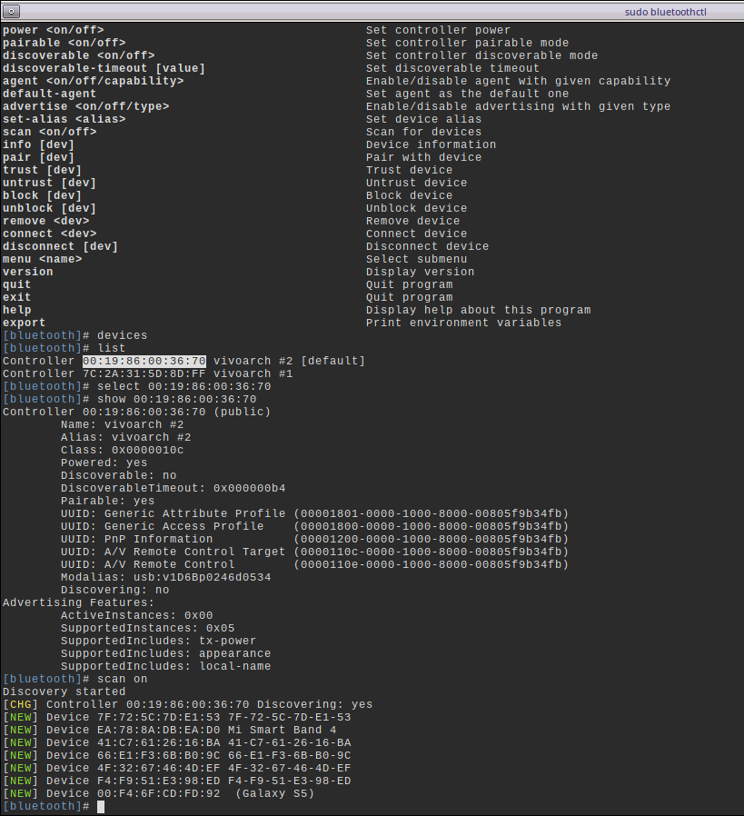
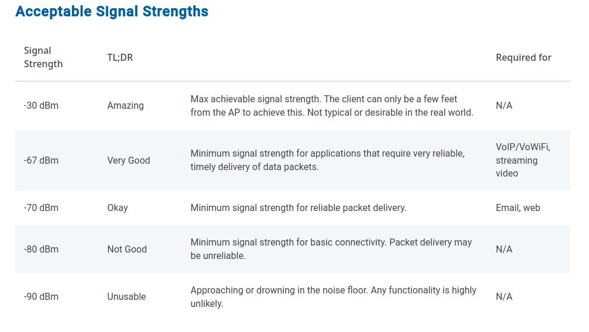
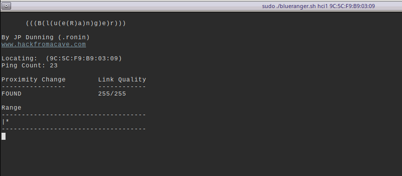
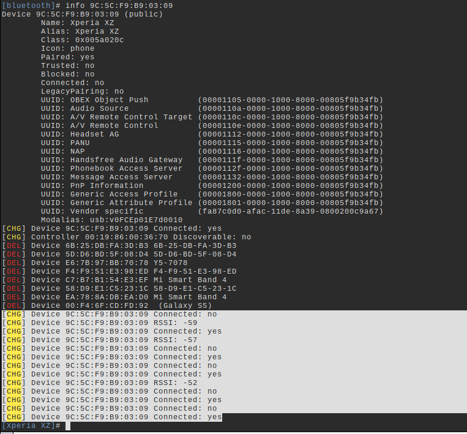

# AS Lab 1 - Bluetooth and RF

#### Artem Abramov SNE19

I decided to do the Bluetooth lab.

## 1. Bluetooth pairing security [Normal] (1 group of 2 people) 

Before bluetooth communication can be achieved, one must first pair devices. This process has been altered over the years.

### 1.1. What kind of paring methods are there? Explain how they work.
### 1.2. Pair with a device and test different ways of pairing.
### 1.3. Create a pcap of a file transfer or communication.
### 1.4. What kind of security is used and what types of encryption are used?


## 2. Android Bluetooth wearable devices [Normal] (1 group of 2 people)

The communication between a wearable device and an Android device can contain
valuable information. An Android device can enable Bluetooth debugging.

### 2.1. Can you retrieve the data that goes from the Android device to the paired device?
### 2.2 Can you say something about the security of such a connection?
### 2.3 What can you do with the packets?


## 3. Bluetooth distance measurements [Normal] (1 group of 2 people)

It can be useful to know the range of your devices. You could add functionality based
on distance.

### 3.1. Can you measure the distance with based on the bluetooth signal?

Yes, the most basic approach is using signal strength. However antennas are typically non-isotropic, so signal strength depends on the orientation of the recaiver and transmitter.

Another approach is to use ping delay. However RF travels at speed of light,so over small distance a very accurate clock would be required to detect the lag. Furthermore the ping times will vary based on CPU usage in the devices (i.e. if the networking process is stalled). Thus variations in the ping time will be rather based on processor load rather then on RF path time and there is no easy way to clear this "noise".

Better results can be achieved if using multiple fixed nodes to locate one lost node. They can map the signal strength for different modes against the position of the area. 

One method of measuring distance using RF is phase shift, however it is not really applicable to Bluetooth because it requiers at least one custom endpoint. 

The theoretical conclusion is that measuring the distane with bluetooth is possible, but not reliable.

On the practical side there is a tool called BlueRanger (included in kali linux) that uses ping to measure distance to bluetooth devices.

To get everything working I first got a broadcom USB-Bluetooth dongle. Then installed packages recommended on arch wiki https://wiki.archlinux.org/index.php/Bluetooth:
```
# sudo pacman -S bluez bluez-utils
```

I did `rfkill list` and enabled my device:
```
# rfkill list                       
0: hci0: Bluetooth
	Soft blocked: yes
	Hard blocked: no
1: phy0: Wireless LAN
	Soft blocked: no
	Hard blocked: no
5: hci1: Bluetooth
	Soft blocked: no
	Hard blocked: no
```

My device interface is `hci1` (I guessed by running rfkill with and without the dongle plugged in).


Then out of interest I checked which USB device corresponded to the dongle by running `lsusb` as below:
```
# lsusb
Bus 002 Device 001: ID 1d6b:0003 Linux Foundation 3.0 root hub
Bus 001 Device 024: ID 0a5c:21ec Broadcom Corp. BCM20702A0
Bus 001 Device 004: ID 0bda:0129 Realtek Semiconductor Corp. RTS5129 Card Reader Controller
Bus 001 Device 003: ID 13d3:56a2 IMC Networks USB2.0 HD UVC WebCam
Bus 001 Device 002: ID 046d:c52f Logitech, Inc. Unifying Receiver
Bus 001 Device 006: ID 8087:0a2b Intel Corp. 
Bus 001 Device 022: ID 0fce:81e7 Sony Ericsson Mobile Communications AB F8332
Bus 001 Device 001: ID 1d6b:0002 Linux Foundation 2.0 root hub
```

My device is the following:
```
Bus 001 Device 024: ID 0a5c:21ec Broadcom Corp. BCM20702A0
```

I enabled the bluetooth services:
```
systemctl enable bluetooth
systemctl start bluetooth
```

Then entered the `bluetoothctl` command prompt as shown below:



The MAC address of the bluetooth dongle is `00:19:86:00:36:70`.

I applied a RSSI filter of -60 and could find the phone that I wanted to use for testing:

```
[NEW] Device 9C:5C:F9:B9:03:09 Xperia XZ
```

Below is an approximate table of signal strengths:




The next step was running the BlueRanger script to monitor the distance between my laptop and connected device.

Some popular tools to control and monitor bluetooth were recently deprecated by the developers of `bluez` the tools are: `hciconfig`, `hcidump`,  `hcitool`. Information on how to control and script the new bluetooth interface without those tools can be found in this github thread: https://github.com/chrippa/ds4drv/issues/123

However I decided to install the deprecated tools. On arch linux I used the package https://aur.archlinux.org/packages/bluez-utils-compat/.

During install there was a problem with key signing. Similar to the problem in this thread: https://bbs.archlinux.org/viewtopic.php?id=191629

The solution was just adding the key and is shown below:

```
# gpg --keyserver hkps://hkps.pool.sks-keyservers.net --search-keys 06CA9F5D1DCF2659
gpg: data source: https://209.244.105.201:443
(1)	Marcel Holtmann <marcel@holtmann.org>
	  4096 bit RSA key 06CA9F5D1DCF2659, created: 2011-10-01
Keys 1-1 of 1 for "06CA9F5D1DCF2659".  Enter number(s), N)ext, or Q)uit > 1
gpg: key 06CA9F5D1DCF2659: 18 signatures not checked due to missing keys
gpg: key 06CA9F5D1DCF2659: public key "Marcel Holtmann <marcel@holtmann.org>" imported
gpg: no ultimately trusted keys found
gpg: Total number processed: 1
gpg:               imported: 1

```

Then I made sure to pair and trust the Xperia phone via `bluetoothctl`.

Then I used the BlueRanger script to try monitoring the network connection. I used the following command to run the tool: 

```
sudo ./blueranger.sh hci1 9C:5C:F9:B9:03:09
```

The output of the tool is shown below:



The output did not change until I went out of the room, at which point it disconnected. In other words this script was far too inaccurate in measuring distance.

Simultaneously to the script I was running the `bluetoothctl` command as shown below:

 

The highlighted lines show the time when I was walking around with my phone trying to measure the distance. We can see that the RSSI updates too rarely, it is either very good at around `-55` or the device gets disconnected! 

The conclusion is that using bluetooth for distance measurement is just a waste of time.

sources:

1.	https://tools.kali.org/wireless-attacks/blueranger
2. https://www.reddit.com/r/askscience/comments/3l3vgo/how_to_accurately_measure_distance_with_bluetooth/
3. https://www.bluetooth.com/blog/bluetooth-pairing-part-1-pairing-feature-exchange/


### 3.2. Think of a way to use the distance from the bluetooth devices in order to enhance security.

The most obvious use would be to allow the user to restrict the distance for per connected device. So bluetooth headset can be restricted to one meter, no matter what is the signal configuration on the device.

Another use would be to detect anomalies in distance measurement. If a device that was really close, suddenly requests to reconnect and its 50 meters away, this is a suspicious situation. However detecting distance with bluetooth is not very reliable.


### 3.3. What are the downsides from this?

The distance detection is not very reliable and could be tricked. For example simply aligning the receiver and transmitter antenna would change signal strength, thus possibly triggering security checks and activating any security procedures based on distance change.  This is effectively a DoS attack. 

After reviewing all the issues with distance measurement via Bluetooth the conclusion is that it is just too unreliable for security purposes