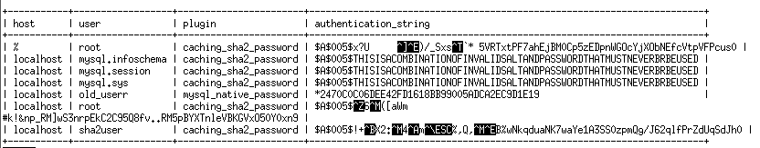

# AS Lab 2 - Database

#### Artem Abramov SNE19

# Prepare database 

## 1. Install a DBMS that can perform column level encryption and database level encryption (f.e MySQL).

I installed the DB with docker. 

I use the following mysql version:

```
mysql  Ver 8.0.19 for Linux on x86_64 (MySQL Community Server - GPL)
```

For this I used the MySQL image from docker hub. 

```
docker run --name mysql-db -p 3306:3306 -p 33060:33060 -e MYSQL_ROOT_PASSWORD=artem -d mysql
```

To interact with the database I used the mysql client installed in the same container:
```
docker exec -it mysql-db bash
root@ad813693c8cc:/# mysql -uroot -p
```

## 2. Create database and populate it with data (about 5 columns and 50 000 rows in a table)

```
mysql> create DATABASE test;
```

Generated test data using http://filldb.info/ a sample  is shown below:


Copied the test data into the container
```
docker cp ~/Downloads/test-02-02-2020-20-56-beta.sql mysql-db:mnt
```

Inserted data into database called `test` (inside the container):
```
# cd /mnt
# mysql -u root -p
mysql> use test
mysql> source /mnt/test-02-02-2020-20-56-beta.sql
```


# Database connection

## 3. Create password based credentials that will be used by your application to access the created database.

The credential file allows storing our sensitive username and password to allow automated access to MySQL.

Spin up  `mysql-cli` container:

```
docker run --name mysql-cli -it  mysql /bin/bash
```

On it create the credentials file with identifier  `main`. (The info about `mysql-db` container was taken from `docker inspect`):

```
 mysql_config_editor set --login-path=main --host=172.17.0.2 --user=root --password
```

Connect to db:

```
mysql --login-path=main
```

Remember to `use test` after login to select the db.

## 4. Make sure the DBMS is available on some network interface and capture the  traffic on that interface during the connection (you can use  corresponding CLI to open the connection, perform some SELECT queries  and then close the connection).

I captured traffic with wireshark listening to docker0.

I performed the following from `mysql-cli` container:

```
root@b7c99e16d613:/# mysql --login-path=main
mysql> use test
mysql> select * from test limit 10;
mysql> \q
```


## 5. Analyze the captured data:

#### Can you see the plain data and credentials? How can the attacker bypass TLS layer with your present configuration? (hint: analyze TLS handshake)

The data and credentials are not present as plaintext. 

- On connection start server advertises MySQL protocol==10 and version==8.0.19. 
- Next follows a login request from the client (user), it contains a name field, however that is legacy of MySQL protocol and in this capture the field is not filled. 
- The next message is also from the client, it is a Client Hello which starts the TLS handshake. Client  (as seen in the handshake layer)  supports up to TLSv1.2. Part of the  header is shown below:

```
Transport Layer Security
    TLSv1.2 Record Layer: Handshake Protocol: Client Hello
        Content Type: Handshake (22)
        Version: TLS 1.0 (0x0301)
        Length: 175
        Handshake Protocol: Client Hello
            Handshake Type: Client Hello (1)
            Length: 171
            Version: TLS 1.2 (0x0303)
            Random: e4747df403a07859d34cbe45cb4bd8a859a46840377630f0…
            Session ID Length: 0
            Cipher Suites Length: 60
            Cipher Suites (30 suites)
                Cipher Suite: TLS_ECDHE_ECDSA_WITH_AES_128_GCM_SHA256 (0xc02b)
                Cipher Suite: TLS_ECDHE_ECDSA_WITH_AES_256_GCM_SHA384 (0xc02c)
                Cipher Suite: TLS_ECDHE_RSA_WITH_AES_128_GCM_SHA256 (0xc02f)
                Cipher Suite: TLS_ECDHE_RSA_WITH_AES_256_GCM_SHA384 (0xc030)
                Cipher Suite: TLS_ECDHE_ECDSA_WITH_AES_128_CBC_SHA256 (0xc023)
                Cipher Suite: TLS_ECDHE_RSA_WITH_AES_128_CBC_SHA256 (0xc027)
                Cipher Suite: TLS_ECDHE_ECDSA_WITH_AES_256_CBC_SHA384 (0xc024)
                Cipher Suite: TLS_ECDHE_RSA_WITH_AES_256_CBC_SHA384 (0xc028)
                Cipher Suite: TLS_DHE_RSA_WITH_AES_128_GCM_SHA256 (0x009e)
                Cipher Suite: TLS_DHE_DSS_WITH_AES_128_GCM_SHA256 (0x00a2)
                Cipher Suite: TLS_DHE_RSA_WITH_AES_128_CBC_SHA256 (0x0067)
                Cipher Suite: TLS_DHE_DSS_WITH_AES_128_CBC_SHA256 (0x0040)
                Cipher Suite: TLS_DHE_DSS_WITH_AES_256_GCM_SHA384 (0x00a3)
                Cipher Suite: TLS_DHE_RSA_WITH_AES_256_CBC_SHA256 (0x006b)
                Cipher Suite: TLS_DHE_DSS_WITH_AES_256_CBC_SHA256 (0x006a)
                Cipher Suite: TLS_ECDHE_RSA_WITH_AES_128_CBC_SHA (0xc013)
                Cipher Suite: TLS_ECDHE_ECDSA_WITH_AES_128_CBC_SHA (0xc009)
                Cipher Suite: TLS_ECDHE_RSA_WITH_AES_256_CBC_SHA (0xc014)
                Cipher Suite: TLS_ECDHE_ECDSA_WITH_AES_256_CBC_SHA (0xc00a)
                Cipher Suite: TLS_DHE_DSS_WITH_AES_128_CBC_SHA (0x0032)
                Cipher Suite: TLS_DHE_RSA_WITH_AES_128_CBC_SHA (0x0033)
                Cipher Suite: TLS_DHE_RSA_WITH_AES_256_CBC_SHA (0x0039)
                Cipher Suite: TLS_RSA_WITH_AES_128_GCM_SHA256 (0x009c)
                Cipher Suite: TLS_RSA_WITH_AES_256_GCM_SHA384 (0x009d)
                Cipher Suite: TLS_RSA_WITH_AES_128_CBC_SHA256 (0x003c)
                Cipher Suite: TLS_RSA_WITH_AES_256_CBC_SHA256 (0x003d)
                Cipher Suite: TLS_RSA_WITH_AES_128_CBC_SHA (0x002f)
                Cipher Suite: TLS_RSA_WITH_AES_256_CBC_SHA (0x0035)
                Cipher Suite: TLS_DHE_RSA_WITH_AES_256_GCM_SHA384 (0x009f)
                Cipher Suite: TLS_EMPTY_RENEGOTIATION_INFO_SCSV (0x00ff)
```

- In response the server chooses to use TLSv1.2 and replies with Server Hello, Certificate, Server Key Exchange, Certificate Request and Server Hello Done records.

source: https://dev.mysql.com/doc/refman/8.0/en/encrypted-connection-protocols-ciphers.html

The server allows connections without authentication:

```
mysql> SHOW GLOBAL VARIABLES LIKE 'require_secure_transport';
+--------------------------+-------+
| Variable_name            | Value |
+--------------------------+-------+
| require_secure_transport | OFF   |
+--------------------------+-------+
1 row in set (0.00 sec)
```

require_secure_transport = Whether client connections to the server are required to use some form of secure transport. When this variable is enabled, the server permits only TCP/IP connections that use SSL.

The server also accepts TLSv1.0 for communication:

```
mysql> SHOW GLOBAL VARIABLES LIKE 'tls_version';
+---------------+-----------------------+
| Variable_name | Value                 |
+---------------+-----------------------+
| tls_version   | TLSv1,TLSv1.1,TLSv1.2 |
+---------------+-----------------------+
1 row in set (0.01 sec)
```

The security hazard associated with accepting non-TLS conneciton is clear and simple. 

There is also an issue with accepting TLSv1.0 connections. The TLS handshake happens in plaintext, a man in the middle can rewrite the client hello to claim that client only supports the insecure TLSv1.0, under current configuration MySQL server will accept this insecure connection as secure and valid. Example TLSv1.0 vulnerabilities: POOL, BEAST, etc.

#### What can be done to mitigate that?

Force authentication and forbid using TLSv1.0 on the server. This values can be set dynamically **no server restart required**  on MySQL server version>=8.0.16 and can be made persistent across reboot via the commands below:

```
mysql> SET PERSIST require_secure_transport = ON;
mysql> SET PERSIST tls_version="TLSv1.1,TLSv1.2";
```

Checking the connection from client:

```
root@b7c99e16d613:~# mysql --login-path=main --tls_version=TLSv1.0
ERROR 2026 (HY000): SSL connection error: TLS version is invalid
```


## 6) Capture the connection traffic with TLS disabled and extract the content of user and password fields.

For this I disabled the require_secure_transport option in the MySQL db and then connected without SSL:

```
root@b7c99e16d613:~# mysql --login-path=main --ssl-mode=DISABLED
```

Wireshark output is below:

```
Login Request
    Client Capabilities: 0xa605
    Extended Client Capabilities: 0x01ff
    MAX Packet: 16777216
    Charset: latin1 COLLATE latin1_swedish_ci (8)
    Username: root
    Password: bac51a7f6b490d54359f9e3039f83be7391102e0b900eadc…
    Client Auth Plugin: caching_sha2_password
    Connection Attributes
```

Username: root

Password: bac51a7f6b490d54359f9e3039f83be7391102e0b900eadcdd31a9ca86041453

#### Describe the authentication scheme that is used (in which form credentials are provided, how are they stored and verified)

Authentication scheme is determined by pluggable authentication architecture of MySQL server. Architecture info: https://dev.mysql.com/doc/refman/8.0/en/pluggable-authentication.html and by using a specific plugin. Wireshark dump and MySQL config confirm use of caching_sha2_password plugin for authentication of user `root`. Plugin info: https://dev.mysql.com/doc/refman/8.0/en/caching-sha2-pluggable-authentication.html

The architecture part is simple - when connection is established MySQL finds the authentication plugin that applies for the particular user, invokes it, and returns "okay" or "reject".  If the answer is "reject", the whole connection fails.

Architecture details:
```
--> client connects to the server
--> server sends the Handshake Initialization Packet. The packet carries
    the following fields:
    * Name of the plugin the server uses (after the second part of the scramble) 
      if the CLIENT_PLUGIN_AUTH bit in server capabilities is set
--> client invokes the default (or specified) client plugin. 
    * If the plugin is not the default one (native backward compatible 
      internal authentication plugin) the client will not feed it with the 
      scramble sent in server's handshake packet.
--> client makes sure the first packet sent is the auth packet as usual 
    (and sets CLIENT_PLUGIN_AUTH).
    * If it uses non-backward compatible authentication the content of 
      the scramble_buff is defined by the plugin
    * sends plugin name as ASCIIZ string after the database name if the server
      supports plugin authentication.
--> server checks that
    * host is allowed to connect
    * user name is found in the mysql.user table or there is a default 
      proxy user that gets used instead.
    * plugin specified in the "plugin" column of the
      mysql.user table is loaded
    ** if either of the above fails - authentication fails
    * and it's the same plugin as client has sent in the auth packet
    ** if it fails, see below
    and then it calls the plugin with the received username/scramble data
--> if the client has used a wrong plugin, server requests
    the client to use the correct one:
    * a server sends a special "Use this plugin: XXX" packet
    * a client replies as requested (or disconnects)
--> now auth plugin can communicate with the client to do
    any further conversation, as necessary.
```


The `caching_sha256_password` plugin does work on both the client and the server side. To connect to the server using an account that authenticates with the `caching_sha2_password` plugin, the client can use a secure connection or an **unencrypted connection that supports password exchange using an RSA key pair**. This plugin works as follows:

- Server sends 20 bytes of random data AKA salt AKA scramble buffer (split into two chunks of 8 bytes and 12 bytes) in the inital handshake packet (AKA Server Greeting). 

- Client software XORs client's SHA(password) with scramble buffer content. I could find the algorithm for `mysql_native_password` (shown below), but no exact description of the `caching_sha256_password` :( 

  I suppose it would just use SHA256 instead of SHA1.

  ```
  SHA1( password ) XOR SHA1( "20-bytes random data from server" <concat> SHA1( SHA1( password ) ) )
  ```

  Then the client RSA encrypts that with the server's public key. Sends the result to server.

- Server decrypts the RSA and verifies the client's computations to the server's computations.

If the client does not have the public key, it can ask the server.

The server stores hash of the user's password in its `mysql.user` table:

```
mysql> select host, user, plugin, authentication_string from mysql.user;
```

It seems that the auth string is encoded, because it contains unprintable chars. This is most likely the SHA256 of the password. Interestingly the type of the column `authentication_string` is TEXT, not a binary blob.



The users `root`, `old_userr`, `sha2user` were created for testing.

sources: 

1. https://dev.mysql.com/doc/internals/en/secure-password-authentication.html
2. https://dev.mysql.com/doc/internals/en/sha256.html
3. https://dev.mysql.com/doc/refman/8.0/en/caching-sha2-pluggable-authentication.html

 

#### Would an attacker be able to impersonate user if he had access to the content of database? Why?

Yes. The server stores the SHA of the user's password that is used to calculate the response to the challenge. If the attacker gains that value, what would stop him from establishing a new connection providing this value in calculations?

The Secure Password Authentication page on the MySQL website claims (https://dev.mysql.com/doc/internals/en/secure-password-authentication.html): 

```
knowning the content of the hash in the mysql.user table isn't enough to authenticate against the MySQL Server. 
```

However because the attacker can just establish a new connection and get his own random challenge, I fail to see why this claim is true.

### What alternative authentication schemes are there? Which would you prefer and why? 

There are multiple authentication plugins available:

- [6.4.1.1 Native Pluggable Authentication](https://dev.mysql.com/doc/refman/8.0/en/native-pluggable-authentication.html)
- [6.4.1.2 Caching SHA-2 Pluggable Authentication](https://dev.mysql.com/doc/refman/8.0/en/caching-sha2-pluggable-authentication.html)
- [6.4.1.3 SHA-256 Pluggable Authentication](https://dev.mysql.com/doc/refman/8.0/en/sha256-pluggable-authentication.html)
- [6.4.1.4 Client-Side Cleartext Pluggable Authentication](https://dev.mysql.com/doc/refman/8.0/en/cleartext-pluggable-authentication.html)
- [6.4.1.5 PAM Pluggable Authentication](https://dev.mysql.com/doc/refman/8.0/en/pam-pluggable-authentication.html)
- [6.4.1.6 Windows Pluggable Authentication](https://dev.mysql.com/doc/refman/8.0/en/windows-pluggable-authentication.html)
- [6.4.1.7 LDAP Pluggable Authentication](https://dev.mysql.com/doc/refman/8.0/en/ldap-pluggable-authentication.html)
- [6.4.1.8 No-Login Pluggable Authentication](https://dev.mysql.com/doc/refman/8.0/en/no-login-pluggable-authentication.html)
- [6.4.1.9 Socket Peer-Credential Pluggable Authentication](https://dev.mysql.com/doc/refman/8.0/en/socket-pluggable-authentication.html)
- [6.4.1.10 Test Pluggable Authentication](https://dev.mysql.com/doc/refman/8.0/en/test-pluggable-authentication.html)
- [6.4.1.11 Pluggable Authentication System Variables](https://dev.mysql.com/doc/refman/8.0/en/pluggable-authentication-system-variables.html)

Of real use are the SHA-256 due to improved security, over Native (SHA-1) and Caching SHA-2 authentication. The only other interesting choice is LDAP because it is cross-platform and would tie the user identity to another authoritative server (such as the user's organization).


## 7) Column level encryption:

#### Try column level encryption and see how data looks like after encryption  (f.e. create a table with an encrypted column, issue an insert  statement, then issue a SELECT statement).

Create table:

```
mysql> create table encrypted
    -> ( id int(10) unsigned not null auto_increment, name varchar(255) not null, age int(3) not null, primary key (id) ) engine = innodb default charset = latin1;
```

Check:

```
mysql> describe encrypted;
+-------+--------------+------+-----+---------+----------------+
| Field | Type         | Null | Key | Default | Extra          |
+-------+--------------+------+-----+---------+----------------+
| id    | int unsigned | NO   | PRI | NULL    | auto_increment |
| name  | varchar(255) | NO   |     | NULL    |                |
| age   | int          | NO   |     | NULL    |                |
+-------+--------------+------+-----+---------+----------------+
3 rows in set (0.00 sec)

```

Insert values:

```
mysql> INSERT INTO encrypted VALUES (2, AES_ENCRYPT('bob', UNHEX(SHA2('My secret passphrase',512))), 40);
mysql> INSERT INTO encrypted VALUES (AES_ENCRYPT('bob', 'My secret passphrase'), 40);
```

Select:

```
mysql> select * from encrypted;
+----+------------------+-----+
| id | name             | age |
+----+------------------+-----+
|  1 | ûèDPe$UZZú÷Ó |  40 |
|  2 | \åܪ»®ekàÄaMFç |  40 |
+----+------------------+-----+
2 rows in set (0.00 sec)
```


## 8) Transparent database encryption:

#### Find the actual database files and try to extract some meaningful information from them

Db files are in `/var/lib/mysql`. 

Tables:
```
./test
./test/test.ibd
./test/encrypted.ibd
```

Database config files:
```
./auto.cnf
./mysqld-auto.cnf
```

Server keys (also client keys, but they are not so interesting):
```
./server-key.pem
./ca-key.pem
./public_key.pem
./server-cert.pem
./ca.pem
./private_key.pem
```

Log files are interesting, they are binary but contain the text from all the inserts as found by:

```
strings ib_logfile0 | less
```


Extract text strings from database:

```
root@e6db7b398e04:/var/lib/mysql# strings test/test.ibd | tail -n 20
>fAuer, Hackett and PurdyWalsh
	Lubowitzbury
>tDeckow, Hodkiewicz and CristMonahan
Creminland
Grady-GottliebNicolas
Milfordview
Boyer, Dach and GislasonTreutel
Tremaineport
Koelpin-DickinsonLarkin
Blickhaven
Gutmann-StrosinSchuppe
Arielborough
Hoeger, Hermiston and StarkHammes
	Enriqueside
Lebsack, Williamson and WhiteMiller
Kuhlmanton
Buckridge-HaleyJakubowski
East Groverhaven
Stehr, Jenkins and KunzeLebsack
Bartonhaven
```


### Apply transparent database encryption and see how does encryption affects  standard queries and the content of the database files.

Applying the encryption was slightly complicated because of docker containers. 

There is no clean way to restart mysqld which is inside the docker container (no systemd or service files). Therefore to apply any startup config the strategy is to edit the config on host and bind mount the direcotry to docker container.

In a running docker container (to get the permissions and rights correctly) create:

```
cd /etc/mysql
mkdir keyring
chmod 750 keyring
touch keyring/file
chown mysql:mysql -R keyring
```

source: https://dev.mysql.com/doc/refman/8.0/en/keyring-system-variables.html#sysvar_keyring_file_data

Copy `/etc/mysql` directory from docker container to localhost:

```
docker cp mysql-db-2:/etc/mysql ~/Downloads/mysql-db-etc-mysql
```

Edit `my.cnf`, add lines:

```
[mysqld]
early-plugin-load=keyring_file.so
keyring_file_data=/etc/mysql/keyring/file
```

Run docker and bind mount the directory:

```
docker run --name mysql-db-2 -v ~/Downloads/mysql-db-etc-mysql:/etc/mysql -e MYSQL_ROOT_PASSWORD=artem -d mysql
```

Now the encryption starts working, check against the db in the container:

```
mysql> SELECT PLUGIN_NAME, PLUGIN_STATUS
    ->        FROM INFORMATION_SCHEMA.PLUGINS
    ->        WHERE PLUGIN_NAME LIKE 'keyring%';
+--------------+---------------+
| PLUGIN_NAME  | PLUGIN_STATUS |
+--------------+---------------+
| keyring_file | ACTIVE        |
+--------------+---------------+
1 row in set (0.00 sec)

```

Check plugins that `keyring_file` is present:

```
mysql> show plugins;
```

##### Now supposedly encryption is working, lets test it.


Export db data from old container (I should have used docker volumes from the start!):

```
docker exec mysql-db sh -c 'exec mysqldump --all-databases -uroot -p"$MYSQL_ROOT_PASSWORD"' > ~/Downloads/all-db.sql
```
And load the data into the new container:


```
docker exec -i mysql-db-2 sh -c 'exec mysql -uroot -p"$MYSQL_ROOT_PASSWORD"' < ~/Downloads/all-db.sql
```


Duplicate the table before enabling encryption on it:
```
mysql> create table test_encypt as select * from test;
```

Finally enable encryption for the test_encrypt table:

```
mysql> alter table test_encypt ENCRYPTION='y';
```

To enable encryption by default we can use: 

```
mysql> SET GLOBAL default_table_encryption=ON;
```


Check the files on the drive, run strings against the encrypted db:

```
root@854f318513bb:/var/lib/mysql# strings test/test_encypt.ibd | head   
9f323ca4-464d-11ea-bc82-0242ac110004
j{Xw2
@Lv1LVq
LRb`
EKOh
-CPYH
_7-C
|#xAn
i_r~%?J
'_dZ
```

The file is encrypted!

Running a query on unencrypted table:

```
mysql> select * from test where name like '%a%' and age > 5;
```

Results: 26264 rows in set (0.05 sec)

Running on encrypted table:

```
mysql> select * from test_encypt where name like '%a%' and age > 5;
```

Results: 26264 rows in set (0.06 sec)

So queries work the same, but it takes slightly longer on encrypted data.

sources: 

- https://dev.mysql.com/doc/refman/8.0/en/innodb-data-encryption.html#innodb-data-encryption-encryption-prerequisites
- https://dev.mysql.com/doc/refman/8.0/en/keyring-file-plugin.html
- https://dev.mysql.com/doc/refman/8.0/en/keyring-system-variables.html#sysvar_keyring_file_data


### 9) What are the possible encryption algorithms supported in your selected DBMS? Which algorithm would you prefer and why?

I use the following mysql version:

```
mysql  Ver 8.0.19 for Linux on x86_64 (MySQL Community Server - GPL)
```

The only supported encryption algorithm is AES with different key sizes. source: https://dev.mysql.com/doc/refman/8.0/en/encryption-functions.html#function_aes-encrypta

Its also possible to use different block encryption modes:  ECB, CBC, CFB1, CFB8, CFB128, OFB.

My favor goes to AES with CBC mode even though it requires an init vector (more fuss to use). CBC provides better security against data tempering because it ties the blocks together. And there is no other option appart from AES.


## 10) What are the vulnerabilities (attack vectors) you could have with this  approach? Can you get the plain text from encrypted data in a way?

The usual attacks against encryption apply: dictionary, rainbow tables. 

Because we are using a db its possible that traces of the key could be found somewhere in the database, for example in the command line history.

To get the text back from encrypted data, the AES_DECRYPT function could be used.


### 11) Compare no-encryption, column-level encryption and transparent database encryption in terms of performance. (e.g. run simple select statements on the large database you generated)


## 12) What are the advantages and disadvantages of application level encryption?

Disadvantages:

- User must manage his keys, this is more complex in scenarios such as  telegram app where clients on different platforms must have access to the same key. (interestingly in telegram and in watsapp I suppose the user's private key that was generated on the mobile phone gets copied to the laptop/PC where the desktop app runs, not really a secure scheme!)
- Loosing the key means loosing the data, no standard recovery procedure.
- Database becomes composed of binary blobs, this means if user wants to search his encrypted data for some string or pattern the search will be slow because all the blobs will need to be downloaded to the user app and decrypted. If encryption was at DB level the DB could do the search instead of the user.
- More work for application developers, possibly more bugs across different apps. Its easier to secure one DB product.

Advantages:

- Some solid guarantees about user privacy!
- Less work for DB admin.
- In response to user query data can be sorted and filtered on the backend, therefore its possible to optimize what gets transmitted over the wire, meaning faster service of users.


## 13) Consider the python simple app (app is inside zip archive) with naive usage of application level encryption and describe issues that you can find. What improvements can be made?

The first issue is that the password for data encryption is stored in plain text in the source code, this should be stored in some encrypted file and user should be prompted to enter decryption key for file.

There is no error handling, what if data is tampered with and decoding fails? The output text will be garbage.

The AES module uses ECB encryption (**electronic code book**) because blocks are not linked together its possible to carry out a substitution or rearrangement attack on one of the block.