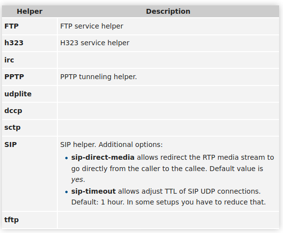

# AS Lab 6 - Network Security

Artem Abramov


## You have the following network diagram:

And you have access to the “NAT-Firewall” device with the following credentials
IP: 188.130.155.51
User: nat1
Pass: Nat@sne!2020

Try to
● spot the misconfiguration in that device and what your recommended configuration will be
● propose a better diagram/configuration


Main source: https://wiki.mikrotik.com/wiki/Manual:Securing_Your_Router


### The purpose of Switch1 is not clear

Why is there a need for an additional switch between the internet and the NAT-Firewall router. Seems like the router should just handle the connection itself, its probably more suited for the task. 

The only strange point is that thehost  router gets its IP via DHCP on the `out` interface:


This should be fixed by using a white public IP (especially because there is a webserver and email).


### No TLS certificate

The connection to the web interface is not secured by a certificate, therefore its possible to eavesdrop and man-in-the-middle the connection. We are not actually connected directly to the router, but to some machine that runs the Web Interface and passes config commands back and forth to the router. This is because the router does not run the Web Interface and does not event have an interface with IP 188.130.155.51.

The solution would be to get one of the free Let's Encrypt certificates, or at least a self-signed cert that the administrator would have to visually verify on each connection.

### Redundant interface

There is an Ethernet interface enabled called "testing" with network `192.168.26.1/24`.  Its not on the diagram, therefore its better to disable this interface, as its not part of the network plan.

### Redundant hardware

Its not clear why are the Hub1 and Hub2 necessary if the departments have only two computers each. Seems that they can be connected directly to the switch.

### The NAT rules are misconfigured

##### Rule number 0 for "MySQL"

The rule to send all incoming traffic on port 3306 to IP 192.168.25.2 is dangerous, because it exposes MySQL server (if there is one running) to the outside. This rule means if you get traffic to port 3306 then apply destination NAT and send it to machine 192.168.25.2. But this machine is a web server, if it uses a DB its best to only make it accessible on localhost, so there is no point in this NAT rule, it should be deleted. 

##### No rule for httpd server and Emailserver
- On the other hand there are no rule to send traffic incoming on port 80 to the webserver at IP 192.168.25.2. 
- There are also no rules to send traffic incoming on Email ports (25, 587, 465 - for outgoing messages and 110, 995 for POP3 incoming messages) to the Emailserver at IP 192.168.25.3

### Looking at the Service Ports tab the router is running some NAT helpers that can be blocked.


According to https://wiki.mikrotik.com/wiki/Manual:IP/Services#Service_Ports

```
Hosts behind a NAT-enabled router do not have true end-to-end connectivity. Therefore some Internet protocols might not work in scenarios with NAT.

To overcome these limitations RouterOS includes a number of NAT helpers, that enable NAT traversal for various protocols. 
```

The description of the helpers:



If there is any control over the software installed on the Marketing Dept and R&D Dept then helpers for unused software should be blocked. This is a complex decision and depends on the needs of others, however having less software listening on Internet facing ports is always for the best.

### Firewall filter rule is very permissive

There is a rule to allow forwarding traffic with

```
Src = 192.168.25.2
Dst = 192.168.24.0/24
```

The comment says:

```
BAckup of the webserver data to FTP server
```

This setting is too permissive because it allows the webserver to access any machine on internal network.

Instead it should be changed to 

```
Dst = (IP of ftp-server-1)/32
```

So it should be changed to the exact ip address of ftp-server-1.

### There are unnecessary administrative tools/ports enabled


Interestingly the www-ssl control interface is DISABLED and INVALID, but telnet and ftp and plain www are all enabled. Its best to disable them and instead setup a Certificate and enable www-ssl. Also change the default port for ssh to stop stupid bruteforce. Additionally each service can be secured by white listing allowed src IP addresses.


source: https://wiki.mikrotik.com/wiki/Manual:Securing_Your_Router#RouterOS_services


### Limit default for tcp-established-timeout

Currently an established TCP connection will timeout in 1 DAY.  Its not clear what would use this for such a long time, so set it to a couple of hours to avoid draining router resources.


### Remove routing to "testing" network

The testing network is unused and admin should make sure that after interface removal, the route is also removed from Routes.


### Disable neighbor discovery

This is good practice according to source: https://wiki.mikrotik.com/wiki/Manual:Securing_Your_Router

Looks like there is only one real neighbor (and some misconfigured info), so its easy to add it manually and just disable neighbor discovery.


### Change name of admin user to prevent brute force attacks on password via control interface


We can see there is admin user. Change the name to any other name.

### Disable tools while not in use

According to source: https://wiki.mikrotik.com/wiki/Manual:Securing_Your_Router

```
RouterOS has built-in options for easy management access to network devices. The particular services should be shutdown on production networks. 
```

These include:

- MAC-Telnet
- MAC-Winbox
- MAC-Ping

Currently they are enabled.


