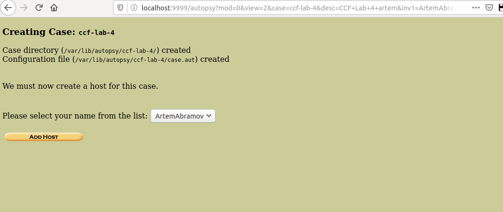
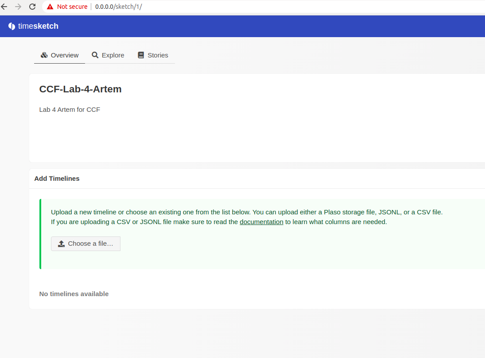
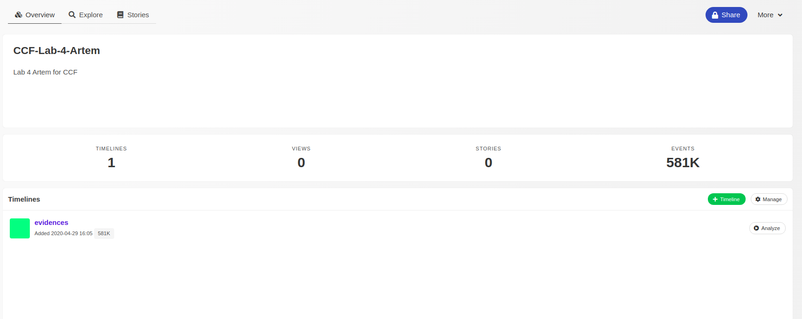
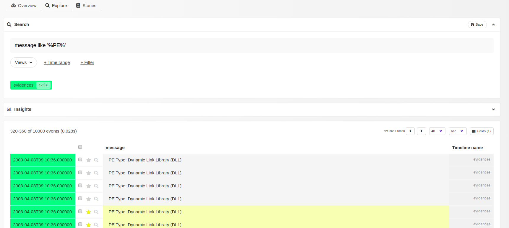
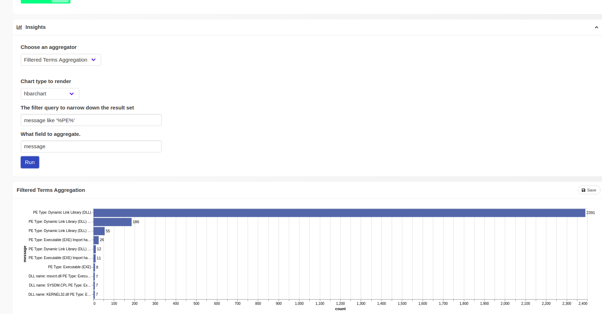
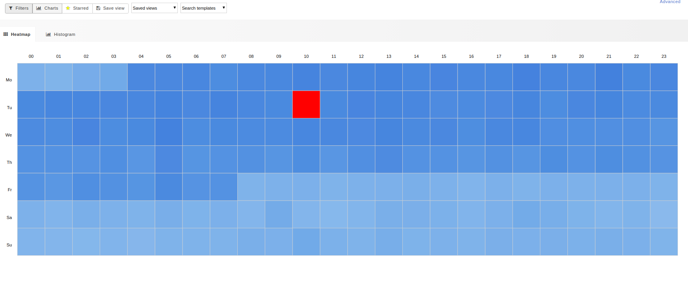
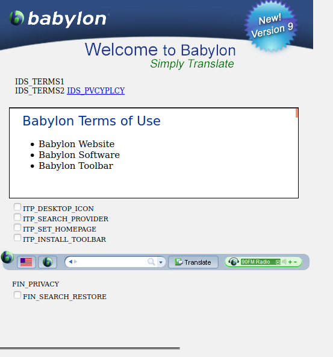
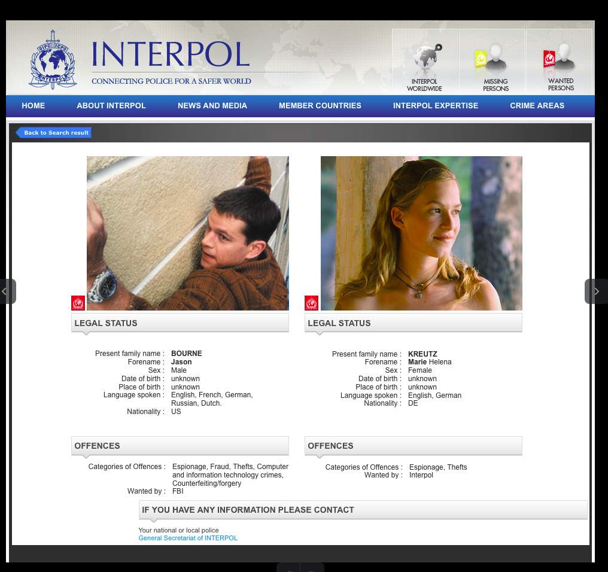
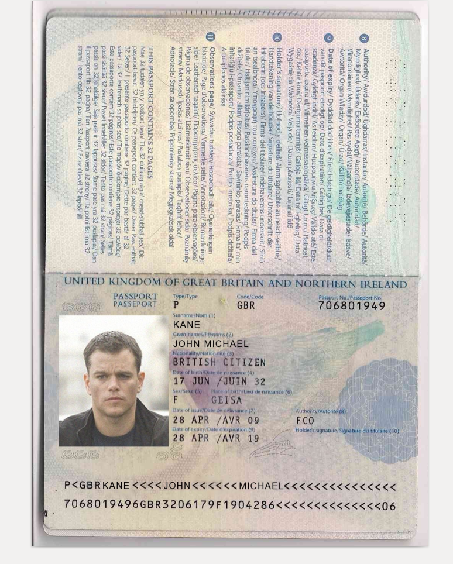
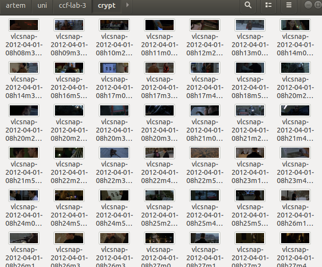

# CCF Lab 3 Disk Image Forensic Analysis

Artem Abramov


# Work Assignment:
1. Parse the image to list all files and create the timeline from the prepared listing.
2. Apply different forensics techniques to locate as much evidence as you can.
3. Make a log of all actions and put into the report as an Investigator.


Use various methods to examine the disk image.

First step is to get hashsum over the disk image to make sure that at the end of investigation we did not change anything.

```
sha256sum primary-disk.dd 
a5704537171383c5e42a5e162c6d2b6b1dca246c9531ee289ac89b93140b8e7e  primary-disk.dd
```


Running file:

```
$ file primary-disk.dd 
primary-disk.dd: DOS/MBR boot sector, code offset 0x52+2, OEM-ID "NTFS    ", sectors/cluster 8, Media descriptor 0xf8, sectors/track 63, heads 255, hidden sectors 2048, dos < 4.0 BootSector (0x80), FAT (1Y bit by descriptor); NTFS, sectors/track 63, sectors 6835928, $MFT start cluster 786432, $MFTMirror start cluster 427245, bytes/RecordSegment 2^(-1*246), clusters/index block 1, serial number 08054c21954c211b8; contains Microsoft Windows XP/VISTA bootloader BOOTMGR
```

Running fsstat (from sleuth-kit):

```
fsstat primary-disk.dd 
FILE SYSTEM INFORMATION
--------------------------------------------
File System Type: NTFS
Volume Serial Number: 8054C21954C211B8
OEM Name: NTFS    
Version: Windows XP

METADATA INFORMATION
--------------------------------------------
First Cluster of MFT: 786432
First Cluster of MFT Mirror: 427245
Size of MFT Entries: 1024 bytes
Size of Index Records: 4096 bytes
Range: 0 - 53952
Root Directory: 5

CONTENT INFORMATION
--------------------------------------------
Sector Size: 512
Cluster Size: 4096
Total Cluster Range: 0 - 854490
Total Sector Range: 0 - 6835927

$AttrDef Attribute Values:
$STANDARD_INFORMATION (16)   Size: 48-72   Flags: Resident
$ATTRIBUTE_LIST (32)   Size: No Limit   Flags: Non-resident
$FILE_NAME (48)   Size: 68-578   Flags: Resident,Index
$OBJECT_ID (64)   Size: 0-256   Flags: Resident
$SECURITY_DESCRIPTOR (80)   Size: No Limit   Flags: Non-resident
$VOLUME_NAME (96)   Size: 2-256   Flags: Resident
$VOLUME_INFORMATION (112)   Size: 12-12   Flags: Resident
$DATA (128)   Size: No Limit   Flags: 
$INDEX_ROOT (144)   Size: No Limit   Flags: Resident
$INDEX_ALLOCATION (160)   Size: No Limit   Flags: Non-resident
$BITMAP (176)   Size: No Limit   Flags: Non-resident
$REPARSE_POINT (192)   Size: 0-16384   Flags: Non-resident
$EA_INFORMATION (208)   Size: 8-8   Flags: Resident
$EA (224)   Size: 0-65536   Flags: 
$LOGGED_UTILITY_STREAM (256)   Size: 0-65536   Flags: Non-resident
```

Its an NTFS filesystem, with what looks like a Windows XP installation.

Mount the volume as read-only and see what is inside:

```
sudo mount -o ro primary-disk.dd diskmnt/
```

I decided start with easy methods and the possibly progress to more advanced techniques:

- Try to locate encrypted files on disk (strong evidence)
- Order file by the order they were accessed to build a possible timeline (weak evidence, easy to modify)

- Check system for traces of communication: files that belong to email, messaging, etc (strong evidence)
- Go through the timeline in reverse order
- Find and review system logs (weak evidence, easy to modify)


**Finding interesting targets**

To try finding all encrypted files I used the TCHunt-ng tool (https://github.com/antagon/TCHunt-ng) which analyses the file headers and entropy of bits in files and tries to guess if the file is encrypted or not. 

Quoting readme:

```
TCHunt-ng attempts to reveal encrypted files stored on a filesystem. The program is successful in finding TrueCrypt, VeraCrypt, CipherShed containers; LUKS, EncFS, PGP/GPG encrypted files; OpenSSH and PEM private keys; password databases; files made up of random data.
```

I run it in root directory of the mounted disk image:

```
$ find . -type f | tchuntng -
./Drivers/Intel Onboard Graphics Driver/Graphics/iglhxa32.cpa
./Program Files/Common Files/SpeechEngines/Microsoft/TTS20/en-US/enu-dsk/M1033DSK.CSD
./ProgramData/Microsoft/Windows/DRM/v3ks.sec
./ProgramData/Microsoft/Windows Defender/Scans/History/Results/Resource/{08F61BD9-56ED-4518-A942-000B6DA4C029}
./ProgramData/Microsoft/Windows Defender/Scans/History/Results/Resource/{0949EC1A-EE65-4A8D-A058-85E66C62DDAE}
./ProgramData/Microsoft/Windows Defender/Scans/History/Results/Resource/{18D73947-48D8-469F-A061-9E73FE0C1D94}
./ProgramData/Microsoft/Windows Defender/Scans/History/Results/Resource/{1A6B5950-458A-43E6-B646-0B22632E8795}
./ProgramData/Microsoft/Windows Defender/Scans/History/Results/Resource/{1C792CAB-BC89-4D6E-8B48-3E32AD2FA1EF}
./ProgramData/Microsoft/Windows Defender/Scans/History/Results/Resource/{1D29C7A7-7826-499A-8446-ED429BF04671}
./ProgramData/Microsoft/Windows Defender/Scans/History/Results/Resource/{210DC132-321A-4BFA-AF66-FA21228F15B8}
./ProgramData/Microsoft/Windows Defender/Scans/History/Results/Resource/{21F06164-F190-4095-9DC7-1B6DBE66C5DD}
./ProgramData/Microsoft/Windows Defender/Scans/History/Results/Resource/{23B93928-34A2-448C-99CC-3B29EB30182B}
./ProgramData/Microsoft/Windows Defender/Scans/History/Results/Resource/{24590CBB-08C4-4D92-9151-523839DE04C7}
./ProgramData/Microsoft/Windows Defender/Scans/History/Results/Resource/{2557CB08-6583-474C-B077-4C637847BF6A}
./ProgramData/Microsoft/Windows Defender/Scans/History/Results/Resource/{26B246EC-F692-4478-B003-35F2BAE11DA6}
./ProgramData/Microsoft/Windows Defender/Scans/History/Results/Resource/{2B17ACE0-D8F3-4168-A1A3-90D7416CCA9C}
./ProgramData/Microsoft/Windows Defender/Scans/History/Results/Resource/{2E41E860-B7BB-4DEF-8854-502B2794A9E1}
./ProgramData/Microsoft/Windows Defender/Scans/History/Results/Resource/{303ABAA4-D737-404D-90F0-E3B85A235B84}
./ProgramData/Microsoft/Windows Defender/Scans/History/Results/Resource/{75FB3835-E701-47DA-8FBD-9FA0DDD30727}
./ProgramData/Microsoft/Windows Defender/Scans/History/Results/Resource/{7D5F38AE-F70C-43FC-B46A-6E18DC01074E}
./ProgramData/Microsoft/Windows Defender/Scans/History/Results/Resource/{877F18A4-9E18-4749-BB1E-EC96E936D2B7}
./ProgramData/Microsoft/Windows Defender/Scans/History/Results/Resource/{8AAA9791-0461-490D-B472-3C8D3BA12319}
./ProgramData/Microsoft/Windows Defender/Scans/History/Results/Resource/{8BE7038C-6AF1-45F3-9657-7B2FBB238EB9}
./ProgramData/Microsoft/Windows Defender/Scans/History/Results/Resource/{90510990-A7FE-459D-80D6-B51EEFCDD06A}
./ProgramData/Microsoft/Windows Defender/Scans/History/Results/Resource/{956D30E1-C17A-43A1-B475-F0ED585FDA71}
./ProgramData/Microsoft/Windows Defender/Scans/History/Results/Resource/{9F1281A3-2F0B-4A8B-B1D4-124B7746C55E}
./ProgramData/Microsoft/Windows Defender/Scans/History/Results/Resource/{A051369C-6C45-417D-A2A2-B158B48D72B8}
./ProgramData/Microsoft/Windows Defender/Scans/History/Results/Resource/{D1788163-83DD-4074-ABA0-EE50B0FA5499}
./ProgramData/Microsoft/Windows Defender/Scans/History/Results/Resource/{D39D7340-24A0-4FE2-883D-D456A7F363CC}
./ProgramData/Microsoft/Windows Defender/Scans/History/Results/Resource/{D3E0DE80-0403-43D9-8563-9D0C4F3F5D8A}
./ProgramData/Microsoft/Windows Defender/Scans/History/Results/Resource/{DA54341E-5BA3-40E7-B160-BC9B5F780C2E}
./ProgramData/Microsoft/Windows Defender/Scans/History/Results/Resource/{DC02F8F2-7FBC-485C-89E0-439299D2D30D}
./ProgramData/Microsoft/Windows Defender/Scans/History/Results/Resource/{DF8D1E5B-6898-40BA-BE2A-C56DD147AD4F}
./ProgramData/Microsoft/Windows Defender/Scans/History/Results/Resource/{E3D06D7F-4E5A-490F-AFB1-C35838506C2C}
./ProgramData/Microsoft/Windows Defender/Scans/History/Results/Resource/{325982BA-99D9-4F3E-A21B-FCF1EFFB24DC}
./ProgramData/Microsoft/Windows Defender/Scans/History/Results/Resource/{48C39B6C-ED26-4634-865D-C2C00F4016ED}
./ProgramData/Microsoft/Windows Defender/Scans/History/Results/Resource/{4CDF0B69-58CC-474A-AEB1-963B54C9ECCB}
./ProgramData/Microsoft/Windows Defender/Scans/History/Results/Resource/{57134EEA-A825-4631-A802-BE1619E112E7}
./ProgramData/Microsoft/Windows Defender/Scans/History/Results/Resource/{579B4F12-59B8-44FF-BC41-60DE2F495975}
./ProgramData/Microsoft/Windows Defender/Scans/History/Results/Resource/{5AAA1029-CCC7-4AEC-BC56-B75FB9ADC0C8}
./ProgramData/Microsoft/Windows Defender/Scans/History/Results/Resource/{5F13A77B-9228-4C43-A3AB-844B816111BB}
./ProgramData/Microsoft/Windows Defender/Scans/History/Results/Resource/{62B46F3A-3C82-434D-AD0E-DD8C4AA2E037}
./ProgramData/Microsoft/Windows Defender/Scans/History/Results/Resource/{63733984-0E1D-4F95-BEE4-069BB33FABBB}
./ProgramData/Microsoft/Windows Defender/Scans/History/Results/Resource/{63CF427F-D5DF-4B1C-9BDE-104C1A2E444D}
./ProgramData/Microsoft/Windows Defender/Scans/History/Results/Resource/{653DA238-B7B1-44B2-86F2-D2ADCEE95425}
./ProgramData/Microsoft/Windows Defender/Scans/History/Results/Resource/{68DE489E-3361-4906-872A-379D68E434F8}
./ProgramData/Microsoft/Windows Defender/Scans/History/Results/Resource/{AD844D49-0E34-43E1-A00B-F018C3616B7A}
./ProgramData/Microsoft/Windows Defender/Scans/History/Results/Resource/{AF689269-CD8C-43A1-9F77-5D47DD219537}
./ProgramData/Microsoft/Windows Defender/Scans/History/Results/Resource/{B058A038-E250-4447-BD4D-B1937268918D}
./ProgramData/Microsoft/Windows Defender/Scans/History/Results/Resource/{B5AC78D6-A7D9-442C-8318-4392511F9168}
./ProgramData/Microsoft/Windows Defender/Scans/History/Results/Resource/{B7C183D1-B3A5-4BC7-A8E7-7DBE2CFE79DB}
./ProgramData/Microsoft/Windows Defender/Scans/History/Results/Resource/{B9C10EB4-9415-46D5-834C-B52F6BFAD922}
./ProgramData/Microsoft/Windows Defender/Scans/History/Results/Resource/{B9C9B3BA-A141-4667-AF41-DE145AAE08EE}
./ProgramData/Microsoft/Windows Defender/Scans/History/Results/Resource/{C36EE43A-9160-4EAE-8327-07F392FC4A67}
./ProgramData/Microsoft/Windows Defender/Scans/History/Results/Resource/{CCECFF7B-0E5B-4213-AF2F-2E0AF48D3C77}
./ProgramData/Microsoft/Windows Defender/Scans/History/Results/Resource/{31A90EC1-7A34-447F-B17F-D0C71246ED45}
./ProgramData/Microsoft/Windows Defender/Scans/History/Results/Resource/{6909EFAB-163E-41F1-A826-BCF508ABD282}
./ProgramData/Microsoft/Windows Defender/Scans/History/Results/Resource/{A10E7778-90C7-45AC-9E0C-9FE22E720023}
./ProgramData/Microsoft/Windows Defender/Scans/History/Results/Resource/{CEA63593-D5E9-47E4-ADAE-6B09FFD00E42}
./ProgramData/Microsoft/Windows Defender/Scans/History/Results/Resource/{E83DE47A-BABA-499C-A202-B2F916F176D5}
./ProgramData/Microsoft/Windows Defender/Scans/History/Results/Resource/{EC6E0A83-DF46-432C-89A6-38DF9C6490FE}
./ProgramData/Microsoft/Windows Defender/Scans/History/Results/Resource/{F0FEFC52-ECF7-484C-ACC3-9FD504399F12}
./ProgramData/Microsoft/Windows Defender/Scans/History/Results/Resource/{F4F04E69-1544-4F9A-A60D-D1EF829D5ED7}
./ProgramData/Microsoft/Windows Defender/Scans/History/Results/Resource/{F9292855-5650-4E2C-B299-93099E32F4F2}
./ProgramData/Microsoft/Windows Defender/Scans/History/Results/Resource/{FA4909EF-590D-463F-BD7B-8B3C2041D187}
./ProgramData/Microsoft/Windows Defender/Scans/History/Results/Resource/{FB7E21C1-9AAF-451C-9BF0-36A719E614DE}
./ProgramData/Microsoft/Windows Defender/Scans/History/Results/Resource/{FD709377-F0F8-4466-89C2-B3838D9E1E8F}
./ProgramData/Skype/Plugins/Plugins/F57B48ADF2224F088EDD1A2B9BAD84E8/pxml.xml
./Users/jb/AppData/Local/Babylon/Setup/BExternal-9.0.3.23.zpb
./Users/jb/AppData/Local/Babylon/Setup/Setup-tbmntr903-9.0.3.23.zpb
./Users/jb/AppData/Local/Microsoft/Windows/Temporary Internet Files/Content.IE5/AR4LZZ92/BExternal[1].zpb
./Users/jb/AppData/Local/Microsoft/Windows/Temporary Internet Files/Content.IE5/B8ZD0VMN/Setup-tbmntr903[1].zpb
./Users/jb/AppData/Local/Temp/2CD5E65E-BAB0-7891-8557-08019CE30634/BExternal-9.0.3.23.zpb
./Users/jb/AppData/Local/Temp/2CD5E65E-BAB0-7891-8557-08019CE30634/Setup-tbmntr903-9.0.3.23.zpb
./Users/jb/AppData/Local/Temp/filedrop.tc
./Users/jb/Documents/mypasswd.kdb
./Windows/System32/7B296FB0-376B-497e-B012-9C450E1B7327-2P-0.C7483456-A289-439d-8115-601632D005A0
./Windows/System32/7B296FB0-376B-497e-B012-9C450E1B7327-2P-1.C7483456-A289-439d-8115-601632D005A0
./Windows/System32/iglhxa32.cpa
```


I identified the following initial targets: 

```
./Users/jb/AppData/Local/Babylon/Setup/BExternal-9.0.3.23.zpb
./Users/jb/AppData/Local/Babylon/Setup/Setup-tbmntr903-9.0.3.23.zpb
./Users/jb/AppData/Local/Microsoft/Windows/Temporary Internet Files/Content.IE5/AR4LZZ92/BExternal[1].zpb
./Users/jb/AppData/Local/Microsoft/Windows/Temporary Internet Files/Content.IE5/B8ZD0VMN/Setup-tbmntr903[1].zpb
./Users/jb/AppData/Local/Temp/2CD5E65E-BAB0-7891-8557-08019CE30634/BExternal-9.0.3.23.zpb
./Users/jb/AppData/Local/Temp/2CD5E65E-BAB0-7891-8557-08019CE30634/Setup-tbmntr903-9.0.3.23.zpb
./Users/jb/AppData/Local/Temp/filedrop.tc
./Users/jb/Documents/mypasswd.kdb
```

The highlight I guess is the file at `/Users/jb/Documents/mypasswd.kdb`. 


Now its a good time to build a timeline. It also seems that it would be good to run autopsy to organize the investigation (because it can generate a timeline). Installing and setting up the investigation is shown below:




However I found the web interface to be very lacking and could not even generate a timeline with it (it did not allow to select the disk image that I added). Therefore after a good amount of time struggling with the web interface, it seemed better to give up and resort to command line tools. Anyway autopsy is just the GUI around the command line tools (the sleuth-kit). 

Another limitation of autopsy is that it can show the timeline one month at a time (because the web gui doe not use Javascript), and the autopsy help manual actually recommends reading the timeline with a text editor.

```
Therefore, Autopsy only allows you to view the timeline one month at a time. It will likely be easier to open a shell and examine the timeline in a text editor or pager such as 'less' or 'more'. 
```

source: https://www.sleuthkit.org/autopsy/help/tl.html


**Creating the timeline**

source: 

- https://wiki.sleuthkit.org/index.php?title=Timelines
- https://wiki.sleuthkit.org/index.php?title=Mactime


Generate the data as shown below:

```
fls -m C: -rlp primary-disk.dd > data.txt
```

Use mactime to order the dates:

```
mactime -d -b data.txt > timeline.csv
```


Examine the start of the file:

```
$ head timeline.csv 
Date,Size,Type,Mode,UID,GID,Meta,File Name

Sat Apr 18 1970 16:30:55,6157,..c.,r/rrwxrwxrwx,0,0,50483-128-4,"C:/Users/mk/AppData/Local/Microsoft/Windows/Temporary Internet Files/Content.IE5/IDG84Z1S/free[1].png"

Sat Apr 18 1970 16:30:55,5076,..c.,r/rrwxrwxrwx,0,0,50485-128-4,"C:/Users/mk/AppData/Local/Microsoft/Windows/Temporary Internet Files/Content.IE5/SPVTXJBH/paid[1].png"

Sat Jul 24 1971 15:10:47,20021,..c.,r/rrwxrwxrwx,0,0,50218-128-4,"C:/Users/jb/AppData/Local/Microsoft/Windows/Temporary Internet Files/Content.IE5/AR4LZZ92/loading_48x48_36[1].gif"

Sat Jul 24 1971 15:10:47,34710,..c.,r/rrwxrwxrwx,0,0,50239-128-4,"C:/Users/jb/AppData/Local/Microsoft/Windows/Temporary Internet Files/Content.IE5/B8ZD0VMN/channel-combined[1].css"

Mon Jul 02 1973 11:05:01,14569,..c.,r/rrwxrwxrwx,0,0,52860-128-4,"C:/Users/jb/AppData/Local/Microsoft/Windows/Temporary Internet Files/Content.IE5/B8ZD0VMN/fancybox[2].png"

Mon Jul 02 1973 11:05:01,6003,..c.,r/rrwxrwxrwx,0,0,52868-128-4,"C:/Users/jb/AppData/Local/Microsoft/Windows/Temporary Internet Files/Content.IE5/6VI08I0R/clouds[1].png"

Mon Jul 02 1973 11:05:01,331,..c.,r/rrwxrwxrwx,0,0,52869-128-4,"C:/Users/jb/AppData/Local/Microsoft/Windows/Temporary Internet Files/Content.IE5/AR4LZZ92/welcome-background[1].png"
```


Checking the earliest files just shows that they are mostly empty.


Looking at the latest files:

```
$  tail timeline.csv 
Sun Mar 29 2105 08:05:58,2027,..c.,r/rrwxrwxrwx,0,0,53676-128-4,"C:/Users/mk/AppData/Local/Microsoft/Windows/Temporary Internet Files/Low/Content.IE5/X0KHUV1V/485412[1].jpg"

Sun Mar 29 2105 08:05:58,3371,..c.,r/rrwxrwxrwx,0,0,53677-128-4,"C:/Users/mk/AppData/Local/Microsoft/Windows/Temporary Internet Files/Low/Content.IE5/2UDEN95V/images[9].jpg"

Sat Jul 04 2105 08:00:13,1327,..c.,r/rrwxrwxrwx,0,0,51846-128-4,"C:/Users/mk/AppData/Local/Microsoft/Windows/Temporary Internet Files/Low/Content.IE5/KASUZSE5/j[1].ad"

Sat Jul 04 2105 08:00:13,269,..c.,r/rrwxrwxrwx,0,0,51850-128-4,"C:/Users/mk/AppData/Local/Microsoft/Windows/Temporary Internet Files/Low/Content.IE5/KASUZSE5/mlob-cal[1].gif"

Sat Jul 04 2105 08:00:13,728,..c.,r/rrwxrwxrwx,0,0,51853-128-4,"C:/Users/mk/AppData/Local/Microsoft/Windows/Temporary Internet Files/Low/Content.IE5/X0KHUV1V/;ord=999787362[1].htm"

Sat Jul 04 2105 08:00:13,35764,..c.,r/rrwxrwxrwx,0,0,51855-128-4,"C:/Users/mk/AppData/Local/Microsoft/Windows/Temporary Internet Files/Low/Content.IE5/450NC0BT/Budget_CH_FR_MarchSale2012_Creative1_160x600[1].gif"

Sat Jul 04 2105 08:00:13,252731,..c.,r/rrwxrwxrwx,0,0,51859-128-4,"C:/Users/mk/AppData/Local/Microsoft/Windows/Temporary Internet Files/Low/Content.IE5/2UDEN95V/mlob-cities[1].js"
```

Looking through the latest files its hard to make any deductions of particular interest.

Its evident that someone was tampering with file modification times. However this timeline seems really crude.

So in an attempt to build a better timeline the plaso tool cam up (https://github.com/log2timeline/plaso). 

Plaso provides a docker image (source: https://plaso.readthedocs.io/en/latest/sources/user/Installing-with-docker.html), installing was easy. Gathering data is done in two steps. Mounting the disk image to is necessary, in this case to directory `/data/evidence`.

First the build up of database:

```
$ docker run -v /data/:/data log2timeline/plaso log2timeline /data/evidences.plaso /data/evidence
```

 

Second sorting the database:

```
$ docker run -v /data/:/data log2timeline/plaso psort -w /data/timeline.log /data/evidences.plaso
```


An interesting tool to display the timeline is Timesketch, it could be integrated with plaso, which I successfully managed to do, after a lot of time trying to configure dependencies. In the end I ran timesketch via docker-compose.

But the result was quite interesting.

Logging into Timesketch, its possible to upload output from plaso directly, which is what I did.




Below is the result of successful upload:




After analysis completes we get access to impressive features, such as a query syntax for evidence, starring certain events, filtering and aggregating them as shown below:




Building access graphs based on certain event fields is shown below:




One of the most impressive features is the heatmap that can be generated for certain events, eg Network Login, or in this casse running a certain binary as shown below:



Note that there are two user accounts on this disk image: `jb` and `mk`.


Now its time to look at the interesting supposedly encrypted files found earlier:

```
./Users/jb/AppData/Local/Babylon/Setup/BExternal-9.0.3.23.zpb
./Users/jb/AppData/Local/Babylon/Setup/Setup-tbmntr903-9.0.3.23.zpb
./Users/jb/AppData/Local/Microsoft/Windows/Temporary Internet Files/Content.IE5/AR4LZZ92/BExternal[1].zpb
./Users/jb/AppData/Local/Microsoft/Windows/Temporary Internet Files/Content.IE5/B8ZD0VMN/Setup-tbmntr903[1].zpb
./Users/jb/AppData/Local/Temp/2CD5E65E-BAB0-7891-8557-08019CE30634/BExternal-9.0.3.23.zpb
./Users/jb/AppData/Local/Temp/2CD5E65E-BAB0-7891-8557-08019CE30634/Setup-tbmntr903-9.0.3.23.zpb
./Users/jb/AppData/Local/Temp/filedrop.tc
./Users/jb/Documents/mypasswd.kdb
```


Running file:

```
$ file mypasswd.kdb 
mypasswd.kdb: Keepass password database 1.x KDB, 2 groups, 5 entries, 50000 key transformation rounds
```

The current version of Keepass is 2.x, so this is some old version, maybe its possible to brute force it.

Install JohnTheRipper (https://github.com/magnumripper/JohnTheRipper) and get the hash:

```
$ keepass2john mypasswd.kdb
mypasswd.kdb:$keepass$*1*50000*0*9197fe31f48d5d62c17b5afa7eef5479*bb7d230f94b297828ecd0c019b6e17d722d8394bf6bae56d9d910ffcd56a539c*904348cbecda5302c47736da25333fc3*ed7c2f5a8bd75949813d441f08c42abd526a4dc51fa3486c50e70a736d549639*1*1136*9b5433f6ff4c5f720abb73ea8a7ce968c5de96960ed68e88fc152637d0f62f90b96e00c8c48d3d5128c13d1413be8715f6db37d0abb848b9933171148f88a435fcf357af3f5b3a0f79230584ff6e8d98354c12f05300998aabae1295949ea79c10aedaae749c17cabeba546c9b2b6e152cf8f5665ec471bbadf6b7901bdd2e548dab21eb498ca3087720ec336e627c02a7df18d0fd5b81de82e763e71f831fcd635bcc9709b9c12c047205c6602e0a8486baa7aefc5580342e21d2a3752a7b4d992aa14b2c44407a9af0becd5f3303af0256c7fd1eea63547a15fbe5d9bb11450c3e624be17399f13e222af2fbb2297b7a1dfabb1d3b36ca7a0046860587902fd718c68dc32c33deff3a6918c3116bffc80be42540a7e0f0c80d35d06e1ddaa310b1bfc6cd2a4be57e581fd2332fc91a4245b87d5c0303f1dd923d4020614f524418f5a17e61e72c21409412b32787a40f7efb17ac01a1ed208976c304ff5f3a9f4042426f004702a629b39e614964f6c7891dab268276b870caa74152dcad00d06c0b693df75c3071546df572b5f8e6f1a0a587495f758a3e391312269bdc7da6358671410f19ee5eb12d6959ce1637d2c388b699e67c5519db79f9b70618a9bef70161074bfd66932ee832b576d7248c4ce6abb64fe9ac7e9734d996b899133da22c82abd1815811825dc144ea88dcf9d082a4af237a7b09c6918e85cd9fe379ef31ad40a0f1528b1d9e5fc788895ef034c87bb83c96353ea7d454cf137e45e7ac632f17b755086f96491d7928db74e4d984628b9b27a12de0d869ef4d60dd6ee156265878d2016c385118afdcb795d49b37cfc95bd70562f35e4e1fa3575f37acb9cb283ac4228e0c64fc202de6882374edab5ec029ecfea1ecbc49eff4cd357d400e1f93ce715d2b8a4854ccebe6e9c39c2537910b38470eb10b7cab2a06151dd07cf3b4874d42df91ff82bd82aa33ea9b487cab84e457a838da182c5a29b87ac0dda14437c9ba2277552f18d47dc31294bf9e1aa1d1fc0495b39558a99084ca02efd9787cb6c8f0969737057168bda8d22401d864889d7a6decef14873566d5393534f12e95959f70b3cb0ca5e44f11433c1435c78571f55524b9cb7f25ab9bd82f836122945ff6cffd6a3e6c57cb59fa556eba49c921b277bdb7441e4ee494b019e6e85d8296705c2bd300aa5eb14c4da9a82cbee485daba24a6c06e969ffd2910b81964da5a255b53f0f0a663d4c36073d8cd3f5a8d9cbf6f1c9a1fe2afc32b6b39982181eb77753294ca92b535979fffc211ef3f45c4cbe1e69de6377213018ebb157a0a22acfa253230030ba4bbeb9653700568078df2761b118b7625a63c76830a563eeeee3fafa24f8e36f4fe55ea941e032f9b6eab2af1dc76e50a2e94afaba1c29c882b661c47b132dccd52d4bc2d6d35bf6b85f876a26c990994522d67864815172a40af6e6381dab26c20387a90df1abe93030e414780438e1ab1e495025b17121f046a18ef110ff2f7407d7d98491e9d973377528172c4a10bd288bcb148dc41672297a40cd5beb93d64d472e068b4c9d768a8b0980a74784088d75cfd373b0940c58a5d75cdef7d
```

Then try cracking that hash:

```
$ john  --wordlist=rockyou.txt -format:keepass hash.txt
Using default input encoding: UTF-8
Loaded 1 password hash (KeePass [SHA256 AES 32/64])
Cost 1 (iteration count) is 50000 for all loaded hashes
Cost 2 (version) is 1 for all loaded hashes
Cost 3 (algorithm [0=AES, 1=TwoFish, 2=ChaCha]) is 0 for all loaded hashes
Will run 8 OpenMP threads
Press 'q' or Ctrl-C to abort, almost any other key for status
0g 0:00:00:01 15,57% (ETA: 09:43:17) 0g/s 246.1p/s 246.1c/s 246.1C/s MZNEWNEW16..MZMELVO1
0g 0:00:00:02 29,70% (ETA: 09:43:17) 0g/s 270.4p/s 270.4c/s 270.4C/s MZBOSS..MZAPPLEBOTTON
...


```

However it was not successful, perhaps it would be successful with more time.

source: 

- https://www.megabeets.net/pragyan-ctf-vault/
- https://lwn.net/Articles/507000/
- https://www.rubydevices.com.au/blog/how-to-hack-keepass


Finally I checked other supposedly encrypted files in the Babylon folder, they appear as a translation software:



But its strange that BExternal-9.0.3.23.zpb file is just random bytes without a single meaningful string.


There were some other interesting files in `Users/jb/Documents` folder:

```
-rwxrwxrwx 2 root root 3007199 мар 30  2012  explorer_of_the_seas.pdf
-rwxrwxrwx 2 root root  254669 мар 30  2012  pass_uk_kane.pdf
-rwxrwxrwx 1 root root  528890 мар 30  2012  wanted.png
```


The files are shown below:







Then I went looking through all the PDF and archive (zip, rar, etc) documents, and found some in the recycle bin:

```
ls ./$Recycle.Bin/S-1-5-21-1973456639-838052630-220784754-1000
total 268
drwxrwxrwx 1 root root   4096 апр  1  2012  .
drwxrwxrwx 1 root root      0 мар 30  2012  ..
-rwxrwxrwx 1 root root    129 мар 25  2012  desktop.ini
-rwxrwxrwx 1 root root    544 апр  1  2012 '$I66X0PA.lnk'
-rwxrwxrwx 1 root root    544 мар 31  2012 '$IV332G8.lnk'
-rwxrwxrwx 1 root root    544 мар 30  2012 '$IW9UT7J.pdf'
-rwxrwxrwx 1 root root   1878 мар 30  2012 '$R66X0PA.lnk'
-rwxrwxrwx 1 root root    938 мар 30  2012 '$RV332G8.lnk'
-rwxrwxrwx 1 root root 254669 мар 30  2012 '$RW9UT7J.pdf'
```

However they were copies of what was already seen.


Discovering that there was the True Crypt installed, maybe the suspect used that:

```
./Program Files/TrueCrypt/TrueCrypt User Guide.pdf
```


At this moment I realised that I did not check all the supposedly encrypted files found earlier by TCHunt-ng program which was (now its understandable that that is a TrueCrypt extension):

```
./Users/jb/AppData/Local/Temp/filedrop.tc
```

Running file:

```
$ file ./Users/jb/AppData/Local/Temp/filedrop.tc
./Users/jb/AppData/Local/Temp/filedrop.tc: data
```

Not very informative. 

But there is a interesting file in the same directory!

```
$ cat masterpwd.txt.txt
MyM@$terPwd!
```


I used that password to try opening mypasswd.kbd found earlier and it worked!

Also it turns out there are two KeePass applications for linux:

- KeePassX - works well
- KeePass2 - outdated and does not support kbd version 1


And actually we can see that the suspect was using KeePassX (extract from timeline log):

```
2012-04-24T21:17:50+00:00,Expiration Time,WEBHIST,MSIE Cache File URL record,Location: :2012032920120330: jb@file:///E:/KeePassX-0.4.3-win32.zip Number of hits: 1 Cached file size:0,msiecf,OS:/data/evidence/Users/jb/AppData/Local/Microsoft/Windows/History/History.IE5/MSHist012012032920120330/index.dat
```


The keyring has two entries as shown below:

![mypasswd-1 [New database]- - KeePassX_039](CCF-Lab-3-disk-image-analysis.assets/mypasswd-1%20%5BNew%20database%5D-%20-%20KeePassX_039.png)


Details of entry one are shown below:

![mypasswd-1 [New database]- - KeePassX_037](CCF-Lab-3-disk-image-analysis.assets/mypasswd-1%20%5BNew%20database%5D-%20-%20KeePassX_037.png)


Details of entry two are shown below:

![mypasswd-1 [New database]- - KeePassX_038](CCF-Lab-3-disk-image-analysis.assets/mypasswd-1%20%5BNew%20database%5D-%20-%20KeePassX_038.png)


Now to figure out how to install and use TrueCrypt to get the data out of the file.

Install tcplay and set it up according to arch linux wiki (https://wiki.archlinux.org/index.php/Tcplay).

Check:

```
$ sudo losetup -f
/dev/loop22
$ sudo losetup /dev/loop22 filedrop.tc
$ sudo tcplay -i -d /dev/loop22 
Passphrase: 
Device:			/dev/loop22
PBKDF2 PRF:		RIPEMD160
PBKDF2 iterations:	2000
Cipher:			AES-256-XTS
Key Length:		512 bits
CRC Key Data:		0x27506395
Sector size:		512
Volume size:		101888 sectors
IV offset:		256 sectors
Block offset:		256 sectors
```

Mount it:

```
$ sudo tcplay -m filedrop.tc -d /dev/loop22
$ sudo mount -o nodev,nosuid,uid=1000,gid=100 /dev/mapper/filedrop.tc /home/artem/uni/ccf-lab-3/crypt/
```


Contents:




Found more media in:

``` 
Users/jb/Downloads/eMule/Incoming/Treadstone - Change Of Plan 2011.wma
```

But it looked like plain audio media.

