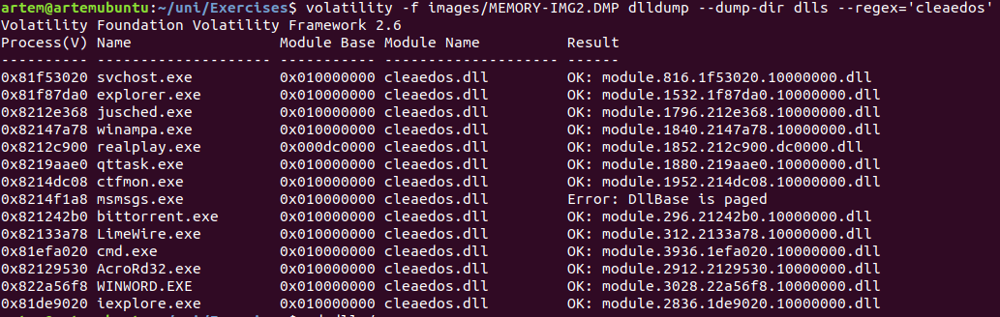

# CCF Lab 4 - Memory Analysis 

Artem Abramov


## Prerequisites:
You have a memory image taken from a laptop, which was suspected to be involved
in a serious e-banking incident. It is to be assumed that some malware could be on
it. You suspect it could be either Zeus or Gozi, as these two malware families were
currently active in the country. Image is on the same VM that was used in the previous lab.


## Task 1

Make yourself familiar with the malware families and what characteristics they
have and how they can potentially be recognized. You can use files in
Desktop/Exercises/Documents

I read the documents availiable in the VM image:

_043.png)


The tools that are pre-installed for this lab:

_045.png)


## Task 2

Find out what could have happened: analyze the memory image and the
registry that was dumped too and is also available for investigation. Files are
located in Desktop/Exercises/images


### Examine the image

To analyze the image, I extracted it from the VM onto my host machine. Then I installed the volatility framework (version 2.6)

Checking the type of memory image:

```
# file images/MEMORY-IMG2.DMP 
images/MEMORY-IMG2.DMP: MS Windows 32bit crash dump, no PAE, full dump, 130943 pages
```


Image type in more details:

```
# volatility imageinfo -f images/MEMORY-IMG2.DMP 
Volatility Foundation Volatility Framework 2.6
INFO    : volatility.debug    : Determining profile based on KDBG search...
          Suggested Profile(s) : WinXPSP2x86, WinXPSP3x86 (Instantiated with WinXPSP2x86)
                     AS Layer1 : IA32PagedMemory (Kernel AS)
                     AS Layer2 : WindowsCrashDumpSpace32 (Unnamed AS)
                     AS Layer3 : FileAddressSpace (/home/artem/uni/Exercises/images/MEMORY-IMG2.DMP)
                      PAE type : No PAE
                           DTB : 0x39000L
                          KDBG : 0x8054cde0L
          Number of Processors : 1
     Image Type (Service Pack) : 3
                KPCR for CPU 0 : 0xffdff000L
             KUSER_SHARED_DATA : 0xffdf0000L
           Image date and time : 2010-05-05 11:54:02 UTC+0000
     Image local date and time : 2010-05-05 13:54:02 +0200
```


Running binwalk to identify interesting files:

```
# binwalk images/MEMORY-IMG2.DMP > binwalk.artem.txt
# head binwalk.artem.txt 

DECIMAL       HEXADECIMAL     DESCRIPTION
--------------------------------------------------------------------------------
150720        0x24CC0         Microsoft executable, portable (PE)
360448        0x58000         Microsoft executable, portable (PE)
376691        0x5BF73         Unix path: /tb.raiffeisendirect.ch/LoginAuthentication/staticcontent/html1/img/pic_invis.gif
390730        0x5F64A         Copyright string: "Copyright: Copyright(C)2000-2003 Adobe Systems, Inc. All Rights Reserved."
390741        0x5F655         Copyright string: "Copyright(C)2000-2003 Adobe Systems, Inc. All Rights Reserved."
392969        0x5FF09         Unix path: /Cyan/Magenta/Yellow/Black]/DeviceCMYK{}]
688128        0xA8000         Microsoft executable, portable (PE)
884736        0xD8000         GIF image data, version "89a", 1 x 1
962587        0xEB01B         Copyright string: "Copyright (c) 2006 Klaus Hartl (stilbuero.de)"
970752        0xED000         gzip compressed data, from FAT filesystem (MS-DOS, OS/2, NT), NULL date (1970-01-01 00:00:00)
1149133       0x1188CD        Unix path: /google.com/profiles/media/container",b))}else if(a==HDd){E=Fzc;e||(e=d)}m=new fDc(A,m);h[p](new BU("http://google.com/profiles/
1236812       0x12DF4C        YAFFS filesystem
```


### Checking for Gozi malware

First to test for presence of Gozi. According to the PDF document describing Gozi (page 6):

```
The best way to detect the presence of the Gozi Trojan is to look in the registry for the presence of the Gozi values. They are all consistently present here:
Gozi DLL
	HKLM\System\CurrentControlSet\Control\SessionManager\AppCertDlls
		(where you’ll find a reference to the Gozi DLL)
Gozi configuration
	HKCU\Software\AppDataLow\{GUID}
		(where {GUID} is a globally unique identifier)
```


Dump the registry:

```
# mkdir dumpreg
# volatility dumpregistry --output=text --output-file=dumpregistry.txt -D dumpreg -f images/MEMORY-IMG2.DMP
```

Checking the current control set:

```
# volatility -f images/MEMORY-IMG2.DMP printkey -K 'CurrentControlSet'
Volatility Foundation Volatility Framework 2.6
Legend: (S) = Stable   (V) = Volatile

----------------------------
Registry: \Device\HarddiskVolume1\WINDOWS\system32\config\system
Key name: CurrentControlSet (V)
Last updated: 2010-05-05 11:24:28 UTC+0000

Subkeys:

Values:
REG_LINK      SymbolicLinkValue : (V) \Registry\Machine\System\ControlSet001
```


Searching for the keys with volatility as shown below:

```
 # volatility -f images/MEMORY-IMG2.DMP  printkey -k 'AppDataLow'
 # volatility -f images/MEMORY-IMG2.DMP  printkey -K 'AppCertDlls'
 # volatility -f images/MEMORY-IMG2.DMP  printkey -K 'Software'
 # volatility -f images/MEMORY-IMG2.DMP  printkey -K 'CurrentControlSEt'
 # volatility -f images/MEMORY-IMG2.DMP  printkey -K 'Machine'
 # volatility -f images/MEMORY-IMG2.DMP  printkey -K 'ControlSet001'
 # volatility -f images/MEMORY-IMG2.DMP  printkey -K 'Registry'
 # volatility -f images/MEMORY-IMG2.DMP  printkey -K '\Registry'
```

However did not get any results (the response was: key not found)

On the other hand trying to directly grep through registry files did reveal a  suspicious string 'AppCertDll' as shown below:


Searching for 'AppDataLow' string:


This hints that it is too early to discard the the Gozi virus.

Then I tried using RegRipper (comes pre-installed with KaliLinux) to get these keys out as volatility framework did not identify them.

I installed it on Ubuntu following this source: https://blog.dfir.fi/tools/2020/02/19/install-regripper.html

Listing plugins that come with RegRipper:

```
rip.pl -c -l
```

I found one plugin that will extract all key/values (including deleted onces) - `slack`.

(reference: http://windowsir.blogspot.com/2008/07/deleted-keys-in-registry.html)

Running it on all the registry files to extract all keys and values (executable name is `rip.pl`)

```
# for f in registry.0xe* ; do rip.pl -r $f -p slack >> key-value.txt ; done
```

Looking at output to see if Gozi registry keys are present:

```
# fgrep -C50 --text -n -i 'appdatalow' key-value.txt
```

Output is shown below:

```
2179789-------------- Slack Data ------------
2179790:Key name: AppDataLow
2179791-Key LastWrite time = Wed May  5 09:05:20 2010 UTC
2179792-
2179793-   93b50  a0 ff ff ff 6e 6b 20 00 f0 52 aa 16 32 ec ca 01  ....nk ..R..2...
2179794-   93b60  00 00 00 00 10 34 01 00 03 00 00 00 00 00 00 00  .....4..........
2179795-   93b70  f0 eb 0a 00 ff ff ff ff 00 00 00 00 ff ff ff ff  ................
2179796-   93b80  38 61 03 00 ff ff ff ff 4c 00 00 00 00 00 00 00  8a......L.......
2179797-   93b90  00 00 00 00 00 00 00 00 20 00 6f 00 0a 00 00 00  ........ .o.....
2179798:   93ba0  41 70 70 44 61 74 61 4c 6f 77 63 00 6f 00 6d 00  AppDataLowc.o.m.
2179799-
2179800-------------- Slack Data ------------
2179801-   93bb0  f0 ff ff ff 26 00 45 00 64 00 69 00 74 00 00 00  ....&.E.d.i.t...
2179802-
2179803-------------- Slack Data ------------
2179804-Value Name: {41E300E0-78B6-11CE-849B-444553540000} {000214E9-0000-0000-C000-000000000046} 0x401
2179805-
2179806-   93bc0  90 ff ff ff 76 6b 53 00 10 00 00 00 70 28 09 00  ....vkS.....p(..
2179807-   93bd0  03 00 00 00 01 00 08 00 7b 34 31 45 33 30 30 45  ........{41E300E
2179808-   93be0  30 2d 37 38 42 36 2d 31 31 43 45 2d 38 34 39 42  0-78B6-11CE-849B
2179809-   93bf0  2d 34 34 34 35 35 33 35 34 30 30 30 30 7d 20 7b  -444553540000} {
2179810-   93c00  30 30 30 32 31 34 45 39 2d 30 30 30 30 2d 30 30  000214E9-0000-00
2179811-   93c10  30 30 2d 43 30 30 30 2d 30 30 30 30 30 30 30 30  00-C000-00000000
2179812-   93c20  30 30 34 36 7d 20 30 78 34 30 31 00 4d 00 6f 00  0046} 0x401.M.o.
2179813-
```


We can see that the key and an associated GUID value is present, which matches Gozi description.

However the key for 'AppCertDlls' could not be found, which weakens the probability that there is Gozi present.  This key is supposed to hold the name of the malicious DLL that gets loaded by Internet Explorer. 

Lets check all the Dlls loaded by Internet Explorer, maybe that will give some clues. Dump the list of DLLs loaded for each process:

```
# volatility -f images/MEMORY-IMG2.DMP dlllist > dlllist.txt
```

Try to identify suspicious DLLs for Internet Explorer in the list of loaded libraries:

```
$ fgrep -A30 Internet dlllist.txt 
Command line : "C:\Program Files\Internet Explorer\iexplore.exe" 
Service Pack 3

Base             Size  LoadCount LoadTime  Path
---------- ---------- ---------- --------- ----
0x00400000    0x19000     0xffff           C:\Program Files\Internet Explorer\iexplore.exe
0x7c900000    0xaf000     0xffff           C:\WINDOWS\system32\ntdll.dll
0x7c800000    0xf6000     0xffff           C:\WINDOWS\system32\kernel32.dll
0x77c10000    0x58000     0xffff           C:\WINDOWS\system32\msvcrt.dll
0x7e410000    0x91000     0xffff           C:\WINDOWS\system32\USER32.dll
0x77f10000    0x49000     0xffff           C:\WINDOWS\system32\GDI32.dll
0x77f60000    0x76000     0xffff           C:\WINDOWS\system32\SHLWAPI.dll
0x77dd0000    0x9b000     0xffff           C:\WINDOWS\system32\ADVAPI32.dll
0x77e70000    0x92000     0xffff           C:\WINDOWS\system32\RPCRT4.dll
0x77fe0000    0x11000     0xffff           C:\WINDOWS\system32\Secur32.dll
0x7e290000   0x171000     0xffff           C:\WINDOWS\system32\SHDOCVW.dll
0x77a80000    0x95000     0xffff           C:\WINDOWS\system32\CRYPT32.dll
0x77b20000    0x12000     0xffff           C:\WINDOWS\system32\MSASN1.dll
0x754d0000    0x80000     0xffff           C:\WINDOWS\system32\CRYPTUI.dll
0x5b860000    0x55000     0xffff           C:\WINDOWS\system32\NETAPI32.dll
0x77120000    0x8b000     0xffff           C:\WINDOWS\system32\OLEAUT32.dll
0x774e0000   0x13d000     0xffff           C:\WINDOWS\system32\ole32.dll
0x77c00000     0x8000     0xffff           C:\WINDOWS\system32\VERSION.dll
0x771b0000    0xaa000     0xffff           C:\WINDOWS\system32\WININET.dll
0x76c30000    0x2e000     0xffff           C:\WINDOWS\system32\WINTRUST.dll
0x76c90000    0x28000     0xffff           C:\WINDOWS\system32\IMAGEHLP.dll
0x76f60000    0x2c000     0xffff           C:\WINDOWS\system32\WLDAP32.dll
0x10000000     0xe000        0x1           C:\WINDOWS\system32\cleaedos.dll
0x76da0000    0x16000        0x1           C:\WINDOWS\system32\browser.dll
0x76bf0000     0xb000       0x10           C:\WINDOWS\system32\PSAPI.DLL
0x7c9c0000   0x817000       0x32           C:\WINDOWS\system32\SHELL32.dll
0x5d090000    0x9a000        0x5           C:\WINDOWS\system32\comctl32.dll
0x5ad70000    0x38000        0x6           C:\WINDOWS\system32\uxtheme.dll
0x74720000    0x4c000        0x2           C:\WINDOWS\system32\MSCTF.dll
0x75f80000    0xfd000        0x4           C:\WINDOWS\system32\BROWSEUI.dll
0x71600000    0x12000        0x1           C:\WINDOWS\system32\browselc.dll
0x77b40000    0x22000        0x1           C:\WINDOWS\system32\appHelp.dll
...
...
```

However there were 110 DLLs loaded for Internet Explorer, and even after filtering out the default ones, it was not possible to discover the DLL that could be confidently identified as Gozi.

Perhaps the problem with finding the AppCertDlls key is that neither volatility, nor slack plugin to regripper were able to identify that key. Lets try another utility to edit registry files: hivexsh 

(source: https://linux.die.net/man/1/hivexsh)

However after installing the program failed to parse the registry files extracted by volatility:

```
# hivexsh registry.0xe1035b60.system.reg 
hivexsh: failed to open hive file: registry.0xe1035b60.system.reg: Operation not supported

If you think this file is a valid Windows binary hive file (_not_
a regedit *.reg file) then please run this command again using the
hivexsh option '-d' and attach the complete output _and_ the hive file
which fails into a bug report at https://bugzilla.redhat.com/
```


The next attempt was using `reged` program that is part of the `chntpw` package (source: https://manpages.debian.org/jessie/chntpw/reged.8.en.html):

```
# sudo apt-get install chntpw
# reged -e registry.0xe1035b60.system.reg
```

While it seemed to work, nonetheless errors would crop up after navigating to a certain depth, which made it unusable to check for the specific key that could be related to Gozi. The interactive session is shown below:

```
reged -e registry.0xe1035b60.system.reg 
reged version 0.1 140201, (c) Petter N Hagen
Simple registry editor. ? for help.

> ls
Node has 7 subkeys and 0 values
  key name
  <ControlSet001>
  <ControlSet003>
  <LastKnownGoodRecovery>
  <MountedDevices>
  <Select>
  <Setup>
  <WPA>

> cd ControlSet001

\ControlSet001> cd Control

\ControlSet001\Control> ls 
Node has 55 subkeys and 4 values
  key name
  <AGP>
  <Arbiters>
  <BackupRestore>
  <Biosinfo>
  <BootVerificationProgram>
  <Class>
  <CoDeviceInstallers>
  <COM Name Arbiter>
  <ComputerName>
  <ContentIndex>
  <ContentIndexCommon>
  <CrashControl>
  <CriticalDeviceDatabase>
  <DeviceClasses>
  <FileSystem>
  <GraphicsDrivers>
ex_next: ERROR: not 'nk' node at 0x3a0b8
  size     type              value name             [value if type DWORD]
    18  1 REG_SZ             <CurrentUser>
    12  1 REG_SZ             <WaitToKillServiceTimeout>
    56  1 REG_SZ             <SystemStartOptions>
    72  1 REG_SZ             <SystemBootDevice>
ERROR: not 'nk' node! (strange?)
ERROR: not 'nk' node! (strange?)
ERROR: not 'nk' node! (strange?)
ERROR: not 'nk' node! (strange?)
```


Looking back at RegRipper, this page is helpful in identifying what plugins can be used to scrape a particular key: http://hexacorn.com/tools/3r.html

Now running appcertdlls.pl for extracting AppCertDlls key and values is shown below:

```
# for f in registry.0xe* ; do rip.pl -r $f -p appcertdlls ; done
Launching appcertdlls v.20120817
Select not found.
Launching appcertdlls v.20120817
radshost - C:\WINDOWS\system32\cleaedos.dll
Launching appcertdlls v.20120817
Select not found.
Launching appcertdlls v.20120817
Select not found.
Launching appcertdlls v.20120817
Select not found.
Launching appcertdlls v.20120817
Select not found.
Launching appcertdlls v.20120817
Select not found.
Launching appcertdlls v.20120817
Select not found.
Launching appcertdlls v.20120817
Select not found.
Launching appcertdlls v.20120817
Select not found.
Launching appcertdlls v.20120817
Select not found.
Launching appcertdlls v.20120817
Select not found.
Launching appcertdlls v.20120817
Select not found.
```

There is one match!

```
radshost - C:\WINDOWS\system32\cleaedos.dll
```

This means that registry dump  `registry.0xe1035b60.system.reg` has a key AppCertDlls with value `cleados.dll`.

Checking the list of DLLs loaded for Internet Explorer this DLL is indeed loaded:

```
0x10000000     0xe000        0x1                     C:\WINDOWS\system32\cleaedos.dll
```

Now it seems that everything matches the description of the Gozi virus (two registry keys present: one with suspicious name of DLL from the system32 directory and one with associated GUID, plus the fact that the suspicious DLL was loaded by Internet Explorer).

Then to be 100% certain I extracted the dll and checked it no VirusTotal. 

Extracting the suspicious dll:

```
# mkdir dlls
# volatility -f images/MEMORY-IMG2.DMP dlldump --dump-dir dlls --regex='cleaedos'
```

Shown below:



This library is present in multiple processes, interestingly it was extracted to the same size DLLs:

```
-rw-r--r-- 1 artem artem 41472 мая  5 19:36 module.1532.1f87da0.10000000.dll
-rw-r--r-- 1 artem artem 41472 мая  5 19:36 module.1796.212e368.10000000.dll
-rw-r--r-- 1 artem artem 41472 мая  5 19:36 module.1840.2147a78.10000000.dll
-rw-r--r-- 1 artem artem 41472 мая  5 19:36 module.1852.212c900.dc0000.dll
-rw-r--r-- 1 artem artem 41472 мая  5 19:36 module.1880.219aae0.10000000.dll
-rw-r--r-- 1 artem artem 41472 мая  5 19:36 module.1952.214dc08.10000000.dll
-rw-r--r-- 1 artem artem 41472 мая  5 19:36 module.2836.1de9020.10000000.dll
-rw-r--r-- 1 artem artem 41472 мая  5 19:36 module.2912.2129530.10000000.dll
-rw-r--r-- 1 artem artem 41472 мая  5 19:36 module.296.21242b0.10000000.dll
-rw-r--r-- 1 artem artem 41472 мая  5 19:36 module.3028.22a56f8.10000000.dll
-rw-r--r-- 1 artem artem 41472 мая  5 19:36 module.312.2133a78.10000000.dll
-rw-r--r-- 1 artem artem 41472 мая  5 19:36 module.3936.1efa020.10000000.dll
-rw-r--r-- 1 artem artem 41472 мая  5 19:36 module.816.1f53020.10000000.dll
```

But the hashes are all different:

```
sha1sum *
5ca2b8af671796a1a7a19b6dffcd11e219395385  module.1532.1f87da0.10000000.dll
f5526e2a1f100fa8b3863ab933adc8b3193e4407  module.1796.212e368.10000000.dll
61337182dae8fedad581f1f675efd237610e16ce  module.1840.2147a78.10000000.dll
ac1b21db7fb1b4ea2b54ce92bf086870b4eff116  module.1852.212c900.dc0000.dll
dd4e67c2f323675b3c5bd0eb8bfa7bb27812f71c  module.1880.219aae0.10000000.dll
539acebe463468d8f4fcfe8f5d88a0e3e1f56d19  module.1952.214dc08.10000000.dll
e356439420fea6f60e8f71f160559dcd1aeb25a0  module.2836.1de9020.10000000.dll
97d6b15155d09726853235fe2aba809c216479f8  module.2912.2129530.10000000.dll
801f20b57cdf42fccad1f86217bd07ab34574ec3  module.296.21242b0.10000000.dll
e5203e022d47b7778e414b04bfbce12a52e9252c  module.3028.22a56f8.10000000.dll
5e5822e297d2d90a35b9487089db714f1c73e844  module.312.2133a78.10000000.dll
ebd4cbc995bcfc9de1c50e9aae0b8e3acee581bd  module.3936.1efa020.10000000.dll
97a5b86f0131f33416c976c367bcf7bb75fe1638  module.816.1f53020.10000000.dll
```


Checking file `module.2836.1de9020.10000000.dll` that was extracted from Internet Explorer with online tools confirms the suspicion. 

Output from VirusTotal is shown below:


Output from Hybrid-Analysis is shown below:


### Identifying Zeus malware

For the sake of completeness, lets check for presence of Zeus malware.

One of the characteristics of the malware is that it runs a SOCKS proxy on port 13851.

reference: https://medium.com/@zemelusa/first-steps-to-volatile-memory-analysis-dcbd4d2d56a1

Checking all used ports from memory dump:

```
# volatility -f images/MEMORY-IMG2.DMP sockets
Volatility Foundation Volatility Framework 2.6
Offset(V)     PID   Port  Proto Protocol   Address         Create Time
---------- ------ ------ ------ ---------- --------------- -----------
0x82297858    296   6881     17 UDP        0.0.0.0         2010-05-05 11:25:53
0x81f73880    312   8008     17 UDP        77.57.180.189   2010-05-05 11:26:12
0x82190160      4    138     17 UDP        77.57.180.189   2010-05-05 11:25:09
0x82298948    312  41338      6 TCP        0.0.0.0         2010-05-05 11:25:47
0x822b7c20    312   1030      6 TCP        0.0.0.0         2010-05-05 11:25:30
0x81de6608    312   1065      6 TCP        0.0.0.0         2010-05-05 11:26:21
0x81f36008    312   1034      6 TCP        0.0.0.0         2010-05-05 11:25:32
0x821374c0    656    500     17 UDP        0.0.0.0         2010-05-05 11:25:18
0x8212f7e0      4    445      6 TCP        0.0.0.0         2010-05-05 11:24:39
0x822ad900    956    123     17 UDP        77.57.180.189   2010-05-05 11:25:22
0x81f5dd80    872    135      6 TCP        0.0.0.0         2010-05-05 11:25:03
0x81f658f8    312   6347     17 UDP        0.0.0.0         2010-05-05 11:25:47
0x81eb3a70    296   6881      6 TCP        0.0.0.0         2010-05-05 11:25:53
0x81e5dd80    312  45100      6 TCP        0.0.0.0         2010-05-05 11:26:07
0x81f808e0    312   1029      6 TCP        127.0.0.1       2010-05-05 11:25:30
0x8217f230    956    123     17 UDP        127.0.0.1       2010-05-05 11:25:22
0x821b08d0    312   1033      6 TCP        127.0.0.1       2010-05-05 11:25:32
0x822b04c0    656      0    255 Reserved   0.0.0.0         2010-05-05 11:25:18
0x81e4f788    312   1055      6 TCP        0.0.0.0         2010-05-05 11:26:20
0x81faa008   4008   4711      6 TCP        0.0.0.0         2010-05-05 11:35:48
0x822c6710   1224   1900     17 UDP        77.57.180.189   2010-05-05 11:25:30
0x81e7a150   1080   1037     17 UDP        0.0.0.0         2010-05-05 11:26:01
0x81eacca8    312   1067      6 TCP        0.0.0.0         2010-05-05 11:26:24
0x81f378a0    312   1036      6 TCP        0.0.0.0         2010-05-05 11:25:51
0x821d21c0      4    139      6 TCP        77.57.180.189   2010-05-05 11:25:09
0x820f52d0   2836   1226      6 TCP        0.0.0.0         2010-05-05 11:51:41
0x821666b8   2104   1026      6 TCP        127.0.0.1       2010-05-05 11:25:30
0x821a89d0    312   5214      6 TCP        77.57.180.189   2010-05-05 11:26:06
0x8223f078   2836   1230      6 TCP        0.0.0.0         2010-05-05 11:51:48
0x81e9eaf0   2836   1070     17 UDP        127.0.0.1       2010-05-05 11:41:17
0x821b0e98    312  41338     17 UDP        0.0.0.0         2010-05-05 11:25:47
0x81f79008   1224   1900     17 UDP        127.0.0.1       2010-05-05 11:25:30
0x8210ae98      4    137     17 UDP        77.57.180.189   2010-05-05 11:25:09
0x81e99b40   1080   1038     17 UDP        0.0.0.0         2010-05-05 11:26:01
0x8215c2d0    656   4500     17 UDP        0.0.0.0         2010-05-05 11:25:18
0x81ec7a38    312   5353     17 UDP        0.0.0.0         2010-05-05 11:26:04
0x81e50c20    188   5152      6 TCP        127.0.0.1       2010-05-05 11:25:18
0x81fdb3b8   2836   1227      6 TCP        0.0.0.0         2010-05-05 11:51:41
0x8204b5d0      4    445     17 UDP        0.0.0.0         2010-05-05 11:24:39
0x82366410    312   1035      6 TCP        127.0.0.1       2010-05-05 11:25:51
```

Looks like port 13851 is not used.

The PDF document on Zeus malware lists the following steps to verify its presence:

```
Since the new variant of Zeus doesn’t use complex rootkit techniques, detection is relatively easy. Simply start the registry editor (regedit.exe) and check for an entry in the Run section of HKEY_CURRENT_USER\Software\Microsoft\Windows\CurrentVersion\Run.

The things to look out for are:
	- Name looks like a GUID (such as {26014332-876A-668A-546A-2A9930E39482})
	- Value is a filename in %USERDIR%\Application Data\<RANDOM DIR>\<RANDOM FILE> 
	  (such as “C:\Documents and Settings\support\Application Data\Kyniin\yqypy.exe”)
```


According to http://hexacorn.com/tools/3r.html there are two plugins to RegRipper that can extract info from registry key:

```
HKEY\Software\Microsoft\Windows\CurrentVersion\Run
```

- reveton.pl
- vawtrak.pl

However it turns out that they specifically check for certain exploits and do not reveal the contents of Run key.

Then I tried using reged as shown below:

```
# reged -e registry.0xe17cb008.software.reg
reged version 0.1 140201, (c) Petter N Hagen
Simple registry editor. ? for help.

> cd \Microsoft\Windows\CurrentVersion\Run

\Microsoft\Windows\CurrentVersion\Run> ls
Node has 1 subkeys and 5 values
  key name
  <OptionalComponents>
  size     type              value name             [value if type DWORD]
   114  1 REG_SZ             <Adobe Reader Speed Launcher>
    90  1 REG_SZ             <SunJavaUpdateSched>
    72  1 REG_SZ             <WinampAgent>
   134  1 REG_SZ             <RealTray>
   104  1 REG_SZ             <QuickTime Task>

```

There is nothing that looks like a Zeus trojan. 


### Conclusion

There is confirmed trace of Gozi virus. Zeus virus is absent.


## Task 3

Make a log of all actions and put it into the report as an Investigator.


To create the timeline I used the autotimeliner tool, which is based on volatility framework.

source: https://www.andreafortuna.org/2018/11/19/autotimeliner-automatically-extract-forensic-timeline-from-memory-dumps/

Running it was as below:

```
./autotimeliner/autotimeline.py -f images/MEMORY-IMG2.DMP -t 2005-01-01..2012-01-01

                _     _______ _                _ _
     /\        | |   |__   __(_)              | (_)
    /  \  _   _| |_ ___ | |   _ _ __ ___   ___| |_ _ __   ___ _ __
   / /\ \| | | | __/ _ \| |  | | '_ ` _ \ / _ \ | | '_ \ / _ \ '__|
  / ____ \ |_| | || (_) | |  | | | | | | |  __/ | | | | |  __/ |
 /_/    \_\__,_|\__\___/|_|  |_|_| |_| |_|\___|_|_|_| |_|\___|_|

- Automagically extract forensic timeline from volatile memory dump -

Andrea Fortuna - andrea@andreafortuna.org - https://www.andreafortuna.org

*** Processing image images/MEMORY-IMG2.DMP
-------
*** Starting image identification......WinXPSP2x86
*** Creating memory timeline......done!
*** Creating shellbags timeline......done!
*** Creating $MFT timeline......done!
*** Merging and filtering timelines......done!
Timeline saved in images/MEMORY-IMG2.DMP-timeline.csv
```

The last events are shown below:

```
Wed May 05 2010 15:55:26,0,macb,---------------,0,0,0,"[TIMER] HTTP.sys Signaled: -/Routine: 0xf30dc832/Period(ms): 0/Offset: 0xf30eb260"
Wed May 05 2010 15:55:42,0,macb,---------------,0,0,0,"[TIMER] ntoskrnl.exe Signaled: -/Routine: 0x805175eb/Period(ms): 0/Offset: 0x8055b0c0"
Wed May 05 2010 15:56:50,0,macb,---------------,0,0,0,"[TIMER] BATTC.SYS Signaled: -/Routine: 0xf894eb26/Period(ms): 0/Offset: 0x82340010"
Wed May 05 2010 15:56:50,0,macb,---------------,0,0,0,"[TIMER] BATTC.SYS Signaled: -/Routine: 0xf894eb26/Period(ms): 0/Offset: 0x82370010"
Wed May 05 2010 16:24:28,0,macb,---------------,0,0,0,"[TIMER] ntoskrnl.exe Signaled: -/Routine: 0x80518161/Period(ms): 0/Offset: 0x80562400"
Wed May 05 2010 16:24:39,0,macb,---------------,0,0,0,"[TIMER] ipsec.sys Signaled: -/Routine: 0xf620a3e7/Period(ms): 0/Offset: 0xf6219d70"
Wed May 05 2010 16:24:40,0,macb,---------------,0,0,0,"[TIMER] netbt.sys Signaled: -/Routine: 0xf618948a/Period(ms): 0/Offset: 0x821449d0"
Wed May 05 2010 16:53:38,0,macb,---------------,0,0,0,"[TIMER] afd.sys Signaled: -/Routine: 0xf617775a/Period(ms): 0/Offset: 0x81f2ca98"
Thu May 06 2010 09:36:52,0,macb,---------------,0,0,0,"[TIMER] NDIS.sys Signaled: -/Routine: 0xf8396f6f/Period(ms): 0/Offset: 0x820fd1a0"
Thu May 06 2010 09:36:52,0,macb,---------------,0,0,0,"[TIMER] NDIS.sys Signaled: -/Routine: 0xf8396f6f/Period(ms): 0/Offset: 0x820fdb40"
Fri May 07 2010 03:49:08,0,macb,---------------,0,0,0,"[TIMER] NDIS.sys Signaled: -/Routine: 0xf8396f6f/Period(ms): 0/Offset: 0x8216c8a8"
Fri May 07 2010 03:49:08,0,macb,---------------,0,0,0,"[TIMER] NDIS.sys Signaled: -/Routine: 0xf8396f6f/Period(ms): 0/Offset: 0x8216eb78"
Fri May 07 2010 03:49:08,0,macb,---------------,0,0,0,"[TIMER] NDIS.sys Signaled: -/Routine: 0xf8396f6f/Period(ms): 0/Offset: 0x821711a0"
Fri May 07 2010 03:49:08,0,macb,---------------,0,0,0,"[TIMER] NDIS.sys Signaled: -/Routine: 0xf8396f6f/Period(ms): 0/Offset: 0x82171860"
Sun May 30 2010 12:25:21,0,macb,---------------,0,0,0,"[TIMER] afd.sys Signaled: -/Routine: 0xf617775a/Period(ms): 0/Offset: 0x81e1abf8"
Sun Oct 31 2010 03:59:59,0,macb,---------------,0,0,0,"[TIMER] ntoskrnl.exe Signaled: -/Routine: 0x80546f10/Period(ms): 0/Offset: 0x80562500"
```

To actually draw the timeline Timesketch seemed to be a good choice. However there are certain requirements when importing CSV data, source: https://github.com/google/timesketch/blob/master/docs/CreateTimelineFromJSONorCSV.md

Therefore it was necessary to modify the CSV in order to import it into timesketch. The following snippet will convert the collected CSV into desired format for timesketch:

```python
#!/usr/bin/python3

# see: https://github.com/google/timesketch/blob/master/docs/CreateTimelineFromJSONorCSV.md
# message,timestamp,datetime,timestamp_desc,extra_field_1,extra_field_2
# A message,1331698658276340,2015-07-24T19:01:01+00:00,Write time,foo,bar

import dateparser
import csv

with open('import-timesketch.csv', 'w') as csvfile:
    spamwriter = csv.writer(csvfile
                            , delimiter=','
                            , quotechar='"'
                            , quoting=csv.QUOTE_MINIMAL)
    spamwriter.writerow(
        ["datetime","size","timestamp_desc","mode","uid","gid","meta","message"]
    )

    count = 0
    fpath = "/home/artem/uni/Exercises/images/MEMORY-IMG2.DMP-timeline.csv"
    with open(fpath, "r") as csvfile:
        spamreader = csv.reader(csvfile, delimiter=',', quotechar='"')
        next(spamreader, None)  # skip the headers
        for row in spamreader:
            evdate = dateparser.parse(row[0])
            row[0] = evdate.isoformat()
            spamwriter.writerow(row)

```

The dateparsing library is not part of python's standard library: https://github.com/scrapinghub/dateparser


It was a struggle to get Timesketch to work. (Timesketch short overview: https://blog.timesketch.org/2019/12/13/new-ui-same-great-functionality-new-wrapping/) 

Then starting the data analysis:


 

Investigate the relationship between cleaedos.dll and AppDataLow registry key:


Looks like dll was created on 2010-04-29.


Exploring the events immediately before the first event relating to cleaedos.dll:


Finding all events that tool place between 2010-04-28 and 2010-05-01 when the dll supposedly appeared:


Looks like there was a HideProc trojan as well, judging by the event listings (source: https://www.microsoft.com/en-us/wdsi/threats/malware-encyclopedia-description?Name=Trojan:Win32/Hideproc.G).


The log reveals installing various programs e.g. LimeWire.

Exploring the context surrounding registry modification event:


Two suspicious events that happened on the day before cleaedos.dll appeared.


Looks like a remote login and use of windows netcat, but is this a valid user or a malicious attacker?


## Task 4

Q: Imagine the situation, there was an incident on PC (Windows) but the
suspected PC (Windows) is locked. What can you do to be able to produce live
forensics? What challenges do you have?


Its difficult to image a situation where a forensic expert was called in, but he was not given the password to the machine. In other words bypassing the lock screen in the realm of cracking (figuring out an attack vector) not forensics. If its a windows PC in some company it would most likely be assigned to a Domain (hence password could be retrieved) or there would be an Admin account which would allow login. 

Its possible to get a RAM memory dump (that could be analyzed later as if it was live on a VirtualMachine), but it would not be actually "live forensics" and it requires some necessary setup to be done beforehand.

Therefore there is no way (aside from funding an exploit in windows lock screen software) to do live forensics on a non-domain locked windows PC. And for a domain PC just use the domain-controller/admin account, whatever other information the organization provides to get the actual password.

As already said the PC can be non-domain, but administrator can perform some necessary setup beforehand that would allow a memory dump image to be taken while computer is locked. One is setting a keyboard combination (CTRL + double SCROLL_LOCK) that forces kernel to generate memory dump file.

Software like F-responce enables access to physical memory over iSCSI, allowing to take memory dumps.

There is a Thunderbolt exploit (if the physical machine has Thunderbold adapter) that allows to get DirectMemoryAccess to a locked machine and poke at every address to generate a live memory dump.

sources:

- https://www.f-response.com/
- https://support.microsoft.com/en-us/help/244139/windows-feature-lets-you-generate-a-memory-dump-file-by-using-the-keyb
- https://support.microsoft.com/en-us/help/2516445/blocking-the-sbp-2-driver-and-thunderbolt-controllers-to-reduce-1394-d

- https://www.reddit.com/r/computerforensics/comments/42eq4p/how_to_do_live_forensics_when_windows_is_locked/


