# CCF Project

## Using modern open-source tools Plaso and Timesketch for forensic investigations of Linux based systems.

Artem Abramov

Google slides presentation: https://docs.google.com/presentation/d/1dpiOhXXPbIJgB4sSuhQXgrq8axgThbNG84MkE5bDyoQ/edit?usp=sharing

This project focuses on using two open-source projects focused on forensics for analysing Linux systems:

- Plaso (https://github.com/log2timeline/plaso) - tool to collect and categorise
    information from digital evidence, such as disk images or event logs (rewrite of
    log2timeline).
- Timesketch (https://github.com/google/timesketch) - graphical tool for collaborative
    forensic timeline analysis (can be used as an alternative to Autopsy).


### 1. How suited are Plaso and Timesketch for analysing Linux based servers.

##### Looking for samples

To get some data to examine, take the disk image of a Linux machine. Initially I was looking to find some online CTF challenges for hard drive forensics of a Linux system, however after a day of searching nothing really interesting was found.  Below are some moderately interesting links:

- https://w00tsec.blogspot.com/2015/10/hacklu-2015-ctf-write-up-dr-bob.html - short and pivots to Windows forensics
- https://ctftime.org/writeup/15941 - data files partially deleted

(Note: I did find a good resource, unfortunately too late to study it properly: https://github.com/ashemery/LinuxForensics/tree/master/Workshop)

So I resigned to taking a normal system and going with that. 

##### Setting up example environment with vagrant

Setting up the environment is easiest done in vagrant (install the vagrant tool and virtualbox). Make a new directory and init vagrant environment.

```
# vagrant init ubuntu/bionic64
```

Edit Vagrantfile (for network config in particular) and run the machine:

```
# vagrant up
Bringing machine 'default' up with 'virtualbox' provider...
==> default: Checking if box 'ubuntu/bionic64' is up to date...
==> default: Clearing any previously set forwarded ports...
==> default: Clearing any previously set network interfaces...
==> default: Available bridged network interfaces:
1) wlo1
2) vmnet1
3) vmnet8
4) virbr0
5) eno2
==> default: When choosing an interface, it is usually the one that is
==> default: being used to connect to the internet.
    default: Which interface should the network bridge to? 1
==> default: Preparing network interfaces based on configuration...
    default: Adapter 1: nat
    default: Adapter 2: bridged
==> default: Forwarding ports...
    default: 22 (guest) => 2222 (host) (adapter 1)
==> default: Running 'pre-boot' VM customizations...
==> default: Booting VM...
==> default: Waiting for machine to boot. This may take a few minutes...
    default: SSH address: 127.0.0.1:2222
    default: SSH username: vagrant
    default: SSH auth method: private key
==> default: Machine booted and ready!
==> default: Checking for guest additions in VM...
==> default: Configuring and enabling network interfaces...
==> default: Mounting shared folders...
    default: /vagrant => /home/artem/vm-create/ubuntu-vbox
==> default: Machine already provisioned. Run `vagrant provision` or use the `--provision`
==> default: flag to force provisioning. Provisioners marked to run always will still run.
```

Show SSH configuration:

```
# vagrant ssh-config
Host default
  HostName 127.0.0.1
  User vagrant
  Port 2222
  UserKnownHostsFile /dev/null
  StrictHostKeyChecking no
  PasswordAuthentication no
  IdentityFile /home/artem/vm-create/ubuntu-vbox/.vagrant/machines/default/virtualbox/private_key
  IdentitiesOnly yes
  LogLevel FATAL
```

Connect to the machine (vagrant makes it easy without having to specify username/password):

```
# vagrant ssh
```

Optionally you can control the machne via VirtualBox. All what was necessary is to extract the raw disk image from the installed machine.

##### Extracting raw image from sample environment (i.e. evidence acquisition)

Convert the VirtualBox's VMDK into raw disk that can be analysed:

```
# VBoxManage clonemedium ubuntu-bionic-18.04-cloudimg.vmdk evidence.dd --format RAW
```

##### Prepare evidence for analysis in plaso

Check what partitions are there on disk (fdisk, parted or mmls from sleuthkit are good):

Using mmls from sleuthkit:

```
# mmls evidence.dd 
DOS Partition Table
Offset Sector: 0
Units are in 512-byte sectors

      Slot      Start        End          Length       Description
000:  Meta      0000000000   0000000000   0000000001   Primary Table (#0)
001:  -------   0000000000   0000002047   0000002048   Unallocated
002:  000:000   0000002048   0020971486   0020969439   Linux (0x83)
003:  -------   0020971487   0020971519   0000000033   Unallocated

```

Using more common fdisk:

```
# fdisk -lu evidence.dd 
Disk evidence.dd: 10 GiB, 10737418240 bytes, 20971520 sectors
Units: sectors of 1 * 512 = 512 bytes
Sector size (logical/physical): 512 bytes / 512 bytes
I/O size (minimum/optimal): 512 bytes / 512 bytes
Disklabel type: dos
Disk identifier: 0xe664df14

Device       Boot Start      End  Sectors Size Id Type
evidence.dd1 *     2048 20971486 20969439  10G 83 Linux
```
Multiply 2048 by sector size to get 1048576 bytes of offset for partition 1.
Mount with offset:

```
mount -o loop,ro,noexec,offset=1048576 evidence.dd evidence
```

Finally we can see the filesystem of the vagrant machine:

```
/data/evidence# ls -la
total 108
drwxr-xr-x 24 root  root   4096 мая 17 23:37 .
drwxrwxrwx  3 artem artem  4096 мая 19 01:08 ..
drwxr-xr-x  2 root  root   4096 мая 14 19:05 bin
drwxr-xr-x  3 root  root   4096 мая 14 19:04 boot
drwxr-xr-x  4 root  root   4096 мая 14 19:03 dev
drwxr-xr-x 89 root  root   4096 мая 17 22:49 etc
drwxr-xr-x  4 root  root   4096 мая 17 22:49 home
lrwxrwxrwx  1 root  root     33 мая 14 19:01 initrd.img -> boot/initrd.img-4.15.0-99-generic
lrwxrwxrwx  1 root  root     33 мая 14 19:01 initrd.img.old -> boot/initrd.img-4.15.0-99-generic
drwxr-xr-x 21 root  root   4096 мая 14 19:31 lib
drwxr-xr-x  2 root  root   4096 мая 14 18:53 lib64
drwx------  2 root  root  16384 мая 14 19:06 lost+found
drwxr-xr-x  2 root  root   4096 мая 14 18:53 media
drwxr-xr-x  2 root  root   4096 мая 14 18:53 mnt
drwxr-xr-x  2 root  root   4096 мая 14 18:53 opt
drwxr-xr-x  2 root  root   4096 апр 24  2018 proc
drwx------  3 root  root   4096 мая 17 22:49 root
drwxr-xr-x  3 root  root   4096 мая 14 19:04 run
drwxr-xr-x  2 root  root   4096 мая 14 19:31 sbin
drwxr-xr-x  2 root  root   4096 мая 17 22:49 snap
drwxr-xr-x  2 root  root   4096 мая 14 18:53 srv
drwxr-xr-x  2 root  root   4096 апр 24  2018 sys
drwxrwxrwt  8 root  root   4096 мая 17 23:53 tmp
drwxr-xr-x 10 root  root   4096 мая 14 18:53 usr
drwxr-xr-x  2 root  root   4096 мая 17 22:49 vagrant
drwxr-xr-x 13 root  root   4096 мая 14 19:04 var
lrwxrwxrwx  1 root  root     30 мая 14 19:01 vmlinuz -> boot/vmlinuz-4.15.0-99-generic
lrwxrwxrwx  1 root  root     30 мая 14 19:01 vmlinuz.old -> boot/vmlinuz-4.15.0-99-generic
```


The next step was to combine plaso with timesketch. Plaso has an output mode that is suitable for timesketch, however when run from docker this mode is disabled:

```
docker run log2timeline/plaso psteal -o list
2020-05-19 05:52:54,330 [INFO] (MainProcess) PID:6 <data_location> Determined data location: /usr/share/plaso
2020-05-19 05:52:54,538 [INFO] (MainProcess) PID:6 <artifact_definitions> Determined artifact definitions path: /usr/share/artifacts

******************************** Output Modules ********************************
     Name : Description
--------------------------------------------------------------------------------
  dynamic : Dynamic selection of fields for a separated value output format.
  elastic : Saves the events into an Elasticsearch database.
json_line : Saves the events into a JSON line format.
     json : Saves the events into a JSON format.
    rawpy : "raw" (or native) Python output.
      kml : Saves events with geography data into a KML format.
   l2tcsv : CSV format used by legacy log2timeline, with 17 fixed fields.
     null : Output module that does not output anything.
   l2ttln : Extended TLN 7 field | delimited output.
      tln : TLN 5 field | delimited output.
     xlsx : Excel Spreadsheet (XLSX) output
--------------------------------------------------------------------------------

*************************** Disabled Output Modules ***************************
      Name : Description
--------------------------------------------------------------------------------
timesketch : Create a Timesketch timeline.
--------------------------------------------------------------------------------
```

How to turn that on? It turns out that this module is activated conditionally if `import timesketch` works i.e. timesketch is installed, see https://github.com/log2timeline/plaso/issues/2398. To further complicate matters using `output to timesketch` option in plaso actually works by directly loading the data into redis database (i.e. plaso needs direct access to Timesketch's database).


##### Integrating Plaso with Timesketch

However it was possible to get it working by modifying the Timesketch Dockerfile to basically install and configure plaso alongside. Source: https://github.com/temach/timesketch/tree/integrate-plaso


#### a. What options do they provide for analyzing data found on various disks.

##### Plaso toolbox

Plaso is a project focused on timeline generation and analysis. The easiest option is to use the docker image which provides the following tools:

- image_export - export file  content from a storage media image or device based on various filters, such as extension names, paths, file creation dates, etc.
- log2timeline - extract events from individual files, recursing a directory (e.g. mount point) or storage media image or device. log2timeline creates a plaso storage file which can be analyzed with the pinfo and psort tools.
- pinfo - provide information about the contents of a plaso storage file.
- psort - post-process plaso  storage files. It allows to filter, sort and run automatic analysis using the  contents of plaso storage files.
- psteal - combines log2timeline and psort tools in one

The important output of plaso is the plaso file: The plaso storage file contains the extracted events and various  metadata about the collection process alongside information collected  from the source data. It may also contain information about tags applied to events and reports from analysis plugins.


##### Exploring dataset in Timesketch

Timesketch provides two main ways to explore data (in the Explore tab):

- Views - also known as Search: current search query plus extra filters
- Aggregations - also known as Insights: charts that filter events and graph one of their fields


##### Timesketch query language

Both mechanisms rely heavily on the query language to send queries to Elasticsearch backend. The language is based on Kibana, short introductions can be found at:

- https://www.elastic.co/guide/en/kibana/current/kuery-query.html 
- https://lucene.apache.org/core/2_9_4/queryparsersyntax.html


##### Searching for events that have a certain (non-empty) tag 

Some events have the type field (filled with a number) and some are empty, the task is to find all events that have type field assigned, then use the following query: 

```
_exists_:type
```

Results:

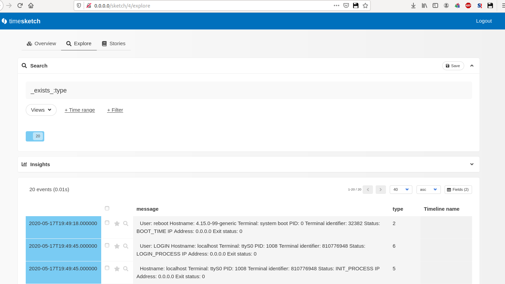


source: https://discuss.elastic.co/t/search-for-a-non-empty-field/107736


##### Timesketch Views

Clicking on event expands it:

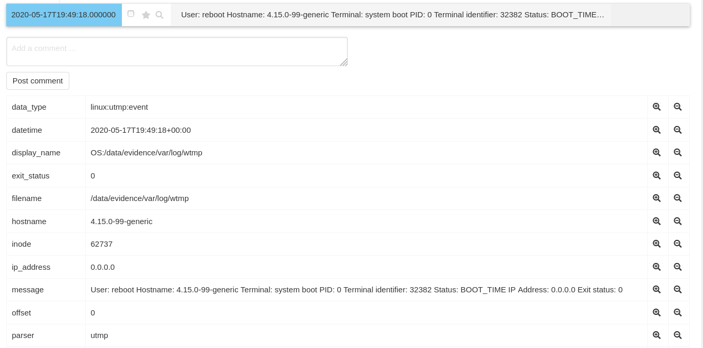


Clicking on a PLUS sign on the right adds a filter to get all the events with the same field value, and multiple filters can be added:

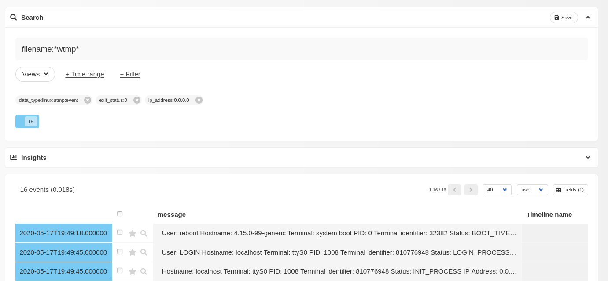


Clicking on the MINUS sign on the right of an expanded event also creates a filter but with NEGATION:

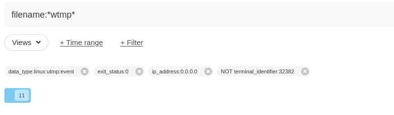

##### Timesketch Aggregations

Aggregations are available under the Insights drop down. Composing the aggregation is shown below:

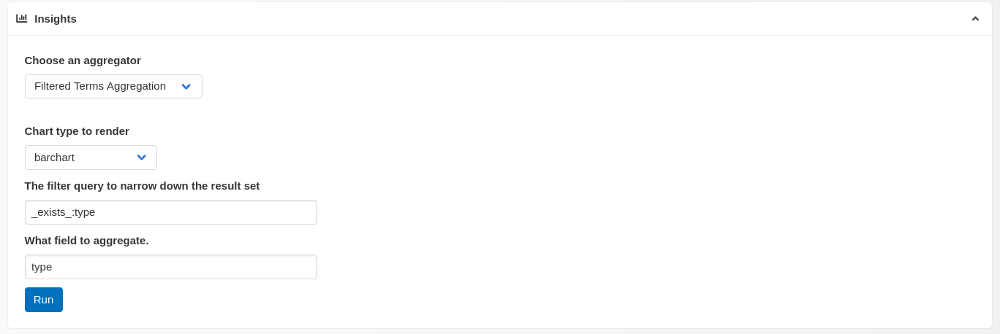

The result can be viewed immediately:

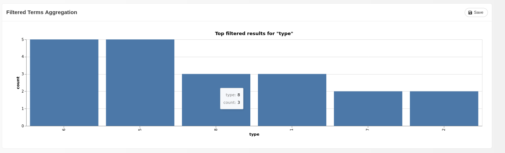

We can see that there are 3 events with type 8 and 5 events with type 6. Aggregations can be used to organize events by date, to see when was the system most actively used. 

More complicated queries are possible:

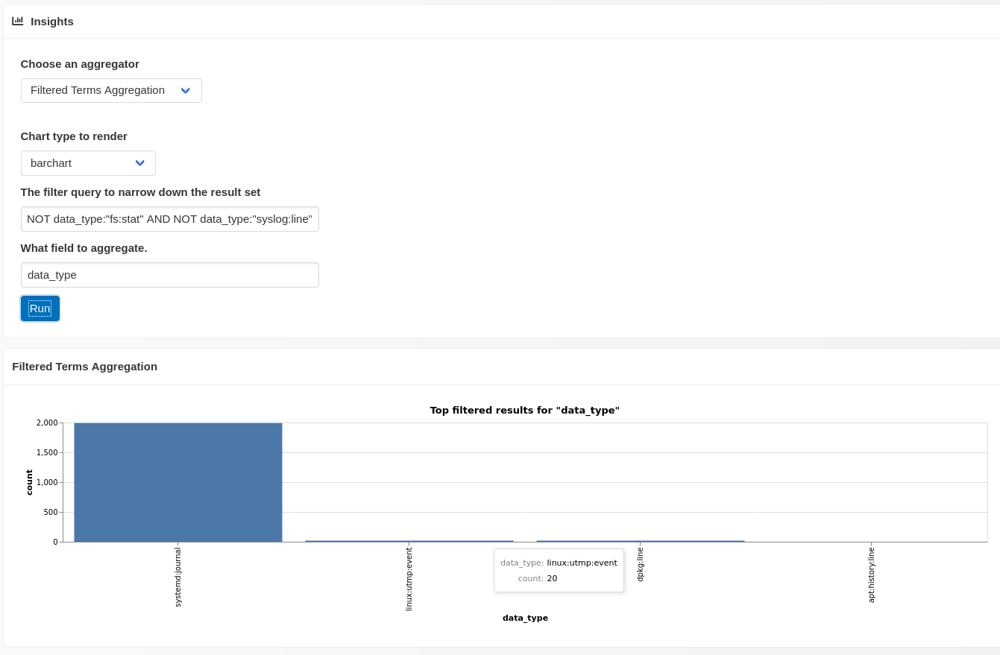


##### Timesketch Stories

Stories are a way to organize the whole investigation. The story can combine and mix text with saved views (i.e. yours searches and filters from Explore tab) and saved aggregations (i.e. charts and heatmaps). Example shown below:

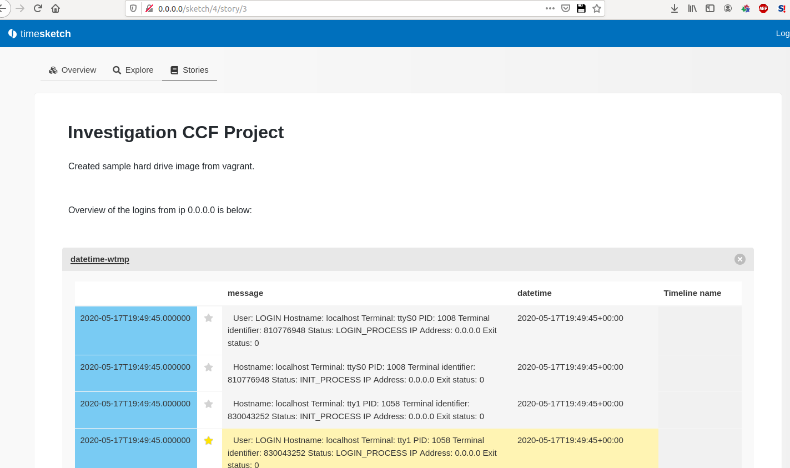


##### Timesketch Main

There is also a main tab that gives an overview on the available data:

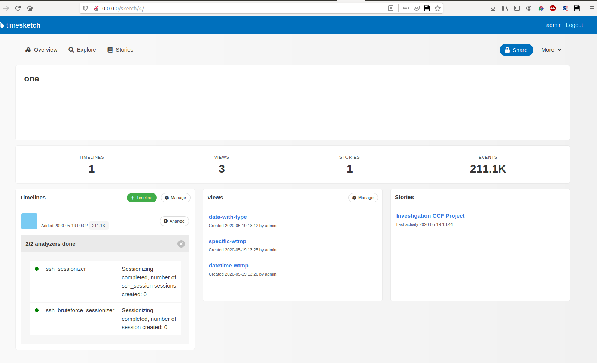


#### b. What filters/plugins are there to help with analysis.

There are a number of plugins for timesketch  that provide a default analysis engine,  as shown below:

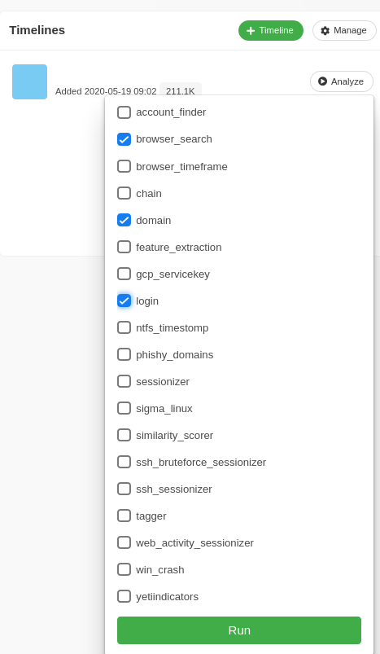


Plaso's log2timeline tool has a number of plugins to extract events from filesystem. The parsers work by examining the filesystem and generating events. For example the dpkg parser, works such that an event is created for each dpkg line. 

Parsers are given on the command line. The expression is a comma separated string where each element is a preset, parser or plugin name. Each element can be prepended with an exclamation mark to exclude the item. Matching is case insensitive. 

Examples: 

- `linux,!bash_history` enables the linux preset, without the bash_history parser.

- `sqlite,!sqlite/chrome_history` enables all sqlite plugins except for chrome_history.

    

Available parsers are shown below:

```
*********************************** Parsers ************************************
                 Name : Description
--------------------------------------------------------------------------------
              amcache : Parser for AMCache Registry entries.
    android_app_usage : Parser for Android usage-history.xml files.
        apache_access : Apache access Parser
          apt_history : Parser for APT History log files.
              asl_log : Parser for ASL log files.
         bash_history : Parser for Bash history files
              bencode : Parser for bencoded files.
       binary_cookies : Parser for Safari Binary Cookie files.
              bsm_log : Parser for BSM log files.
         chrome_cache : Parser for Chrome Cache files.
   chrome_preferences : Parser for Chrome Preferences files.
             cups_ipp : Parser for CUPS IPP files.
  custom_destinations : Parser for *.customDestinations-ms files.
                 czip : Parser for compound ZIP files.
           dockerjson : Parser for JSON Docker files.
                 dpkg : Parser for Debian dpkg.log files.
                esedb : Parser for Extensible Storage Engine (ESE) database
                        files.
             filestat : Parser for file system stat information.
        firefox_cache : Parser for Firefox Cache version 1 files (Firefox 31
                        or earlier).
       firefox_cache2 : Parser for Firefox Cache version 2 files (Firefox 32
                        or later).
            fseventsd : Parser for fseventsd files.
       gdrive_synclog : Parser for Google Drive Sync log files.
             java_idx : Parser for Java WebStart Cache IDX files.
                  lnk : Parser for Windows Shortcut (LNK) files.
  mac_appfirewall_log : Parser for appfirewall.log files.
         mac_keychain : Parser for MacOS Keychain files.
        mac_securityd : Parser for MacOS securityd log files.
              mactime : Parser for SleuthKit version 3 bodyfiles.
              macwifi : Parser for MacOS wifi.log files.
    mcafee_protection : Parser for McAfee AV Access Protection log files.
                  mft : Parser for NTFS $MFT metadata files.
               msiecf : Parser for MSIE Cache Files (MSIECF) also known as
                        index.dat.
networkminer_fileinfo : Parser for NetworkMiner .fileinfos files.
                olecf : Parser for OLE Compound Files (OLECF).
         opera_global : Parser for Opera global_history.dat files.
  opera_typed_history : Parser for Opera typed_history.xml files.
                   pe : Parser for Portable Executable (PE) files.
                plist : Parser for binary and text plist files.
           pls_recall : Parser for PL/SQL Recall files.
   popularity_contest : Parser for popularity contest log files.
             prefetch : Parser for Windows Prefetch files.
          recycle_bin : Parser for Windows $Recycle.Bin $I files.
    recycle_bin_info2 : Parser for Windows Recycler INFO2 files.
                rplog : Parser for Windows Restore Point (rp.log) files.
                santa : Santa Parser
                 sccm : Parser for SCCM logs files.
              selinux : Parser for SELinux audit.log files.
             setupapi : Parser for Windows Setupapi log files.
         skydrive_log : Parser for OneDrive (or SkyDrive) log files.
     skydrive_log_old : Parser for OneDrive (or SkyDrive) old log files.
            sophos_av : Parser for Anti-Virus log (SAV.txt) files.
               sqlite : Parser for SQLite database files.
     symantec_scanlog : Parser for Symantec Anti-Virus log files.
               syslog : Syslog Parser
      systemd_journal : Parser for Systemd Journal files.
       trendmicro_url : Parser for Trend Micro Office Web Reputation log files.
        trendmicro_vd : Parser for Trend Micro Office Scan Virus Detection log
                        files.
              usnjrnl : Parser for NTFS USN change journal ($UsnJrnl).
                 utmp : Parser for Linux libc6 utmp files.
                utmpx : Parser for Mac OS X 10.5 utmpx files.
               vsftpd : Parser for vsftpd log files.
               winevt : Parser for Windows EventLog (EVT) files.
              winevtx : Parser for Windows XML EventLog (EVTX) files.
          winfirewall : Parser for Windows Firewall Log files.
               winiis : Parser for Microsoft IIS log files.
               winjob : Parser for Windows Scheduled Task job (or At-job)
                        files.
               winreg : Parser for Windows NT Registry (REGF) files.
             xchatlog : Parser for XChat log files.
      xchatscrollback : Parser for XChat scrollback log files.
 zsh_extended_history : Parser for ZSH extended history files
--------------------------------------------------------------------------------

**************************** Parser plugins: syslog ****************************
Name : Description
--------------------------------------------------------------------------------
cron : Parser for syslog cron messages.
 ssh : Parser for SSH syslog entries.
--------------------------------------------------------------------------------

**************************** Parser plugins: winreg ****************************
                                Name : Description
--------------------------------------------------------------------------------
                      appcompatcache : Parser for Application Compatibility
                                       Cache Registry data.
                              bagmru : Parser for BagMRU Registry data.
                                 bam : Parser for Background Activity
                                       Moderator Registry data.
                            ccleaner : Parser for CCleaner Registry data.
               explorer_mountpoints2 : Parser for mount points Registry data.
              explorer_programscache : Parser for Explorer ProgramsCache
                                       Registry data.
                microsoft_office_mru : Parser for Microsoft Office MRU
                                       Registry data.
               microsoft_outlook_mru : Parser for Microsoft Outlook search MRU
                                       Registry data.
             mrulist_shell_item_list : Parser for Most Recently Used (MRU)
                                       Registry data.
                      mrulist_string : Parser for Most Recently Used (MRU)
                                       Registry data.
           mrulistex_shell_item_list : Parser for Most Recently Used (MRU)
                                       Registry data.
                    mrulistex_string : Parser for Most Recently Used (MRU)
                                       Registry data.
     mrulistex_string_and_shell_item : Parser for Most Recently Used (MRU)
                                       Registry data.
mrulistex_string_and_shell_item_list : Parser for Most Recently Used (MRU)
                                       Registry data.
                           msie_zone : Parser for Internet Explorer zone
                                       settings Registry data.
                           mstsc_rdp : Parser for Terminal Server Client
                                       Connection Registry data.
                       mstsc_rdp_mru : Parser for Terminal Server Client MRU
                                       Registry data.
                      network_drives : Parser for Network Registry data.
                            networks : Parser for NetworkList data.
                          userassist : Parser for User Assist Registry data.
                windows_boot_execute : Parser for Boot Execution Registry data.
                 windows_boot_verify : Parser for Boot Verification Registry
                                       data.
                         windows_run : Parser for run and run once Registry
                                       data.
                   windows_sam_users : Parser for SAM Users and Names Registry
                                       keys.
                    windows_services : Parser for services and drivers
                                       Registry data.
                    windows_shutdown : Parser for ShutdownTime Registry value.
                  windows_task_cache : Parser for Task Scheduler cache
                                       Registry data.
                    windows_timezone : Parser for Windows timezone settings.
                  windows_typed_urls : Parser for Explorer typed URLs Registry
                                       data.
                 windows_usb_devices : Parser for USB device Registry entries.
             windows_usbstor_devices : Parser for USB Plug And Play Manager
                                       USBStor Registry Key.
                     windows_version : Parser for Windows version Registry
                                       data.
                            winlogon : Parser for winlogon Registry data.
                          winrar_mru : Parser for WinRAR History Registry data.
                      winreg_default : Parser for Registry data.
--------------------------------------------------------------------------------

**************** Parser presets (/usr/share/plaso/presets.yaml) ****************
      Name : Parsers and plugins
--------------------------------------------------------------------------------
   android : android_app_usage, chrome_cache, filestat, sqlite/android_calls,
             sqlite/android_sms, sqlite/android_webview,
             sqlite/android_webviewcache, sqlite/chrome_8_history,
             sqlite/chrome_17_cookies, sqlite/chrome_27_history,
             sqlite/chrome_66_cookies, sqlite/skype
     linux : apt_history, bash_history, bencode, czip/oxml, dockerjson, dpkg,
             filestat, gdrive_synclog, olecf, pls_recall, popularity_contest,
             selinux, sqlite/google_drive, sqlite/skype, sqlite/zeitgeist,
             syslog, systemd_journal, utmp, vsftpd, webhist, xchatlog,
             xchatscrollback, zsh_extended_history
     macos : asl_log, bash_history, bencode, bsm_log, cups_ipp, czip/oxml,
             filestat, fseventsd, gdrive_synclog, mac_appfirewall_log,
             mac_keychain, mac_securityd, macwifi, olecf, plist,
             sqlite/appusage, sqlite/google_drive, sqlite/imessage,
             sqlite/ls_quarantine, sqlite/mac_document_versions,
             sqlite/mac_notes, sqlite/mackeeper_cache, sqlite/mac_knowledgec,
             sqlite/skype, syslog, utmpx, webhist, zsh_extended_history
   webhist : binary_cookies, chrome_cache, chrome_preferences,
             esedb/msie_webcache, firefox_cache, java_idx, msiecf,
             opera_global, opera_typed_history, plist/safari_history,
             sqlite/chrome_8_history, sqlite/chrome_17_cookies,
             sqlite/chrome_27_history, sqlite/chrome_66_cookies,
             sqlite/chrome_autofill, sqlite/chrome_extension_activity,
             sqlite/firefox_cookies, sqlite/firefox_downloads,
             sqlite/firefox_history
      win7 : amcache, custom_destinations, esedb/file_history,
             olecf/olecf_automatic_destinations, recycle_bin, winevtx, win_gen
 win7_slow : mft, win7
   win_gen : bencode, czip/oxml, esedb, filestat, gdrive_synclog, lnk,
             mcafee_protection, olecf, pe, prefetch, setupapi, sccm,
             skydrive_log, skydrive_log_old, sqlite/google_drive, sqlite/skype,
             symantec_scanlog, usnjrnl, webhist, winfirewall, winjob, winreg
     winxp : recycle_bin_info2, rplog, win_gen, winevt
winxp_slow : mft, winxp
```


#### c. What metadata is collected and parsed.

When importing to timesketch the metadata associated with each event is placed into "Fields". There are a number of different fields:

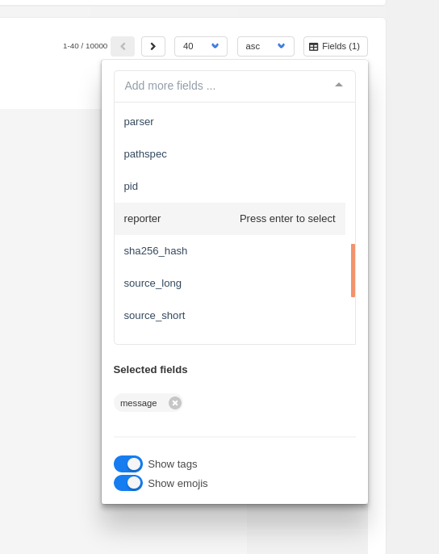

Note that Fields and Tags are different things. For example when running Plaso's psort utility (that actually does the import into timeline, the name and user parameters are optional):

```
plaso-switch.sh psort -o timesketch --name redundant --user admin /data/evidence.plaso
```

The result is as below:


There are zero tags and zero reports. Tagging uses a different mechanism from Fields.

Tagging is described in the User Guide: https://plaso.readthedocs.io/en/latest/sources/user/Analysis-plugin-tagging.html

But briefly plaso defines a concept called an analysis plugin. Anyone can can write a plugin that gets a copy of every event that is parsed from hard drive image. This information can be used to create tags and attach them back to the events or to create reports.

All psort analysers that create tags:

```
******************************* Analysis Plugins *******************************
                  Name : Description
--------------------------------------------------------------------------------
        browser_search : Analyze browser search entries from events.
                         [Summary/Report plugin]
      chrome_extension : Convert Chrome extension IDs into names, requires
                         Internet connection. [Summary/Report plugin]
           file_hashes : A plugin for generating a list of file paths and
                         corresponding hashes. [Summary/Report plugin]
               nsrlsvr : Analysis plugin for looking up hashes in nsrlsvr.
                         [Summary/Report plugin]
            sessionize : Analysis plugin that labels events by session.
                         [Summary/Report plugin]
               tagging : Analysis plugin that tags events according to rules
                         in a tagging file. [Summary/Report plugin]
unique_domains_visited : A plugin to generate a list all domains visited.
                         [Summary/Report plugin]
                 viper : An analysis plugin for looking up SHA256 hashes in
                         Viper. [Summary/Report plugin]
            virustotal : An analysis plugin for looking up hashes in
                         VirusTotal. [Summary/Report plugin]
      windows_services : Provides a single list of for Windows services found
                         in the Registry. [Summary/Report plugin]
--------------------------------------------------------------------------------
```

source: https://plaso.readthedocs.io/en/latest/sources/user/Using-psort.html#automatic-analysis


For example running the file_hashes analyser (on a folder with two files inside):

```
# plaso-switch.sh psort --analysis file_hashes -o rawpy -w /data/timeline-filehashes.rawpy /data/evidence-filehashes.plaso
```

Output:

```
plaso - psort version 20200430

Storage file		: /data/evidence-tchuntng.plaso
Processing time		: 00:00:00

Events:         Filtered        In time slice   Duplicates      MACB grouped    Total
                0               0               0               9               9

Identifier              PID     Status          Memory          Events          Tags            Reports
Main                    2276    exporting       96.9 MiB        9 (9)           0 (0)           0 (0)

Processing completed.

************************** Analysis reports generated **************************
file_hashes : 1
      Total : 1
--------------------------------------------------------------------------------

****************************** Analysis report: 1 ******************************
String : Report generated from: file_hashes Generated on:
         2020-05-23T18:49:23.000000Z Report text: Listing file paths and hashes
         OS:/data/evidence/home/test:
         OS:/data/evidence/home/test/gpg_secretkey.asc:
         sha256_hash=ae908b04136f82f248c70cf24b79607a4e64bc22adb58d10105164786e76743b
         OS:/data/evidence/home/test/message.txt.gpg:
         sha256_hash=a5ba89d7044c43e19e9ab3ff01244c5bc996327db691d66f612362ce7a70c061
--------------------------------------------------------------------------------
```


#### d. How can Timesketch API be used to export filtered data into another tool for further analysis (or scripted analysis).

source: https://dfir.blog/solving-magnet-forensics-ctf-with-plaso-timesketch-colab/

To use the api its necessary to install timesketch client (pandas gets pulled in as dependency):
```
pip install timesketch-api-client
```

Running in python3:

```python
from timesketch_api_client import client
import pandas as pd
pd.options.display.max_colwidth = 60

# set the connection parameters
server = 'http://0.0.0.0'
user = 'admin'
password = 'RlrUyOCLzHnLzs/QpeKC1l//NxKxuJxN1gPW97Hf9cc='

ts_client = client.TimesketchApi(server, user, password)

# get the right sketch
sketches = ts_client.list_sketches()
print(sketches[0].name)
current = sketches[0]

# make a query
ts_results = current.explore(
    'data_type:"dpkg:line"', 
    return_fields='datetime,timestamp_desc,data_type,inode,filename', 
    as_pandas=True)

# print results
print(ts_results)
```

Results:

```
# python3 test-api.py 
one
    data_type                  datetime  ... label  timestamp_desc
0   dpkg:line 2020-05-14 16:31:07+00:00  ...    []   Creation Time
1   dpkg:line 2020-05-14 16:31:07+00:00  ...    []   Creation Time
2   dpkg:line 2020-05-14 16:31:07+00:00  ...    []   Creation Time
3   dpkg:line 2020-05-14 16:31:07+00:00  ...    []   Creation Time
4   dpkg:line 2020-05-14 16:31:07+00:00  ...    []   Creation Time
5   dpkg:line 2020-05-14 16:31:07+00:00  ...    []   Creation Time
6   dpkg:line 2020-05-14 16:31:08+00:00  ...    []   Creation Time
7   dpkg:line 2020-05-14 16:31:08+00:00  ...    []   Creation Time
8   dpkg:line 2020-05-14 16:31:08+00:00  ...    []   Creation Time
9   dpkg:line 2020-05-14 16:31:08+00:00  ...    []   Creation Time
10  dpkg:line 2020-05-14 16:31:08+00:00  ...    []   Creation Time
11  dpkg:line 2020-05-14 16:31:08+00:00  ...    []   Creation Time
12  dpkg:line 2020-05-14 16:31:08+00:00  ...    []   Creation Time
13  dpkg:line 2020-05-14 16:31:08+00:00  ...    []   Creation Time
14  dpkg:line 2020-05-14 16:31:08+00:00  ...    []   Creation Time
15  dpkg:line 2020-05-14 16:31:08+00:00  ...    []   Creation Time
16  dpkg:line 2020-05-14 16:31:08+00:00  ...    []   Creation Time
17  dpkg:line 2020-05-14 16:31:08+00:00  ...    []   Creation Time
18  dpkg:line 2020-05-14 16:31:08+00:00  ...    []   Creation Time
19  dpkg:line 2020-05-14 16:31:09+00:00  ...    []   Creation Time

[20 rows x 6 columns]
```

This can be used in further analysis.

##### Google Colab integration

Exposing API allows timesketch to be integrated with colab, which means faster processing, etc. (although its questionable whether forensics investigation data is allowed to be handed over to google). Google Colab is similar to Jupiter-notebook i.e. intermixing python code with text and other annotations:

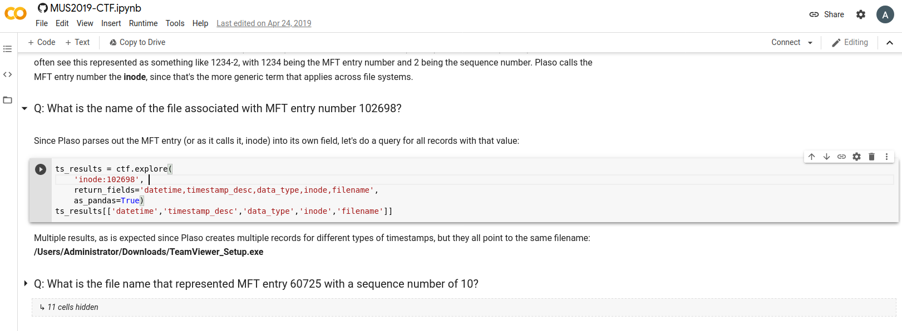


### 2. How can this analysis be improved in terms of accuracy, usefulness and speed.


#### a. What plugins are missing.

Analyzers for linux browser history. Plazo does not collect info well. Timesketch does not show any meaningful results either. Seems that its more focused on windows forensics. E.g. trying to discover ssh sessions, shows that none were found:

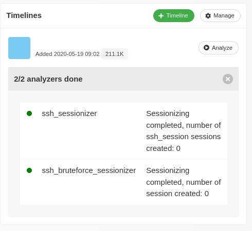

Plug in that would search for encrypted volumes based on standard distribution of bytes within a file: https://github.com/antagon/TCHunt-ng. Currently there is a limited version of this in the plazo entropy analyser: https://plaso.readthedocs.io/en/latest/sources/api/plaso.analyzers.hashers.html#module-plaso.analyzers.hashers.entropy 

#### b. What views/graphs are missing.

The heatmap is broken in the last version of Timesketch, the user interface is going through a complete rework this year, so maybe it will work again soon. 

The events have a default field of datetime and timestamp, however it would be useful to have just a date field, to group events by date. 


#### c. What outstanding bugs / limitations exist.

The view displays events in batches of 500, and keeps in memory array of 10000 events, however if there are more than that events collected the you will not be able to traverse all events from start to end and will have to filter by datetime. Related issue: https://github.com/google/timesketch/issues/921

Importing is quite slow for volumes over 5GB, I suspect that analysing something like a 100GB is probably impossible with the current approach. Related issue: https://github.com/log2timeline/plaso/issues/2501

Another way to approach the problem of analysing large volumes is filtering data at the time of collection. I.e. extracting only registry keys with log2timeline or extracting only browser history and analysing them separately.

Plaso and Timesketch currently are not able to interact when running in docker containers.  A possible alternative is to try uploading the output of log2timeline (a .plaso file) directly to timesketch via GUI, however there are also a number of gotchas: 

- https://github.com/google/timesketch/blob/master/docs/EnablePlasoUpload.md
- https://github.com/google/timesketch/issues/880

 And when uploading manually the psort capabilities are not utilized

### 3. What can be done to fix some of the limitations in the time scope of this CCF project.

#### Writing a filter/plugin

I wrote a plugin for plaso (specifically for psort), that aims to find all encrypted files on the disk image and produces a summary report at the end. This can be useful when just starting out the forensic investigation and looking for first clues. 

Below is the source code of the plugin:

```python
# -*- coding: utf-8 -*-
"""A plugin that reveals encrypted files on the filessystem."""

from __future__ import unicode_literals

import re

import requests

from plaso.analysis import interface
from plaso.analysis import logger
from plaso.analysis import manager
from plaso.containers import reports
import subprocess

class TchuntngPlugin(interface.AnalysisPlugin):
  """Find encrypted files, requires TCHunt-ng installed."""

  NAME = 'tchuntng'

  # Indicate that we can run this plugin during regular extraction.
  ENABLE_IN_EXTRACTION = True

  _SUPPORTED_EVENT_DATA_TYPES = frozenset([
      'fs:stat'])

  def __init__(self):
    """Initializes the TCHunt-ng analysis plugin."""
    super(TchuntngPlugin, self).__init__()

    self._cache = {}
    self._results = {}

  def CompileReport(self, mediator):
    """Compiles an analysis report.

    Args:
      mediator (AnalysisMediator): mediates interactions between analysis
          plugins and other components, such as storage and dfvfs.

    Returns:
      AnalysisReport: analysis report.
    """
    lines_of_text = []
    for user, filepaths in sorted(self._results.items()):
      lines_of_text.append(' == USER: {0:s} =='.format(user))
      for path in sorted(filepaths):
        lines_of_text.append('  {}'.format(path))
      lines_of_text.append('')

    lines_of_text.append('')
    report_text = '\n'.join(lines_of_text)
    analysis_report = reports.AnalysisReport(plugin_name=self.NAME, text=report_text)
    analysis_report.report_dict = self._results
    return analysis_report

  # pylint: disable=unused-argument
  def ExamineEvent(self, mediator, event, event_data):
    """Analyzes an event.

    Args:
      mediator (AnalysisMediator): mediates interactions between analysis
          plugins and other components, such as storage and dfvfs.
      event (EventObject): event to examine.
      event_data (EventData): event data.
    """
    if event_data.data_type not in self._SUPPORTED_EVENT_DATA_TYPES:
      return

    filename = getattr(event_data, 'filename', None)
    if not filename:
      return
    
    if filename in self._cache:
      return
    else:
      self._cache[filename] = True

    user = mediator.GetUsernameForPath(filename)

    # We still want this information in here, so that we can
    # manually deduce the username.
    if not user:
      user = "Not found"

    completed = subprocess.run("tchuntng {}".format(filename), shell=True)
    if completed.returncode == 0:
      # this is encrypted
      self._results.setdefault(user, [])
      if filename not in self._results[user]:
        self._results[user].append(filename)

manager.AnalysisPluginManager.RegisterPlugin(TchuntngPlugin)
```


To use the plugin, collect data with log2timeline:

```
plaso-switch.sh log2timeline /data/evidence-tchuntng.plaso /data/evidence/home/test
```

Run psort and pass tchuntng as the analyser:

```
plaso-switch.sh psort --analysis tchuntng -o rawpy -w /data/timeline-tchuntng.rawpy /data/evidence-tchuntng.plaso
```

You can also pass the data to timesketch:

```
plaso-switch.sh psort --analysis tchuntng -o timesketch /data/evidence-tchuntng.plaso
```


Sample output:

```
plaso - psort version 20200430

Storage file		: /data/evidence-tchuntng.plaso
Processing time		: 00:00:00

Events:         Filtered        In time slice   Duplicates      MACB grouped    Total
                0               0               0               9               9

Identifier              PID     Status          Memory          Events          Tags            Reports
Main                    2254    exporting       97.3 MiB        9 (9)           0 (0)           0 (0)

Processing completed.

************************** Analysis reports generated **************************
tchuntng : 1
   Total : 1
--------------------------------------------------------------------------------

****************************** Analysis report: 0 ******************************
String : Report generated from: tchuntng Generated on:
         2020-05-23T18:44:43.000000Z Report text: == USER: Not found ==
         /data/evidence/home/test/message.txt.gpg
--------------------------------------------------------------------------------
```

So the plugin identified the file /data/evidence/home/test/message.txt.gpg as encrypted, which is correct, but did not identify the other file gpg_secretkey.asc as encrypted, which is also correct.

Below is the Dockerfile that builds Timesketch with Plaso and with 

#### Actually contributing bug fixes to the Timesketch repository.

Integration of Plaso with Timesketch when running them as containers was not possible. The instructions were to install both of them on the host directly (then they could be integrated). During the course of this project a workaround was devised that allows to integrate Plaso with Timesketch while the applications remain containerized. Source code:  https://github.com/temach/timesketch/tree/integrate-plaso

The docker compose script for running Timesketch was broken, I investigated the issue and submitted a pull request upstream.  Source: https://github.com/google/timesketch/pull/1195


