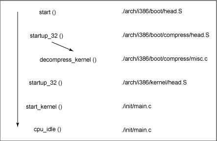
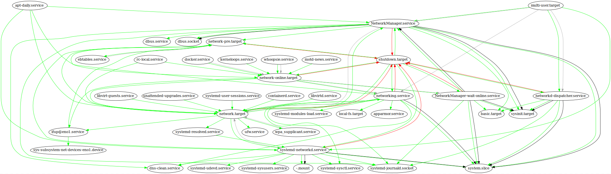

# CIA Lab 2 - Booting
#### Artem Abramov SNE19

May I suggest viewing this document in your browser at address: 
https://github.com/temach/innopolis_university_reports/blob/master/CIA-LAB-2-Booting.md
Unfortunately rendering the document to PDF breaks some long lines and crops images.

## Task 1 - Loading the OS

### 1. What is an UEFI OS loader and where does the Ubuntu OS loader reside on the system? Hint: See the UEFI specification.

What is a "UEFI OS loader"? The term is exactly defined in the UEFI specification in section `2.1.3 UEFI OS Loaders` (source: https://uefi.org/sites/default/files/resources/UEFI_Spec_2_8_final.pdf).

Instead of just copying the definition, lets see what it actually means.
"OS loader" is program to load the OS. Then at a higher level of abstraction "UEFI OS loader" can be called a "UEFI program (to load the OS)".

Now lets understand what is a "UEFI program". UEFI firmware is capable of executing programs that conform to the UEFI specification. To conform to the specification the program must:
1. Be stored on the ESP (EFI System Partition) partition that is formatted as FAT32 (source: https://wiki.osdev.org/UEFI) and has partition type set to C12A7328-F81F-11D2-BA4B-00A0C93EC93B.
2. Be stored in a PE (Portable Executable) format (an alternative to, for example, the ELF format). Actually the format is really called `PE32+` in the UEFI specification, but in terms of implementation it is just PE. (source: https://wiki.osdev.org/UEFI and https://wiki.osdev.org/PE).

Such programs may be EFI drivers, EFI scripts, bootloaders, bootmanagers and finally just user applications such as a Hello World shell (source: https://github.com/tianocore/edk2/blob/master/ShellPkg/Application/ShellCTestApp/ShellCTestApp.c). Most common ways to create such programs is using "EDK II" from TianoCore project or using the GNU-EFI project (source: https://www.rodsbooks.com/efi-programming/prepare.html).

To sum up a "UEFI program" is a program that UEFI firmware can find, load and execute. The UEFI specification requires that the UEFI firmware can run UEFI programs.

To be completely clear, the term "UEFI firmware" refers to the code that is (normally) developed by the motherboard manufacturer and comes pre-installed in the motherboard ROM. In older motherboards this ROM would contain BIOS code. Another interesting note is that UEFI firmware acts as a half-baked OS. It provides a standard library with quite a few functions, it can load and execute user programs, user programs can finish execution and return control back to UEFI firmware. The conclusion to draw from the above is that UEFI is a reasonably complicated piece of software with a different implementation by each manufacturer! UEFI specification allows the manufacturers to include many more interesting features than what is required by the UEFI specification.

Now lets look back at the "UEFI OS loader" term and focus on the "OS loader" part. 
An OS loader is a program that loads the kernel image into memory and begins its execution. 
The typical case for a GNU/Linux distribution is to keep the kernel as an ELF (Executable and Linkable Format) file stored in the /boot/ directory on an ext4 partition. The kernel is actually compressed, but will self-extract on execution, more info on kernel booting can be found here: https://blog.lse.epita.fr/cat/sustem/system-linux/index.html. 

The filename used for the kernel image is normally `bzImage` or `vmlinuz` (source with description: https://unix.stackexchange.com/questions/5518/what-is-the-difference-between-the-following-kernel-makefile-terms-vmlinux-vml and http://www.linfo.org/vmlinuz.html).
The bootloader normally handles loading the initrd as well, but that is not strictly necessary as it depends on how the kernel was build (source: https://stackoverflow.com/questions/6405083/is-it-possible-to-boot-the-linux-kernel-without-creating-an-initrd-image). 
To get an overview of the typical steps to load the kernel in GRUB see the link (its for MBR, but applies to GPT too): https://www.unix-ninja.com/p/Manually_booting_the_Linux_kernel_from_GRUB

The UEFI specification does not require that UEFI firmware know anything about ELF or how to mount and search ext4 filesystem for the kernel image. This is the job of the bootloader (OS loader).

Therefore (in the GNU/Linux world) the "UEFI OS loader" is a UEFI program that knows how to mount the ext4 filesystem, search it for a Linux kernel image, load the image and execute it.

If the UEFI OS loader successfully loads its operating system, it can take control of the system by using the ExitBootServices() UEFI firmware function. After successfully calling ExitBootServices(), all boot services in the system are terminated, including memory management, and the UEFI OS loader is responsible for the continued operation of the system. (source: https://uefi.org/sites/default/files/resources/UEFI_Spec_2_8_final.pdf)

When a new OS is installed on a GPT disk, one of the steps during the installation is making sure a UEFI OS loader program is present and correctly configured to load the newly installed kernel. The UEFI OS loader is placed in a subdirectory under the EFI directory on the ESP partition. To avoid name collisions organisations should register a subdirectory name with the UEFI Forum, the current list of registered subdirectories can be seen here: https://uefi.org/registry. 

In an attempts to pinpoint the location of the UEFI bootloader lets examine the contents of the ESP partition. We can find an "ubuntu" folder there.
Mounting the ESP partition and listing files in `\EFI\ubuntu\` is shown below:
```
$ mount /dev/sda1 /mnt/esp
$ ls -la /mnt/esp/EFI/ubuntu
total 3732
drwx------ 3 root root    4096 Aug 19 13:22 .
drwx------ 5 root root    4096 Aug 31 00:51 ..
-rwx------ 1 root root     108 Aug 19 13:22 BOOTX64.CSV
drwx------ 2 root root    4096 Aug 19 13:21 fw
-rwx------ 1 root root   75992 Aug 19 13:21 fwupx64.efi
-rwx------ 1 root root     201 Aug 19 13:22 grub.cfg
-rwx------ 1 root root 1116024 Aug 19 13:22 grubx64.efi
-rwx------ 1 root root 1269496 Aug 19 13:22 mmx64.efi
-rwx------ 1 root root 1334816 Aug 19 13:22 shimx64.efi
```

From the above we can guess that probably grubx64.efi is responsible for bootloading Ubuntu. This program is GRUB ported to UEFI (its not really a full platform, but it is a different execution environment) (source: https://wiki.osdev.org/GRUB#GRUB_for_UEFI) 

The last piece of the puzzle is understanding how UEFI firmware decides which UEFI OS loader to execute (when there are multiple OS installed and hence multiple UEFI OS loaders present). This question is addressed by a bootmanager. 

There is one bootmanager that is part of the UEFI firmware (the default UEFI bootmanager). Although it is called a bootmanager, it is in fact a more general mechanism that decided which ".efi" binary to execute based on variables saved in NVRAM. This is an important mechanism to understand. See https://mjg59.livejournal.com/138188.html and https://blog.uncooperative.org/blog/2014/02/06/the-efi-system-partition/ for much more detailed explanations of how the selection mechanism works.

In short, the NVRAM variables can be manipulated by user space tools: efivar, efivarfs and efibootmgr.

The NVRAM variables can be listed with the command below:
```
$ efivar --list
8be4df61-93ca-11d2-aa0d-00e098032b8c-VendorKeys
8be4df61-93ca-11d2-aa0d-00e098032b8c-dbDefault
8be4df61-93ca-11d2-aa0d-00e098032b8c-PKDefault
8be4df61-93ca-11d2-aa0d-00e098032b8c-KEKDefault
8be4df61-93ca-11d2-aa0d-00e098032b8c-SecureBoot
8be4df61-93ca-11d2-aa0d-00e098032b8c-SignatureSupport
8be4df61-93ca-11d2-aa0d-00e098032b8c-SetupMode
36d08fa7-cf0b-42f5-8f14-68df73ed3740-PreviousBoot
8be4df61-93ca-11d2-aa0d-00e098032b8c-Boot0000
8be4df61-93ca-11d2-aa0d-00e098032b8c-Boot0007
8be4df61-93ca-11d2-aa0d-00e098032b8c-Boot0005
8be4df61-93ca-11d2-aa0d-00e098032b8c-Boot0004
8be4df61-93ca-11d2-aa0d-00e098032b8c-Boot0003
8be4df61-93ca-11d2-aa0d-00e098032b8c-Boot0002
8be4df61-93ca-11d2-aa0d-00e098032b8c-Boot0001
8be4df61-93ca-11d2-aa0d-00e098032b8c-ErrOut
8be4df61-93ca-11d2-aa0d-00e098032b8c-ConOut
-- output cropped --
```

The output of efibootmgr showing the default boot programs and their locations is shown below:
```
$ efibootmgr -v
BootCurrent: 0008
Timeout: 0 seconds
BootOrder: 0008,0000,0001,0002,0003,0004,0005,0006,0007
Boot0000* ubuntu	HD(1,GPT,f57ce334-0038-4c3b-8094-d3d2639871ae,0x800,0x100000)/File(\EFI\ubuntu\shimx64.efi)
Boot0001* DTO UEFI USB Floppy/CD	VenMedia(b6fef66f-1495-4584-a836-3492d1984a8d,0500000001)..BO
Boot0002* DTO UEFI USB Hard Drive	VenMedia(b6fef66f-1495-4584-a836-3492d1984a8d,0200000001)..BO
Boot0003* DTO UEFI ATAPI CD-ROM Drive	VenMedia(b6fef66f-1495-4584-a836-3492d1984a8d,0300000001)..BO
Boot0004* CD/DVD Drive 	BBS(CDROM,,0x0)..GO..NO{.......+.S.A.T.A. . .P.M.:. .h.p. . . . . . . .D.V.D.R.A.M. .G.T.B.0.........................rN.D+..,.\...........BO
Boot0005* DTO Legacy USB Floppy/CD	VenMedia(b6fef66f-1495-4584-a836-3492d1984a8d,0500000000)..BO
Boot0006* Hard Drive	BBS(HD,,0x0)..GO..NO?.........F.a.k.e. .U.s.b. .O.p.t.i.o.n.................BO..NOc.......+.T.O.S.H.I.B.A. .D.T.0.1.A.C.A.1.0.0.........................rN.D+..,.\...........BO
Boot0007* IBA GE Slot 00C8 v1550	BBS(Network,,0x0)..BO
Boot0008* rEFInd	HD(1,GPT,f57ce334-0038-4c3b-8094-d3d2639871ae,0x800,0x100000)/File(\EFI\refind\refind_x64.efi)
```

On my machine the BootOrder starts with entries 0008 and then 0000. 

1. Boot option 0000 points to the path `\EFI\ubuntu\shimx64.efi` which is the OS loader for Ubuntu. The file is called `shimx64.efi`, it is actually a wrapper that deals with some Secure Boot issues before loading the second stage image: GRUB or MokManager (source: https://wiki.ubuntu.com/UEFI/SecureBoot). More info about the UEFI shim can be found here: http://www.rodsbooks.com/efi-bootloaders/secureboot.html#initial_shim. 

2. Boot option 0008 points to `\EFI\refind\refind_x64.efi` which is a UEFI program "rEFInd" (https://www.rodsbooks.com/refind/index.html), this program is a custom bootmanager. On my machine I have configured the default UEFI bootmanager to "boot" (i.e. execute) rEFInd using the configuration steps from https://www.rodsbooks.com/refind/installing.html.

See http://www.rodsbooks.com/efi-bootloaders/index.html for a deeper discussion of the differences between a bootloader and a bootmanager.

Finally returning to the original question: the UEFI OS loader for Ubuntu is the shim program that is located on the ESP partition in the path `\EFI\ubuntu\shimx64.efi`, after the shim handles the SecureBoot procedure correctly it loads GRUB `\EFI\ubuntu\grubx64.efi` that does the actual loading of the Linux kernel for Ubuntu. If Secure Boot is disabled the shim goes directly to loading GRUB.


### 2. Describe in order all the steps required for booting the computer (until the OS loader starts running.)

The steps that happen from system power-on until the OS loader runs for BIOS/MBR system:

1. Power-on self-test (POST)
2. Detect the video card and execute its code to initialize the video hardware
3. Detect any other device chips and invoke their initialize functions
4. Display the BIOS start-up screen
5. Perform a brief memory test (identify how much memory is in the system)
6. Set memory and drive parameters
7. Configure PCI bus devices
8. Assign resources (DMA channels & IRQs)
9. Identify the boot device (normally one of the hard drives, but can be a floppy)
10. Read block 0 from device (where OS loader is stored) into memory location 0x7c00 and jump there.

Actually block 0 on BIOS/MBR system normally stores some sort of a bootmanager, but for simplicity lets say that there is just one OS on disk and its bootloader (OS loader) is stored in block 0.
(source: https://www.researchgate.net/publication/295010710_Booting_an_Intel_System_Architecture)

The steps that happen from system power-on until the OS loader runs for UEFI system are essentially the same. In terms of hardware initialisation UEFI functionality embraces and extends the BIOS functionality. Because the tasks of detecting hardware, memory testing, configuring the PCI bus are still necessary and are pretty much the same. 

UEFI firmware also does some of the things that were previous done by bootloader to prepare the environment for the kernel. For example UEFI firmware prepares a protected mode environment with flat segmentation and a long mode environment with identity-mapped paging (only for x84-64). The A20 gate is enabled as well. (source: https://wiki.osdev.org/UEFI and https://stackoverflow.com/questions/57747807/who-enables-the-a20-line-when-booting-in-pure-uefi/).

Another significant difference is how the UEFI firmware identifies the OS loader program (steps 9 and 10 above). The default UEFI bootmanager tries to use NVRAM variables to decide which program to run after the hardware initialisation is complete and the ESP partition has been mounted. If the variables do not contain useful information the default selection mechanism kicks in. The details of how the default UEFI bootmanager identifies and searches for the UEFI program to execute can be found at:

1. https://mjg59.livejournal.com/138188.html
2. https://blog.uncooperative.org/blog/2014/02/06/the-efi-system-partition/


### 3. What is the purpose of the GRUB boot loader in a UEFI system?

As already state above, the UEFI specification does not require that UEFI firmware know anything about EFL or how to mount and search ext4 filesystem for the kernel image. In the GNU/Linux world the booloader is a UEFI program that knows how to mount the ext4 filesystem, search it for a Linux kernel image, load the image and execute it. 

In the case of the Linux kernel the UEFI bootloader can be provided in at least two  ways:

1. A `*.efi` bootloader program in a subdirectory on the `EFI System Partition` (source https://www.happyassassin.net/2014/01/25/uefi-boot-how-does-that-actually-work-then/). This is the approach used by Ubuntu. The possible bootloader programs include GRUB (which is also a bootmanager), SYSLINUX, ELILO.

2. The kernel can be configured with a built-in UEFI bootloader. Officially called the EFISTUB (source: http://www.rodsbooks.com/efi-bootloaders/efistub.html and https://lkml.org/lkml/2011/10/17/81 and https://www.kernel.org/doc/Documentation/efi-stub.txt). In this case the Linux kernel becomes a normal UEFI application and must reside on the ESP partition. Then it can be loaded by the default UEFI bootmanager directly.

Another source discussing the two methods of providing the UEFI OS loader: https://unix.stackexchange.com/questions/83744/why-do-most-distributions-chain-uefi-and-grub.

GRUB however is more than just a bootloader, because it is also a bootmanager. We can edit its configuration to add other boot options (other kernels or same kernel with different parameters).


### 4. How does the Ubuntu OS loader load the GRUB boot loader?

The word "Ubuntu" in the question seems to be a mistake. Without it the question becomes: `How does the OS loader load the GRUB boot loader?` which makes much more sense to answer.

To understand how the OS loader loads the GRUB boot loader we must look at the whole chain of events that starts from the default UEFI bootmanager configuration (that is stored in NVRAM).

Below is the output of efibootmgr command on my system.
```
$ efibootmgr -v
BootCurrent: 0008
Timeout: 0 seconds
BootOrder: 0000,0008,0001,0002,0003,0004,0005,0006,0007
Boot0000* ubuntu	HD(1,GPT,f57ce334-0038-4c3b-8094-d3d2639871ae,0x800,0x100000)/File(\EFI\ubuntu\shimx64.efi)
Boot0001* DTO UEFI USB Floppy/CD	VenMedia(b6fef66f-1495-4584-a836-3492d1984a8d,0500000001)..BO
Boot0002* DTO UEFI USB Hard Drive	VenMedia(b6fef66f-1495-4584-a836-3492d1984a8d,0200000001)..BO
Boot0003* DTO UEFI ATAPI CD-ROM Drive	VenMedia(b6fef66f-1495-4584-a836-3492d1984a8d,0300000001)..BO
Boot0004* CD/DVD Drive 	BBS(CDROM,,0x0)..GO..NO{.......+.S.A.T.A. . .P.M.:. .h.p. . . . . . . .D.V.D.R.A.M. .G.T.B.0.........................rN.D+..,.\...........BO
Boot0005* DTO Legacy USB Floppy/CD	VenMedia(b6fef66f-1495-4584-a836-3492d1984a8d,0500000000)..BO
Boot0006* Hard Drive	BBS(HD,,0x0)..GO..NO?.........F.a.k.e. .U.s.b. .O.p.t.i.o.n.................BO..NOc.......+.T.O.S.H.I.B.A. .D.T.0.1.A.C.A.1.0.0.........................rN.D+..,.\...........BO
Boot0007* IBA GE Slot 00C8 v1550	BBS(Network,,0x0)..BO
Boot0008* rEFInd	HD(1,GPT,f57ce334-0038-4c3b-8094-d3d2639871ae,0x800,0x100000)/File(\EFI\refind\refind_x64.efi)
```

In this configuration the boot entry 0000 is the ubuntu entry. The UEFI program that will be executed by the UEFI firmware for this entry is `\EFI\ubuntu\shimx64.efi`. 

The details of how exactly the UEFI firmware executes this program are not 100% clear, because each UEFI implementation is different. However they all must mount the ESP, find the program file, load it into memory according to the PE (Portable Executable) specification, and then start its execution. 


The UEFI firmware also provides some arguments to the running program.
Most importantly the UEFI firmware must provide the program with a pointer to EFI_SYSTEM_TABLE structure, which contains pointers to the EFI_RUNTIME_SERVICES and EFI_BOOT_SERVICES tables (source: https://uefi.org/sites/default/files/resources/UEFI_Spec_2_8_final.pdf). These tables describe the capabilities of the system and serve as a standard library of functions. If the program was build using the GNU-EFI framework then its main function will be of the form:
```
EFI_STATUS efi_main (EFI_HANDLE image_handle, EFI_SYSTEM_TABLE *systab);
```
source: https://blog.lse.epita.fr/cat/sustem/system-linux/index.html

In my case UEFI firmware executes `shimx64.efi`. This is a Shim program. It is used to handle Secure Boot correctly. After it has done its job (which may be nothing if Secure Boot is disabled) it proceeds to load the "second-stage image" as described in the official Ubuntu documentation (source: https://wiki.ubuntu.com/UEFI/SecureBoot) this is normally GRUB.

When GRUB binary is executed it presents a menu to the user, so to be pedantic the OS loader never actually loads the "GRUB bootloader", it loads just GRUB which is a bootmanager and a bootloader in one executable.

### 5. Explain how the GRUB boot loader, in turn, loads and run the kernel by answering these 3 questions:

#### (a) What type of filesystem is the kernel on?

The Linux kernel is normally stored either on the same partition as the user's home partition or it can be stored on a dedicated /boot partition. The filesystem depends on user choice, however the user would be smart to choose a filesystem that is supported by the GRUB bootloader. Otherwise his system might not boot. The most commonly used filesystem is ext4 or its older variant ext3.

However since Linux version 3.3, the kernel has a EFI boot stub available. This means that the kernel can be a UEFI application, i.e. it has a stub that will be interpreted correctly by the UEFI firmware and that will bootload the kernel (source: https://blog.lse.epita.fr/cat/sustem/system-linux/index.html). In this case the kernel can reside on the ESP which uses a FAT32 filesystem. 

#### (b) What type(s) of filesystem does UEFI support?

According to the UEFI specification every compliant UEFI firmware must support at least the FAT32 filesystem with which the ESP is formatted. The UEFI firmware must also support CD-ROM filesystems to boot from removable disks. The CD-ROM is assumed to contain an ISO-9660 file system and follow the CD-ROM "El Torito" format (source: https://uefi.org/sites/default/files/resources/UEFI_Spec_2_8_final.pdf).

However the specification does not limit the manufacturers from supporting more filesystems than is necessary. The prime example being Apple, their UEFI firmware comes with support for the HFS+ filesystem. Additional drivers for other filesystems can be installed as UEFI programs. For example rEFInd boot manager can make use of additional drivers when searching for kernels (source: https://rodsbooks.com/refind/drivers.html).

#### \(c\) What does the GRUB boot loader therefore have to do to load the kernel?

The first problem GRUB has to solve when started as a UEFI program is finding the grub config file. It turns out that grubx64.efi binary can read the grub.cfg file that is in the same directory as grubx64.efi on the ESP (source: https://askubuntu.com/questions/721970/multiple-grub-installs-with-uefi-how-do-they-find-their-config).
There are a couple of different ways to pass the config to GRUB, but ubuntu uses the grub.cfg approach as can be seen from the listing of the ubuntu folder on the ESP partiton that is shown below.
```
# mount /dev/sda1 /mnt/esp
# ls -la /mnt/esp/EFI/ubuntu
total 3732
drwx------ 3 root root    4096 Aug 19 13:22 .
drwx------ 5 root root    4096 Aug 31 00:51 ..
-rwx------ 1 root root     108 Aug 19 13:22 BOOTX64.CSV
drwx------ 2 root root    4096 Aug 19 13:21 fw
-rwx------ 1 root root   75992 Aug 19 13:21 fwupx64.efi
-rwx------ 1 root root     201 Aug 19 13:22 grub.cfg
-rwx------ 1 root root 1116024 Aug 19 13:22 grubx64.efi
-rwx------ 1 root root 1269496 Aug 19 13:22 mmx64.efi
-rwx------ 1 root root 1334816 Aug 19 13:22 shimx64.efi
```

Grub parses the config file, in fact its a very small file. Below are its contents:


Essentially it tells GRUB to go look for the real config and specifies the partition and path of the real grub config. In this case it is `/boot/grub/grub.cfg` on my primary partition. A side note: as can be seen from the screenshot, grub refers to "lvmid/" which is LVM (Logical Volume Manager) id instead of device partition, because I actually have LVM configured on this system and the config takes that into account.

Then GRUB has to mount the filesystem on the hard disk, find and parse its real config.
The filesystem is typically ext4 and GRUB comes with support for ext4.

The configuration file will tell GRUB what kernels are present on the system and their location. Then GRUB presents a bootmanager menu to me (to the user). After a certain kernel is chosen GRUB runs the commands specified in its config for this particular kernel that are necessary to load the kernel, the initrd and to execute it.

The typical case for a GNU/Linux distribution is to keep the kernel as an ELF file stored in the /boot/ directory on the same filesystem where the grub config is stored (the actual kernel is compressed, but will decompress itself when executed). The filename used for the image is normally `bzImage` or `vmlinuz`. More details on the types of file used for the kernel image can be found at:

1. https://unix.stackexchange.com/questions/5518/what-is-the-difference-between-the-following-kernel-makefile-terms-vmlinux-vml
2. http://www.linfo.org/vmlinuz.html

The GRUB bootloader normally performs a load of the initrd as well, but that is not strictly necessary as it depends on how the kernel was build (source: https://stackoverflow.com/questions/6405083/is-it-possible-to-boot-the-linux-kernel-without-creating-an-initrd-image). 

On MBR systems it was the job of the bootloader to setup 

GRUB will perform the following commands to load ubuntu on my machine, as taken from the config, shown below:

```
menuentry 'Ubuntu' --class ubuntu --class gnu-linux --class gnu --class os $menuentry_id_option 'gnulinux-simple-a31450be-66ad-441d-b4d4-3a0b4f61d683' {
        recordfail
        load_video
        gfxmode $linux_gfx_mode
        insmod gzio
        if [ x$grub_platform = xxen ]; then insmod xzio; insmod lzopio; fi
        insmod part_gpt
        insmod lvm
        insmod ext2
        set root='lvmid/qSD3Zf-mcjh-Eidg-fRgT-HVuZ-s3e6-EaBCMS/sNe5fw-Rqmq-R3Cd-VdXx-PSR9-kLv6-9vutDG'
        if [ x$feature_platform_search_hint = xy ]; then
          search --no-floppy --fs-uuid --set=root --hint='lvmid/qSD3Zf-mcjh-Eidg-fRgT-HVuZ-s3e6-EaBCMS/sNe5fw-Rqmq-R3Cd-VdXx-PSR9-kLv6-9vutDG'  a31450be-66ad-441d-b4d4-3a0b4f61d683
        else
          search --no-floppy --fs-uuid --set=root a31450be-66ad-441d-b4d4-3a0b4f61d683
        fi
        linux   /boot/vmlinuz-5.0.0-25-generic root=/dev/mapper/ubuntu--vg-root ro  quiet splash $vt_handoff
        initrd  /boot/initrd.img-5.0.0-25-generic
}
```

The key parts are:
1. load the necessary GRUB modules: `gzio`, `part_gpt`, `lvm`, `ext2`. The ext2 GRUB module covers ext3 and ext4 as well (source: https://ubuntuforums.org/showthread.php?t=1460756)
1. `linux` command finds and loads the linux kernel image into memory, and also loads the kernel parameters for it to consume.
2. `initrd` command that finds and loads the compressed filesystem image that contains an initial rootfs with kernel modules.
4. After all the loading is done, GRUB executes the `boot` command to handle control off to the kernel.

To get more details on the steps see this link (its for BIOS/MBR, but applies to UEFI/GPT as well): https://www.unix-ninja.com/p/Manually_booting_the_Linux_kernel_from_GRUB


### 6. Do you need an OS loader and/or boot loader to load a Linux kernel with UEFI? Explain why or why not.

The linux kernel since version 3.3 provides a EFI_STUB that allows the kernel to be executed by UEFI firmware. (source: https://www.kernel.org/doc/Documentation/efi-stub.txt)

The command to check if the kernel was build with EFI_STUB support is shown below:
```
# cat /boot/config-5.0.0-23-generic | grep EFI_STUB
CONFIG_EFI_STUB=y
```
(source for how to check kernel config: https://superuser.com/questions/287371/obtain-kernel-config-from-currently-running-linux-system)

The kernel can be its own bootloader if executed by the UEFI firmware, 
because the kernel image contains the code to bootload itself. The OS loader is also not required because all that is needed to boot the kernel is to configure the default UEFI bootmanager with the right path to the kernel image (of course the kernel image has to be placed on the ESP).
So actually it is a reasonable setup to have just one subdirectory on the ESP partition with just one file - the linux kernel with EFI_STUB.

There is still an extra role GRUB can play in this configuration. 
GRUB can act as a bootmanager, allowing the user to choose a kernel. After the user has decided what kernel to load, GRUB would simply trigger the UEFI firmware to execute the particular kernel `.efi`. 

There are some existing bootmanagers such as rEFInd and systemd-boot, that are simply bootmanagers and specifically exclude the bootloader functionality, expecting the kernel to have a working EFI_STUB. 

Another source discussing the two methods of providing the UEFI OS loader: https://unix.stackexchange.com/questions/83744/why-do-most-distributions-chain-uefi-and-grub.

Actually according to https://blog.lse.epita.fr/cat/sustem/system-linux/index.html the kernel version 2.5.64 used to provide a fake MBR and a bootloader as well, so the kernel image was completely self-contained and could boot after being copied with dd to a floppy. Now they don't do crazy things like that anymore, however the EFI_STUB is a pretty sneaky hack for UEFI systems.

### 7. How many parts (or stages) does GRUB have in an MBR system, and what is their task?


The original design of MBR expected that the bootloader could fit into the area before the MBR partition table. As the bootloader became a bootmanager as well it was necessary to split it into two parts and keep the larger part (the config and some modules) on one of the actual partitions. 

The first stage of the bootloader fits into the first sector on disk, its a really small part whose purpose is to load the stage 1.5 code to memory and start its execution. 

The stage 1.5 code is placed in the (usually) unused space on the hard drive after the MBR partition table, but before the first partition. 
GPT partitioning and other (unusual) layouts do not provide this space.
This is the core image of GRUB. It is built by the grub-mkimage program. Usually, it contains just enough modules to access `/boot/grub`, and load stage 2 code/data (including menu handling, the ability to load target operating systems, and so on) from the ext2/3/4 filesystem at run-time. The core image has to be kept small since the areas of disk where it must be installed are often as small as 32KB.

Finally the stage 2 resides on an actual filesystem and is a collection of code and data with more GRUB functionality. Such menu handling, the ability to load target operating systems (i.e. different bootloaders including chaining mechanisms), and so on.

sources:
1. https://www.gnu.org/software/grub/manual/grub/grub.html#BIOS-installation
2. https://www.gnu.org/software/grub/manual/grub/grub.html#Images
3. https://stackoverflow.com/questions/11357868/where-does-code-of-grub-stage-1-5-reside-on-disk-and-what-is-the-address-it-is-l
4. Example bootloader: http://independent-software.com/operating-system-development-first-and-second-stage-bootloaders.html


### 8. Where are the different stages found on the disk?

Below is a graphical presentation of the location of GRUB data on the hard drive from Wikipedia:


As already explained in the answer to question 7 above, the first stage of the bootloader fits into the first sector on disk, before the MBR partition table. 

The stage 1.5 code is placed in the (usually) unused space on the hard drive after the MBR partition table, but before the first partition. 
GPT partitioning and other (unusual) layouts do not provide this space.

Finally the stage 2 resides on an actual filesystem and is a collection of code and data with more GRUB functionality.

### 9. Describe the entire startup process of Ubuntu 16.04 in the default installation. The subquestions below are leaders to help you along, they must be answered but by no means represent the entire startup process of Ubuntu.

##### (a) What is the first process started by the kernel?
##### (b) Where is the configuration kept for the started process?
##### \(c\) It starts multiple processes. How is the order of execution defined?

More detailed information is available here: https://0xax.gitbooks.io/linux-insides/content/Booting/

I will describe the boot process of Ubuntu 18.04, because that is the distribution I have available.

The kernel image isn't a simple executable, but a compressed kernel image. Typically this is a zImage (compressed image, less than 512KB) or a bzImage (big compressed image, greater than 512KB). The bzImage is also called  vmlinuz on Ubuntu.

At the head of this kernel image are a number of routines that do some minimal amount of hardware setup (like setting up the stack) and then extract the kernel. They include code for KASLR (Kernel Address Space Layout Randomization) relocation, decompression, ELF parsing, and relocation processing. Also included are functions for writing output to screen and serial device. These routines are in the `/boot/compressed/` directory of the kernel source for each architecture i.e. `/arch/x86/boot/compressed/`. Most of them are in `misc.c`.

When the bzImage is invoked, you begin at `/arch/x86/boot/compressed/head_64.S` in the `start` assembly routine.

The routine finishes by calling the extracted and relocated kernel. Then the kernel boot begins.

sources: 
1. https://github.com/torvalds/linux/tree/master/arch/x86/boot/compressed
2. https://blog.lse.epita.fr/cat/sustem/system-linux/index.html

Below is a simplified view of the kernel boot process (and slightly outdated, because it uses 32-bit routines instead of 64-bit counterparts):


The `start_kernel` routine in `/init/main.c` is where the non-architecture specific part of the kernel boot begins.

The kernel itself calls a long list of initialisation functions such as setting up interrupts, enabling the A20 line on x86 processors, configuring GDT table, further memory configuration, setting up virtual memory. In particular the kernel mounts the initial RAM disk (initrd) which serves as a temporary root file system. It contains the all the necessary modules (which for example interact with peripherals) that are needed for the kernel to fully boot without having to mount any physical disks. The kernel process scheduler is initialised.

After the kernel is finally booted, the initrd filesystem is unmounted and the real root filesystem from one of the partitions is mounted. The name of the partition to mount normally gets passed to the kernel as a command line argument `root=` by the bootloader.

The kernel command line can be checked as shown below:
```
$ cat /proc/cmdline 
BOOT_IMAGE=/boot/vmlinuz-5.0.0-25-generic root=/dev/mapper/ubuntu--vg-root ro quiet splash vt.handoff=1
```


Then a couple of things happen that eventually lead to running the `/sbin/init` as the first user space process. At this moment all the action is inside the `/init/main.c` kernel source file. 

In `rest_init` function a call is made to create a new kernel thread (with PID=1) that will execute the `kernel_init` function. 

This can be seen on the screenshot below:


The kernel also creates a few more kernel threads for system management and the idle thread. Finally the scheduler interrupts are enabled and the scheduler can provide pre-emptive multi-tasking.

The `kernel_init` is run as PID=1 and eventually tries to find and execute an init program provided on the filesystem. 

This can be seen on the screenshot below (inside `kernel_init`):


(source: https://github.com/torvalds/linux/blob/master/init/main.c and https://developer.ibm.com/articles/l-linuxboot/).

The init process is left to continue booting the user environment in user space. The job of init in Ubuntu is to load all services and user-space tools, mount all partitions listed in /etc/fstab, configure networking. And finally to present the user with a login screen for the freshly booted system.

The details of userspace boot depend on the particular GNU/Linux distribution.

(source: https://access.redhat.com/documentation/en-us/red_hat_enterprise_linux/5/html/installation_guide/ch-boot-init-shutdown)

In Ubuntu `/sbin/init` is a symbolic link to `/lib/systemd/systemd`.

Systemd initialization instructions for each daemon are recorded in a declarative configuration file called unit file, usually kept in `/usr/local/lib/systemd/system`. (source: https://unix.stackexchange.com/questions/224992/where-do-i-put-my-systemd-unit-file). Unit files include the feature of dependencies. Any unit may want or require one or more other units before it can run. These dependencies are set using directives Wants and Requires. systemd actually tries to run as many services in parallel as possible. To maintain coherence there are Before and After unit directives that mandate that a service is fully loaded before another one starts (this is not the same as Wants and Requires) (source: https://fedoramagazine.org/systemd-unit-dependencies-and-order/).

`Require=` is for stating dependencies. `Wants=` is a weaker version of Require=. `After=` is for "loose coupling", and a service with such a statement would still start even if the service in the After= directive is not started. A Require= directive enforces that a particular service must be started before this service can be started.

systemd also has the notion of targets. These are used analogously to runlevels in the sysvinit. (i.e. a linux router does not need to boot into a graphical interface, it can stop at multi-user target).

The command below shows the match between runlevels and systemd targets as understood by systemd:
```
$ ls -al /lib/systemd/system/runlevel*
lrwxrwxrwx 1 root root   15 Aug 19 13:20 /lib/systemd/system/runlevel0.target -> poweroff.target
lrwxrwxrwx 1 root root   13 Aug 19 13:20 /lib/systemd/system/runlevel1.target -> rescue.target
lrwxrwxrwx 1 root root   17 Aug 19 13:20 /lib/systemd/system/runlevel2.target -> multi-user.target
lrwxrwxrwx 1 root root   17 Aug 19 13:20 /lib/systemd/system/runlevel3.target -> multi-user.target
lrwxrwxrwx 1 root root   17 Aug 19 13:20 /lib/systemd/system/runlevel4.target -> multi-user.target
lrwxrwxrwx 1 root root   16 Aug 19 13:20 /lib/systemd/system/runlevel5.target -> graphical.target
lrwxrwxrwx 1 root root   13 Aug 19 13:20 /lib/systemd/system/runlevel6.target -> reboot.target
```

Below is a screen shot showing the first services that are started after the kernel boot. The graph was generated by `systemd-analyze plot > plot.svg` and it show which shows which systemd services where started, their starting order and how much time they took to activate:


Below is a screenshot of the last couple of services that were activated:


The dependency hierarchy of services can be created with the command: `systemd-analyze dot | dot -Tsvg > dotmade.svg`

Which turns out to be useless if you try to render all the services at once as shown on the screenshot below. However it can still be useful to understand the dependency hierarchy of individual services (you have to edit the `dot` file generated by systemd-analyze)


(source: https://wiki.archlinux.org/index.php/Systemd and https://www.freedesktop.org/software/systemd/man/systemd-analyze.html)

The end target for systemd in Ubuntu is graphical.target. Its unit file being: /usr/lib/systemd/system/graphical.target.

Getting to graphical.target means that all the services in the system such as mounting hard drives, configuring networking, etc. were successful and the Ubuntu display manager Unity shows a login prompt on tty2 (for some strange reason its tty2, instead of tty1 or tty7 on my system).


### 10. To understand the workings of daemons in Ubuntu, we are going to take a closer look at one aspect of the booting process: networking. Please describe the workings of Ubuntu desktop here (Ubuntu server networking is actually simpler):

Ubuntu uses NetworkManager as the user application for network configuration. Howerver network setup is much more involved than just using the NetworkManager.

Below is the modified output of `systemd-analyze dot` which includes only the network related services and their interrelations. The color legend is:
```
Color legend: black     = Requires
              dark blue = Requisite
              dark grey = Wants
              red       = Conflicts
              green     = After
```


Going deeper into the configuration, lets understand which parts are critical for system boot and which are optional.

First of all as already stated Ubuntu uses NetworkManager for its user interface (essentially to configure the connection information such as WiFi SSID/password, ethernet preference if you have two ethernet cables connected, etc.). The alternative which is used on Ubuntu server and cloud is networkd. Because the question concerns only the Desktop, we can ignore any networkd unit files.

Then there are three main targets for networking:

1. network.target only indicates that the network management stack is up after it has been reached. Mainly used to maintain coherent order of services at shutdown.

2. network-online.target is a target that actively waits until the network is "up", which usually indicates a configured, routable IP address of some kind.

3. network-pre.target is a target that may be used to order services before any network interface is configured.

source: https://www.freedesktop.org/wiki/Software/systemd/NetworkTarget/

The unit file that raises the network interfaces is networking.service as seen below (note the `ExecStart=/sbin/ifup` line):


My system came preinstalled with Netplan. Which is an Ubuntu utility for managing network interfaces, but then I decided to disable netplan and switched to the more common ifupdown scripts (ifup and ifdown were not actually installed on Ubuntu 18.04 by default).

Below is a screenshot revisiting the services hierarchy showing only the services directly related to the 3 targets mentioned above: 


(The graph was generated with `systemd-analyze dot`, but using `neato` tool from the graphviz package instead of the usual `dot` tool and by preventing text from overlapping as described here: https://stackoverflow.com/questions/1039785/prevent-overlapping-records-using-graphviz-and-neato)

Much better! Now some logic can actually be inferred. 
The color legend is the same: green arrow = After, grey arrow = Wants, red arrow = Conflicts.

This graph pretty much explains how networking is setup on Ubuntu and how the installed services depend on the network state. For example:

1. `docker.service` which provides the docker daemon and network connectivity for containers. This service has a grey arrow pointing to network-online.target which means it has a `Wants=network-online.target` directive. Which means that the docker.service will not start unless the network-online.target has been reached. The docker.service also has an `After=network-online.target` directive, indicated by the green arrow. This means if the docker.service was to start it should not run before or in parallel with `network-online.target`. Which of course it can not because one is a service and the other is a target.
2. The `network-online.target` itself Wants=NetworkManager-wait-online.service, which just runs `/usr/bin/nm-online` in the background to check connectivity. Also the network-online.target Wants the network.target, i.e. the interfaces must be up and ready before the network can go online, which of course makes sense. It also must happen After=ifup@eno1.service which is actually the service that setsup the eno1 ethernet interface on my machine. Finally it wants the networking.service which is the service that triggers the interfaces to be brought up.

To understand what each service does I checked its status with `systemctl status *` and sometimes took a look at the service unit file to find what program it was actually executing.

The main mechanisms to understanding how a particular service (such as networking) works, is seeing the dependencies of the unit files (with `systemd-analyze dot`) and seeing the actual order in which the unit files are started (with `systemd-analyze plot`). 
