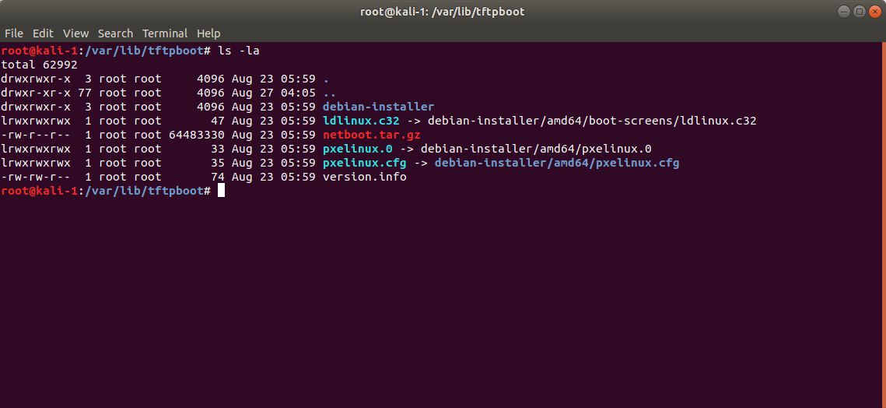
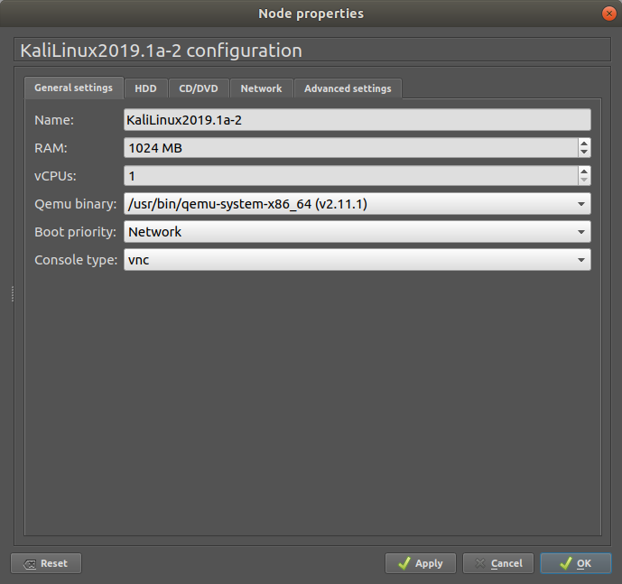

# FIA Lab 1 - PXE & Booting
#### Artem Abramov SNE19

May I suggest viewing this document in your browser at address: 
https://github.com/temach/innopolis_university_reports/blob/master/FIA-Lab-1-PXE-Booting.md
Unfortunately rendering the document to PDF breaks some long lines and crops images.

## Task 1 - PXE

### Create a virtual machine and setup a PXE service

I decided to use GNS3 to manage the virtual machines and to control the 
network. GNS3 was already installed in my machine as part of doing the NRI 
networking lab, detailed instructions for installation and configuration of 
GNS3 can be found there: 
https://github.com/temach/innopolis_university_reports/blob/master/INR-Lab-1-Networking-Basics.md

I created a new virtual machine. Installed Kali Linux on it, connected it to the cloud appliance in GNS3 (this allows it to access the internet) and configured its networking. The cloud appliance is configured to use virbr0 virtual network bridge. This bridge is created after installing libvirt. Libvirt also sets up DHCP and NAT access to the internet for devices connected to the bridge.

Screenshot showing the the virtual network topology is below.


Screenshot of the Kali Linux installer is below.


Screenshot of the GNS3 cloud appliance configuration is shown below.


For reference below is a screenshot showing the version of Kali Linux guest that was used for this lab.


With everything ready its now important to understand what is PXE and the details of how it works. In my opinion the best overview is presented in the document that describes PXE, source: http://www.pix.net/software/pxeboot/archive/pxespec.pdf

To setup the PXE service I plan to use two packages: dnsmasq for DHCP+TFTP and pxelinux for the PXE.

If its impossible to use dnsmasq, the DHCP and TFTP servers can be setup 
separately, source: https://debian-administration.org/article/478/Setting_up_a_server_for_PXE_network_booting.


Small note: at this moment I decided to setup the ssh server to the guest OS, because working with it through VNC was not very practical. Through VNC I allowed root login via ssh with just a password, this is shown on the screenshot below.


Screenshot below shows the ssh server on the Kali Linux guest working.


After this the console access to the guest was working. The next step was to install the packages.


However there was a problem with installing the packages!
Because I installed the system from a CD image, the apt sources were not configured properly. In other words the system failed to find packages, because it was only using the apt repository that came with the CD. 

Below is a screenshot showing broken /etc/apt/sources.list configuration.


The next step was adding the default Kali Linux repository: 
```
deb http://http.kali.org/kali kali-rolling main non-free contrib
```
source: https://docs.kali.org/general-use/kali-linux-sources-list-repositories

After this it was necessary to update the package lists with `apt-get update` and then to finally install pxelinux and dnsmasq.

The next step was configuring dnsmasq.
The information on how to setup dnsmasq was mostly taken from two links:
1. Oracle documentation https://docs.oracle.com/cd/E37670_01/E41137/html/ol-dnsmasq-conf.html
2. Blog post (viewed from Internet Archive) https://web.archive.org/web/20170710081151/https://blogging.dragon.org.uk/howto-setup-a-pxe-server-with-dnsmasq/

Edit the dnsmasq config to look as on the screenshot below:


Create the TFTP directory to match what was specified in dnsmasq config. Then restart dnsmasq and check that it found TFTP directory and config is ok, as show in screenshot below.


Because Kali Linux is easier to work with than Ubuntu, this lab will use booting to Kali Linux with PXE as an example. The next step is to actually get the system files that are used by the Kali Linux distribution. 

For this step the instructions from https://kali.training/topic/installing-kali-over-the-network/ were very useful.

I discovered that Kali Linux provides official PXE boot files. Which include the pxelinux.0 and ldlinux.c32 from the pxelinux and syslinux-common packages. This greatly simplified the process.

So download the tarball for a graphical installer of Kali Linux on amd64 from 
http://http.kali.org/dists/kali-rolling/main/installer-amd64/current/images/netboot/gtk/netboot.tar.gz. And just unpack it /var/lib/tftpboot.

```
# cd /var/lib/tftpboot
# wget http://http.kali.org/dists/kali-rolling/main/installer-amd64/current/images/netboot/gtk/netboot.tar.gz
# tar xf netboot.tar.gz
```

Below is a screenshot showing the resulting tftpboot directory.


There is the option to tweak boot files in `debian-installer/amd64/boot-screens/`, if you want to configure the installer.


### Question: why not run your DHCP service on the SNE network directly?

We do not know the topology of the network, is there is at least one more DHCP server running then the connected machines might get inconsistent IP addresses. This will cause connectivity issues. Two machines that are physically connected will be logically on two different networks. Alternatively its also possible that two machines will be given the same IP address, which will also create connection problems.

### Create yet another virtual machine to proceed with acceptance testing of your installation.

Create another VM in GNS3. The config of the VM is shown in the screenshot below. Note that the boot priority is set to Network.


I also removed the CD ISO image from the VM config as shown on the screenshot below.


The last step was disconnecting the DHCP that was provided by libvirt on virbr0. Now the Kali Linux box should provide DHCP service on the network. In fact the network was also isolated from the internet.

The resulting network topology is shown on the screenshot below.


On the first boot the dnsmasq server was not running, so the "no-os" machine failed with the error below.


Then I realised that dnsmasq might be conflicting with Network Manager on the PXE server. So I logged in and disabled Network Manager service. The next part was configuring a static IP for the eth0 interface, so that the interface was up and ready for dnsmasq to use.

Below is a screenshot of the eth0 interface config on Kali Linux PXE server.


After the PXE server booted I tried booting "no-os" machine again.
This time the boot was successful and the welcoming screen was displayed!

Below is the screenshot of the welcoming screen.


Net installer uses a menu as show on the screenshot below.


## Task 2 - Questions

### 1. What is UEFI PXE booting? How does it work? How does it compare to booting from the hard disk or a CD?

UEFI PXE booting refers to booting over PXE by clients that use UEFI instead of Legacy BIOS. UEFI PXE differs from legacy PXE in that the client uses UEFI module to interact with the PXE server. If the client uses legacy BIOS then the code to interact with the PXE server would normally be provided as a Network Interface Card (NIC) BIOS extension. The PXE server does not care to which type of client the service is provided. However to handle both types of clients the server must provide a binary to execute on a legacy BIOS client (such as pxelinux) and an alternative binary (such as elilo) to execute on UEFI clients. The clients will themselves decide which binary they need.

PXE booting works as show in the diagram below:


The booting machine tries to discover services using the DHCP protocol. The server responds with a DHCP packet that contains extra information about PXE booting. The client can use this information to access the TFTP server. 
After downloading the files from TFTP server and verifying them, the client can execute them to start the boot or install process.

Compared to booting from a CD or hard drive the PXE has several advantages. First of all it does not require any physical installation media, beyond those that are likely to be present in any computer anyway (network card).
Secondly it allows to remotely control the installation of an operating system on a machine.

source: https://web.archive.org/web/20131102003141/http://download.intel.com/design/archives/wfm/downloads/pxespec.pdf


### 2. What is a GPT? What is its layout? What is the role of a partition table?

GPT is the modern alternative to MBR. A specification describing how to divide disk into partitions and to keep track of the partition table. GPT also removes some of the limitations of MBR, such as a much higher limit on partition size, limit of on the number of primary partitions. GPT also keeps a duplicate partition table on disk that can be used for recovery (unlike MBR).

Below is a diagram of an example disk that is using GPT.


The layout can be described as follows:

1. First 512 bytes are left untouched to allow compatibility with legacy boot BIOS.
2. Then follows the header for the GPT table.
3. Then follow the entries in the GPT table. Each entry describes a partition.
4. After the end of the table, there is space to place the actual partitions.
5. Finally at the end of the storage medium, the GPT partition table is duplicated.

The partition table describes how the storage medium is divided into logical blocks and what special attributes does each block hold. This is of primary importance to tools that work at the operating system level. Such as the bootloader, the OS itself, etc. As the attributes attached to each partition describe what such low-level tools are allowed to do with the partition (for example to check if the partition is bootable, or what filesystem is uses). For userspace programs usually the operating system abstracts the storage medium by providing the filesystem abstraction. However there are many legitimate cases when the software wants to work directly with the data on the disk, flash drive or CD. For such cases the partitions describe how the program must handle the different areas of the storage medium.

### 3. What is gdisk? How does it work? What can you do with it?

gdisk is a linux utility to create, modify and delete partitions and partition table on the GPT drives. It comes pre-installed on Ubuntu. It is a successor to the fdisk program, that can only work with MBR disks. The program actually comes in three flavours of user interface.

1. gdisk is text-mode interactive
2. sgdisk is command-line
3. cgdisk has a curses-based interface

gdisk is a userspace program that accesses the underlying storage medium to manipulate the GPT partitions. You can use to manipulate the GPT partition in any way that is allowed by the UEFI specification. In particular it allows the creation of GPT disks with protective MBR section.

source: https://www.rodsbooks.com/gdisk/walkthrough.html

### 4. What is a Protective MBR and why is it in the GPT?

As already outlined in the second question above the main usage for protective MBR is to allow compatibility with legacy systems and programs that do not support working with GPT partitions. This concerns USB drives that would not be functional on systems without GPT support, perhaps even more importantly this concerns the hard drives that would become unbootable when plugged into a motherboard with a BIOS that does not understand GPT partitions. 
Itself the protective MBR is just the normal MBR partition table that describes only one partition that spawns the entire disk.

## Task 3 - Partitions

### 1. Copy and dump the Protective MBR with GTP and fully annotate the entries.

I performed this lab on my personal computer, which was suitable for the task because it uses UEFI with GPT and which is more interesting because it dual boots linux Linux and Windows.

The output of fdisk for my system:
```
$ sudo fdisk -l /dev/sda 
[sudo] password for artem:
Disk /dev/sda: 931.5 GiB, 1000204886016 bytes, 1953525168 sectors
Units: sectors of 1 * 512 = 512 bytes
Sector size (logical/physical): 512 bytes / 4096 bytes
I/O size (minimum/optimal): 4096 bytes / 4096 bytes
Disklabel type: gpt
Disk identifier: E51114A7-5B18-6A40-AE1E-22B1659977CE

Device         Start       End   Sectors   Size Type
/dev/sda1       2048   1128447   1126400   550M EFI System
/dev/sda2    1128448 630274047 629145600   300G Linux filesystem
/dev/sda3  630274048 630306815     32768    16M Microsoft reserved
/dev/sda4  630306816 937474047 307167232 146.5G Microsoft basic data
```

Before dumping the GPT table to file, its necessary to understand the location and structure of the GPT table on disk in more detail.

Lets take the disk sector as 512 byte in size. Lets take the disk size to be exactly 1 Terabyte (total number of sectors = 2147483648)

1. Sector 1 on disk (bytes 0 - 512) contains Protective MBR.
2. Sector 2 on disk (bytes 513 - 1024) contain Primary GPT Header
3. Sector 3 - 34 on disk (bytes 1025 - 17408) contain the entries of the partition table. More on that below.
4. Sector 35 - 2147483614 is free space.
5. Sector 2147483615 - 2147483647 is a copy of sectors 3 - 34 and contain the backed up entries of the GPT partition table.
6. Sector 2147483648 is a copy of sector 2 and contain the backed up GPT Header.

source: https://www.yourcomputer.in/guid-partition-table/

In reality the disk controller keeps additional information on disk for each sector called the sector header (source: https://en.wikipedia.org/wiki/Disk_sector) which includes sync bytes, address identification, flaw flag and error detection and correction information aka ECC. So each sector has a header and 512 bytes of user data, thus a 1 terabyte disk will only have around 87% for user data i.e. 1953525168 sectors instead of theoretical 2147483648.

My disk has logical size of 512 and physical size of 4096 because it is 4K native enabled, but has a compatiability layer for older OSes or older disk utilities (source: https://wiki.archlinux.org/index.php/Advanced_Format)

Each GPT partition entry takes up 128 bytes. In my disk I only have 4 partitions. Therefore to dump protective MBR (which is in the first 512 bytes of the GPT disk) and GPT structured to a file only the first `(128 * 4) + 1024 = 1536` bytes of the disk need to be read. This is 3 sectors of 512 bytes each. 
source: https://askubuntu.com/questions/57908/how-can-i-quickly-copy-a-gpt-partition-scheme-from-one-hard-drive-to-another

I decided to copy 4 sectors, out of curiosity what does an empty GPT entry look like. To dump the GPT structures into a file in the home directory I used the following command:
```
$ sudo dd if=/dev/sda of=/home/artem/Desktop/InnopolisUni/FIA/gpt bs=512 count=4                         
[sudo] password for artem:                                                       
4+0 records in
4+0 records out
2048 bytes (2.0 kB, 2.0 KiB) copied, 5.8147e-05 s, 35.2 MB/s
```

To inspect the binary blob I used the `xxd` and the `bless` programs.

The details of the Protective MBR and GPT are described below. Source for MBR: http://www.invoke-ir.com/2015/05/ontheforensictrail-part2.html.
Source for GPT: http://www.invoke-ir.com/2015/06/ontheforensictrail-part3.html.

Below is shown the result of running xxd on the dump of the GPT table.
```
$ xxd gpt
00000000: 0000 0000 0000 0000 0000 0000 0000 0000  ................
00000010: 0000 0000 0000 0000 0000 0000 0000 0000  ................
00000020: 0000 0000 0000 0000 0000 0000 0000 0000  ................
00000030: 0000 0000 0000 0000 0000 0000 0000 0000  ................
00000040: 0000 0000 0000 0000 0000 0000 0000 0000  ................
00000050: 0000 0000 0000 0000 0000 0000 0000 0000  ................
00000060: 0000 0000 0000 0000 0000 0000 0000 0000  ................
00000070: 0000 0000 0000 0000 0000 0000 0000 0000  ................
00000080: 0000 0000 0000 0000 0000 0000 0000 0000  ................
00000090: 0000 0000 0000 0000 0000 0000 0000 0000  ................
000000a0: 0000 0000 0000 0000 0000 0000 0000 0000  ................
000000b0: 0000 0000 0000 0000 0000 0000 0000 0000  ................
000000c0: 0000 0000 0000 0000 0000 0000 0000 0000  ................
000000d0: 0000 0000 0000 0000 0000 0000 0000 0000  ................
000000e0: 0000 0000 0000 0000 0000 0000 0000 0000  ................
000000f0: 0000 0000 0000 0000 0000 0000 0000 0000  ................
00000100: 0000 0000 0000 0000 0000 0000 0000 0000  ................
00000110: 0000 0000 0000 0000 0000 0000 0000 0000  ................
00000120: 0000 0000 0000 0000 0000 0000 0000 0000  ................
00000130: 0000 0000 0000 0000 0000 0000 0000 0000  ................
00000140: 0000 0000 0000 0000 0000 0000 0000 0000  ................
00000150: 0000 0000 0000 0000 0000 0000 0000 0000  ................
00000160: 0000 0000 0000 0000 0000 0000 0000 0000  ................
00000170: 0000 0000 0000 0000 0000 0000 0000 0000  ................
00000180: 0000 0000 0000 0000 0000 0000 0000 0000  ................
00000190: 0000 0000 0000 0000 0000 0000 0000 0000  ................
000001a0: 0000 0000 0000 0000 0000 0000 0000 0000  ................
000001b0: 0000 0000 0000 0000 0000 0000 0000 0000  ................
000001c0: 0100 eefe ffff 0100 0000 af6d 7074 0000  ...........mpt..
000001d0: 0000 0000 0000 0000 0000 0000 0000 0000  ................
000001e0: 0000 0000 0000 0000 0000 0000 0000 0000  ................
000001f0: 0000 0000 0000 0000 0000 0000 0000 55aa  ..............U.
00000200: 4546 4920 5041 5254 0000 0100 5c00 0000  EFI PART....\...
00000210: 0d22 ca20 0000 0000 0100 0000 0000 0000  .". ............
00000220: af6d 7074 0000 0000 2200 0000 0000 0000  .mpt....".......
00000230: 8e6d 7074 0000 0000 a714 11e5 185b 406a  .mpt.........[@j
00000240: ae1e 22b1 6599 77ce 0200 0000 0000 0000  ..".e.w.........
00000250: 8000 0000 8000 0000 990a 4404 0000 0000  ..........D.....
00000260: 0000 0000 0000 0000 0000 0000 0000 0000  ................
00000270: 0000 0000 0000 0000 0000 0000 0000 0000  ................
00000280: 0000 0000 0000 0000 0000 0000 0000 0000  ................
00000290: 0000 0000 0000 0000 0000 0000 0000 0000  ................
000002a0: 0000 0000 0000 0000 0000 0000 0000 0000  ................
000002b0: 0000 0000 0000 0000 0000 0000 0000 0000  ................
000002c0: 0000 0000 0000 0000 0000 0000 0000 0000  ................
000002d0: 0000 0000 0000 0000 0000 0000 0000 0000  ................
000002e0: 0000 0000 0000 0000 0000 0000 0000 0000  ................
000002f0: 0000 0000 0000 0000 0000 0000 0000 0000  ................
00000300: 0000 0000 0000 0000 0000 0000 0000 0000  ................
00000310: 0000 0000 0000 0000 0000 0000 0000 0000  ................
00000320: 0000 0000 0000 0000 0000 0000 0000 0000  ................
00000330: 0000 0000 0000 0000 0000 0000 0000 0000  ................
00000340: 0000 0000 0000 0000 0000 0000 0000 0000  ................
00000350: 0000 0000 0000 0000 0000 0000 0000 0000  ................
00000360: 0000 0000 0000 0000 0000 0000 0000 0000  ................
00000370: 0000 0000 0000 0000 0000 0000 0000 0000  ................
00000380: 0000 0000 0000 0000 0000 0000 0000 0000  ................
00000390: 0000 0000 0000 0000 0000 0000 0000 0000  ................
000003a0: 0000 0000 0000 0000 0000 0000 0000 0000  ................
000003b0: 0000 0000 0000 0000 0000 0000 0000 0000  ................
000003c0: 0000 0000 0000 0000 0000 0000 0000 0000  ................
000003d0: 0000 0000 0000 0000 0000 0000 0000 0000  ................
000003e0: 0000 0000 0000 0000 0000 0000 0000 0000  ................
000003f0: 0000 0000 0000 0000 0000 0000 0000 0000  ................
00000400: 2873 2ac1 1ff8 d211 ba4b 00a0 c93e c93b  (s*......K...>.;
00000410: 35aa 5131 7f18 4a71 88e8 f3a7 976e e729  5.Q1..Jq.....n.)
00000420: 0008 0000 0000 0000 ff37 1100 0000 0000  .........7......
00000430: 0000 0000 0000 0000 6500 7300 7000 0000  ........e.s.p...
00000440: 0000 0000 0000 0000 0000 0000 0000 0000  ................
00000450: 0000 0000 0000 0000 0000 0000 0000 0000  ................
00000460: 0000 0000 0000 0000 0000 0000 0000 0000  ................
00000470: 0000 0000 0000 0000 0000 0000 0000 0000  ................
00000480: af3d c60f 8384 7247 8e79 3d69 d847 7de4  .=....rG.y=i.G}.
00000490: edb7 80a5 7d33 40a4 9aa1 d317 d348 e82c  ....}3@......H.,
000004a0: 0038 1100 0000 0000 ff37 9125 0000 0000  .8.......7.%....
000004b0: 0000 0000 0000 0000 7200 6f00 6f00 7400  ........r.o.o.t.
000004c0: 0000 0000 0000 0000 0000 0000 0000 0000  ................
000004d0: 0000 0000 0000 0000 0000 0000 0000 0000  ................
000004e0: 0000 0000 0000 0000 0000 0000 0000 0000  ................
000004f0: 0000 0000 0000 0000 0000 0000 0000 0000  ................
00000500: 16e3 c9e3 5c0b b84d 817d f92d f002 15ae  ....\..M.}.-....
00000510: 51d1 ad94 4678 f748 9c4d c4ca e727 80f0  Q...Fx.H.M...'..
00000520: 0038 9125 0000 0000 ffb7 9125 0000 0000  .8.%.......%....
00000530: 0000 0000 0000 0080 4d00 6900 6300 7200  ........M.i.c.r.
00000540: 6f00 7300 6f00 6600 7400 2000 7200 6500  o.s.o.f.t. .r.e.
00000550: 7300 6500 7200 7600 6500 6400 2000 7000  s.e.r.v.e.d. .p.
00000560: 6100 7200 7400 6900 7400 6900 6f00 6e00  a.r.t.i.t.i.o.n.
00000570: 0000 0000 0000 0000 0000 0000 0000 0000  ................
00000580: a2a0 d0eb e5b9 3344 87c0 68b6 b726 99c7  ......3D..h..&..
00000590: 2051 96cf ef39 254b 8999 6201 220e 49aa   Q...9%K..b.".I.
000005a0: 00b8 9125 0000 0000 ffb7 e037 0000 0000  ...%.......7....
000005b0: 0000 0000 0000 0000 4200 6100 7300 6900  ........B.a.s.i.
000005c0: 6300 2000 6400 6100 7400 6100 2000 7000  c. .d.a.t.a. .p.
000005d0: 6100 7200 7400 6900 7400 6900 6f00 6e00  a.r.t.i.t.i.o.n.
000005e0: 0000 0000 0000 0000 0000 0000 0000 0000  ................
000005f0: 0000 0000 0000 0000 0000 0000 0000 0000  ................
00000600: 0000 0000 0000 0000 0000 0000 0000 0000  ................
00000610: 0000 0000 0000 0000 0000 0000 0000 0000  ................
00000620: 0000 0000 0000 0000 0000 0000 0000 0000  ................
00000630: 0000 0000 0000 0000 0000 0000 0000 0000  ................
00000640: 0000 0000 0000 0000 0000 0000 0000 0000  ................
00000650: 0000 0000 0000 0000 0000 0000 0000 0000  ................
00000660: 0000 0000 0000 0000 0000 0000 0000 0000  ................
00000670: 0000 0000 0000 0000 0000 0000 0000 0000  ................
00000680: 0000 0000 0000 0000 0000 0000 0000 0000  ................
00000690: 0000 0000 0000 0000 0000 0000 0000 0000  ................
000006a0: 0000 0000 0000 0000 0000 0000 0000 0000  ................
000006b0: 0000 0000 0000 0000 0000 0000 0000 0000  ................
000006c0: 0000 0000 0000 0000 0000 0000 0000 0000  ................
000006d0: 0000 0000 0000 0000 0000 0000 0000 0000  ................
000006e0: 0000 0000 0000 0000 0000 0000 0000 0000  ................
000006f0: 0000 0000 0000 0000 0000 0000 0000 0000  ................
00000700: 0000 0000 0000 0000 0000 0000 0000 0000  ................
00000710: 0000 0000 0000 0000 0000 0000 0000 0000  ................
00000720: 0000 0000 0000 0000 0000 0000 0000 0000  ................
00000730: 0000 0000 0000 0000 0000 0000 0000 0000  ................
00000740: 0000 0000 0000 0000 0000 0000 0000 0000  ................
00000750: 0000 0000 0000 0000 0000 0000 0000 0000  ................
00000760: 0000 0000 0000 0000 0000 0000 0000 0000  ................
00000770: 0000 0000 0000 0000 0000 0000 0000 0000  ................
00000780: 0000 0000 0000 0000 0000 0000 0000 0000  ................
00000790: 0000 0000 0000 0000 0000 0000 0000 0000  ................
000007a0: 0000 0000 0000 0000 0000 0000 0000 0000  ................
000007b0: 0000 0000 0000 0000 0000 0000 0000 0000  ................
000007c0: 0000 0000 0000 0000 0000 0000 0000 0000  ................
000007d0: 0000 0000 0000 0000 0000 0000 0000 0000  ................
000007e0: 0000 0000 0000 0000 0000 0000 0000 0000  ................
000007f0: 0000 0000 0000 0000 0000 0000 0000 0000  ................
```

Below is a description of all bytes in MBR and GPT records. The last byte is non-inclusive (like array indices).

1. 0x0 - 0x3 = (3 bytes) normally contains jump instructions to bootloader code.
2. 0x3 - 0x3e = (59 bytes) disk parameters
3. 0x3e - 0x1b8 = (378 bytes) boot program code
4. 0x1b8 - 0x1be = (6 bytes) disk signature
5. 0x1be - 0x1ce = (16 bytes) MBR partition entry 1
    1. 0x1be - 0x1bf = (1 byte) indicates if partition is bootable.
    2. 0x1bf - 0x1c2 = (3 bytes) Head, Sector and Cylinder where partition starts.
    3. 0x1c2 - 0x1c3 = (1 byte) partition type
    4. 0x1c3 - 0x1c6 = (3 bytes) Head, Sector and Cylinder where partition ends.
    5. 0x1c6 - 0x1ca = (4 bytes) start sector offset within the partition
    6. 0x1ca - 0x1ce = (4 bytes) total number of sectors in partition
6. 0x1ce - 0x1de = (16 bytes) MBR partition entry 2
7. 0x1de - 0x1ee = (16 bytes) MBR partition entry 3
7. 0x1ee - 0x1fe = (16 bytes) MBR partition entry 4
8. 0x1fe - 0x200 = (2 bytes) Magic end of MBR marker 0x55 0xAA

9. 0x200 - 0x208 = (8 bytes) GPT magic start signature "EFI PART"
10. 0x208 - 0x20c = (4 bytes) header version
11. 0x20c - 0x210 = (4 bytes) size of header
12. 0x210 - 0x214 = (4 bytes) checksum calculated over the GPT header
13. 0x214 - 0x218 = (4 bytes) reserved for future use
14. 0x218 - 0x220 = (8 bytes) number of the logical block with primary GPT header
15. 0x220 - 0x228 = (8 bytes) number of the logical block where the backup GPT header is stored.
16. 0x228 - 0x230 = (8 bytes) number of the first logical block available to user.
17. 0x230 - 0x238 = (8 bytes) number of the last logical block available to user.
18. 0x238 - 0x248 = (16 bytes) disk unique id (UUID/GUID)
19. 0x248 - 0x250 = (8 bytes) number of logical block where the partition table starts.
20. 0x250 - 0x254 = (4 bytes) maximum number of entries that partition table can hold
21. 0x254 - 0x258 = (4 bytes) size of each entry in partition table
22. 0x258 - 0x25c = (4 bytes) checksum calculated over the entries in the partition table 
23. 0x25c - 0x400 = (420 bytes) reserved free space
24. 0x400 - 0x480 = (128 bytes) GPT partition entry 1 (esp boot)
    1. 0x400 - 0x410 = (16 bytes) partition type unique id
    2. 0x410 - 0x420 = (16 bytes) UUID of the actual partition (can be used as a name)
    3. 0x420 - 0x428 = (8 bytes) number of logical block where partition starts
    4. 0x428 - 0x430 = (8 bytes) number of logical block where partition ends.
    5. 0x430 - 0x438 = (8 bytes) partition attributes
    6. 0x438 - 0x480 = (72 bytes) partition name assigned by user (null terminated string)
25. 0x480 - 0x500 = (128 bytes) GPT partition entry 2 (Linux root)
26. 0x500 - 0x580 = (128 bytes) GPT partition entry 3 (Microsoft reserved partition)
27. 0x580 - 0x600 = (128 bytes) GPT partition entry 4 (Basic data partition)
28. 0x600 - 0x4400 = unused GPT table entries

Interpreting the protective MBR:
There is no jump instruction at the beginning, no disk parameters, no bootloader code. The disk signature is set to all 0. The first partition entry is not bootable. It starts at cylinder 1. Its partition type is 0xEE which is EFI_GPT_DISK (the Protective MBR should always specify the value of 0xEE here). It ends at head=0xFE, sector=0x3F, cylinder=0x3FF, so it spans the entire disk. Its relative start offset is 1 (the Protective MBR should always specify the value of 1 here). The number of the last sector is "af6d 7074" in the hex dump, however keeping in mind that the CPU is little endian, the number should be read as: 0x74706daf, which is equal to 1953525167 which is the number of sectors shown in fdisk output earlier. (actually fdisk showed the total number of sectors as 1953525168, so it showed one extra sector, because it counted the sector at index 0). The second, third and fourth entries in the MBR partition table are all zero. The last part of protective MBR is the magic number 0x55AA. Effectively the Protective MBR is used to declare a single partition that spans the entire disk.

Interpreting the GPT:
The first bytes of the GPT header spell out "EFI PART". The header version is 1. The header size is 0x5c which is actually interpreted as 92. The checksum is "0d22 ca20" in the hex dump, which is 0x20ca220d in hex and 550117901 decimal. The next 4 bytes are reserved. The number of the logical block where the header is located is 1. The number of the logical block where the backup of the primary header is stored is 0x74706daf = 1953525167 (as expected this is the last sector on disk). The number of the first logical block available to the user is 0x22 = 34. The number of the last logical block available to the user is "8e6d 7074"
in the hex dump, which means its 0x74706d8e in hex, which is 1953525134 in decimal (again, as expected because 1953525167 - 33 = 1953525134, where 32 blocks from the end are used to backup the partition entries and one block from the end is used to backup the partition header). The disk UUID is "a714 11e5 185b 406a ae1e 22b1 6599 77ce" in the hex dump, which is equivalent to UUID = 51114A7-5B18-6A40-AE1E-22B1659977CE. To interpret the disk UUID from the hex dump to human readable GUID there is an algorithm that is presented in RFC4122 (source: https://tools.ietf.org/html/rfc4122). The partition table starts at logical block 2. The max number of entries the partition table can hold is 0x80 = 128. The size of each entry in the partition table is 128 bytes. Finally the checksum over all the entries in the partition table is "990a 4404" in hex dump, which is 0x4440a99 in hex.

At address 0x400 (after the GPT header) is the first entry in the partition table. Its partition type GUID is "2873 2ac1 1ff8 d211 ba4b 00a0 c93e c93b" in the hex dump. The matching partition type GUID is C12A7328-F81F-11D2-BA4B-00A0C93EC93B and is interpreted as "EFI System partition". The UUID of the partition entry is "35aa 5131 7f18 4a71 88e8 f3a7 976e e729" in the hex dump. The number of its starting LBA is 0x800 in hex, which is 2048 in decimal. The number of its last LBA is 0x1137ff in hex, which is 1128447 in decimal (this means the partition is made up of 1126400 sectors). The attributes section is all zero. The name of the partition is "6500 7300 7000 0000" in the hex dump, according to the specification this field is for a "Null-terminated string containing a human-readable name of the partition". Unfortunately no direct reference is made to the encoding used to store the string. From the hex dump its obvious that the name of the partition is "esp". 

The question of encoding is interesting. Because there are null bytes in the 3 letter string (which actually spells "esp"), we understand that the encoding uses at least two bytes per letter and most likely supports international characters, so we can make a confident guess that the encoding used is UFT-16 (which is confirmed in the documentation for the gdisk utility, source https://www.rodsbooks.com/gdisk/walkthrough.html).

Interpreting the other entries in the GPT partition table can be done in a similar manner and is really straightforward given the UEFI specification below which describes the GPT in great detail: https://uefi.org/sites/default/files/resources/2_4_Errata_B.pdf.

##### At what byte index from the start of the disk do the real partition table entries start?

The entries start at byte 0x400 from the start of disk. That is after two sectors of 512 bytes each.

#### At what byte index would the partition table start if your server had a so-called “4K native” (4Kn) disk?

If we would have used a 4K native disk then the sector size would be 4096 bytes. The entries would start (in the same manner as for a "normal" disk) after the first two sectors, that is after 8192 bytes, which in hex is offset 0x2000. See also: https://en.wikipedia.org/wiki/Advanced_Format

### 2. If you wanted to add a (1 + your table number) GiB FreeBSD ZFS partition, called ØS3 (U+00D8U+015A U+0033) to the table by hand, what values would you have to use for the entry (including the name) in the raw table on disk? Assume the disk is large enough to hold the extra partition. Until recently, machines would have a BIOS and boot from an MBR.

To add the new partition the entry in the GPT table has to be filled. This partition would have to start at offset 0x600 into the GPT partition table. Of course if we were to actually add the partition then we would also have to recalculate the CRC32 checksum over the partition table entries and put that checksum into the GPT Header. Furthermore the partition entry and the updated header would have to be duplicated to the backed up GPT at the end of the drive. 

Going through the GPT entry fields one by one:

1. Determine the GUID for the partition type. In case of ZFS the GUID is 516E7CBA-6ECF-11D6-8FF8-00022D09712В. Source https://en.wikipedia.org/wiki/GUID_Partition_Table#Partition_type_GUIDs. This GUID which has to be transformed to be written to the GPT table as actual bytes. When encoded the bytes would be "ba7c 6e51 cf6e d611 f88f 0002 2d09 712b" (that's how they would show up in the hex dump).

2. Give the partition a UUID. For this example the UUID can be any random sequence of 16 bytes. So lets just give it value such as "1122 2233 3344 4455 5566 6677 7788 8899".

3. The next step is determining the starting LBA, looking at my fdisk output, I would put this partition after the Windows data partition, so its starting LBA would be 937474048 (because Windows ends at 937474047), which would be 0x37e0b800 in hex, which would be "00b8 e037" when inserted into the hex dump file (encoded to little endian). 

4. For the partition to be 1 GiB in size, it must be ` (1 * 1024 * 1024 * 1024) / 512 = 2097152` LBA long. So its last LBA would be 939571200, which is 0x3800b800 in hex, which would be "00b8 0038" in the hex dump file (encoded to little endian). 

5. For this example the attributes will be kept empty. (8 bytes all zero)

6. The name of the partition must be encoded to UFT-16. That would be "00D8 015A 0033" if the string was encoded in hex, and "D800 5A01 3300 0000" in the hex dump file (converted to little endian). 

To verify our calculations we can write the bytes to the hex dump file and then try to restore the hex dump file back to the /dev/sda using the dd utility.

### 3. Name two differences between primary and logical partitions in an MBR partitioning scheme.

1. MBR can have only one logical (also known as extended) partition. This partition is a hack to get around the limit of 4 partitions. There can be up to 4 primary (also known as bootable) partitions.
2. BIOS can boot only from primary partitions, assuming a valid operating system is present on the partition.
