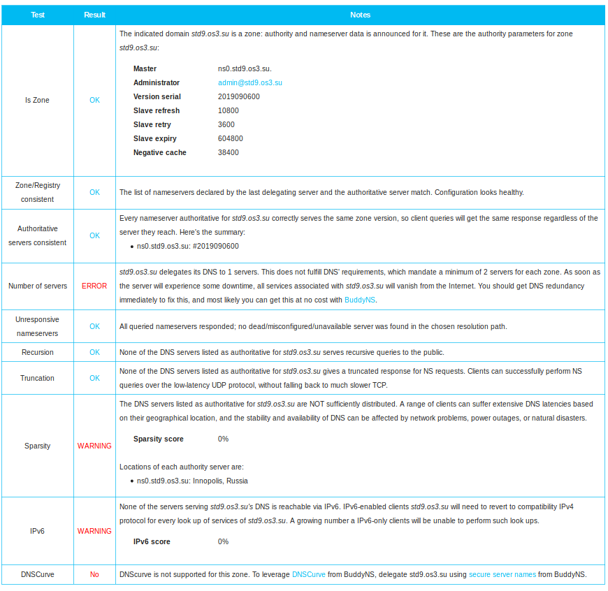

# FIA Lab 3.1 – DNS1

#### Artem Abramov SNE19


## Task 1 - Downloading and Installing a Caching Nameserver

I have an odd number and so will be working with Unbound+NSD.

### 1.1 - Validating the Download

#### Why is it wise to use a signature to check your download?

The signature is used to verify the integrity and the authenticity of the download. If only a hash is used then this can be used to verify the integrity of the data, but can not verify the authenticity.

This question is discussed in much more detail in the next point, after verifying the BIND9 tarball (under the heading `Discussion of using signature vs hashsum`).

#### Download the BIND tarball (also if you are doing the Unbound+NSD part) and check its validity using one of the signatures.

I went to the website and downloaded two files from https://www.isc.org/download/:
```bash
-rw-rw-r--  1 artem artem    6313555 Sep  5 01:23  bind-9.14.5.tar.gz
-rw-rw-r--  1 artem artem        833 Sep  5 01:23  bind-9.14.5.tar.gz.sha512.asc
```

One is the BIND9 tarball and the other is the signature.

Then to check that the signature is valid I downloaded their public key from https://www.isc.org/201920pgpkey/ and imported it into GPG.

```bash
$ gpg --import tmp.txt 
gpg: key 74BB6B9A4CBB3D38: 3 signatures not checked due to missing keys
gpg: key 74BB6B9A4CBB3D38: public key "Internet Systems Consortium, Inc. (Signing key, 2019-2020) <codesign@isc.org>" imported
gpg: Total number processed: 1
gpg:               imported: 1
gpg: no ultimately trusted keys found
```

Then on to actual verification as shown below::
```bash
$ gpg --verify bind-9.14.5.tar.gz.sha512.asc bind-9.14.5.tar.gz
gpg: Signature made Thu 15 Aug 2019 12:50:38 MSK
gpg:                using RSA key AE3FAC796711EC59FC007AA474BB6B9A4CBB3D38
gpg: Good signature from "Internet Systems Consortium, Inc. (Signing key, 2019-2020) <codesign@isc.org>" [unknown]
gpg: WARNING: This key is not certified with a trusted signature!
gpg:          There is no indication that the signature belongs to the owner.
Primary key fingerprint: AE3F AC79 6711 EC59 FC00  7AA4 74BB 6B9A 4CBB 3D38
```

The signature is a detached signature, so its provided as a separate piece of information to download. To be honest in this particular case the signature does not provide much of an improvement over the hashsum, because the signature can not be traced to a root certificate that is trusted. Therefore the trust chain does not actually get build. 

(source: https://www.isc.org/pgpkey/ and https://www.gnupg.org/gph/en/manual/x135.html).

To verify the `unbound-1.9.3` tarball, we can compare the hashsum with the one displayed on the website.

Calculate hashsum of file that was downloaded:
```
$ sha256sum unbound-1.9.3.tar.gz 
1b55dd9170e4bfb327fb644de7bbf7f0541701149dff3adf1b63ffa785f16dfa  unbound-1.9.3.tar.gz
```

And we can see that it matches what we find online at https://nlnetlabs.nl/downloads/unbound/unbound-1.9.3.tar.gz.sha256:
```
1b55dd9170e4bfb327fb644de7bbf7f0541701149dff3adf1b63ffa785f16dfa
```


**Discussion of using signature vs hashsum**

Signing is supposed to provide integrity and authentication of the tarball. The hashsum is normally expected to provide only the integrity of the data. 

In this particular case however the chain of trust does not get build. Therefore I can indeed verify that the tarball was signed with a key pair that is published on the official ISC website. I know that the website is official because the access is via HTTPS. However I still do not know if the key pair published on the official ISC website is the key pair that the ISC main administrator used to sign the tarball. Maybe the webserver was compromised, the tarball was substituted and the key pair was substituted as well, so the tarball was signed with a malicious private key and the malicious public key was published on the official website.

What I want to verify  is that I have the tarball that was signed (or hash calculated) by the ISC main administrator.

The chain of trust certificates can not be build (as the gpg output shows above), therefore the signature suffers exactly the same problem as the hashsum: an attacker can change the tarball and the hashsum/public key and it would not be noticed automatically. 

The signing mechanism can fix this if the ISC main administrator would get his public key signed by other authorities. Then the chain of trust could be build backwards until the certificates that I actually trust could be reached. In this case when the tarball would be substituted on the webserver,  gpg would rightfully warn that the chain of trust could not be build and the file is not to be trusted.

An interesting note: The are ways to significantly increases the level of security by distributing the hashsum/public key via another channel. For example if the hashsum for the tarball was published on the official ISC twitter account, then by matching the hashsums I could be much more confident that the tarball was the one uploaded by the ISC main administrator, because its quite unlikely that the twitter account was compromised simultaneously with the webserver.

interesting links: 

1. https://www.gnupg.org/gph/en/manual/x334.html
2. https://serverfault.com/questions/569911/how-to-verify-an-imported-gpg-key
3. https://crypto.stackexchange.com/questions/5646/what-are-the-differences-between-a-digital-signature-a-mac-and-a-hash

#### Which kind of signature is the best one to use? Why?

The signature is understood to be the result of encrypting the hash of the file with a private key. There are different ways to calculate the hash of the file. In particular the signing procedure that relies on `sha1sum` is not to be trusted because it was shown that ways exist to generate different files with the same sha1sum i.e. predictably get a sha1 collision (source: https://shattered.io/). The sha1sum produces a 20-byte message digest, one fix is to use a larger message digest. For example sha512sum produces a 64-bytes (512-bits) message digest and there is no known way to reliably produce a hash collision with modern technology. When downloading BIND9 tarball one of the options is simply called `ASC`, which is actually the exactly same file as downloaded by the option `SHA1`.


### 1.2 - Documentation & Compiling

I decided not to use the default Ubuntu packages and went along with compiling from release tarball. 

Unbound source: https://nlnetlabs.nl/projects/unbound/download/

NSD source: https://www.nlnetlabs.nl/projects/nsd/download/

Before compiling unbound I had to actually install the gcc compiler and other build tools. Then in order to simplify the dependency chase I looked at the runtime  dependencies for the Ubuntu unbound package as shown below:

```
$ apt-cache depends unbound
unbound
  Depends: adduser
  Depends: dns-root-data
  Depends: lsb-base
  Depends: openssl
    openssl:i386
  Depends: unbound-anchor
  Depends: libc6
  Depends: libevent-2.1-6
  Depends: libfstrm0
  Depends: libprotobuf-c1
  Depends: libpython3.6
  Depends: libssl1.1
  Depends: libsystemd0
  Suggests: apparmor
  Enhances: munin-node
```
(source: https://askubuntu.com/questions/80655/how-can-i-check-dependency-list-for-a-deb-package)

Then I installed the dependencies, before starting the actual compilation.
When compiling NSD a problem occurred because the ./configure could not find libevent even though there were clearly two versions installed. 

```
checking for libevent... configure: error: Cannot find the libevent library.
You can restart ./configure --with-libevent=no to use a builtin alternative.
```

Since there was a workaround, I compiled without libevent as shown below:
```
$ ./configure --with-configdir=/usr/local/etc/nsd --with-libevent=no

```

And compiling unbound was successful without any extra options as shown below:
```
$ ./configure
```

The resulting configuration files are placed as requested:
```
$ tree /usr/local/etc/nsd/
/usr/local/etc/nsd/
└── nsd.conf.sample

0 directories, 1 file
$ tree /usr/local/etc/unbound/
/usr/local/etc/unbound/
└── unbound.conf

0 directories, 1 file
```


## Task 2 - Configuring and Testing

### Why are caching-only name servers still useful?

In Linux there is no DNS caching done at the kernel level. It is the job of user-space tools. The distributions that use systemd ship with systemd-resolved.service which acts as a local DNS server, can cache the result of the DNS lookups and is normally enabled by default. The existence of a system-wide DNS cache speeds up the resolution of commonly used domain names and saves network traffic.
(source: https://unix.stackexchange.com/questions/28553/how-to-read-the-local-dns-cache-contents and https://fedoraproject.org/wiki/Changes/Default_Local_DNS_Resolver)

Appart from systemd-resolved there are other lightweight caching DNS servers such as `dnsmasq` and `NSCD (Name Service Caching Daemon)` (source: https://www.addictivetips.com/ubuntu-linux-tips/flush-dns-cache-on-linux/) 

To check out how useful the systemd-resolved.service actually is  we can check out its statistics. Recent articles use `resolvectl statistics` that  is only available with systemd version 239, whereas on my Ubuntu the systemd version is 237, so I have to use the older command as shown below: 
```
$ systemd-resolve --statistics 
DNSSEC supported by current servers: no

Transactions
Current Transactions: 0
  Total Transactions: 232

Cache
  Current Cache Size: 60
          Cache Hits: 122
        Cache Misses: 112

DNSSEC Verdicts
              Secure: 0
            Insecure: 0
               Bogus: 0
       Indeterminate: 0
```

(source: https://askubuntu.com/questions/1149364/why-is-resolvectl-no-longer-included-in-bionic-and-whats-the-alternative and https://www.ctrl.blog/entry/systemd-resolved.html)

This are my usage statistics for the last 30 minutes, because previously I had disabled the systemd-resolved.service. Every cache hit is a success. To check the effectiveness of the caching server we can also compare the time to resolve a DNS query (using `drill` utility from `ldnsutils` package) from the remote server vs the cache.

Below is the result of sending two queries to a government website in New Zeland, note the `Query time` parameter that is 0 for the second query because the query result is cached:


### Root Servers

Note that the file download URL needed to be updated as shown below: 
```
$ sudo wget -S -N https://www.internic.net/domain/named.cache -O /usr/local/etc/unbound/root.hints
```
(source: https://wiki.alpinelinux.org/wiki/Setting_up_unbound_DNS_server)


### Resolving localhost

Running unbound would conflict with systemd-resolved.service. There was no need to use the systemd-resolved.service, so the first step was disabling it as shown below:

```bash
$ systemctl disable systemd-resolved.service 
Removed /etc/systemd/system/dbus-org.freedesktop.resolve1.service.
Removed /etc/systemd/system/multi-user.target.wants/systemd-resolved.service.
```

The `/etc/resolved.conf` on my system was managed by systemd-resolved (it was actually a symbolic link to `/run/systemd/resolve/stub-resolv.conf`) , as shown below:
```bash
$ file /etc/resolv.conf 
/etc/resolv.conf: symbolic link to ../run/systemd/resolve/stub-resolv.conf
$ cat /etc/resolv.conf
# This file is managed by man:systemd-resolved(8). Do not edit.
#
# This is a dynamic resolv.conf file for connecting local clients to the
# internal DNS stub resolver of systemd-resolved. This file lists all
# configured search domains.
#
# Run "systemd-resolve --status" to see details about the uplink DNS servers
# currently in use.
#
# Third party programs must not access this file directly, but only through the
# symlink at /etc/resolv.conf. To manage man:resolv.conf(5) in a different way,
# replace this symlink by a static file or a different symlink.
#
# See man:systemd-resolved.service(8) for details about the supported modes of
# operation for /etc/resolv.conf.

nameserver 127.0.0.53
options edns0
```

So after disabling the service, I had to remove the symbolic link to `/etc/resolv.conf` with `sudo rm /etc/resolv.conf`. And created the actual `/etc/resolv.conf` file:
```bash
$ cat /etc/resolv.conf 
nameserver 8.8.8.8
```

(source: https://askubuntu.com/questions/907246/how-to-disable-systemd-resolved-in-ubuntu)

For writing the unbound config most of the information I used was from:
1. Manual page for unbound.conf (online: https://nlnetlabs.nl/documentation/unbound/unbound.conf/)
2. Default configuration file installed in the system
3. Cache size configuration: https://nlnetlabs.nl/pipermail/unbound-users/2010-September/006748.html
4. Bind9 manual (https://www.bind9.net/bind-9.13.3-manual.pdf)
5. https://wiki.archlinux.org/index.php/unbound
6. https://linuxconfig.org/unbound-cache-only-dns-server-setup-on-rhel-7-linux
7. https://www.tecmint.com/install-configure-cache-only-dns-server-in-rhel-centos-7/

After writing the configuration file I tried to check it:
```
$ unbound-checkconf 
[1567718050] unbound-checkconf[2478:0] fatal error: user 'unbound' does not exist.
```
This is an installation problem (because `make install` does not create the `unbound` user) , for simplicity I decided to run the server as root instead of adding a new user.

The resulting configuration for unbound is given below:
```
$ cat unbound.conf
server:
	verbosity: 1
	num-threads: 1
	interface: 0.0.0.0
	interface: ::0
	port: 53
	access-control: 0.0.0.0/0 allow
	access-control: ::0/0 allow
	root-hints: "/usr/local/etc/unbound/root.hints"
	username: ""
python:
remote-control:
```

Finally checking the config was successful:
```
$ unbound-checkconf 
unbound-checkconf: no errors in /usr/local/etc/unbound/unbound.conf
$ echo $?
0
```

#### Why do the programs return a result value?

POSIX standard specifies that a POSIX compliant program should return 0 to indicate that it has done its job and terminated successfully and any number from 1 to 255 to indicate error.
This allows writing shell scripts that can execute programs and can control the execution flow depending on the program return code.


## Task 3 - Running and Improving the Name Server

Running unbound failed the first time to open port 53 as shown below:. 
```
$ sudo unbound -d -vvv
[1567718988] unbound[2832:0] notice: Start of unbound 1.9.3.
[1567718988] unbound[2832:0] debug: creating udp4 socket 0.0.0.0 53
[1567718988] unbound[2832:0] debug: creating tcp4 socket 0.0.0.0 53
[1567718988] unbound[2832:0] error: can't bind socket: Address already in use for 0.0.0.0 port 53 (len 16)
[1567718988] unbound[2832:0] fatal error: could not open ports
```

I investigated with netstat as shown below:
```
artem@ unbound$ netstat -lnt
Active Internet connections (only servers)
Proto Recv-Q Send-Q Local Address           Foreign Address         State      
tcp        0      0 192.168.122.1:53        0.0.0.0:*               LISTEN     
tcp        0      0 127.0.0.1:631           0.0.0.0:*               LISTEN     
tcp6       0      0 ::1:631                 :::*                    LISTEN     
```

Then I realized that I accidentally enabled libvirt network and so I turned it off as shown below:
```
$ virsh net-list
 Name                 State      Autostart     Persistent
----------------------------------------------------------
 default              active     yes           yes

$ virsh net-destroy default
Network default destroyed

$ virsh net-list
 Name                 State      Autostart     Persistent
----------------------------------------------------------

$ netstat -lnt
Active Internet connections (only servers)
Proto Recv-Q Send-Q Local Address           Foreign Address         State      
tcp        0      0 127.0.0.1:631           0.0.0.0:*               LISTEN     
tcp6       0      0 ::1:631                 :::*                    LISTEN  
```

Then starting unbound was successful as shown below:
```
$ sudo unbound -d -vvv
[1567719043] unbound[3018:0] notice: Start of unbound 1.9.3.
[1567719043] unbound[3018:0] debug: creating udp4 socket 0.0.0.0 53
[1567719043] unbound[3018:0] debug: creating tcp4 socket 0.0.0.0 53
[1567719043] unbound[3018:0] debug: creating udp6 socket :: 53
[1567719043] unbound[3018:0] debug: creating tcp6 socket :: 53
[1567719043] unbound[3018:0] debug: switching log to syslog
```

Enabling the logging file is shown in the section below.

### Show the changes you made to your configuration to allow remote control.

Enabling log file and unbound-control in unbound.conf, the resulting config is shown below:

```
$ cat unbound.conf
server:
	verbosity: 1
	num-threads: 1
	interface: 0.0.0.0
	interface: ::0
	port: 53
	access-control: 0.0.0.0/0 allow
	access-control: ::0/0 allow
	root-hints: "/usr/local/etc/unbound/root.hints"
	username: ""
	logfile: "/var/log/unbound.log"
python:
remote-control:
	control-enable: yes
	control-interface: /var/tmp/unbound-control.pipe
```

Because I am using the named pipe mechanism for communication between unbound-control and the unbound server, there is no need to setup the TLS certificates and keys.


### What other commands/functions does rndc/unbound-control provide?

The unbound-control can be used to remotely administer the unbound server. The communication happens over SSL. There is a program to setup a selfsigned certificate and keys used in communication.  

There are a number of useful commands that the server understands such as:
1. start/stop the server
2. view statistics
3. view cache
4. create/read/update/delete a zone
5. change server mode: caching, caching+forwarding, master, slave

unbound-control provides a way to access the functionality above remotely.

### What do you need to put in resolv.conf (and/or other files) to use your own name server?

As I have already noted above in the beginning of the section `Resolving localhost`, I have disabled management of `/etc/resolv.conf` by systemd-resolved.service. Now in order to make use of the unbound name server I need `/etc/resolv.conf` file to have the contents as below:
```
$ cat /etc/resolv.conf 
nameserver 127.0.0.1
```

Commands to start unbound server, check that its listening on port 53 and find its process id are shown below:
```
$ sudo unbound-control start
$ netstat -lnt
Active Internet connections (only servers)
Proto Recv-Q Send-Q Local Address           Foreign Address         State      
tcp        0      0 0.0.0.0:53              0.0.0.0:*               LISTEN     
tcp        0      0 127.0.0.1:631           0.0.0.0:*               LISTEN     
tcp6       0      0 :::53                   :::*                    LISTEN     
tcp6       0      0 ::1:631                 :::*                    LISTEN     
$ ps aux | grep unbound
root      4469  0.1  0.0  23992  5436 ?        Ss   01:56   0:00 unbound -c /usr/local/etc/unbound/unbound.conf
artem     4473  0.0  0.0  21532  1116 pts/0    S+   01:56   0:00 grep --color=auto unbound
```

Lets test that it actually provides caching. Running two consecutive queries note the `Query time` field which is 121msec for the first query and 0 msec for the second query to the same domain:


To verify that  the speedup was due to the unbound server, lets change the default nameserver to 8.8.8.8 (Google Public DNS) and run the query again as shown below:


The second query took as much time as the first (31 msec), because the unbound server was side stepped.

## Task 4 - (Installing and) Configuring an Authoritative Nameserver

NSD has pretty good documentation, that is located in `doc/README` in the repository (github repo: https://github.com/NLnetLabs/nsd). The compilation and installation steps for NSD were already done above in section `1.2 - Documentation & Compiling`. However one step still remained to complete the installation.

Create a new `nsd` user as below (we disable interactive login):
```
$ sudo useradd -r -s /bin/false nsd
```
(source: https://askubuntu.com/questions/29359/how-to-add-a-user-without-home)

The resulting config for NSD is shown below:
```
$ cat nsd.conf
server:
	server-count: 1
	ip-address: 0.0.0.0
	ip-address: ::0
	port: 53
	verbosity: 1
	username: nsd
	logfile: "/var/log/nsd.log"
remote-control:
	control-enable: yes
	control-interface: /var/tmp/nsd-control.pipe
```

For simplicity the communication between the `nsd` server and `nsd-control` is handled through a named pipe. It was also necessary to change ownership of the NSD database file as shown below (error was shown in the NSD log file):
```
$ sudo chown nsd:nsd -R /var/db/nsd/
```

Server finally started with the following line in the log file `/var/log/nsd.log`:
```
[2019-09-06 01:41:36.080] nsd[25509]: notice: nsd starting (NSD 4.2.2)
[2019-09-06 01:41:36.116] nsd[25511]: notice: nsd started (NSD 4.2.2), pid 25510
```

Running the server with a sample zone file was uneventful:
```
$ nsd-checkconf -z std9.os3.su.zone nsd.conf
$ sudo nsd-control start
```

### What information do you need to give to the TAs so they can implement the delegation?

My machine will be the authoritative server for the std9.os3.su zone. I need to provide the TA (who supposedly controls the os3.su zone) with information at which IP address my authoritative name server can be found - `188.130.155.42`. 

### Now create a forward mapping zone file for your domain.

The zone file must contain:
1. 2 MX records. Make sure that mail for your domain is delivered to your
own public IP. We will use the second MX record later on.
2. 4 A or AAAA records. Use your imagination.
3. 2 CNAME records.

The resulting zone config `/usr/local/etc/nsd/std9.os3.su.zone` is shown below:
```
; source: http://www.thecave.info/create-dns-record-for-subdomain
; source: http://www.thecave.info/add-new-zone-to-bind-dns-server
; source: https://en.wikipedia.org/wiki/Zone_file
; IPv6 source: https://www.oreilly.com/library/view/dns-and-bind/9781449308025/ch01.html
; Zone file for std9.os3.su
;
$TTL 3600
; Zone configuration (SOA) record
std9.os3.su.       IN      SOA     ns0.std9.os3.su. admin.std9.os3.su. (
                        2019090600  ; Serial
                        10800       ; Refresh
                        3600        ; Retry
                        604800      ; Expire
                        38400 )     ; Negative Cache TTL
; Nameserver records
std9.os3.su.		IN      NS      ns0.std9.os3.su.

; dual stack server, but no IPv6 for the machine in lab
ns0.std9.os3.su.       	IN      A       188.130.155.42
lab.std9.os3.su.       	IN      A       188.130.155.42
mail.std9.os3.su.       IN      A       188.130.155.42

ansible.std9.os3.su.   	IN      A       185.22.153.49
                        IN      AAAA    2a00:b700:0000:0000:0000:0000:0006:0220
tst.std9.os3.su.       	IN      A       68.183.92.166
                        IN      AAAA    2400:6180:0100:00d0:0000:0000:08c4:9001

; Other records
www.std9.os3.su.   	IN      CNAME   notes.std9.os3.su.
notes.std9.os3.su. 	IN      CNAME   temach.github.io.

; Mail
std9.os3.su.		IN      MX      10		mail.std9.os3.su.
std9.os3.su.		IN      MX      20		ansible.std9.os3.su.
```

(source: https://tools.ietf.org/html/rfc1034)

The resulting nsd.conf is shown below:

```
server:
	server-count: 1
	ip-address: 0.0.0.0
	ip-address: ::0
	port: 53
	verbosity: 2
	username: nsd
	logfile: "/var/log/nsd.log"
remote-control:
	control-enable: yes
	control-interface: /var/tmp/nsd-control.pipe
zone:
 	name: "std9.os3.su"
 	zonefile: "std9.os3.su.zone"
```

Showing the forward mapping zone file in the log file using the command below (the name of the zone file showed up in logs only after verbosity was set to 4):


The next step was setting the nameserver to localhost in /etc/resolv.conf to interrogate the NSD server.
Request SOA:

```
$ drill std9.os3.su
;; ->>HEADER<<- opcode: QUERY, rcode: NOERROR, id: 13282
;; flags: qr aa rd ; QUERY: 1, ANSWER: 0, AUTHORITY: 1, ADDITIONAL: 0 
;; QUESTION SECTION:
;; std9.os3.su.	IN	A

;; ANSWER SECTION:

;; AUTHORITY SECTION:
std9.os3.su.	3600	IN	SOA	ns0.std9.os3.su. admin.std9.os3.su. 2019090600 10800 3600 604800 38400

;; ADDITIONAL SECTION:

;; Query time: 0 msec
;; SERVER: 127.0.0.1
;; WHEN: Fri Sep  6 04:49:40 2019
;; MSG SIZE  rcvd: 75
```

Request via CNAME:
```
$ drill www.std9.os3.su
;; ->>HEADER<<- opcode: QUERY, rcode: NOERROR, id: 14844
;; flags: qr rd ra ; QUERY: 1, ANSWER: 6, AUTHORITY: 0, ADDITIONAL: 0 
;; QUESTION SECTION:
;; www.std9.os3.su.	IN	A

;; ANSWER SECTION:
www.std9.os3.su.	2569	IN	CNAME	notes.std9.os3.su.
notes.std9.os3.su.	2569	IN	CNAME	temach.github.io.
temach.github.io.	2569	IN	A	185.199.111.153
temach.github.io.	2569	IN	A	185.199.108.153
temach.github.io.	2569	IN	A	185.199.110.153
temach.github.io.	2569	IN	A	185.199.109.153

;; AUTHORITY SECTION:

;; ADDITIONAL SECTION:

;; Query time: 32 msec
;; SERVER: 8.8.8.8
;; WHEN: Sat Sep  7 21:21:43 2019
;; MSG SIZE  rcvd: 183
```

Request another machine:
```
$ drill ansible.std9.os3.su.
;; ->>HEADER<<- opcode: QUERY, rcode: NOERROR, id: 28530
;; flags: qr aa rd ; QUERY: 1, ANSWER: 1, AUTHORITY: 1, ADDITIONAL: 1 
;; QUESTION SECTION:
;; ansible.std9.os3.su.	IN	A

;; ANSWER SECTION:
ansible.std9.os3.su.	3600	IN	A	185.22.153.49

;; AUTHORITY SECTION:
std9.os3.su.	3600	IN	NS	ns0.std9.os3.su.

;; ADDITIONAL SECTION:
ns0.std9.os3.su.	3600	IN	A	188.130.155.42

;; Query time: 0 msec
;; SERVER: 127.0.0.1
;; WHEN: Fri Sep  6 04:51:08 2019
;; MSG SIZE  rcvd: 87
```


### What important requirement is not yet met for your subdomain?
Currently the server claims to be the authoritative server for std9.os3.su. However there needs to be some way of actually proving this claim. The proof would be that the higher level DNS server delegates the std9.so3.su. zone to my server with IP `188.130.155.42`.  Also keeping in mind that the DNS server for the zone `std9.os3.su` is on zone itself  as `ns0.std9.os3.su` the authoritative server for os3.su. needs to have glue records added.

The zone file for `os3.su.` needs to be modified to include the following records as shown below:
```
; sub-zone delegation
std9.os3.su. IN NS ns0.std9.os3.su.

; glue record
ns0.std9.os3.su. IN A 188.130.155.42
```

We can see that the domain does NOT resolve currently:
```
$ dig ns std9.os3.su +trace +nodnssec

; <<>> DiG 9.11.3-1ubuntu1.8-Ubuntu <<>> ns std9.os3.su +trace +nodnssec
;; global options: +cmd
.			258385	IN	NS	i.root-servers.net.
.			258385	IN	NS	h.root-servers.net.
.			258385	IN	NS	j.root-servers.net.
.			258385	IN	NS	k.root-servers.net.
.			258385	IN	NS	f.root-servers.net.
.			258385	IN	NS	c.root-servers.net.
.			258385	IN	NS	g.root-servers.net.
.			258385	IN	NS	e.root-servers.net.
.			258385	IN	NS	l.root-servers.net.
.			258385	IN	NS	b.root-servers.net.
.			258385	IN	NS	m.root-servers.net.
.			258385	IN	NS	a.root-servers.net.
.			258385	IN	NS	d.root-servers.net.
;; Received 239 bytes from 8.8.8.8#53(8.8.8.8) in 30 ms

su.			172800	IN	NS	a.dns.ripn.net.
su.			172800	IN	NS	b.dns.ripn.net.
su.			172800	IN	NS	d.dns.ripn.net.
su.			172800	IN	NS	e.dns.ripn.net.
su.			172800	IN	NS	f.dns.ripn.net.
;; Received 352 bytes from 192.58.128.30#53(j.root-servers.net) in 17 ms

os3.su.			345600	IN	NS	ns.os3.su.
os3.su.			345600	IN	NS	ns2.os3.su.
;; Received 107 bytes from 193.232.128.6#53(a.dns.ripn.net) in 68 ms

os3.su.			1800	IN	SOA	os3.su. p\.braun.innopolis.ru. 1566480002 3600 900 1209600 1800
;; Received 96 bytes from 62.210.16.8#53(ns2.os3.su) in 66 ms
```

And we just do an unsuccessful query for the A record:
```
$ dig std9.os3.su +trace +nodnssec

; <<>> DiG 9.11.3-1ubuntu1.8-Ubuntu <<>> std9.os3.su +trace +nodnssec
;; global options: +cmd
.			256418	IN	NS	m.root-servers.net.
.			256418	IN	NS	j.root-servers.net.
.			256418	IN	NS	b.root-servers.net.
.			256418	IN	NS	f.root-servers.net.
.			256418	IN	NS	i.root-servers.net.
.			256418	IN	NS	h.root-servers.net.
.			256418	IN	NS	g.root-servers.net.
.			256418	IN	NS	c.root-servers.net.
.			256418	IN	NS	e.root-servers.net.
.			256418	IN	NS	a.root-servers.net.
.			256418	IN	NS	d.root-servers.net.
.			256418	IN	NS	l.root-servers.net.
.			256418	IN	NS	k.root-servers.net.
;; Received 239 bytes from 8.8.8.8#53(8.8.8.8) in 30 ms

su.			172800	IN	NS	a.dns.ripn.net.
su.			172800	IN	NS	b.dns.ripn.net.
su.			172800	IN	NS	d.dns.ripn.net.
su.			172800	IN	NS	e.dns.ripn.net.
su.			172800	IN	NS	f.dns.ripn.net.
;; Received 352 bytes from 198.97.190.53#53(h.root-servers.net) in 151 ms

os3.su.			345600	IN	NS	ns.os3.su.
os3.su.			345600	IN	NS	ns2.os3.su.
;; Received 107 bytes from 194.85.252.62#53(b.dns.ripn.net) in 27 ms

std9.os3.su.		1800	IN	A	62.210.110.7
os3.su.			1800	IN	NS	ns.os3.su.
os3.su.			1800	IN	NS	ns2.os3.su.
;; Received 123 bytes from 62.210.16.8#53(ns2.os3.su) in 71 ms
```

The IP `62.210.110.7` is actually `os3.su.` so its a default response for unknown records in the `os3.su` zone (administered by `p.braun@innopolis.ru`).

sources: 

1. https://dyn.com/blog/domain-name-system-dns-delegation-the-zone-authority-chain/
2. https://serverfault.com/questions/309622/what-is-a-glue-record


# FIA Lab 3.2 – DNS2

## Task 1 - Reverse Zone Files

### Why is that useful?

There are at least three interesting uses:

**1.** Using DNS to automatically discover networks and gateway addresses (in case of classful networks, i.e networks that correspond to class A, B, C). The PTR records do not necessarily need to match the A records for the IP, thus they can provide an extra level of indirection which can be used to provide the gateway address for a network to clients. Slightly modified  example from RFC1035 is given below.

*Start of example*.

Suppose the domain database for the IN-ADDR.ARPA domain would contain:

```
    10.IN-ADDR.ARPA.           PTR MILNET-GW.ISI.EDU.
    10.IN-ADDR.ARPA.           PTR GW.LCS.MIT.EDU.
    18.IN-ADDR.ARPA.           PTR GW.LCS.MIT.EDU.
    6.0.0.10.IN-ADDR.ARPA.     PTR MULTICS.MIT.EDU.
```

Then a program which wanted to locate gateways on net 10 would originate a query of the form  `QTYPE=PTR, QCLASS=IN, QNAME=10.IN-ADDR.ARPA.` It would receive two RRs in response:

```
    10.IN-ADDR.ARPA.           PTR MILNET-GW.ISI.EDU.
    10.IN-ADDR.ARPA.           PTR GW.LCS.MIT.EDU.
```

The program could then originate `QTYPE=A, QCLASS=IN`  queries for `MILNET-GW.ISI.EDU. and GW.LCS.MIT.EDU.` to discover the Internet addresses of these gateways.

*End of example*.

sources: 
1. https://tools.ietf.org/html/rfc4183
2. https://tools.ietf.org/html/rfc1035 Chapter `3.5. IN-ADDR.ARPA domain`

**2.** Establishing a certain level of trust. To configure the reverse DNS records properly the owner of the IP address needs to contact whoever controls (i.e. who bought) the actual IP block (usually this is the ISP). Because if the PTR record exists means that some authority has approved of setting up this record for this IP and domain address. (domains that have complementary A and PTR records are said to be forward-confirmed). The established level of trust is used by email servers to reject potential spammers and phishers.  They usually can not pass the PTR verification, because they use a hijacked machine for sending spam, which is commonly not a server and therefore does not have PTR records configured at the ISP.

(today reverse DNS for small classless networks is also supported: https://www.indelible.org/ink/classless/)

sources:
1. https://tools.ietf.org/html/rfc1912
2. https://simpledns.com/kb/153/what-is-reverse-dns-and-do-i-need-it
3. https://en.wikipedia.org/wiki/Forward-confirmed_reverse_DNS

**3.** Debugging DNS hierarchy/server. For example tracking which domain the request came from. 

sources: 
1. https://dyn.com/blog/in-addr-arpa-reverse-dns/
2. https://simpledns.com/kb/153/what-is-reverse-dns-and-do-i-need-it


### Set up your own reverse zone for your IPv4 subnet.

My ip address is `188.130.155.42`. The reverse DNS would look like `42.155.130.188.in-addr.arpa` and since `188.130.X.X` is a class B network, there is probably a DNS server for zone `130.188.in-addr.arpa` that is hosted by the ISP.  To enable reverse DNS for my server, I need to contact the ISP (someone who actually bought the block of IP addresses) and request them to edit the  `130.188.in-addr.arpa` zone by adding the record below:

```
42.155.130.188.IN-ADDR.ARPA.      	PTR 	std9.os3.su.
```

Unfortunately this can only be done if I contact the Innopolis university IT department and get them to contact the ISP. So instead I will setup the local server to serve the `130.188.in-addr.arpa` zone and imitate the validation of PTR record by directing all DNS requests through this local server.

Below is the config for `130.188.in-addr.arpa` zone:
```
$ cat 130.188.in-addr.arpa.zone 
; source: https://dnswatch.com/dns-docs/NSD/
; Reverse zone file for std9.os3.su
;
$TTL 3600
; Zone configuration (SOA) record
130.188.in-addr.arpa.       IN      SOA    ns0.std9.os3.su. admin.std9.os3.su. (
                        2019090700  ; Serial
                        10800       ; Refresh
                        3600        ; Retry
                        604800      ; Expire
                        38400 )     ; Negative Cache TTL
; Nameserver records
42.155.130.188.in-addr.arpa.      IN 	PTR	std9.os3.su.
```

Updated config for NSD server is shown below:
```
$ cat nsd.conf
server:
	server-count: 1
	ip-address: 0.0.0.0
	ip-address: ::0
	port: 53
	verbosity: 4
	username: nsd
	logfile: "/var/log/nsd.log"
remote-control:
	control-enable: yes
	control-interface: /var/tmp/nsd-control.pipe
zone:
 	name: "std9.os3.su"
 	zonefile: "std9.os3.su.zone"
zone:
 	name: "130.188.in-addr.arpa"
 	zonefile: "130.188.in-addr.arpa.zone"
```

(source: https://dnswatch.com/dns-docs/NSD/)


### Show that a reverse lookup works.

Reverse lookup for ip address 188.130.155.42 against local NSD server is shown below:
```
$ dig +noall +answer -x 188.130.155.42 @127.0.0.1
42.155.130.188.in-addr.arpa. 3600 IN	PTR	std9.os3.su.
```
(source: https://linuxcommando.blogspot.com/2008/07/how-to-do-reverse-dns-lookup.html)

Reverse lookup for domain name against local NSD server is shown below:
```
$ dig 42.155.130.188.in-addr.arpa @127.0.0.1

; <<>> DiG 9.11.3-1ubuntu1.8-Ubuntu <<>> 42.155.130.188.in-addr.arpa @127.0.0.1
;; global options: +cmd
;; Got answer:
;; ->>HEADER<<- opcode: QUERY, status: NOERROR, id: 60
;; flags: qr aa rd; QUERY: 1, ANSWER: 0, AUTHORITY: 1, ADDITIONAL: 1
;; WARNING: recursion requested but not available

;; OPT PSEUDOSECTION:
; EDNS: version: 0, flags:; udp: 4096
;; QUESTION SECTION:
;42.155.130.188.in-addr.arpa.	IN	A

;; AUTHORITY SECTION:
130.188.in-addr.arpa.	3600	IN	SOA	ns0.std9.os3.su. admin.std9.os3.su. 2019090700 10800 3600 604800 38400

;; Query time: 0 msec
;; SERVER: 127.0.0.1#53(127.0.0.1)
;; WHEN: Sat Sep 07 23:37:47 MSK 2019
;; MSG SIZE  rcvd: 113
```
(source: https://dnswatch.com/dns-docs/NSD/)

## Task 2 - Delegating Your Own Zone

### How did you set up the subdomains and their delegation (delegating authority over a subzone)? 

Ali already had a delegated domain and I was curious to do this step without adding glue records to my zone config (i.e. the parent zone config for Ali's zone). Therefore we choose to delegate the authority over the `ali.std8.os3.su` zone to the `ns.std8.os3.su` nameserver that is controlled by Ali.

Created a subdomain for my teammate Ali by adding the following one record to my zone file `/usr/local/etc/nsd/std9.os3.su.zone` (note that I did not add a glue record, because we are using a nameserver that is on a different domain):

```
; Delegate zone to Ali
ali.std9.os3.su.     IN      NS      ns.std8.os3.su.
```

Then make NSD reload the zone configuration file. Do this with the following command (note that you must specify the name of the zone, not the path to the zonefile):
```
$ sudo nsd-control reload std9.os3.su 
```

### What named.conf/nsd.conf options did you add or change?

To delegate a zone to Ali I did not have to change `nsd.conf`.

### Show the results of the tests that you performed.

Pinging (Ali added an A record for `test.ali.ali.std9.os3.su`):
```
$ ping test.ali.ali.std9.os3.su
PING test.ali.ali.std9.os3.su (188.130.155.41) 56(84) bytes of data.
64 bytes from std10.os3.su (188.130.155.41): icmp_seq=1 ttl=64 time=0.917 ms
64 bytes from std10.os3.su (188.130.155.41): icmp_seq=2 ttl=64 time=0.798 ms
^C
--- test.ali.ali.std9.os3.su ping statistics ---
2 packets transmitted, 2 received, 0% packet loss, time 1001ms
rtt min/avg/max/mdev = 0.798/0.857/0.917/0.066 ms
```

Dig for nameserver record with +trace option:
```
$ dig ns test.ali.std9.os3.su +trace

; <<>> DiG 9.11.3-1ubuntu1.8-Ubuntu <<>> ns test.ali.std9.os3.su +trace
;; global options: +cmd
.			132680	IN	NS	m.root-servers.net.
.			132680	IN	NS	i.root-servers.net.
.			132680	IN	NS	f.root-servers.net.
.			132680	IN	NS	j.root-servers.net.
.			132680	IN	NS	d.root-servers.net.
.			132680	IN	NS	l.root-servers.net.
.			132680	IN	NS	c.root-servers.net.
.			132680	IN	NS	b.root-servers.net.
.			132680	IN	NS	h.root-servers.net.
.			132680	IN	NS	k.root-servers.net.
.			132680	IN	NS	a.root-servers.net.
.			132680	IN	NS	e.root-servers.net.
.			132680	IN	NS	g.root-servers.net.
.			132680	IN	RRSIG	NS 8 0 518400 20190923200000 20190910190000 59944 . Blee6Z4HM9qqGSuKXC3ye9gnUnSK1rrx1Kho5goOf9Unq0BPDe+WSO7h vjko3CaIYzwstw7q/5fvYmxIBJ0eFeUKir9BDOnTbw1Gh249aUfrf2u1 YDr7x6ZAr+XUi61RuhFrEAKyy1mfBusBc0b8vxpLGGyjFMD/YH3kCPs/ R8H1ZcDv03xMBSIh7aOamsl7Ee4sR47qtFtjuM6IAN/LAcRV3xO60UDE U8+eLPRyWGqJ4PCYVrreK5gj5c8svqpELaecyZ0FsmBWlsHJGaZfijz7 R+sbensA+vig2rWJLPWuLUltM+hVaHaq5SdOcYOxguWJ9mfPJjB5RIFH EEi1Lw==
;; Received 525 bytes from 8.8.8.8#53(8.8.8.8) in 33 ms

su.			172800	IN	NS	a.dns.ripn.net.
su.			172800	IN	NS	b.dns.ripn.net.
su.			172800	IN	NS	d.dns.ripn.net.
su.			172800	IN	NS	e.dns.ripn.net.
su.			172800	IN	NS	f.dns.ripn.net.
su.			86400	IN	DS	57857 8 2 0754F6F81EDABC9B710C837BCD2B8CE61FA2B44E9EEFEA71FC2A0E6D 6F16B43D
su.			86400	IN	RRSIG	DS 8 1 86400 20190925050000 20190912040000 59944 . JKGyWHINyHcu6nTxJSMz4mr6nIaFgw1f6L03n9IGjPR8azlLblGSqq1K d9BY2u/uYBJXEaZ/gSiESzgPbg8RHCcvbmlXhvx0aJwmokOyiQT8j0li M4UAMObmb+8DqGJvzexcHt50E3H/UzmuSNEQsE+J5btw10ARk6WlrFw6 17m2Jd9hsi94WDa3VTDQ4gFLPtX+FmbHYFo2W/SS8v/Pz3cSkqbd/yYW SsIIOQL3Cu+j9pACXYGHGNWJ6/HomTu+eAt0Gb+fxv9ltLV5qzxKjvab sIj+0HR7ZwNZvneoFqIyKeVfj6dXPKpDRRXjOovlgiELDwHLlM3H/d/k 4++7OA==
;; Received 696 bytes from 198.97.190.53#53(h.root-servers.net) in 146 ms

OS3.SU.			345600	IN	NS	ns.os3.SU.
OS3.SU.			345600	IN	NS	ns2.os3.SU.
os3.su.			345600	IN	DS	4589 13 2 7FD3C17B4A39C3BAFF936B97E3A9FF8B0C049B7AB24EC174973EEDDB 4A6B5A5E
os3.su.			345600	IN	RRSIG	DS 8 2 345600 20191002004353 20190819075517 64290 su. X2fkd0nx6lYewrH5+w4ylCDVT9xF9ABTTGw+OAa9Vmre8pcqhdjV3Oa1 ndzyr8KTPhKhFSaqRZAk0xO6uyJgJkyEpNaY1f3IW1pjwWhkIDwXI4z6 05J4u2ZXzXVZED2a7iDm07025/S59hoXe+THhfHzLbtbw8pnx6QSoWzY d0o=
;; Received 343 bytes from 194.190.124.17#53(d.dns.ripn.net) in 87 ms

std9.os3.su.		1800	IN	NS	ns0.std9.os3.su.
26ptlcuba1u73st4shb748d1ustlo93b.os3.su. 1800 IN NSEC3 1 0 10 06DE2AECD9091529 6GIHVA3BHGI7KS4IBLKKMGCT86C2G742  NS
26ptlcuba1u73st4shb748d1ustlo93b.os3.su. 1800 IN RRSIG NSEC3 13 3 1800 20191009085844 20190911085844 58232 os3.su. 2EQvnqsrLiDdG1skp1RKKJ1ByRlxp46DSg2H52S0Yy4MenUKRwJoTNQF 7qIHYI4ntZOlpSX4QiN5bAh9BX9Q2w==
;; Received 267 bytes from 62.210.16.8#53(ns2.os3.SU) in 73 ms

ali.std9.os3.su.	86400	IN	SOA	ali.std9.os3.su. ali-akbar.live.com. 3 604800 86400 2419200 86400
;; Received 103 bytes from 188.130.155.42#53(ns0.std9.os3.su) in 0 ms
```

### How did you set up the subdomains in your zone file (receiving authority over a subzone)?

I asked Ali to delegate authority over `artem.std8.os3.su` subdomain to `ns0.std9.os3.su` nameserver.

Created a zone file `artem.std8.os3.su.zone` with authoritative information regarding the zone. Its contents are shown below:
```
$ cat artem.std8.os3.su.zone 
$TTL 3600
@       IN      SOA     artem.std8.os3.su. tematibr.gmail.com (
                        2019091100  ; Serial
                        10800       ; Refresh
                        3600        ; Retry
                        604800      ; Expire
                        38400 )     ; Negative Cache TTL
; Nameserver records
@      IN	NS      ns0.std9.os3.su.

main.artem.std8.os3.su.   	IN      A       188.130.155.42
ansible.artem.std8.os3.su.   	IN      A       185.22.153.49
tst.artem.std8.os3.su.       	IN      A       68.183.92.166
```

Interesting notes: 
1. there is not need to specify `$ORIGIN` to use `@`.
2. use `@` for the first field in SOA record, and that instead of specifying the address of the master nameserver you just specify the actual name of the zone. 
3. specify the nameservers later in the file and you indicate the master nameserver with an `@`.  Which way makes much more sense over specifying the master nameserver in the SOA record.


### What named.conf/nsd.conf options did you add or change?

To serve the zone that Ali delegated to me I modified the NSD config file `nsd.conf` to include information on this new zone, the following lines were added:
```
zone:
	name: "artem.std8.os3.su"
	zonefile: "artem.std8.os3.su.zone"
```

The resulting configuration is shown below:
```
$ cat nsd.conf
server:
	server-count: 1
	ip-address: 0.0.0.0
	ip-address: ::0
	port: 53
	verbosity: 4
	username: nsd
	logfile: "/var/log/nsd.log"
remote-control:
	control-enable: yes
	control-interface: /var/tmp/nsd-control.pipe
zone:
 	name: "std9.os3.su"
 	zonefile: "std9.os3.su.zone"
zone:
 	name: "130.188.in-addr.arpa"
 	zonefile: "130.188.in-addr.arpa.zone"
zone:
 	name: "artem.std8.os3.su"
 	zonefile: "artem.std8.os3.su.zone"
```

After modifying the `nsd.conf` reload the configuration with:
```
$ sudo nsd-control reconfig
```

Then just to make sure that the zone file was read correctly execute:
```
$ sudo nsd-control reload artem.std8.os3.su
```

In case of errors, check the logfile.

### Show the results of the tests that you performed.

Pinging a machine on my subdomain.
```
$ ping main.artem.std8.os3.su
PING main.artem.std8.os3.su (188.130.155.42) 56(84) bytes of data.
64 bytes from mail.st9.os3.su (188.130.155.42): icmp_seq=1 ttl=64 time=0.065 ms
64 bytes from mail.st9.os3.su (188.130.155.42): icmp_seq=2 ttl=64 time=0.073 ms
64 bytes from mail.st9.os3.su (188.130.155.42): icmp_seq=3 ttl=64 time=0.054 ms
^C
--- main.artem.std8.os3.su ping statistics ---
3 packets transmitted, 3 received, 0% packet loss, time 2001ms
rtt min/avg/max/mdev = 0.054/0.064/0.073/0.007 ms
```

Dig for nameserver record with +trace option:
```
$ dig +trace main.artem.std8.os3.su

; <<>> DiG 9.11.3-1ubuntu1.8-Ubuntu <<>> +trace main.artem.std8.os3.su
;; global options: +cmd
.			224238	IN	NS	l.root-servers.net.
.			224238	IN	NS	g.root-servers.net.
.			224238	IN	NS	k.root-servers.net.
.			224238	IN	NS	c.root-servers.net.
.			224238	IN	NS	j.root-servers.net.
.			224238	IN	NS	m.root-servers.net.
.			224238	IN	NS	b.root-servers.net.
.			224238	IN	NS	h.root-servers.net.
.			224238	IN	NS	a.root-servers.net.
.			224238	IN	NS	e.root-servers.net.
.			224238	IN	NS	d.root-servers.net.
.			224238	IN	NS	f.root-servers.net.
.			224238	IN	NS	i.root-servers.net.
.			224238	IN	RRSIG	NS 8 0 518400 20190923050000 20190910040000 59944 . XVGgHVzSLndWvMbZkFuu2pydcv3FcfQYj94mK+IobQ7tLGko83/W1C3Z PrpPdNhhogCFHV8bc180VuBuXbngag5a1cIYTg5AM3K3tUI+5XAIum8d Nu3OOJI4j8oj0Z2LI/UVvnfjUkgG8KgfKMoMHGDJdvATT+Sw4GFg4plY urlHeDCYu85XDGMKzv1XbBJ31PnHdxMiW2A3DsXQquWS2fNIblpHap5q tFTLcSo2pSs503pxQ0PB+BOsMSllKHWpIGWaO1lFW/fLhkWck78cEcTF bQxWBQBIy0HXLOwr/jMBHh5wErdZ0dB+2bCnywCV4Kcy8Q1Oo+JH1kR2 drbrVg==
;; Received 525 bytes from 8.8.8.8#53(8.8.8.8) in 32 ms

su.			172800	IN	NS	a.dns.ripn.net.
su.			172800	IN	NS	b.dns.ripn.net.
su.			172800	IN	NS	d.dns.ripn.net.
su.			172800	IN	NS	e.dns.ripn.net.
su.			172800	IN	NS	f.dns.ripn.net.
su.			86400	IN	DS	57857 8 2 0754F6F81EDABC9B710C837BCD2B8CE61FA2B44E9EEFEA71FC2A0E6D 6F16B43D
su.			86400	IN	RRSIG	DS 8 1 86400 20190924050000 20190911040000 59944 . E512781kSnJfZcv+n3TAIg/bpnVm3H0bjVmMAwZ6V19SYvbrUDbx6P5M vvx14XANDiPgkIuWZz+MkbFuVb7DHU1k5iyPrJsghCw/IB+MGKQZwL9r F8f2qwVesAzNC6DMEbcMdFB++iP10OSIohy2zLjQ9fuailrizI5biTkU AHGIFuvdWj8VHH/L24DJscPoUy7+Ww/6/3aJoOZvtNhikdQB+RV6fiUg hRlIqv0bWyAGey2i+69x9joc/Q19arG3sFuZ6Jp2c3sIRmSiY0mRkCYh oVhBXXpKh0vKVkZ2G+/DwmDYe20I7ARFeuzZvcWmnBg93B5LNtxGCEAB DdN/5g==
;; Received 698 bytes from 192.203.230.10#53(e.root-servers.net) in 59 ms

os3.su.			345600	IN	NS	ns.os3.su.
os3.su.			345600	IN	NS	ns2.os3.su.
os3.su.			345600	IN	DS	4589 13 2 7FD3C17B4A39C3BAFF936B97E3A9FF8B0C049B7AB24EC174973EEDDB 4A6B5A5E
os3.su.			345600	IN	RRSIG	DS 8 2 345600 20191002004353 20190819075517 64290 su. X2fkd0nx6lYewrH5+w4ylCDVT9xF9ABTTGw+OAa9Vmre8pcqhdjV3Oa1 ndzyr8KTPhKhFSaqRZAk0xO6uyJgJkyEpNaY1f3IW1pjwWhkIDwXI4z6 05J4u2ZXzXVZED2a7iDm07025/S59hoXe+THhfHzLbtbw8pnx6QSoWzY d0o=
;; Received 328 bytes from 194.190.124.17#53(d.dns.ripn.net) in 84 ms

std8.os3.su.		1800	IN	NS	ns.std8.os3.su.
ks68ckfradho7rpspk0j61e2hvatuuuf.os3.su. 1800 IN NSEC3 1 0 10 FD0F4CA586BD8ACA L394H06C31IU469IVNM06JFGN02U6NMO  NS
ks68ckfradho7rpspk0j61e2hvatuuuf.os3.su. 1800 IN RRSIG NSEC3 13 3 1800 20191009054208 20190911054208 58232 os3.su. g4xXTvVyZG5ck88rUdjK3R7rACP6lX5NGM+CEDrMyMb4H9kUioNibH2e ba2pVpoeOjVF27ATWJFozCA6xPBUyg==
;; Received 268 bytes from 62.210.16.8#53(ns2.os3.su) in 85 ms

artem.std8.os3.su.	86400	IN	NS	ns0.std9.os3.su.
;; Received 108 bytes from 188.130.155.41#53(ns.std8.os3.su) in 1 ms

main.artem.std8.os3.su.	3600	IN	A	188.130.155.42
artem.std8.os3.su.	3600	IN	NS	ns0.std9.os3.su.
;; Received 90 bytes from 188.130.155.42#53(ns0.std9.os3.su) in 0 ms
```

nslookup for one of the machines on the domain is shown below:
```
$ nslookup main.artem.std8.os3.su
Server:		8.8.8.8
Address:	8.8.8.8#53

Non-authoritative answer:
Name:	main.artem.std8.os3.su
Address: 188.130.155.42
```


## Task 3 - Setting Up A Slave Server

### How did you set up the slave nameserver? Show the changes to the configuration files that you made.

After looking closer at `nsd.conf.sample` that was installed with NSD I changed the configuration of my `nsd.conf` as shown below:
```
$ cat nsd.conf
server:
	server-count: 1
	ip-address: 0.0.0.0
	ip-address: ::0
	port: 53
	verbosity: 4
	username: nsd
	logfile: "/var/log/nsd.log"
remote-control:
	control-enable: yes
	control-interface: /var/tmp/nsd-control.pipe
zone:
 	name: "std9.os3.su"
 	zonefile: "std9.os3.su.zone"
zone:
 	name: "130.188.in-addr.arpa"
 	zonefile: "130.188.in-addr.arpa.zone"
zone:
 	name: "artem.std8.os3.su"
 	zonefile: "artem.std8.os3.su.zone"
zone:
	name: "ali.std9.os3.su"
	zonefile: "ali.std9.os3.su.slavezone"
	allow-notify: 188.130.155.41 NOKEY
	request-xfr: 188.130.155.41 NOKEY
```

I gave Ali the ip address of my sever (`188.130.155.42`), so that he could setup his BIND9 server (his server is at ip address `188.130.155.41`) to send a notification to my server whenever the serial number in the SOA record for `ali.std9.os3.su` was updated.

Below are logs of NSD on my machine after restarting the daemon, 
```
[2019-09-11 19:18:20.777] nsd[7071]: info: new control connection from /var/tmp/nsd-control.pipe
[2019-09-11 19:18:20.777] nsd[7071]: info: unauthenticated remote control connection
[2019-09-11 19:18:20.777] nsd[7071]: info: control cmd:  reconfig
[2019-09-11 19:18:20.777] nsd[7071]: info: zone added to config: ali.std9.os3.su
[2019-09-11 19:18:20.777] nsd[7071]: info: remote control operation completed
[2019-09-11 19:18:20.777] nsd[7072]: info: zonefile ali.std9.os3.su.slavezone does not exist
[2019-09-11 19:18:20.781] nsd[7071]: info: xfrd: zone ali.std9.os3.su written received XFR packet from 188.130.155.41 with serial 3 to disk
[2019-09-11 19:18:20.781] nsd[7071]: info: xfrd: zone ali.std9.os3.su committed "received update to serial 3 at 2019-09-11T19:18:20 from 188.130.155.41"
[2019-09-11 19:18:20.781] nsd[7072]: info: zone ali.std9.os3.su. received update to serial 3 at 2019-09-11T19:18:20 from 188.130.155.41 of 295 bytes in 4.6e-05 seconds
[2019-09-11 19:18:20.781] nsd[7071]: info: zone ali.std9.os3.su serial 0 is updated to 3
```

We can see from the logs that the slave server queried the master and a successful transfer of zone data occurred. Now the slave (controlled by me, running on ip `188.130.155.42`) contains the same data as the master (controlled by Ali, running on ip `188.130.155.41`).

**Note on the teamwork part of the task.**

We were asked to setup a slave server in this task. Above I showed how I made my server the slave server. Then because we worked as a team Ali had to do the same task. This means he wanted to setup a slave server for the domain `artem.std8.os3.su`. To allow him to become the slave server I changed the already existing configuration for the `artem.std8.os3.su` zone, to the one shown below (in my `nsd.conf`):
```
zone:
	name: "artem.std8.os3.su"
	zonefile: "artem.std8.os3.su.zone"
	notify: 188.130.155.41 NOKEY
	provide-xfr: 188.130.155.41 NOKEY
```

This means that whenever the serial number of my zone gets updated my server will try to notify the server running on `188.130.155.41`. This also means that when the server at `188.130.155.41` will request a zone transfer, my server will grant it to him. 


### What happens if the primary nameserver for the subdomain fails?

The slave server is meant to be used as a backup server (when the primary dies) and/or to speed up DNS resolution (because it can be in another geographical location, that is closer to the client). Normally the server that delegated the domain will have multiple NS records for one domain. One of them will be marked as the primary. If that server becomes unreachable the client will simply query the next server in the RRset. 

However the master/slave configuration is not tied to what is in the zone file. It is possible to configure the zonefile to point only to slave nameservers and have one hidden master to rule their configuration. If this server becomes unreachable then the slaves will continue to serve the last version of the records that they received from the master, the client will not even notice the difference.

### Considering that the slave nameserver is also the delegating nameserver, explain why this is essentially a bad setup?

If we setup the delegation server as the slave server for the `ali.std9.os3.su` zone (for example), then  when the delegation server receives a query for content in `ali.std9.os3.su` zone  (i.e. the zone that was delegated) it can attempt to answer it directly because it is also a slave server (it has some version of the zonefile that was transferred to it). This means that the query instead of actually being delegated to the master server in `ali.std9.os3.su` zone, will be always answered by the slave server.


## Task 4 - Zone Transfers

### Use a DNS tool (for instance dig) to initiate a zone transfer from your primary nameserver to your slave. Show the output of the DNS tool. Show the changes you had to make to your configuration.

This step I performed with another teammate. I paired with Rustam.

I am the admin for the zone `std9.os3.su` and I have delegated the `rustam.` subdomain to Rustam. I also have control over the slave server for the zone `rustam.std9.os3.su`.  The task is to initiate a transfer of the zone file from the master nameserver (controlled by Rustam) to the slave nameserver (controlled by me). 

First step is dicovering the master nameserver for `rustam.std9.os3.su` with the command below:
```
$ dig +short ns rustam.std9.os3.su
ns1.std11.os3.su.
```

The master nameserver for the zone `rustam.std9.os3.su` is at `ns1.std11.os3.su`. 

In logfile we can see that when Rustam zone gets update his server notifies my server and a successfull zone transfer happens as shown below from the log:
```
[2019-09-12 13:36:05.153] nsd[6042]: notice: nsd started (NSD 4.2.2), pid 6041
[2019-09-12 13:37:14.057] nsd[6046]: info: notify for rustam.std9.os3.su. from 188.130.155.44 serial 20190910
[2019-09-12 13:37:14.058] nsd[6041]: error: xfrd: zone rustam.std9.os3.su received error code NOT IMPL from 188.130.155.44
[2019-09-12 13:37:14.059] nsd[6041]: info: xfrd: zone rustam.std9.os3.su written received XFR packet from 188.130.155.44 with serial 20190910 to disk
[2019-09-12 13:37:14.059] nsd[6041]: info: xfrd: zone rustam.std9.os3.su committed "received update to serial 20190910 at 2019-09-12T13:37:14 from 188.130.155.44"
[2019-09-12 13:37:14.060] nsd[6042]: info: zone rustam.std9.os3.su. received update to serial 20190910 at 2019-09-12T13:37:14 from 188.130.155.44 of 205 bytes in 0.000148 seconds
[2019-09-12 13:37:14.061] nsd[6041]: info: zone rustam.std9.os3.su serial 20190907 is updated to 20190910
```

However we want to do the transfer manually by using `dig`. Therefore the next step was to disable notification that gets send from Rustam's server to my server.  

Another problem was that I was trying to initiate zone transfer using the command:

```
$ dig @ns0.std9.os3.su axfr rustam.std9.os3.su
```

And could see the following in the NSD log (on my NSD server at `ns0.std9.os3.su` and ip `188.130.155.42`):
```
[2019-09-12 14:04:40.746] nsd[6935]: notice: nsd starting (NSD 4.2.2)
[2019-09-12 14:04:40.747] nsd[6935]: info: creating unix socket /var/tmp/nsd-control.pipe
[2019-09-12 14:04:40.748] nsd[6937]: info: zonefile 130.188.in-addr.arpa.zone is not modified
[2019-09-12 14:04:40.748] nsd[6937]: info: zonefile std9.os3.su.zone is not modified
[2019-09-12 14:04:40.748] nsd[6937]: info: zonefile rustam.std9.os3.su.slavezone does not exist
[2019-09-12 14:04:40.782] nsd[6937]: notice: nsd started (NSD 4.2.2), pid 6936
[2019-09-12 14:06:05.279] nsd[6941]: info: axfr for rustam.std9.os3.su. from 188.130.155.42 refused, no acl matches
[2019-09-12 14:08:00.869] nsd[6941]: info: axfr for rustam.std9.os3.su. from 188.130.155.42 refused, no acl matches
[2019-09-12 14:13:14.196] nsd[6941]: info: axfr for rustam.std9.os3.su. from 188.130.155.42 refused, no acl matches
```

Note the last 3 lines: they indicate that the NSD server found no ACL matches, which is Access Control List. This means that the NSD server was not told to provide information to others regarding the slave zone `rustam.std9.os3.su` (that resides on this server).

Using this information I changed the NSD configuration for my slave zone in `nsd.conf`:
1. to ignore notifications from Rustams server, because I want to make the transfer by hand.
2. to allow my NSD server to supply zone information to other programs on my computer.

The resulting config is shown below:
```
zone:
        name: "rustam.std9.os3.su"
        zonefile: "rustam.std9.os3.su.slavezone"
        # allow-notify: 188.130.155.44 NOKEY
        request-xfr: 188.130.155.44 NOKEY
        provide-xfr: 127.0.0.1 NOKEY
        provide-xfr: 188.130.155.42 NOKEY
```

Now NSD will block notifications from Rustam's sever. And NSD is allowed to supply information to other programs running on localhost (with ip `127.0.0.1`) and on my Internet facing interface (with ip `188.130.155.42`).

Then to initiate the zone transfer we must execute (because this is not the first time running the command, the results were already present on the slave server, therefore it has `Query time: 0 msec` ):


The command means: initiate zone transfer using `axfr` (instead of `ixfr`) from server `rustam.std9.os3.su` on behalf of `ns0.std9.os3.su`. (or in other words going to the NSD server that is running on my machine).

And I could see the following in the NSD log file:

```
[2019-09-12 14:15:08.490] nsd[7391]: notice: nsd starting (NSD 4.2.2)
[2019-09-12 14:15:08.492] nsd[7391]: info: creating unix socket /var/tmp/nsd-control.pipe
[2019-09-12 14:15:08.493] nsd[7393]: info: zonefile 130.188.in-addr.arpa.zone is not modified
[2019-09-12 14:15:08.493] nsd[7393]: info: zonefile std9.os3.su.zone is not modified
[2019-09-12 14:15:08.493] nsd[7393]: info: zonefile rustam.std9.os3.su.slavezone does not exist
[2019-09-12 14:15:08.525] nsd[7393]: notice: nsd started (NSD 4.2.2), pid 7392
[2019-09-12 14:15:14.568] nsd[7397]: info: axfr for rustam.std9.os3.su. from 188.130.155.42
[2019-09-12 14:35:01.501] nsd[7397]: info: axfr for rustam.std9.os3.su. from 188.130.155.42
```

The last two lines indicate 2 successful zone transfers.


source: 

1. https://github.com/NLnetLabs/nsd/tree/master/doc

2.  https://www.acunetix.com/blog/articles/dns-zone-transfers-axfr/

   


### Describe the steps in the transfer process.

The slave server sends the SOA query for the zone and upon getting the answer sends either an IXFR or AXFR request, which hopefully gets an answer. The slave server will attempt zone transfer if the master notifies it that the zone has updated, or if the REFRESH interval listed in SOA record expires, or if the slave server just started and notices that it does not have any zone information. 


### What information did the slave server receive?

The slave server received a copy of all the records that were in the master's zonefile. As can be seen from dig command output these records were:

1. SOA record for `rustam.std9.os3.su`
2. NS records
3. A records for `labs.` and `ns.`


## Appendix

There is an interesting website that gives you an overview of the topology of your DNS zones.

The result for `std9.os3.su` (availiable at https://www.buddyns.com/delegation-lab/std9.os3.su) is shown below (This was before delegating a domain to a teammate):


There are also some interesting comments provided such as shown below:




And finally the delegation trace:


