# FIA Lab 5 - Mail
#### Artem Abramov SNE19

##  Task 1 - MX from scratch

### Make sure that your system does not contain a pre-installed version of your MTA of choice. If so, remove it before you continue.

I decided to choose Postfix. After checking for postfix related directories and binaries they were found to be absent on my system.

### Make sure the source code is retrieved from a secure location. Use the official website for the MTA of your choosing. Because it is important that an archive retrieval be correct and secure, it is often signed using a digital PGP signature. If the archive you retrived is signed somehow, then make sure you have downloaded the correct sources by checking the validity of the key and the signature.

Postfix version 3.4 gzipped tarball http://mirror.host.ag/postfix/postfix-release/official/postfix-3.4.6.tar.gz

Note that the connection is via the plain HTTP, which means it is critically important to validate the source code.

The download page http://mirror.host.ag/postfix/postfix-release/index.html also has:
1.	The PGP signature for the tarball (http://mirror.host.ag/postfix/postfix-release/official/postfix-3.4.6.tar.gz.sig)
2.	Wietse Zweitze Venema's PGP key (http://mirror.host.ag/postfix/postfix-release/wietse.pgp)
3.	A mention that all postfix code is signed with Wietse's PGP key.

The problem is that all data, including Wietse's PGP key is transferred over plain HTTP, thus we can not be sure that it was not tampered with. 

The first step is verifying Wietse's PGP key. 

My first attempt was going to his homepage and checking for the PGP signature he published there: http://www.porcupine.org/wietse/wietse.pgp. Unfortunately his website does not support HTTPS. This means that:
1. Data integrity can not be verified
2. Authenticity can not be verified. 
Therefore the information retrieved from http://www.porcupine.org/wietse/wietse.pgp can not be trusted to be Wietse's PGP key. 

The second attempts was probing for a Web Key Directory running on `porcupine.org`. The Web Key Directory is used to distribute PGP keys over HTTPS:  https://wiki.gnupg.org/WKD For example (https://www.kernel.org/signature.html) the linux kernel has a Web Key Directory at `kernel.org` to make importing kernel developer keys as simple as:
```
$ gpg2 --locate-keys torvalds@kernel.org gregkh@kernel.org
```
The keys imported in this manner can be trusted because:
1.	The developers emails are taken from the kernel website (which is delivered over HTTPS thus guaranteeing integrity and authenticity) 
2.	GPG verifies the TLS certificate presented by `kernel.org` before downloading the keys. 
However `porcupine.org` does not host a Web Key Directory and importing Wietse's key in this manner is impossible.

The third attempt was searching for his key on a PGP server such as:
1.	https://keyserver.ubuntu.com
2.	https://pgp.mit.edu/
3.	http://keys2.kfwebs.net
4.	https://pgp.circl.lu
Information on this can be found at: https://wiki.gnupg.org/WebOfTrust

The servers can be searched for a person's name or key id. When entering the key id it should be prefixed with `0x` like: `0x0C0B590E80CA15A7`.
1. To figure out how the Fingerprint and Long and Short key IDs are related see: https://security.stackexchange.com/questions/84280/short-openpgp-key-ids-are-insecure-how-to-configure-gnupg-to-use-long-key-ids-i
2. Note that the Short key IDs are not secure and are obsolete: https://slashdot.org/submission/6212493/pgp-short-id-collision-attacks-continued-now-targeted-linus-torvalds

Indeed multiple keys were found on the MIT server for Wietse: https://pgp.mit.edu/pks/lookup?search=Wietse&op=index

The latest one is dated in 2015 and I was able to retrieve it with HTTPS as shown below:
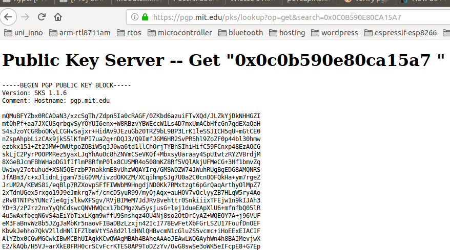


Using HTTPS means that the integrity is guaranteed while data is transferred from the PGP server to my machine. However it remains to validate the authenticity of the data. In other words we must check if this key actually belongs to Wietse or if someone just uploaded it to the PGP server and supplied `Wietse Venema <wietse@porcupine.org>` as the metadata during the upload (an attacker trying to impersonate Wietse).

In fact after comparing the public key from the MIT PGP server (over HTTPS) with the one available from Wietse's website (over HTTP), the keys do NOT match. In other words, one of them is wrong!

In order to verify the authenticity of this key, we must build a chain of trust from a known signature that we trust. I do not have a signed public PGP key, so I can not participate in the chain. However suppose I know the public key used by Alice (so I trust it), then Alice has signed Bob's public key (thus Alice vouches that this public key belongs to a human being Bob), then suppose further that Bob used his private key to sign Wietse Venema's public key. This would form a trust chain from Alice to Wietse. Assuming that I have verified Alice's public key, this forms a chain of trust from me to Wietse's public PGP key. In other words this way we would be able to verify Wietse's public key. 

An online tool to view the trust chains can be found at https://pgp.cs.uu.nl/ (also provides key statistics) or alternatively http://www.lysator.liu.se/~jc/wotsap/index.html.

What is left is to find some PGP user that would act as Alice. I.e. a user for whom I would be able to verify the public PGP. For example we can take Linus Torvalds. His public key is published on https://www.kernel.org/doc/wot/torvalds.html (actually its not the whole key, only the fingerprint). So I can trust him to be the first link in the chain to Wietse. However it seems that his key is not published on PGP servers (its used solely for kernel signature, I guess). Thus I had to find another person who would serve as the first link in the chain.


Unfortunately after about two hours of trying to find a valid first link I had to give up. There was no way to find a good first link that I could trust and verify.  And actually looking at an extract from the log file (shown below) of how the postfix package gets compiled for the Ubuntu, we can see that the maintainers do NOT care for the signatures either (and its a distribution!) (source: https://launchpadlibrarian.net/441280423/buildlog_ubuntu-eoan-amd64.postfix_3.4.5-1ubuntu1_BUILDING.txt.gz):

```
Unpack source
-------------

gpgv: Signature made Mon Sep  9 13:00:16 2019 UTC
gpgv:                using RSA key 886641D6358CDA46A56C1C72AC983EB5BF6BCBA9
gpgv: Can't check signature: No public key
dpkg-source: warning: failed to verify signature on ./postfix_3.4.5-1ubuntu1.dsc
dpkg-source: info: extracting postfix in postfix-3.4.5
```


In the end to verify the integrity of the download I just used public provided on the Wietse's website. The commands are shown below:

  


Step by step, first download the key:
```
artem@ lab5$ wget http://www.porcupine.org/wietse/wietse.pgp
--2019-09-21 18:51:08--  http://www.porcupine.org/wietse/wietse.pgp
Resolving www.porcupine.org (www.porcupine.org)... 168.100.185.125
Connecting to www.porcupine.org (www.porcupine.org)|168.100.185.125|:80... connected.
HTTP request sent, awaiting response... 200 OK
Length: 9281 (9.1K) [text/plain]
Saving to: ‘wietse.pgp’

wietse.pgp                              100%[===============================================================================>]   9.06K  10.4KB/s    in 0.9s    

2019-09-21 18:51:09 (10.4 KB/s) - ‘wietse.pgp’ saved [9281/9281]
```
Import the key:
```
artem@ lab5$ gpg2 --import wietse.pgp 
gpg: key 0C0B590E80CA15A7: 2 signatures not checked due to missing keys
gpg: key 0C0B590E80CA15A7: public key "Wietse Venema <wietse@porcupine.org>" imported
gpg: Total number processed: 3
gpg:     skipped PGP-2 keys: 2
gpg:               imported: 1
gpg: no ultimately trusted keys found
```

Verify the integrity of the download with the signature:
```
artem@ lab5$ gpg2 --verify postfix-3.4.6.tar.gz.gpg2 postfix-3.4.6.tar.gz
gpg: Signature made Sun 30 Jun 2019 02:38:08 MSK
gpg:                using DSA key 0C0B590E80CA15A7
gpg: Good signature from "Wietse Venema <wietse@porcupine.org>" [unknown]
gpg: WARNING: This key is not certified with a trusted signature!
gpg:          There is no indication that the signature belongs to the owner.
Primary key fingerprint: 622C 7C01 2254 C186 6774  69C5 0C0B 590E 80CA 15A7
```


2. https://lwn.net/Articles/461236/

3. https://www.kernel.org/doc/html/latest/process/maintainer-pgp-guide.html

4. https://2hourscrypto.info/

5. http://www.stargrave.org/

6. https://www.devdungeon.com/content/how-verify-gpg-signature

   


### There are a number of options that you will have to enter for (re-)compilation. Look at the available features beforehand.

The build options are described in `INSTALL` document. In particular it describes how to build Postfix in order to: 
1.	Send mail only, without changing an existing Sendmail installation.
2.	Send and receive mail via a virtual host interface, still without any change to an existing Sendmail installation.
3.	Run Postfix instead of Sendmail.

And the various options that can be passed to `make`. For this lab the aim is to install it in mode 3.

One way to pass parameters is as shown below:

```
$ make makefiles CCARGS='-DDEF_CONFIG_DIR=\"/some/where\"'
$ make
```

More Postfix parameters can also be specified by the configuration file (except for the location of the configuration file). These parameters include:

```
	 ____________________________________________________________
    |Macro name       |default value for    |typical default     |
    |_________________|_____________________|____________________|
    |DEF_COMMAND_DIR  |command_directory    |/usr/sbin           |
    |_________________|_____________________|____________________|
    |DEF_CONFIG_DIR   |config_directory     |/etc/postfix        |
    |_________________|_____________________|____________________|
    |DEF_DB_TYPE      |default_database_type|hash                |
    |_________________|_____________________|____________________|
    |DEF_DAEMON_DIR   |daemon_directory     |/usr/libexec/postfix|
    |_________________|_____________________|____________________|
    |DEF_DATA_DIR     |data_directory       |/var/lib/postfix    |
    |_________________|_____________________|____________________|
    |DEF_MAILQ_PATH   |mailq_path           |/usr/bin/mailq      |
    |_________________|_____________________|____________________|
    |DEF_HTML_DIR     |html_directory       |no                  |
    |_________________|_____________________|____________________|
    |DEF_MANPAGE_DIR  |manpage_directory    |/usr/local/man      |
    |_________________|_____________________|____________________|
    |DEF_NEWALIAS_PATH|newaliases_path      |/usr/bin/newaliases |
    |_________________|_____________________|____________________|
    |DEF_QUEUE_DIR    |queue_directory      |/var/spool/postfix  |
    |_________________|_____________________|____________________|
    |DEF_README_DIR   |readme_directory     |no                  |
    |_________________|_____________________|____________________|
    |DEF_SENDMAIL_PATH|sendmail_path        |/usr/sbin/sendmail  |
    |_________________|_____________________|____________________|
```

Another way to pass configuration parameters is shown below:

```
$ make makefiles name=value name=value...
$ make
```


The list of possible name and values is below:
```
 _____________________________________________________________________________
|Name/Value                     |Description                                  |
|_______________________________|_____________________________________________|
|                               |Specifies one or more non-default object     |
|                               |libraries. Postfix 3.0 and later specify some|
|                               |of their database library dependencies with  |
|AUXLIBS="object_library..."    |AUXLIBS_CDB, AUXLIBS_LDAP, AUXLIBS_LMDB,     |
|                               |AUXLIBS_MYSQL, AUXLIBS_PCRE, AUXLIBS_PGSQL,  |
|                               |AUXLIBS_SDBM, and AUXLIBS_SQLITE,            |
|                               |respectively.                                |
|_______________________________|_____________________________________________|
|CC=compiler_command            |Specifies a non-default compiler. On many    |
|                               |systems, the default is gcc.                 |
|_______________________________|_____________________________________________|
|                               |Specifies non-default compiler arguments, for|
|CCARGS="compiler_arguments..." |example, a non-default include directory. The|
|                               |following directives turn off Postfix        |
|                               |features at compile time:                    |
|_______________________________|_____________________________________________|
||                              |Do not build with Berkeley DB support. By    |
||                              |default, Berkeley DB support is compiled in  |
||-DNO_DB                       |on platforms that are known to support this  |
||                              |feature. If you override this, then you      |
||                              |probably should also override DEF_DB_TYPE as |
||                              |described in section 4.6.                    |
||______________________________|_____________________________________________|
||-DNO_DNSSEC                   |Do not build with DNSSEC support, even if the|
||                              |resolver library appears to support it.      |
||______________________________|_____________________________________________|
||                              |Do not build with Solaris /dev/poll support. |
||-DNO_DEVPOLL                  |By default, /dev/poll support is compiled in |
||                              |on Solaris versions that are known to support|
||                              |this feature.                                |
||______________________________|_____________________________________________|
||                              |Do not build with Linux EPOLL support. By    |
||-DNO_EPOLL                    |default, EPOLL support is compiled in on     |
||                              |platforms that are known to support this     |
||                              |feature.                                     |
||______________________________|_____________________________________________|
||                              |Do not build with EAI (SMTPUTF8) support. By |
||-DNO_EAI                      |default, EAI support is compiled in when the |
||                              |"icuuc" library and header files are found.  |
||______________________________|_____________________________________________|
||                              |Do not require support for C99 "inline"      |
||                              |functions. Instead, implement argument       |
||-DNO_INLINE                   |typechecks for non-printf/scanf-like         |
||                              |functions with ternary operators and         |
||                              |unreachable code.                            |
||______________________________|_____________________________________________|
||                              |Do not build with IPv6 support. By default,  |
||                              |IPv6 support is compiled in on platforms that|
||                              |are known to have IPv6 support. Note: this   |
||-DNO_IPV6                     |directive is for debugging And testing only. |
||                              |It is not guaranteed to work on all          |
||                              |platforms. If you don't want IPv6 support,   |
||                              |set "inet_protocols = ipv4" in main.cf.      |
||______________________________|_____________________________________________|
||                              |Do not build with FreeBSD / NetBSD / OpenBSD |
||-DNO_KQUEUE                   |/ MacOSX KQUEUE support. By default, KQUEUE  |
||                              |support is compiled in on platforms that are |
||                              |known to support it.                         |
||______________________________|_____________________________________________|
||                              |Do not build with NIS or NISPLUS support. NIS|
||-DNO_NIS                      |is not available on some recent Linux        |
||                              |distributions.                               |
||______________________________|_____________________________________________|
||                              |Do not build with NISPLUS support. NISPLUS is|
||-DNO_NISPLUS                  |not available on some recent Solaris         |
||                              |distributions.                               |
||______________________________|_____________________________________________|
||                              |Do not build with PCRE support. By default,  |
||-DNO_PCRE                     |PCRE support is compiled in when the pcre-   |
||                              |config utility is installed.                 |
||______________________________|_____________________________________________|
||                              |Disable support for POSIX getpwnam_r/        |
||-DNO_POSIX_GETPW_R            |getpwuid_r. By default Postfix uses these    |
||                              |where they are known to be available.        |
||______________________________|_____________________________________________|
||                              |Use setjmp()/longjmp() instead of sigsetjmp  |
||-DNO_SIGSETJMP                |()/siglongjmp(). By default, Postfix uses    |
||                              |sigsetjmp()/siglongjmp() when they are known |
||                              |to be available.                             |
||______________________________|_____________________________________________|
||                              |Use sprintf() instead of snprintf(). By      |
||-DNO_SNPRINTF                 |default, Postfix uses snprintf() except on   |
||                              |ancient systems.                             |
||______________________________|_____________________________________________|
|                               |Specifies a non-default compiler debugging   |
|DEBUG=debug_level              |level. The default is "-g". Specify DEBUG= to|
|                               |turn off debugging.                          |
|_______________________________|_____________________________________________|
|                               |Specifies a non-default optimization level.  |
|OPT=optimization_level         |The default is "-O". Specify OPT= to turn off|
|                               |optimization.                                |
|_______________________________|_____________________________________________|
|                               |Specifies options for the postfix-install    |
|POSTFIX_INSTALL_OPTS=-option...|command, separated by whitespace. Currently, |
|                               |the only supported option is "-keep-build-   |
|                               |mtime".                                      |
|_______________________________|_____________________________________________|
|                               |Specifies non-default compiler options for   |
|SHLIB_CFLAGS=flags             |building Postfix dynamically-linked libraries|
|                               |and database plugins. The typical default is |
|                               |"-fPIC".                                     |
|_______________________________|_____________________________________________|
|                               |Specifies a non-default runpath for Postfix  |
|SHLIB_RPATH=rpath              |dynamically-linked libraries. The typical    |
|                               |default is "'-Wl,-rpath,${SHLIB_DIR}'".      |
|_______________________________|_____________________________________________|
|                               |Specifies a non-default suffix for Postfix   |
|SHLIB_SUFFIX=suffix            |dynamically-linked libraries and database    |
|                               |plugins. The typical default is ".so".       |
|_______________________________|_____________________________________________|
|                               |Specifies non-default compiler warning       |
|WARN="warning_flags..."        |options for use when "make" is invoked in a  |
|                               |source subdirectory only.                    |
|_______________________________|_____________________________________________|

```

There are more optional features that expose multiple configuration parameters. The parameters for each feature are described in the respective README document:
```
     _____________________________________________________________
    |Optional feature                  |Document     |Availability|
    |__________________________________|_____________|____________|
    |Berkeley DB database              |DB_README    |Postfix 1.0 |
    |__________________________________|_____________|____________|
    |LMDB database                     |LMDB_README  |Postfix 2.11|
    |__________________________________|_____________|____________|
    |LDAP database                     |LDAP_README  |Postfix 1.0 |
    |__________________________________|_____________|____________|
    |MySQL database                    |MYSQL_README |Postfix 1.0 |
    |__________________________________|_____________|____________|
    |Perl compatible regular expression|PCRE_README  |Postfix 1.0 |
    |__________________________________|_____________|____________|
    |PostgreSQL database               |PGSQL_README |Postfix 2.0 |
    |__________________________________|_____________|____________|
    |SASL authentication               |SASL_README  |Postfix 1.0 |
    |__________________________________|_____________|____________|
    |SQLite database                   |SQLITE_README|Postfix 2.8 |
    |__________________________________|_____________|____________|
    |STARTTLS session encryption       |TLS_README   |Postfix 2.2 |
    |__________________________________|_____________|____________|
```


Before building, clean up the previous build:

```
$ make tidy
```

And then applied roughly the same configuration as the Ubuntu package (from https://launchpadlibrarian.net/441280423/buildlog_ubuntu-eoan-amd64.postfix_3.4.5-1ubuntu1_BUILDING.txt.gz):

```
$ make makefiles CCARGS="-DHAS_PCRE -DHAS_SQLITE -I/usr/include -DHAS_SSL -I/usr/include/openssl -DUSE_TLS" DEBUG="-g" \
	AUXLIBS="-lssl -lcrypto -lsasl2 -lpthread" OPT="-O2"\
	AUXLIBS_SQLITE="-lsqlite3 -L../../lib -L. -lpostfix-util -lpostfix-global -lpthread" \
	shared=yes \
	daemon_directory=/usr/lib/postfix/sbin \
	shlibs_directory=/usr/lib/postfix \
	manpage_directory=/usr/share/man \
	sample_directory=/usr/share/doc/postfix/examples \
	readme_directory=/usr/share/doc/postfix \
	html_directory=/usr/share/doc/postfix/html
$ make
$ make install
```

To compile it successfully I had to also install the `libdb5.3-dev` package.

To find the build log for Ubuntu I used info from the following link: https://askubuntu.com/questions/48499/where-can-i-find-the-configure-options-used-to-build-a-package


### Configure the daemon for your zone in view to host emails addressed to @stdX.os3.su.

The syntax and initial config for postfix: http://www.postfix.org/BASIC_CONFIGURATION_README.html

The initial configuration file is shown below:

```
myorigin = $mydomain
mydestination = $mydomain, www.$mydomain, mail.$mydomain, lab.$mydomain, $myhostname, artem-209-HP-EliteDesk-800-G1-SFF, localhost.localdomain, localhost
mynetworks_style = host
relayhost = 
myhostname = mail.std9.os3.su
inet_interfaces = all
smtpd_banner = $myhostname ESMTP $mail_name
biff = no
append_dot_mydomain = no
readme_directory = no
compatibility_level = 2
smtpd_relay_restrictions = permit_mynetworks permit_sasl_authenticated defer_unauth_destination
alias_maps = hash:/etc/aliases
alias_database = hash:/etc/aliases
mailbox_size_limit = 0
recipient_delimiter = +
inet_protocols = all
```

To test the setup I followed the instructions at https://stackoverflow.com/questions/4798772/postfix-its-installed-but-how-do-i-test

Quoted here for reference. Check that postfix is running:
```
artem@ mail$ ps aux | grep postfix
root       781  0.0  0.0  67372  4204 ?        Ss   23:42   0:00 /usr/lib/postfix/sbin/master -w
postfix    782  0.0  0.0  73808  5512 ?        S    23:42   0:00 pickup -l -t unix -u -c
postfix    783  0.0  0.0  73856  5432 ?        S    23:42   0:00 qmgr -l -t unix -u
postfix   1475  0.0  0.0  87720  8356 ?        S    23:51   0:00 tlsmgr -l -t unix -u -c
```

And that its listening on port 25:
```
artem@ mail$ netstat -lnt
Active Internet connections (only servers)
Proto Recv-Q Send-Q Local Address           Foreign Address         State      
tcp        0      0 0.0.0.0:25              0.0.0.0:*               LISTEN     
tcp        0      0 188.130.155.42:53       0.0.0.0:*               LISTEN     
tcp        0      0 127.0.0.1:631           0.0.0.0:*               LISTEN     
tcp6       0      0 :::25                   :::*                    LISTEN     
tcp6       0      0 ::1:631                 :::*                    LISTEN 
```

Then telnet to localhost port 25 to test sending mail to a local user from root (lines prefixed with numbers, such as `220` or `250` or `354` are returned by postfix mail server, the lines in between are typed by the user). Also do not forget the `.` at the end, which indicates end of the email body:
```
artem@ postfix-3.4.6$ telnet localhost 25
Trying 127.0.0.1...
Connected to localhost.
Escape character is '^]'.
220 mail.std9.os3.su ESMTP Postfix
ehlo localhost
250-mail.std9.os3.su
250-PIPELINING
250-SIZE 10240000
250-VRFY
250-ETRN
250-STARTTLS
250-ENHANCEDSTATUSCODES
250-8BITMIME
250-DSN
250 SMTPUTF8
mail from: root@localhost
250 2.1.0 Ok
rcpt to: artem@std9.os3.su
250 2.1.5 Ok
data
354 End data with <CR><LF>.<CR><LF>
Subject: My first email

Hi,
Artem you there?
Admin
.
250 2.0.0 Ok: queued as DE8FFB616AC
```

Check that mail arrived (it was send to a local user):
```
artem@ mail$ cat /var/mail/artem 
From root@localhost  Sat Sep 21 23:52:54 2019
Return-Path: <root@localhost>
X-Original-To: artem@std9.os3.su
Delivered-To: artem@std9.os3.su
Received: from localhost (localhost [127.0.0.1])
	by mail.std9.os3.su (Postfix) with ESMTP id DE8FFB616AC
	for <artem@std9.os3.su>; Sat, 21 Sep 2019 23:52:09 +0300 (MSK)
Subject: My first email
Message-Id: <20190921205227.DE8FFB616AC@mail.std9.os3.su>
Date: Sat, 21 Sep 2019 23:52:09 +0300 (MSK)
From: root@localhost

Hi,
Artem you there?
Admin
```


Then telnet to port 25 and send mail from local account `artem@std9.os3.su` to my gmail account `tematibr@gmai.com` (Again do not forget the `.`):
```
artem@ mail$ telnet localhost 25
Trying 127.0.0.1...
Connected to localhost.
Escape character is '^]'.
220 mail.std9.os3.su ESMTP Postfix
ehlo std9.os3.su
250-mail.std9.os3.su
250-PIPELINING
250-SIZE 10240000
250-VRFY
250-ETRN
250-STARTTLS
250-ENHANCEDSTATUSCODES
250-8BITMIME
250-DSN
250 SMTPUTF8
mail from: artem@std9.os3.su
250 2.1.0 Ok
rcpt to: tematibr@gmail.com
250 2.1.5 Ok
data
354 End data with <CR><LF>.<CR><LF>
Subject: Hello artem from postfix

Hi, wassup?
HElper
.
250 2.0.0 Ok: queued as 2459FB616AC
```

Check that mail arrived to gmail:

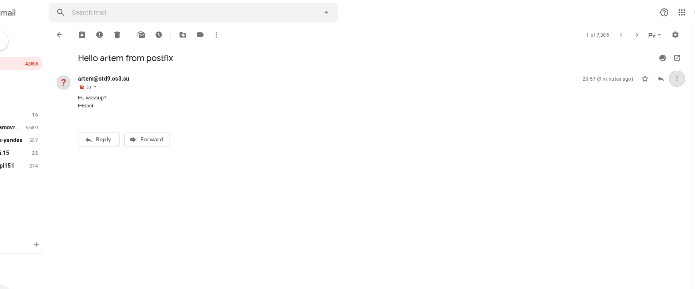

Below is a raw email view provided by gmail that shows the details:

```
Delivered-To: tematibr@gmail.com
Received: by 2002:ac2:515c:0:0:0:0:0 with SMTP id q28csp851474lfd;
        Sat, 21 Sep 2019 13:57:49 -0700 (PDT)
X-Google-Smtp-Source: APXvYqzg/Wy5bGbG4CqlfoQVcoBiPinoE/TdCp8svAng7GhWFe16Axo8i3Fd2K+yuPVtTcmIkyE5
X-Received: by 2002:a2e:9450:: with SMTP id o16mr2785605ljh.178.1569099469049;
        Sat, 21 Sep 2019 13:57:49 -0700 (PDT)
ARC-Seal: i=1; a=rsa-sha256; t=1569099469; cv=none;
        d=google.com; s=arc-20160816;
        b=Bydc1dM1gj0KHwaKxX9MPjZBwaIBlbxrdT8GDHWeJu9g/bGtCUDM6/0VpDQcvYpWcu
         XJrFj5C95Z4yzRr2TU4TpPjmwy5FCe2w21KnXhrTyb2GyuhguoMFqlk8F/S8T4fazjaa
         5ZlqjlFw9yH3hLMmCyd1sJ6VdIjFZrlqxeGleLRqEOriSCnXUhd7oNB3ac51H6cCo64k
         +k2ztDK8HLqH6Zfn3przDXR4AbB7anoYB1r2kunnQq+C19gdfXmII2kLux5IU1swJzvJ
         PtUjAVQXw/0ZRSosJNaAQL2JfbRR3SWNw2BT6VePVZQP0HOUqcFj6AQ3ErCcCcqzwc2B
         HxSQ==
ARC-Message-Signature: i=1; a=rsa-sha256; c=relaxed/relaxed; d=google.com; s=arc-20160816;
        h=from:date:message-id:subject;
        bh=HV7lMBeXw9LGybkaztiivpB1giGiJv8urJI8kVZc/cw=;
        b=VoOjPfAbVJxXtMN5k/OuIOAeXUu7rkPMKjLN6F3cD9LCi3Dm+XVf+5vxPh3aT76662
         H+cilMaRbdgPeRX/vVsd8Y0uDwR3DXhD5eAhdoNZ+dCjkIBeufx7rU0Y/JylrNY086xy
         /6VvPRtBBMKx9o8yCl+E9AtV6bVEx8joKJ49Lrnw50VsGf7GJAOy5xCFWmNZL9DCx4/K
         SGXV1UIINyFGfmroD26FsY5yZtx6Il9Q1cyr94l+AQ/gC0J4J8HWeUJLfFT7HWe27yT4
         39Mi4p+dT1ByS9OlwWOcWuypSFvodyLywzNsn+WAHhqQPST19tekvOZ39+vXjMQhs8wd
         nXuQ==
ARC-Authentication-Results: i=1; mx.google.com;
       spf=neutral (google.com: 188.130.155.42 is neither permitted nor denied by best guess record for domain of artem@std9.os3.su) smtp.mailfrom=artem@std9.os3.su
Return-Path: <artem@std9.os3.su>
Received: from mail.std9.os3.su ([188.130.155.42])
        by mx.google.com with ESMTP id z11si5075040ljn.232.2019.09.21.13.57.48
        for <tematibr@gmail.com>;
        Sat, 21 Sep 2019 13:57:48 -0700 (PDT)
Received-SPF: neutral (google.com: 188.130.155.42 is neither permitted nor denied by best guess record for domain of artem@std9.os3.su) client-ip=188.130.155.42;
Authentication-Results: mx.google.com;
       spf=neutral (google.com: 188.130.155.42 is neither permitted nor denied by best guess record for domain of artem@std9.os3.su) smtp.mailfrom=artem@std9.os3.su
Received: from std9.os3.su (localhost [127.0.0.1]) by mail.std9.os3.su (Postfix) with ESMTP id 2459FB616AC for <tematibr@gmail.com>; Sat, 21 Sep 2019 23:57:07 +0300 (MSK)
Subject: Hello artem from postfix
Message-Id: <20190921205720.2459FB616AC@mail.std9.os3.su>
Date: Sat, 21 Sep 2019 23:57:07 +0300 (MSK)
From: artem@std9.os3.su

Hi, wassup?
HElper

```


Lets try sending a reply!

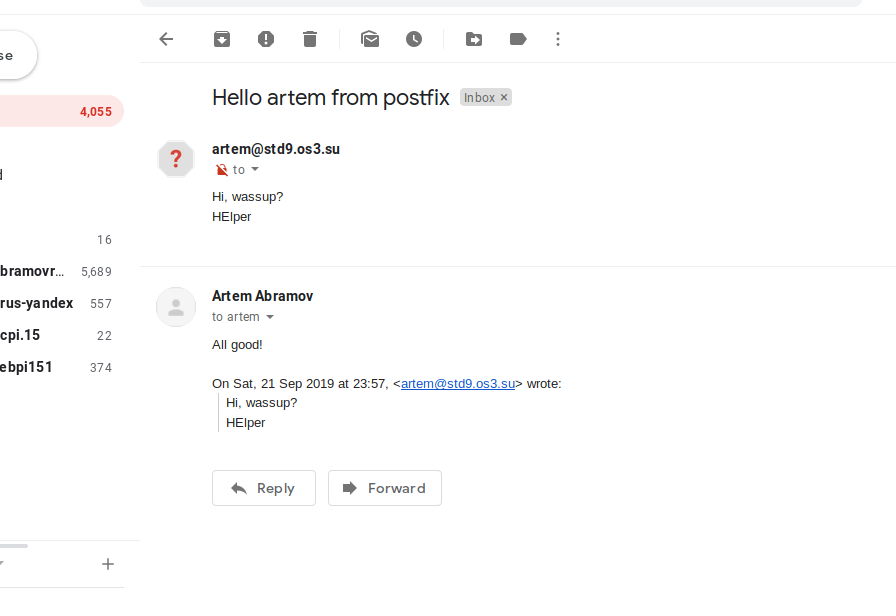

And it works as shown below!

```
artem@ mail$ cat /var/mail/artem 
From root@localhost  Sat Sep 21 23:52:54 2019
Return-Path: <root@localhost>
X-Original-To: artem@std9.os3.su
Delivered-To: artem@std9.os3.su
Received: from localhost (localhost [127.0.0.1])
	by mail.std9.os3.su (Postfix) with ESMTP id DE8FFB616AC
	for <artem@std9.os3.su>; Sat, 21 Sep 2019 23:52:09 +0300 (MSK)
Subject: My first email
Message-Id: <20190921205227.DE8FFB616AC@mail.std9.os3.su>
Date: Sat, 21 Sep 2019 23:52:09 +0300 (MSK)
From: root@localhost

Hi,
Artem you there?
Admin

From tematibr@gmail.com  Sun Sep 22 00:09:13 2019
Return-Path: <tematibr@gmail.com>
X-Original-To: artem@std9.os3.su
Delivered-To: artem@std9.os3.su
Received: from mail-lj1-f171.google.com (mail-lj1-f171.google.com [209.85.208.171])
	by mail.std9.os3.su (Postfix) with ESMTPS id E62A0B616AC
	for <artem@std9.os3.su>; Sun, 22 Sep 2019 00:09:12 +0300 (MSK)
Received: by mail-lj1-f171.google.com with SMTP id v24so10219077ljj.3
        for <artem@std9.os3.su>; Sat, 21 Sep 2019 14:09:12 -0700 (PDT)
DKIM-Signature: v=1; a=rsa-sha256; c=relaxed/relaxed;
        d=gmail.com; s=20161025;
        h=mime-version:references:in-reply-to:from:date:message-id:subject:to;
        bh=V4yKZYsHcqjb7MyJ8YdVcJalLmWG1/MaEMoLfgBGeQU=;
        b=A4KEzDbnC9f2Cj66F4jkqwgB4eCrd2RCidXM5sXA1eyQqbs2Z4F1Eiy09jVQZ0zwYu
         RrRxlltM2Z3v35Ygc48Wbgr6Eql878KAHC1ciiO2iFToRn4HNTVWfY7uLsW+Op85qz/7
         9l5+DpGh1VUVeNH1m8yC29Z/1QZAXURo27DLLEsrwqiWzRQZD6T19Xszcq8RnHEK2/hH
         4fu3HI95vCPz2Yl1vk5NgQkL2MpH+ZD2yPm4Uyc4ttnlvYVF+cJ4HqvtvuYgre9L+9PK
         DDxJMzv85bPKPW0dMxQFabRhuPSbUhg/PQyeWSiRx8qxbbh8Q/p7slba3vtpGlXXsUxM
         jOAw==
X-Google-DKIM-Signature: v=1; a=rsa-sha256; c=relaxed/relaxed;
        d=1e100.net; s=20161025;
        h=x-gm-message-state:mime-version:references:in-reply-to:from:date
         :message-id:subject:to;
        bh=V4yKZYsHcqjb7MyJ8YdVcJalLmWG1/MaEMoLfgBGeQU=;
        b=ojYRXjzzPqL776R+sKYMHJS33s4XvVvkKrAFkxloN5uW7J7bCvVcZYCuTRtdqWytpb
         CmqKJXp2SkbVegi4gvGkTSrbD2cPc6H6hkh4RDoEWmtlomnhHLQEkmWgrB1ZtksRQ/Ab
         npPumawnbjoP4T0BhNvhK4oQI7wa3DkhplKTAkOz1nOZQe3uRTMzO13Bt3d2eQZUnWfz
         05xIFf8VphxsnStF42/oQkq6FkLj6EYpD40Gj0lwl/8/D9wefAIegay5VVAvcuSu4LK3
         kXd7mMKmCa0oLf5Yy+EXzZKMYKXZ0rRxU8PdDMQzH/wV/aAwDOCgOZs4zAwS8CQEB2ga
         V2pw==
X-Gm-Message-State: APjAAAXPqiNxRIX76ypTyy35hLIAfO6bnQcgAof0P6WP962ueznO5vAY
	lbDGVh/lXLRLBlO90PVT/rIIhF+x9d4XKmslQbW+VQ==
X-Google-Smtp-Source: APXvYqwBKGXHOOldBaiGr6hxjVzzdA65BY+El51XYRjyvoPjqEbZyW1nDJV3taiRDj4tYhfKkzZ9k1cjzcLh+keA0/w=
X-Received: by 2002:a2e:b055:: with SMTP id d21mr5610746ljl.236.1569100151794;
 Sat, 21 Sep 2019 14:09:11 -0700 (PDT)
MIME-Version: 1.0
References: <20190921205720.2459FB616AC@mail.std9.os3.su>
In-Reply-To: <20190921205720.2459FB616AC@mail.std9.os3.su>
From: Artem Abramov <tematibr@gmail.com>
Date: Sun, 22 Sep 2019 00:09:00 +0300
Message-ID: <CAHWOQyjq81DYATZcO3L23SiLXCk8Tv+k7LC3ZEo4YKQk+VbsmA@mail.gmail.com>
Subject: Re: Hello artem from postfix
To: artem@std9.os3.su
Content-Type: multipart/alternative; boundary="0000000000002a307e05931699c7"

--0000000000002a307e05931699c7
Content-Type: text/plain; charset="UTF-8"

All good!

On Sat, 21 Sep 2019 at 23:57, <artem@std9.os3.su> wrote:

> Hi, wassup?
> HElper
>

--0000000000002a307e05931699c7
Content-Type: text/html; charset="UTF-8"
Content-Transfer-Encoding: quoted-printable

<div dir=3D"ltr">All good!<br></div><br><div class=3D"gmail_quote"><div dir=
=3D"ltr" class=3D"gmail_attr">On Sat, 21 Sep 2019 at 23:57, &lt;<a href=3D"=
mailto:artem@std9.os3.su">artem@std9.os3.su</a>&gt; wrote:<br></div><blockq=
uote class=3D"gmail_quote" style=3D"margin:0px 0px 0px 0.8ex;border-left:1p=
x solid rgb(204,204,204);padding-left:1ex">Hi, wassup?<br>
HElper<br>
</blockquote></div>

--0000000000002a307e05931699c7--
```


The commands used to communicate with the mail daemon are described in detail in RFC821: https://tools.ietf.org/html/rfc821

Where the mailbox is located: https://unix.stackexchange.com/questions/23277/where-does-postfix-store-email


After sending and receiving the first mail, is a good time to harden the postfix configuration (for example disabling the VERIFY command, which can enumerate all users on the system): https://linux-audit.com/postfix-hardening-guide-for-security-and-privacy/


### Add a local account, setup an alias for postmaster@stdX.os3. su against it, and make sure that the MTA delivers mail to it. Send and show a received test message in full (incl. headers) in your report.

Adding the new local user:

```
artem@ mail$ sudo adduser mailman
Adding user `mailman' ...
Adding new group `mailman' (1001) ...
Adding new user `mailman' (1001) with group `mailman' ...
Creating home directory `/home/mailman' ...
Copying files from `/etc/skel' ...
Enter new UNIX password: 
Retype new UNIX password: 
passwd: password updated successfully
Changing the user information for mailman
Enter the new value, or press ENTER for the default
	Full Name []: mailman
	Room Number []: 
	Work Phone []: 
	Home Phone []: 
	Other []: 
Is the information correct? [Y/n] y
```


Setting up the alias (file format is defined in `man 5 aliases`):

```
artem@ mail$ cat /etc/aliases
postmaster:    mailman
```

Trigger reconfiguration:

```
artem@ mail$ sudo newaliases 
artem@ mail$ echo $?
0
```


Send mail from gmail to `postmaster@std9.os3.su`:

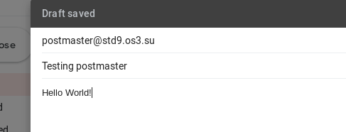

Gmail can show the email details for send mail:

```
MIME-Version: 1.0
Date: Sun, 22 Sep 2019 00:40:36 +0300
Message-ID: <CAHWOQyhR2oTzCfRnf6ov33Bd2866uzsqOvUhejCNodshCkz2Cg@mail.gmail.com>
Subject: Testing postmaster
From: Artem Abramov <tematibr@gmail.com>
To: postmaster@std9.os3.su
Content-Type: multipart/alternative; boundary="000000000000849ee405931709b4"

--000000000000849ee405931709b4
Content-Type: text/plain; charset="UTF-8"

Hello World!

--000000000000849ee405931709b4
Content-Type: text/html; charset="UTF-8"

<div dir="ltr"><div>Hello World!</div></div>

--000000000000849ee405931709b4--
```


Check that response has arrived:

```
artem@ mail$ ll /var/mail/
total 16
drwxrwsr-x  2 root    mail 4096 Sep 22 00:40 ./
drwxr-xr-x 15 root    root 4096 Sep  5 04:42 ../
-rw-------  1 artem   mail 3784 Sep 22 00:09 artem
-rw-------  1 mailman mail 2657 Sep 22 00:40 mailman
```

View the response:

```
artem@ mail$ sudo cat mailman 
From tematibr@gmail.com  Sun Sep 22 00:40:48 2019
Return-Path: <tematibr@gmail.com>
X-Original-To: postmaster@std9.os3.su
Delivered-To: postmaster@std9.os3.su
Received: from mail-lf1-f53.google.com (mail-lf1-f53.google.com [209.85.167.53])
	by mail.std9.os3.su (Postfix) with ESMTPS id 7B92FB616AC
	for <postmaster@std9.os3.su>; Sun, 22 Sep 2019 00:40:48 +0300 (MSK)
Received: by mail-lf1-f53.google.com with SMTP id d17so7419129lfa.7
        for <postmaster@std9.os3.su>; Sat, 21 Sep 2019 14:40:48 -0700 (PDT)
DKIM-Signature: v=1; a=rsa-sha256; c=relaxed/relaxed;
        d=gmail.com; s=20161025;
        h=mime-version:from:date:message-id:subject:to;
        bh=TP7LrnJJQYReLrnt5eHe30HM/ajXu+jq6mI2JRGYbOQ=;
        b=R/OsgnCHtjHuwc10HZsDxNKbJIfaz9EFAwCe1DomeL5AtNJLDGCkvh5jURlrqToMAX
         x67MNh23eA9bgmSIQMhMC5PS/Q6sBALXch0+fKjSmd6/a2dVQ9McUhrZNGJguiigdQEn
         npxPDbzg3A365EWfJ903QPZz9XF3d/hfEEyGiXGFipm9EHE6++kRETlAnt4mhhf6NAmp
         6hN8aLh3jVTBKhc7Ra76F9EOMHKIANwCCeGp9OqQ2KnEdU3oRUuiJ0q8+QG0cV0QOhZ5
         NUx96AqP/4sjDmlcj92z2SCcURUXtOKQ1XJrubpSdw9JwVuUjGvT1vo+6t/urNdObqM7
         qb7A==
X-Google-DKIM-Signature: v=1; a=rsa-sha256; c=relaxed/relaxed;
        d=1e100.net; s=20161025;
        h=x-gm-message-state:mime-version:from:date:message-id:subject:to;
        bh=TP7LrnJJQYReLrnt5eHe30HM/ajXu+jq6mI2JRGYbOQ=;
        b=bnhIvi/BWXcEVaHtBRiSuebImd5gXTWvNgud/psMfBQ1uquapqQA+fYueUACf+3vKV
         0NrH3gYDBRg+gYNmuGjz0yQBqYgXki4JHwj+G5SrPh9B142rFGg6V78qbl7IMjJ8fs/9
         VCgg+d0TcHoV7Wm1JNJifdUlNTlWY5caGQsgAg9R90S9FXXA7zUWQNHbFB0aV60ldK/a
         CRtAwDgH1k9YO6Cy4pCSDvHOqQLO6HO5mH+ULFKUL0OCGlXXJ1vj00/I1VQTqlB3gbT/
         x/TX3Du3grqxn51vMSU2Wb1vWTED+TKCcTRhGTbfyAReOHActXqQ74x2haiJOMZpkCUx
         igvw==
X-Gm-Message-State: APjAAAXVm3ybe2Fm+MP5/ff+cn2h6/28jOpzNNb+PdaXrELE4ws+O61J
	2fT+V7ATlX5+i3Jm8VxgNpqJ0NZ4cKDpmucgn4rXaw==
X-Google-Smtp-Source: APXvYqy+zFStxQAddBhQfgdCXKVB/1yhYIDDSGhsef2bNJgeW+TY1P4d3vPy80mZzI2j4My+POyqQry7IOGitEd01e4=
X-Received: by 2002:ac2:53a3:: with SMTP id j3mr12577260lfh.155.1569102047592;
 Sat, 21 Sep 2019 14:40:47 -0700 (PDT)
MIME-Version: 1.0
From: Artem Abramov <tematibr@gmail.com>
Date: Sun, 22 Sep 2019 00:40:36 +0300
Message-ID: <CAHWOQyhR2oTzCfRnf6ov33Bd2866uzsqOvUhejCNodshCkz2Cg@mail.gmail.com>
Subject: Testing postmaster
To: postmaster@std9.os3.su
Content-Type: multipart/alternative; boundary="00000000000029c2ae0593170a49"

--00000000000029c2ae0593170a49
Content-Type: text/plain; charset="UTF-8"

Hello World!

--00000000000029c2ae0593170a49
Content-Type: text/html; charset="UTF-8"

<div dir="ltr"><div>Hello World!</div></div>

--00000000000029c2ae0593170a49--
```

source: https://serverfault.com/questions/133326/postfix-how-do-i-make-email-aliases-work

### What mail queues your mail server uses? What is their purpose? Where are they located on your machine? How can you interact with them?

Mail queue is a directory used to store the contents and metadata for messages. 

Postfix has five different queues and they are listed below: 
1.	maildrop
2. 	hold
3.  incoming
4.	active
5.	deferred

source: http://www.postfix.org/QSHAPE_README.html#queues

In the tasks above when I was sending an email with telnet client the email was first given an ID and queued for sending in the `maildrop` queue. Outgoing mail can also be put into the  `deferred` queue, if the remote host (or relay) does not answer the request, then postfix will try to send the message later. Another reason is if postfix is configured to process the queues at certain intervals, rather than immediately, in which case the messages must be stored temporarily. 

The administrator can define policies, or cleanup checks that cause messages to be automatically placed indefinitely in the `hold` queue. 

Incoming mail gets queued in the `incoming` queue. When a message reaches the incoming queue the next step is to deliver it to the actual recipient on this machine. 

The `active queue` acts as a window on potentially large `incoming` or `deferred queues`.  

The deferred queue is used for mail that cannot be delivered, if for example the remote host could not be contacted.

Diagram showing how Postfix receives mail is shown below, the nodes without numbers represent queues (i.e. `incoming` and `maildrop`):

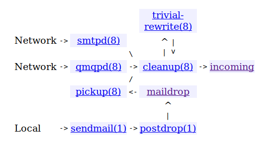


Diagram showing how Postfix delivers mail is shown below, the nodes without numbers represent queues (i.e. `incoming`,  `active` and `deferred`):

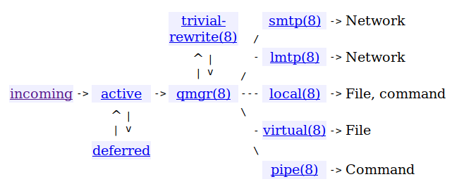

source: http://www.postfix.org/OVERVIEW.html

Location of the queues is in `/var/spool/postfix` as shown below:

```
artem@ mail$ postconf | grep queue_directory
queue_directory = /var/spool/postfix
```

The queue directory has a complex structure as shown below:

```
artem@ mail$ cd /var/spool/postfix/
artem@ postfix$ sudo tree
.
├── active
├── bounce
├── corrupt
├── defer
├── deferred
├── dev
│   ├── log
│   ├── random
│   └── urandom
├── etc
│   ├── host.conf
│   ├── hosts
│   ├── localtime
│   ├── nsswitch.conf
│   ├── resolv.conf
│   ├── services
│   └── ssl
│       └── certs
│           └── ca-certificates.crt
├── flush
├── hold
├── incoming
├── lib
│   ├── i386-linux-gnu
│   │   ├── libgcc_s.so.1
│   │   ├── libnss_compat-2.27.so
│   │   ├── libnss_compat.so.2 -> libnss_compat-2.27.so
│   │   ├── libnss_dns-2.27.so
│   │   ├── libnss_dns.so.2 -> libnss_dns-2.27.so
│   │   ├── libnss_files-2.27.so
│   │   ├── libnss_files.so.2 -> libnss_files-2.27.so
│   │   ├── libnss_hesiod-2.27.so
│   │   ├── libnss_hesiod.so.2 -> libnss_hesiod-2.27.so
│   │   ├── libnss_nis-2.27.so
│   │   ├── libnss_nisplus-2.27.so
│   │   ├── libnss_nisplus.so.2 -> libnss_nisplus-2.27.so
│   │   ├── libnss_nis.so.2 -> libnss_nis-2.27.so
│   │   ├── libresolv-2.27.so
│   │   └── libresolv.so.2 -> libresolv-2.27.so
│   └── x86_64-linux-gnu
│       ├── libgcc_s.so.1
│       ├── libnss_compat-2.27.so
│       ├── libnss_compat.so.2 -> libnss_compat-2.27.so
│       ├── libnss_dns-2.27.so
│       ├── libnss_dns.so.2 -> libnss_dns-2.27.so
│       ├── libnss_files-2.27.so
│       ├── libnss_files.so.2 -> libnss_files-2.27.so
│       ├── libnss_hesiod-2.27.so
│       ├── libnss_hesiod.so.2 -> libnss_hesiod-2.27.so
│       ├── libnss_mdns4_minimal.so.2
│       ├── libnss_mdns4.so.2
│       ├── libnss_mdns6_minimal.so.2
│       ├── libnss_mdns6.so.2
│       ├── libnss_mdns_minimal.so.2
│       ├── libnss_mdns.so.2
│       ├── libnss_myhostname.so.2
│       ├── libnss_nis-2.27.so
│       ├── libnss_nisplus-2.27.so
│       ├── libnss_nisplus.so.2 -> libnss_nisplus-2.27.so
│       ├── libnss_nis.so.2 -> libnss_nis-2.27.so
│       ├── libnss_systemd.so.2
│       ├── libresolv-2.27.so
│       └── libresolv.so.2 -> libresolv-2.27.so
├── maildrop
├── pid
│   ├── inet.smtp
│   ├── master.pid
│   ├── unix.cleanup
│   ├── unix.local
│   ├── unix.showq
│   └── unix.smtp
├── private
│   ├── anvil
│   ├── bounce
│   ├── bsmtp
│   ├── defer
│   ├── discard
│   ├── error
│   ├── ifmail
│   ├── lmtp
│   ├── local
│   ├── maildrop
│   ├── mailman
│   ├── proxymap
│   ├── proxywrite
│   ├── relay
│   ├── retry
│   ├── rewrite
│   ├── scache
│   ├── scalemail-backend
│   ├── smtp
│   ├── tlsmgr
│   ├── trace
│   ├── uucp
│   ├── verify
│   └── virtual
├── public
│   ├── cleanup
│   ├── flush
│   ├── pickup
│   ├── qmgr
│   └── showq
├── saved
├── trace
└── usr
    └── lib
        ├── sasl2
        └── zoneinfo
            └── localtime -> /etc/localtime

25 directories, 84 files
```

We can see that there are a number of internal queues such as `corrupt`, `flush` and  `bounce` that are not mentioned in the documentation for queues. Their use is pretty obvious from their names: corrupt contains corrupt mail, flush is a temporary queue, and bounce is used for messages that must be relayed to another server.

To work with the queue postfix provides `mailq` ,  `postqueue`, `postdrop` and `qmgr` programs. Note: all postfix commands are prefixed with `post` and commands such as `mailq` and `qmgr` are provided for sendmail compatibility. The commands can be used to produce a listing of the email IDs in the queue, the sizes of the messages, the dates, and the senders and recipients, or to manipulate the queue in other ways.


## Task 2 - MX Fallback

### You have backup
#### Adapt the DNS information to your domain, so that the backup MX on your colleague’s server can be found. (...your colleague configures its MTA as a backup MX...)

Added the MX record as below to the `/usr/local/etc/nsd/std9.os3.su.zone.signed`:

```
std9.os3.su.	3600	IN	MX	20 mail.std4.os3.su.
```

Then I updated my zone serial number and checked syntax with:

```
# ldns-read-zone -S YYYYMMDDxx std9.os3.su.zone.signed > std9.os3.su.zone
```

Check the config:

```
$ cat /usr/local/etc/nsd/std9.os3.su.zone
std9.os3.su.	3600	IN	SOA	ns0.std9.os3.su. admin.std9.os3.su. 2019092900 10800 3600 604800 38400
www.std9.os3.su.	3600	IN	CNAME	notes.std9.os3.su.
tst.std9.os3.su.	3600	IN	AAAA	2400:6180:100:d0::8c4:9001
tst.std9.os3.su.	3600	IN	A	68.183.92.166
subdom.std9.os3.su.	3600	IN	NS	ns0.std9.os3.su.
ns0.std9.os3.su.	3600	IN	A	188.130.155.42
notes.std9.os3.su.	3600	IN	CNAME	temach.github.io.
_25._tcp.mail.std9.os3.su.	3600	IN	TLSA	3 0 1 dd1a910a046a841b553f0bc42d7789554e1679a2307f367aa5685eb3dc72180f
mail.std9.os3.su.	3600	IN	A	188.130.155.42
lab.std9.os3.su.	3600	IN	A	188.130.155.42
ansible.std9.os3.su.	3600	IN	AAAA	2a00:b700::6:220
ansible.std9.os3.su.	3600	IN	A	185.22.153.49
_25._tcp.std9.os3.su.	3600	IN	TLSA	3 0 1 dd1a910a046a841b553f0bc42d7789554e1679a2307f367aa5685eb3dc72180f
mail._domainkey.std9.os3.su.	3600	IN	TXT	"v=DKIM1; h=sha256; k=rsa; t=y; " "p=MIIBIjANBgkqhkiG9w0BAQEFAAOCAQ8AMIIBCgKCAQEAx3I/m/OcpD5i9dd1cfoFugnVKEuJD3e+BF/nx1bx3s5HPZ9rWFzeT+sllPnE2vaGoB3RRVyB4l9F7pm/UP5ivlDeH8sIvercqwMEDY8TvqJS7Wa8xH8wJHEQ2sGZ0YxGOEzAa76T2tF16cf/V++x0Snzzak1q8A1xt2MGlCEnAOS5Vh0lBtykHg2oihwl+yFtwa93w/xzPeRjB" "G5y0ddK10aURWeQMgAVnAf/7bqA7YkujyOVQuHRx1XtNkZe+IZxhTVhFMS2ii/UZrvo+Fbo92B98OConORmyJwrWt6jul0Th9AFdB3LMRhhv72y7g5mpwDFT08eqjqABSIWb/WTwIDAQAB"
std9.os3.su.	3600	IN	DNSKEY	257 3 13 ZP8yUKKmSdi8H03m2Pzynh8nTyis1LV72Bmf+ZBbdS0/bBoVIVIBEJ3uYPGMoOlu7kbybMNfLRW1kKRvb6Gv5g== ;{id = 59198 (ksk), size = 256b}
std9.os3.su.	3600	IN	DNSKEY	256 3 13 tMVV1aZA+72bTZUh53xB12Xl/dsxcGR5W/aIeZ3+rzSceq3WT88CitEzzcaC8dwcJ2jtZlFXmDRGnf55f6RgVw== ;{id = 62425 (zsk), size = 256b}
std9.os3.su.	3600	IN	MX	10 mail.std9.os3.su.
std9.os3.su.	3600	IN	MX	20 mail.std4.os3.su.
std9.os3.su.	3600	IN	NS	ns0.std9.os3.su.
```

Then I resigned the zone file:

```
# ldns-signzone -e $(date -d "1 month 2 days" "+%Y%m%d") std9.os3.su.zone Kstd9.os3.su.+013+59198 Kstd9.os3.su.+013+62425
```

Finally I restarted NSD.

#### 

#### Validate by shutting your service down and sending a message to your domain (...your colleague sees its logs and where the message is temporarily stored...)
I stopped my mail server with:

```
$ sudo postfix stop
```

Then I send the email from gmail (the raw headers are shown below):

```
MIME-Version: 1.0
Date: Sun, 29 Sep 2019 21:57:29 +0300
Message-ID: <CAHWOQyi3pxDDKcyb+6cXZO1Qe0vr0-EtG6bt-U7Oq8=K9yenhQ@mail.gmail.com>
Subject: Hello 3!
From: Artem Abramov <tematibr@gmail.com>
To: admin@std9.os3.su
Content-Type: multipart/alternative; boundary="000000000000e992220593b5b06b"

--000000000000e992220593b5b06b
Content-Type: text/plain; charset="UTF-8"

This should go to backup 3.

--000000000000e992220593b5b06b
Content-Type: text/html; charset="UTF-8"

<div dir="ltr">This should go to backup 3.<br></div>

--000000000000e992220593b5b06b--
```

At this point I was waiting for logs to register on my colleague.

#### Bring your service back up and wait

I restored the postfix service with the command:

```
$ sudo postfix start
```

After my teammate flushed the queue, the delivery was successful (from `/var/mail/mailman`, because `admin` is configured to alias to `mailman` on my mailserver):

```
From tematibr@gmail.com  Sun Sep 29 22:02:33 2019
Return-Path: <tematibr@gmail.com>
X-Original-To: admin@std9.os3.su
Delivered-To: admin@std9.os3.su
Received: from mail.std4.os3.su (unknown [188.130.155.37])
	by mail.std9.os3.su (Postfix) with ESMTP id 829B4B614AA
	for <admin@std9.os3.su>; Sun, 29 Sep 2019 22:02:33 +0300 (MSK)
Authentication-Results: mail.std9.os3.su;
	dkim=pass (2048-bit key; unprotected) header.d=gmail.com header.i=@gmail.com header.b="e8OwANIJ";
	dkim-atps=neutral
Received: from mail-lf1-f54.google.com (mail-lf1-f54.google.com [209.85.167.54])
	by mail.std4.os3.su (Postfix) with ESMTP id 6E987100625
	for <admin@std9.os3.su>; Sun, 29 Sep 2019 21:57:41 +0300 (MSK)
Received: by mail-lf1-f54.google.com with SMTP id w6so5384162lfl.2
        for <admin@std9.os3.su>; Sun, 29 Sep 2019 11:57:41 -0700 (PDT)
DKIM-Signature: v=1; a=rsa-sha256; c=relaxed/relaxed;
        d=gmail.com; s=20161025;
        h=mime-version:from:date:message-id:subject:to;
        bh=IKdniOZUD6tsb5GDObMpA0wAVhN9CSH8yUwv44iBd1U=;
        b=e8OwANIJWUH3/+hYz1IXC3LYfc2ypraP2aHZiFuxmdERxRnSCYQWZC32q/zd8BXUxz
         L631jDvdRaSQUZxygJp8ETYW8sOAtDWBE6SvavHf+xT3A6qwAznOzfccvV/2tABRxwgJ
         wwVQ6eIcDuT2/sBlTNVqUsTYIlURz+x9DaE7IL75fUa/95/sBo3fx/hVDVeEqqrBvYKG
         4lVeJTZiKOKBq6j32SmzCm0JG4WrQXlmOhJMjcDTh9I8e2FRuVkfID9EqKvH9OQ/jrUo
         mnPRpA/HzVRCgffyfsKxqvHhOdkKlgyYTx2bLUaGyrN4FaXrNKOwIVd1JQ1df5IxDJje
         FjAA==
X-Google-DKIM-Signature: v=1; a=rsa-sha256; c=relaxed/relaxed;
        d=1e100.net; s=20161025;
        h=x-gm-message-state:mime-version:from:date:message-id:subject:to;
        bh=IKdniOZUD6tsb5GDObMpA0wAVhN9CSH8yUwv44iBd1U=;
        b=KC2bWQbvqQSIHa3vpvv8SwpbxNuNsGlauVNUHQOwwO38l9bTrKI8826JCxkTXnGdJm
         ZlWXyQUX68d5nWgQAAxLgZADRlDeW3r7a8t8RkZwdVFWkPqpARPuJ7m1mL9d5aF6mn3U
         9nPdXPWQeuQOtG9xwZlCYq1UBlu1hMIZFZXDQmqjLIXl4kV8c3DR0MWY4Dy2VH48ih7h
         zAur1REVy6+uUO5j6yeVv9VykLQQ6hQtzdDjxvmLfM60EKZF9vi6R/anRMyXojlZoPfD
         rcTcqzbAObTkJnb7DI2PVygRKACZkg0auYDrxEW2ufme1KvghYC0yx7Q8gOxuNDIyt5X
         9u0Q==
X-Gm-Message-State: APjAAAVg5S7k4n5Duh8ih6+ZbKYQGxSjM7d9oodTdpdQKn/QYGadO4Ib
	27TTcGsX0mtPV7vkDHu6Hc/QirwmibW9XjWwMdyNpA==
X-Google-Smtp-Source: APXvYqzia5shwJPowtu3KS0BNwENjdsoL7TqvEHhlqYnord0Sn11b4tGmbqQu6lleDVu7E3w62no0K2ExiByDacdtiE=
X-Received: by 2002:a19:c3d3:: with SMTP id t202mr9171871lff.48.1569783460678;
 Sun, 29 Sep 2019 11:57:40 -0700 (PDT)
MIME-Version: 1.0
From: Artem Abramov <tematibr@gmail.com>
Date: Sun, 29 Sep 2019 21:57:29 +0300
Message-ID: <CAHWOQyi3pxDDKcyb+6cXZO1Qe0vr0-EtG6bt-U7Oq8=K9yenhQ@mail.gmail.com>
Subject: Hello 3!
To: admin@std9.os3.su
Content-Type: multipart/alternative; boundary="0000000000008c4fd00593b5b125"

--0000000000008c4fd00593b5b125
Content-Type: text/plain; charset="UTF-8"

This should go to backup 3.

--0000000000008c4fd00593b5b125
Content-Type: text/html; charset="UTF-8"

<div dir="ltr">This should go to backup 3.<br></div>

--0000000000008c4fd00593b5b125--
```

### You provide backup
#### Make your MX act as a backup for your colleague’s domain

To make my server a backup for `std8` I added the following to my `main.cf` :

```
relay_domains = $mydestination, std8.os3.su
relay_recipient_maps =
```

Then I restarted the postfix server.

source: https://www.howtoforge.com/postfix_backup_mx

#### Show the logs while doing your mate’s acceptance test and show where the message is temporarily stored.

Then a message was sent to `aliakbar@std8.os3.su`. This message eventually made it to my server (i.e. it made it to the backup server, because Ali's server was down). The postfix log is shown below (`cat /var/log/mail.log`):

```
Sep 30 18:30:29 artem-209-HP-EliteDesk-800-G1-SFF postfix/smtpd[480]: connect from mail-lj1-f181.google.com[209.85.208.181]
Sep 30 18:30:29 artem-209-HP-EliteDesk-800-G1-SFF postfix/smtpd[480]: Anonymous TLS connection established from mail-lj1-f181.google.com[209.85.208.181]: TLSv1.3 with cipher TLS_AES_128_GCM_SHA256 (128/128 bits)
Sep 30 18:30:29 artem-209-HP-EliteDesk-800-G1-SFF postfix/smtpd[480]: EFFFDB614AA: client=mail-lj1-f181.google.com[209.85.208.181]
Sep 30 18:30:30 artem-209-HP-EliteDesk-800-G1-SFF postfix/cleanup[485]: EFFFDB614AA: message-id=<CAHWOQyjKiKPe_PhDSPqSjUJk5q4AFcUwN6qviT1r6G2uO0r2ug@mail.gmail.com>
Sep 30 18:30:30 artem-209-HP-EliteDesk-800-G1-SFF opendkim[18319]: EFFFDB614AA: s=20161025 d=gmail.com SSL
Sep 30 18:30:30 artem-209-HP-EliteDesk-800-G1-SFF postfix/qmgr[32695]: EFFFDB614AA: from=<tematibr@gmail.com>, size=2586, nrcpt=1 (queue active)
Sep 30 18:30:30 artem-209-HP-EliteDesk-800-G1-SFF postfix/smtpd[480]: disconnect from mail-lj1-f181.google.com[209.85.208.181] ehlo=2 starttls=1 mail=1 rcpt=1 data=1 quit=1 commands=7
Sep 30 18:30:30 artem-209-HP-EliteDesk-800-G1-SFF postfix/relay/smtp[486]: connect to mail.std8.os3.su[2600:cace:f000:6aaa:feed:beef:b000:1]:25: Network is unreachable
Sep 30 18:30:30 artem-209-HP-EliteDesk-800-G1-SFF postfix/relay/smtp[486]: connect to mail.std8.os3.su[188.130.155.41]:25: Connection refused

```

We can see that my postfix installation attempted to connect to Ali's mail server at `[188.130.155.41]:25` but the connection was refused.

The message ended up in the `deferred` queue on my machine:

```
:/var/spool/postfix/deferred# tree
.
├── 0
├── 1
├── 3
├── 7
├── 9
├── A
├── C
├── D
└── E
    └── EFFFDB614AA
```

Its contents are shown below:

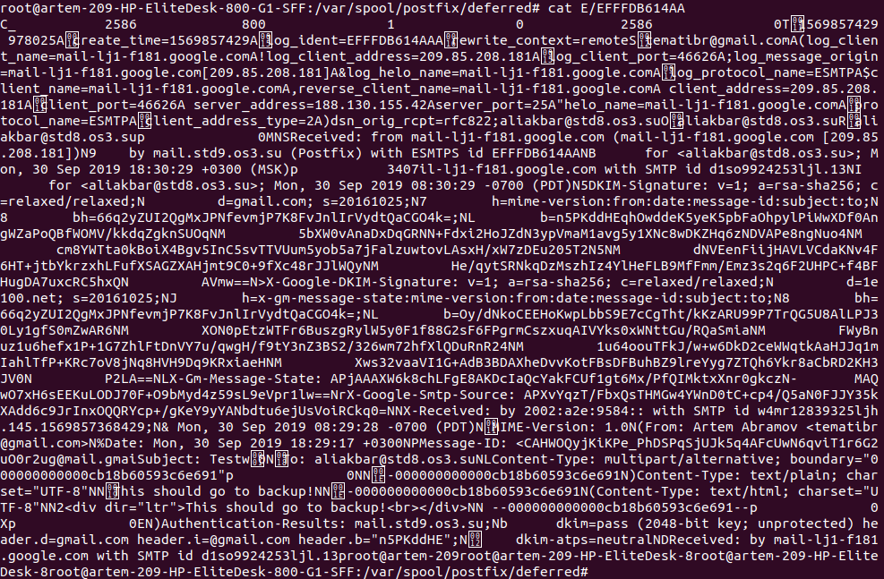

#### Once you colleague’s MX is back online, eventually force an immediate delivery and show your mail logs

I executed:

```
$ sudo postqueue -f
```

The following was written to my postfix log:

```
Sep 30 18:30:30 artem-209-HP-EliteDesk-800-G1-SFF postfix/relay/smtp[486]: EFFFDB614AA: to=<aliakbar@std8.os3.su>, relay=none, delay=0.85, delays=0.17/0.01/0.66/0, dsn=4.4.1, status=deferred (connect to mail.std8.os3.su[188.130.155.41]:25: Connection refused)
Sep 30 18:32:06 artem-209-HP-EliteDesk-800-G1-SFF postfix/qmgr[32695]: EFFFDB614AA: from=<tematibr@gmail.com>, size=2586, nrcpt=1 (queue active)
Sep 30 18:32:07 artem-209-HP-EliteDesk-800-G1-SFF postfix/relay/smtp[486]: connect to mail.std8.os3.su[2600:cace:f000:6aaa:feed:beef:b000:1]:25: Network is unreachable
Sep 30 18:32:07 artem-209-HP-EliteDesk-800-G1-SFF postfix/relay/smtp[486]: EFFFDB614AA: to=<aliakbar@std8.os3.su>, relay=mail.std8.os3.su[188.130.155.41]:25, delay=98, delays=97/0/0.62/0.26, dsn=2.0.0, status=sent (250 2.0.0 Ok: queued as 78FE914289C)
Sep 30 18:32:07 artem-209-HP-EliteDesk-800-G1-SFF postfix/qmgr[32695]: EFFFDB614AA: removed
```

Which shows that the message was transferred successfully.

source: https://serverfault.com/questions/279803/postfix-how-to-retry-delivery-of-mail-in-queue

## Task 3 - Mailing Loops
### Create an email loop within your colleague from domain to domain using email aliases.

I created an alias pointing to Rodrigo as shown below:

```
$ cat /etc/aliases
# See man 5 aliases for format
postmaster:    rodry@std13.os3.su
```

Rodrigo created an alias for Rustam, and Rustam created an alias for me.

### Send an email to the loop using your own email address and see what happens on your MTA.

I used the following command to send email to rodrigo:

```
$ swaks --to rodry@std13.os3.su --protocol ESMTPS --from postmaster@std9.os3.su --ehlo mail.std9.os3.su --server mail.std9.os3.su
```

Below we can see that I get my logfile (`/var/log/mail.log`) with lines such as:

```
Sep 29 16:10:26 artem-209-HP-EliteDesk-800-G1-SFF postfix/smtp[13888]: 596DCB614B5: to=<rodry@std13.os3.su>, orig_to=<postmaster@std9.os3.su>, relay=mail.std13.os3.su[188.130.155.46]:25, delay=1.4, delays=0.03/0/0.69/0.69, dsn=2.0.0, status=sent (250 OK id=1iEYy2-0003Gf-BH)
```

So the `orig_to` is `postmaster@std9.os3.su` and the `relay` is `mail.std13.os3.su`. This is the email that I originally send to Rodrigo. Below is the screenshot of my log:


The text version of the log is below:

```
$ tail -f /var/log/mail.log
Sep 29 16:09:10 artem-209-HP-EliteDesk-800-G1-SFF postfix/smtpd[13884]: warning: hostname mail.st9.os3.su does not resolve to address 188.130.155.42
Sep 29 16:09:10 artem-209-HP-EliteDesk-800-G1-SFF postfix/smtpd[13884]: connect from unknown[188.130.155.42]
Sep 29 16:09:10 artem-209-HP-EliteDesk-800-G1-SFF postfix/smtpd[13884]: warning: connect to Milter service unix:/var/run/opendkim/opendkim.sock: No such file or directory
Sep 29 16:09:10 artem-209-HP-EliteDesk-800-G1-SFF postfix/smtpd[13884]: Anonymous TLS connection established from unknown[188.130.155.42]: TLSv1.3 with cipher TLS_AES_256_GCM_SHA384 (256/256 bits)
Sep 29 16:09:10 artem-209-HP-EliteDesk-800-G1-SFF postfix/smtpd[13884]: CAC29B614B4: client=unknown[188.130.155.42]
Sep 29 16:09:10 artem-209-HP-EliteDesk-800-G1-SFF postfix/cleanup[13887]: CAC29B614B4: message-id=<20190929160910.013895@artem-209-HP-EliteDesk-800-G1-SFF>
Sep 29 16:09:10 artem-209-HP-EliteDesk-800-G1-SFF postfix/qmgr[13464]: CAC29B614B4: from=<postmaster@std9.os3.su>, size=516, nrcpt=1 (queue active)
Sep 29 16:09:10 artem-209-HP-EliteDesk-800-G1-SFF postfix/smtpd[13884]: disconnect from unknown[188.130.155.42] ehlo=2 starttls=1 mail=1 rcpt=1 data=1 quit=1 commands=7
Sep 29 16:09:12 artem-209-HP-EliteDesk-800-G1-SFF postfix/smtp[13888]: CAC29B614B4: to=<rodry@std13.os3.su>, relay=mail.std13.os3.su[188.130.155.46]:25, delay=1.3, delays=0.03/0/0.53/0.72, dsn=2.0.0, status=sent (250 OK id=1iEYwp-0003GZ-IK)
Sep 29 16:09:12 artem-209-HP-EliteDesk-800-G1-SFF postfix/qmgr[13464]: CAC29B614B4: removed
Sep 29 16:10:25 artem-209-HP-EliteDesk-800-G1-SFF postfix/smtpd[13884]: warning: hostname std11.os3.su does not resolve to address 188.130.155.44: Name or service not known
Sep 29 16:10:25 artem-209-HP-EliteDesk-800-G1-SFF postfix/smtpd[13884]: connect from unknown[188.130.155.44]
Sep 29 16:10:25 artem-209-HP-EliteDesk-800-G1-SFF postfix/smtpd[13884]: warning: connect to Milter service unix:/var/run/opendkim/opendkim.sock: No such file or directory
Sep 29 16:10:25 artem-209-HP-EliteDesk-800-G1-SFF postfix/smtpd[13884]: 4C675B614B4: client=unknown[188.130.155.44]
Sep 29 16:10:25 artem-209-HP-EliteDesk-800-G1-SFF postfix/cleanup[13887]: 4C675B614B4: message-id=<E1iEYxs-0005cW-Fo@std11.os3.su>
Sep 29 16:10:25 artem-209-HP-EliteDesk-800-G1-SFF postfix/qmgr[13464]: 4C675B614B4: from=<rusadmin@std11.os3.su>, size=571, nrcpt=1 (queue active)
Sep 29 16:10:25 artem-209-HP-EliteDesk-800-G1-SFF postfix/cleanup[13887]: 596DCB614B5: message-id=<E1iEYxs-0005cW-Fo@std11.os3.su>
Sep 29 16:10:25 artem-209-HP-EliteDesk-800-G1-SFF postfix/smtpd[13884]: disconnect from unknown[188.130.155.44] ehlo=1 mail=1 rcpt=1 data=1 quit=1 commands=5
Sep 29 16:10:25 artem-209-HP-EliteDesk-800-G1-SFF postfix/local[13951]: 4C675B614B4: to=<postmaster@std9.os3.su>, relay=local, delay=0.09, delays=0.05/0.01/0/0.03, dsn=2.0.0, status=sent (forwarded as 596DCB614B5)
Sep 29 16:10:25 artem-209-HP-EliteDesk-800-G1-SFF postfix/qmgr[13464]: 596DCB614B5: from=<rusadmin@std11.os3.su>, size=706, nrcpt=1 (queue active)
Sep 29 16:10:25 artem-209-HP-EliteDesk-800-G1-SFF postfix/qmgr[13464]: 4C675B614B4: removed
Sep 29 16:10:26 artem-209-HP-EliteDesk-800-G1-SFF postfix/smtp[13888]: 596DCB614B5: to=<rodry@std13.os3.su>, orig_to=<postmaster@std9.os3.su>, relay=mail.std13.os3.su[188.130.155.46]:25, delay=1.4, delays=0.03/0/0.69/0.69, dsn=2.0.0, status=sent (250 OK id=1iEYy2-0003Gf-BH)
Sep 29 16:10:26 artem-209-HP-EliteDesk-800-G1-SFF postfix/qmgr[13464]: 596DCB614B5: removed
Sep 29 16:11:15 artem-209-HP-EliteDesk-800-G1-SFF postfix/qmgr[13464]: A6AF2B614AE: from=<postmaster@std9.os3.su>, size=514, nrcpt=1 (queue active)
Sep 29 16:11:15 artem-209-HP-EliteDesk-800-G1-SFF postfix/qmgr[13464]: C634AB614AF: from=<admin@std9.os3.su>, size=509, nrcpt=1 (queue active)
Sep 29 16:11:15 artem-209-HP-EliteDesk-800-G1-SFF postfix/qmgr[13464]: 9016DB614AB: from=<admin@std9.os3.su>, size=509, nrcpt=1 (queue active)
```


### Can you change the behaviour of your MTA in response to this loop?

The problem and solutions are outlined in RFC 3834 (https://tools.ietf.org/html/rfc3834). In particular it suggests that:

```
   -  Automatic responses SHOULD NOT be issued in response to any
      message which contains an Auto-Submitted header field (see below),
      where that field has any value other than "no".
```

where the auto-submitted header should be included in the message header of any automatic response and is defined in Section 5 of that document (https://tools.ietf.org/html/rfc3834#section-5). Actually this RFC is already implemented in the `postfix-bounce` program.

If that header is not present its possible to set up flood limits such as no more than X messages every Y minutes.

The loop is caused by a misconfigured alias, so the best response is fixing the alias. 

source: https://serverfault.com/questions/462724/how-to-avoid-automatic-responses-from-putting-our-mail-server-in-a-loop


## Task 4 - Virtual Domains

### Create a new subdomain within your domain and add an MX entry to it

The new subdomain will be `subdom.std9.os3.su.`.

Edit existing `std9.os3.su.zone.signed` to add:
```
subdom.std9.os3.su.	3600	IN	NS	ns0.std9.os3.su.
```

Update the serial number and check format with:
```
# ldns-read-zone -S YYYYMMDDxx std9.os3.su.zone.signed > std9.os3.su.zone
```

Check the contents:
```
# cat std9.os3.su.zone 
std9.os3.su.	3600	IN	SOA	ns0.std9.os3.su. admin.std9.os3.su. 2019092200 10800 3600 604800 38400
subdom.std9.os3.su.	3600	IN	NS	ns0.std9.os3.su.
www.std9.os3.su.	3600	IN	CNAME	notes.std9.os3.su.
tst.std9.os3.su.	3600	IN	AAAA	2400:6180:100:d0::8c4:9001
tst.std9.os3.su.	3600	IN	A	68.183.92.166
ns0.std9.os3.su.	3600	IN	A	188.130.155.42
notes.std9.os3.su.	3600	IN	CNAME	temach.github.io.
mail.std9.os3.su.	3600	IN	A	188.130.155.42
lab.std9.os3.su.	3600	IN	A	188.130.155.42
ansible.std9.os3.su.	3600	IN	AAAA	2a00:b700::6:220
ansible.std9.os3.su.	3600	IN	A	185.22.153.49
std9.os3.su.	3600	IN	DNSKEY	257 3 13 ZP8yUKKmSdi8H03m2Pzynh8nTyis1LV72Bmf+ZBbdS0/bBoVIVIBEJ3uYPGMoOlu7kbybMNfLRW1kKRvb6Gv5g== ;{id = 59198 (ksk), size = 256b}
std9.os3.su.	3600	IN	DNSKEY	256 3 13 tMVV1aZA+72bTZUh53xB12Xl/dsxcGR5W/aIeZ3+rzSceq3WT88CitEzzcaC8dwcJ2jtZlFXmDRGnf55f6RgVw== ;{id = 62425 (zsk), size = 256b}
std9.os3.su.	3600	IN	MX	20 ansible.std9.os3.su.
std9.os3.su.	3600	IN	MX	10 mail.std9.os3.su.
std9.os3.su.	3600	IN	NS	ns0.std9.os3.su.
```


Sign the zone again:
```
# ldns-signzone -e $(date -d "1 month 2 days" "+%Y%m%d") std9.os3.su.zone Kstd9.os3.su.+013+59198 Kstd9.os3.su.+013+62425
```

Create the new zonefile `subdom.std9.os3.su.zone`:

```
$ cat subdom.std9.os3.su.zone 
$TTL 3600
subdom.std9.os3.su.       IN      SOA     ns0.std9.os3.su. admin.subdom.std9.os3.su. (
                        2019092200  ; Serial
                        10800       ; Refresh
                        3600        ; Retry
                        604800      ; Expire
                        38400 )     ; Negative Cache TTL
; Nameserver records
subdom.std9.os3.su      	IN	NS      ns0.std9.os3.su.
subdom.std9.os3.su.		IN	MX	10 			mail.subdom.std9.os3.su.
mail.subdom.std9.os3.su.   	IN      A       188.130.155.42
```

Modify the NSD config by appending the following information:

```
zone:
 	name: "subdom.std9.os3.su"
 	zonefile: "subdom.std9.os3.su.zone"
```

Restart NSD. Check ping:
```
# ping mail.subdom.std9.os3.su.
PING mail.subdom.std9.os3.su (188.130.155.42) 56(84) bytes of data.
64 bytes from mail.st9.os3.su (188.130.155.42): icmp_seq=1 ttl=64 time=0.072 ms
64 bytes from mail.st9.os3.su (188.130.155.42): icmp_seq=2 ttl=64 time=0.078 ms
64 bytes from mail.st9.os3.su (188.130.155.42): icmp_seq=3 ttl=64 time=0.057 ms
^C
--- mail.subdom.std9.os3.su ping statistics ---
3 packets transmitted, 3 received, 0% packet loss, time 2033ms
rtt min/avg/max/mdev = 0.057/0.069/0.078/0.008 ms
```

Check mail records:
```
# dig mx +dnssec subdom.std9.os3.su.

; <<>> DiG 9.11.3-1ubuntu1.8-Ubuntu <<>> mx +dnssec subdom.std9.os3.su.
;; global options: +cmd
;; Got answer:
;; ->>HEADER<<- opcode: QUERY, status: NOERROR, id: 24643
;; flags: qr rd ra; QUERY: 1, ANSWER: 1, AUTHORITY: 0, ADDITIONAL: 1

;; OPT PSEUDOSECTION:
; EDNS: version: 0, flags: do; udp: 512
;; QUESTION SECTION:
;subdom.std9.os3.su.		IN	MX

;; ANSWER SECTION:
subdom.std9.os3.su.	3599	IN	MX	10 mail.subdom.std9.os3.su.

;; Query time: 246 msec
;; SERVER: 8.8.8.8#53(8.8.8.8)
;; WHEN: Sun Sep 22 02:31:06 MSK 2019
;; MSG SIZE  rcvd: 68
```

The subdomain does not have DNSSEC enabled, so the reply is as expected.


### Then extend your MTA configuration to handle virtual domains, and have it handle the email for the newly created domain

Edit postfix configuration `/etc/postfix/main.cf`, add the following:

```
virtual_alias_maps = hash:/etc/virtual
virtual_alias_domains = subdom.std9.os3.su
```

Edit the virtual domain file `/etc/virtual`:

```
$ cat /etc/virtual
admin@subdom.std9.os3.su    mailman
```

This configuration will put all mail that is send to `admin@subdom.std9.os3.su` (which is the default mail specified in the SOA record for `subdom.std9.os3.su`) into the `mailman` inbox. I could have also created another user such as `admin-subdom` and used him instead of `mailman` for the configuration above. However reusing the `mailman` user was just simpler.

Refresh postfix configuration:

```
$ sudo postmap /etc/virtual
$ sudo postfix reload
postfix/postfix-script: refreshing the Postfix mail system
```

sources:

1. http://www.berkes.ca/guides/postfix_virtual.html
2. http://www.postfix.org/postconf.5.html#virtual_alias_maps
3. http://www.postfix.org/virtual.5.html
4. www.postfix.org/VIRTUAL_README.html


### Validate that you are now receiving emails for both domains


Validate the setup by sending an email from gmail to the subdomain:
```
MIME-Version: 1.0
Date: Sun, 22 Sep 2019 02:56:43 +0300
Message-ID: <CAHWOQyinuUCE++8zKE+w9DTHxqjWRbTEGcbp8Na8MXueYiK1vA@mail.gmail.com>
Subject: Hello brave new world!
From: Artem Abramov <tematibr@gmail.com>
To: admin@subdom.std9.os3.su
Content-Type: multipart/alternative; boundary="0000000000004a7b45059318f0ef"

--0000000000004a7b45059318f0ef
Content-Type: text/plain; charset="UTF-8"

This is the message body.

--0000000000004a7b45059318f0ef
Content-Type: text/html; charset="UTF-8"

<div dir="ltr"><div>This is the message body.</div><div><br></div></div>

--0000000000004a7b45059318f0ef--
```


Receiving the email, we can see that it was put in the `mailman` inbox:

```
$ cat /var/mail/mailman
From tematibr@gmail.com  Sun Sep 22 02:56:55 2019
Return-Path: <tematibr@gmail.com>
X-Original-To: admin@subdom.std9.os3.su
Delivered-To: mailman@std9.os3.su
Received: from mail-lj1-f179.google.com (mail-lj1-f179.google.com [209.85.208.179])
	by mail.std9.os3.su (Postfix) with ESMTPS id 5090BB616AC
	for <admin@subdom.std9.os3.su>; Sun, 22 Sep 2019 02:56:55 +0300 (MSK)
Received: by mail-lj1-f179.google.com with SMTP id e17so10277442ljf.13
        for <admin@subdom.std9.os3.su>; Sat, 21 Sep 2019 16:56:55 -0700 (PDT)
DKIM-Signature: v=1; a=rsa-sha256; c=relaxed/relaxed;
        d=gmail.com; s=20161025;
        h=mime-version:from:date:message-id:subject:to;
        bh=W7/5qnEjoWlks/wgsZED0M/eltODj2XmqH6VUDZjzWY=;
        b=Akp/ZggpSiEM76RhE0fRWJMDFy+BKSwyqLL2OvvH3VOM8YvbJH4xxZmGI6w1ga51PX
         ABJspuTwpyFh2ELais96IlRnPG3sjPsP67zJXncw1c21lEAjCOxsyyKl5bVAMaYZSFeA
         hnIcJXKMhyHPRap3HPr7aAurVXW2l1GvaHyl/BDDGyELInvpfGqUtJfaNcjFFF0hBBiR
         5m2O37bMQvmXLNxEnoMmEkwEjHhJY6OyVlrXfB0EBNIA0bOgnbxWB/+lPUz8pr/BrxiD
         tHQrGqTgK57s76Kvh21PelZ3t4x5XQgBV80mNaCidNwolaULhAQ7JA865I2bCk94i6nZ
         9/3A==
X-Google-DKIM-Signature: v=1; a=rsa-sha256; c=relaxed/relaxed;
        d=1e100.net; s=20161025;
        h=x-gm-message-state:mime-version:from:date:message-id:subject:to;
        bh=W7/5qnEjoWlks/wgsZED0M/eltODj2XmqH6VUDZjzWY=;
        b=oQfw36pa/FkibKFT9GlB28vuHpNWHb2hGK1GXkyR0XoTGaYKCZidDz6Aqt1pbvVqzn
         gkolIDOaGc9AlF1TMdcbQZgJuUrwJP2/pnI44Eus0ngobqOPqdRh5pDCMk9G1a9f/Dnp
         +eZpjKQOd+ql2SSBgAaueRl1/6yYaKXCYs2ex/5wKkmbyc+okWwdTgJ6Ri66tcXuXQJw
         uM2mNCtwfUKyPQmPazLfBwsHUNdZhlUHEzmOFh+YVRUtKcSx4Fe/edKHAzJ1gTZJrN3d
         aWycCHMKwmH3aVNgUrIuZ18HNhbkj651iL24680MTPItpAQXSVH+dNKRDrSxZmIp0YIH
         2XZg==
X-Gm-Message-State: APjAAAUhTOgB/e9b6RbqEgt1k/PkQ8NBMP/5XFk+zTE+CWOuck5pc9/T
	XXkzomPAk9S183Bpk56yyNuliJvFN0kPwB2v2jFiYA==
X-Google-Smtp-Source: APXvYqw9GiNQf6wGf+kZp4hUPGicjdYIzyB3DjwTbnqKjS6w1j0i/l2mjIYYpvMbrmjjf9Hc3ofE+g6ExN7Ds7Vg7+4=
X-Received: by 2002:a2e:810e:: with SMTP id d14mr13455276ljg.160.1569110214318;
 Sat, 21 Sep 2019 16:56:54 -0700 (PDT)
MIME-Version: 1.0
From: Artem Abramov <tematibr@gmail.com>
Date: Sun, 22 Sep 2019 02:56:43 +0300
Message-ID: <CAHWOQyinuUCE++8zKE+w9DTHxqjWRbTEGcbp8Na8MXueYiK1vA@mail.gmail.com>
Subject: Hello brave new world!
To: admin@subdom.std9.os3.su
Content-Type: multipart/alternative; boundary="000000000000f01c99059318f03c"

--000000000000f01c99059318f03c
Content-Type: text/plain; charset="UTF-8"

This is the message body.

--000000000000f01c99059318f03c
Content-Type: text/html; charset="UTF-8"

<div dir="ltr"><div>This is the message body.</div><div><br></div></div>

--000000000000f01c99059318f03c--
```


Test further by trying to send mail from the subdomain to gmail:
```
artem@ etc$ telnet mail.subdom.std9.os3.su 25
Trying 188.130.155.42...
Connected to mail.subdom.std9.os3.su.
Escape character is '^]'.
220 mail.std9.os3.su ESMTP Postfix
ehlo subdom.std9.os3.su
250-mail.std9.os3.su
250-PIPELINING
250-SIZE 10240000
250-VRFY
250-ETRN
250-STARTTLS
250-ENHANCEDSTATUSCODES
250-8BITMIME
250-DSN
250 SMTPUTF8
mail from: admin@subdom.std9.os3.su
250 2.1.0 Ok
rcpt to: tematibr@gmail.com
250 2.1.5 Ok
data
354 End data with <CR><LF>.<CR><LF>
Subject: Hello from the subdom!

Does this work?
.
250 2.0.0 Ok: queued as 99C8DB616AC
^]
telnet> q
Connection closed.
```

Indeed this works as well!
```
Delivered-To: tematibr@gmail.com
Received: by 2002:ac2:515c:0:0:0:0:0 with SMTP id q28csp985851lfd;
        Sat, 21 Sep 2019 17:02:26 -0700 (PDT)
X-Google-Smtp-Source: APXvYqwAIB9hbPUjgePDLpdnOox7UcozhES5aqbX2Mcg/NMTTJ8tWqioINQJPz2fpcJLW3z8sl1/
X-Received: by 2002:a2e:9615:: with SMTP id v21mr12760763ljh.46.1569110546569;
        Sat, 21 Sep 2019 17:02:26 -0700 (PDT)
ARC-Seal: i=1; a=rsa-sha256; t=1569110546; cv=none;
        d=google.com; s=arc-20160816;
        b=uvbg1SA7K73rbIJ24w8l3SsfYcp2Zmh6BPM8V90LCpS3cmncW9eASVYmdmbJM4wBT+
         s73lSKbCEVNGkWbhE+PeI0BvQ9RAgNi+xAi1cSWUuu8shuHLdc8O1tZcz6j9gJU8FD7r
         6JKe/NimtWuw3rblmHTwwnLRPNBhesKbzd5QuBH8bqeLG/5uxrqgSIlIvzvMtBjGeEdh
         DaIiSYnGf/MyglLZ6IkhE9cipkMrTMfTXMFrlZ+J8joFtEJnsT1a4rwSLzzqPq+Fmm4/
         dNPI/xK4n7esv5teo8sK8Wyb2V1ZLBQCDhGE/NEFqpGBbTxq1k+tvhzFbRHYusRG3lm9
         1ATA==
ARC-Message-Signature: i=1; a=rsa-sha256; c=relaxed/relaxed; d=google.com; s=arc-20160816;
        h=from:date:message-id:subject;
        bh=ur9axtpPVeG7PhykPQ/CSkA+1LlRE91CGIPNVZoC+sM=;
        b=B2XkgtgBdVqDOsKqhOfRSLNxM7d5NWCf9mXGS9/pEATwPNmFkSpWUj6knqFHFZGahh
         g1OBh1ZPMpqv6R8DFqO2DlyuhqO4hIwwAmzQSQYBfhgRNRHMkuVbymtzsbZz3CDdbVSp
         3EgluNpS97+dVK3HSD5umNFFBbteLB//MKk+x7rDlgHKr8FnDn0MnsQlZFs1u98eHik0
         zvZ0+Dz3+C+UaQ1L7RuZXpmMyaqYbd+DbNsWk/GYyQ9UkXE956cs/83pY0YuqWBTq648
         TxD2b1YXGWvzxKSyqpX2tkdW9xt7hqE8eg4yQZQqHmxnCmyXtsT28yoeifeztoq6nfkD
         l29A==
ARC-Authentication-Results: i=1; mx.google.com;
       spf=neutral (google.com: 188.130.155.42 is neither permitted nor denied by best guess record for domain of admin@subdom.std9.os3.su) smtp.mailfrom=admin@subdom.std9.os3.su
Return-Path: <admin@subdom.std9.os3.su>
Received: from mail.std9.os3.su ([188.130.155.42])
        by mx.google.com with ESMTP id z8si5955697ljh.15.2019.09.21.17.02.26
        for <tematibr@gmail.com>;
        Sat, 21 Sep 2019 17:02:26 -0700 (PDT)
Received-SPF: neutral (google.com: 188.130.155.42 is neither permitted nor denied by best guess record for domain of admin@subdom.std9.os3.su) client-ip=188.130.155.42;
Authentication-Results: mx.google.com;
       spf=neutral (google.com: 188.130.155.42 is neither permitted nor denied by best guess record for domain of admin@subdom.std9.os3.su) smtp.mailfrom=admin@subdom.std9.os3.su
Received: from subdom.std9.os3.su (unknown [188.130.155.42]) by mail.std9.os3.su (Postfix) with ESMTP id 99C8DB616AC for <tematibr@gmail.com>; Sun, 22 Sep 2019 03:01:42 +0300 (MSK)
Subject: Hello from the subdom!
Message-Id: <20190922000154.99C8DB616AC@mail.std9.os3.su>
Date: Sun, 22 Sep 2019 03:01:42 +0300 (MSK)
From: admin@subdom.std9.os3.su

Does this work?
```


## Task 5 - Transport Encryption

### Which one is better, SSL/TLS or STARTTLS, why?

TLS 1.3 is defined in RFC 8446: https://tools.ietf.org/html//rfc8446.html 

STARTTLS for SMTP is defined in RFC 3207:  https://tools.ietf.org/html/rfc3207
(related documents: RFC2595 and RFC3501). 

The STARTTLS mechanism depends on the capabilities of the server and the client. After the initial connection on port 25 the client can issue a STARTTLS command, followed by a TLS handshake that can upgrade the connection. (Similar to SMTP - SMTPS, FTP - FTPS, etc.)

To keep communication secure requires that TLS is negotiated immediately. That is right at the start of the  connection. For this reason major protocols have a separate port, that is dedicated to establishing secure connections from the very beginning. To contrast the use of this technique vs the STARTTLS mechanism, the term `Implicit TLS` is used.

The main reason why Implicit TLS is better than STARTTLS is because it guarantees that the connection will be established on an encrypted channel or the connection will be forbidden. STARTTLS on the other hand tries to negotiate an encrypted session and if that fails, allows fallback to plain-text connection. 
Furthermore even if encryption is negotiated, SMARTTLS allows the use of SSL which has multiple drawbacks compared to TLS. Overall this means that the security with SMARTTLS  is not as clear cut as with Implicit TLS. 

Quoting from the RFC 3207:
```
A man-in-the-middle attack can be launched by deleting the "250 STARTTLS" response from the server.  This would cause the client not to try to start a TLS session. [...] An implementation MAY provide the ability to record that TLS was used in communicating with a given peer and generating a warning if it is not used in a later session.

If the TLS negotiation fails or if the client receives a 454 response, the client has to decide what to do next.  There are three main choices: go ahead with the rest of the SMTP session, retry TLS at a later time, or give up and return the mail to the sender.
```

The last paragraph essentially means that when encryption negotiation fails the client can decide to quietly go ahead with the rest of the session in plain-text (this is being standard compliant). This is a security issue.

More differences are outlines in the RFC 8314 (January 2018) https://tools.ietf.org/html/rfc8314

Specifically RFC 8314 mentions that:
```
   o  TLS version 1.2 or greater be used for all traffic between MUAs
      and Mail Submission Servers, and also between MUAs and Mail Access
      Servers.

   o  Connections to Mail Submission Servers and Mail Access Servers be
      made using "Implicit TLS" (as defined below), in preference to
      connecting to the "cleartext" port and negotiating TLS using the
      STARTTLS command or a similar command.
```

source: https://serverfault.com/questions/523804/is-starttls-less-safe-than-tls-ssl

### Which one is actually in use for SMTP? Any problem there?

SMTP/TLS was proposed to be offered on port 465, similar to how HTTPS (HTTP/TLS) is offered on port 443. However, in practice, support for STARTTLS was already widespread enough that many clients and servers just use the old way of upgrading the connection.  

Assuming that the client acts responsibly (tries to upgrade the connection as soon as possible and forbids fallback to plain-text) and that the server acts responsibly (advocates STARTTLS), then the only difference  between using STARTTLS mechanism vs SMTP/TLS (a.k.a Implicit TLS) is that the initial communication begins unencrypted, which allows for sniffing of the sender's domain.

Therefore today Implicit TLS refers mostly to clients that are submitting/retrieving mail to/from the mail server. 

source: https://stackoverflow.com/questions/803899/how-do-smtp-clients-determine-whether-to-use-explicit-or-implicit-ssl

### Add transport encryption to your MX

The first was adding opportunistic encryption (i.e. use it only if both the server and the client support it).


Before encryption was enabled, sending mail from std9.os3.su to a gmail account looked as below:

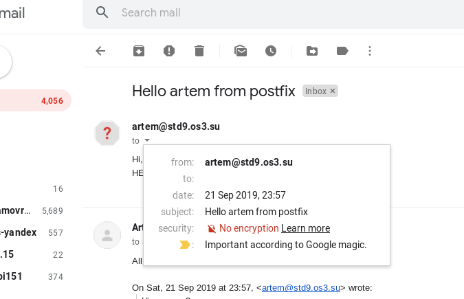

Certificates were generated with  `postfix tls new-server-cert`:

```
$ sudo postfix tls new-server-cert
postfix/postfix-tls-script: New private key and self-signed certificate created. To deploy run:
postfix/postfix-tls-script:   # postfix tls deploy-server-cert /etc/postfix/cert-20190930-154622.pem /etc/postfix/key-20190930-154622.pem
postfix/postfix-tls-script: To generate a CSR run:
postfix/postfix-tls-script:   # postfix tls output-server-csr -k /etc/postfix/key-20190930-154622.pem [<hostname> ...]
postfix/postfix-tls-script: Save the signed certificate chain in /etc/postfix/cert-20190930-154622.pem, and deploy as above.
postfix/postfix-tls-script: To generate TLSA records run:
postfix/postfix-tls-script:   # postfix tls output-server-tlsa [-h <hostname>] /etc/postfix/key-20190930-154622.pem
```

Then I moved the `/etc/postfix/cert-20190930-154622.pem` and `/etc/postfix/key-20190930-154622.pem`  to the `/etc/ssl/certs/` directory. I also renamed them to `ssl-cert-snakeoil.pem` and `ssl-cert-snakeoil.key`. I did this because I was following a guide.

The next step is to enable opportunistic client encryption with STARTTLS:

```
$ sudo postfix tls enable-client
postfix/postfix-tls-script: *** Non-default SMTP client TLS settings detected, no changes made.
postfix/postfix-tls-script: For opportunistic TLS in the Postfix SMTP client, the below settings
postfix/postfix-tls-script: are typical:
postfix/postfix-tls-script:   smtp_tls_security_level = may
postfix/postfix-tls-script:   smtp_tls_loglevel = 1
postfix/postfix-tls-script:   smtp_tls_session_cache_database = btree:${data_directory}/smtp_scache
```

The command tells me that I have non standard configuration, therefore I had to copy the settings to my configuration file `main.cf` by hand.

Then enable opportunistic server encryption:

```
$ sudo postfix tls enable-server
postfix/postfix-tls-script: *** Non-default SMTP server TLS settings detected, no changes made.
postfix/postfix-tls-script: For opportunistic TLS in the Postfix SMTP server, the below settings
postfix/postfix-tls-script: are typical:
postfix/postfix-tls-script:   smtpd_tls_security_level = may
postfix/postfix-tls-script:   smtpd_tls_loglevel = 1
postfix/postfix-tls-script: You can use "postfix tls new-server-cert" to create a new certificate.
postfix/postfix-tls-script: Or, "postfix tls new-server-key" to also force a new private key.
postfix/postfix-tls-script: If you publish DANE TLSA records, see:
postfix/postfix-tls-script:   https://tools.ietf.org/html/rfc7671#section-8
postfix/postfix-tls-script:   https://tools.ietf.org/html/rfc7671#section-5.1
postfix/postfix-tls-script:   https://tools.ietf.org/html/rfc7671#section-5.2
postfix/postfix-tls-script:   https://community.letsencrypt.org/t/please-avoid-3-0-1-and-3-0-2-dane-tlsa-records-with-le-certificates/7022
```

This command also tells me that I have non standard configuration, therefore I also had to copy the settings to my configuration file `main.cf` by hand.

Below is the summary of what was added to my postfix configuration `/etc/postfix/main.cfg` :

```
# TLS parameters
# See TLS_README for SSL in smtp
smtpd_tls_cert_file=/etc/ssl/certs/ssl-cert-snakeoil.pem
smtpd_tls_key_file=/etc/ssl/private/ssl-cert-snakeoil.key
smtpd_tls_session_cache_database = btree:${data_directory}/smtpd_scache
smtpd_tls_security_level = may
smtpd_tls_loglevel = 1

smtp_tls_session_cache_database = btree:/var/lib/postfix/smtp_scache
smtp_tls_security_level = may
smtp_tls_loglevel = 1

tls_random_source = dev:/dev/urandom
```

Reload postfix with:

```
$ sudo postfix reload
```

Check for encryption by sending email to gmail:

```
artem@ etc$ telnet localhost 25
Trying 127.0.0.1...
Connected to localhost.
Escape character is '^]'.
220 mail.std9.os3.su ESMTP Postfix
ehlo std9.os3.su
250-mail.std9.os3.su
250-PIPELINING
250-SIZE 10240000
250-VRFY
250-ETRN
250-STARTTLS
250-ENHANCEDSTATUSCODES
250-8BITMIME
250-DSN
250 SMTPUTF8
mail from: artem@std9.os3.su
250 2.1.0 Ok
rcpt tp: tematibr@gmail.com
501 5.5.4 Syntax: RCPT TO:<address>
rcpt to: tematibr@gmail.com
250 2.1.5 Ok
data
354 End data with <CR><LF>.<CR><LF>
Subject: test TLS 1

Is this encrypted?
.
250 2.0.0 Ok: queued as 0F039B616AC
^]
telnet> q
Connection closed.
```

Indeed encryption is present!

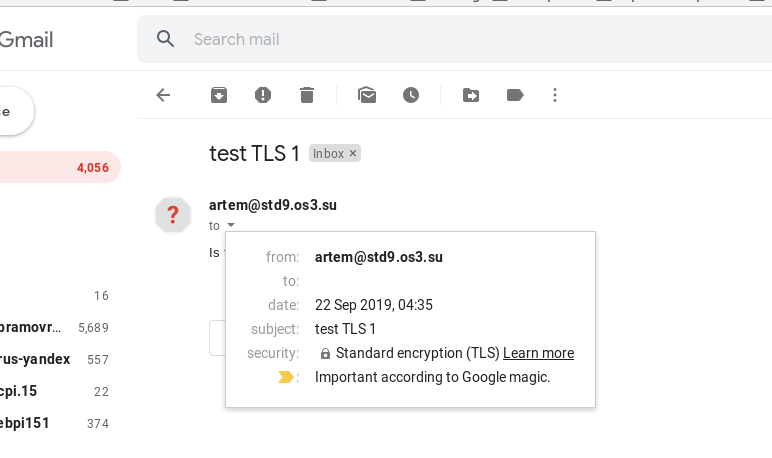


However note that in this case the interaction between the MUA (telnet) and the postfix server was NOT encrypted. This is ok, because the localhost interface was used.

source: http://www.postfix.org/TLS_README.html

### Eventually force the transport to be encrypted only (refuse non encrypted transport)

Note that RFC 3207 (published in 2002) states that:
```
A publicly-referenced SMTP server MUST NOT require use of the
STARTTLS extension in order to deliver mail locally. This rule
prevents the STARTTLS extension from damaging the interoperability of
the Internet's SMTP infrastructure.  
```

This is also mentioned in postfix configuration manual: http://www.postfix.org/postconf.5.html#smtpd_tls_security_level.

However the more recent RFC 8314 (published in 2018) that was already discussed above, specifically advises using Implicit TLS between MUA and mail server.

To force encryption (but there is NO authentication performed) the postfix configuration must be changed with the following config:
```
smtpd_tls_security_level = encrypt
smtp_tls_security_level = encrypt
```

The full config is shown below:

```
$ cat /etc/postfix/main.cf
myorigin = $mydomain
mydestination = $mydomain, www.$mydomain, mail.$mydomain, lab.$mydomain, $myhostname, artem-209-HP-EliteDesk-800-G1-SFF, localhost.localdomain, localhost
mynetworks_style = host
relayhost = 
myhostname = mail.std9.os3.su
inet_interfaces = all
smtpd_banner = $myhostname ESMTP $mail_name
biff = no
# TLS parameters
# See TLS_README for SSL in smtp
smtpd_tls_cert_file=/etc/ssl/certs/ssl-cert-snakeoil.pem
smtpd_tls_key_file=/etc/ssl/private/ssl-cert-snakeoil.key
smtpd_tls_session_cache_database = btree:${data_directory}/smtpd_scache
smtpd_tls_security_level = encrypt
smtpd_tls_loglevel = 1

smtp_tls_session_cache_database = btree:/var/lib/postfix/smtp_scache
smtp_tls_security_level = encrypt
smtp_tls_loglevel = 1

tls_random_source = dev:/dev/urandom

append_dot_mydomain = no
readme_directory = no
compatibility_level = 2
smtpd_relay_restrictions = permit_mynetworks permit_sasl_authenticated defer_unauth_destination
virtual_alias_maps = hash:/etc/virtual
virtual_alias_domains = subdom.std9.os3.su
alias_maps = hash:/etc/aliases
alias_database = hash:/etc/aliases
mailbox_size_limit = 0
recipient_delimiter = +
inet_protocols = all
```

Reload postfix with:

```
$ sudo postfix reload
```


### Proceed with validation (proof or acceptance testing ), as usual.

Test that the server now refuses to communicate until the client sends  a STARTTLS command (even though this is localhost): 
```
artem@ ~$ telnet localhost 25
Trying 127.0.0.1...
Connected to localhost.
Escape character is '^]'.
220 mail.std9.os3.su ESMTP Postfix
ehlo std9.os3.su
250-mail.std9.os3.su
250-PIPELINING
250-SIZE 10240000
250-VRFY
250-ETRN
250-STARTTLS
250-ENHANCEDSTATUSCODES
250-8BITMIME
250-DSN
250 SMTPUTF8
mail to: tematibr@gmail.com
530 5.7.0 Must issue a STARTTLS command first
mail from: artem@std9.os3.su
530 5.7.0 Must issue a STARTTLS command first
^]
telnet> q
Connection closed.
```

However when trying to start a TLS session in telnet, the connection is abruptly terminated by the server (because `telnet` does not support encryption). This is shown below:
```
artem@ ~$ telnet localhost 25
Trying 127.0.0.1...
Connected to localhost.
Escape character is '^]'.
220 mail.std9.os3.su ESMTP Postfix
ehlo std9.os3.su
250-mail.std9.os3.su
250-PIPELINING
250-SIZE 10240000
250-VRFY
250-ETRN
250-STARTTLS
250-ENHANCEDSTATUSCODES
250-8BITMIME
250-DSN
250 SMTPUTF8
STARTTLS
220 2.0.0 Ready to start TLS
mail from: artem@std9.os3.su
Connection closed by foreign host.
```

To debug, test and verify postfix mail see the official debugging tips: http://www.postfix.org/ADDRESS_REWRITING_README.html#debugging

Therefore to test sending and receiving mail I will use another MUA that supports TLS. Unfortunately finding an adequate MUA proved more of a challenge than expected. (At this point I did not know about the `swaks` utility, I only discovered it when doing task 6)
1.	sendmail had some issue with TLS that I did not manage to resolve
2.	mailx (from `mailutils` package) was painful to use after the simplicity of telnet
3.	Thunderbird requiered that either IMAP or POP3 be configured. This meant installing and configuring yet another server to serve IMAP/POP3 such as Dovecot. I did not like this complexity.

Finally I remembered about the  `smtplib` supplied with python3. The script below replaces telnet and provides the necessary STARTTLS support:
```python
import smtplib

def prompt(prompt):
    return input(prompt).strip()

fromaddr = prompt("From: ")
toaddrs  = prompt("To: ").split()
print("Enter message, end with ^D:")

# Add the From: and To: headers at the start!
msg = ("From: %s\r\nTo: %s\r\n\r\n"
       % (fromaddr, ", ".join(toaddrs)))
while True:
    try:
        line = input()
    except EOFError:
        break
    if not line:
        break
    msg = msg + line

print("Message length is", len(msg))

server = smtplib.SMTP('mail.std9.os3.su')
server.set_debuglevel(2)
server.ehlo()
server.starttls()
server.sendmail(fromaddr, toaddrs, msg)
server.quit()
```

The original script is taken from the python docs for `smtplib` and slightly modified by me.
source: https://docs.python.org/3/library/smtplib.html

Below is a session sending email from std9.os3.su to my gmail account:

```
artem@ ~$ python3 mailsubmit.py 
From: admin@mail.std9.os3.su 
To: tematibr@gmail.com
Enter message, end with ^D:
Subject: Testing TSL encryption all the way!

Message length is 100
send: 'ehlo [127.0.1.1]\r\n'
reply: b'250-mail.std9.os3.su\r\n'
reply: b'250-PIPELINING\r\n'
reply: b'250-SIZE 10240000\r\n'
reply: b'250-VRFY\r\n'
reply: b'250-ETRN\r\n'
reply: b'250-STARTTLS\r\n'
reply: b'250-ENHANCEDSTATUSCODES\r\n'
reply: b'250-8BITMIME\r\n'
reply: b'250-DSN\r\n'
reply: b'250 SMTPUTF8\r\n'
reply: retcode (250); Msg: b'mail.std9.os3.su\nPIPELINING\nSIZE 10240000\nVRFY\nETRN\nSTARTTLS\nENHANCEDSTATUSCODES\n8BITMIME\nDSN\nSMTPUTF8'
send: 'STARTTLS\r\n'
reply: b'220 2.0.0 Ready to start TLS\r\n'
reply: retcode (220); Msg: b'2.0.0 Ready to start TLS'
send: 'ehlo [127.0.1.1]\r\n'
reply: b'250-mail.std9.os3.su\r\n'
reply: b'250-PIPELINING\r\n'
reply: b'250-SIZE 10240000\r\n'
reply: b'250-VRFY\r\n'
reply: b'250-ETRN\r\n'
reply: b'250-ENHANCEDSTATUSCODES\r\n'
reply: b'250-8BITMIME\r\n'
reply: b'250-DSN\r\n'
reply: b'250 SMTPUTF8\r\n'
reply: retcode (250); Msg: b'mail.std9.os3.su\nPIPELINING\nSIZE 10240000\nVRFY\nETRN\nENHANCEDSTATUSCODES\n8BITMIME\nDSN\nSMTPUTF8'
send: 'mail FROM:<admin@mail.std9.os3.su> size=100\r\n'
reply: b'250 2.1.0 Ok\r\n'
reply: retcode (250); Msg: b'2.1.0 Ok'
send: 'rcpt TO:<tematibr@gmail.com>\r\n'
reply: b'250 2.1.5 Ok\r\n'
reply: retcode (250); Msg: b'2.1.5 Ok'
send: 'data\r\n'
reply: b'354 End data with <CR><LF>.<CR><LF>\r\n'
reply: retcode (354); Msg: b'End data with <CR><LF>.<CR><LF>'
data: (354, b'End data with <CR><LF>.<CR><LF>')
send: b'From: admin@mail.std9.os3.su\r\nTo: tematibr@gmail.com\r\n\r\nSubject: Testing TSL encryption all the way!\r\n.\r\n'
reply: b'250 2.0.0 Ok: queued as E1E78B61492\r\n'
reply: retcode (250); Msg: b'2.0.0 Ok: queued as E1E78B61492'
data: (250, b'2.0.0 Ok: queued as E1E78B61492')
send: 'quit\r\n'
reply: b'221 2.0.0 Bye\r\n'
reply: retcode (221); Msg: b'2.0.0 Bye'
```

The resulting email in my gmail account is shown below:

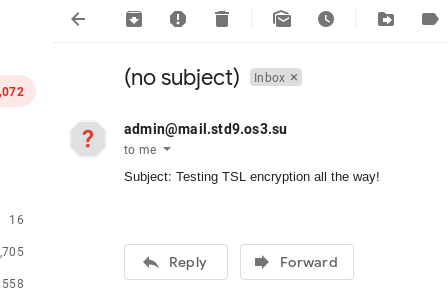


The raw data received by gmail is below:

```
Delivered-To: tematibr@gmail.com
Received: by 2002:ac2:515c:0:0:0:0:0 with SMTP id q28csp1242130lfd;
        Wed, 25 Sep 2019 14:13:34 -0700 (PDT)
X-Google-Smtp-Source: APXvYqwzg7ZSy911SvMHVHiNOeY2O0Ic5fnclffbf0MEeUKja/jf73nPdKt1NtoC1QJ7miwQ4LoE
X-Received: by 2002:a19:6549:: with SMTP id c9mr25894lfj.99.1569446014322;
        Wed, 25 Sep 2019 14:13:34 -0700 (PDT)
ARC-Seal: i=1; a=rsa-sha256; t=1569446014; cv=none;
        d=google.com; s=arc-20160816;
        b=WeX+mq1IhoWujpyiaWlMHhi9ipUTFXqOcogWf/1UYjVWlmIOzNz1e2xxyFnJECkJTG
         A2307C4LdcIhG9ghkxqONxuY69dzS+HYvtAmSjjM8KvvPZ6mhPzkNNHRK5cLcOLUXcfH
         Pw3mjv3L7xnP44qhl07cAodN3Cnt4m1kLU/DK9J/kFFvheSEweZvl7o9H9kv/41P+E0O
         PKnlJteKm7qQv1Ox8Zt5Xr8hrmuwQxSbI+UcaKal5oK/xRky9awyeLU/I7X/Zuu16/zO
         EuddycMXMJdZ+cbTNmS9fNTHqhZilZMaGH3eroVyM2+7Ueu0OQkxUVh1RF2DhV1Y/Sa3
         d+GA==
ARC-Message-Signature: i=1; a=rsa-sha256; c=relaxed/relaxed; d=google.com; s=arc-20160816;
        h=date:message-id:to:from;
        bh=2QeYaY3Oj+LXAlCvyU4LUeLSjavARD/dzQC7VgbU1V0=;
        b=wvaDBAOvniD3KAn7OH1xkpZFGv62FoZQgHbuJrNW4WA0MCUHaZrD9WM6y+1TWVd/H+
         rR8m41961rbvurCBAEXN6hhLlJcrN8TTD5mdp/FM9P6Br5XBk/Me+pHkZ9toSU3dqPID
         nu2d7Hm6VorPhTAWFRWvaijG2yRUoYpAWLfQn0q52b4dxSeH5Uopu/s0q61Tzs1k6lZb
         2SDXdneYW8nMuzEp6WstqeHo6a/oxg8REfInlaOVbPhCAtF9CmRjeiVCE28gXpVeSLOz
         8OGeiGD98KN0m+dHkJs2LLPqrwm2Ht/W5gnez18k0V4TljR0lzBeoMnQtrQhsy18RA0f
         ztdg==
ARC-Authentication-Results: i=1; mx.google.com;
       spf=neutral (google.com: 188.130.155.42 is neither permitted nor denied by best guess record for domain of admin@mail.std9.os3.su) smtp.mailfrom=admin@mail.std9.os3.su
Return-Path: <admin@mail.std9.os3.su>
Received: from mail.std9.os3.su ([188.130.155.42])
        by mx.google.com with ESMTPS id q30si58484lfd.108.2019.09.25.14.13.33
        for <tematibr@gmail.com>
        (version=TLS1_3 cipher=TLS_AES_256_GCM_SHA384 bits=256/256);
        Wed, 25 Sep 2019 14:13:33 -0700 (PDT)
Received-SPF: neutral (google.com: 188.130.155.42 is neither permitted nor denied by best guess record for domain of admin@mail.std9.os3.su) client-ip=188.130.155.42;
Authentication-Results: mx.google.com;
       spf=neutral (google.com: 188.130.155.42 is neither permitted nor denied by best guess record for domain of admin@mail.std9.os3.su) smtp.mailfrom=admin@mail.std9.os3.su
Received: from [127.0.1.1] (unknown [188.130.155.42]) by mail.std9.os3.su (Postfix) with ESMTPS id E1E78B61492 for <tematibr@gmail.com>; Thu, 26 Sep 2019 00:13:32 +0300 (MSK)
From: admin@mail.std9.os3.su
To: tematibr@gmail.com
Message-Id: <20190925211332.E1E78B61492@mail.std9.os3.su>
Date: Thu, 26 Sep 2019 00:13:32 +0300 (MSK)

Subject: Testing TSL encryption all the way!
```


Now lets verify that the TLS is enforced, comment the `server.starttls()` call in the python script and run again as shown below:

```
artem@ ~$ python3 mailsubmit.py 
From: admin@mail.std9.os3.su
To: tematibr@gmail.com
Enter message, end with ^D:
Subject: hello admin!

Message length is 77
send: 'ehlo [127.0.1.1]\r\n'
reply: b'250-mail.std9.os3.su\r\n'
reply: b'250-PIPELINING\r\n'
reply: b'250-SIZE 10240000\r\n'
reply: b'250-VRFY\r\n'
reply: b'250-ETRN\r\n'
reply: b'250-STARTTLS\r\n'
reply: b'250-ENHANCEDSTATUSCODES\r\n'
reply: b'250-8BITMIME\r\n'
reply: b'250-DSN\r\n'
reply: b'250 SMTPUTF8\r\n'
reply: retcode (250); Msg: b'mail.std9.os3.su\nPIPELINING\nSIZE 10240000\nVRFY\nETRN\nSTARTTLS\nENHANCEDSTATUSCODES\n8BITMIME\nDSN\nSMTPUTF8'
send: 'mail FROM:<admin@mail.std9.os3.su> size=77\r\n'
reply: b'530 5.7.0 Must issue a STARTTLS command first\r\n'
reply: retcode (530); Msg: b'5.7.0 Must issue a STARTTLS command first'
send: 'rset\r\n'
reply: b'530 5.7.0 Must issue a STARTTLS command first\r\n'
reply: retcode (530); Msg: b'5.7.0 Must issue a STARTTLS command first'
Traceback (most recent call last):
  File "mailsubmit.py", line 28, in <module>
    server.sendmail(fromaddr, toaddrs, msg)
  File "/usr/lib/python3.6/smtplib.py", line 867, in sendmail
    raise SMTPSenderRefused(code, resp, from_addr)
smtplib.SMTPSenderRefused: (530, b'5.7.0 Must issue a STARTTLS command first', 'admin@mail.std9.os3.su')
```

Indeed, the client gets rejected by the postfix server.


source: https://serverfault.com/questions/971517/postfix-combinations-of-tls-starttls-and-ports-465-587


## Task 6 - SPF & DKIM

Both SPF and DKIM are mechanisms to provide authentication for emails. 

SPF addresses the problem that existing protocols place no restriction on how the sending server defines the return-path of the message. Furthermore the domain that gets passed to the SMTP EHLO command can also be anything the sending server wishes, because it is not verified. To solve this SPF allows domain owners to advertise the list of IP addresses that can send email from the domain. You do not have to use any additional software to publish the SPF policy and therefore this procedure is extremely simple: add a single TXT record containing the policy to the DNS zone. The receiving server can discover the domain of the sender (by looking at the `Return-Path`  of the email and extracting the domain), then the receiving server can query the TXT record with SPF information from the master DNS server for that domain. The last step is parsing SPF information to check if the sender's IP address is listed there. If it is listed, then email passes SPF verification. However SPF makes no effort for verify  the `From` field (that must be handled with DMARC). Finally, even if a message fails SPF check, it might still get delivered. The specification is not strict and not perfect, thus some providers choose to deliver email anyway. 

DKIM is based around signing the email (not encrypting it) and providing the public key via DNS. This can verify that the message was not altered during transit, furthermore because the email signature can be verified by a single public key, it allows to verify the authenticity of the email.  Because each sender can be uniquely identified theoretically the ISPs can use your email statistics to build a reputation for your domain. If the postmaster follows the best practices: low spam and bounces, this can help improve trust with the ISPs. The downside is that the DNS must be kept in sync with the keys, especially if there are multiple mail servers (in an organization).

Neither DKIM and SPF provide encryption. Both should be implemented together with DNSSEC, otherwise DNS records can be forged (SPF records that declare authorized servers and DKIM records that declare the public key).

Short overview of SPF is below:

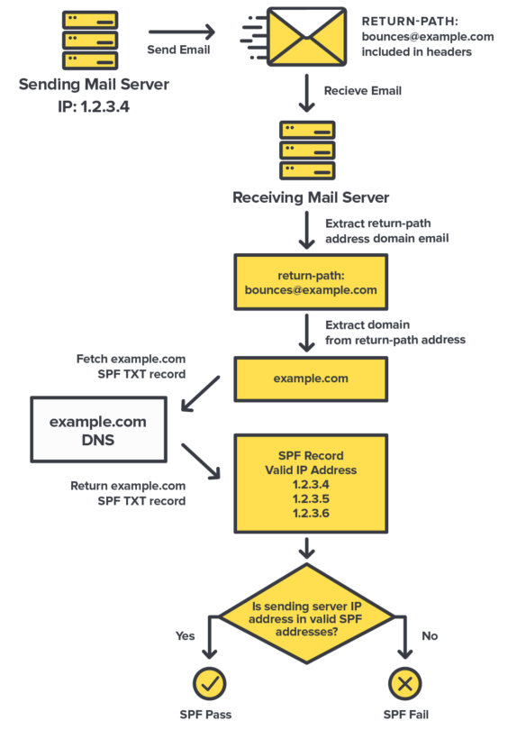


sources:

1. Short overview of email security mechanisms: https://www.uriports.com/blog/email-security-explained/
2. https://hackernoon.com/myths-and-legends-of-spf-d17919a9e817
3. https://security.stackexchange.com/questions/218140/why-do-we-need-dkim-to-be-used-along-with-s-mime


**What would you choose at a first glance and why?**

I would choose DKIM. SPF seems to be a very rudimentary security mechanism. It does not protect the `From` field which is what the end user actually sees. It is not clear how would it protect against simple IP spoofing, because SPF provides no way to verify integrity.


**Implementing DKIM**

Install DKIM tools:

```
$ sudo apt-get install opendkim opendkim-tools
```

Currently postfix encrypts the emails according to the configuration extract below:
```
smtpd_tls_cert_file=/etc/ssl/certs/ssl-cert-snakeoil.pem
smtpd_tls_key_file=/etc/ssl/private/ssl-cert-snakeoil.key
smtpd_tls_security_level = encrypt
```
It uses the private key at `/etc/ssl/private/ssl-cert-snakeoil.key` and the certificate `/etc/ssl/certs/ssl-cert-snakeoil.pem`. 

Postfix works with OpenDKIM via the `milter` (mail filter) protocol ( http://www.postfix.org/MILTER_README.html). Postfix submits mail to the email filter before actually queing it. Postfix also has a `Before-Queue` content filter described here (http://www.postfix.org/SMTPD_PROXY_README.html), but for this task I used the `milter` approach.

To simplify the setup I will generate a separate key to be used with OpenDKIM. The details of 
key management for OpenDKIM are described in `/etc/dkimkeys/README.PrivateKeys` after installing the package from the repository. 

Key generation is shown below:
```
# cd /etc/dkimkeys
# opendkim-genkey -t -s mail -d std9.os3.su
```

The two  resulting files are shown below:
```
# ll
total 28
drwx------   2 opendkim opendkim  4096 Sep 27 06:43 ./
drwxr-xr-x 154 root     root     12288 Sep 27 06:32 ../
-rw-------   1 root     root      1679 Sep 27 06:43 mail.private
-rw-------   1 root     root       506 Sep 27 06:43 mail.txt
-rw-r--r--   1 root     root       664 Nov  7  2015 README.PrivateKeys
```

The mail.txt contains the record that should be added to the DNS zone. This will be setup later.

Edit the configuration in `/etc/opendkim.conf` as shown below:
```
Syslog					yes
UMask					007
Domain					std9.os3.su
KeyFile					/etc/dkimkeys/mail.private
Selector				mail
Socket                  inet:8891@localhost
PidFile               	/var/run/opendkim/opendkim.pid
OversignHeaders			From
TrustAnchorFile       	/usr/share/dns/root.key
UserID                	opendkim
```

Its interesting that `OpenDKIM` package uses `unbound` to verify the DNS response according to the DNSSEC. 

Must also edit the `/etc/default/opendkim`, because it confusingly specifies default values the OVERRIDE what is provided in the `/etc/opendkim.conf`

The resulting `/etc/default/opendkim` is shown below:

```
# Command-line options specified here will override the contents of
# /etc/opendkim.conf. See opendkim(8) for a complete list of options.
#DAEMON_OPTS=""
# Change to /var/spool/postfix/var/run/opendkim to use a Unix socket with
# postfix in a chroot:
#RUNDIR=/var/spool/postfix/var/run/opendkim
RUNDIR=/var/run/opendkim
#
# Uncomment to specify an alternate socket
# Note that setting this will override any Socket value in opendkim.conf
# default:
#SOCKET=local:$RUNDIR/opendkim.sock
# listen on all interfaces on port 54321:
#SOCKET=inet:54321
# listen on loopback on port 12345:
#SOCKET=inet:12345@localhost
# listen on 192.0.2.1 on port 12345:
#SOCKET=inet:12345@192.0.2.1
USER=opendkim
GROUP=opendkim
PIDFILE=$RUNDIR/$NAME.pid
EXTRAAFTER=
```

Alter postfix configuration by adding the following to `/etc/postfix/main.cf`:

```
smtpd_milters = inet:localhost:8891
non_smtpd_milters = $smtpd_milters
milter_default_action = accept
```

Note to pay extra attention to the `milter_protocol` variable, I omitted it (i.e. used the default) and it worked, but check the documentation here: http://www.postfix.org/MILTER_README.html

To setup the DNS records view content of mail.txt created when generating DKIM key:
```
# cat mail.txt 
mail._domainkey	IN	TXT	( "v=DKIM1; h=sha256; k=rsa; t=y; "
	  "p=MIIBIjANBgkqhkiG9w0BAQEFAAOCAQ8AMIIBCgKCAQEAx3I/m/OcpD5i9dd1cfoFugnVKEuJD3e+BF/nx1bx3s5HPZ9rWFzeT+sllPnE2vaGoB3RRVyB4l9F7pm/UP5ivlDeH8sIvercqwMEDY8TvqJS7Wa8xH8wJHEQ2sGZ0YxGOEzAa76T2tF16cf/V++x0Snzzak1q8A1xt2MGlCEnAOS5Vh0lBtykHg2oihwl+yFtwa93w/xzPeRjB"
	  "G5y0ddK10aURWeQMgAVnAf/7bqA7YkujyOVQuHRx1XtNkZe+IZxhTVhFMS2ii/UZrvo+Fbo92B98OConORmyJwrWt6jul0Th9AFdB3LMRhhv72y7g5mpwDFT08eqjqABSIWb/WTwIDAQAB" )  ; ----- DKIM key mail for std9.os3.su
```

To modify the DNS records follow the same steps that were used to add and re-sign the record when adding a subdomain for email in Task 4 of this lab.

Edit existing `std9.os3.su.zone.signed` to add the record to the end. Then update the serial number and check format with:

```
# ldns-read-zone -S YYYYMMDDxx std9.os3.su.zone.signed > std9.os3.su.zone
```

Check the contents:
```
# cat std9.os3.su.zone
std9.os3.su.	3600	IN	SOA	ns0.std9.os3.su. admin.std9.os3.su. 2019092701 10800 3600 604800 38400
www.std9.os3.su.	3600	IN	CNAME	notes.std9.os3.su.
tst.std9.os3.su.	3600	IN	AAAA	2400:6180:100:d0::8c4:9001
tst.std9.os3.su.	3600	IN	A	68.183.92.166
subdom.std9.os3.su.	3600	IN	NS	ns0.std9.os3.su.
mail._domainkey.std9.os3.su.	3600	IN	TXT	"v=DKIM1; h=sha256; k=rsa; t=y; " "p=MIIBIjANBgkqhkiG9w0BAQEFAAOCAQ8AMIIBCgKCAQEAx3I/m/OcpD5i9dd1cfoFugnVKEuJD3e+BF/nx1bx3s5HPZ9rWFzeT+sllPnE2vaGoB3RRVyB4l9F7pm/UP5ivlDeH8sIvercqwMEDY8TvqJS7Wa8xH8wJHEQ2sGZ0YxGOEzAa76T2tF16cf/V++x0Snzzak1q8A1xt2MGlCEnAOS5Vh0lBtykHg2oihwl+yFtwa93w/xzPeRjB" "G5y0ddK10aURWeQMgAVnAf/7bqA7YkujyOVQuHRx1XtNkZe+IZxhTVhFMS2ii/UZrvo+Fbo92B98OConORmyJwrWt6jul0Th9AFdB3LMRhhv72y7g5mpwDFT08eqjqABSIWb/WTwIDAQAB"
ns0.std9.os3.su.	3600	IN	A	188.130.155.42
notes.std9.os3.su.	3600	IN	CNAME	temach.github.io.
_25._tcp.mail.std9.os3.su.	3600	IN	TLSA	3 0 1 dd1a910a046a841b553f0bc42d7789554e1679a2307f367aa5685eb3dc72180f
mail.std9.os3.su.	3600	IN	A	188.130.155.42
lab.std9.os3.su.	3600	IN	A	188.130.155.42
ansible.std9.os3.su.	3600	IN	AAAA	2a00:b700::6:220
ansible.std9.os3.su.	3600	IN	A	185.22.153.49
_25._tcp.std9.os3.su.	3600	IN	TLSA	3 0 1 dd1a910a046a841b553f0bc42d7789554e1679a2307f367aa5685eb3dc72180f
std9.os3.su.	3600	IN	DNSKEY	257 3 13 ZP8yUKKmSdi8H03m2Pzynh8nTyis1LV72Bmf+ZBbdS0/bBoVIVIBEJ3uYPGMoOlu7kbybMNfLRW1kKRvb6Gv5g== ;{id = 59198 (ksk), size = 256b}
std9.os3.su.	3600	IN	DNSKEY	256 3 13 tMVV1aZA+72bTZUh53xB12Xl/dsxcGR5W/aIeZ3+rzSceq3WT88CitEzzcaC8dwcJ2jtZlFXmDRGnf55f6RgVw== ;{id = 62425 (zsk), size = 256b}
std9.os3.su.	3600	IN	MX	10 mail.std9.os3.su.
std9.os3.su.	3600	IN	NS	ns0.std9.os3.su.
```

Sign the zone again:
```
# ldns-signzone -e $(date -d "1 month 2 days" "+%Y%m%d") std9.os3.su.zone Kstd9.os3.su.+013+59198 Kstd9.os3.su.+013+62425
```

Check that new records were added (extract from the signed zone file):
```
mail._domainkey.std9.os3.su.	3600	IN	TXT	"v=DKIM1; h=sha256; k=rsa; t=y; " "p=MIIBIjANBgkqhkiG9w0BAQEFAAOCAQ8AMIIBCgKCAQEAx3I/m/OcpD5i9dd1cfoFugnVKEuJD3e+BF/nx1bx3s5HPZ9rWFzeT+sllPnE2vaGoB3RRVyB4l9F7pm/UP5ivlDeH8sIvercqwMEDY8TvqJS7Wa8xH8wJHEQ2sGZ0YxGOEzAa76T2tF16cf/V++x0Snzzak1q8A1xt2MGlCEnAOS5Vh0lBtykHg2oihwl+yFtwa93w/xzPeRjB" "G5y0ddK10aURWeQMgAVnAf/7bqA7YkujyOVQuHRx1XtNkZe+IZxhTVhFMS2ii/UZrvo+Fbo92B98OConORmyJwrWt6jul0Th9AFdB3LMRhhv72y7g5mpwDFT08eqjqABSIWb/WTwIDAQAB"
mail._domainkey.std9.os3.su.	3600	IN	RRSIG	TXT 13 5 3600 20191029000000 20190927035909 62425 std9.os3.su. IiuHWz9wF7kq0U2yFqKan77yXDhBzlbiUL4R1SVuwoggzs7FNcQlWwZUn6M8gLBR+y1AoS5eQO8jLpbfiByXdQ==
mail._domainkey.std9.os3.su.	38400	IN	NSEC	_25._tcp.std9.os3.su. TXT RRSIG NSEC 
mail._domainkey.std9.os3.su.	38400	IN	RRSIG	NSEC 13 5 38400 20191029000000 20190927035909 62425 std9.os3.su. 5vN7gWZDHeUqUDYZ5/XIUY+gTIIX2J+CXF6YOTNcrAQ0rTygEoJaLhz7V5xOQAUVEOPnCHV9kJj7r9VD+tX56A==
```


Restart NSD.  Check records:
```
$ dig txt +dnssec mail._domainkey.std9.os3.su.

; <<>> DiG 9.11.3-1ubuntu1.8-Ubuntu <<>> txt +dnssec mail._domainkey.std9.os3.su.
;; global options: +cmd
;; Got answer:
;; ->>HEADER<<- opcode: QUERY, status: NOERROR, id: 34352
;; flags: qr rd ra ad; QUERY: 1, ANSWER: 2, AUTHORITY: 0, ADDITIONAL: 1

;; OPT PSEUDOSECTION:
; EDNS: version: 0, flags: do; udp: 512
;; QUESTION SECTION:
;mail._domainkey.std9.os3.su.	IN	TXT

;; ANSWER SECTION:
mail._domainkey.std9.os3.su. 3599 IN	TXT	"v=DKIM1; h=sha256; k=rsa; t=y; " "p=MIIBIjANBgkqhkiG9w0BAQEFAAOCAQ8AMIIBCgKCAQEAx3I/m/OcpD5i9dd1cfoFugnVKEuJD3e+BF/nx1bx3s5HPZ9rWFzeT+sllPnE2vaGoB3RRVyB4l9F7pm/UP5ivlDeH8sIvercqwMEDY8TvqJS7Wa8xH8wJHEQ2sGZ0YxGOEzAa76T2tF16cf/V++x0Snzzak1q8A1xt2MGlCEnAOS5Vh0lBtykHg2oihwl+yFtwa93w/xzPeRjB" "G5y0ddK10aURWeQMgAVnAf/7bqA7YkujyOVQuHRx1XtNkZe+IZxhTVhFMS2ii/UZrvo+Fbo92B98OConORmyJwrWt6jul0Th9AFdB3LMRhhv72y7g5mpwDFT08eqjqABSIWb/WTwIDAQAB"
mail._domainkey.std9.os3.su. 3599 IN	RRSIG	TXT 13 5 3600 20191029000000 20190927035909 62425 std9.os3.su. IiuHWz9wF7kq0U2yFqKan77yXDhBzlbiUL4R1SVuwoggzs7FNcQlWwZU n6M8gLBR+y1AoS5eQO8jLpbfiByXdQ==

;; Query time: 64 msec
;; SERVER: 8.8.8.8#53(8.8.8.8)
;; WHEN: Fri Sep 27 07:07:18 MSK 2019
;; MSG SIZE  rcvd: 603
```

Finally start dkim and restart postfix:
```
systemctl restart opendkim
sudo postfix reload 
```

To test this setup the python script was insufficient. I decided to use `swaks` which is a great tool for testing mail servers. 
1. Official documentation: https://www.jetmore.org/john/code/swaks/latest/doc/ref.txt
2. https://easyengine.io/tutorials/mail/swaks-smtp-test-tool/

Sending email to gmail with swaks is shown below:

```
$ swaks --to tematibr@gmail.com --protocol ESMTPS --from admin@std9.os3.su --ehlo mail.std9.os3.su --server mail.std9.os3.su
=== Trying mail.std9.os3.su:25...
=== Connected to mail.std9.os3.su.
<-  220 mail.std9.os3.su ESMTP Postfix
 -> EHLO mail.std9.os3.su
<-  250-mail.std9.os3.su
<-  250-PIPELINING
<-  250-SIZE 10240000
<-  250-VRFY
<-  250-ETRN
<-  250-STARTTLS
<-  250-ENHANCEDSTATUSCODES
<-  250-8BITMIME
<-  250-DSN
<-  250 SMTPUTF8
 -> STARTTLS
<-  220 2.0.0 Ready to start TLS
=== TLS started with cipher UNKNOWN(0x0304):TLS_AES_256_GCM_SHA384:256
=== TLS no local certificate set
=== TLS peer DN="/CN=ubuntu"
 ~> EHLO mail.std9.os3.su
<~  250-mail.std9.os3.su
<~  250-PIPELINING
<~  250-SIZE 10240000
<~  250-VRFY
<~  250-ETRN
<~  250-ENHANCEDSTATUSCODES
<~  250-8BITMIME
<~  250-DSN
<~  250 SMTPUTF8
 ~> MAIL FROM:<admin@std9.os3.su>
<~  250 2.1.0 Ok
 ~> RCPT TO:<tematibr@gmail.com>
<~  250 2.1.5 Ok
 ~> DATA
<~  354 End data with <CR><LF>.<CR><LF>
 ~> Date: Sun, 29 Sep 2019 14:03:08 +0300
 ~> To: tematibr@gmail.com
 ~> From: admin@std9.os3.su
 ~> Subject: test Sun, 29 Sep 2019 14:03:08 +0300
 ~> Message-Id: <20190929140308.009470@artem-209-HP-EliteDesk-800-G1-SFF>
 ~> X-Mailer: swaks v20170101.0 jetmore.org/john/code/swaks/
 ~> 
 ~> This is a test mailing
 ~> 
 ~> .
<~  250 2.0.0 Ok: queued as D7388B614AA
 ~> QUIT
<~  221 2.0.0 Bye
=== Connection closed with remote host.
```

Below is shown the interaction between swaks (port 53024), postfix (port 25 and port 49550) and OpenDKIM (port 8892) that was captured by wireshark on localhost:

![Capturing from Loopback: lo [Gateway2 ether2 to Internal swp1]_370](FIA-Lab-5-mail.assets/Capturing%20from%20Loopback%20lo%20%5BGateway2%20ether2%20to%20Internal%20swp1%5D_370.png)


This confirms that OpenDKIM on port 8891 is working. However I noticed that my email did not get the `DKIM-Signature` header. An example header that I received from gmail is shown below:

```
From tematibr@gmail.com  Sun Sep 22 02:56:55 2019
Return-Path: <tematibr@gmail.com>
X-Original-To: admin@subdom.std9.os3.su
Delivered-To: mailman@std9.os3.su
Received: from mail-lj1-f179.google.com (mail-lj1-f179.google.com [209.85.208.179])
	by mail.std9.os3.su (Postfix) with ESMTPS id 5090BB616AC
	for <admin@subdom.std9.os3.su>; Sun, 22 Sep 2019 02:56:55 +0300 (MSK)
Received: by mail-lj1-f179.google.com with SMTP id e17so10277442ljf.13
        for <admin@subdom.std9.os3.su>; Sat, 21 Sep 2019 16:56:55 -0700 (PDT)
DKIM-Signature: v=1; a=rsa-sha256; c=relaxed/relaxed;
        d=gmail.com; s=20161025;
        h=mime-version:from:date:message-id:subject:to;
        bh=W7/5qnEjoWlks/wgsZED0M/eltODj2XmqH6VUDZjzWY=;
        b=Akp/ZggpSiEM76RhE0fRWJMDFy+BKSwyqLL2OvvH3VOM8YvbJH4xxZmGI6w1ga51PX
         ABJspuTwpyFh2ELais96IlRnPG3sjPsP67zJXncw1c21lEAjCOxsyyKl5bVAMaYZSFeA
         hnIcJXKMhyHPRap3HPr7aAurVXW2l1GvaHyl/BDDGyELInvpfGqUtJfaNcjFFF0hBBiR
         5m2O37bMQvmXLNxEnoMmEkwEjHhJY6OyVlrXfB0EBNIA0bOgnbxWB/+lPUz8pr/BrxiD
         tHQrGqTgK57s76Kvh21PelZ3t4x5XQgBV80mNaCidNwolaULhAQ7JA865I2bCk94i6nZ
         9/3A==
X-Google-DKIM-Signature: v=1; a=rsa-sha256; c=relaxed/relaxed;
        d=1e100.net; s=20161025;
        h=x-gm-message-state:mime-version:from:date:message-id:subject:to;
        bh=W7/5qnEjoWlks/wgsZED0M/eltODj2XmqH6VUDZjzWY=;
        b=oQfw36pa/FkibKFT9GlB28vuHpNWHb2hGK1GXkyR0XoTGaYKCZidDz6Aqt1pbvVqzn
         gkolIDOaGc9AlF1TMdcbQZgJuUrwJP2/pnI44Eus0ngobqOPqdRh5pDCMk9G1a9f/Dnp
         +eZpjKQOd+ql2SSBgAaueRl1/6yYaKXCYs2ex/5wKkmbyc+okWwdTgJ6Ri66tcXuXQJw
         uM2mNCtwfUKyPQmPazLfBwsHUNdZhlUHEzmOFh+YVRUtKcSx4Fe/edKHAzJ1gTZJrN3d
         aWycCHMKwmH3aVNgUrIuZ18HNhbkj651iL24680MTPItpAQXSVH+dNKRDrSxZmIp0YIH
         2XZg==
X-Gm-Message-State: APjAAAUhTOgB/e9b6RbqEgt1k/PkQ8NBMP/5XFk+zTE+CWOuck5pc9/T
	XXkzomPAk9S183Bpk56yyNuliJvFN0kPwB2v2jFiYA==
X-Google-Smtp-Source: APXvYqw9GiNQf6wGf+kZp4hUPGicjdYIzyB3DjwTbnqKjS6w1j0i/l2mjIYYpvMbrmjjf9Hc3ofE+g6ExN7Ds7Vg7+4=
X-Received: by 2002:a2e:810e:: with SMTP id d14mr13455276ljg.160.1569110214318;
 Sat, 21 Sep 2019 16:56:54 -0700 (PDT)
MIME-Version: 1.0
```


When investigating the status of the opendkim service I was met with the following error:

```
$ systemctl status opendkim.service 
● opendkim.service - OpenDKIM DomainKeys Identified Mail (DKIM) Milter
   Loaded: loaded (/lib/systemd/system/opendkim.service; enabled; vendor preset: enabled)
   Active: active (running) since Sun 2019-09-29 14:01:43 MSK; 1h 11min ago
     Docs: man:opendkim(8)
           man:opendkim.conf(5)
           man:opendkim-genkey(8)
           man:opendkim-genzone(8)
           man:opendkim-testadsp(8)
           man:opendkim-testkey
           http://www.opendkim.org/docs.html
  Process: 9395 ExecStart=/usr/sbin/opendkim -x /etc/opendkim.conf (code=exited, status=0/SUCCESS)
 Main PID: 9396 (opendkim)
    Tasks: 6 (limit: 4915)
   CGroup: /system.slice/opendkim.service
           └─9396 /usr/sbin/opendkim -x /etc/opendkim.conf

Sep 29 14:01:43 artem systemd[1]: Starting OpenDKIM DomainKeys Identified Mail (DKIM) Milter...
Sep 29 14:01:43 artem systemd[1]: Started OpenDKIM DomainKeys Identified Mail (DKIM) Milter.
Sep 29 14:01:43 artem opendkim[9396]: OpenDKIM Filter v2.11.0 starting (args: -x /etc/opendkim.conf)
Sep 29 14:02:05 artem opendkim[9396]: D3A01B614AA: external host [188.130.155.42] attempted to send as std9.os3.su
Sep 29 14:03:08 artem opendkim[9396]: D7388B614AA: external host [188.130.155.42] attempted to send as std9.os3.su
Sep 29 14:14:27 artem opendkim[9396]: 5A781B614AA: external host [188.130.155.42] attempted to send as std9.os3.su
Sep 29 14:34:55 artem opendkim[9396]: B9A79B614AA: external host [188.130.155.42] attempted to send as std9.os3.su
Sep 29 15:12:14 artem opendkim[9396]: 496AFB614AA: external host [188.130.155.42] attempted to send as std9.os3.su
```


To overcome this issue the ip `188.130.155.42` can be added to the configuring InternalHosts variable in DKIM. First enable the InternalHosts. The full OpenDKIM config is shown below:

```
$ cat /etc/opendkim.conf
Syslog			yes
UMask			007
Domain			std9.os3.su
KeyFile			/etc/dkimkeys/mail.private
Selector		mail
Socket                inet:8891@localhost
# Socket 			local:/var/run/opendkim/opendkim.sock
PidFile               	/var/run/opendkim/opendkim.pid
OversignHeaders		From
TrustAnchorFile       	/usr/share/dns/root.key
UserID                	opendkim
Canonicalization 	relaxed/relaxed
InternalHosts      	/etc/opendkim/TrustedHosts
```


Then I created `/etc/opendkim/TrustedHosts` (had to create the directory as well):

```
$ sudo mkdir /etc/opendkim
$ sudo vim /etc/opendkim/TrustedHosts
$ sudo chown opendkim:opendkim -R opendkim
$ ll | grep opendkim
drwx------   2 opendkim opendkim   4096 Sep 27 06:43 dkimkeys/
drwxr-xr-x   2 opendkim opendkim   4096 Sep 29 17:54 opendkim/
-rw-r--r--   1 root     root        426 Sep 29 17:53 opendkim.conf
-rw-r--r--   1 root     root       2803 Sep 29 15:29 opendkim.conf.example
$
$ sudo ls -la opendkim
total 20
drwxr-xr-x   2 opendkim opendkim  4096 Sep 29 17:54 .
drwxr-xr-x 155 root     root     12288 Sep 29 17:54 ..
-rw-r--r--   1 opendkim opendkim    76 Sep 29 17:54 TrustedHosts

```

The contents of `TrustedHosts`:

```
$ sudo cat opendkim/TrustedHosts 
mail.std9.os3.su
127.0.0.1
188.130.155.42
artem-209-HP-EliteDesk-800-G1-SFF
```

Finally after restarting opendkim service and the postfix daemon everything seems to have worked. Testing it is shown below:

```
$ swaks --to tematibr@gmail.com --protocol ESMTPS --from admin@std9.os3.su --ehlo mail.std9.os3.su --server mail.std9.os3.su
=== Trying mail.std9.os3.su:25...
=== Connected to mail.std9.os3.su.
<-  220 mail.std9.os3.su ESMTP Postfix
 -> EHLO mail.std9.os3.su
<-  250-mail.std9.os3.su
<-  250-PIPELINING
<-  250-SIZE 10240000
<-  250-VRFY
<-  250-ETRN
<-  250-STARTTLS
<-  250-ENHANCEDSTATUSCODES
<-  250-8BITMIME
<-  250-DSN
<-  250 SMTPUTF8
 -> STARTTLS
<-  220 2.0.0 Ready to start TLS
=== TLS started with cipher UNKNOWN(0x0304):TLS_AES_256_GCM_SHA384:256
=== TLS no local certificate set
=== TLS peer DN="/CN=ubuntu"
 ~> EHLO mail.std9.os3.su
<~  250-mail.std9.os3.su
<~  250-PIPELINING
<~  250-SIZE 10240000
<~  250-VRFY
<~  250-ETRN
<~  250-ENHANCEDSTATUSCODES
<~  250-8BITMIME
<~  250-DSN
<~  250 SMTPUTF8
 ~> MAIL FROM:<admin@std9.os3.su>
<~  250 2.1.0 Ok
 ~> RCPT TO:<tematibr@gmail.com>
<~  250 2.1.5 Ok
 ~> DATA
<~  354 End data with <CR><LF>.<CR><LF>
 ~> Date: Sun, 29 Sep 2019 18:04:52 +0300
 ~> To: tematibr@gmail.com
 ~> From: admin@std9.os3.su
 ~> Subject: test Sun, 29 Sep 2019 18:04:52 +0300
 ~> Message-Id: <20190929180452.018711@artem-209-HP-EliteDesk-800-G1-SFF>
 ~> X-Mailer: swaks v20170101.0 jetmore.org/john/code/swaks/
 ~> 
 ~> This is a test mailing
 ~> 
 ~> .
<~  250 2.0.0 Ok: queued as B3568B614AA
 ~> QUIT
<~  221 2.0.0 Bye
=== Connection closed with remote host.
```


And the raw email as seen from gmail:

```
Delivered-To: tematibr@gmail.com
Received: by 2002:ac2:515c:0:0:0:0:0 with SMTP id q28csp6048012lfd;
        Sun, 29 Sep 2019 08:04:53 -0700 (PDT)
X-Google-Smtp-Source: APXvYqxCQB4eYW1XctKpgWo1TWsVFQ+Snmi+3TaAxzhEY8av4oPg7DPF4LAfQCS9aa+vUTmfkZKM
X-Received: by 2002:a19:d6:: with SMTP id 205mr8908610lfa.144.1569769493814;
        Sun, 29 Sep 2019 08:04:53 -0700 (PDT)
ARC-Seal: i=1; a=rsa-sha256; t=1569769493; cv=none;
        d=google.com; s=arc-20160816;
        b=SGDiqvRss7bq8wi/k7prZVff/aC3iHGC6ePbAYIyk4wKe+Mh7xTpqY4qEsdmBRTpb7
         MBT3yUsdL6ORcq61eb2V/5Eu5+7keGwlK9hkjVLQsmPpNggwmALoQrUQqB+PRs2bGrB8
         tlG2skGbgoHLBm6ooL4uMqmaTVneLVHDEPosC9LiS91x4Si9oISPGwSy3S2f7EXHN4Xk
         sBi9ElY35MY0QfpHNgrqYypVLjyFEsdgXoHVyL/ZreI+RlYeV2lVlNJEhThi56L5NoKd
         f0XmyT8uZMnKMHDvl0xJsm3ORpVNRLy2be1P7rQUWrPjHPSfpC4xrRI84dZfscNzpKfj
         F2cQ==
ARC-Message-Signature: i=1; a=rsa-sha256; c=relaxed/relaxed; d=google.com; s=arc-20160816;
        h=message-id:subject:from:to:date:dkim-signature;
        bh=ecGWgWCJeWxJFeM0urOVWP+KOlqqvsQYKOpYUP8nk7I=;
        b=WrNpiyhBZUTptn0+36bXsPiGzI8ZesBxCEnwOwA+XdODUpkaY3JbgLddP++twB6pot
         R7Pi3y9WAIZjeYlC8356sd3bhW6xNbkXUBcWYs5IpuIf3aQFvtZnLm+u8MnnkyAeN5OH
         K3iTnUCiujHSi995dneIyvGSNmyRnh+lHyBsucsxS4pY2m52jNgHPVpdnSHg21igc+1J
         iDwFqjxOurFq7KuciX8FMq3mi0roZVEAMcEkaiEYUFz+y2KTHKmtg3w6++VTAAThna4R
         hol+aMqVbXKLKTlKv9I6WXi+bUL8viHeFsUSpGaEcMD6Kw1OQ2R09rvVBp7AroIfNXk9
         xxBg==
ARC-Authentication-Results: i=1; mx.google.com;
       dkim=pass (test mode) header.i=@std9.os3.su header.s=mail header.b="Fj/+rqic";
       spf=neutral (google.com: 188.130.155.42 is neither permitted nor denied by best guess record for domain of admin@std9.os3.su) smtp.mailfrom=admin@std9.os3.su
Return-Path: <admin@std9.os3.su>
Received: from mail.std9.os3.su ([188.130.155.42])
        by mx.google.com with ESMTPS id 17si8777012ljh.69.2019.09.29.08.04.53
        for <tematibr@gmail.com>
        (version=TLS1_3 cipher=TLS_AES_256_GCM_SHA384 bits=256/256);
        Sun, 29 Sep 2019 08:04:53 -0700 (PDT)
Received-SPF: neutral (google.com: 188.130.155.42 is neither permitted nor denied by best guess record for domain of admin@std9.os3.su) client-ip=188.130.155.42;
Authentication-Results: mx.google.com;
       dkim=pass (test mode) header.i=@std9.os3.su header.s=mail header.b="Fj/+rqic";
       spf=neutral (google.com: 188.130.155.42 is neither permitted nor denied by best guess record for domain of admin@std9.os3.su) smtp.mailfrom=admin@std9.os3.su
Received: from mail.std9.os3.su (unknown [188.130.155.42]) by mail.std9.os3.su (Postfix) with ESMTPS id B3568B614AA for <tematibr@gmail.com>; Sun, 29 Sep 2019 18:04:52 +0300 (MSK)
DKIM-Signature: v=1; a=rsa-sha256; c=relaxed/relaxed; d=std9.os3.su; s=mail; t=1569769492; bh=ecGWgWCJeWxJFeM0urOVWP+KOlqqvsQYKOpYUP8nk7I=; h=Date:To:From:Subject:From; b=Fj/+rqicPqItJbtoTbSfBH73mExpZ8pqinrYLfjvIiGMhLYEBkdFzkafS2TjuyT6O
	 F8yPwkFd0+TQUAJWF7IjGnT8134ESnLBoJMQ8dUbHoECJmnis+Gz6W4Lt7yER8Kt14
	 6E3jPP/1j9C2xWovH99vwGPyArmYGUqDMk1ELeR+0ctZruKy7PRVgsyJ9kHumvL7Jj
	 C83vHuCiS3XZMTEPmh/d7vNGb6ZrAEwpGQMtEAerW5yFm0KU1iqwX0Xrav6gAt1vuq
	 ETyA2rK9NiY7ApOQ3apWQP0e0aB34MsgQUdc+z172lZhTI+bz3FI/B1D1+vrGwHzSI
	 o+Yl+QlzDQOJA==
Date: Sun, 29 Sep 2019 18:04:52 +0300
To: tematibr@gmail.com
From: admin@std9.os3.su
Subject: test Sun, 29 Sep 2019 18:04:52 +0300
Message-Id: <20190929180452.018711@artem-209-HP-EliteDesk-800-G1-SFF>
X-Mailer: swaks v20170101.0 jetmore.org/john/code/swaks/

This is a test mailing
```

Indeed there is a DKIM signature present. And here is the screenshot showing that the DKIM was interpreted by google correctly (marked as `PASS`):

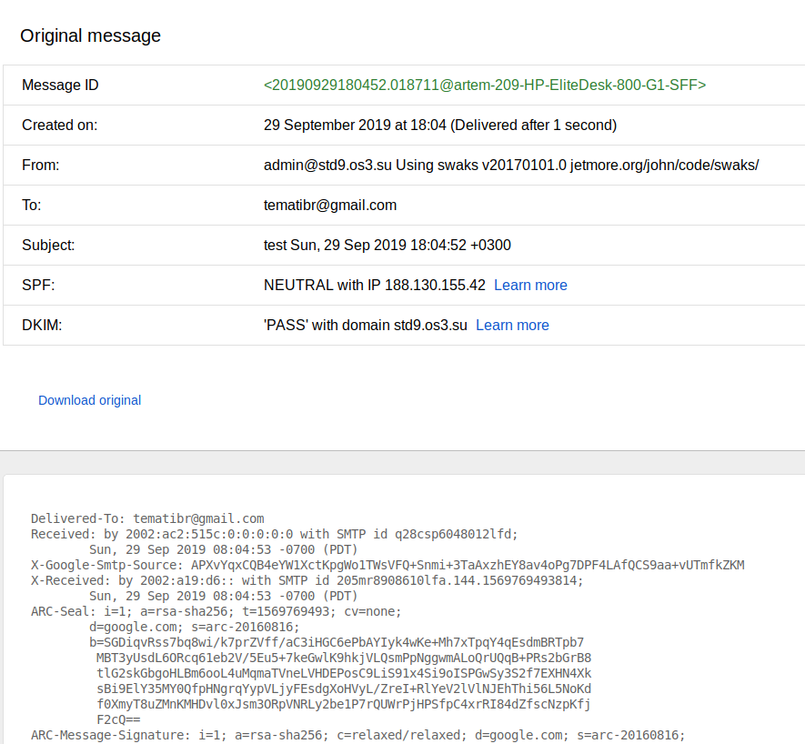


The best service to use for verifying is https://www.mail-tester.com/. However it only offers 3 email tests per day (for free, otherwise you have to pay). Below is the result of testing against this service:

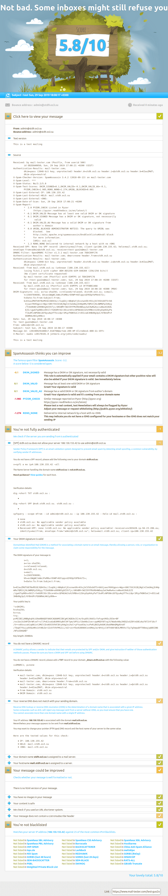


The next step is making sure that **my** server verifies the DKIM signature of the **incoming** emails. Here is an example mail I received from a friend's gmail account:

```
From aragornynn@gmail.com  Sun Sep 29 19:02:32 2019
Return-Path: <aragornynn@gmail.com>
X-Original-To: admin@std9.os3.su
Delivered-To: admin@std9.os3.su
Received: from mail-lf1-f49.google.com (mail-lf1-f49.google.com [209.85.167.49])
	by mail.std9.os3.su (Postfix) with ESMTPS id E2B82B614AA
	for <admin@std9.os3.su>; Sun, 29 Sep 2019 19:02:31 +0300 (MSK)
Authentication-Results: mail.std9.os3.su;
	dkim=pass (2048-bit key; unprotected) header.d=gmail.com header.i=@gmail.com header.b="hx8Q63yT";
	dkim-atps=neutral
Received: by mail-lf1-f49.google.com with SMTP id d17so5208814lfa.7
        for <admin@std9.os3.su>; Sun, 29 Sep 2019 09:02:31 -0700 (PDT)
DKIM-Signature: v=1; a=rsa-sha256; c=relaxed/relaxed;
        d=gmail.com; s=20161025;
        h=mime-version:references:in-reply-to:from:date:message-id:subject:to;
        bh=Koo8PKRR9DgReU+q6TK6wWMdAnSvFiUWcVwqw6Pcs3k=;
        b=hx8Q63yTAtzfZDXiOYVFwiVt04CpK3BrHyZxlPtRpXmGKAEIptH5iu8ZIusnTWxfvp
         1iVKIhWga7f99kg1vsxN1fnZmOnAG6IUmt6AlvquLzSBKAigARbr/FPR5/giUvJ4Y/kS
         7FVJolGhhh1T5z6z7SG1B0jKFspkcLZi881+n4imQ+FeGcSvae2llbn6okuTZjkYI3qR
         d/sR1arLeUn5NI+XsnPq1KS+h/qxM7pgrKn4VYdAdDVw27Gb+5UizEmV0Ynh+cmpyuam
         QNrZKE7A0p2Ey4J0jVON1Fw9GGvM+U+fH20JUp+KSK5D2LLIRA3xYQ3Md0GHsXVmUPF+
         ppzA==
X-Google-DKIM-Signature: v=1; a=rsa-sha256; c=relaxed/relaxed;
        d=1e100.net; s=20161025;
        h=x-gm-message-state:mime-version:references:in-reply-to:from:date
         :message-id:subject:to;
        bh=Koo8PKRR9DgReU+q6TK6wWMdAnSvFiUWcVwqw6Pcs3k=;
        b=PH9rblBlNVRRm1sIj5QjRifEoq4KtyWIMguNvmu3T+r3glZjZjCEvchNyH0yf4sHJb
         dmqB9EQScvbXS9jxN5+jIyJYavKtX09o1pM+wgW8rB7EPT/UEm/F36Osgdo1kgLUd635
         G/JzC7e/kBxSgMxqj62X2mbSJFuZ2jDPkVBnu64Jv4Y29yE3egVQ21Py70Ns3UVsvxCg
         uIuDQi5DpCzOv7xGv2GKQiNGfyAKXU5VKbVggPtlRQqU1j0WFT3ccuLQSDbzH/0G2RO3
         2LmV8b7bHvlyM4PoerH8wmodBu9/E0Y1O46y00xZEDAGSMPnNvx9dAgv8lh3240ONPpi
         5gpQ==
X-Gm-Message-State: APjAAAWBwY8driMFpfsu3USdspy3AGeEh8E35RLNlyyrXuFcFyZKMC8J
	7ofHgjut9N9RTKSEcv4LPYmzhJ/68cybzCRDsF686Q==
X-Google-Smtp-Source: APXvYqxd0EMQhN7MKi+SvlVDTJ1FZnM/X/Zof9AZjBQidOUL8Q3qMXry572Wd8NYKrBLAHPwZV78YyQIg12jaxM2PwM=
X-Received: by 2002:a19:c7d3:: with SMTP id x202mr8555561lff.124.1569772950983;
 Sun, 29 Sep 2019 09:02:30 -0700 (PDT)
MIME-Version: 1.0
References: <20190929182430.019177@artem-209-HP-EliteDesk-800-G1-SFF>
In-Reply-To: <20190929182430.019177@artem-209-HP-EliteDesk-800-G1-SFF>
From: =?UTF-8?B?0J3QsNGB0YLRjyDQkNC90LDQvdCw0YHRgtGP?= <aragornynn@gmail.com>
Date: Sun, 29 Sep 2019 19:02:19 +0300
Message-ID: <CAJQJQ_qhi9o853dTXyJBh+k8DjZzk+kpdNBVNHBy3N7t8oJjpA@mail.gmail.com>
Subject: Re: test Sun, 29 Sep 2019 18:24:30 +0300
To: admin@std9.os3.su
Content-Type: multipart/alternative; boundary="0000000000001f1a380593b33f31"

--0000000000001f1a380593b33f31
Content-Type: text/plain; charset="UTF-8"
Content-Transfer-Encoding: base64

0J/RgNC40LLQtdGCINCQ0LvRgtC10LwNCg0K0LLRgSwgMjkg0YHQtdC90YIuIDIwMTkg0LMuLCAx
ODoyNCA8YWRtaW5Ac3RkOS5vczMuc3U+Og0KDQo+IFByaXZldCBhcmFnb3JuIQ0KPg0KPg0K
--0000000000001f1a380593b33f31
Content-Type: text/html; charset="UTF-8"
Content-Transfer-Encoding: quoted-printable

<div dir=3D"auto">=D0=9F=D1=80=D0=B8=D0=B2=D0=B5=D1=82 =D0=90=D0=BB=D1=82=
=D0=B5=D0=BC</div><br><div class=3D"gmail_quote"><div dir=3D"ltr" class=3D"=
gmail_attr">=D0=B2=D1=81, 29 =D1=81=D0=B5=D0=BD=D1=82. 2019 =D0=B3., 18:24 =
 &lt;<a href=3D"mailto:admin@std9.os3.su">admin@std9.os3.su</a>&gt;:<br></d=
iv><blockquote class=3D"gmail_quote" style=3D"margin:0 0 0 .8ex;border-left=
:1px #ccc solid;padding-left:1ex">Privet aragorn!<br>
<br>
</blockquote></div>

--0000000000001f1a380593b33f31--
```


Looking at the logs we can see that the DKIM was verified (see the last line):

```
$ systemctl status opendkim
● opendkim.service - OpenDKIM DomainKeys Identified Mail (DKIM) Milter
   Loaded: loaded (/lib/systemd/system/opendkim.service; enabled; vendor preset: enabled)
   Active: active (running) since Sun 2019-09-29 17:55:28 MSK; 3h 5min ago
     Docs: man:opendkim(8)
           man:opendkim.conf(5)
           man:opendkim-genkey(8)
           man:opendkim-genzone(8)
           man:opendkim-testadsp(8)
           man:opendkim-testkey
           http://www.opendkim.org/docs.html
  Process: 18317 ExecStart=/usr/sbin/opendkim -x /etc/opendkim.conf (code=exited, status=0/SUCCESS)
 Main PID: 18319 (opendkim)
    Tasks: 7 (limit: 4915)
   CGroup: /system.slice/opendkim.service
           └─18319 /usr/sbin/opendkim -x /etc/opendkim.conf

Sep 29 17:55:28 artem-209-HP-EliteDesk-800-G1-SFF systemd[1]: Starting OpenDKIM DomainKeys Identified Mail (DKIM) Milter...
Sep 29 17:55:28 artem-209-HP-EliteDesk-800-G1-SFF systemd[1]: opendkim.service: Can't open PID file /var/run/opendkim/opendkim.pid (yet?) after start: No such file or directory
Sep 29 17:55:28 artem-209-HP-EliteDesk-800-G1-SFF opendkim[18319]: OpenDKIM Filter v2.11.0 starting (args: -x /etc/opendkim.conf)
Sep 29 17:55:28 artem-209-HP-EliteDesk-800-G1-SFF systemd[1]: Started OpenDKIM DomainKeys Identified Mail (DKIM) Milter.
Sep 29 19:02:32 artem-209-HP-EliteDesk-800-G1-SFF opendkim[18319]: E2B82B614AA: s=20161025 d=gmail.com SSL
```

The postfix logs confirm this:

```
Sep 29 19:02:31 artem-209-HP-EliteDesk-800-G1-SFF postfix/smtpd[20300]: connect from mail-lf1-f49.google.com[209.85.167.49]
Sep 29 19:02:31 artem-209-HP-EliteDesk-800-G1-SFF postfix/smtpd[20300]: Anonymous TLS connection established from mail-lf1-f49.google.com[209.85.167.49]: TLSv1.3 with cipher TLS_AES_128_GCM_SHA256 (128/128 bits)
Sep 29 19:02:31 artem-209-HP-EliteDesk-800-G1-SFF postfix/smtpd[20300]: E2B82B614AA: client=mail-lf1-f49.google.com[209.85.167.49]
Sep 29 19:02:31 artem-209-HP-EliteDesk-800-G1-SFF postfix/cleanup[20304]: E2B82B614AA: message-id=<CAJQJQ_qhi9o853dTXyJBh+k8DjZzk+kpdNBVNHBy3N7t8oJjpA@mail.gmail.com>
Sep 29 19:02:32 artem-209-HP-EliteDesk-800-G1-SFF opendkim[18319]: E2B82B614AA: s=20161025 d=gmail.com SSL
Sep 29 19:02:32 artem-209-HP-EliteDesk-800-G1-SFF postfix/qmgr[18694]: E2B82B614AA: from=<aragornynn@gmail.com>, size=3465, nrcpt=1 (queue active)
Sep 29 19:02:32 artem-209-HP-EliteDesk-800-G1-SFF postfix/smtpd[20300]: disconnect from mail-lf1-f49.google.com[209.85.167.49] ehlo=2 starttls=1 mail=1 rcpt=1 data=1 quit=1 commands=7
Sep 29 19:02:32 artem-209-HP-EliteDesk-800-G1-SFF postfix/local[20308]: E2B82B614AA: to=<mailman@std9.os3.su>, orig_to=<admin@std9.os3.su>, relay=local, delay=0.61, delays=0.56/0.01/0/0.03, dsn=2.0.0, status=sent (delivered to mailbox)
Sep 29 19:02:32 artem-209-HP-EliteDesk-800-G1-SFF postfix/qmgr[18694]: E2B82B614AA: removed
```


sources: 

1.	https://easyengine.io/tutorials/mail/dkim-postfix-ubuntu/
2.	https://wiki.archlinux.org/index.php/OpenDKIM
3.	https://postmarkapp.com/guides/dkim
4.	https://postmarkapp.com/guides/dmarc

## Appendix

** DANE**


DANE allows to generate a self-signed certificate that would be verifiable by third parties. This is done by putting the hash of the certificate on the DNS server that is serving that domain (the server must have DNSSEC enabled). To quote RFC 6689 which defines DANE:

```
Encrypted communication on the Internet often uses Transport Layer Security (TLS), which depends on third parties to certify the keys used. This document improves on that situation by enabling the administrators of domain names to specify the keys used in that domain’s TLS servers.
```

This allows remote parties that are connecting to the server to verify the authenticity of the TLS certificate.

Below is the certificate generate for the server: https://www.huque.com/bin/gen_tlsa


source: https://kostikov.co/tehnologiya-dane-bezopasnostj-cherez-dns


While doing task 5 at first I though that the task asked for encryption AND authentication. Which is an interesting question, of how can clients of my postfix server verify its authenticity.

The issue is about verifiyng the match between a physical entity such as a person or an organisation with its online presence. The online presence is a public key (which is used to securely communicate with the organisation) and with the server ip (where the communication will be directed).

One approach would be to get the certificate signed by a CA such as Let's Encrypt. 

What is a certificate? It combines the name of a physical person (or an organisation) with its private key. The certificate is signed (i.e. hash of the `organisation name` + `organisation public key` is calculated and that hash is encrypted with a private key). 

So who signs the certificate? A Certificate Authority which is a third party organisation. The certificate authority is trusted by with OS and browser vendors. Because you use the OS and the browser it means you trust them, thus you implicitly trust the CA's. What do you trust them to do? You trust them to validate the organization before issuing a certificate to that organization. What does it mean to validate? The CA makes sure that the organization applying to have its name connected to a domain and a public key, indeed owns the domain. How do they validate the organisation? By checking that the organisation owns the domain.

This step can be short circuited with DANE. DANE is a way to of connecting the certificate to the domain name. This is done by publishing a TLSA record.

The admin of the server generates a key (a private key and a certificate). This certificate is self-signed. The format for storing a certificate is x509. It is a binary format. For easier distribution the certificate is normally base-64 encoded and surrounded with lines 

```
-----BEGIN CERTIFICATE-----
```
and 
```
-----END CERTIFICATE-----
```

More info on certificates  and its byte-by-byte analysis: 
https://github.com/ajanicij/x509-tutorial/blob/master/x509-analysis.md

An example certificate is shown below: 


```
$ openssl x509 -in www_google_com.crt -text
Certificate:
    Data:
        Version: 3 (0x2)
        Serial Number:
            01:a7:8a:7f:5e:bb:b7:ba:02:00:00:00:00:42:ff:ed
        Signature Algorithm: sha256WithRSAEncryption
        Issuer: C = US, O = Google Trust Services, CN = GTS CA 1O1
        Validity
            Not Before: Sep  5 20:21:24 2019 GMT
            Not After : Nov 28 20:21:24 2019 GMT
        Subject: C = US, ST = California, L = Mountain View, O = Google LLC, CN = www.google.com
        Subject Public Key Info:
            Public Key Algorithm: id-ecPublicKey
                Public-Key: (256 bit)
                pub:
                    04:16:8c:e9:70:f2:f4:44:f1:6a:3d:dc:69:60:21:
                    2e:77:19:27:fc:85:89:53:92:54:f3:50:ea:a7:5a:
                    6c:3a:f5:6a:58:70:7c:4d:cb:cb:96:c7:0f:6f:1d:
                    38:04:db:09:66:c6:5a:49:24:05:e4:ac:b4:49:e2:
                    5c:87:11:eb:2f
                ASN1 OID: prime256v1
                NIST CURVE: P-256
        X509v3 extensions:
            X509v3 Key Usage: critical
                Digital Signature
            X509v3 Extended Key Usage: 
                TLS Web Server Authentication
            X509v3 Basic Constraints: critical
                CA:FALSE
            X509v3 Subject Key Identifier: 
                AF:2D:65:33:D0:31:8D:66:D9:32:C8:A9:32:BD:0E:AB:7C:72:92:4C
            X509v3 Authority Key Identifier: 
                keyid:98:D1:F8:6E:10:EB:CF:9B:EC:60:9F:18:90:1B:A0:EB:7D:09:FD:2B

            Authority Information Access: 
                OCSP - URI:http://ocsp.pki.goog/gts1o1
                CA Issuers - URI:http://pki.goog/gsr2/GTS1O1.crt

            X509v3 Subject Alternative Name: 
                DNS:www.google.com
            X509v3 Certificate Policies: 
                Policy: 2.23.140.1.2.2
                Policy: 1.3.6.1.4.1.11129.2.5.3

            X509v3 CRL Distribution Points: 

                Full Name:
                  URI:http://crl.pki.goog/GTS1O1.crl

            CT Precertificate SCTs: 
                Signed Certificate Timestamp:
                    Version   : v1 (0x0)
                    Log ID    : 63:F2:DB:CD:E8:3B:CC:2C:CF:0B:72:84:27:57:6B:33:
                                A4:8D:61:77:8F:BD:75:A6:38:B1:C7:68:54:4B:D8:8D
                    Timestamp : Sep  5 21:21:25.149 2019 GMT
                    Extensions: none
                    Signature : ecdsa-with-SHA256
                                30:45:02:20:4D:22:66:B3:6A:58:86:12:BD:7E:A7:93:
                                17:11:5E:CF:E2:61:0D:D2:2D:08:84:10:5A:0C:DA:04:
                                F9:09:BF:FA:02:21:00:8B:7D:1E:23:B6:74:E5:33:84:
                                3E:DC:3B:27:26:45:29:38:BC:95:19:ED:7E:B3:3C:A8:
                                DE:21:88:54:AB:6B:9F
                Signed Certificate Timestamp:
                    Version   : v1 (0x0)
                    Log ID    : 74:7E:DA:83:31:AD:33:10:91:21:9C:CE:25:4F:42:70:
                                C2:BF:FD:5E:42:20:08:C6:37:35:79:E6:10:7B:CC:56
                    Timestamp : Sep  5 21:21:25.178 2019 GMT
                    Extensions: none
                    Signature : ecdsa-with-SHA256
                                30:44:02:20:4F:3E:59:63:19:E8:7F:CD:29:A8:6E:F7:
                                86:43:51:5F:CC:A9:2F:B6:61:6B:0B:6C:DA:F3:44:FE:
                                B8:4E:1C:84:02:20:07:E7:23:1A:C7:C1:FF:49:C7:40:
                                F2:0F:B0:38:72:3B:60:6A:E9:E9:B8:0C:BC:20:25:23:
                                CA:C2:02:C9:0D:7A
    Signature Algorithm: sha256WithRSAEncryption
         44:2a:14:fd:da:c8:6b:e1:17:4c:e1:87:36:e9:59:0d:3b:14:
         78:16:36:c3:24:74:65:b4:99:2b:c4:8b:bf:57:01:5d:ca:bb:
         11:7c:0d:d6:b5:ac:11:97:bc:4c:db:b0:bd:f4:fb:f0:4b:66:
         7a:5f:3a:8a:33:e1:ae:c5:f4:b9:a8:14:71:57:74:53:41:51:
         43:78:96:20:5e:a9:17:c0:24:f5:62:7a:51:a3:df:1c:0d:c0:
         5c:3a:56:9c:ad:7c:fe:dc:ac:c3:5a:bc:f7:db:7c:46:f0:dc:
         98:4a:8a:83:b4:35:2f:50:5e:41:d0:9b:6d:35:88:76:52:ec:
         55:87:7c:aa:3a:66:23:11:0b:c7:d2:4c:69:f8:49:5c:2d:5e:
         d7:ab:8e:da:94:50:6f:0f:c9:cb:01:15:fd:9a:a2:c5:5e:36:
         a2:30:d2:cf:8a:15:ff:3a:8d:c0:25:df:a4:5e:e0:de:27:3e:
         a2:81:4b:1f:f5:47:88:71:b4:5c:e1:93:8b:42:4e:72:b0:1f:
         fe:93:d0:7c:c3:70:76:0c:85:cc:cb:2f:94:5a:dd:d7:35:7e:
         e9:28:c0:d5:12:12:e6:d9:eb:17:02:c8:e0:33:38:ae:d2:7d:
         d4:c0:b2:86:d4:a2:63:f1:6a:cf:b4:fd:97:be:af:dd:8b:1b:
         e9:d3:cb:a2
-----BEGIN CERTIFICATE-----
MIIEvjCCA6agAwIBAgIQAaeKf167t7oCAAAAAEL/7TANBgkqhkiG9w0BAQsFADBC
MQswCQYDVQQGEwJVUzEeMBwGA1UEChMVR29vZ2xlIFRydXN0IFNlcnZpY2VzMRMw
EQYDVQQDEwpHVFMgQ0EgMU8xMB4XDTE5MDkwNTIwMjEyNFoXDTE5MTEyODIwMjEy
NFowaDELMAkGA1UEBhMCVVMxEzARBgNVBAgTCkNhbGlmb3JuaWExFjAUBgNVBAcT
DU1vdW50YWluIFZpZXcxEzARBgNVBAoTCkdvb2dsZSBMTEMxFzAVBgNVBAMTDnd3
dy5nb29nbGUuY29tMFkwEwYHKoZIzj0CAQYIKoZIzj0DAQcDQgAEFozpcPL0RPFq
PdxpYCEudxkn/IWJU5JU81Dqp1psOvVqWHB8TcvLlscPbx04BNsJZsZaSSQF5Ky0
SeJchxHrL6OCAlMwggJPMA4GA1UdDwEB/wQEAwIHgDATBgNVHSUEDDAKBggrBgEF
BQcDATAMBgNVHRMBAf8EAjAAMB0GA1UdDgQWBBSvLWUz0DGNZtkyyKkyvQ6rfHKS
TDAfBgNVHSMEGDAWgBSY0fhuEOvPm+xgnxiQG6DrfQn9KzBkBggrBgEFBQcBAQRY
MFYwJwYIKwYBBQUHMAGGG2h0dHA6Ly9vY3NwLnBraS5nb29nL2d0czFvMTArBggr
BgEFBQcwAoYfaHR0cDovL3BraS5nb29nL2dzcjIvR1RTMU8xLmNydDAZBgNVHREE
EjAQgg53d3cuZ29vZ2xlLmNvbTAhBgNVHSAEGjAYMAgGBmeBDAECAjAMBgorBgEE
AdZ5AgUDMC8GA1UdHwQoMCYwJKAioCCGHmh0dHA6Ly9jcmwucGtpLmdvb2cvR1RT
MU8xLmNybDCCAQMGCisGAQQB1nkCBAIEgfQEgfEA7wB2AGPy283oO8wszwtyhCdX
azOkjWF3j711pjixx2hUS9iNAAABbQNNrJ0AAAQDAEcwRQIgTSJms2pYhhK9fqeT
FxFez+JhDdItCIQQWgzaBPkJv/oCIQCLfR4jtnTlM4Q+3DsnJkUpOLyVGe1+szyo
3iGIVKtrnwB1AHR+2oMxrTMQkSGcziVPQnDCv/1eQiAIxjc1eeYQe8xWAAABbQNN
rLoAAAQDAEYwRAIgTz5ZYxnof80pqG73hkNRX8ypL7Zhawts2vNE/rhOHIQCIAfn
IxrHwf9Jx0DyD7A4cjtgaunpuAy8ICUjysICyQ16MA0GCSqGSIb3DQEBCwUAA4IB
AQBEKhT92shr4RdM4Yc26VkNOxR4FjbDJHRltJkrxIu/VwFdyrsRfA3WtawRl7xM
27C99PvwS2Z6XzqKM+GuxfS5qBRxV3RTQVFDeJYgXqkXwCT1YnpRo98cDcBcOlac
rXz+3KzDWrz323xG8NyYSoqDtDUvUF5B0JttNYh2UuxVh3yqOmYjEQvH0kxp+Elc
LV7Xq47alFBvD8nLARX9mqLFXjaiMNLPihX/Oo3AJd+kXuDeJz6igUsf9UeIcbRc
4ZOLQk5ysB/+k9B8w3B2DIXMyy+UWt3XNX7pKMDVEhLm2esXAsjgMziu0n3UwLKG
1KJj8WrPtP2Xvq/dixvp08ui
-----END CERTIFICATE-----
```


In my case I wanted to secure my mail. So I took the certificate that I was already using in postfix config to encrypt my mail, located at `/etc/ssl/certs/ssl-cert-snakeoil.pem`. Then I used an online tool to generate an appropriate TLSA entry as shown below:

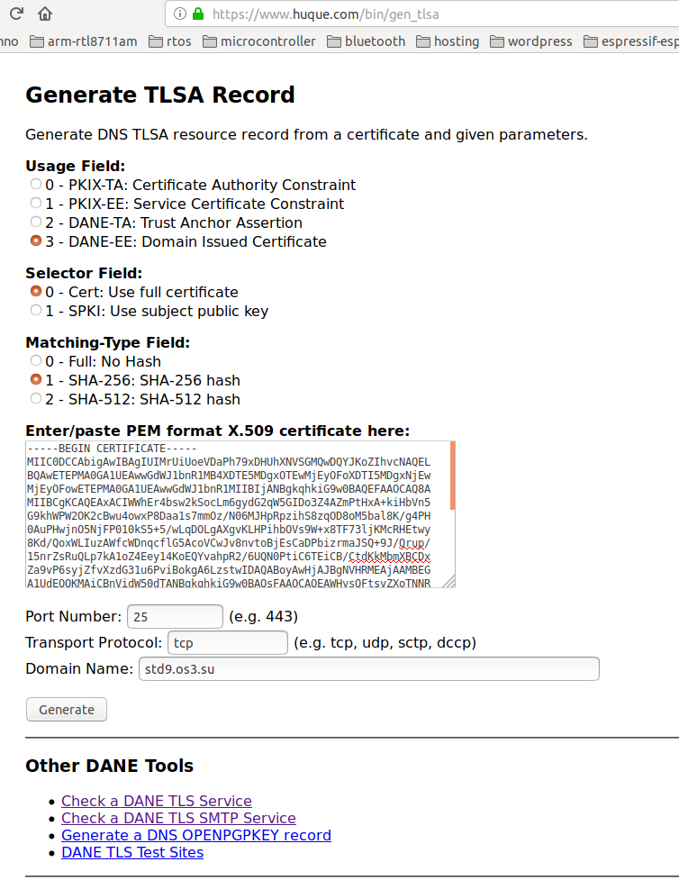

And the result is shown below:

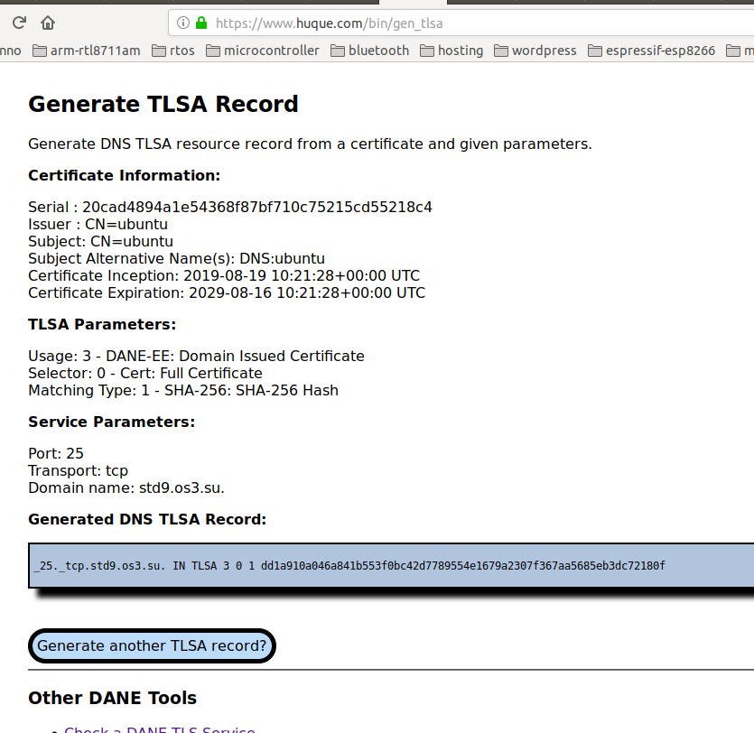

So I copied the TLSA record to my `std9.os3.su.zone` file and resigned the zone. Here is the resulting zone file (not signed yet):

```
$ cat /usr/local/etc/nsd/std9.os3.su.zone
std9.os3.su.	3600	IN	SOA	ns0.std9.os3.su. admin.std9.os3.su. 2019092900 10800 3600 604800 38400
www.std9.os3.su.	3600	IN	CNAME	notes.std9.os3.su.
tst.std9.os3.su.	3600	IN	AAAA	2400:6180:100:d0::8c4:9001
tst.std9.os3.su.	3600	IN	A	68.183.92.166
subdom.std9.os3.su.	3600	IN	NS	ns0.std9.os3.su.
ns0.std9.os3.su.	3600	IN	A	188.130.155.42
notes.std9.os3.su.	3600	IN	CNAME	temach.github.io.
_25._tcp.mail.std9.os3.su.	3600	IN	TLSA	3 0 1 dd1a910a046a841b553f0bc42d7789554e1679a2307f367aa5685eb3dc72180f
mail.std9.os3.su.	3600	IN	A	188.130.155.42
lab.std9.os3.su.	3600	IN	A	188.130.155.42
ansible.std9.os3.su.	3600	IN	AAAA	2a00:b700::6:220
ansible.std9.os3.su.	3600	IN	A	185.22.153.49
_25._tcp.std9.os3.su.	3600	IN	TLSA	3 0 1 dd1a910a046a841b553f0bc42d7789554e1679a2307f367aa5685eb3dc72180f
mail._domainkey.std9.os3.su.	3600	IN	TXT	"v=DKIM1; h=sha256; k=rsa; t=y; " "p=MIIBIjANBgkqhkiG9w0BAQEFAAOCAQ8AMIIBCgKCAQEAx3I/m/OcpD5i9dd1cfoFugnVKEuJD3e+BF/nx1bx3s5HPZ9rWFzeT+sllPnE2vaGoB3RRVyB4l9F7pm/UP5ivlDeH8sIvercqwMEDY8TvqJS7Wa8xH8wJHEQ2sGZ0YxGOEzAa76T2tF16cf/V++x0Snzzak1q8A1xt2MGlCEnAOS5Vh0lBtykHg2oihwl+yFtwa93w/xzPeRjB" "G5y0ddK10aURWeQMgAVnAf/7bqA7YkujyOVQuHRx1XtNkZe+IZxhTVhFMS2ii/UZrvo+Fbo92B98OConORmyJwrWt6jul0Th9AFdB3LMRhhv72y7g5mpwDFT08eqjqABSIWb/WTwIDAQAB"
std9.os3.su.	3600	IN	DNSKEY	257 3 13 ZP8yUKKmSdi8H03m2Pzynh8nTyis1LV72Bmf+ZBbdS0/bBoVIVIBEJ3uYPGMoOlu7kbybMNfLRW1kKRvb6Gv5g== ;{id = 59198 (ksk), size = 256b}
std9.os3.su.	3600	IN	DNSKEY	256 3 13 tMVV1aZA+72bTZUh53xB12Xl/dsxcGR5W/aIeZ3+rzSceq3WT88CitEzzcaC8dwcJ2jtZlFXmDRGnf55f6RgVw== ;{id = 62425 (zsk), size = 256b}
std9.os3.su.	3600	IN	MX	10 mail.std9.os3.su.
std9.os3.su.	3600	IN	MX	20 mail.std4.os3.su.
std9.os3.su.	3600	IN	NS	ns0.std9.os3.su.
```

And here is the signed version (only showning TLSA configuration):

```
_25._tcp.mail.std9.os3.su.	3600	IN	TLSA	3 0 1 dd1a910a046a841b553f0bc42d7789554e1679a2307f367aa5685eb3dc72180f
_25._tcp.mail.std9.os3.su.	3600	IN	RRSIG	TLSA 13 6 3600 20191031000000 20190929183339 62425 std9.os3.su. DsfMGG2665RKzDLreGQfgUR6kt94Fs34bGPydXxT8dl0VUOx3ryKGAiCvVhxy9Yfq6nUAqWAT8/zLY11gZLJ+Q==
_25._tcp.mail.std9.os3.su.	38400	IN	NSEC	notes.std9.os3.su. RRSIG NSEC TLSA 
_25._tcp.mail.std9.os3.su.	38400	IN	RRSIG	NSEC 13 6 38400 20191031000000 20190929183339 62425 std9.os3.su. 4UCP45cubtDq0jA917ad/xbwjNnIXsP0Oxm8Xb5EVc6w51e/uF/Ur7resuNDlRZrcoozpgbWHolg3fvTxNEq7Q==
```

Then I checked that domain had DANE configured for SMTP as shown below:

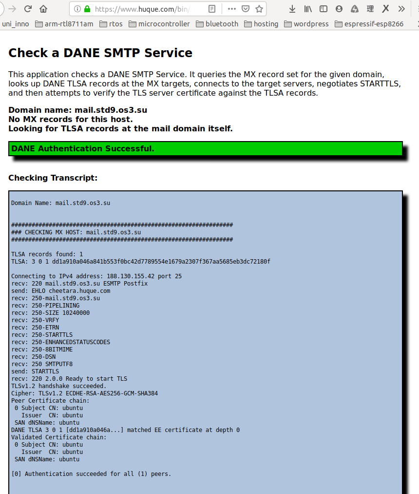

And another test:

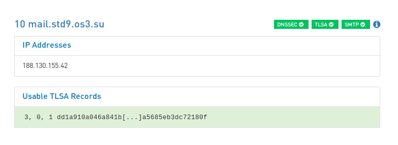


source:  http://www.moserware.com/2009/06/first-few-milliseconds-of-https.html