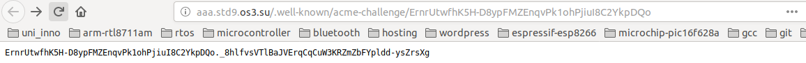
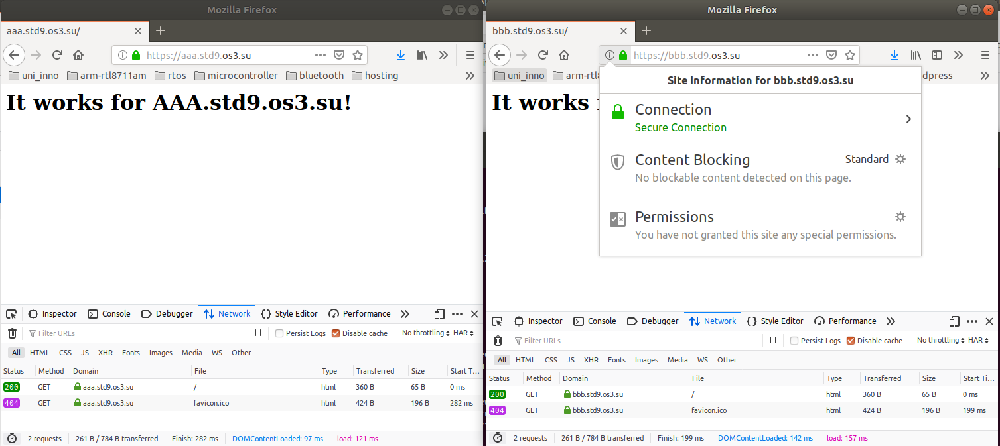
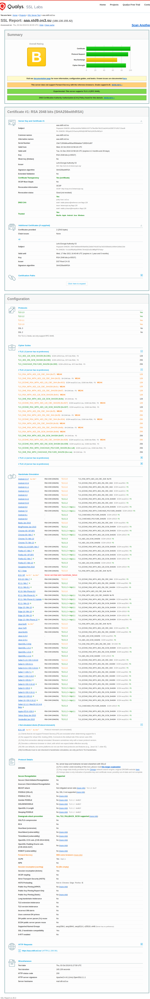
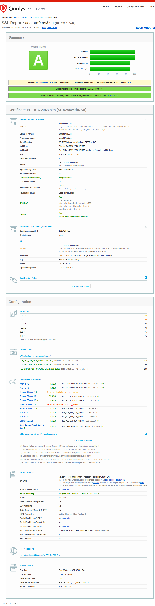
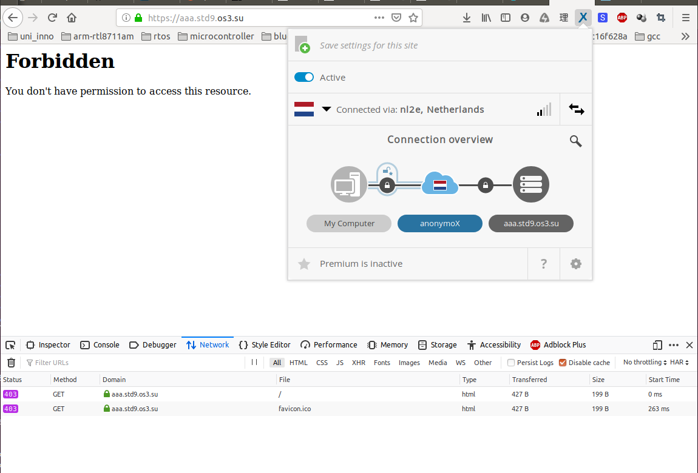
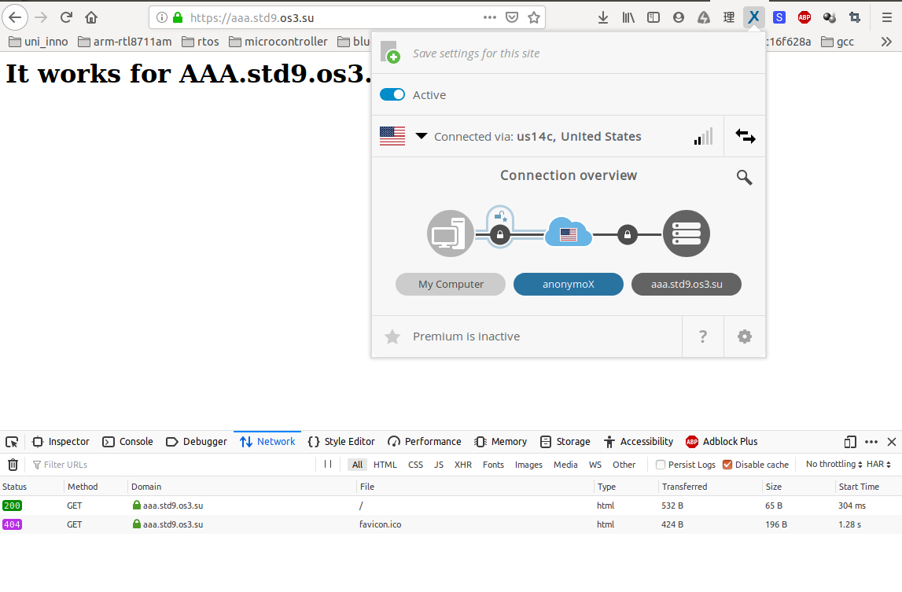
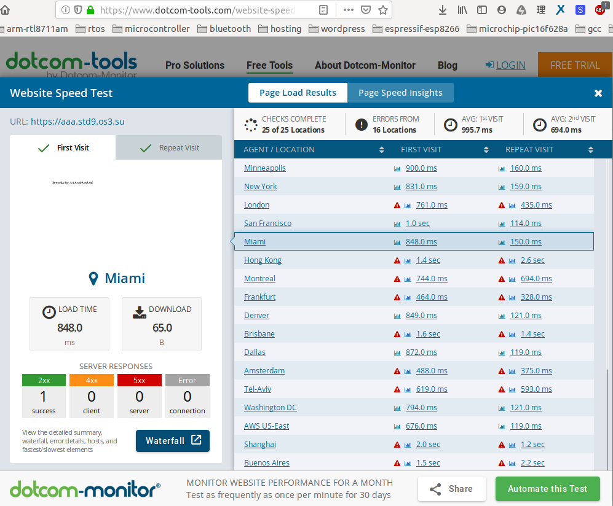
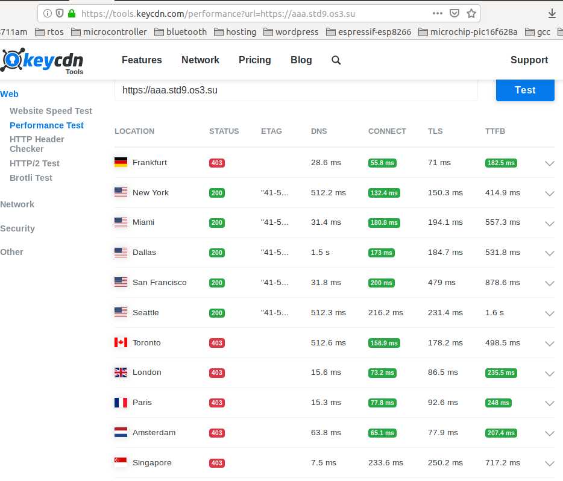

# FIA Lab 6 - Web Servers
#### Artem Abramov SNE19

##  Task 1 - Install and Virtual Hosts

### Fetch, verify, build and install the daemon. Note that some features may be built-in or modularized. Enable at least SSL/TLS.

To download and verify I followed the official instructions at https://httpd.apache.org/download.cgi

Fetch the source
```
$ wget http://mirror.linux-ia64.org/apache//httpd/httpd-2.4.41.tar.bz2
--2019-10-02 21:24:24--  http://mirror.linux-ia64.org/apache//httpd/httpd-2.4.41.tar.bz2
Resolving mirror.linux-ia64.org (mirror.linux-ia64.org)... 37.193.156.169
Connecting to mirror.linux-ia64.org (mirror.linux-ia64.org)|37.193.156.169|:80... connected.
HTTP request sent, awaiting response... 200 OK
Length: 7072373 (6.7M) [application/x-bzip2]
Saving to: ‘httpd-2.4.41.tar.bz2’

httpd-2.4.41.tar.bz2                              100%[==========================================================================================================>]   6.74M  12.5MB/s    in 0.5s    

2019-10-02 21:24:25 (12.5 MB/s) - ‘httpd-2.4.41.tar.bz2’ saved [7072373/7072373]
```


Fetch the developer keys:
```
$ wget --secure-protocol=TLSv1_2 https://www.apache.org/dist/httpd/KEYS
--2019-10-02 21:26:51--  https://www.apache.org/dist/httpd/KEYS
Resolving www.apache.org (www.apache.org)... 40.79.78.1, 95.216.24.32, 2a01:4f9:2a:185f::2
Connecting to www.apache.org (www.apache.org)|40.79.78.1|:443... connected.
HTTP request sent, awaiting response... 200 OK
Length: 541966 (529K)
Saving to: ‘KEYS’

KEYS                                              100%[==========================================================================================================>] 529.26K   603KB/s    in 0.9s    

2019-10-02 21:26:53 (603 KB/s) - ‘KEYS’ saved [541966/541966]
```

The keys were retrieved over HTTPS therefore they can be trusted to come unmodified from Apache.

Fetch the signature file:
```
$ wget  --secure-protocol=TLSv1_2 https://www.apache.org/dist/httpd/httpd-2.4.41.tar.bz2.asc
--2019-10-02 21:28:48--  https://www.apache.org/dist/httpd/httpd-2.4.41.tar.bz2.asc
Resolving www.apache.org (www.apache.org)... 95.216.24.32, 40.79.78.1, 2a01:4f9:2a:185f::2
Connecting to www.apache.org (www.apache.org)|95.216.24.32|:443... connected.
HTTP request sent, awaiting response... 200 OK
Length: 488 [text/plain]
Saving to: ‘httpd-2.4.41.tar.bz2.asc’

httpd-2.4.41.tar.bz2.asc                          100%[==========================================================================================================>]     488  --.-KB/s    in 0s      

2019-10-02 21:28:48 (11.7 MB/s) - ‘httpd-2.4.41.tar.bz2.asc’ saved [488/488]
```

The signature was also retrieved over HTTPS. 

The next step was verifying the download. Detailed steps and description is provided in https://httpd.apache.org/dev/verification.html However because the file with the keys was downloaded over HTTPS from apache website we can trust them.

Import the keys file:
```
$ gpg2 --import KEYS 
gpg: key 508EAEC5302DA568: 16 signatures not checked due to missing keys
gpg: key 508EAEC5302DA568: public key "Rodent of Unusual Size (DSA) <coar@ACM.Org>" imported
gpg: key DDBA64BA2C312D2F: 16 signatures not checked due to missing keys
gpg: key DDBA64BA2C312D2F: public key "Rodent of Unusual Size <coar@ACM.Org>" imported
gpg: key 8B3A601F08C975E5: public key "Jim Jagielski <jim@apache.org>" imported
gpg: key 7D6DBFD1F08E012A: public key "Dean Gaudet <dgaudet@apache.org>" imported
gpg: key 193F180AB55D9977: 34 signatures not checked due to missing keys
gpg: key 193F180AB55D9977: public key "William A. Rowe, Jr. <wrowe@rowe-clan.net>" imported
gpg: key 361522D782AB7BD1: 1 signature not checked due to a missing key
gpg: key 361522D782AB7BD1: public key "Cliff Woolley <jwoolley@apache.org>" imported
gpg: key 0F81AA8AB0D5F771: 2 signatures not checked due to missing keys
gpg: key 0F81AA8AB0D5F771: public key "Cliff Woolley <jwoolley@virginia.edu>" imported
gpg: key 344A844D751D7F27: 15 signatures not checked due to missing keys
gpg: key 344A844D751D7F27: public key "Graham Leggett <minfrin@apache.org>" imported
gpg: key 605E165A6D791A41: public key "Greg Ames <gregames@apache.org>" imported
gpg: key 5B968010E04F9A89: 132 signatures not checked due to missing keys
gpg: key 5B968010E04F9A89: public key "Roy T. Fielding <fielding@gbiv.com>" imported
gpg: key 16A96495E2226795: 18 signatures not checked due to missing keys
gpg: key 16A96495E2226795: public key "Justin R. Erenkrantz <jerenkrantz@apache.org>" imported
gpg: key AB7A60BC2CF86427: public key "Ian Holsman <ianh@apache.org>" imported
gpg: key AB7A60BC2CF86427: "Ian Holsman <ianh@apache.org>" not changed
gpg: key 21454AF0CC8B0F7E: 13 signatures not checked due to missing keys
gpg: key 21454AF0CC8B0F7E: public key "Aaron Bannert <abannert@kuci.org>" imported
gpg: key F55DF0293A4E7AC9: public key "Brad Nicholes <bnicholes@novell.com>" imported
gpg: key 6635B6C0DE885DD3: public key "Sander Striker <striker@apache.org>" imported
gpg: key 5D414AE1E005C9CB: public key "Greg Stein <gstein@lyra.org>" imported
gpg: key CA6939748103A37E: 21 signatures not checked due to missing keys
gpg: key CA6939748103A37E: public key "Andre Malo <nd@apache.org>" imported
gpg: key 153FA0CD75A67692: 10 signatures not checked due to missing keys
gpg: key 153FA0CD75A67692: public key "Erik Abele <erik@codefaktor.de>" imported
gpg: key EED1EA392261D073: 16 signatures not checked due to missing keys
gpg: key EED1EA392261D073: public key "Astrid Kessler (Kess) <kess@kess-net.de>" imported
gpg: key B31B213D208F5064: public key "Joe Schaefer <joe@sunstarsys.com>" imported
gpg: key A01DBC9EA879FCF5: public key "Gregory Trubetskoy (Grisha) <grisha@ispol.com>" imported
gpg: key CCB2EB46E76CF6D0: 3 signatures not checked due to missing keys
gpg: key CCB2EB46E76CF6D0: public key "Stas Bekman <stas@stason.org>" imported
gpg: key F78875F642721F00: 42 signatures not checked due to missing keys
gpg: key F78875F642721F00: public key "Paul Querna <chip@force-elite.com>" imported
gpg: key 75CAA2A3F39B3750: 37 signatures not checked due to missing keys
gpg: key 75CAA2A3F39B3750: public key "Colm MacCarthaigh <colm.maccarthaigh@heanet.ie>" imported
gpg: key 4C042818311A3DE5: 50 signatures not checked due to missing keys
gpg: key 4C042818311A3DE5: 1 bad signature
gpg: key 4C042818311A3DE5: public key "Ruediger Pluem <rpluem@apache.org>" imported
gpg: key ECAB0E7B83E6AE0D: 35 signatures not checked due to missing keys
gpg: key ECAB0E7B83E6AE0D: public key "Maxime Petazzoni (Bulix.org) <maxime.petazzoni@bulix.org>" imported
gpg: key 6D0BC73A40581837: 48 signatures not checked due to missing keys
gpg: key 6D0BC73A40581837: public key "Nick Kew <nick@webthing.com>" imported
gpg: key 9BB863B0F51BB88A: 18 duplicate signatures removed
gpg: key 9BB863B0F51BB88A: 121 signatures not checked due to missing keys
gpg: key 9BB863B0F51BB88A: 1 bad signature
gpg: key 9BB863B0F51BB88A: public key "Sander Temme <sander@temme.net>" imported
gpg: key 13249B4FEC88A0BF: public key "Philip M. Gollucci <pgollucci@p6m7g8.com>" imported
gpg: key 47F6969D0E44CF0C: 4 signatures not checked due to missing keys
gpg: key 47F6969D0E44CF0C: public key "Joe Orton <jorton@redhat.com>" imported
gpg: key E8E7E00B4DAA1988: public key "Bojan Smojver <bojan@rexursive.com>" imported
gpg: key EDB105896F9522D8: 26 signatures not checked due to missing keys
gpg: key EDB105896F9522D8: public key "Issac Goldstand <margol@beamartyr.net>" imported
gpg: key 2FF06894E55B0D0E: public key ""Guenter Knauf" ("CODE SIGNING KEY") <fuankg@apache.org>" imported
gpg: key EC582EB639FF092C: public key "Jeff Trawick (CODE SIGNING KEY) <trawick@apache.org>" imported
gpg: key 34EA76E6791485A8: 6 signatures not checked due to missing keys
gpg: key 34EA76E6791485A8: public key "Jim Jagielski (Release Signing Key) <jim@apache.org>" imported
gpg: key 82781DE46D5954FA: 10 signatures not checked due to missing keys
gpg: key 82781DE46D5954FA: 3 bad signatures
gpg: key 82781DE46D5954FA: public key "Eric Covener <covener@apache.org>" imported
gpg: key EC99EE267EB5F61A: 3 signatures not checked due to missing keys
gpg: key EC99EE267EB5F61A: public key "Yann Ylavic <ylavic@apache.org>" imported
gpg: key 995E35221AD84DFF: 56 signatures not checked due to missing keys
gpg: key 995E35221AD84DFF: public key "Daniel Ruggeri (http://home.apache.org/~druggeri/) <druggeri@apache.org>" imported
gpg: key 2AB12A7ADC55C003: public key "Daniel Ruggeri (http://home.apache.org/~druggeri/) <druggeri@apache.org>" imported
gpg: Total number processed: 67
gpg:     skipped PGP-2 keys: 27
gpg:               imported: 39
gpg:              unchanged: 1
gpg: no ultimately trusted keys found
```

Then verify the download using the signature:
```
$ gpg2 --verify httpd-2.4.41.tar.bz2.asc httpd-2.4.41.tar.bz2
gpg: Signature made Fri 09 Aug 2019 16:37:13 MSK
gpg:                using RSA key B9E8213AEFB861AF35A41F2C995E35221AD84DFF
gpg: Good signature from "Daniel Ruggeri (http://home.apache.org/~druggeri/) <druggeri@apache.org>" [unknown]
gpg:                 aka "Daniel Ruggeri <DRuggeri@primary.net>" [unknown]
gpg:                 aka "[jpeg image of size 18442]" [unknown]
gpg: WARNING: This key is not certified with a trusted signature!
gpg:          There is no indication that the signature belongs to the owner.
Primary key fingerprint: B9E8 213A EFB8 61AF 35A4  1F2C 995E 3522 1AD8 4DFF
```

The installation instructions are in INSTALL file, compile options are described in more detail in http://httpd.apache.org/docs/2.4/install.html a hint is given that the best way to view compile options is with: `./configure --help`.

I settled on the below command:
```
./configure --prefix=/usr/local/etc/apache --enable-ssl 
```

The next step was chasing down the dependencies.

The configure command failed with `configure: error: APR not found.  Please read the documentation.` I tried to install the dependency with `sudo apt-get install libapr1-dev libaprutil1-dev`, however was alerted of broken packages. Then I installed aptitude and tried to install the `libapr1-dev`,  `libaprutil1-dev` using `aptitude`. This revealed the version conflict and provided a solution of downgrading some packages, which I accepted.

After chasing down a number of other packages, the configure script was finally successful:
```
$ ./configure --prefix=/usr/local/etc/apache --enable-ssl 
checking for chosen layout... Apache
checking for working mkdir -p... yes
checking for grep that handles long lines and -e... /bin/grep
checking for egrep... /bin/grep -E
checking build system type... x86_64-pc-linux-gnu
checking host system type... x86_64-pc-linux-gnu
checking target system type... x86_64-pc-linux-gnu
configure: 
configure: Configuring Apache Portable Runtime library...
configure: 
checking for APR... yes
  setting CC to "x86_64-linux-gnu-gcc"
  setting CPP to "x86_64-linux-gnu-gcc -E"
  setting CFLAGS to "  -pthread"
  setting CPPFLAGS to "  -DLINUX -D_REENTRANT -D_GNU_SOURCE"
  setting LDFLAGS to " "
configure: 
configure: Configuring Apache Portable Runtime Utility library...
configure: 
checking for APR-util... yes
checking for gcc... x86_64-linux-gnu-gcc
checking whether the C compiler works... yes
checking for C compiler default output file name... a.out
checking for suffix of executables... 
checking whether we are cross compiling... no
checking for suffix of object files... o
checking whether we are using the GNU C compiler... yes
checking whether x86_64-linux-gnu-gcc accepts -g... yes
checking for x86_64-linux-gnu-gcc option to accept ISO C89... none needed
checking how to run the C preprocessor... x86_64-linux-gnu-gcc -E
checking for x86_64-linux-gnu-gcc option to accept ISO C99... none needed
checking for pcre-config... /usr/bin/pcre-config
configure: Using external PCRE library from /usr/bin/pcre-config
  setting PCRE_INCLUDES to ""
  setting PCRE_LIBS to "-lpcre"
configure: 
configure: Configuring Apache httpd...
configure: 
  setting INCLUDES to "-I."
  adding "-I$(top_srcdir)/os/$(OS_DIR)" to INCLUDES
  adding "-I$(top_srcdir)/include" to INCLUDES
  adding "-I/usr/include/apr-1.0" to INCLUDES
  adding "-I/usr/include" to INCLUDES
configure: 
configure: Applying OS-specific hints for httpd...
configure: 
  forcing SINGLE_LISTEN_UNSERIALIZED_ACCEPT to "1"
  forcing AP_NONBLOCK_WHEN_MULTI_LISTEN to "1"
checking for rm... /bin/rm
checking for pkg-config... /usr/bin/pkg-config
checking for rsync... /usr/bin/rsync
checking for gawk... no
checking for mawk... mawk
checking whether ln -s works... yes
checking for ranlib... ranlib
checking for lynx... no
checking for links... no
checking for elinks... no
checking for ANSI C header files... yes
checking for sys/types.h... yes
checking for sys/stat.h... yes
checking for stdlib.h... yes
checking for string.h... yes
checking for memory.h... yes
checking for strings.h... yes
checking for inttypes.h... yes
checking for stdint.h... yes
checking for unistd.h... yes
checking minix/config.h usability... no
checking minix/config.h presence... no
checking for minix/config.h... no
checking whether it is safe to define __EXTENSIONS__... yes
checking for library containing strerror... none required
checking for APR version 1.3.0 or later... yes
checking for APR-util version 1.3.0 or later... yes
checking for ANSI C header files... (cached) yes
checking for string.h... (cached) yes
checking limits.h usability... yes
checking limits.h presence... yes
checking for limits.h... yes
checking for unistd.h... (cached) yes
checking sys/socket.h usability... yes
checking sys/socket.h presence... yes
checking for sys/socket.h... yes
checking pwd.h usability... yes
checking pwd.h presence... yes
checking for pwd.h... yes
checking grp.h usability... yes
checking grp.h presence... yes
checking for grp.h... yes
checking for strings.h... (cached) yes
checking sys/prctl.h usability... yes
checking sys/prctl.h presence... yes
checking for sys/prctl.h... yes
checking sys/processor.h usability... no
checking sys/processor.h presence... no
checking for sys/processor.h... no
checking sys/sem.h usability... yes
checking sys/sem.h presence... yes
checking for sys/sem.h... yes
checking sys/sdt.h usability... no
checking sys/sdt.h presence... no
checking for sys/sdt.h... no
checking sys/loadavg.h usability... no
checking sys/loadavg.h presence... no
checking for sys/loadavg.h... no
checking for sys/wait.h that is POSIX.1 compatible... yes
checking for an ANSI C-conforming const... yes
checking for library containing sqrt... -lm
checking for library containing crypt... -lcrypt
checking for getpwnam... yes
checking for getgrnam... yes
checking for initgroups... yes
checking for bindprocessor... no
checking for prctl... yes
checking for timegm... yes
checking for getpgid... yes
checking for fopen64... yes
checking for getloadavg... yes
checking for void pointer length... no
checking for gettid()... yes
checking for tm_gmtoff in struct tm... yes
checking whether to enable mod_authn_file... shared
checking whether to enable mod_authn_dbm... shared (most)
checking whether to enable mod_authn_anon... shared (most)
checking whether to enable mod_authn_dbd... shared (most)
checking whether to enable mod_authn_socache... shared (most)
checking whether to enable mod_authn_core... shared
checking whether to enable mod_authz_host... shared
checking whether to enable mod_authz_groupfile... shared
checking whether to enable mod_authz_user... shared
checking whether to enable mod_authz_dbm... shared (most)
checking whether to enable mod_authz_owner... shared (most)
checking whether to enable mod_authz_dbd... shared (most)
checking whether to enable mod_authz_core... shared
checking whether to enable mod_authnz_ldap... checking dependencies
checking for ldap support in apr/apr-util... yes
  setting MOD_AUTHNZ_LDAP_LDADD to " -lldap -llber"
checking whether to enable mod_authnz_ldap... shared (most)
checking whether to enable mod_authnz_fcgi... no
checking whether to enable mod_access_compat... shared
checking whether to enable mod_auth_basic... shared
checking whether to enable mod_auth_form... shared (most)
checking whether to enable mod_auth_digest... checking dependencies
checking whether to enable mod_auth_digest... shared (most)
checking whether to enable mod_allowmethods... shared (most)
  adding "-I$(top_srcdir)/modules/aaa" to INCLUDES
checking whether to enable mod_isapi... no
checking whether to enable mod_file_cache... shared (most)
checking whether to enable mod_cache... shared (most)
checking whether to enable mod_cache_disk... checking dependencies
checking whether to enable mod_cache_disk... shared (most)
checking whether to enable mod_cache_socache... shared (most)
checking whether to enable mod_socache_shmcb... shared (most)
checking whether to enable mod_socache_dbm... shared (most)
checking whether to enable mod_socache_memcache... shared (most)
checking whether to enable mod_socache_redis... shared (most)
checking whether to enable mod_socache_dc... no
  adding "-I$(top_srcdir)/modules/cache" to INCLUDES
  setting HTTPD_LDFLAGS to "-export-dynamic"
checking whether to enable mod_so... static
  setting AP_LIBS to "$(MOD_SO_LDADD)"
checking whether to enable mod_watchdog... checking dependencies
checking whether to enable mod_watchdog... shared (most)
checking whether to enable mod_macro... shared (most)
  adding "-I$(top_srcdir)/modules/core" to INCLUDES
checking whether to enable mod_dbd... shared (most)
  adding "-I$(top_srcdir)/modules/database" to INCLUDES
checking whether to enable mod_bucketeer... no
checking whether to enable mod_dumpio... shared (most)
checking whether to enable mod_echo... no
checking whether to enable mod_example_hooks... no
checking whether to enable mod_case_filter... no
checking whether to enable mod_case_filter_in... no
checking whether to enable mod_example_ipc... no
checking whether to enable mod_buffer... shared (most)
checking whether to enable mod_data... no
checking whether to enable mod_ratelimit... shared (most)
checking whether to enable mod_reqtimeout... shared
checking whether to enable mod_ext_filter... shared (most)
checking whether to enable mod_request... shared (most)
checking whether to enable mod_include... shared (most)
checking whether to enable mod_filter... shared
checking whether to enable mod_reflector... no
checking whether to enable mod_substitute... shared (most)
checking whether to enable mod_sed... checking dependencies
  setting MOD_SED_LDADD to "-export-symbols-regex sed_module"
checking whether to enable mod_sed... shared (most)
checking whether to enable mod_charset_lite... no
checking whether to enable mod_deflate... checking dependencies
checking for zlib location... /usr
  setting LIBS to "-lz"
checking for zlib library... found
  setting MOD_DEFLATE_LDADD to " -lz"
  nulling LIBS
checking whether to enable mod_deflate... shared (most)
checking whether to enable mod_xml2enc... no
checking whether to enable mod_proxy_html... no
checking whether to enable mod_brotli... checking dependencies
checking for Brotli library >= 0.6.0 via pkg-config... no
checking whether to enable mod_brotli... no (disabled)
  adding "-I$(top_srcdir)/modules/filters" to INCLUDES
checking whether to enable mod_http... static
  adding "$(MOD_HTTP_LDADD)" to AP_LIBS
checking whether to enable mod_mime... shared
checking whether to enable mod_ldap... checking dependencies
checking for ldap support in apr/apr-util... (cached) yes
  setting MOD_LDAP_LDADD to " -lldap -llber"
checking whether to enable mod_ldap... shared (most)
  adding "-I$(top_srcdir)/modules/ldap" to INCLUDES
checking whether to enable mod_log_config... shared
checking whether to enable mod_log_debug... shared (most)
checking whether to enable mod_log_forensic... no
checking whether to enable mod_logio... shared (most)
  adding "-I$(top_srcdir)/modules/loggers" to INCLUDES
checking whether to enable mod_lua... no
  adding "-I$(top_srcdir)/modules/lua" to INCLUDES
checking whether to enable mod_env... shared
checking whether to enable mod_mime_magic... no
checking whether to enable mod_cern_meta... no
checking whether to enable mod_expires... shared (most)
checking whether to enable mod_headers... shared
checking whether to enable mod_ident... no
checking whether to enable mod_usertrack... no
checking whether to enable mod_unique_id... shared (most)
checking whether to enable mod_setenvif... shared
checking whether to enable mod_version... shared
checking whether to enable mod_remoteip... shared (most)
checking whether to enable mod_proxy... shared (most)
checking whether to enable mod_proxy_connect... checking dependencies
checking whether to enable mod_proxy_connect... shared (most)
checking whether to enable mod_proxy_ftp... checking dependencies
checking whether to enable mod_proxy_ftp... shared (most)
checking whether to enable mod_proxy_http... checking dependencies
checking whether to enable mod_proxy_http... shared (most)
checking whether to enable mod_proxy_fcgi... checking dependencies
checking whether to enable mod_proxy_fcgi... shared (most)
checking whether to enable mod_proxy_scgi... checking dependencies
checking whether to enable mod_proxy_scgi... shared (most)
checking whether to enable mod_proxy_uwsgi... checking dependencies
checking whether to enable mod_proxy_uwsgi... shared (most)
checking whether to enable mod_proxy_fdpass... checking dependencies
checking whether CMSG_DATA is declared... yes
checking whether to enable mod_proxy_fdpass... shared (most)
checking whether to enable mod_proxy_wstunnel... checking dependencies
checking whether to enable mod_proxy_wstunnel... shared (most)
checking whether to enable mod_proxy_ajp... checking dependencies
checking whether to enable mod_proxy_ajp... shared (most)
checking whether to enable mod_proxy_balancer... checking dependencies
checking whether to enable mod_proxy_balancer... shared (most)
checking whether to enable mod_proxy_express... checking dependencies
checking whether to enable mod_proxy_express... shared (most)
checking whether to enable mod_proxy_hcheck... checking dependencies
checking whether to enable mod_proxy_hcheck... shared (most)
  adding "-I$(top_srcdir)/modules/proxy" to INCLUDES
  adding "-I$(top_srcdir)/modules/http2" to INCLUDES
checking whether to enable mod_session... shared (most)
checking whether to enable mod_session_cookie... checking dependencies
checking whether to enable mod_session_cookie... shared (most)
checking whether to enable mod_session_crypto... checking dependencies
checking whether to enable mod_session_crypto... shared (most)
checking whether to enable mod_session_dbd... checking dependencies
checking whether to enable mod_session_dbd... shared (most)
  adding "-I$(top_srcdir)/modules/session" to INCLUDES
checking whether to enable mod_slotmem_shm... shared (most)
checking whether to enable mod_slotmem_plain... no
checking whether to enable mod_ssl... checking dependencies
checking for OpenSSL... checking for user-provided OpenSSL base directory... none
  setting MOD_CFLAGS to ""
  setting ab_CFLAGS to ""
  setting MOD_LDFLAGS to ""
  setting MOD_LDFLAGS to ""
checking for OpenSSL version >= 0.9.8a... OK
  setting MOD_LDFLAGS to "-lssl -lcrypto  "
  setting LIBS to "-lssl -lcrypto  "
  forcing ab_LIBS to "-lssl -lcrypto  "
checking openssl/engine.h usability... yes
checking openssl/engine.h presence... yes
checking for openssl/engine.h... yes
checking for SSL_CTX_new... yes
checking for ENGINE_init... yes
checking for ENGINE_load_builtin_engines... yes
checking for RAND_egd... no
yes
  setting MOD_CFLAGS to ""
  setting MOD_SSL_LDADD to "-export-symbols-regex ssl_module"
checking whether to enable mod_ssl... shared
  adding "-I$(top_srcdir)/modules/ssl" to INCLUDES
checking whether to enable mod_optional_hook_export... no
checking whether to enable mod_optional_hook_import... no
checking whether to enable mod_optional_fn_import... no
checking whether to enable mod_optional_fn_export... no
checking whether to enable mod_dialup... no
  adding "-I$(top_srcdir)/modules/test" to INCLUDES
checking for target platform... unix
checking for rlim_t... yes
checking sys/time.h usability... yes
checking sys/time.h presence... yes
checking for sys/time.h... yes
checking sys/resource.h usability... yes
checking sys/resource.h presence... yes
checking for sys/resource.h... yes
checking for sys/sem.h... (cached) yes
checking sys/ipc.h usability... yes
checking sys/ipc.h presence... yes
checking for sys/ipc.h... yes
checking for setsid... yes
checking for killpg... yes
checking bstring.h usability... no
checking bstring.h presence... no
checking for bstring.h... no
checking for unistd.h... (cached) yes
checking for syslog... yes
checking sys/times.h usability... yes
checking sys/times.h presence... yes
checking for sys/times.h... yes
checking for times... yes
  adding "-I$(top_srcdir)/server" to INCLUDES
checking whether APR supports thread-safe pollsets... checking for kqueue... no
checking for port_create... no
checking for epoll_create... yes
yes
checking if event MPM supports this platform... yes
checking if mpmt_os2 MPM supports this platform... no
checking if prefork MPM supports this platform... yes
checking if WinNT MPM supports this platform... no
checking if worker MPM supports this platform... yes
checking whether to enable mod_http2... checking dependencies
checking for OpenSSL... (cached) yes
  setting MOD_LDFLAGS to "-lssl -lcrypto  "
  setting MOD_CFLAGS to ""
  setting MOD_CPPFLAGS to "-DH2_OPENSSL"
checking for nghttp2... checking for user-provided nghttp2 base directory... none
checking for pkg-config along ... checking for nghttp2 version >= 1.2.1... FAILED
configure: WARNING: nghttp2 version is too old
no
checking whether to enable mod_http2... no (disabled)
checking whether to enable mod_proxy_http2... no
  adding "-I$(top_srcdir)/modules/md" to INCLUDES
checking whether to enable mod_md... checking dependencies
checking for OpenSSL... (cached) yes
  setting MOD_LDFLAGS to "-lssl -lcrypto  "
  setting MOD_CFLAGS to ""
checking for jansson... checking for user-provided jansson base directory... none
checking for pkg-config along ... FAILED
no
configure: WARNING: libjansson not found
checking for curl... checking for user-provided curl base directory... none
checking for pkg-config along ... checking curl/curl.h usability... no
checking curl/curl.h presence... no
checking for curl/curl.h... no
checking for curl version >= 7.50... FAILED
no
configure: WARNING: libcurl not found
checking for arc4random_buf... no
checking whether to enable mod_md... no (disabled)
checking whether to enable mod_lbmethod_byrequests... checking dependencies
checking whether to enable mod_lbmethod_byrequests... shared
checking whether to enable mod_lbmethod_bytraffic... checking dependencies
checking whether to enable mod_lbmethod_bytraffic... shared
checking whether to enable mod_lbmethod_bybusyness... checking dependencies
checking whether to enable mod_lbmethod_bybusyness... shared
checking whether to enable mod_lbmethod_heartbeat... checking dependencies
checking whether to enable mod_lbmethod_heartbeat... shared
checking which MPM to use by default... event
  adding "$(MOD_MPM_EVENT_LDADD)" to AP_LIBS
checking for pthread_kill... yes
checking whether to enable mod_unixd... shared
checking whether to enable mod_privileges... no
  adding "-I$(top_srcdir)/modules/arch/unix" to INCLUDES
checking whether to enable mod_heartbeat... no
checking whether to enable mod_heartmonitor... no
checking whether to enable mod_dav... shared (most)
  adding "-I$(top_srcdir)/modules/dav/main" to INCLUDES
checking whether to enable mod_status... shared
checking whether to enable mod_autoindex... shared
checking whether to enable mod_asis... no
checking whether to enable mod_info... shared (most)
checking whether to enable mod_suexec... no
checking whether to enable mod_cgid... checking dependencies
checking whether to enable mod_cgid... shared (most)
checking whether to enable mod_cgi... no
  adding "-I$(top_srcdir)/modules/generators" to INCLUDES
checking whether to enable mod_dav_fs... checking dependencies
checking whether to enable mod_dav_fs... shared
checking whether to enable mod_dav_lock... no
checking for extra modules... none
checking whether to enable mod_vhost_alias... shared (most)
checking whether to enable mod_negotiation... shared (most)
checking whether to enable mod_dir... shared
checking whether to enable mod_imagemap... no
checking whether to enable mod_actions... shared (most)
checking whether to enable mod_speling... shared (most)
checking whether to enable mod_userdir... shared (most)
checking whether to enable mod_alias... shared
checking whether to enable mod_rewrite... shared (most)
  adding "-I$(top_srcdir)/modules/mappers" to INCLUDES
configure: 
configure: Restore user-defined environment settings...
configure: 
  restoring CPPFLAGS to ""
  setting EXTRA_CPPFLAGS to "  -DLINUX -D_REENTRANT -D_GNU_SOURCE"
  restoring CFLAGS to ""
  setting EXTRA_CFLAGS to "  -pthread"
  restoring CXXFLAGS to ""
  setting EXTRA_CXXFLAGS to ""
  restoring LDFLAGS to ""
  setting EXTRA_LDFLAGS to " "
  restoring LIBS to ""
  setting EXTRA_LIBS to ""
  restoring INCLUDES to ""
  setting EXTRA_INCLUDES to "-I. -I$(top_srcdir)/os/$(OS_DIR) -I$(top_srcdir)/include -I/usr/include/apr-1.0 -I/usr/include -I$(top_srcdir)/modules/aaa -I$(top_srcdir)/modules/cache -I$(top_srcdir)/modules/core -I$(top_srcdir)/modules/database -I$(top_srcdir)/modules/filters -I$(top_srcdir)/modules/ldap -I$(top_srcdir)/modules/loggers -I$(top_srcdir)/modules/lua -I$(top_srcdir)/modules/proxy -I$(top_srcdir)/modules/http2 -I$(top_srcdir)/modules/session -I$(top_srcdir)/modules/ssl -I$(top_srcdir)/modules/test -I$(top_srcdir)/server -I$(top_srcdir)/modules/md -I$(top_srcdir)/modules/arch/unix -I$(top_srcdir)/modules/dav/main -I$(top_srcdir)/modules/generators -I$(top_srcdir)/modules/mappers"
configure: 
configure: Construct makefiles and header files...
configure: 
configure: creating config_vars.mk
configure: creating ./config.status
creating modules/aaa/Makefile
creating modules/arch/win32/Makefile
creating modules/cache/Makefile
creating modules/core/Makefile
creating modules/database/Makefile
creating modules/debugging/Makefile
creating modules/echo/Makefile
creating modules/examples/Makefile
creating modules/experimental/Makefile
creating modules/filters/Makefile
creating modules/http/Makefile
creating modules/ldap/Makefile
creating modules/loggers/Makefile
creating modules/lua/Makefile
creating modules/metadata/Makefile
creating modules/proxy/Makefile
creating modules/session/Makefile
creating modules/slotmem/Makefile
creating modules/ssl/Makefile
creating modules/test/Makefile
creating os/unix/Makefile
creating modules/http2/Makefile
creating modules/md/Makefile
creating modules/proxy/balancers/Makefile
creating server/mpm/Makefile
creating server/mpm/event/Makefile
creating modules/arch/unix/Makefile
creating modules/cluster/Makefile
creating modules/dav/main/Makefile
creating modules/generators/Makefile
creating modules/dav/fs/Makefile
creating modules/dav/lock/Makefile
creating modules/mappers/Makefile
creating Makefile
creating modules/Makefile
creating srclib/Makefile
creating os/Makefile
creating server/Makefile
creating support/Makefile
creating test/Makefile
config.status: creating docs/conf/httpd.conf
config.status: creating docs/conf/extra/httpd-autoindex.conf
config.status: creating docs/conf/extra/httpd-dav.conf
config.status: creating docs/conf/extra/httpd-default.conf
config.status: creating docs/conf/extra/httpd-info.conf
config.status: creating docs/conf/extra/httpd-languages.conf
config.status: creating docs/conf/extra/httpd-manual.conf
config.status: creating docs/conf/extra/httpd-mpm.conf
config.status: creating docs/conf/extra/httpd-multilang-errordoc.conf
config.status: creating docs/conf/extra/httpd-ssl.conf
config.status: creating docs/conf/extra/httpd-userdir.conf
config.status: creating docs/conf/extra/httpd-vhosts.conf
config.status: creating docs/conf/extra/proxy-html.conf
config.status: creating include/ap_config_layout.h
config.status: creating support/apxs
config.status: creating support/apachectl
config.status: creating support/dbmmanage
config.status: creating support/envvars-std
config.status: creating support/log_server_status
config.status: creating support/logresolve.pl
config.status: creating support/phf_abuse_log.cgi
config.status: creating support/split-logfile
config.status: creating build/rules.mk
config.status: creating build/pkg/pkginfo
config.status: creating build/config_vars.sh
config.status: creating include/ap_config_auto.h
config.status: executing default commands
configure: summary of build options:

    Server Version: 2.4.41
    Install prefix: /usr/local/etc/apache
    C compiler:     x86_64-linux-gnu-gcc
    CFLAGS:           -pthread  
    CPPFLAGS:         -DLINUX -D_REENTRANT -D_GNU_SOURCE  
    LDFLAGS:           
    LIBS:             
    C preprocessor: x86_64-linux-gnu-gcc -E
```

The next step was `make` and `make install`, that worked without any problems. 

The layout of the installation prefix is shown below (files are not shown for compactness):
```
$ tree /usr/local/etc/apache/ -d
/usr/local/etc/apache/
├── bin
├── build
├── cgi-bin
├── conf
│   ├── extra
│   └── original
│       └── extra
├── error
│   └── include
├── htdocs
├── icons
│   └── small
├── include
├── logs
├── man
│   ├── man1
│   └── man8
├── manual
│   ├── developer
│   ├── faq
│   ├── howto
│   ├── images
│   ├── misc
│   ├── mod
│   ├── platform
│   ├── programs
│   ├── rewrite
│   ├── ssl
│   ├── style
│   │   ├── css
│   │   ├── lang
│   │   ├── latex
│   │   ├── scripts
│   │   └── xsl
│   │       └── util
│   └── vhosts
└── modules

37 directories
```

Finally I added `bin` folder to my  PATH by adding the following line to `~/.bashrc`:

```
export PATH="$PATH:/usr/local/etc/apache/bin"
```


### Define the root directory and then two virtual hosts

sources:

1. http://httpd.apache.org/docs/2.4/vhosts/name-based.html
2. `/usr/local/etc/apache/conf/extra/httpd-vhosts.conf`
3. http://httpd.apache.org/docs/2.4/vhosts/


The  initial `/usr/local/etc/apache/conf/httpd.conf` is shown below:

```
ServerRoot "/usr/local/etc/apache"
Listen 80
LoadModule authn_file_module modules/mod_authn_file.so
LoadModule authn_core_module modules/mod_authn_core.so
LoadModule authz_host_module modules/mod_authz_host.so
LoadModule authz_groupfile_module modules/mod_authz_groupfile.so
LoadModule authz_user_module modules/mod_authz_user.so
LoadModule authz_core_module modules/mod_authz_core.so
LoadModule access_compat_module modules/mod_access_compat.so
LoadModule auth_basic_module modules/mod_auth_basic.so
LoadModule reqtimeout_module modules/mod_reqtimeout.so
LoadModule filter_module modules/mod_filter.so
LoadModule mime_module modules/mod_mime.so
LoadModule log_config_module modules/mod_log_config.so
LoadModule env_module modules/mod_env.so
LoadModule headers_module modules/mod_headers.so
LoadModule setenvif_module modules/mod_setenvif.so
LoadModule version_module modules/mod_version.so
LoadModule unixd_module modules/mod_unixd.so
LoadModule status_module modules/mod_status.so
LoadModule autoindex_module modules/mod_autoindex.so
LoadModule dir_module modules/mod_dir.so
LoadModule alias_module modules/mod_alias.so
<IfModule unixd_module>
User daemon
Group daemon
</IfModule>
ServerAdmin you@example.com
<Directory />
    AllowOverride none
    Require all denied
</Directory>
DocumentRoot "/usr/local/etc/apache/htdocs"
<Directory "/usr/local/etc/apache/htdocs">
    Options Indexes FollowSymLinks
    AllowOverride None
    Require all granted
</Directory>
<IfModule dir_module>
    DirectoryIndex index.html
</IfModule>
<Files ".ht*">
    Require all denied
</Files>
ErrorLog "logs/error_log"
LogLevel warn
<IfModule log_config_module>
    LogFormat "%h %l %u %t \"%r\" %>s %b \"%{Referer}i\" \"%{User-Agent}i\"" combined
    LogFormat "%h %l %u %t \"%r\" %>s %b" common
    <IfModule logio_module>
      LogFormat "%h %l %u %t \"%r\" %>s %b \"%{Referer}i\" \"%{User-Agent}i\" %I %O" combinedio
    </IfModule>
    CustomLog "logs/access_log" common
</IfModule>
<IfModule alias_module>
    ScriptAlias /cgi-bin/ "/usr/local/etc/apache/cgi-bin/"
</IfModule>
<IfModule cgid_module>
</IfModule>
<Directory "/usr/local/etc/apache/cgi-bin">
    AllowOverride None
    Options None
    Require all granted
</Directory>
<IfModule headers_module>
    RequestHeader unset Proxy early
</IfModule>
<IfModule mime_module>
    TypesConfig conf/mime.types
    AddType application/x-compress .Z
    AddType application/x-gzip .gz .tgz
</IfModule>
<IfModule proxy_html_module>
Include conf/extra/proxy-html.conf
</IfModule>
<IfModule ssl_module>
SSLRandomSeed startup builtin
SSLRandomSeed connect builtin
</IfModule>
```

To setup virtual hosts I used the instructions at http://httpd.apache.org/docs/2.4/vhosts/ and also from the file `/usr/local/etc/apache/conf/extra/httpd-vhosts.conf`.  Particularly useful was the `apachectl -S` switch. 


The resulting configuration for `httpd.conf` is below:

```
$ cat httpd.conf
ServerRoot "/usr/local/etc/apache"
ServerName www.std9.os3.su
Listen 80
LoadModule authn_file_module modules/mod_authn_file.so
LoadModule authn_core_module modules/mod_authn_core.so
LoadModule authz_host_module modules/mod_authz_host.so
LoadModule authz_groupfile_module modules/mod_authz_groupfile.so
LoadModule authz_user_module modules/mod_authz_user.so
LoadModule authz_core_module modules/mod_authz_core.so
LoadModule access_compat_module modules/mod_access_compat.so
LoadModule auth_basic_module modules/mod_auth_basic.so
LoadModule reqtimeout_module modules/mod_reqtimeout.so
LoadModule filter_module modules/mod_filter.so
LoadModule mime_module modules/mod_mime.so
LoadModule log_config_module modules/mod_log_config.so
LoadModule env_module modules/mod_env.so
LoadModule headers_module modules/mod_headers.so
LoadModule setenvif_module modules/mod_setenvif.so
LoadModule version_module modules/mod_version.so
LoadModule unixd_module modules/mod_unixd.so
LoadModule status_module modules/mod_status.so
LoadModule autoindex_module modules/mod_autoindex.so
LoadModule dir_module modules/mod_dir.so
LoadModule alias_module modules/mod_alias.so
<IfModule unixd_module>
User daemon
Group daemon
</IfModule>
ServerAdmin admin@std9.os3.su
<Directory />
    AllowOverride none
    Require all denied
</Directory>
DocumentRoot "/www"
<Directory "/www">
    Options Indexes FollowSymLinks
    AllowOverride None
    Require all granted
</Directory>
<IfModule dir_module>
    DirectoryIndex index.html
</IfModule>
<Files ".ht*">
    Require all denied
</Files>
ErrorLog "logs/error_log"
LogLevel warn
<IfModule log_config_module>
    LogFormat "%h %l %u %t \"%r\" %>s %b \"%{Referer}i\" \"%{User-Agent}i\"" combined
    LogFormat "%h %l %u %t \"%r\" %>s %b" common
    <IfModule logio_module>
      LogFormat "%h %l %u %t \"%r\" %>s %b \"%{Referer}i\" \"%{User-Agent}i\" %I %O" combinedio
    </IfModule>
    CustomLog "logs/access_log" common
</IfModule>
<IfModule alias_module>
    ScriptAlias /cgi-bin/ "/usr/local/etc/apache/cgi-bin/"
</IfModule>
<IfModule cgid_module>
</IfModule>
<Directory "/usr/local/etc/apache/cgi-bin">
    AllowOverride None
    Options None
    Require all granted
</Directory>
<IfModule headers_module>
    RequestHeader unset Proxy early
</IfModule>
<IfModule mime_module>
    TypesConfig conf/mime.types
    AddType application/x-compress .Z
    AddType application/x-gzip .gz .tgz
</IfModule>
<IfModule proxy_html_module>
Include conf/extra/proxy-html.conf
</IfModule>
<IfModule ssl_module>
SSLRandomSeed startup builtin
SSLRandomSeed connect builtin
</IfModule>

Include conf/extra/httpd-vhosts.conf
```

The resulting configuration for `extra/httpd-vhosts.conf` (included in httpd.conf) is below:

```
<VirtualHost *:80>
    ServerAdmin webmaster@aaa.std9.os3.su
    DocumentRoot "/www/aaa"
    ServerName aaa.std9.os3.su
    ServerAlias www.aaa.std9.os3.su
    ErrorLog "logs/aaa-error_log"
    CustomLog "logs/aaa-access_log" common
</VirtualHost>

<VirtualHost *:80>
    ServerAdmin webmaster@bbb.std9.os3.su
    DocumentRoot "/www/bbb"
    ServerName bbb.std9.os3.su
    ServerAlias www.bbb.std9.os3.su
    ErrorLog "logs/bbb-error_log"
    CustomLog "logs/bbb-access_log" common
</VirtualHost>
```


Two new entries were added to the DNS zonefile:

```
bbb.std9.os3.su.	3600	IN	A	188.130.155.42
aaa.std9.os3.su.	3600	IN	A	188.130.155.42
```

The resulting DNS zonefile is below:

```
# cat std9.os3.su.zone
std9.os3.su.	3600	IN	SOA	ns0.std9.os3.su. admin.std9.os3.su. 2019100300 10800 3600 604800 38400
www.std9.os3.su.	3600	IN	CNAME	notes.std9.os3.su.
tst.std9.os3.su.	3600	IN	AAAA	2400:6180:100:d0::8c4:9001
tst.std9.os3.su.	3600	IN	A	68.183.92.166
subdom.std9.os3.su.	3600	IN	NS	ns0.std9.os3.su.
ns0.std9.os3.su.	3600	IN	A	188.130.155.42
notes.std9.os3.su.	3600	IN	CNAME	temach.github.io.
_25._tcp.mail.std9.os3.su.	3600	IN	TLSA	3 0 1 dd1a910a046a841b553f0bc42d7789554e1679a2307f367aa5685eb3dc72180f
mail.std9.os3.su.	3600	IN	A	188.130.155.42
aaa.std9.os3.su.	3600	IN	A	188.130.155.42
bbb.std9.os3.su.	3600	IN	A	188.130.155.42
ansible.std9.os3.su.	3600	IN	AAAA	2a00:b700::6:220
ansible.std9.os3.su.	3600	IN	A	185.22.153.49
_25._tcp.std9.os3.su.	3600	IN	TLSA	3 0 1 dd1a910a046a841b553f0bc42d7789554e1679a2307f367aa5685eb3dc72180f
mail._domainkey.std9.os3.su.	3600	IN	TXT	"v=DKIM1; h=sha256; k=rsa; t=y; " "p=MIIBIjANBgkqhkiG9w0BAQEFAAOCAQ8AMIIBCgKCAQEAx3I/m/OcpD5i9dd1cfoFugnVKEuJD3e+BF/nx1bx3s5HPZ9rWFzeT+sllPnE2vaGoB3RRVyB4l9F7pm/UP5ivlDeH8sIvercqwMEDY8TvqJS7Wa8xH8wJHEQ2sGZ0YxGOEzAa76T2tF16cf/V++x0Snzzak1q8A1xt2MGlCEnAOS5Vh0lBtykHg2oihwl+yFtwa93w/xzPeRjB" "G5y0ddK10aURWeQMgAVnAf/7bqA7YkujyOVQuHRx1XtNkZe+IZxhTVhFMS2ii/UZrvo+Fbo92B98OConORmyJwrWt6jul0Th9AFdB3LMRhhv72y7g5mpwDFT08eqjqABSIWb/WTwIDAQAB"
std9.os3.su.	3600	IN	DNSKEY	257 3 13 ZP8yUKKmSdi8H03m2Pzynh8nTyis1LV72Bmf+ZBbdS0/bBoVIVIBEJ3uYPGMoOlu7kbybMNfLRW1kKRvb6Gv5g== ;{id = 59198 (ksk), size = 256b}
std9.os3.su.	3600	IN	DNSKEY	256 3 13 tMVV1aZA+72bTZUh53xB12Xl/dsxcGR5W/aIeZ3+rzSceq3WT88CitEzzcaC8dwcJ2jtZlFXmDRGnf55f6RgVw== ;{id = 62425 (zsk), size = 256b}
std9.os3.su.	3600	IN	MX	20 mail.std4.os3.su.
std9.os3.su.	3600	IN	MX	10 mail.std9.os3.su.
std9.os3.su.	3600	IN	NS	ns0.std9.os3.su.
```

Then I re-signed it with my key, to maintain DNSSEC. Check ping to `aaa`:

```
# ping aaa.std9.os3.su
PING aaa.std9.os3.su (188.130.155.42) 56(84) bytes of data.
64 bytes from mail.st9.os3.su (188.130.155.42): icmp_seq=1 ttl=64 time=0.075 ms
64 bytes from mail.st9.os3.su (188.130.155.42): icmp_seq=2 ttl=64 time=0.065 ms
^C
--- aaa.std9.os3.su ping statistics ---
2 packets transmitted, 2 received, 0% packet loss, time 1001ms
rtt min/avg/max/mdev = 0.065/0.070/0.075/0.005 ms
```


Check ping to `bbb`:

```
# ping bbb.std9.os3.su
PING bbb.std9.os3.su (188.130.155.42) 56(84) bytes of data.
64 bytes from mail.st9.os3.su (188.130.155.42): icmp_seq=1 ttl=64 time=0.056 ms
64 bytes from mail.st9.os3.su (188.130.155.42): icmp_seq=2 ttl=64 time=0.045 ms
^C
--- bbb.std9.os3.su ping statistics ---
2 packets transmitted, 2 received, 0% packet loss, time 1001ms
rtt min/avg/max/mdev = 0.045/0.050/0.056/0.009 ms
```

Virtual hosts are created and DNS has been updated.

### Create a simple, unique HTML page for each virtual host make sure that the server can correctly serve it.

I created the virtual host directories `/www/aaa` and `/www/bbb`, and created a basic index.html in each. This file was copied from `/usr/local/etc/apache/htdocs/index.html` and slightly modified.

The file `/www/aaa/index.html` is below:

```
$ cat /www/aaa/index.html 
<html><body><h1>It works for AAA.std9.os3.su!</h1></body></html>
```

The file `/www/bbb/index.html` is below:

```
$ cat /www/bbb/index.html 
<html><body><h1>It works for BBB.std9.os3.su!</h1></body></html>
```

Checking the apache configuration is shown below:

```
$ apachectl -S
VirtualHost configuration:
*:80                   is a NameVirtualHost
         default server aaa.std9.os3.su (/usr/local/etc/apache/conf/extra/httpd-vhosts.conf:1)
         port 80 namevhost aaa.std9.os3.su (/usr/local/etc/apache/conf/extra/httpd-vhosts.conf:1)
                 alias www.aaa.std9.os3.su
         port 80 namevhost bbb.std9.os3.su (/usr/local/etc/apache/conf/extra/httpd-vhosts.conf:10)
                 alias www.bbb.std9.os3.su
ServerRoot: "/usr/local/etc/apache"
Main DocumentRoot: "/www"
Main ErrorLog: "/usr/local/etc/apache/logs/error_log"
Mutex default: dir="/usr/local/etc/apache/logs/" mechanism=default 
PidFile: "/usr/local/etc/apache/logs/httpd.pid"
Define: DUMP_VHOSTS
Define: DUMP_RUN_CFG
User: name="daemon" id=1 not_used
Group: name="daemon" id=1 not_used
```

Starting the server and checking:
```
# apachectl start
# netstat -lnt
Active Internet connections (only servers)
Proto Recv-Q Send-Q Local Address           Foreign Address         State      
tcp        0      0 188.130.155.42:53       0.0.0.0:*               LISTEN     
tcp        0      0 127.0.0.1:631           0.0.0.0:*               LISTEN     
tcp6       0      0 ::1:631                 :::*                    LISTEN     
tcp6       0      0 :::80                   :::*                    LISTEN 
```

Requesting each web page. Requesting `aaa` is below:


Requesting `bbb` is below: 


### Check the configuration syntax, start the daemon and enable it at boot time.


Checking the configuration syntax: 

```
# apachectl -t
Syntax OK
```

Personally I found much more useful:

```
# apachectl -S
VirtualHost configuration:
*:80                   is a NameVirtualHost
         default server aaa.std9.os3.su (/usr/local/etc/apache/conf/extra/httpd-vhosts.conf:1)
         port 80 namevhost aaa.std9.os3.su (/usr/local/etc/apache/conf/extra/httpd-vhosts.conf:1)
                 alias www.aaa.std9.os3.su
         port 80 namevhost bbb.std9.os3.su (/usr/local/etc/apache/conf/extra/httpd-vhosts.conf:10)
                 alias www.bbb.std9.os3.su
ServerRoot: "/usr/local/etc/apache"
Main DocumentRoot: "/www"
Main ErrorLog: "/usr/local/etc/apache/logs/error_log"
Mutex default: dir="/usr/local/etc/apache/logs/" mechanism=default 
PidFile: "/usr/local/etc/apache/logs/httpd.pid"
Define: DUMP_VHOSTS
Define: DUMP_RUN_CFG
User: name="daemon" id=1
Group: name="daemon" id=1
```

The daemon was started with `sudo apachectl start`.

The next part of the task was to run the service at boot time. For this I decided to create a systemd unit file. 

```
$ cat /etc/systemd/system/my_apache.service 
[Unit]
Description=My Apache Service
After=network.target

[Service]
Type=simple
User=root
WorkingDirectory=/usr/local/etc/apache/bin
ExecStart=/usr/local/etc/apache/bin/apachectl start
Restart=on-failure

[Install]
WantedBy=multi-user.target
```

And enabled it:

```
$ systemctl enable my_apache
Created symlink /etc/systemd/system/multi-user.target.wants/my_apache.service → /etc/systemd/system/my_apache.service.
```

After starting the service nothing happened. Then I realized that after the service ran successfully and forked children processes, it exited with SUCCESS, but the children were killed by systemd. Here is the status output:

```
$ systemctl status my_apache.service
● my_apache.service - My Apache Service
   Loaded: loaded (/etc/systemd/system/my_apache.service; enabled; vendor preset: enabled)
   Active: inactive (dead) since Thu 2019-10-03 01:32:47 MSK; 5min ago
 Main PID: 7452 (code=exited, status=0/SUCCESS)

Oct 03 01:32:47 artem-209-HP-EliteDesk-800-G1-SFF systemd[1]: Started My Apache Service.
```

So I had to change the service type to `forking`. The final systemd file is below (called `my_apache.service`):

```
$ cat /etc/systemd/system/my_apache.service
[Unit]
Description=My Apache Service
After=network.target

[Service]
Type=forking
User=root
WorkingDirectory=/usr/local/etc/apache/bin
ExecStart=/usr/local/etc/apache/bin/apachectl start
Restart=on-failure

[Install]
WantedBy=multi-user.target
```

After editing the unit file, i had to run `systemctl daemon-reload`. The next step was starting the service again:

```
$ systemctl status my_apache.service
● my_apache.service - My Apache Service
   Loaded: loaded (/etc/systemd/system/my_apache.service; enabled; vendor preset: enabled)
   Active: active (running) since Thu 2019-10-03 01:38:01 MSK; 3s ago
  Process: 7796 ExecStart=/usr/local/etc/apache/bin/apachectl start (code=exited, status=0/SUCCESS)
 Main PID: 7813 (httpd)
    Tasks: 82 (limit: 4915)
   CGroup: /system.slice/my_apache.service
           ├─7813 /usr/local/etc/apache/bin/httpd -k start
           ├─7814 /usr/local/etc/apache/bin/httpd -k start
           ├─7818 /usr/local/etc/apache/bin/httpd -k start
           └─7819 /usr/local/etc/apache/bin/httpd -k start

Oct 03 01:38:01 artem-209-HP-EliteDesk-800-G1-SFF systemd[1]: Starting My Apache Service...
Oct 03 01:38:01 artem-209-HP-EliteDesk-800-G1-SFF systemd[1]: Started My Apache Service.

```

Checking that it is listening on ports:

```
$ netstat -lnt
Active Internet connections (only servers)
Proto Recv-Q Send-Q Local Address           Foreign Address         State      
tcp        0      0 188.130.155.42:53       0.0.0.0:*               LISTEN     
tcp        0      0 127.0.0.1:631           0.0.0.0:*               LISTEN     
tcp6       0      0 ::1:631                 :::*                    LISTEN     
tcp6       0      0 :::80                   :::*                    LISTEN 
```


The service is enabled and uses multi-user.target which guarantees that it will run after reboot. This was confirmed by testing.

Sources: 

1. https://www.digitalocean.com/community/tutorials/understanding-systemd-units-and-unit-files
2. https://www.devdungeon.com/content/creating-systemd-service-files
3. https://serverfault.com/questions/700862/do-systemd-unit-files-have-to-be-reloaded-when-modified
4. https://medium.com/@benmorel/creating-a-linux-service-with-systemd-611b5c8b91d6


### Use curl to display the contents of a full HTTP/1.1 session served by your server. Explain the meaning of each request and reply header.


Sending a curl request using HTTP/1.1 is shown below:

```
$ curl http://aaa.std9.os3.su -v --http1.1
* Rebuilt URL to: http://aaa.std9.os3.su/
*   Trying 188.130.155.42...
* TCP_NODELAY set
* Connected to aaa.std9.os3.su (188.130.155.42) port 80 (#0)
> GET / HTTP/1.1
> Host: aaa.std9.os3.su
> User-Agent: curl/7.58.0
> Accept: */*
> 
< HTTP/1.1 200 OK
< Date: Wed, 02 Oct 2019 22:45:25 GMT
< Server: Apache/2.4.41 (Unix)
< Last-Modified: Wed, 02 Oct 2019 21:29:09 GMT
< ETag: "41-593f428ce5d5e"
< Accept-Ranges: bytes
< Content-Length: 65
< Content-Type: text/html
< 
<html><body><h1>It works for AAA.std9.os3.su!</h1></body></html>
* Connection #0 to host aaa.std9.os3.su left intact
```


The request headers, one by one (for details see https://tools.ietf.org/html/rfc7231):

1. `GET / HTTP/1.1` - this is a `GET` request for path `/` using protocol version `1.1`
2. `Host: aaa.std9.os3.su` - This header was added in `1.1` and is used to enable virtual hosts. The client tells the server which hosts it wants to access.
3. `User-Agent: curl/7.58.0` - This is an informational field used to work around compatibility problems or gather statistics.
4. `Accept: */*` - what sort of data can the client receive from the server in response to this request. In this case anything is accepted by the client. More formats can be found here: https://www.iana.org/assignments/media-types/media-types.xhtml


The response headers, one by one:

1. `HTTP/1.1 200 OK` - This is protocol version `1.1` the result is `200` which means `OK` i.e. the request was successful.
2. `Date: Wed, 02 Oct 2019 22:45:25 GMT` -  The date and time at which the message was originated.
3. `Server: Apache/2.4.41 (Unix)` - Similar to `User-Agent` this is an informative field for the client to work around compatibility/security issues present in some software.
4. `Last-Modified: Wed, 02 Oct 2019 21:29:09 GMT` -  The date and time at which the origin server believes the selected representation was last modifie, i.e. in this particular case its the date when the `index.html` was last updated in the filesystem  (see https://tools.ietf.org/html/rfc7232#section-2.2)
5. `ETag: "41-593f428ce5d5e"` -  An opaque validator to differentiate between different versions of the responce. An entity-tag can be more reliable for validation than modification date in situations where it is inconvenient to store modification dates, where the one-second resolution of HTTP date values is not sufficient, or where modification dates are not consistently maintained. (see https://tools.ietf.org/html/rfc7232#section-2.3)
6. `Accept-Ranges: bytes` - Indicates that the server supports range requests with byte units. (see https://tools.ietf.org/html/rfc7233#section-2.3)
7. `Content-Length: 65` - The content-length field indicates how many bytes the response body contains. It is used to determine the end of the response body (and of the HTTP response itself).
8. `Content-Type: text/html` - The content-type header defines the type of content in the response body.  `text/html`refers to the MIME type registered here https://www.iana.org/assignments/media-types/text/html.  (full list of mime types: https://www.iana.org/assignments/media-types/media-types.xhtml)


## Task 2 - SSL/TLS

### Enable SSL/TLS and tune the various settings to make it as secure as possible. Describe how you created your own certificate(s)
e.g. with Let’s encrypt or self-signed and re-validate every virtual-host versus root directory. Explain your security tuning
process.


The first step is to create a separate separate Let's Encrypt certificate for each virtual host. The next step would be setting up a redirect on port 80, to send users directly to port 443. 

My first attempt was to use the official tool provided by Let's Encrypt - `certbot`. I followed the instructions at: https://certbot.eff.org/lets-encrypt/ubuntubionic-apache The only difference was that I did NOT install the `python-certbot-apache` package, because it was pulling in the `apache2` package.

Then I requested the certificate:

```
$ sudo certbot certonly --apache
```

And only then I realized that this is not going to work. Because the installation of apache was completely different from the distribution's way of installing apache (different directories, configurations, etc.). This meant I had to use a more manual method.

My second attempt is shown below. I could still use the `certbot` program, but in more manual mode, allowing for better control over the process. This is an interactive program. The options are as follows:

1. `certonly` means do not install any auto-renewal mechanism. 
2. `--manual` means do not try to automatically provide the response to Let's Encrypt challenge. 

```bash
$ sudo certbot certonly --manual
Saving debug log to /var/log/letsencrypt/letsencrypt.log
Plugins selected: Authenticator manual, Installer None
Enter email address (used for urgent renewal and security notices) (Enter 'c' to
cancel): admin@std9.os3.su

- - - - - - - - - - - - - - - - - - - - - - - - - - - - - - - - - - - - - - - -
Please read the Terms of Service at
https://letsencrypt.org/documents/LE-SA-v1.2-November-15-2017.pdf. You must
agree in order to register with the ACME server at
https://acme-v02.api.letsencrypt.org/directory
- - - - - - - - - - - - - - - - - - - - - - - - - - - - - - - - - - - - - - - -
(A)gree/(C)ancel: A

- - - - - - - - - - - - - - - - - - - - - - - - - - - - - - - - - - - - - - - -
Would you be willing to share your email address with the Electronic Frontier
Foundation, a founding partner of the Let's Encrypt project and the non-profit
organization that develops Certbot? We'd like to send you email about our work
encrypting the web, EFF news, campaigns, and ways to support digital freedom.
- - - - - - - - - - - - - - - - - - - - - - - - - - - - - - - - - - - - - - - -
(Y)es/(N)o: no
Please enter in your domain name(s) (comma and/or space separated)  (Enter 'c'
to cancel): aaa.std9.os3.su
Obtaining a new certificate
Performing the following challenges:
http-01 challenge for aaa.std9.os3.su

- - - - - - - - - - - - - - - - - - - - - - - - - - - - - - - - - - - - - - - -
NOTE: The IP of this machine will be publicly logged as having requested this
certificate. If you're running certbot in manual mode on a machine that is not
your server, please ensure you're okay with that.

Are you OK with your IP being logged?
- - - - - - - - - - - - - - - - - - - - - - - - - - - - - - - - - - - - - - - -
(Y)es/(N)o: ok
(Y)es/(N)o: yes

- - - - - - - - - - - - - - - - - - - - - - - - - - - - - - - - - - - - - - - -
Create a file containing just this data:

ErnrUtwfhK5H-D8ypFMZEnqvPk1ohPjiuI8C2YkpDQo._8hlfvsVTlBaJVErqCqCuW3KRZmZbFYpldd-ysZrsXg

And make it available on your web server at this URL:

http://aaa.std9.os3.su/.well-known/acme-challenge/ErnrUtwfhK5H-D8ypFMZEnqvPk1ohPjiuI8C2YkpDQo

- - - - - - - - - - - - - - - - - - - - - - - - - - - - - - - - - - - - - - - -
Press Enter to Continue

```

Then I switched to another console and created the directory, the file and copied the data to the file:

```bash
$ sudo mkdir -p /www/aaa/.well-known/acme-challenge/
$ sudo vi /www/aaa/.well-known/acme-challenge/ErnrUtwfhK5H-D8ypFMZEnqvPk1ohPjiuI8C2YkpDQo
$ cat /www/aaa/.well-known/acme-challenge/ErnrUtwfhK5H-D8ypFMZEnqvPk1ohPjiuI8C2YkpDQo
ErnrUtwfhK5H-D8ypFMZEnqvPk1ohPjiuI8C2YkpDQo._8hlfvsVTlBaJVErqCqCuW3KRZmZbFYpldd-ysZrsXg
```

Checking availability from the browser is below:



After returning to the `certbot` console and pressing Enter the result was as below:

```
Waiting for verification...
Cleaning up challenges

IMPORTANT NOTES:
 - Congratulations! Your certificate and chain have been saved at:
   /etc/letsencrypt/live/aaa.std9.os3.su/fullchain.pem
   Your key file has been saved at:
   /etc/letsencrypt/live/aaa.std9.os3.su/privkey.pem
   Your cert will expire on 2019-12-31. To obtain a new or tweaked
   version of this certificate in the future, simply run certbot
   again. To non-interactively renew *all* of your certificates, run
   "certbot renew"
 - Your account credentials have been saved in your Certbot
   configuration directory at /etc/letsencrypt. You should make a
   secure backup of this folder now. This configuration directory will
   also contain certificates and private keys obtained by Certbot so
   making regular backups of this folder is ideal.
 - If you like Certbot, please consider supporting our work by:

   Donating to ISRG / Let's Encrypt:   https://letsencrypt.org/donate
   Donating to EFF:                    https://eff.org/donate-le
```


The next step was enabling SSL on apache. Main source of information was the official HOW-TO: http://httpd.apache.org/docs/current/ssl/ssl_howto.html

My resulting `/usr/local/etc/apache/conf/extra/httpd-vhosts.conf` is below (this is only for `aaa.std9.os3.su`):

```
LoadModule ssl_module modules/mod_ssl.so

Listen 443

<VirtualHost *:80>
    ServerName aaa.std9.os3.su
    ServerAlias www.aaa.std9.os3.su
    Redirect / https://aaa.std9.os3.su/
</VirtualHost> 

<VirtualHost *:443>
    ServerAdmin webmaster@aaa.std9.os3.su
    DocumentRoot "/www/aaa"
    ServerName aaa.std9.os3.su
    ServerAlias www.aaa.std9.os3.su
    ErrorLog "logs/aaa-error_log"
    CustomLog "logs/aaa-access_log" common
    SSLEngine On
    SSLCertificateFile /etc/letsencrypt/live/aaa.std9.os3.su/fullchain.pem
    SSLCertificateKeyFile /etc/letsencrypt/live/aaa.std9.os3.su/privkey.pem
    SSLCertificateChainFile /etc/letsencrypt/live/aaa.std9.os3.su/fullchain.pem
</VirtualHost>

<VirtualHost *:80>
    ServerAdmin webmaster@bbb.std9.os3.su
    DocumentRoot "/www/bbb"
    ServerName bbb.std9.os3.su
    ServerAlias www.bbb.std9.os3.su
    ErrorLog "logs/bbb-error_log"
    CustomLog "logs/bbb-access_log" common
</VirtualHost>
```

Checking the server configuration is shown below:

```
# apachectl -S
VirtualHost configuration:
*:443                  aaa.std9.os3.su (/usr/local/etc/apache/conf/extra/httpd-vhosts.conf:11)
*:80                   is a NameVirtualHost
         default server aaa.std9.os3.su (/usr/local/etc/apache/conf/extra/httpd-vhosts.conf:5)
         port 80 namevhost aaa.std9.os3.su (/usr/local/etc/apache/conf/extra/httpd-vhosts.conf:5)
                 alias www.aaa.std9.os3.su
         port 80 namevhost bbb.std9.os3.su (/usr/local/etc/apache/conf/extra/httpd-vhosts.conf:24)
                 alias www.bbb.std9.os3.su
ServerRoot: "/usr/local/etc/apache"
Main DocumentRoot: "/www"
Main ErrorLog: "/usr/local/etc/apache/logs/error_log"
Mutex default: dir="/usr/local/etc/apache/logs/" mechanism=default 
Mutex ssl-stapling-refresh: using_defaults
Mutex ssl-stapling: using_defaults
Mutex ssl-cache: using_defaults
PidFile: "/usr/local/etc/apache/logs/httpd.pid"
Define: DUMP_VHOSTS
Define: DUMP_RUN_CFG
User: name="daemon" id=1
Group: name="daemon" id=1
```

Then restart apache with:

```
$ sudo systemctl restart my_apache.service
```


And check in the browser:


The initial request was for the plain text version but the client was redirected to HTTPS.


sources:

1. https://httpd.apache.org/docs/2.4/mod/mod_ssl.html
2. http://httpd.apache.org/docs/current/ssl/ssl_howto.html


To configure the certificate for virtual host `bbb.std9.os3.su`  I followed the exact same steps as for virtual host `aaa.std9.os3.su`. Below is the output of certbot:

```
$ sudo certbot certonly --manual
Saving debug log to /var/log/letsencrypt/letsencrypt.log
Plugins selected: Authenticator manual, Installer None
Please enter in your domain name(s) (comma and/or space separated)  (Enter 'c'
to cancel): bbb.std9.os3.su
Obtaining a new certificate
Performing the following challenges:
http-01 challenge for bbb.std9.os3.su

- - - - - - - - - - - - - - - - - - - - - - - - - - - - - - - - - - - - - - - -
NOTE: The IP of this machine will be publicly logged as having requested this
certificate. If you're running certbot in manual mode on a machine that is not
your server, please ensure you're okay with that.

Are you OK with your IP being logged?
- - - - - - - - - - - - - - - - - - - - - - - - - - - - - - - - - - - - - - - -
(Y)es/(N)o: yes

- - - - - - - - - - - - - - - - - - - - - - - - - - - - - - - - - - - - - - - -
Create a file containing just this data:

3qFiZcV-iHxLO051TDjmlefr3ZUGalPdLRfLYN1RW2A._8hlfvsVTlBaJVErqCqCuW3KRZmZbFYpldd-ysZrsXg

And make it available on your web server at this URL:

http://bbb.std9.os3.su/.well-known/acme-challenge/3qFiZcV-iHxLO051TDjmlefr3ZUGalPdLRfLYN1RW2A

- - - - - - - - - - - - - - - - - - - - - - - - - - - - - - - - - - - - - - - -
Press Enter to Continue
Waiting for verification...
Cleaning up challenges

IMPORTANT NOTES:
 - Congratulations! Your certificate and chain have been saved at:
   /etc/letsencrypt/live/bbb.std9.os3.su/fullchain.pem
   Your key file has been saved at:
   /etc/letsencrypt/live/bbb.std9.os3.su/privkey.pem
   Your cert will expire on 2019-12-31. To obtain a new or tweaked
   version of this certificate in the future, simply run certbot
   again. To non-interactively renew *all* of your certificates, run
   "certbot renew"
 - If you like Certbot, please consider supporting our work by:

   Donating to ISRG / Let's Encrypt:   https://letsencrypt.org/donate
   Donating to EFF:                    https://eff.org/donate-le
```

Where it says `Press Enter to Continue` the script was paused and I created files in the same manner as for `aaa.std9.os3.su`, but for `bbb.std9.os3.su`.

The final `/usr/local/etc/apache/conf/extra/httpd-vhosts.conf` is below:

```
LoadModule ssl_module modules/mod_ssl.so

Listen 443

<VirtualHost *:80>
    ServerName aaa.std9.os3.su
    Redirect permanent / https://aaa.std9.os3.su/
</VirtualHost> 

<VirtualHost *:443>
    ServerAdmin webmaster@aaa.std9.os3.su
    DocumentRoot "/www/aaa"
    ServerName aaa.std9.os3.su
    ErrorLog "logs/aaa-error_log"
    CustomLog "logs/aaa-access_log" common
    SSLEngine On
    SSLCertificateFile /etc/letsencrypt/live/aaa.std9.os3.su/fullchain.pem
    SSLCertificateKeyFile /etc/letsencrypt/live/aaa.std9.os3.su/privkey.pem
    SSLCertificateChainFile /etc/letsencrypt/live/aaa.std9.os3.su/fullchain.pem
</VirtualHost>

<VirtualHost *:80>
    ServerName bbb.std9.os3.su
    Redirect permanent / https://bbb.std9.os3.su/
</VirtualHost> 

<VirtualHost *:443>
    ServerAdmin webmaster@bbb.std9.os3.su
    DocumentRoot "/www/bbb"
    ServerName bbb.std9.os3.su
    ErrorLog "logs/bbb-error_log"
    CustomLog "logs/bbb-access_log" common
    SSLEngine On
    SSLCertificateFile /etc/letsencrypt/live/bbb.std9.os3.su/fullchain.pem
    SSLCertificateKeyFile /etc/letsencrypt/live/bbb.std9.os3.su/privkey.pem
    SSLCertificateChainFile /etc/letsencrypt/live/bbb.std9.os3.su/fullchain.pem
</VirtualHost>
```

The configuration of ``/usr/local/etc/apache/conf/httpd.conf` has not changed, but for completeness it is presented below:

```
$ cat httpd.conf 
ServerRoot "/usr/local/etc/apache"
ServerName www.std9.os3.su
Listen 80
LoadModule authn_file_module modules/mod_authn_file.so
LoadModule authn_core_module modules/mod_authn_core.so
LoadModule authz_host_module modules/mod_authz_host.so
LoadModule authz_groupfile_module modules/mod_authz_groupfile.so
LoadModule authz_user_module modules/mod_authz_user.so
LoadModule authz_core_module modules/mod_authz_core.so
LoadModule access_compat_module modules/mod_access_compat.so
LoadModule auth_basic_module modules/mod_auth_basic.so
LoadModule reqtimeout_module modules/mod_reqtimeout.so
LoadModule filter_module modules/mod_filter.so
LoadModule mime_module modules/mod_mime.so
LoadModule log_config_module modules/mod_log_config.so
LoadModule env_module modules/mod_env.so
LoadModule headers_module modules/mod_headers.so
LoadModule setenvif_module modules/mod_setenvif.so
LoadModule version_module modules/mod_version.so
LoadModule unixd_module modules/mod_unixd.so
LoadModule status_module modules/mod_status.so
LoadModule autoindex_module modules/mod_autoindex.so
LoadModule dir_module modules/mod_dir.so
LoadModule alias_module modules/mod_alias.so
<IfModule unixd_module>
User daemon
Group daemon
</IfModule>
ServerAdmin admin@std9.os3.su
<Directory />
    AllowOverride none
    Require all denied
</Directory>
DocumentRoot "/www"
<Directory "/www">
    Options Indexes FollowSymLinks
    AllowOverride None
    Require all granted
</Directory>
<IfModule dir_module>
    DirectoryIndex index.html
</IfModule>
<Files ".ht*">
    Require all denied
</Files>
ErrorLog "logs/error_log"
LogLevel warn
<IfModule log_config_module>
    LogFormat "%h %l %u %t \"%r\" %>s %b \"%{Referer}i\" \"%{User-Agent}i\"" combined
    LogFormat "%h %l %u %t \"%r\" %>s %b" common
    <IfModule logio_module>
      LogFormat "%h %l %u %t \"%r\" %>s %b \"%{Referer}i\" \"%{User-Agent}i\" %I %O" combinedio
    </IfModule>
    CustomLog "logs/access_log" common
</IfModule>
<IfModule alias_module>
    ScriptAlias /cgi-bin/ "/usr/local/etc/apache/cgi-bin/"
</IfModule>
<IfModule cgid_module>
</IfModule>
<Directory "/usr/local/etc/apache/cgi-bin">
    AllowOverride None
    Options None
    Require all granted
</Directory>
<IfModule headers_module>
    RequestHeader unset Proxy early
</IfModule>
<IfModule mime_module>
    TypesConfig conf/mime.types
    AddType application/x-compress .Z
    AddType application/x-gzip .gz .tgz
</IfModule>
<IfModule proxy_html_module>
Include conf/extra/proxy-html.conf
</IfModule>
<IfModule ssl_module>
SSLRandomSeed startup builtin
SSLRandomSeed connect builtin
</IfModule>

Include conf/extra/httpd-vhosts.conf
```


Below is the configuration summary:

```
# apachectl -S
VirtualHost configuration:
*:80                   is a NameVirtualHost
         default server aaa.std9.os3.su (/usr/local/etc/apache/conf/extra/httpd-vhosts.conf:5)
         port 80 namevhost aaa.std9.os3.su (/usr/local/etc/apache/conf/extra/httpd-vhosts.conf:5)
         port 80 namevhost bbb.std9.os3.su (/usr/local/etc/apache/conf/extra/httpd-vhosts.conf:22)
*:443                  is a NameVirtualHost
         default server aaa.std9.os3.su (/usr/local/etc/apache/conf/extra/httpd-vhosts.conf:10)
         port 443 namevhost aaa.std9.os3.su (/usr/local/etc/apache/conf/extra/httpd-vhosts.conf:10)
         port 443 namevhost bbb.std9.os3.su (/usr/local/etc/apache/conf/extra/httpd-vhosts.conf:27)
ServerRoot: "/usr/local/etc/apache"
Main DocumentRoot: "/www"
Main ErrorLog: "/usr/local/etc/apache/logs/error_log"
Mutex ssl-stapling: using_defaults
Mutex ssl-cache: using_defaults
Mutex default: dir="/usr/local/etc/apache/logs/" mechanism=default 
Mutex ssl-stapling-refresh: using_defaults
PidFile: "/usr/local/etc/apache/logs/httpd.pid"
Define: DUMP_VHOSTS
Define: DUMP_RUN_CFG
User: name="daemon" id=1
Group: name="daemon" id=1
```


Browser test successful for both virtual hosts is shown below:




Another interesting thing to keep in mind is that Let's Encrypt only matches the server's IP to the domain name, whereas some other CA's require paper documents from the organization that would verify its status. Naturally these hand-verified certificates are more trustworthy. 

I believe that the field `Extended Validation` that is shown in the test done by `www.ssllabs.com` is referring exactly to this. The field is shown below for completeness:


After testing my score the result is shown below:




Sources:

1. Apache documentation at http://httpd.apache.org/docs/current/ssl/ssl_howto.html
2. Configuration assistance https://serverfault.com/questions/848177/how-can-i-disable-tls-1-0-and-1-1-in-apache

I enabled only the strongest encryption on my server by adding the lines below to my config:

```
SSLCipherSuite HIGH
SSLProtocol TLSv1.2 TLSv1.3
```

After applying the settings I got the following score:



Now this server can be considered to be secure in terms of SSL/TLS.


## Task 3 - Choose One

### GeoIP

#### Enable GeoIP on your chosen web-server and show how to take advantage of it.

To enable GeoIP we can make use of the MaxMind Apache Module. It did not come pre-installed. The latest version can be found at https://github.com/maxmind/mod_maxminddb I got release 1.1.0 from https://github.com/maxmind/mod_maxminddb/releases 

After extraction had to install `apache2-dev` and `libmaxminddb-dev` dependencies and then I could compile as below:
```
./configure
make
```

Doing `make install` was pointless because I configured apache in a custom prefix. So I just copied the compiled module to the apache modules folder by hand:
```
$ sudo cp src/.libs/mod_maxminddb.so /usr/local/etc/apache/modules/
```

Then I modified the apache config by adding the following lines to the end, essentially taken from the example on github:
```
LoadModule maxminddb_module modules/mod_maxminddb.so

MaxMindDBEnable On
MaxMindDBFile DB /usr/local/share/GeoIP/GeoLite2-Country.mmdb
MaxMindDBEnv MM_COUNTRY_CODE DB/country/iso_code
SetEnvIf MM_COUNTRY_CODE ^(RU|US) AllowedVisitors
```

Then I applied the rule to the whole `/www` directory as shown below (Added a single line `Require env AllowedVisitors`):
```
DocumentRoot "/www"
<Directory "/www">
    Options Indexes FollowSymLinks
    AllowOverride None
    Require env AllowedVisitors
</Directory>
```

This means that only visitors with IPs from the  US or RU will be allowed to see sites inside `/www`.

The last step was downloading the Country database from https://dev.maxmind.com/geoip/geoip2/geolite2/ and unpacking the database file into `/usr/local/share/GeoIP/GeoLite2-Country.mmdb`.

sources: http://httpd.apache.org/docs/2.4/howto/access.html

Then I restarted apache. 


To verify that GeoIP was working  installed the AnonymoX extension and tried to access the site from Netherlands:




Yet the site was available from the US as shown below:



On the screenshot below we can see that the webpage is accessible from the US, but not from other locations (marked by a red triangle):




Another set of similar results showing that only US and RU are allowed is shown below:



This functionality of blocking/allowing access can not be considered to be a security measure, because simple IP spoofing or using a proxy can be used to overcome it. However this technique can be used to incrementally roll out certain updates to a service. There is also a filter for cities, which means that the webmaster can block/allow access at the granularity of cities, its hard to think why this micromanagement would be useful from the security point of view. Perhaps to deal with a DDoS attack if someone manages to take over a single large network, such as a university campus.

