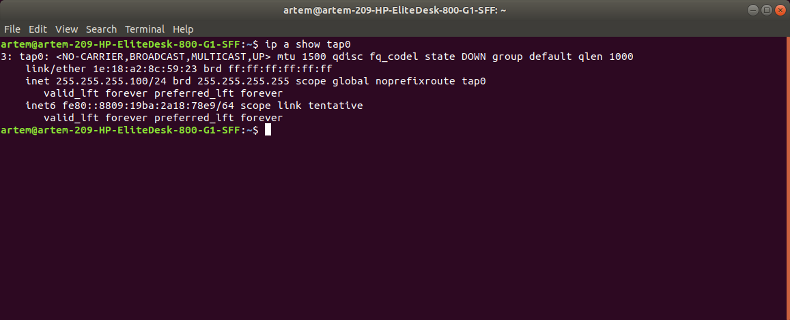
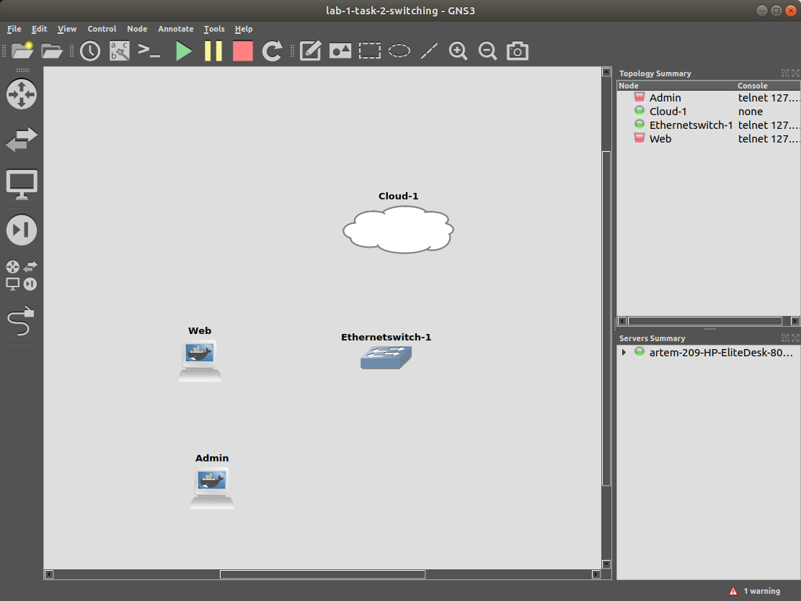

# INR Lab 1 - Networking Basics
#### Artem Abramov SNE19

May I suggest viewing this document in your browser at address: 
https://github.com/temach/innopolis_university_reports/blob/master/INR-Lab-1-Networking-Basics.md
Unfortunately rendering the document to PDF breaks some long lines and crops images.

## Task 1 - Tools

### 1. Install the needed dependencies for GNS3: QEMU/KVM , Docker , and Wireshark

I checked that virtualisation is enabled in bios with command:  
```
$ cat /proc/cpuinfo | egrep 'vmx'  
```
source: https://www.cyberciti.biz/faq/linux-xen-vmware-kvm-intel-vt-amd-v-support/

Then was installing Wireshark. During the install process there was a choice to create the special Wireshark group or not. I choose not to create it.   
```
$ sudo apt-get install wireshark-qt wireshark-doc 
```

Later I changed my mind and re-configured wireshark to create a special wireshark group by following this guide: https://code.wireshark.org/review/gitweb?p=wireshark.git;a=blob_plain;f=debian/README.Debian;hb=HEAD

Docker was installed using official documentation https://docs.docker.com/install/linux/docker-ce/ubuntu/ : 

Update the apt package index:  
```
$ sudo apt-get update
```

Install packages to allow apt to use a repository over HTTPS:
```
$ sudo apt-get install \
    apt-transport-https \
    ca-certificates \
    curl \
    gnupg-agent \
    software-properties-common
```
Add Docker’s official GPG key:
```
$ curl -fsSL https://download.docker.com/linux/ubuntu/gpg | sudo apt-key add -
```

Use the following command to set up the stable repository:
```
$ sudo add-apt-repository \
   "deb [arch=amd64] https://download.docker.com/linux/ubuntu \
   $(lsb_release -cs) \
   stable"
```
Update the apt package index again:  
```
$ sudo apt-get update
```

Install the latest version of Docker Engine - Community and containerd: 
```
$ sudo apt-get install docker-ce docker-ce-cli containerd.io
```

GNS3 was installed without installing QEMU separately, by following the instructions in the article for GNS3:
https://docs.gns3.com/1QXVIihk7dsOL7Xr7Bmz4zRzTsJ02wklfImGuHwTlaA4/index.html
```
$ sudo add-apt-repository ppa:gns3/ppa
$ sudo apt-get update
$ sudo apt-get install gns3-gui
```

According to the article to enable GNS3 to use docker my account must be added to the docker group:  
```
$ sudo usermod -a -G docker artem
```

Then I realised that I should probably install qemu-kvm 
separately and make sure that KVM is enabled.
I did this by following the guide at https://www.cyberciti.biz/faq/installing-kvm-on-ubuntu-16-04-lts-server/
```
sudo apt-get install qemu-kvm libvirt-bin virtinst bridge-utils cpu-checker
```

After installation I checked kvm using the supplied tool:  
```
$ kvm-ok  
INFO: /dev/kvm exists  
KVM acceleration can be used 
```

Finally added my account to various groups such as ubridge, libvirt, kvm, wireshark. 

In the end the groups for my account were as follows: 
```
$ groups
artem adm cdrom sudo dip plugdev lpadmin sambashare kvm ubridge libvirt wireshark docker
```

### 2. Start a GNS3 Project

Summary of the GNS3 setup is below.


Giving the project a name.


Because the template for Ubuntu Cloud Guest was not pre-installed I had to download and configure it.  

The instructions I used were from the official GNS3 guide: https://docs.gns3.com/appliances/ubuntu-cloud.html

I download the appliance file: https://raw.githubusercontent.com/GNS3/gns3-registry/master/appliances/ubuntu-cloud.gns3a  

Then I imported the .gns3a file in GNS3, following the tutorial: https://docs.gns3.com/1_3RdgLWgfk4ylRr99htYZrGMoFlJcmKAAaUAc8x9Ph8/index.html  

From then on I just followed the menus.
(In the process I had to download the .iso images for the supported Ubuntu version from this link https://docs.gns3.com/appliances/ubuntu-cloud.html#appliance_supported)

Screenshot showing possible versions of the Ubuntu Cloud Guest appliance.


Screenshot of the configuration summary for Ubuntu Cloud Guest.


To get familiar with the GNS3 interface I used the getting started instructions from the GNS3 website. Two particularly useful links were:
1. Example connecting to the Internet: https://docs.gns3.com/1vFs-KENh2uUFfb47Q2oeSersmEK4WahzWX-HrMIMd00/index.html
2. Index of Getting Started documentation: https://docs.gns3.com/1FFbs5hOBbx8O855KxLetlCwlbymTN8L1zXXQzCqfmy4/index.html

Screenshot of the created appliance instance.


The final step was to check that the Ubuntu guest can start.
The machine indeed booted successfully and presented a login prompt. Although it spend about 30 seconds waiting for a start job on boot, the exact job description was 'A start job is running for Wait for Network to be Configured (15s / no limit)'

Screenshot of the console prompt from Ubuntu cloud guest.


### 3. What are the different ways you can configure internet access in GNS3?

#### 1. Ethernet Cloud connection 

##### Easy to setup in GNS3, but it bypasses the TCP/IP stack of the host machine, so there is no connection between the guest and the host.


In other words this means that when the GNS3 guest is using the wire the host can not use it at the same time. This causes difficult to track down connectivity issues for both guest and host. (for example pinging google.com from the host and the guest at the same time is impossible. Ethernet cloud connection is uncomfortable to use, because normally one  wants to access the network from the host and from the guest simultaneously).

First of all I changed the netplan configuration inside the Ubuntu cloud guest to match the network setup of the host. Source: https://www.howtoforge.com/linux-basics-set-a-static-ip-on-ubuntu

Screenshot of the Ubuntu cloud network config.


After that the network still appeared to be broken. The next step to try was reverting the network configuration in GNS3 to legacy mode. This appeared to have fixed the issue.

Screenshot of the GNS3 network configuration for Ubuntu guest.


Screenshot of successful ping from inside the Ubuntu guest.


Screenshot of the resulting topology created in GNS3 to test the Ethernet cloud connection.


#### 2. TAP Cloud connection

##### Tap device is used on the host to receive data from the guest. Quite easy to setup.

I created the TAP interface on the host using the Network Manager CLI as described in this source: https://mail.gnome.org/archives/networkmanager-list/2016-January/msg00049.html

Screenshot showing the configuration of the TAP interface on the host.


To test this connection I created a new GNS3 project.
I was extremely  unsatisfied with Ubuntu Cloud guest, so I diverged from the rules and experimented with using Alpine-Linux and Kali-Linux as a guest. Eventually I settled on the Kali-Linux guest.
Therefore this type of connection was tested with the Kali-Linux guest.

(I found Kali-Linux guest to be by a long shot better than the Ubuntu guest.
First of all Kali uses the familiar ifupdown and /etc/network/interfaces instead of netplan, second the Kali appliance by default uses the VNC connection, I believe there are more benefits to be discovered.
A serious downside is that Kali must be installed by hand on each machine in the lab, which takes time and hard drive space - 9.6GB for base install with X server.)

The next step was creating a Kali guest in GNS3 and configuring its network and default gateway to suit the TAP interface on the host.

Screenshot of the network configuration on the Kali guest.


Screenshot of the topology created in GNS3.


Then I checked that packet forwarding was enabled on the host.
```
$ cat /proc/sys/net/ipv4/ip_forward
1
```
source: http://www.ducea.com/2006/08/01/how-to-enable-ip-forwarding-in-linux/

The last step was to set the host to act as a NAT for the traffic leaving the Kali guest.
This was done by running the following command on the host:
```
sudo iptables -t nat -A POSTROUTING -s 255.255.255.0/24 -o eno1 -j MASQUERADE
```
The command means take traffic with source IP in the 255.255.255.0/24 subnet and send it to eth0 interface after applying NAT.
Source: https://openvpn.net/community-resources/how-to/#routing-all-client-traffic-including-web-traffic-through-the-vpn.
Thus the traffic can go from the 255.255.255.0/24 subnet to the Internet and return. Communication from the host to the guest is also possible because of the last routing rule in the output:
```
$ ip route
default via 188.130.155.33 dev eno1 onlink 
169.254.0.0/16 dev eno1 scope link metric 1000 
172.17.0.0/16 dev docker0 proto kernel scope link src 172.17.0.1 linkdown 
188.130.155.32/27 dev eno1 proto kernel scope link src 188.130.155.42 
192.168.122.0/24 dev virbr0 proto kernel scope link src 192.168.122.1 linkdown 
255.255.255.0/24 dev tap0 proto kernel scope link src 255.255.255.100 metric 450 
```

After the iptables rule was applied the Kali guest could ping google.com and communication between the guest and the host was also possible.

Screenshot showing pings from the host to the Kali guest, from the Kali guest to the host and from the Kali guest to google.com.


#### 3. Linux Bridge and NAT Cloud connection 

##### To allow communication between guest and host a virtual bridge is used, NAT is used to allow connection to the internet. Very easy to setup.

This appears to be similar to how docker operates (https://www.securitynik.com/2016/12/docker-networking-internals-how-docker_16.html).

To setup the bridge on the host I followed two in depth articles:
1. Overview of Linux bridging: https://cloudbuilder.in/blogs/2013/12/08/tap-interfaces-linux-bridge/
2. Creating a bridge: https://cloudbuilder.in/blogs/2013/12/02/linux-bridge-virtual-networking/

Decided to reuse the bridge that already existed on the host: virtbr0.
This bridge was created by installing libvirt. It can be configured
with
```
$ virsh net-edit default
```
source: https://www.bernhard-ehlers.de/blog/2017/07/11/gns3-cloud-linux.html

Just following along with the default configuration, as shown on the screenshot below:


The next step editing configuration of the GNS3 cloud to use virbr0 as its Ethernet interface. To be able to select the non-physical interface the box "Show special Ethernet interfaces" had to be ticked. Screenshot of configuration for the cloud is below.


After that connection inside the Kali guest started working. 
The IP allocation on the side of Kali guest was done automatically because libvirt provides DHCP.
The screenshot below shows that the Kali guest connect to the virbr0 bridge by a newly created virtual interface "gns3tap0-2".


The bridge does not have a physical interface connected to it, however traffic flow and NAT is handled by iptable rules.
```
$ sudo iptables -t nat -vnL POSTROUTING
Chain POSTROUTING (policy ACCEPT 17296 packets, 1089K bytes)
 pkts bytes target     prot opt in     out     source               destination         
   60  5281 RETURN     all  --  *      *       192.168.122.0/24     224.0.0.0/24        
    0     0 RETURN     all  --  *      *       192.168.122.0/24     255.255.255.255     
    3   180 MASQUERADE  tcp  --  *      *       192.168.122.0/24    !192.168.122.0/24     masq ports: 1024-65535
    7   532 MASQUERADE  udp  --  *      *       192.168.122.0/24    !192.168.122.0/24     masq ports: 1024-65535
    2   168 MASQUERADE  all  --  *      *       192.168.122.0/24    !192.168.122.0/24 
```
source: https://stackoverflow.com/questions/37536687/what-is-the-relation-between-docker0-and-eth0 (and https://serverfault.com/questions/891208/why-is-a-physical-interface-not-part-of-the-docker-gwbridge)

Screenshot of ping working in Kali guest.


Screenshot of the topology created in GNS3.


## Task 2 - Switching

To create this topology I used a pair of Kali Linux CLI guests (without X server installed). A slight problem was that the default appliance file supplied with GNS3 has been referencing a non-existent docker tag "gns3/kalilinux:v2". The appliance file was modified to reference the latest docker image "gns3/kalilinux:latest" located at https://hub.docker.com/r/gns3/kalilinux/tags. After this the Kali Linux CLI appliance was created successfully.

#### 1. Make the following network topology:
The first step step was to setup the cloud connection. For this I used a bridged network with NAT as suggested by the diagram.

Screenshot of the initial topology created in GNS3.


Screenshot of configuration for the cloud is below.


Screenshot of configuration for the switch. Unused slots were deleted.


Screenshot showing the joining of different appliances is below.


#### 2. Install openssh-server on both VMs and nginx web server on the Web VM

The first step was to setup the Web Kali guest. The Admin Kali guest would be setup analogously. 

On startup the Kali guest did not get an IP address assigned.
The first step to getting internet connectivity was to allow the DHCP for the eth0 interface in order to get the IP address. Screenshot of /etc/network/interfaces is below, the lines concerning DHCP on eth0 are not commented.


After the config was modified the interface was successfully brought up with ifup:
```
root@Web:/# ifup eth0
Internet Systems Consortium DHCP Client 4.3.5
Copyright 2004-2016 Internet Systems Consortium.
All rights reserved.
For info, please visit https://www.isc.org/software/dhcp/

Listening on LPF/eth0/4a:18:68:55:bd:99
Sending on   LPF/eth0/4a:18:68:55:bd:99
Sending on   Socket/fallback
DHCPDISCOVER on eth0 to 255.255.255.255 port 67 interval 7
DHCPREQUEST of 192.168.122.142 on eth0 to 255.255.255.255 port 67
DHCPOFFER of 192.168.122.142 from 192.168.122.1
DHCPACK of 192.168.122.142 from 192.168.122.1
bound to 192.168.122.142 -- renewal in 1768 seconds.
```

Then nginx and openssh server were installed.

```
# apt-get update && apt-get install openssh-server nginx
```

For ease of access from remote machines I decided to enable root login in ssh daemon. The following line was added to /etc/ssh/sshd_config:
```
PermitRootLogin yes
```

The init system used on the Kali Linux guest is sys-v. 
By the default Kali policy ssh and nginx init scripts were left disabled.
Enabling ssh and nginx services on system startup:
```
# update-rc.d ssh enable && service ssh start
# update-rc.d nginx enable && service nginx start
```
source: https://www.debuntu.org/how-to-managing-services-with-update-rc-d/

Next step was testing that nginx server is up and serves a Welcome page:
```
# curl 127.0.0.1:80
<!DOCTYPE html>
<html>
<head>
<title>Welcome to nginx!</title>
<style>
    body {
        width: 35em;
        margin: 0 auto;
        font-family: Tahoma, Verdana, Arial, sans-serif;
    }
</style>
</head>
<body>
<h1>Welcome to nginx!</h1>
<p>If you see this page, the nginx web server is successfully installed and
working. Further configuration is required.</p>

<p>For online documentation and support please refer to
<a href="http://nginx.org/">nginx.org</a>.<br/>
Commercial support is available at
<a href="http://nginx.com/">nginx.com</a>.</p>

<p><em>Thank you for using nginx.</em></p>
</body>
</html>
```

Finally the steps to setup openssh server were repeated on the Admin kali guest.


Here a problem arises because the Kali Linux CLI image uses docker containers. Docker containers are not persistent by default and GNS3 does NOT support automatically handling them persistently. Therefore it has to be done manually. To make a container persistent the "docker commit" command can be used. 
source: https://www.bernhard-ehlers.de/blog/2017/07/05/gns3-modify-docker-base-image.html

List all docker containers and make a new image from one of the changed containers:
```
$ sudo docker container ls
CONTAINER ID        IMAGE                   COMMAND                  CREATED             STATUS              PORTS               NAMES
364c57b19c74        gns3/kalilinux:latest   "/gns3/init.sh /bin/…"   24 minutes ago      Up 24 minutes                           great_hopper
1afd45f63cbd        gns3/kalilinux:latest   "/gns3/init.sh /bin/…"   24 minutes ago      Up 15 minutes                           amazing_visvesvaraya

$ sudo docker commit 1afd45f63cbd kali-lab1-task1-web
sha256:80aececdbdb3e04ffbb9a5c0480fc8a4f168335d976a6e6ef861f1d62dfe6a87
```
source: https://thenewstack.io/container-basics-how-to-commit-changes-to-a-docker-image/

Then easily import the new image into GNS3. Source: https://docs.gns3.com/14EmmKdryY3FiMOQEclSyHQ3MUlycDGE_DwNPC8L4GIc/index.html.
First choose "New appliance template". 

Select new Docker container as shown in the screenshot below.


Select one of the newly created docker containers present on your system as show in the screenshot below.


This actually has to be done only once and its best done when creating the appliance for the first time. If done at the time of appliance creation, then subsequent updates to the container will require only to run the "docker commit" with the container ID and the same image name. The image will be overwritten with new container state. To make it even easier you can use "docker rename" to give meaningful names to containers.


#### 3 Questions.

##### What is the IP of the mask corresponding to /28 ?

The question refers to different IP notation. The netmask of /28 = 255.255.255.240

##### How many machines can you configure under this subnet?

16 - 2 = 14 machines

##### What would be their IPs?

From xxx.xxx.xxx.241 to xxx.xxx.xxx.254.

#### 4. Configure the VMs with private static IPs under a /28 subnet.

Creating a bridged with static addresses is best done by using libvirt.
If using libvirt is impossible the same steps can be performed without it: https://jamielinux.com/docs/libvirt-networking-handbook/custom-nat-based-network.html.

The documentation for libvirt, basic commands and explanations can be found in official wiki: https://wiki.libvirt.org/page/Networking.
By default, libvirt uses config for a virtual network named "default". The details vary by distribution but on Ubuntu this default network is configured as:

1. A Linux bridge named virbr0 with IP address 192.168.122.1/24
2. A dnsmasq process (DHCP) on the virbr0 interface that hands out IP addresses in the range 192.168.122.2-192.168.122.254
3. A set of iptables rules for NAT

Its important to understand what a bridge in Linux actually is: https://web.archive.org/web/20071018021348/http://linux-net.osdl.org/index.php/Bridge. (a switch with some peculiarities)

For some reason slight tweaks to the "default" network such as disabling DHCP brake its functionality somehow. Therefore a new network must be created, that would be independent of the "default" provided by libvirt.
```
virsh net-dumpxml default > lab1net.xml
```

Edit the config file. Details of the XML configuration syntax can be found at https://libvirt.org/formatnetwork.html.

Must make sure that `<forwarding>` uses `NAT` mode. In this case the ip 
address specified in `<ip>` tag will become the default gateway router that 
will NAT the traffic from local network to the outside. Finally DHCP can be
enabled or disabled. For this task it should be disabled as the IP
addresses will be statically assigned. Note that the DHCP server is disabled by default and that many tags can be
omitted, such as UUID and MAC address, as they will be auto generated.


(In case `<forwarding>` uses `routing` mode then the virtual network will be directly bridged to the physical LAN, source https://wiki.debian.org/BridgeNetworkConnections and https://jamielinux.com/docs/libvirt-networking-handbook/bridged-network.html). 

Edit lab1net.xml to have the content as on the screenshot below.


A network must then be created from the definition.
```
$ virsh net-create lab1net.xml
```

Then the network can be started.
```
$ virsh net-start lab1net
```

Check that the network is running.
```
$ virsh net-list
 Name                 State      Autostart     Persistent
----------------------------------------------------------
 default              active     yes           yes
 lab1net              active     no            yes
```

If you later need to change some network parameters remember to destroy and 
start the network for your changes to have an effect.
```
virst net-destroy lab1net && virsh net-start lab1net
```

Check the libvirt lab1net network configuration.
It must resempble the config as shown below, after the auto generated fields have been added.


The next step is to reconfigure the cloud appliance in GNS3 to use the new
network. Press the "Refresh" button in GUI to have the virbrlab1 show up
as an option. Configuration screenshot is below. 


Then give each VM its personal static IP address by specifying it in /etc/network/interfaces. Screenshot is below.


The configuration can be activated with `ifdown eth0 && ifup eth0`.

The web VM has address 192.168.122.243.
The admin VM has ip address 192.168.122.242.

Check that the IP address is assigned, the ping to the internet works and
the ping to the neighbour machine also works.


(Now is a good time to commit changes to the docker images.)

The resulting topology is below.


#### 5. Check that you have connectivity between them

Ping from Admin to Web, screenshot is below.


Traceroute from Admin to Web, screenshot is below.


Mtr from Admin to Web, screenshot is below.


#### 6. Make sure your web server is accessible from the Admin VM.

Retrieving nginx webpage located in the Web machine from the Admin machine is show below.


## Task 3

#### 1. Choose your OS and configure a template for it in GNS3.
My OS of choice is the Kali Linux CLI docker image. After creating the 
gateway machine I gave it two network adapters. Screenshot is below.


#### 2. Modify your network to look like this topology and configure the network for Internal with a subnet of the same size as the previous one

The topology is shown on the screenshot below.


The next step was configuring the subnet on the Internal network.
I decided to use the 10.0.250.240/28 for the Internal network. The External network is already configured to use 192.168.250.240/28.

The configuration of the gateway machine is shown below.


To clear old IP configuration I used the following command:
```
# ip addr flush dev eth0
```
source: https://superuser.com/questions/153559/how-can-i-clear-the-ip-address-of-ethernet-interface-without-cycling-the-interfa

The Worker machine was a bit different, but was configurable after reading command help in the prompt: 
```
>  ip 10.0.250.242/28 10.0.250.241
Checking for duplicate address...
PC1 : 10.0.250.242 255.255.255.240 gateway 10.0.250.241
> ip dns 8.8.8.8
```

The resulting network configurations for all 4 machines are shown below.


#### 3. Connect your gateway to a bridged interface and to the switches.

The gateway is already connected to both switches. 
The only bridged interface that is not connected is the cloud. Therefore I 
understood this sub-task as instructing me to connect the gateway to the 
internet via the cloud bridge.

To connect the gateway to the cloud I added a third network adapter to the machine as shown in the screenshot below.


Screenshot of the resulting topology is below.


#### 4. Configure the IP address and enable IPv4 forwarding on the gateway.

It was possible to edit the network configuration for the gateway machine 
straight in the GNS3 gui window. I decided that the eth2 (which is 
connected to the bridged interface) will use DHCP for ip configuration.
Knowing that the cloud network uses the 192.168.122.0/24 setup I re-configured the gateway machine. Note that both eth0 and eth1 have the same setup for the gateway.

This is shown in the screenshot below.


Verify that IPv4 forwarding is enabled on the gateway machine.
```
# cat /proc/sys/net/ipv4/ip_forward
1
```

#### 5. Configure NAT for the Internal and External Networks.

This means applying NAT rules to the packets flowing from Internal network 
to the internet and to the packets flowing from the External network to the 
internet. (and of course applying reverse NAT rules to response packets).

On the gateway execute the following commands:
```
# iptables -t nat -A POSTROUTING -s 10.0.250.240/28 -o eth2 -j MASQUERADE
# iptables -t nat -A POSTROUTING -s 192.168.250.240/28 -o eth2 -j MASQUERADE
```

Check the Nat table:
```
# iptables --list -t nat
Chain PREROUTING (policy ACCEPT)
target     prot opt source               destination         

Chain INPUT (policy ACCEPT)
target     prot opt source               destination         

Chain OUTPUT (policy ACCEPT)
target     prot opt source               destination         

Chain POSTROUTING (policy ACCEPT)
target     prot opt source               destination         
MASQUERADE  all  --  10.0.250.240/28      anywhere            
MASQUERADE  all  --  192.168.250.240/28   anywhere  
```

Check the routing rules:
```
# ip route list
default via 192.168.122.1 dev eth2 metric 258 
10.0.250.240/28 dev eth1 proto kernel scope link src 10.0.250.241 
192.168.122.0/24 dev eth2 proto kernel scope link src 192.168.122.161 
192.168.250.240/28 dev eth0 proto kernel scope link src 192.168.250.241
```

#### 6. Change the gateway of Admin and Web and check their network connectivity.

The gateway address has already been changed as part of the previous step, 
so there is nothing to change here.

Checking their network connectivity from Admin by pinging Web and google.com:


Checking connectivity from the Worker machine is below.


#### 7. Configure port forwarding for HTTP and ssh to Web and Admin respectively.

We use two rules, one for Web (HTTP port 80) and one for Admin (ssh port 22):
```
# iptables -t nat -A PREROUTING -i eth2 -p tcp --dport 80 -j DNAT --to-destination 192.168.250.243
# iptables -t nat -A PREROUTING -i eth2 -p tcp --dport 22 -j DNAT --to-destination 192.168.250.242
```
source: https://www.digitalocean.com/community/tutorials/how-to-forward-ports-through-a-linux-gateway-with-iptables and https://access.redhat.com/documentation/en-US/Red_Hat_Enterprise_Linux/4/html/Security_Guide/s1-firewall-ipt-fwd.html.

Because we have NAT enabled, the traffic can not enter. So the rules just allow the traffic to enter and push it to a certain machine on the network. 
When that machine answers it will reply to the external IP address which was supplied in the 
packet. 

Check the NAT table:
```
# iptables --list -t nat
Chain PREROUTING (policy ACCEPT)
target     prot opt source               destination         
DNAT       tcp  --  anywhere             anywhere             tcp dpt:http to:192.168.250.243
DNAT       tcp  --  anywhere             anywhere             tcp dpt:ssh to:192.168.250.242

Chain INPUT (policy ACCEPT)
target     prot opt source               destination         

Chain OUTPUT (policy ACCEPT)
target     prot opt source               destination         

Chain POSTROUTING (policy ACCEPT)
target     prot opt source               destination         
MASQUERADE  all  --  10.0.250.240/28      anywhere            
MASQUERADE  all  --  192.168.250.240/28   anywhere 
```

#### 8. Check that you can ssh to the Admin and access your web page from the outside.

Successfull retrieval of webpage from the Web host is shown below.


For the ssh to work, first we must either PermitRootLogin on the remote server and then login with as a root user with root password or we can create a non-root user.
Creating a dummy user is shown below.


Then we can login to ssh from the host and retrieve the webpage from inside the network.


#### 9. Replace your current gateway with the OS you chose.

I decided to replace the gateway with an OpenWRT router.

To install it I followed the official instructions, source https://docs.gns3.com/appliances/openwrt.html. OpenWRT is essentially a trimmed down Linux box, so configuration steps are identical to the gateway. OpenWRT provides a web interface for configuration as well as ssh access.

Screenshot of the web interface.


I decided to use ssh to access the router. The password is empty on first login.
```
$ ssh root@192.168.122.3
The authenticity of host '192.168.122.3 (192.168.122.3)' can't be established.
RSA key fingerprint is SHA256:G+rKufEW32FkNxUV3cox0ba0sH0q/QWm+saWPr4qZMM.
Are you sure you want to continue connecting (yes/no)? yes           
Warning: Permanently added '192.168.122.3' (RSA) to the list of known hosts.
root@192.168.122.3's password:

BusyBox v1.28.4 () built-in shell (ash)

  _______                     ________        __
 |       |.-----.-----.-----.|  |  |  |.----.|  |_
 |   -   ||  _  |  -__|     ||  |  |  ||   _||   _|
 |_______||   __|_____|__|__||________||__|  |____|
          |__| W I R E L E S S   F R E E D O M
 -----------------------------------------------------
 OpenWrt 18.06.2, r7676-cddd7b4c77
 -----------------------------------------------------

root@OpenWrt:~# 
```

#### 10. What extra capabilities does your new OS give you?

Compared to using Ubuntu on the gateway, OpenWRT router is easier to setup and use, because it provides a nice web interface. With the interface many of the most common tasks in networking can be configured. In Ubuntu network configuration requires a bit of extra skills/experience. OpenWRT has a image generation program that provides the ability to create system images with preconfigured network settings. The images can then easily be installed on other routers, which is very useful when setting up a large network. OpenWRT is a GNU/Linux OS, so its possible to extend its usage beyond what was intended. 