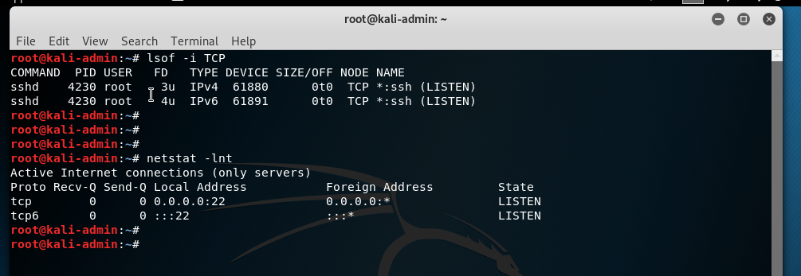
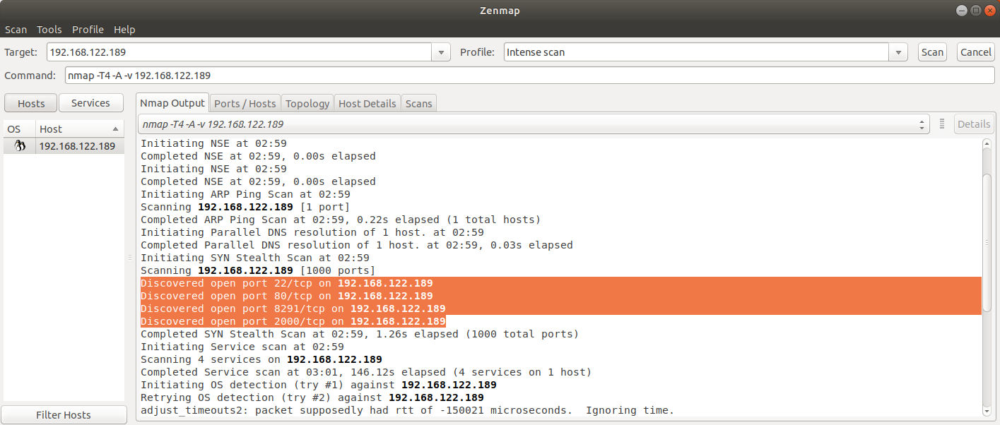

# INR Lab 2 - IPv4 & IPv6

#### Artem Abramov SNE19

May I suggest viewing this document in your browser at address: 
https://github.com/temach/innopolis_university_reports/blob/master/INR-Lab-2-ipv4-and-ipv6.md
Unfortunately rendering the document to PDF breaks some long lines and crops images.

## Task 1 - Ports and Protocols

The setup of the end devices for this lab:

1. 10.0.3.2 - Web (@kali-web)
2. 10.0.3.3 - Admin (@kali-admin)
3. 10.0.4.2 - Worker (@kali-worker)

The network setup for this lab:

1. External network: 10.0.3.0/28
2. Internal network: 10.0.4.0/28

Source of information for everything related to nmap: https://nmap.org/book/toc.html


### 1. Check the open ports and listening Unix sockets against ssh and http on Admin and Web respectively. Hint: use lsof, netstat

Screenshot of listening ports on Admin (only ssh) is below:



Screenshot of listening ports on Web (ssh + nginx) is below:


### 2. Scan your gateway from the outside. What are the known open ports? Hint: use nmap

First install nmap: `sudo apt-get install nmap`.


The open ports and their services are:

1. 21 - FTP
2. 22 - SSH
3. 23 - telnet
4. 80 - HTTP
5. 2000 - cisco-sccp 
6. 8291 - unknown service

The FTP, telnet, cisco-sccp and unknown service are the default services started by MikroTik router that allow to interact with it. Because the gateway has a forwarding rule the SSH is Admin response and the HTTP is the Web response to the nmap probes.


### 3. A gateway should be transparent, you should not see any port that is not specifically forwarded. Adjust your firewall rules to make this happen. Disable any unnecessary services and scan again.

The current services can be found in IP->Sevices menu.

%20-%20WinBox%20v6.44.2%20on%20CHR%20(x86_64)_131.png)


After disabling unnecessary services, I scanned the gateway again. This time out of curiosity I decided to use Zenmap, which is a graphical interface to the nmap tool.




### 4. Some scanners start by scanning the known ports and pinging a host to see if it is alive.

#### Scan the Worker VM from Admin . Can you see any ports?

The SSH port 22 is open as shown on the Screenshot below:

%20-%20TigerVNC_135.png)

#### Block ICMP traffic on Worker and change the port for SSH to one that is above 10000.

To block ICMP traffic on Worker I used a kernel parameter:

```
$ echo "1" >  /proc/sys/net/ipv4/icmp_echo_ignore_all
```

And changed the SSH port by editing Port variable in /etc/ssh/sshd_config and restarting ssh service on Worker.


%20-%20TigerVNC_137.png)

#### Scan it without extra arguments.


%20-%20TigerVNC_138.png)


#### Now make necessary changes to the command to force the scan on all possible ports.

%20-%20TigerVNC_139.png)


#### Gather some information about your open ports on Web ( ssh and http ).

I used the command below:

```
artem@kali-admin:~# nmap -sS -sU -T4 -A -v -p 22,80 10.0.3.2
```

(quick options explanation: https://explainshell.com/explain?cmd=nmap+-sS+-sU+-T4+-A+-v+-p+22%2C80+10.0.3.2 )

The scan discovered quite interesting things. It could even guess the type of the OS based on how the TCP/IP stack responded: Linux 3.X|4.X. It discovered the version of the ssh server on port 22: `OpenSSH 7.9p1 Debian 5 (protocol 2.0)` and the version of nginx on port 80: `nginx 1.14.2`.


```

# nmap -sS -sU -T4 -A -v -p 22,80 10.0.3.2
Starting Nmap 7.70 ( https://nmap.org ) at 2019-09-02 20:37 EDT
NSE: Loaded 148 scripts for scanning.
NSE: Script Pre-scanning.
Initiating NSE at 20:37
Completed NSE at 20:37, 0.00s elapsed
Initiating NSE at 20:37
Completed NSE at 20:37, 0.00s elapsed
Initiating ARP Ping Scan at 20:37
Scanning 10.0.3.2 [1 port]
Completed ARP Ping Scan at 20:37, 0.00s elapsed (1 total hosts)
Initiating Parallel DNS resolution of 1 host. at 20:37
Completed Parallel DNS resolution of 1 host. at 20:37, 0.03s elapsed
Initiating SYN Stealth Scan at 20:37
Scanning 10.0.3.2 [2 ports]
Discovered open port 22/tcp on 10.0.3.2
Discovered open port 80/tcp on 10.0.3.2
Completed SYN Stealth Scan at 20:37, 0.00s elapsed (2 total ports)
Initiating UDP Scan at 20:37
Scanning 10.0.3.2 [2 ports]
Completed UDP Scan at 20:37, 0.00s elapsed (2 total ports)
Initiating Service scan at 20:37
Scanning 2 services on 10.0.3.2
Completed Service scan at 20:37, 6.02s elapsed (2 services on 1 host)
Initiating OS detection (try #1) against 10.0.3.2
NSE: Script scanning 10.0.3.2.
Initiating NSE at 20:37
Completed NSE at 20:37, 0.12s elapsed
Initiating NSE at 20:37
Completed NSE at 20:37, 0.00s elapsed
Nmap scan report for 10.0.3.2
Host is up (0.0011s latency).

PORT   STATE  SERVICE VERSION
22/tcp open   ssh     OpenSSH 7.9p1 Debian 5 (protocol 2.0)
| ssh-hostkey: 
|   2048 20:d2:e7:f6:72:cb:5c:5f:6d:d5:66:bb:2f:da:47:07 (RSA)
|   256 b6:37:e0:19:6f:d5:ad:5b:4b:f9:51:be:25:3b:42:e9 (ECDSA)
|_  256 9e:91:c6:17:b1:38:55:f0:0b:40:a9:b3:6d:ca:18:1f (ED25519)
80/tcp open   http    nginx 1.14.2
| http-methods: 
|_  Supported Methods: GET HEAD
|_http-server-header: nginx/1.14.2
|_http-title: Apache2 Debian Default Page: It works
22/udp closed ssh
80/udp closed http
MAC Address: 0C:50:4B:A0:50:00 (Unknown)
Warning: OSScan results may be unreliable because we could not find at least 1 open and 1 closed port
Device type: general purpose
Running: Linux 3.X|4.X
OS CPE: cpe:/o:linux:linux_kernel:3 cpe:/o:linux:linux_kernel:4
OS details: Linux 3.2 - 4.9
Uptime guess: 1.834 days (since Sun Sep  1 00:36:19 2019)
Network Distance: 1 hop
TCP Sequence Prediction: Difficulty=261 (Good luck!)
IP ID Sequence Generation: All zeros
Service Info: OS: Linux; CPE: cpe:/o:linux:linux_kernel

TRACEROUTE
HOP RTT     ADDRESS
1   1.12 ms 10.0.3.2

NSE: Script Post-scanning.
Initiating NSE at 20:37
Completed NSE at 20:37, 0.00s elapsed
Initiating NSE at 20:37
Completed NSE at 20:37, 0.00s elapsed
Read data files from: /usr/bin/../share/nmap
OS and Service detection performed. Please report any incorrect results at https://nmap.org/submit/ .
Nmap done: 1 IP address (1 host up) scanned in 8.16 seconds
           Raw packets sent: 27 (1.964KB) | Rcvd: 19 (1.492KB)
```


## Task 2 - Traffic Captures & IPv6

### 1. Access your Web Page from the outside and capture the traffic between the gateway and the bridged interface.

Screenshot of the topology is shown below:


I ran wireshark on the connection between ether3 and virbr0 and requested the http://192.168.122.189/ from the browser on the host. Screenshot showing HTTP traffic capture is shown below:


#### Can you see what is being sent?

There is a great wealth of information. Most of it is quite self-explanatory. Greenish color highlights the lines that directly relate to the HTTP protocol, i.e. to the request for the web page from the host. First there is a three way TCP handshake, after that the connection is established an a GET request is send by the browser to the server. The browser is at the address 192.168.122.1 and the server is at address 192.168.122.189 on the virbr0 virtual bridge (with network 192.168.122.0/24). The first HTTP GET request must have specified the `keep-alive` header because even though there are a total of 3 HTTP requests and responses the TCP three way handshake is only performed once (at the beginning). We can also see some TCP traffic that is unrelated to the web page request.

#### What kind of information can you get from this?

We know what packets are travelling through the network. We know their size, their source and destination address and port numbers, so we can take a guess at what services are active on the network and we can understand whether the network is saturated, whether some packets are lost. We can take a guess at the topology of the network. If the packet is unencrypted we can inspect the actual information exchanged between the services on different machines.

### What do the headers mean?

The headers describe how the data that is put on the wire is seen by the different layers of the OSI model and the programs working at those different layers. So an ethernet switch only concerns itself with the Frame and Ethernet layer which contain the MAC address of where to send the packet. A router (or an end machine) in addition to interpreting the Frame/Ethernet will also analyse the IPv4 header to find the destination IP and port number. The end computer's TCP/IP stack does the job of interpreting all the lower layers and additionally the TCP header. Finally in case of a Web server the nginx will interpret the HTTP header.


### 2. SSH to the Admin from the outside and capture the traffic (make sure to start capturing before connecting to the server)

The capture is shown below:


#### Can you see what is being sent?

We can see the TCP three way handshake, and the destination and source IP addresses, so we know what machines are communicating. However we dont know what they are communicating, because the data is encrypted.

#### What kind of information can you get from this?

As already stated, we can see what machines are communicating and how long their communication lasted and roughly the amount of data that they exchanged.

#### What are the names of the ciphers used?

The server provided a list of key generation/exchange algorithms and a list of encryption algorithms for the client to choose. 

In this case the client and server preferred to use (as can be seen in the header of each SSHv2 packet)

```
encryption: chacha20-poly1305@openssh.com
```

That is the stream cipher ChaCha20 (https://en.wikipedia.org/wiki/Salsa20) using Poly1305 (https://en.wikipedia.org/wiki/Poly1305) for verification.


### 3. Configure Burp Suite as a proxy on your machine and intercept your HTTP traffic.

To install Burp Suite I downloaded an installer script from https://portswigger.net/burp/communitydownload.

Then after executing the installer, the files were placed in a subfolder in my home directory as shown below:


Setup Burp as a proxy to intercept HTML files as shown below:


Next we need to give Burp some data to work with. Execute the wget command:


(source: https://stackoverflow.com/questions/11211705/how-to-set-proxy-for-wget)

At this moment Burp notices the request and we just let it continue by pressing Forward:


Successful completion:


#### Show that you can modify the contents by changing something in the request.


Lets request yandex.ru/index.html again, but change the request to be yandex.ru/favicon.ico. The wget output is below:


Note that we specifically requested /index.html, but got a 16x16 icon image.

#### Why are you able to do this here and not in an SSH connection?

Because SSH connection is encrypted and signed for integrity. We dont know what bytes to change and even if we would know, the party that send the request will know that the data has been tampered with (unless of course we can fake the integrity signature as well). HTTP is not encrypted on the other hand and it is not even checked for integrity (there is no checksum  send before/after/with the actual payload), so its very easy to modify.

### 4. Configure IPv6 from the Web Server to the Worker. This includes IPs on the servers and the default gateways.

IPv6 aims to get rid of NAT, however it still provides a fc00::/7 network that will not be routable. It is very useful in this case, because I dont have an ipv6 network dedicated to myself (which is strange, considering that we have white IPv4 address per SNE student, it makes sense to get a `/64` IPv6 subnet as well), so we have to use this ULA network (https://en.wikipedia.org/wiki/Unique_local_address).

The IPv6 setup will use two subnetworks. The IPv6 network setup for this lab:

1. External network: fc00::cafe:0000/112
2. Internal network: fc00::beef:0000/112

The gateway will be configured as:

1. ether1 = fc00::cafe:1
2. ether2 = fc00::beef:1

The setup of the end devices for this lab:

1. fc00::cafe:babe - Web (@kali-web)
2. fc00::cafe:face - Admin (@kali-admin)
3. fc00::beef:dead - Worker (@kali-worker)


The first step is enabling IPv6 in Mikrotik router. This requires enabling a package. In the menu follow System -> Packages -> ipv6. After clicking the ipv6 package, you must reboot the router for it to be enabled (in the menu follow System -> Shutdown).

Then we should configure the gateway addresses on each of the Mikrotik interfaces.

%20-%20WinBox%20v6.44.2%20on%20CHR%20(x86_64)_163.png)

We are not going to configure the IPv6 on the virbr0 interface. 

Then each machine had to be configured. Below is configuration of the worker machine `/etc/network/interfaces`, the other machines were configured in a similar manner:
%20-%20TigerVNC_168.png)

Below is a test of each machine which shows:

1. Its eth0 ip addresses.
2. Ping to machine on another network (external -> internal and vice versa).

Web below:

%20-%20TigerVNC_164.png)

Admin below:

%20-%20TigerVNC_165.png)


Worker below:

%20-%20TigerVNC_166.png)


### 5. Access the Web Page using IPv6 from Admin while capturing again. Can you see the difference?

Wireshark was set to capturing traffic between Web e0 interface and the "External" ethernet switch. The output is below:


There is a new type of traffic ICMPv6 mixed with IPv4 traffic, which serves for Neighbour solicitation and advertisement, i.e. discovery service. The request to the server from admin was made with `curl` and was completed successfully. The request uses IPv6 addresses.
