# INR Lab 3 - VLANs and Fault Tolerance

#### Artem Abramov SNE19


## Task 1 - VLANs

### 1. Change the topology of your network to as follows, make the necessary configs

Below is a screenshot of my modified configuration:


Added two new machines: `HR` and `Management`. The `Worker` machine from the previous lab became the `ITManager` machine. 

A reminder of how the subnets (IPv4 and IPv6) are configured on the MicroTik router is shown below (login `admin` password is empty):

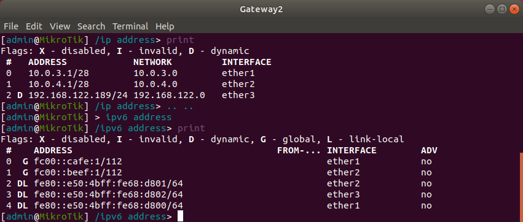

The `External` network is on `ether1`, the `Internal` network is on `ether2` and connection to the cloud is on the `ether3`.

Configuration for HR machine is shown below:

%20-%20TigerVNC_186.png)


Configuration for Management machine is shown below:

%20-%20TigerVNC_187.png)


After each configuration to apply the rules from `/etc/network/interfaces` I used `systemctl restart networking.service`.


### 2. Exchange the default switches Cumulus VX instances.

After installing the cumulus VX appliance I recorded the default login and password as shown on the screenshot below:


The adjusted network topology is shown below:


### 3. Configure the switches and make sure you have connectivity between the hosts.

Each switch was configured using the same steps. The process for one switch is shown below.

The first step was changing the login password to something simpler.

There was a problem with creating a new single-letter password `a`, because of the default pam_unix configuration that does a password complexity check. Below is a screenshot showing the resulting configuration for pam_unix module in `/etc/pam.d/common-password` that allows one letter passwords (the old line is commented out):

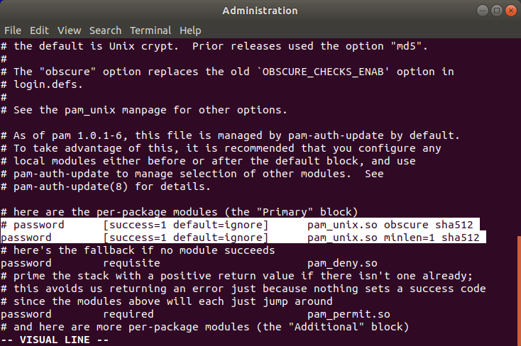


(source: https://askubuntu.com/questions/113682/how-to-change-disable-password-complexity-test-when-changing-password)

The next step was configuring the swpX interfaces. The interfaces need to be brought up (created), then they need to be added to a bridge.

The config for `/etc/network/interfaces` is shown below:
```
$ cat /etc/network/interfaces
# This file describes the network interfaces available on your system
# and how to activate them. For more information, see interfaces(5).

source /etc/network/interfaces.d/*.intf

# The loopback network interface
auto lo
iface lo inet loopback

# The primary network interface
auto eth0
iface eth0 inet dhcp

auto brswp0
iface brswp0 inet static
    bridge_ports swp1 swp2 swp3
```

Important information in the man page for `bridge-utils-interfaces` concerning the arguments to `bridge_ports`:
```
These ports  are  the  interfaces  that are part of the bridge, and they shouldn't have any stanzas defining them on the interfaces file.
```

To activate the configuration restart `networking.service`, then check that the configuration was applied as shown below:

```
$ ip a
1: lo: <LOOPBACK,UP,LOWER_UP> mtu 65536 qdisc noqueue state UNKNOWN group default 
    link/loopback 00:00:00:00:00:00 brd 00:00:00:00:00:00
    inet 127.0.0.1/8 scope host lo
       valid_lft forever preferred_lft forever
    inet6 ::1/128 scope host 
       valid_lft forever preferred_lft forever
2: eth0: <BROADCAST,MULTICAST,UP,LOWER_UP> mtu 1500 qdisc pfifo_fast state UP group default qlen 1000
    link/ether 0c:50:4b:09:19:00 brd ff:ff:ff:ff:ff:ff
    inet6 fe80::e50:4bff:fe09:1900/64 scope link 
       valid_lft forever preferred_lft forever
3: swp1: <BROADCAST,MULTICAST,UP,LOWER_UP> mtu 1500 qdisc pfifo_fast master brswp0 state UP group default qlen 1000
    link/ether 0c:50:4b:09:19:01 brd ff:ff:ff:ff:ff:ff
4: swp2: <BROADCAST,MULTICAST,UP,LOWER_UP> mtu 1500 qdisc pfifo_fast master brswp0 state UP group default qlen 1000
    link/ether 0c:50:4b:09:19:02 brd ff:ff:ff:ff:ff:ff
5: swp3: <BROADCAST,MULTICAST,UP,LOWER_UP> mtu 1500 qdisc pfifo_fast master brswp0 state UP group default qlen 1000
    link/ether 0c:50:4b:09:19:03 brd ff:ff:ff:ff:ff:ff
6: swp4: <BROADCAST,MULTICAST> mtu 1500 qdisc noop state DOWN group default qlen 1000
    link/ether 0c:50:4b:09:19:04 brd ff:ff:ff:ff:ff:ff
7: swp5: <BROADCAST,MULTICAST> mtu 1500 qdisc noop state DOWN group default qlen 1000
    link/ether 0c:50:4b:09:19:05 brd ff:ff:ff:ff:ff:ff
8: swp6: <BROADCAST,MULTICAST> mtu 1500 qdisc noop state DOWN group default qlen 1000
    link/ether 0c:50:4b:09:19:06 brd ff:ff:ff:ff:ff:ff
9: brswp0: <BROADCAST,MULTICAST,UP,LOWER_UP> mtu 1500 qdisc noqueue state UP group default 
    link/ether 0c:50:4b:09:19:01 brd ff:ff:ff:ff:ff:ff
    inet6 fe80::e50:4bff:fe09:1901/64 scope link 
       valid_lft forever preferred_lft forever
```

Note that swp1, swp2, swp3 are all UP and brswp0 bridge was created.

sources: 

1. https://wiki.archlinux.org/index.php/Network_bridge
2. `man interfaces`
3. `man bridge-utils-interfaces`


After applying the same settings to all 4 Cumulus switches, the next step is checking connectivity. 

Below is HR pinging the ITManager:

%20-%20TigerVNC_191.png)


Below is Web pinging Management:

%20-%20TigerVNC_192.png)


Below is ITManager pinging Admin:

%20-%20TigerVNC_190.png)


The other tests results were omitted for brevity.


### 4. How do VLANs work at a packet level ? What are the two major protocols used for this ?

Just to clarify what is a VLAN, quoting from `Interconnections: Bridges, Routers, Switches, and Internetworking Protocols - Addison-Wesley Professional (1999)` by `Radia Perlman` specifically `Chapter 5.3`:

	A VLAN is is the territory over which a broadcast (or multicast) packet is delivered (also known as a broadcast domain ). The difference between a VLAN and a LAN, if there is any, is in packaging. Virtual LANs allow you to have separate LANs among ports on the same switch. For example, a switch might be told that ports 1–32 are in VLAN A and ports 33–64 are in VLAN B.

VLAN operates at the level of Ethernet frames (i.e. which is below what is commonly understood as "packet", so to be pedantic the question appears to be misformulated).

Lets further limit the discussion to wired networks (copper wire) there are two most common types of Ethernet frames:
1. Ethernet II (derived from Ethernet invented at Xerox parc)
2. Ethernet 802.3 (Ethernet II that was standardised with some changes by the IEEE 802.3 comittee)

The Ethernet frames are tagged with a VLAN tag. It is a 2 byte value 3 bits for VLAN priority, 12 bits for VLAN ID and 1 bit for indicating whether the VLAN ID is in a canonical format. The Ethernet frame must also define the presence of a VLAN tag by setting the packet type field (TPID) to 0x8100 (2-bytes). 

Ethernet II packet without a VLAN tag is shown below:

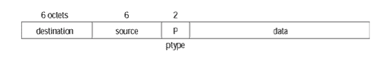


The same packet after being tagged with VLAN tag is shown below:

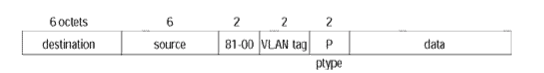

Ethernet 802.3 packet without a VLAN tag is shown below:

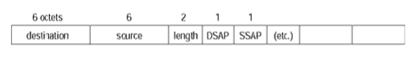


Ethernet 802.3 packet after being tagged with VLAN tag is shown below:

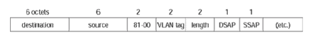

How VLAN is tagged is described by the 802.1Q standard.

sources:
1. `Interconnections: Bridges, Routers, Switches, and Internetworking Protocols`  Addison-Wesley Professional (1999) by Radia Perlman
2. http://www.ieee802.org/1/pages/802.1Q.html
3. https://study-ccna.com/layer-2-switching/
4. https://networkengineering.stackexchange.com/questions/5300/what-is-the-difference-between-ethernet-ii-and-802-3-ethernet
5. https://community.cisco.com/t5/switching/ethernet-802-3-vs-ethernet-ii-frame/td-p/2718996

### What do we mean by Native VLAN ?

There are two types of switch ports:
1. Access - only one VLAN and the traffic on the VLAN is not tagged
2. Trunk - multiple VLANs (i.e. there are more switches downstream) and the port is ready to receive and send tagged VLAN traffic.

Native vlan on a trunk port is the default vlan to which any untagged traffic on the trunk port is assigned. Default behavior is that vlan with `VLAN ID = 1` is the native vlan.

Thus trunk ports can connect endpoints that support VLAN tagging. Whereas access ports can be used to connect a single VLAN to dumb switches/routers/clients that don't support VLAN tagging (or that should not be aware of it by network design).

To rephrase access port is used to get traffic into the VLAN network by tagging it (traffic without a tag is understood to be in VLAN `1`), inside the network traffic navigates between trunk ports that understand VLAN tags, and the traffic leaves the system through another access port without any VLAN tag. This way VLAN is transparent to end clients. 

sources:
1. https://serverfault.com/questions/385963/access-ports-versus-trunk-ports
2. https://study-ccna.com/configuring-access-trunk-ports/
3. https://networkengineering.stackexchange.com/questions/6483/why-and-how-are-ethernet-vlans-tagged
4. https://www.quora.com/What-is-native-Vlan-2

### 5. Configure the VLANs on the switches to isolate the two virtual networks as shown on the diagram.

The first step is creating separate networks for each VLAN.  The new networks are as follows (I will ignore IPv6 for now):
1. 10.0.5.0/24 - Blue LAN (with VLAN ID = 2) and a single machine (HR = 10.0.5.2)
2. 10.0.6.0/24 - Green LAN (with VLAN ID = 3) and two machines (Management = 10.0.6.2) and (ITManager = 10.0.6.3)

Then I went to each machine on the Blue/Green LAN and configured the IP addresses respectively.

The resulting topology is shown below:


The minimal amount of configuration needed for this to work is setting up the Internal switch and the Administration switch. For now we can avoid re-configuring the ITDepartment switch because it is transparently linked to a single client.

The configuration for Administration switch is as follows:
1. Access port on swp2 for Blue LAN with VLAN ID = 2
2. Access port on swp3 for Green LAN with VLAN ID = 3
3. Trunk port on swp1 with VLAN ID = 3, because packets from Blue LAN should be contained.

The configuration is shown below:

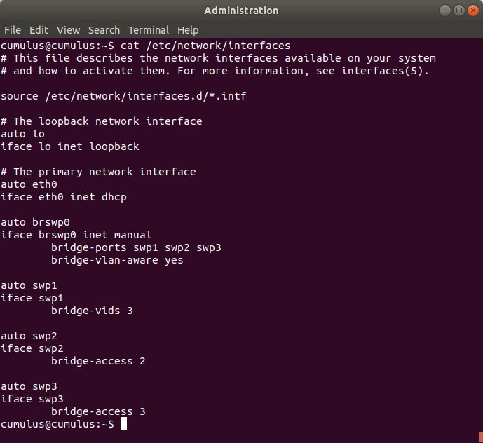


The configuration for Internal switch is as follows:

1. Access port on swp3 for Green LAN with VLAN ID = 3
3. Trunk port on swp2 with VLAN ID = 3

The configuration is shown below:

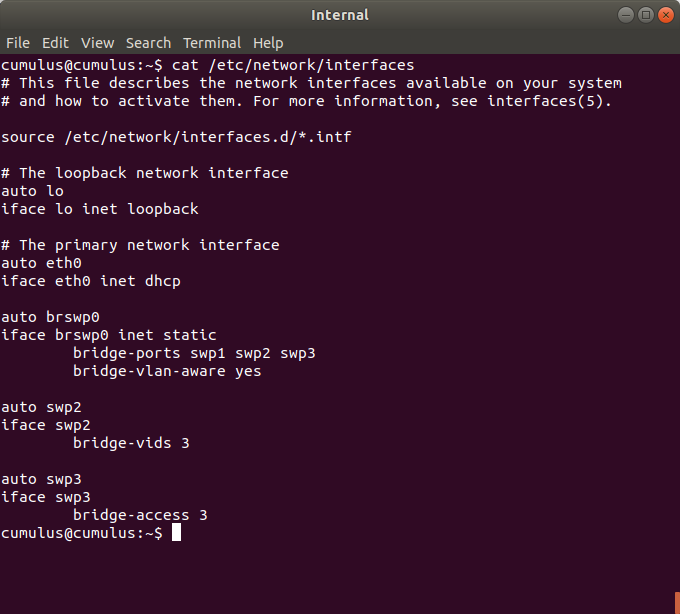

To reload the network configuration of each machine use: `sudo ifreload -a`.
To get details on the syntax for `bridge-*` stanzas use `ifquery --syntax-help`.

(source: https://img-en.fs.com/file/user_manual/cumulus-linux-user-guide.pdf)

### 6. Ping between ITManager and HR , do you have replies ? Ping between ITManager and Management , do you have replies ?

Check that HR can not ping anyone as shown below:

%20-%20TigerVNC_211.png)

Check that ITManager can ping Management:

%20-%20TigerVNC_212.png)


### Capture the traffic of the last ping and show in the packet the VLANs indication.

We can check how the packet is structured and confirm that ping works with Wireshark listening between Internal switch and Administration switch as shown below:

![Capturing from Standard input [Internal swp2 to Administration swp1]_213](INR-Lab-3-vlans-and-faults.assets/Capturing%20from%20Standard%20input%20%5BInternal%20swp2%20to%20Administration%20swp1%5D_213.png)


The VLAN id is `3` as shown in the `bytes` window in wireshark. The two bytes just before the ID are the Ethernet II type field filled in this case with the number `0x8100`.

### 7. Configure Inter-VLAN Routing between Management VLAN and HR VLAN .

To allow traffic to travel between different VLANs we must use a router that understands Layer 3. The only router in our setup is the MicroTik Gateway. In order to use the router, we must make sure that it is reachable from both the Blue and the Green VLANs. Currently it is not reachable from either of them, because of the strict rules imposed by the switches, so the first step is relaxing the rules a bit.

Below is the updated config for the Administration switch:

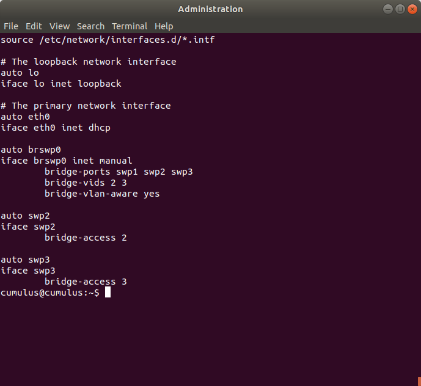


Below is the updated config for the Internal switch:

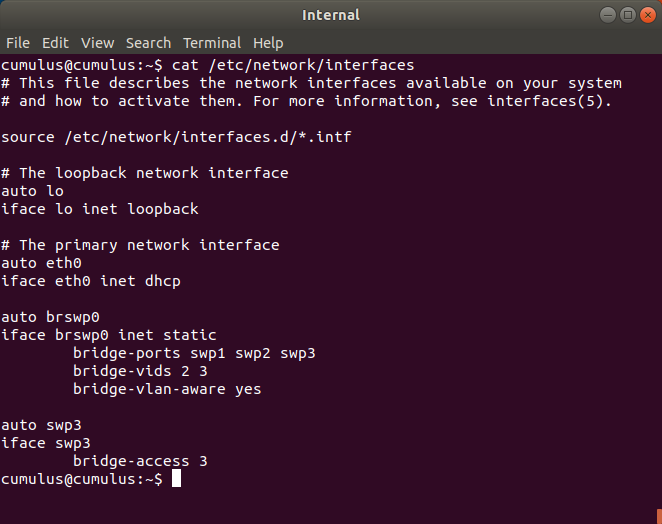


Then we need to configure the router by adding two new VLAN interfaces onto `ether2` connection. This is done in `Interfaces` menu. Screenshot of the configuration for the blue VLAN is shown below:

%20-%20WinBox%20v6.44.2%20on%20CHR%20(x86_64)_214.png)


Screenshot showing the addresses assigned to their respective interfaces. There are two networks assigned one to blueVLAN interface and one to greenVLAN interface as shown below: 

%20-%20WinBox%20v6.44.2%20on%20CHR%20(x86_64)_218.png)

### 8. Show that you can now ping between them.

Screenshot below shows ip address of ITManager and ping to the other two machines:

%20-%20TigerVNC_219.png)


The output of traceroute from ITManager to HR is shown below:

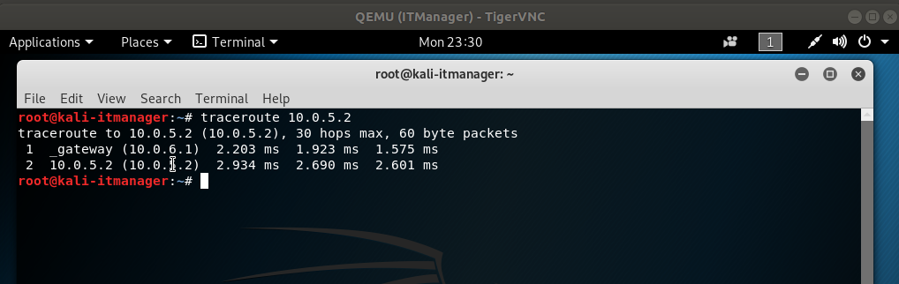


### 9. Capture the traffic going to and out of the router and show the different traffic of the sub-interfaces.

Start a wireshark capture between the MikroTik Gateway and Internal switch. The result is shown below:

![-Standard input [Gateway2 ether2 to Internal swp1]_221](INR-Lab-3-vlans-and-faults.assets/-Standard%20input%20%5BGateway2%20ether2%20to%20Internal%20swp1%5D_221.png)


We can clearly see that the selected request contains the 802.1Q information specifying in particular the Virtual LAN ID to be = 3. We can also see CDP (Cisco Discovery Protocol) and MNDP (MikroTik Neighbour Discovery Protocol) that are being broadcast on all three possible interfaces: ether2, blueVLAN and greenVLAN. The traffic that is going to the blueVLAN is shown by wireshark as having a `Port ID: blueVLAN` in its short description. The situation is exactly the same for the greenVLAN and just normal LAN traffic.


## Task 2 - Fault Tolerance


### 1. What is Link Agregation ?

A way to use multiple Ethernet adapters that connect the sending and the receiving side in order to achieve higher throughput speeds and/or redundancy (and hence reliability).


### How does it work (breifly.) ?

By connecting two machines with full duplex point-to-point links whose bandwidth is higher then the bandwidth of the individual links. Ethernet channels are aggregated into one Link Aggregation Group. This LAG is presented to the client as an ethernet port. This  allows  much faster transfer speeds and improved safety due to link redundancy. 


### What are the possible configuration modes ?

There are two primary modes for the Link Aggregation:

1.  Passive - the software listens on a LAG for a Link Aggregation Control Protocol (LACP) request.
2. Active - the program initiates the LACP request.

(source: https://www.ibm.com/support/knowledgecenter/en/ssw_aix_71/network/etherchannel_intro.html)


### 2. Use link agregation between Web and the Gateway so that you have Load Balancing and Fault Tolerance .

Initially we need to choose the type of network bonding. There are 7 supported modes:
1. `mode=0 (balance-rr)`  Round-robin is the default mode.  Has both fault tolerance and load balancing features.

2. `mode-1 (active-backup)` Active-backup policy. Only one slave is active, the another one is waiting and will start in case of failure.

3. `mode=2 (balance-xor)` A XOR (exclusive or) mode. The source MAC address is XOR’d with destination MAC address for providing load balancing and fault tolerance.

4. `mode=3 (broadcast)` Transmits everything on all slave interfaces. It provides fault tolerance. Useful only for special purposes.

5. `mode=4 (802.3ad)`  Dynamic Link Aggregation mode that creates aggregation groups that have the same speed. Requires support for IEEE 802.3ad dynamic link on intermediate switches. 

6. `mode=5 (balance-tlb)` Adaptive transmit load balancing. The outgoing traffic is distributed based on the current load on each slave and the incoming traffic is received by the current slave. This mode does not require any special switch support.

7. `mode=6 (balance-alb)` This mode is called adaptive load balancing. This mode does not require any special switch support.

(source: https://www.cloudibee.com/network-bonding-modes/ and https://www.interserver.net/tips/kb/network-bonding-types-network-bonding/ )

The first step is to create the wired links between the Gateway, the switch and the Web machine as shown below:


The next step is to create bonds. I decided to use `balance-rr` mode for the bonds because it does not require any special switch support and provides fault tolerance with load balancing features. Therefore I have to create the following bonds: 
1. bond e0 with e1 on Web
2. bond ether1 with ether4 on Gateway

The resulting configuration for Web is shown below:

%20-%20TigerVNC_224.png)


Below is the output if `ip a` for the Web machine:

%20-%20TigerVNC_223.png)

To reconfigure the network sun `systemctl restart networking.service` just using `ifup bond0` is not enough.

sources: 

1. https://unix.stackexchange.com/questions/128439/good-detailed-explanation-of-etc-network-interfaces-syntax
2. https://backdrift.org/lacp-configure-network-bonding-linux


Configuration on the Gateway is shown below (inside Interfaces->Bonding):

%20-%20WinBox%20v6.44.2%20on%20CHR%20(x86_64)_225.png)

Then we must delete ip configuration for the ether1 and configure the ip address for bonding1 interface. The final configuration is shown on the screenshot below:

%20-%20WinBox%20v6.44.2%20on%20CHR%20(x86_64)_226.png)


Checking connection (pings from Web to Gateway and Admin) is shown below:

%20-%20TigerVNC_231.png)


### 3. Test the Fault Tolerance by stopping one of the cables and see if you have any down time.

I drop a cable from Web `e0` interface to External `swp5` interface to get the topology as below:


This was done while ping was running:

%20-%20TigerVNC_233.png)


We can see that after `ping sequence=11` the removal of the link affects the connection because ping packets get dropped, I think this is a consequence of using the GNS3 emulator. I suspect that on real equipment with a small `bond-miimon` setting we would quickly detect that one of the slave interfaces is down and switch to using just the other slave.


### 5. Disable STP on the Switches under Internal .

To disable the STP we add `bridge-stp off` to `/etc/network/interfaces` for each switch.

For Internal switch:

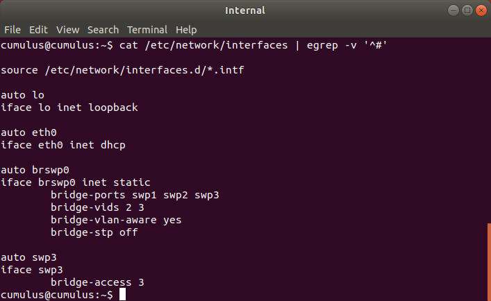

For ITDepartment switch:

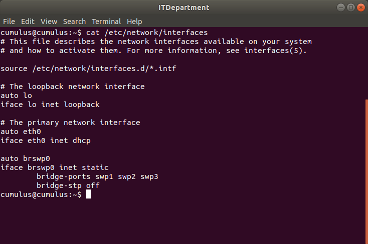

For Administration switch:

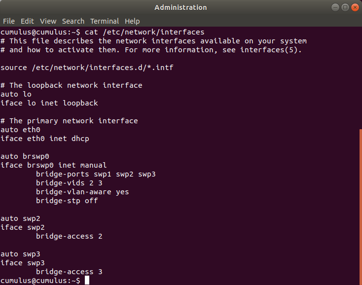


### 6. Change the topology to have two paths as show below:

Adding the new path requires changing the configuration of all three switches in order to maintain VLANs.

The new configuration for the ITDepartment switch (which was used as a dumb switch up until now) is shown below:

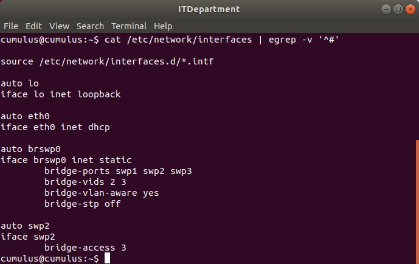


The config for Internal switch is shown below:

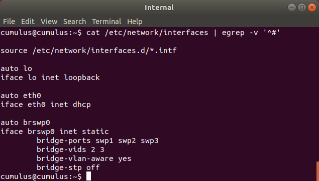


The config for Administration switch is shown below:

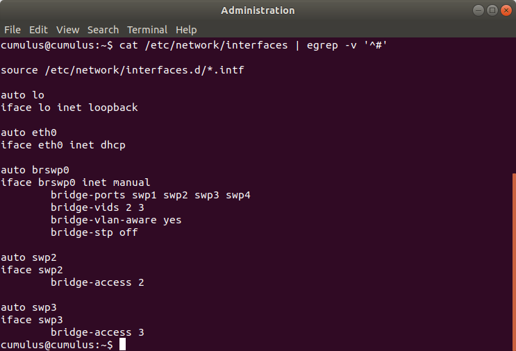


The new topology is shown below:


### 7. Capture the traffic, send a broadcast ping request to the PCs connected to the Internal Network.

#### What can you notice ?

The network was flooded with packets. Alltogether I collected about 900 000 (nine hundred thousand) packets after about a minute. The number of packets grew in progression over time.

This is shown in the screenshot below:

![-Standard input [Administration swp4 to ITDepartment swp3]_241](INR-Lab-3-vlans-and-faults.assets/-Standard%20input%20%5BAdministration%20swp4%20to%20ITDepartment%20swp3%5D_241.png)


#### Why did this happen ?

When broadcast ping signal goes out the closes switch receives the packet, notes what LAN it came from, ques it for forwarding onto the neighbour LAN. When the other two bridges get the packet they do the same thing. However because the first bridge is transparent to them they assume that the packet came from an end machine, so they will que it to go back to the original LAN. Thus not only do the packets loop, but they also multiply. (this is unlike routers that do not duplicate packets, furthermore routers interpret the hop count on the packet, so a looping packet will eventually be dropped). And because bridges are transparent the packet on its 10th transmission looks the same as on its first transmission.

The solution is to avoid loops in network topology. The spanning tree algorithm allows bridges to detect and ignore loops.

#### What are the implications of this on the network ?

The network is congested and will lead to meaningful traffic getting delayed while all the communication channels are busy transmitting. 

### 8. Enable back STP on the Switches and do the experiment again.

To enable the STP the configuration files on the switches must be changed to include `bridge-stp on`.

The results of the capture are shown below:

![Capturing from Standard input [Administration swp4 to ITDepartment swp3]_245](INR-Lab-3-vlans-and-faults.assets/Capturing%20from%20Standard%20input%20%5BAdministration%20swp4%20to%20ITDepartment%20swp3%5D_245.png)


There are much fewer packets because the loop in the topology was eliminated.


#### Can you see STP traffic ? Explain it breifly.

Below is a screenshot showing wireshark interpreting a STP packet:

![-Standard input [Internal swp2 to Administration swp1]_246](INR-Lab-3-vlans-and-faults.assets/-Standard%20input%20%5BInternal%20swp2%20to%20Administration%20swp1%5D_246.png)

 According to Wireshark capture the STP makes up for about 16% of all packets. The total number of packets is much less after a minute and does not show exponential growth.


### Configure the switches to have the Internal as the Root switch.

We want to configure the Internal switch to be the Root Bridge. The bridge configuration policy can be given as an option `mstpctl-treeprio` to the bridge in `/etc/network/interfaces/`.  In this case its very simple to set the root bridge, the configuration file for Internal is shown below:

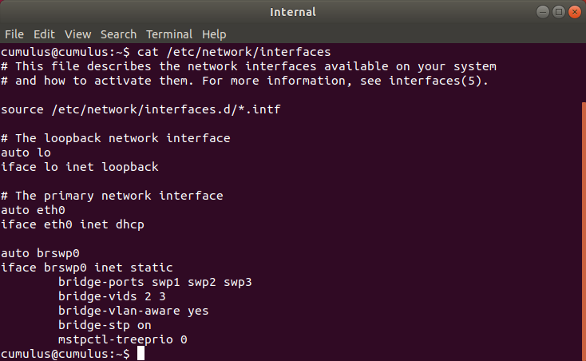


sources:

1.  `Interconnections: Bridges, Routers, Switches, and Internetworking Protocols` by Radia Perlman -Addison-Wesley Professional (1999)


### 9. Would we need STP between routers ?

No, we dont need the STP protocol, because routers do not suffer from the same problem as bridges. In particular routers work at a higher level and can inspect the hop count for a packet and when the hop count reaches zero the packet is dropped (so the packets will not loop forever). Secondly the bridges duplicate packets, whereas routers put them on another LAN, so the number of packets would not grow exponentially.