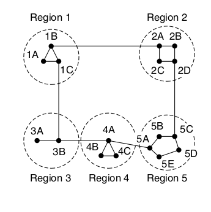
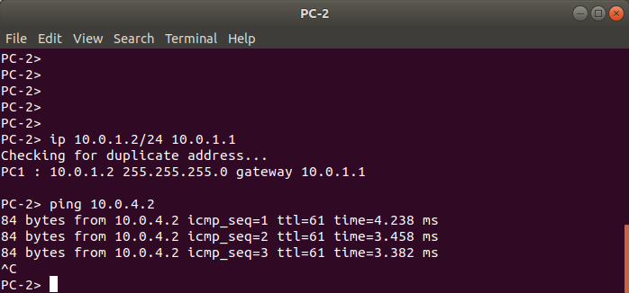
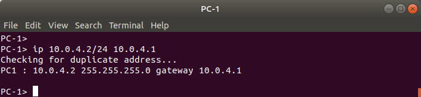
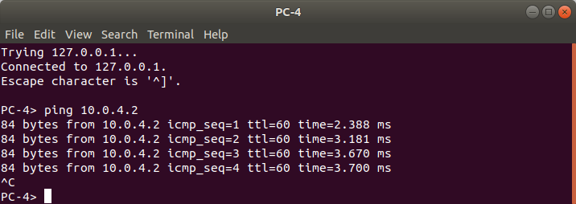
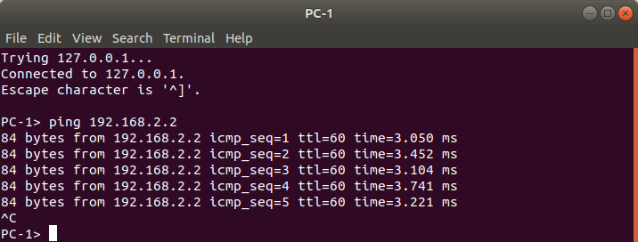

# INR Lab 4 - OSPF

#### Artem Abramov SNE19


## 1. Preparation

#### a. Select a virtual routing solution that you would like to try. For example (Mikrotik, vyos, Pfsense).

I decided to select MikroTik.

#### b. GNS3 already have a template for these routers (Mikrotik, vyos, Pfsense), try to use these templates as it will save you a lot of time and troubleshooting.

I decided to select MikroTik.

#### c. Try to draw a network scheme before you start the lab. This will help you in the deployment phase. 

#### d. The network scheme should include at least 3 routers, each one of them has a different subnet, and they should be able to reach each other (for example by a switch/router in the middle or a bus topology)

The task suggests linking the routers with a bus topology. At first I did the lab by linking the routers via an ethernet hub in the middle, as shown below:


However I felt that this topology does not really show the interesting properties of OSPF, because there is really only one route for packets to travel. Therefore I decided to re-do the lab using a more interesting topology as shown below:


In links state algorithms the LANs that are formed can be considered as a node in the network. For this one of the routers on the LAN is chosen to be the DR (Designated Router) to play the role of LAN in the routing protocol. For example choosing the router with the lowest ID or highest priority. The DR names the LAN and constructs an LSP on its behalf.  Note: OSPF refers to link state information as link state advertisements (LSA) instead of LSP.

Below is an example of an internet consisting of smaller networks (labeled as regions) 1 to 5:



Since each network is operated independently of all the others, it is referred to as an AS (Autonomous System). The mental model for an AS is an ISP network. The Internet can be viewed as a collection of Autonomous Systems that are interconnected.

**Interior gateway protocols**

Within each network, an interior gateway protocol is used for routing. It might be:
1.	`link state` based protocol:
	a. IS-IS (IP, CLNP)
	b. NLSP (a version of IS-IS for IPX)
	c. PNNI (ATM)
	d. OSPF (IP) Version 2 defined in RFC 2328 (https://tools.ietf.org/html/rfc2328).
2.	`distance vector` based protocol:
	a. RIP (IP)
    b. RTMP (AppleTalk)
    c. RIP (IPX)
    d. DECnet Phases 3 and 4.

The trickiest part of the link state protocol is distributing the link state packets. If different routers are using different versions of the topology, the routes they compute can have inconsistencies such as loops, unreachable machines, and other problems. Neither the link state, nor the distance vector based protocols that are most commonly used can be considered robust, because a single broken/malicious router can corrupt the network.

OSPF works within one AS, however many of the AS are difficult to manage due to their size. To work at this scale, OSPF allows an AS to be divided into numbered areas (however the hierarchy is strict about having only two levels). There is a backbone area (area 0), and packets traveling from one area to another area must go via the backbone area (via the backbone routers). In OSPF each area has only a single ID, which is a 4-byte quantity.  OSPF runs "on top of" IP. This means that an OSPF packet is transmitted with an IP data packet header. For example, addresses in OSPF are exactly 8 octets (IPv4 address plus mask). This seems broken, because OSPF is supposed to configure the routes for IP packets. In order to overcome the chicken-and-egg problem, new routers intelligently flood the network with HELLO packets to discover the topology, only then does route optimisation kick in allowing routers to optimise/trim the routes. IP header uses the value 89 in the protocol field to indicate an OSPF packet.

There are 5 types of OSPF messages:
1. Hello - Used to discover who the neighbours are
2. Link state update - Provides the sender’s costs to its neighbors
3. Link state ack - Acknowledges link state update
4. Database description - Announces which updates the sender has
5. Link state request - Requests information from the partner

There are five basic types of LSAs in OSPF (not to be confused with 5 types of OSPF messages):
1.	Type 1—router links advertisement
2.	Type 2—network links advertisement
3.	Type 3—network summary link advertisement
4.	Type 4—AS boundary routers summary link advertisement
5.	Type 5—AS external link advertisement

**Exterior gateway protocols**

Across the networks that make up an internet, an exterior gateway protocol is used. This can be static routing, EGP (old exterior gateway protocol) or BGP (currently used in the Internet).

BGP significantly extends the distance vector approach. It is also referred to as a `path vector` protocol, because each entry in the distance vector table also contains the sequence of routing domains in the path to the destination. Distributing the sequence of routing domains has two purposes.
1. It solves the counting-to-infinity problem.
2. It allows policy decisions to be made based on the routing domains in the path (i.e. allows policy-based routing).

For info on how to take a look inside a BGP server (open looking glass server) see: https://gns3vault.com/blog/bgp-for-beginners

The networks may all use different interior gateway protocols, but they must use the same  exterior gateway protocol to form an internet.

sources:
1. Computer Networks - A Tanenbaum - 5th edition
2. Radia Perlman - Interconnections: Bridges, Routers, Switches, and Internetworking Protocols -Addison-Wesley Professional (1999)
3. OSPF Version 2 RFC 2328 https://tools.ietf.org/html/rfc2328


## 2. Deployment

Below is the screenshot showing the sketch of the topology in GNS3 (it is not configured yet):


In this topology four LANs are formed under each router, which becomes the DR for the respective LAN. The three routers `routera`, `routerb`, `routerc` are joined by an Ethernet hub forming a bus topology. DR and BDR will be chosen later for this LAN. 

The next step is configuring the interfaces on each router. 

Below are the commands used to configure `routera` interfaces:
```
[admin@MikroTik] > ip address add address=10.1.0.2/24 interface=ether7
[admin@MikroTik] > ip address add address=10.2.0.2/24 interface=ether8 
[admin@MikroTik] > ip address add address=10.0.1.1/24 interface=ether2
[admin@MikroTik] > ip address print 
Flags: X - disabled, I - invalid, D - dynamic 
 #   ADDRESS            NETWORK         INTERFACE
 0   10.1.0.2/24        10.1.0.0        ether7
 1   10.2.0.2/24        10.2.0.0        ether8
 2   10.0.1.1/24        10.0.1.0        ether2
```

Interface configuration for `routerb` is below:
```
[admin@MikroTik] > ip address print  
Flags: X - disabled, I - invalid, D - dynamic 
 #   ADDRESS            NETWORK         INTERFACE
 0   10.0.2.1/24        10.0.2.0        ether2
 1   10.1.0.1/24        10.1.0.0        ether7
 2   10.2.0.1/24        10.2.0.0        ether8
 3   10.3.0.1/24        10.3.0.0        ether6 
```


Interface configuration for `routerc` is below:
```
[admin@MikroTik] > ip address print 
Flags: X - disabled, I - invalid, D - dynamic 
 #   ADDRESS            NETWORK         INTERFACE
 0   10.2.0.3/24        10.2.0.0        ether8
 1   10.0.3.1/24        10.0.3.0        ether2
 2   10.4.0.1/24        10.4.0.0        ether5
```


Interface configuration for `routerd` is below:
```
[admin@MikroTik] > ip address print 
Flags: X - disabled, I - invalid, D - dynamic 
 #   ADDRESS            NETWORK         INTERFACE
 0   10.0.4.1/24        10.0.4.0        ether2
 1   10.3.0.2/24        10.3.0.0        ether6
 2   10.4.0.2/24        10.4.0.0        ether5
```

### a. Which interface you will select as the OSPF router ID and why?

**Theory**

The first thing for a newly booted router is to learn about its neighbours. Because OSPF uses IP for packet delivery this initial discovery is done by sending a special HELLO packet on each point-to-point line that is attached to the router. The router on the other end is expected to send back a reply giving its name. The name must be a unique identifier, because when another router hears that three routers are connected to router X, it is essential that it can be sure that all three mean the same router X. 

After booting the router ID is normally chosen to be the first of the following that is present:
1. Internal Router ID configuration parameter
2. Address of the loopback interface
3. Lowest address on one of the configured interfaces

When possible its a good idea to specify the router ID by assigning the IP address to the loopback interface which is guaranteed to be enabled and brought up at boot. Using the loopback IP address to supply Router ID makes it simpler to manage, because it avoids configuration specific to the router's OS.

**Deployment**

Configuring both the loopback interface and the OSPF internal Router ID parameter are shown below for `routera`:
```
[admin@MikroTik] > interface bridge add name=loopback
[admin@MikroTik] > ip address add address=10.255.255.1/32 interface=loopback
[admin@MikroTik] > routing ospf instance set 0 router-id=10.255.255.1
```

For other routers the process is the same. Their Router IDs are shown below:
1.	`routerb` - 10.255.255.2
2.	`routerc` - 10.255.255.3
3.	`routerd` - 10.255.255.4

sources: https://wiki.mikrotik.com/wiki/Manual:Routing/OSPF and https://wiki.mikrotik.com/wiki/Manual:OSPF-examples

### b. What is the difference between advertising all the networks VS manual advertising (per interface or per subnet)? Which one is better?

**Theory**

The first step is configuring a network (ip and mask) on a particular interface of a router. Then the network must be introduced to the LSDB of this router before the router will begin to advertise it. Any network that is in the LSDB automatically gets advertised.

There are two ways to generate an LSA for a network in the LSDB:

1.	Manual - the administrator generates it.
2.	Automatic - the administrator directs OSPF software to read network info from the router interfaces and automatically generate appropriate LSA.

In manual configuration any network that isn't explicitly added to the LSDB will not take part in OSPF. Automatic configuration allows the administrator to remove/add networks faster. In production environments its best to have manual control over the network topology, hence its better to use manual configuration, especially because it is not that much harder than automatic. Furthermore manual configuration allows the implementation of policy routing (i.e. routing according to law/business rules rather than just choosing the best path), because some technically good paths can be masked for business/law reason.

To enable automatic configuration the network `0.0.0.0/32` or `0.0.0.0/0` with the appropriate area ID should be added to the router's OSPF configuration. 

**Deployment**

For simplicity I decided to use manual configuration only on `routera`. 

Manually introducing the networks to OSPF LSDB on `routera` is shown below:
```
[admin@MikroTik] > routing ospf network add network=10.1.0.0/24 area=backbone 
[admin@MikroTik] > routing ospf network add network=10.2.0.0/24 area=backbone  
[admin@MikroTik] > routing ospf network add network=10.0.1.0/24 area=backbone   
```

Verify the configuration:
```
[admin@MikroTik] > routing ospf network print 
Flags: X - disabled, I - invalid 
 #   NETWORK            AREA
 0   10.1.0.0/24        backbone
 1   10.2.0.0/24        backbone
 2   10.0.1.0/24        backbone
[admin@MikroTik] > routing ospf interface print 
Flags: X - disabled, I - inactive, D - dynamic, P - passive 
 #    INTERFACE                 COST PRI NETWORK-TYPE   AUT... AUTHENTICATIO...
 0 D  ether7                      10   1 broadcast      none
 1 D  ether8                      10   1 broadcast      none
 2 D  ether2                      10   1 broadcast      none  
```

Setting up OSPF to automatically update the LSDB database on `routerb` is shown below:
```
[admin@MikroTik] > routing ospf network add network=0.0.0.0/0 area=backbone 
```

Verify the configuration:
```
[admin@MikroTik] > routing ospf network print 
Flags: X - disabled, I - invalid 
 #   NETWORK            AREA
 0   0.0.0.0/0          backbone
[admin@MikroTik] > routing ospf interface print 
Flags: X - disabled, I - inactive, D - dynamic, P - passive 
 #    INTERFACE                 COST PRI NETWORK-TYPE   AUT... AUTHENTICATIO...
 0 D  ether2                      10   1 broadcast      none
 1 D  ether6                      10   1 broadcast      none
 2 D  ether7                      10   1 broadcast      none
 3 D  ether8                      10   1 broadcast      none  
```

The auto configuration was applied to `routerc` and `routerd`. 

Resulting route configuration for `routera` is shown below:
```
[admin@MikroTik] > ip route print 
Flags: X - disabled, A - active, D - dynamic, 
C - connect, S - static, r - rip, b - bgp, o - ospf, m - mme, 
B - blackhole, U - unreachable, P - prohibit 
 #      DST-ADDRESS        PREF-SRC        GATEWAY            DISTANCE
 0 ADC  10.0.1.0/24        10.0.1.1        ether2                    0
 1 ADo  10.0.2.0/24                        10.1.0.1                110
                                           10.2.0.1          
 2 ADo  10.0.3.0/24                        10.2.0.3                110
 3 ADo  10.0.4.0/24                        10.1.0.1                110
                                           10.2.0.1          
                                           10.2.0.3          
 4 ADC  10.1.0.0/24        10.1.0.2        ether7                    0
 5 ADC  10.2.0.0/24        10.2.0.2        ether8                    0
 6 ADo  10.3.0.0/24                        10.1.0.1                110
                                           10.2.0.1          
 7 ADo  10.4.0.0/24                        10.2.0.3                110
 8 ADC  10.255.255.1/32    10.255.255.1    loopback                  0
```


Resulting route configuration for `routerb` is shown below:
```
[admin@MikroTik] > ip route print 
Flags: X - disabled, A - active, D - dynamic, 
C - connect, S - static, r - rip, b - bgp, o - ospf, m - mme, 
B - blackhole, U - unreachable, P - prohibit 
 #      DST-ADDRESS        PREF-SRC        GATEWAY            DISTANCE
 0 ADo  10.0.1.0/24                        10.2.0.2                110
                                           10.1.0.2          
 1 ADC  10.0.2.0/24        10.0.2.1        ether2                    0
 2 ADo  10.0.3.0/24                        10.2.0.3                110
 3 ADo  10.0.4.0/24                        10.3.0.2                110
 4 ADC  10.1.0.0/24        10.1.0.1        ether7                    0
 5 ADC  10.2.0.0/24        10.2.0.1        ether8                    0
 6 ADC  10.3.0.0/24        10.3.0.1        ether6                    0
 7 ADo  10.4.0.0/24                        10.3.0.2                110
                                           10.2.0.3          
```

Route configuration for `routerc` is below:
```
[admin@MikroTik] > ip route print 
Flags: X - disabled, A - active, D - dynamic, 
C - connect, S - static, r - rip, b - bgp, o - ospf, m - mme, 
B - blackhole, U - unreachable, P - prohibit 
 #      DST-ADDRESS        PREF-SRC        GATEWAY            DISTANCE
 0 ADo  10.0.1.0/24                        10.2.0.2                110
 1 ADo  10.0.2.0/24                        10.2.0.1                110
 2 ADC  10.0.3.0/24        10.0.3.1        ether2                    0
 3 ADo  10.0.4.0/24                        10.4.0.2                110
 4 ADo  10.1.0.0/24                        10.2.0.2                110
                                           10.2.0.1          
 5 ADC  10.2.0.0/24        10.2.0.3        ether8                    0
 6 ADo  10.3.0.0/24                        10.2.0.1                110
                                           10.4.0.2          
 7 ADC  10.4.0.0/24        10.4.0.1        ether5                    0
```

Finally route configuration for `routerd` is below:
```
[admin@MikroTik] > ip route print 
Flags: X - disabled, A - active, D - dynamic, 
C - connect, S - static, r - rip, b - bgp, o - ospf, m - mme, 
B - blackhole, U - unreachable, P - prohibit 
 #      DST-ADDRESS        PREF-SRC        GATEWAY            DISTANCE
 0 ADo  10.0.1.0/24                        10.3.0.1                110
                                           10.4.0.1          
 1 ADo  10.0.2.0/24                        10.3.0.1                110
 2 ADo  10.0.3.0/24                        10.4.0.1                110
 3 ADC  10.0.4.0/24        10.0.4.1        ether2                    0
 4 ADo  10.1.0.0/24                        10.3.0.1                110
 5 ADo  10.2.0.0/24                        10.3.0.1                110
                                           10.4.0.1          
 6 ADC  10.3.0.0/24        10.3.0.2        ether6                    0
 7 ADC  10.4.0.0/24        10.4.0.2        ether5                    0
```

Screenshot of the topology showing all the networks and all the interfaces is shown below:


To check that OSPF was working I configured the interfaces on `PC-2` (on LAN under `routera`) and `PC-1` (on LAN under `routerd`), after which ping (and reverse ping as well) was successful as shown below:




`PC-1` configuration is shown below:




source: https://it-certification-network.blogspot.com/2008/12/disabling-ospf-on-certain-interfaces.html


### c. If you have a static route in a router, how can you let your OSPF neighbors know about it?

**Theory**

The administrator needs to add it to the OSPF LSDB database. The information about the static route will be distributed to other routers running OSPF as LSA. Then it is the job of the shortest path algorithm that is running inside each router to decide how to make use of this link state information. If the static route provides a unique path to some network, then it will be used. If the static route provides an alternative route to some network, then its cost will be evaluated and depending on that it will either be used or unused.

**Deployment**

Create a new router called `static` that has its own LAN but is not running OSPF. This LAN is reachable via a static route on `routera` as shown on the topology below (on the bottom-left):


Before configuring the `routera`, first `static` router needs to be configured. Its interface  configuration is shown below:
```
[admin@MikroTik] > ip address print 
Flags: X - disabled, I - invalid, D - dynamic 
 #   ADDRESS            NETWORK         INTERFACE
 0   192.168.1.2/24     192.168.1.0     ether6
 1   192.168.2.1/24     192.168.2.0     ether2   
```

Also we must set `192.168.1.1` (which means `routera`) as the default gateway on the `static` router as shown below:
```
[admin@MikroTik] > ip route add dst-address=0.0.0.0/0 gateway=192.168.1.1
```

Without adding the gateway the pings from other machines will be able to enter the 192.168.2.0/24 network (when it is advertised), but the pong will have no way out. Similarly without the default gateway other networks will not be reachable from the 192.168.2.0/24 network. The route configuration for `static` router is shown below:
```
[admin@MikroTik] > ip route print 
Flags: X - disabled, A - active, D - dynamic, 
C - connect, S - static, r - rip, b - bgp, o - ospf, m - mme, 
B - blackhole, U - unreachable, P - prohibit 
 #      DST-ADDRESS        PREF-SRC        GATEWAY            DISTANCE
 0 A S  0.0.0.0/0                          192.168.1.1               1
 1 ADC  192.168.1.0/24     192.168.1.2     ether6                    0
 2 ADC  192.168.2.0/24     192.168.2.1     ether2                    0
```

Now we can proceed to add a static route to `routera` that tells it how to route traffic to the 192.168.2.0/24 subnet via the `static` router and actually enables connectivity to the `PC-4` machine as shown below:
```
[admin@MikroTik] > ip route add dst-address=192.168.2.0/24 gateway=192.168.1.2 
```

Checking `routera` configuration:
```
[admin@MikroTik] > ip route print 
Flags: X - disabled, A - active, D - dynamic, 
C - connect, S - static, r - rip, b - bgp, o - ospf, m - mme, 
B - blackhole, U - unreachable, P - prohibit 
 #      DST-ADDRESS        PREF-SRC        GATEWAY            DISTANCE
 0 ADC  10.0.1.0/24        10.0.1.1        ether2                    0
 1 ADo  10.0.2.0/24                        10.1.0.1                110
                                           10.2.0.1          
 2 ADo  10.0.3.0/24                        10.2.0.3                110
 3 ADo  10.0.4.0/24                        10.1.0.1                110
                                           10.2.0.1          
                                           10.2.0.3          
 4 ADC  10.1.0.0/24        10.1.0.2        ether7                    0
 5 ADC  10.2.0.0/24        10.2.0.2        ether8                    0
 6 ADo  10.3.0.0/24                        10.1.0.1                110
                                           10.2.0.1          
 7 ADo  10.4.0.0/24                        10.2.0.3                110
 8 ADC  10.255.255.1/32    10.255.255.1    loopback                  0
 9 ADC  192.168.1.0/24     192.168.1.1     ether6                    0
10 A S  192.168.2.0/24                     192.168.1.2               1
```

Line 10 shows the newly created static route.  However this route is not distributed to other OSPF enabled routers yet. This can be done by setting a parameter for the OSPF instance running on `routera`. Below are the default parameter values:
```
[admin@MikroTik] > routing ospf instance print
Flags: X - disabled, * - default 
 0  * name="default" router-id=0.0.0.0 distribute-default=never 
      redistribute-connected=no redistribute-static=no redistribute-rip=no 
      redistribute-bgp=no redistribute-other-ospf=no metric-default=1 
      metric-connected=20 metric-static=20 metric-rip=20 metric-bgp=auto 
      metric-other-ospf=auto in-filter=ospf-in out-filter=ospf-out 
```

To advertise static routes, the setting `redistribute-static=no` must be changed to `redistribute-static=as-type-1` as shown below, all of this is done on `routera`:
```
[admin@MikroTik] > routing ospf instance edit 
number: 0
value-name: redistribute-static
as-type-1
[admin@MikroTik] > routing ospf instance print
Flags: X - disabled, * - default 
 0  * name="default" router-id=10.255.255.1 distribute-default=never 
      redistribute-connected=no redistribute-static=as-type-1 
      redistribute-rip=no redistribute-bgp=no redistribute-other-ospf=no 
      metric-default=1 metric-connected=20 metric-static=20 metric-rip=20 
      metric-bgp=auto metric-other-ospf=auto in-filter=ospf-in 
      out-filter=ospf-out 
```


Its interesting to note that the route to `192.168.1.0/24` (which acts as an intermediate network) does **NOT** get advertised (because the OSPF is manually configured on `routera` and this network was not added to LSDB), however the static route to the `192.168.2.0/24` network **DOES** get advertised appropriately and is visible in the configuration of both `routerc` and `routerb` below.

The route configuration for `routerc` is shown below:
```
[admin@MikroTik] > ip route print 
Flags: X - disabled, A - active, D - dynamic, 
C - connect, S - static, r - rip, b - bgp, o - ospf, m - mme, 
B - blackhole, U - unreachable, P - prohibit 
 #      DST-ADDRESS        PREF-SRC        GATEWAY            DISTANCE
 0 ADo  10.0.1.0/24                        10.2.0.2                110
 1 ADo  10.0.2.0/24                        10.2.0.1                110
 2 ADC  10.0.3.0/24        10.0.3.1        ether2                    0
 3 ADo  10.0.4.0/24                        10.4.0.2                110
 4 ADo  10.1.0.0/24                        10.2.0.2                110
                                           10.2.0.1          
 5 ADC  10.2.0.0/24        10.2.0.3        ether8                    0
 6 ADo  10.3.0.0/24                        10.2.0.1                110
                                           10.4.0.2          
 7 ADC  10.4.0.0/24        10.4.0.1        ether5                    0
 8 ADo  192.168.2.0/24                     10.2.0.2                110
```

The routes on `routerb` are shown below:
```
[admin@MikroTik] > ip route print 
Flags: X - disabled, A - active, D - dynamic, 
C - connect, S - static, r - rip, b - bgp, o - ospf, m - mme, 
B - blackhole, U - unreachable, P - prohibit 
 #      DST-ADDRESS        PREF-SRC        GATEWAY            DISTANCE
 0 ADo  10.0.1.0/24                        10.2.0.2                110
                                           10.1.0.2          
 1 ADC  10.0.2.0/24        10.0.2.1        ether2                    0
 2 ADo  10.0.3.0/24                        10.2.0.3                110
 3 ADo  10.0.4.0/24                        10.3.0.2                110
 4 ADC  10.1.0.0/24        10.1.0.1        ether7                    0
 5 ADC  10.2.0.0/24        10.2.0.1        ether8                    0
 6 ADC  10.3.0.0/24        10.3.0.1        ether6                    0
 7 ADo  10.4.0.0/24                        10.3.0.2                110
                                           10.2.0.3          
 8 ADo  192.168.2.0/24                     10.2.0.2                110
                                           10.1.0.2          
```

Finally the route configuration on `routerd` is shown below:
```
[admin@MikroTik] > ip route print 
Flags: X - disabled, A - active, D - dynamic, 
C - connect, S - static, r - rip, b - bgp, o - ospf, m - mme, 
B - blackhole, U - unreachable, P - prohibit 
 #      DST-ADDRESS        PREF-SRC        GATEWAY            DISTANCE
 0 ADo  10.0.1.0/24                        10.3.0.1                110
                                           10.4.0.1          
 1 ADo  10.0.2.0/24                        10.3.0.1                110
 2 ADo  10.0.3.0/24                        10.4.0.1                110
 3 ADC  10.0.4.0/24        10.0.4.1        ether2                    0
 4 ADo  10.1.0.0/24                        10.3.0.1                110
 5 ADo  10.2.0.0/24                        10.3.0.1                110
                                           10.4.0.1          
 6 ADC  10.3.0.0/24        10.3.0.2        ether6                    0
 7 ADC  10.4.0.0/24        10.4.0.2        ether5                    0
 8 ADo  192.168.2.0/24                     10.3.0.1                110
                                           10.4.0.1   
```

The static route to `192.168.2.0` is stored in LSDB under a special type as shown below in the output of LSDB for `routerd`:
```
[admin@MikroTik] > routing ospf lsa print 
AREA       TYPE         ID             ORIGINATOR     SEQUENCE-NU...        AGE
backbone   router       10.255.255.1   10.255.255.1       0x80000004       1388
backbone   router       10.255.255.2   10.255.255.2       0x80000005       1381
backbone   router       10.255.255.3   10.255.255.3       0x80000005       1393
backbone   router       10.255.255.4   10.255.255.4       0x80000005       1382
backbone   network      10.1.0.1       10.255.255.2       0x80000001       1388
backbone   network      10.2.0.3       10.255.255.3       0x80000002       1383
backbone   network      10.3.0.2       10.255.255.4       0x80000001       1382
backbone   network      10.4.0.2       10.255.255.4       0x80000001       1391
external   as-external  192.168.2.0    10.255.255.1       0x80000001       1440
```

We can check that the network works by pinging from the `PC-4` to `PC-1` as shown below:



Pinging the other way also works:




The details of one of the LSA update packets between `10.1.0.2` and `10.1.0.1` are shown below:

![-Standard input [routerb ether7 to routera ether7]_285](INR-Lab-4-ospf.assets/-Standard%20input%20%5Brouterb%20ether7%20to%20routera%20ether7%5D_285.png)

source: https://wiki.mikrotik.com/wiki/Manual:Routing/OSPF and
https://wiki.mikrotik.com/wiki/Manual:Simple_Static_Routing and https://forum.mikrotik.com/viewtopic.php?t=67448


## 3. Verification

### a. How can you check if you have a full adjacency with your router neighbor?

OSPF exchanges information between adjacent routers. Adjacent and neighboring routers are not the same. The routers on the same LAN are neighbours, but they are only adjacent to the single Designated Router that represents the LAN. Information is exchanged only between adjacent routers. A Backup Designated Router is always kept up to date to ease the transition should the primary designated router crash and need to be replaced immediately.

In MikroTik terminology there are only neighboring routers. Furthermore Adjacency means the state of the OSPF protocol, rather than the topology state. Value `state="Full"` in the output of commands below indicates that the routers have full adjacency i.e. LSA information is synchronised, DR and BDR are chosen and working. source: https://wiki.mikrotik.com/wiki/Manual:Routing/OSPF

Checking the neighbours for `routera` is shown below:
```
[admin@MikroTik] > routing ospf neighbor print 
 0 instance=default router-id=10.255.255.2 address=10.2.0.1 interface=ether8 
   priority=1 dr-address=10.2.0.3 backup-dr-address=10.2.0.1 state="Full" 
   state-changes=6 ls-retransmits=0 ls-requests=0 db-summaries=0 
   adjacency=1m35s 

 1 instance=default router-id=10.255.255.2 address=10.1.0.1 interface=ether7 
   priority=1 dr-address=10.1.0.1 backup-dr-address=10.1.0.2 state="Full" 
   state-changes=6 ls-retransmits=0 ls-requests=0 db-summaries=0 
   adjacency=1m35s 

 2 instance=default router-id=10.255.255.3 address=10.2.0.3 interface=ether8 
   priority=1 dr-address=10.2.0.3 backup-dr-address=10.2.0.1 state="Full" 
   state-changes=6 ls-retransmits=0 ls-requests=0 db-summaries=0 
   adjacency=1m47s 
```

Checking the neighbours for `routerb` is shown below:
```
[admin@MikroTik] > routing ospf neighbor print 
 0 instance=default router-id=10.255.255.3 address=10.2.0.3 interface=ether8 
   priority=1 dr-address=10.2.0.3 backup-dr-address=10.2.0.1 state="Full" 
   state-changes=6 ls-retransmits=0 ls-requests=0 db-summaries=0 
   adjacency=1m21s 

 1 instance=default router-id=10.255.255.1 address=10.2.0.2 interface=ether8 
   priority=1 dr-address=10.2.0.3 backup-dr-address=10.2.0.1 state="Full" 
   state-changes=5 ls-retransmits=0 ls-requests=0 db-summaries=0 
   adjacency=1m24s 

 2 instance=default router-id=10.255.255.1 address=10.1.0.2 interface=ether7 
   priority=1 dr-address=10.1.0.1 backup-dr-address=10.1.0.2 state="Full" 
   state-changes=5 ls-retransmits=0 ls-requests=0 db-summaries=0 
   adjacency=1m24s 

 3 instance=default router-id=10.255.255.4 address=10.3.0.2 interface=ether6 
   priority=1 dr-address=10.3.0.2 backup-dr-address=10.3.0.1 state="Full" 
   state-changes=5 ls-retransmits=0 ls-requests=0 db-summaries=0 
   adjacency=1m20s
```


Checking the neighbours for `routerc` is shown below:
```
[admin@MikroTik] > routing ospf neighbor print 
 0 instance=default router-id=10.255.255.2 address=10.2.0.1 interface=ether8 
   priority=1 dr-address=10.2.0.3 backup-dr-address=10.2.0.1 state="Full" 
   state-changes=5 ls-retransmits=0 ls-requests=0 db-summaries=0 
   adjacency=1m3s 

 1 instance=default router-id=10.255.255.1 address=10.2.0.2 interface=ether8 
   priority=1 dr-address=10.2.0.3 backup-dr-address=10.2.0.1 state="Full" 
   state-changes=5 ls-retransmits=0 ls-requests=0 db-summaries=0 
   adjacency=1m18s 

 2 instance=default router-id=10.255.255.4 address=10.4.0.2 interface=ether5 
   priority=1 dr-address=10.4.0.2 backup-dr-address=10.4.0.1 state="Full" 
   state-changes=6 ls-retransmits=0 ls-requests=0 db-summaries=0 
   adjacency=1m12s
```

Checking the neighbours for `routerd` is shown below:
```
[admin@MikroTik] > routing ospf neighbor print 
 0 instance=default router-id=10.255.255.2 address=10.3.0.1 interface=ether6 
   priority=1 dr-address=10.3.0.2 backup-dr-address=10.3.0.1 state="Full" 
   state-changes=5 ls-retransmits=0 ls-requests=0 db-summaries=0 
   adjacency=41s 

 1 instance=default router-id=10.255.255.3 address=10.4.0.1 interface=ether5 
   priority=1 dr-address=10.4.0.2 backup-dr-address=10.4.0.1 state="Full" 
   state-changes=5 ls-retransmits=0 ls-requests=0 db-summaries=0 
   adjacency=50s
```

### b. How can you check in the routing table which networks did you receive from your neighbors?

To check which networks were received the routing table can be interpreted. Routing tables for all routers have already been shown in previous tasks. Interpreting the routing table is straightforward, for example lets consider the routes in `routerd`:
```
[admin@MikroTik] > ip route print 
Flags: X - disabled, A - active, D - dynamic, 
C - connect, S - static, r - rip, b - bgp, o - ospf, m - mme, 
B - blackhole, U - unreachable, P - prohibit 
 #      DST-ADDRESS        PREF-SRC        GATEWAY            DISTANCE
 0 ADo  10.0.1.0/24                        10.3.0.1                110
                                           10.4.0.1          
 1 ADo  10.0.2.0/24                        10.3.0.1                110
 2 ADo  10.0.3.0/24                        10.4.0.1                110
 3 ADC  10.0.4.0/24        10.0.4.1        ether2                    0
 4 ADo  10.1.0.0/24                        10.3.0.1                110
 5 ADo  10.2.0.0/24                        10.3.0.1                110
                                           10.4.0.1          
 6 ADC  10.3.0.0/24        10.3.0.2        ether6                    0
 7 ADC  10.4.0.0/24        10.4.0.2        ether5                    0
 8 ADo  10.255.255.2/32                    10.3.0.1                110
 9 ADo  10.255.255.3/32                    10.4.0.1                110
10 ADC  10.255.255.4/32    10.255.255.4    loopback                  0
11 ADo  192.168.2.0/24                     10.3.0.1                110
                                           10.4.0.1   
```

The routing table reveals 9 different networks that are reachable from this router. Network that were received from adjacent routers have the `o` flag set (meaning route comes from OSPF). Networks number `3`, `6` and `7` originate on this router, they have an entry in the `PREF-SRC` column and use one of the router's interfaces as the gateway. The other 6 networks were received from the adjacent routers.


### c. Use traceroute to verify that you have a full OSPF network.

The topology is shown below for reference:


Running traceroute from client1 to client3 (i.e. across the whole network) is shown below:

%20-%20TigerVNC_286.png)


And reverse traceroute from client3 to client1 is shown below:

%20-%20TigerVNC_287.png)


Which indicates that the packets go through the ethernet-hub that joins `routerb` and `routerc`. Now lets suspend the link between the ethernet-hub and `routerb` as shown below:


Running traceroute on the modified topology from client1 to client3 is shown below:

%20-%20TigerVNC_290.png)

Lets now run traceroute from client3 to `PC-4` (via the static route) as shown below:

%20-%20TigerVNC_291.png)

Modify the topology further to disable the ethernet-hub altogether as shown below:


Run traceroute from client3 to `PC-4` again as shown below:

%20-%20TigerVNC_293.png)

This is the longest route possible with the current topology.


### d. Which router is selected as DR and which one is BDR?

In OSPF, the designated router is responsible for collecting acknowledgments for each LSA from the other routers. The DR in OSPF keeps a lot of state regarding which routers have which LSA. The BDR also listens to all the explicit acknowledgments and keeps track of which routers have received which LSA.

The DR router should be a powerful router. The BDR should also be a powerful router. They must be able to fit the whole LSA database. 

The Task `3.a` already showed how to view neighbor information. The choice of DR and BDR router is also reflected there under the values `dr-address=A.A.A.A` and `backup-dr-address=A.A.A.A`. Below is the summary for all networks:

1.	10.2.0.0/24 - DR=10.2.0.3, BDR=10.2.0.1
2.	10.1.0.0/24 - DR=10.1.0.1, BDR=10.1.0.2
3.	10.3.0.0/24 - DR=10.3.0.2, BDR=10.3.0.1
4.	10.4.0.0/24 - DR=10.4.0.2, BDR=10.4.0.1 

For all the other LANs (with client machines) their closest OSPF enabled router acts as the DR for the LAN.

### e. Check what is the cost for each network that has been received by OSPF in the routing table.

The cost for each network is shown in the DISTANCE column. For example on `routera`:
```
[admin@MikroTik] > ip route print 
Flags: X - disabled, A - active, D - dynamic, 
C - connect, S - static, r - rip, b - bgp, o - ospf, m - mme, 
B - blackhole, U - unreachable, P - prohibit 
 #      DST-ADDRESS        PREF-SRC        GATEWAY            DISTANCE
 0 ADC  10.0.1.0/24        10.0.1.1        ether2                    0
 1 ADo  10.0.2.0/24                        10.1.0.1                110
                                           10.2.0.1          
 2 ADo  10.0.3.0/24                        10.2.0.3                110
 3 ADo  10.0.4.0/24                        10.2.0.3                110
                                           10.1.0.1          
                                           10.2.0.1          
 4 ADC  10.1.0.0/24        10.1.0.2        ether7                    0
 5 ADC  10.2.0.0/24        10.2.0.2        ether8                    0
 6 ADo  10.3.0.0/24                        10.1.0.1                110
                                           10.2.0.1          
 7 ADo  10.4.0.0/24                        10.2.0.3                110
 8 ADC  10.255.255.1/32    10.255.255.1    loopback                  0
 9 ADo  10.255.255.2/32                    10.1.0.1                110
                                           10.2.0.1          
10 ADo  10.255.255.3/32                    10.2.0.3                110
11 ADo  10.255.255.4/32                    10.2.0.3                110
                                           10.1.0.1          
                                           10.2.0.1          
12 ADC  192.168.1.0/24     192.168.1.1     ether6                    0
13 A S  192.168.2.0/24                     192.168.1.2               1
```

We can see the distances are `0` for directly connected, `110` is the cost that is assigned by the OSPF instance and `1` is the cost for the static route (on other routers this route has the same cost as other routes - `110`).
