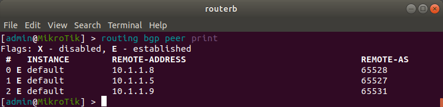

# INR Lab 5 - BGP

#### Artem Abramov SNE19


## 1. Preparation

Between the Autonomous Systems, an exterior gateway protocol is used. This can be static routing, EGP (old exterior gateway protocol) or BGP (currently used in the Internet).

Its important to understand that BGP distributes routing information. The routing information is just another packet on the network. The actual data packets do not travel the same paths as the packets that distribute routing information. There is an important distinction between the routes used to distribute routing information and routes for other data packets. 

The schematic for a made up Internet is shown below, the AS are connected by BGP:


Why do we need two routing protocols anyway? Quoting Radia Perlman:

```
The world would certainly be simpler with a single routing protocol rather than an interdomain one and an intradomain one. To believe that you need two different types of protocols you must believe the following three things.

1. Policy-based routing (choosing paths not based on minimizing a metric but on arbitrary policies) is essential for interdomain routing.
2. Policy-based routing is never important within a domain.
3. A routing protocol capable of handling policies would be too inefficient to be an acceptable solution in the simple world where the only policy is to minimize a metric.
```

BGP significantly extends the distance vector approach. It is also referred to as a `path vector` protocol, because each entry in the distance vector table also contains the sequence of routing domains in the path to the destination. Distributing the sequence of routing domains has two purposes.

1. It solves the counting-to-infinity problem.
2. It allows policy decisions to be made based on the routing domains in the path (i.e. allows policy-based routing).

Examples of policy routing (taken from Tanenbaum):
1. Do not carry commercial traffic on the educational network.
2. Never send traffic from the Pentagon on a route through Iraq.
3. Use TeliaSonera instead of Verizon because it is cheaper.
4. Don’t use AT&T in Australia because performance is poor.
5. Traffic starting or ending at Apple should not transit Google.

For info on how to take a look inside a BGP server (open looking glass server) see: https://gns3vault.com/blog/bgp-for-beginners

The networks may all use different interior gateway protocols, but they must use the same  exterior gateway protocol to form an internet.


sources:
1. Computer Networks - A Tanenbaum - 5th edition
2. Radia Perlman - Interconnections: Bridges, Routers, Switches, and Internetworking Protocols -Addison-Wesley Professional (1999)

### a. Select a virtual routing solution that you would like to try. For example (Mikrotik, vyos, Pfsense).

I decided to select MikroTik.

### b. GNS3 already have a template for these routers (Mikrotik, vyos, Pfsense), try to use these templates as it will save you a lot of time and troubleshooting.

I decided to select MikroTik.

### c. Try to draw a network scheme before you start the lab. This will help you in the deployment phase. 

### d. The network scheme should include at least two networks, each one of them should have at least 3 routers, these routers can be the same routers from OSPF lab.

Below is the topology of my network:


### e. This lab should be done in teams of 2, 3 or 4. As long as each team member uses a different network device

While doing the task I paired with different people at different times (because sometime my teammate was not in lab). Most often I paired with Ali (Cisco) and sometimes with Rodrigo (Cisco) or Gaspar (MikroTik) to verify my configuration.

### f. Connect one of your OSPF ASBR router interfaces (BGP interface) to your physical interface (bridge can also be used)

My BGP router is `routerb` and its `ether4` is connected to my physical interface (via the `Cloud-1`) as shown on the topology diagam above. 

### g. Agree with other teams on a subnet that your team will use, Beware 503b, KUI and 209 are on the same VLAN. Currently only uses 10.1.1.0/24. 

The IP used for `ether4` interface on my BGP `routerb` is `10.1.1.1`. Every GBP router was given an address from the range 10.1.1.1 to 10.1.1.12. To configure the IP address on my ether4 interface I used the command below:

```
[admin@MikroTik] > ip address add address=10.1.1.1/24 interface=ether4
```


### h. Check that you can ping your teammates ASBR router from your ASBR router


Pinging Rodrigo's router at `10.1.1.9`


Pinging Kostya's router at `10.1.1.2` (Kostya was not my teammate, but we were connected to the same network switch):


## 2. Deployment

During deployment I configured the second area. This process was essentially the same as described in INR Lab 4 - OSPF. Therefore I will just list the final configuration files, for brevity. 

Configuration for `routere` is shown below:


The configuration for `routerf` is shown below:


The configuration for `routerg` is shown below:


Configuring the client `PC-6` in `Area 1` and pinging the adjacent router is shown below:


The next step is configuring OSPF and setting the area to  `Area 1` on the new routers in Area 1.

Configuration of loopback and OSPF RouterID for `routere`:


Similarly for two other routers: `routerf` is `10.255.255.6` and `routerg` is `10.255.255.7`.

To configure the area1 on the `routere` I used the commands below:


Then I configured all three routers to know about of area1 as shown below:
```
[admin@MikroTik] > routing ospf network add network=0.0.0.0/0 area=area1
```

Then the appropriate area1 had to be configured on `routerb` which is on the backbone area and is an ABR between area0 and area1.

### Define an AS number that your ASBR router will use, again agree with the other teams on which AS number each team will use (64512 to 65534)

I choose AS number `65532`, Ali for example had `65528`.

I configured my AS number in my BGP config as shown below (this is my ASBR router - `routerb`):

%20-%20WinBox%20v6.44.2%20on%20CHR%20(x86_64)_339.png)


### Enable BGP and start advertising your OSPF network to your peer.


To set up the connection between my and Rodrigo's routers I added his AS number `65531` and ASBR router IP `10.1.1.9` to my BGP config as shown below:

%20-%20WinBox%20v6.44.2%20on%20CHR%20(x86_64)_336.png)


Until Rodrigo added my network to his BGP config it looked as below (the screenshot below is me adding Gaspar to my BGP config, but it shows the status):

%20-%20WinBox%20v6.44.2%20on%20CHR%20(x86_64)_323.png)

Then Rodrigo similarly added my AS number `65532` and my ASBR IP `10.1.1.1` to his BGP config. I could see that he acknowledged my AS as shown below (also shown are Ali's and Gaspar's networks):

%20-%20WinBox%20v6.44.2%20on%20CHR%20(x86_64)_338.png)


The same information is shown 




At this moment we had a couple of network conflicts that were solved by changing IP subnets. Luckily my subnets did not conflict with anyone.

### c. Can your peers reach your internal subnets? And can you reach their internal subnets?

Pinging and traceroute to an internal IP on Rodrigo's subnet is shown below:

%20-%20TigerVNC_337.png)


To check that my network is reachable from Rodrigo's network I asked him to ping my internal machine `client3` (with ip address  `10.0.3.3` ) from his internal machine as shown below:


Below is a screenshot of Rodrigo's topology for reference:


For this to work I turned on the option to redistribute OSPF routes via BGP as shown below:

%20-%20WinBox%20v6.44.2%20on%20CHR%20(x86_64)_339.png)


### d. How can the OSPF Internal router know about your peer’s OSPF Internal router? One way is to redistribute BGP routes into the OSPF routing table, but is this a practical method? why?

I used the option to redistribute BGP routes into OSPF and furthermore the option to redistribute "Other OSPF Router". This option was turned on on `routerb` which is the ASBR.  This is reflected in the OSPF configuration as shown below:

%20-%20WinBox%20v6.44.2%20on%20CHR%20(x86_64)_342.png)

Also this worked because Ali turned on the ability to distribute their OSPF routes outside of their AS. 

This method is in fact not very practical, because it requires that every router knows about all routes. This means that routers need better hardware capabilities to keep up with changes in the network (when some routes are changed, the new information must be parsed and stored). Furthermore it floods the network excessively. A better solution would be to configure route summarization and distribute that information. This requires extra work on the network administrator part and must be kept up to date, but can provide advantageous in big networks.


## 3. Verification

### a. How can you check if you have an established status with your peer?

This is shown on the BGP configuration panel as shown below:

%20-%20WinBox%20v6.44.2%20on%20CHR%20(x86_64)_343.png)


### b. How can you check in the routing table of ASBE and OSPF Internal router to see which networks did you receive from your neighbors?

To check which network I have received via the BGP protocol I can see in the configuration window as shown below:

%20-%20WinBox%20v6.44.2%20on%20CHR%20(x86_64)_344.png)


Here Ali acts as the transit network so he advertises all the possible routes. The AS Path column is also interesting, it reflects that there are actually some unresolved subnetwork conflicts (i.e. same networks in different AS), because there are just too many routes to a particular destination (via too many different ASes). Also Ali is connected to multiple other networks therefore he has so many routes to advertise.


The network routes from an OSPF internal router -  `routerc` is shown below:

%20-%20WinBox%20v6.44.2%20on%20CHR%20(x86_64)_351.png)


## 4. Transit

### a. Peer with other teams and send them the routers that you receive from your peer in task 2

I enabled redistributing other BGP routes as shown below:

%20-%20WinBox%20v6.44.2%20on%20CHR%20(x86_64)_356.png)


To peer with other team I just added one of their members to my BGP peers list. For my case I used Rustam. Added him to my list as below (ip `10.1.1.12`, area `65532`):

%20-%20WinBox%20v6.44.2%20on%20CHR%20(x86_64)_353.png)


In turn Rustam added me an the connection was established:

%20-%20WinBox%20v6.44.2%20on%20CHR%20(x86_64)_354.png)


I have received his routes:

%20-%20WinBox%20v6.44.2%20on%20CHR%20(x86_64)_355.png)


Similarly Rustam could see my network and recognize it as a gateway:


### b. Can the new peer reach your network and your teammate network through you?

Unfortunately Rustam was not available to complete this part of the lab with me, so I continued with Rodrigo. I followed the same steps as with Rustam.

We checked that Rodrigo could ping Ali. Routes were distributed correctly:


The trace from Rodrigo to Ali is shown below:


However because we were all connected to one switch (network `10.1.1.1/24`). Even though the routes were distributed via my BGP router, but the actual packets did not travel via my network. If I wanted the packets to be routed via my AS, I would either need my router to sit physically between their AS (which was not happening, because of the switch), or I would have need to have two BGP enabled routers one for Rodrigo one for Ali to "hide" them from each other and force data packets to be routed via my AS.