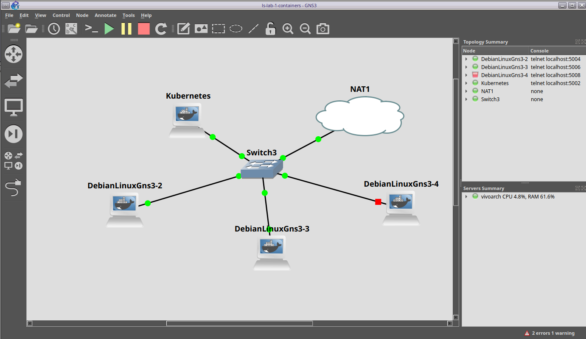

# AS Lab 1 - Bluetooth and RF

#### Artem & Ali SNE19

I decided to unroll the farm in a virtual environment first. The topology is shown below.

## 1. Distributing an Application

1. Deploy a simple application (e.g. a simple web page showing the  hostname of the host node it is running upon) and validate that its  instances are spreading across the farm.

