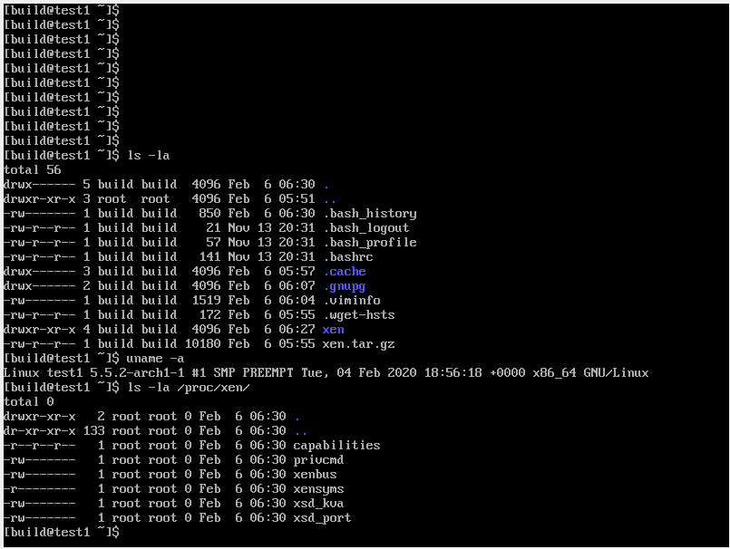
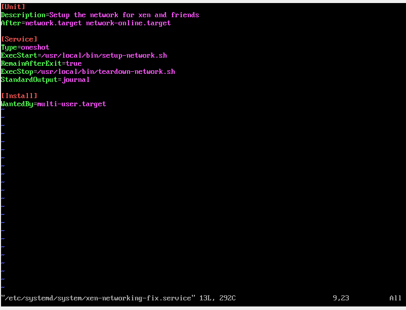
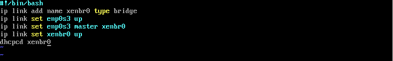
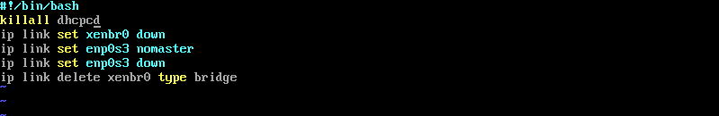
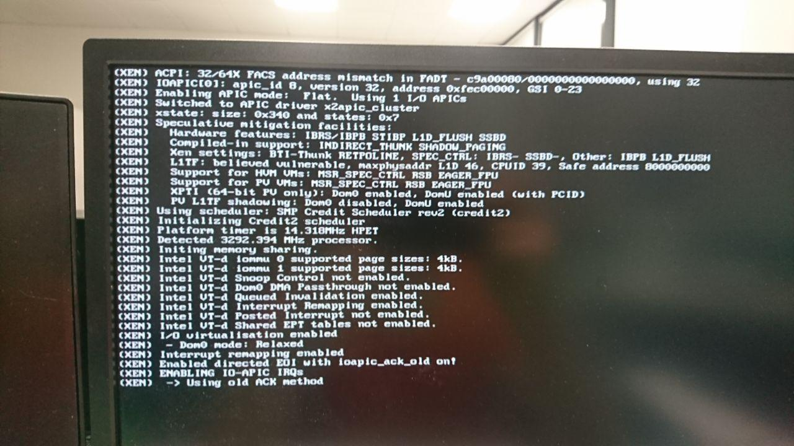

# LS Lab 1 - Hypervisors & Clouds

#### Artem Abramov SNE19

I decided to use the Xen hypervisor additionally compiling it from source and using a PVH for dom0 (going for the bonus task).

Source code:
https://wiki.xenproject.org/wiki/Xen_Project_Repositories

I wanted to run Xen as EFI binary, instructions for compilation: 
https://wiki.xenproject.org/wiki/Xen_EFI

And the actual compilation instructions:
https://wiki.xenproject.org/wiki/Compiling_Xen_From_Source

I decided to build xen in a container, so keep the main system clean from build dependencies.
Get docker archlinux container:

```
docker pull archlinux
```

Run it
```
docker run --name build-xen -it archlinux /bin/bash 
```

I choose to build Xen version 4.12.2 because 4.13.0 looked a bit too raw and had same release date as 4.12.2. Anyway this is way ahead of what comes with ubuntu - 4.9.

The next multiple steps  are mandatory  to setup the compilation environment (in no particular order):

- Prepare the container: enable multilib, install multiple build packages and multiple basic packages (because the container is truly minimal):
```
pacman -Syu vim vi base-devel multilib-devel sudo inetutils binutils python2
```

- Make an important link that is needed during compilation:
```
sudo ln -s /usr/bin/python2 /usr/bin/python
```

- Adjust PATH to get pod2man, and other perl utils:
```
export PATH="$PATH:/usr/bin/core_perl" 
```

- Add non root user for building and enable sudo:
```
useradd -m build && visudo && su build
```

Install perl, haskel (I cant imagine where its used, but its used!), and a number of other tools:

```
  "bin86"
  "binutils"
  "bridge-utils"
  "brltty"
  "cmake"
  "curl"
  "dev86"
  "fig2dev"
  "figlet"
  "ghostscript"
  "git"
  "gnutls"
  "iasl"
  "iproute2"
  "lib32-glibc"
  "libaio"
  "libcap-ng"
  "libepoxy"
  "libiscsi"
  "libnl"
  "libpng"
  "lzo"
  "markdown"
  "nasm"
  "ocaml-findlib"
  "pandoc"
  "pciutils"
  "perl"
  "python2"
  "sdl"
  "spice"
  "spice-glib"
  "spice-protocol"
  "usbredir"
  "vde2"
  "wget"
  "yajl"
```

An annoying to resolve source code error was:
```
xentoollog_stubs.c: In function 'stub_xtl_ocaml_progress':
xentoollog_stubs.c:123:16: error: initialization discards 'const' qualifier from pointer target type [-Werror=discarded-qualifiers]
  123 |  value *func = caml_named_value(xtl->progress_cb) ;
      |                ^~~~~~~~~~~~~~~~
```
Solution to error was to disable -Werror in `tools/ocaml/common.make`.

For build config most importantly I changed install path from `/usr/lib64/efi/`  to `/boot`.  Initially I wanted to build Xen without QEMU because I planned to use PHV only, however the compilation had problems and in the end I had to throw QEMU into the mix too.  Install options are below:

```
./configure \
    --prefix=/usr \
    --sbindir=/usr/bin \
    --with-sysconfig-leaf-dir=conf.d \
    --with-rundir=/run \
    --enable-systemd \
    --enable-ovmf \
    --with-extra-qemuu-configure-args=" \
      --disable-bluez \
      --disable-gtk \
      --disable-vte \
      --disable-werror \
      --disable-virglrenderer \
      --disable-libnfs \
      --disable-glusterfs \
      --disable-numa \
      --disable-smartcard \
      --disable-fdt \
      --enable-spice \
      --enable-usb-redir \
      --with-sdlabi=1.2"
```

The only good part of compiling is the ascii logo (with high version numbers):

```
make[2]: Entering directory '/home/build/xen/src/xen-4.12.2/xen'
make -C tools
make[3]: Entering directory '/home/build/xen/src/xen-4.12.2/xen/tools'
make symbols
make[4]: Entering directory '/home/build/xen/src/xen-4.12.2/xen/tools'
make[4]: 'symbols' is up to date.
make[4]: Leaving directory '/home/build/xen/src/xen-4.12.2/xen/tools'
make[3]: Leaving directory '/home/build/xen/src/xen-4.12.2/xen/tools'
make -f /home/build/xen/src/xen-4.12.2/xen/Rules.mk include/xen/compile.h
make[3]: Entering directory '/home/build/xen/src/xen-4.12.2/xen'
 __  __            _  _    _ ____    ____  
 \ \/ /___ _ __   | || |  / |___ \  |___ \ 
  \  // _ \ '_ \  | || |_ | | __) |   __) |
  /  \  __/ | | | |__   _|| |/ __/ _ / __/ 
 /_/\_\___|_| |_|    |_|(_)_|_____(_)_____|
                                           
make[3]: Leaving directory '/home/build/xen/src/xen-4.12.2/xen'
[ -e include/asm ] || ln -sf asm-x86 include/asm
[ -e arch/x86/efi ] && for f in boot.c runtime.c compat.c efi.h;\
	do test -r arch/x86/efi/$f || \
	   ln -nsf ../../../common/efi/$f arch/x86/efi/; \
	done; \
	true
make -f /home/build/xen/src/xen-4.12.2/xen/Rules.mk -C include
make[3]: Entering directory '/home/build/xen/src/xen-4.12.2/xen
```


Then we extract the files from docker with `docker cp build-xen:/home/build/xen ~/Downloads/xen ` and run make install on the actual host own system. Risky trick, but it works and does not pollute the host with a ton of build dependencies.


I had high hopes of booting in UEFI mode with rEFInd, but that was broken and although I could load the xen kernel with rEFInd (which was really cool!!) it hanged after the lines below (last line was `(XEN) TSC deadline timer enabled`):

```
--------- snipped ----------
(XEN) PCI: MCFG configuration 0: base 80000000 segment 0000 buses 00 - ff
(XEN) PCI: MCFG area at 80000000 reserved in E820
(XEN) PCI: Using MCFG for segment 0000 bus 00-ff
(XEN) Intel VT-d iommu 0 supported page sizes: 4kB, 2MB, 1GB.
(XEN) Intel VT-d iommu 1 supported page sizes: 4kB, 2MB, 1GB.
(XEN) Intel VT-d Snoop Control enabled.
(XEN) Intel VT-d Dom0 DMA Passthrough not enabled.
(XEN) Intel VT-d Queued Invalidation enabled.
(XEN) Intel VT-d Interrupt Remapping enabled.
(XEN) Intel VT-d Posted Interrupt not enabled.
(XEN) Intel VT-d Shared EPT tables enabled.
(XEN) I/O virtualisation enabled
(XEN)  - Dom0 mode: Relaxed
(XEN) Interrupt remapping enabled
(XEN) nr_sockets: 3
(XEN) Enabled directed EOI with ioapic_ack_old on!
(XEN) ENABLING IO-APIC IRQs
(XEN)  -> Using old ACK method
(XEN) ..TIMER: vector=0xF0 apic1=0 pin1=2 apic2=-1 pin2=-1
(XEN) TSC deadline timer enabled
```

Then got virtual box up and running, reinstalled everything (for the n-th time), this time the pivotal points of the config were:

- Grub2 for bootloader in UEFI mode
- External ovmf and seabios modules (installed as arch packages)
- Using xen 4.12.2 (recent release at the end of December 2019)

Below is the screenshot showing xen special nodes in `/proc` (which means it works!!):



However after checking output of `xl info` it bacame clear that dom0 was running as `pv` guest. After a few hours of reading it became clear that:

- PVH was not in mainline kernel to make it ready for dom0 
- only FreeBSD kernel had any success as dom0 (running as a demo!) for other kernels this is not yet supported :( 
  source: https://wiki.xenproject.org/wiki/Linux_PVH

The instructions for setting up FreeBSD as PVH guest for dom0 are here: https://www.freebsd.org/doc/handbook/virtualization-host-xen.html

Next was configuring networking.


To configure the networking arch linux does not use /etc/network/interface so for persistent and complex config the best way is defining a custom systemd service that would run at startup.



Code for setup is below:



Code for teardown is below:



source:

- https://gist.github.com/drmalex07/d006f12914b21198ee43
- https://unix.stackexchange.com/questions/224992/where-do-i-put-my-systemd-unit-file
- https://superuser.com/questions/1013658/how-to-skip-startup-jobs-for-fstab-no-timeout-centos7

After the network was functioning I went on to generate a qcow2 image for the guest, for this I used utilities that came with QEMU:

```
qemu-img create -f qcow2 harddrive1.qcow2 10G
```

Then an huge amount of time was spend trying to get this working in virtual box. Trying different ways to make xen (that was installed inside the virtualbox) access the image, including partitioning the virtual drive and dd the image into that. 

Gaspar advised me that he also faced problems running Xen in virtualbox and for him booting xen directly on the hardware worked.

I tried the same: running xen on my real hardware. 

Perhaps due to the unusual configuration, but Xen refused to boot (although I was using a procedure similar to what was working in virtual box where xen was booting arch linux kernel):



Perhaps it was because ofrEFInd, perhaps because Xen was version 4.12.2, perhaps because of 32 vs 64 bit issues, but no matter what I tried nothing could get past this.

I have really spend a lot of time on this lab, and while there was a lot of technical knowledge necessary to compile xen and make it boot with arch linux kernel as dom0 I could not finish the lab on time. 

In retrospect I should have taken an easier option, and used the packaged Xen, ignoring the bonus, but getting the core of the lab finished.


==================================


## Deadline was extended and here is how to setup Xen and guests on Ubuntu.

Install

```
apt-get install xen-system-amd64
```

Edit command line options, at least set memory for dom0 in `/etc/default/grub.d/xen.cfg`:

```
artem@labubuntu:~$ cat /etc/default/grub.d/xen.cfg 
GRUB_CMDLINE_XEN_DEFAULT="dom0_mem=4096M:max=4096M"
```

After editing update the cached grub config:

```
sudo update-grub
```

Basically switch networking to manual mode (can be done after reboot):

```
systemctl disable NetworkManager
systemctl disable systemd-networkd
systemctl disable systemd-resolved
```

Reboot now

```
systemctl reboot
```

Remove the now useless rm /etc/resolv.conf (its a broken symlink after disabling systemd-resolved) and make a plain file in its place with `nameserver 8.8.8.8`.

Make script to setup `xenbr0` note that ip belongs to the bridge NOT to ethernet interface:

```
artem@labubuntu:~$ cat mkbridge.sh 
#!/bin/bash
ip link set enp0s25 down
ip addr flush dev enp0s25
ip link add name xenbr0 type bridge
ip link set enp0s25 master xenbr0
ip link set enp0s25 up
ip link set xenbr0 up
dhclient xenbr0
```


#### Now configure a single guest

source: https://www.virtuatopia.com/index.php/Building_a_Debian_or_Ubuntu_Xen_Guest_Root_Filesystem_using_debootstrap

Make virtual harddrive (note count=1):

```
dd if=/dev/zero of=guest1.img bs=1024k seek=6144 count=1
```

```
mkfs -t ext4 guest1.img
```


Make swap (note count=0):

```
dd if=/dev/zero of=guest1.swap bs=1024k seek=1024 count=0
```

```
mkswap guest1.swap
```


Now make Xen config for this drive (xen <= 4.9 uses `builder="pv/hvm/pvh"`, xen >= 4.10 use `type=`:

```
artem@labubuntu:~$ cat guest1.cfg 
name="guest1"
vcpus=1
memory=1024
builder="pv"
disk = ['tap:aio:/home/artem/guest1.img,xvdb1,w', 'tap:aio:/home/artem/guest1.swap,xvdb2,w']
kernel="/boot/vmlinuz-5.3.0-28-generic"
ramdisk="/boot/initrd.img-5.3.0-28-generic"
root="/dev/xvdb1 rw"
vif = [ '' ]
extra='xencons=tty'
```

 


Install with debottstrap (like arch linux pacstrap)

```
mkdir -p /tmp/xenloop
mount -o loop guest1.img /tmp/xenloop
```

Install and run debootstrap:

```
apt-get install debootstrap
debootstrap bionic /tmp/xenloop
```

Make the modules dir and copy kernel modules:

```
mkdir -p /tmp/xenloop/lib/modules
cp -r /lib/modules/* /tmp/xenloop/lib/modules
```

Copy apt/sources (there is only one source setup by debootstrap, extras like docker.io are unavailable):

```
cp /etc/apt/sources.list /tmp/xenloop/etc/apt/sources.list
```

Chroot and configure:

```
chroot /tmp/xenloop
```

Set root password and unlock root account:

```
passwd
passwd -u root
```

Must configure /etc/fstab by hand (use the drive name from `guest1.cfg`):

```
root@labguest1:~# cat /etc/fstab 
# UNCONFIGURED FSTAB FOR BASE SYSTEM
/dev/xvdb1 		 /				ext4 	defaults		0		0
/dev/xvdb2       none           swap    sw              0       0
```


Remember:

- /etc/hostname - `guest1`

- /etc/exports - if guest needs to access NFS this is best place to configure params

- `apt-get install openssh-server` and set `PermitRootLogin yes` 

- Disable all the automatic network stuff like done for dom0 - but maybe this is better done later


Then quit, unmount:

```
umount /tmp/xenloop
```

Boot guest in xen (the `-c` flag means attach current console to guest):

```
sudo xl create guest1.cfg -c
```

If you messed up with debootstrap (i.e. with installing the userspace) you will get emergency prompt at initramfs here.

First thing to run in the console is dhclient to get a valid ip:

```
dhclient eth0
```

Next its very important to update and upgrade (solves some weird problems in ubuntu):

```
apt-get update && apt-get upgrade
```


