# LS Lab 3 Monitoring

Artem Abramov, Stepanov Alexey

### Task 1 - Preparation

I choose Zabbix . 

##### Install a new guest system

Installed guest on Xen. I wanted to get over monitoring first to I quickly setup a test server with python built-in httpd.

```
python3 -m http.server 8000 &> /dev/null
```


The heavy website is based on wordpress docker container. Source: https://hub.docker.com/_/wordpress/

It can be deployed with the following config, just keep all the defaults:

```
# cat stack.yml
version: '3.1'

services:

  wordpress:
    image: wordpress
    restart: always
    ports:
      - 8080:80
    environment:
      WORDPRESS_DB_HOST: db
      WORDPRESS_DB_USER: exampleuser
      WORDPRESS_DB_PASSWORD: examplepass
      WORDPRESS_DB_NAME: exampledb
    volumes:
      - wordpress:/var/www/html

  db:
    image: mysql:5.7
    restart: always
    environment:
      MYSQL_DATABASE: exampledb
      MYSQL_USER: exampleuser
      MYSQL_PASSWORD: examplepass
      MYSQL_ROOT_PASSWORD: rootpass
    volumes:
      - db:/var/lib/mysql

volumes:
  wordpress:
  db:
```


Run with docker compose (install docker compose, choose `Linux` tab: https://docs.docker.com/compose/install/) 

```
docker-compose -f stack.yml up
```


Configure wordpress as below:

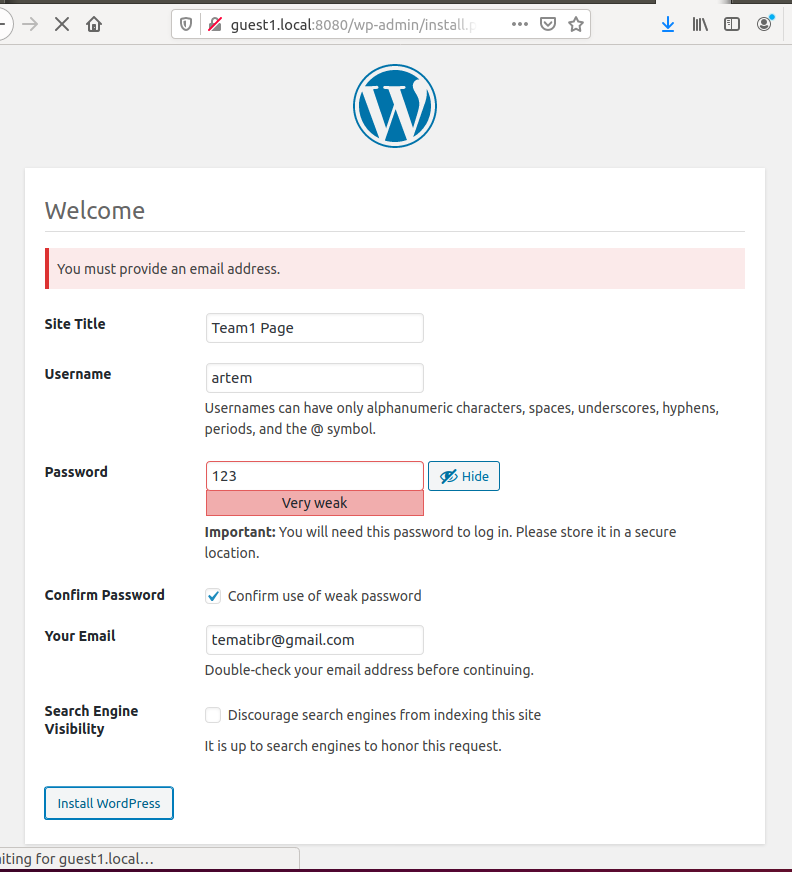


Then I configured wordpress with a heavy theme and left it at that.


##### Install and setup web-server + DBMS (e.g. NGINX + MariaDB)

##### Install and setup a CMS. Create a page with some heavy content

##### Install another guest system and deploy the monitoring facility (and agents, if required)

I setup another Xen guest. And configured MariaDB + PHP + NGinx + Zabbix

sources: 

- https://www.dmosk.ru/miniinstruktions.php?mini=zabbix-server-ubuntu#zabbix
- https://serveradmin.ru/ustanovka-i-nastroyka-zabbix-4-0/#_Zabbix_40_Ubuntu_Debian


To login into the web interface of Zabbix in the end the default user name is **Admin**, password **zabbix**. 

There is a docker `zabbix-appliance` container which works (and contains a DB + PHP + WebServer + Zabbix Server), although it takes 20 minutes to startup (db population with schema is extremely slow), use `docker logs <container-name>` to check its status. More info here: https://hub.docker.com/r/zabbix/zabbix-appliance and https://www.zabbix.com/documentation/current/manual/installation/containers


DB install and set root password:

```
apt-get install mariadb-server
systemctl enable mariadb
systemctl start mariadb
mysqladmin -u root password
```

Web server:

```
apt-get install nginx
systemctl enable nginx
systemctl start nginx
```

Check that nginx works by going to the ip address in browser.

PHP:

```
apt-get install php php-fpm php-mysql php-pear php-cgi php-common php-ldap php-mbstring php-snmp php-gd php-xml php-gettext php-bcmath
```

Configure php (get version with `php -v`):

```
# cat /etc/php/7.2/fpm/php.ini
date.timezone = "Europe/Moscow"
max_execution_time = 300
post_max_size = 16M
max_input_time = 300
max_input_vars = 10000
```

Enable:

```
systemctl enable php7.2-fpm
systemctl restart php7.2-fpm
```

Configure php in nginx:

```
# cat /etc/nginx/sites-enabled/default
    ...
    location / {
        index  index.php;
        ...
    }
    ...
    location ~ \.php$ {
        set $root_path /var/www/html;
        fastcgi_buffer_size 32k;
        fastcgi_buffers 4 32k;
        fastcgi_pass unix:/run/php/php7.2-fpm.sock;
        fastcgi_index index.php;
        fastcgi_param SCRIPT_FILENAME $root_path$fastcgi_script_name;
        include fastcgi_params;
        fastcgi_param DOCUMENT_ROOT $root_path;
    }
    ...
```

Check nginx config and start:

```
nginx -t
systemctl restart nginx
```

Check PHP works, create index.php:

```
# cat /var/www/html/index.php
<?php phpinfo(); ?>
```

Check by going to the IP of the server (should display PHP version info).

Zabbix add repo (note use 4.0, not 4.2, not 4.4):

```
wget https://repo.zabbix.com/zabbix/4.0/ubuntu/pool/main/z/zabbix-release/zabbix-release_4.0-3+bionic_all.deb
```

Install and add packages:

```
dpkg -i zabbix-release_4.0-3+bionic_all.deb
apt update && apt upgrade
apt install zabbix-server-mysql zabbix-frontend-php
```

At this point make sure to disable apache2:

```
systemctl stop apache2
systemctl disable apache2
```

Configure mysql for zabbix:

source:  https://www.zabbix.com/documentation/4.0/manual/appendix/install/db_scripts#mysql

Login:

```
mysql -uroot -p
> create database zabbix character set utf8 collate utf8_bin;
> grant all privileges on zabbix.* to zabbix@localhost identified by 'zabpassword';
> \q
```

Its important to create db as utf-8 else faced with error about string too long.

Now apply zabbix schema to db, better take it step by step:

```
cd /usr/share/doc/zabbix-server-mysql/
gunzip create.sql.gz
mysql -v -u root -p zabbix < create.sql
```

Enter the password from sql above `identified by 'zabpassword';` i.e. `zabpassword`.

Edit zabbix config, first critical options:

```
# cat /etc/zabbix/zabbix_server.conf
DBName=zabbix
DBUser=zabbix
DBPassword=zabpassword
...
```

Then semi-critical options:

```
DBHost=localhost
ListenIP=0.0.0.0
Timeout=10
```

Make sure log and config dirs are created:

```
mkdir -p /etc/zabbix/zabbix_server.conf.d
mkdir -p /var/log/zabbix-server
chown zabbix:zabbix /var/log/zabbix-server
```

Start and enable:

```
systemctl enable zabbix-server
systemctl start zabbix-server
```

Next is merging zabbix with nginx because zabbix web frontend gets installed into ` /usr/share/zabbix`

```
# cat /etc/nginx/sites-enabled/default
...
root /usr/share/zabbix;
...
set $root_path /usr/share/zabbix;
...
```

Check nginx config and restart:

```
nginx -t
systemctl restart nginx
```

Check the ip address for web interface:


After configuration was successful (requires the password for db zabbix user: `zabpassword`) a config file si created in `/usr/share/zabbix/conf/zabbix.conf.php`.

To login into the web interface the default user name is **Admin**, password **zabbix**. 

Sidenote: docker zabbix-appliance container with zabbix works, but takes 15 minutes to startup (db population with schema is extremely slow).


#####  Installing an agent on a slave machine that will report to the server

Install package:

```
apt-get install zabbix-agent
```

Fix config:

```
root@guest1:~# cat /etc/zabbix/zabbix_agentd.conf
...
Server=10.1.1.184
ServerActive=10.1.1.184
Hostname=guest1
...
```

Start and enable at boot:

```
systemctl start zabbix-agent
systemctl enable zabbix-agent
```


Then you must add the agent to the zabbix server, in the web interfce:

```
Configuration -> Hosts -> Create host (tiny button) 
```

Enter `Host name` in this case `guest1` (same as in the zabbix_agentd.conf)

Go to `Templates` tab, select one or multiple templates (remember to click the small hyperlinked text  `Add` before clicking one of the big  `Add` / `Update` buttons) 

Then the slave machine should be visible:

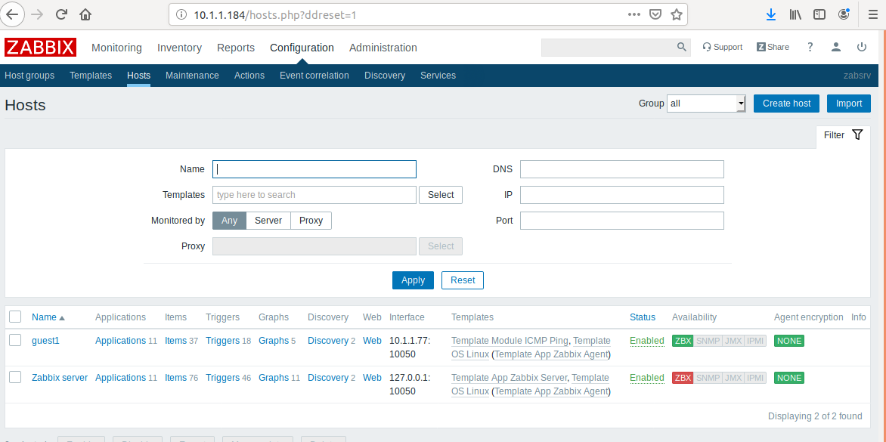


To check what network Zabbix server can see, go to 

```
Monitoring -> Discovery
```

You can configure discovery in 

```
Configuration -> Discovery
```

For example configure to scan LAN network `10.1.1.0/24` once an hour with ICMP ping:

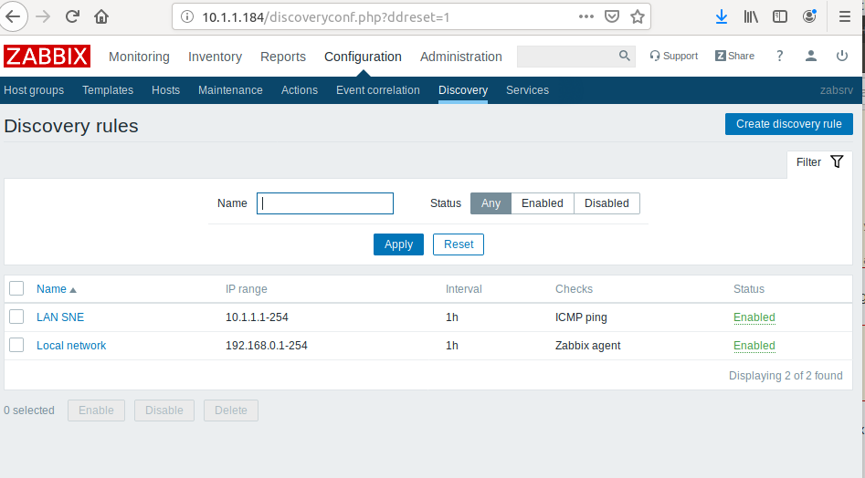


View status:


Problems overview, the report is pretty detailed:

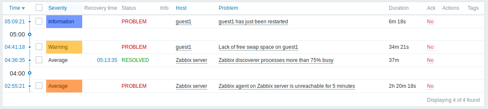


## Task 2 - Status alerts

### - against the guest system itself (ping)
### - against available RAM or disk space (with threshold about 90%)

To quickly configure many of the default parameters I applied two templates to a slave machine:
```
Configuration -> Hosts -> [hostname] -> Templates
```
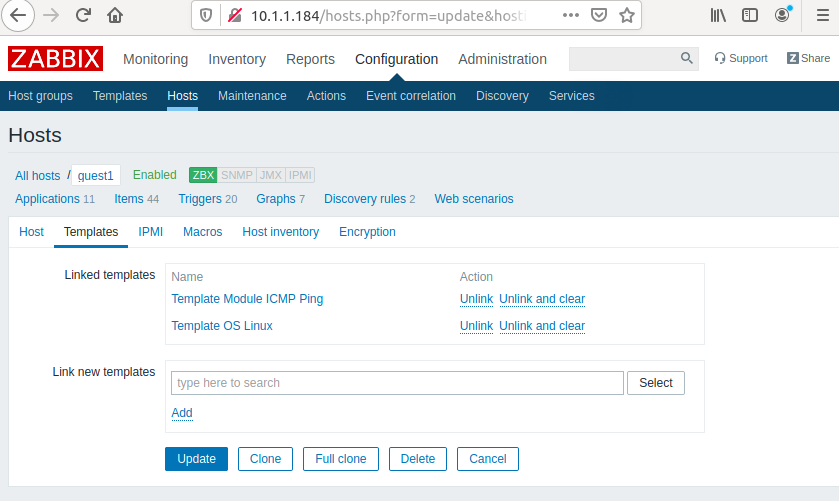


Looking at the Module ICMP Ping template we can see that it sets up ping triggers (i.e. alerts):

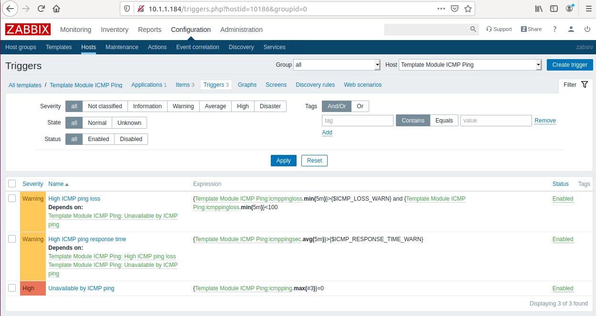


The alerts for RAM and storage are configured. Below is an example graph for disk io performace:

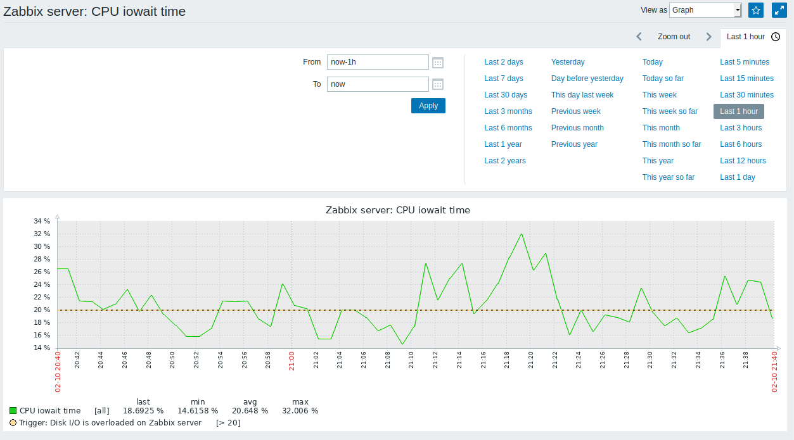


When that time overcomes the threshold `[> 20]`  notification will appear on main dashboard `Disk I/O is overloaded on Zabbix server`:

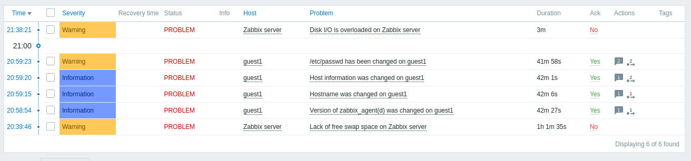

The multiple problems related to guest (change of hostname and /etc/passwd) are because I moved the zabbix-agent from a normal install into a docker container. 


When the problem is resolved (due to whatever reason) a new notification will pop-up as below:

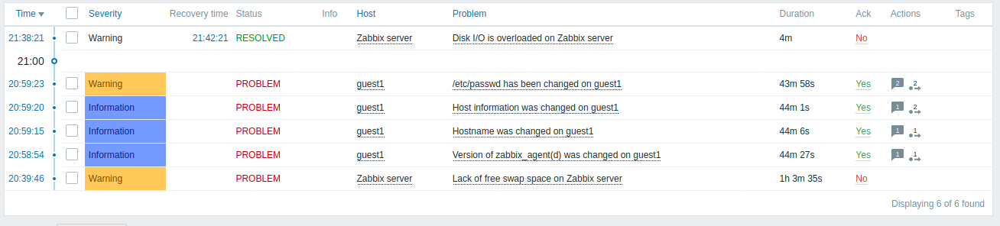


### - against the web service
### - and against two web pages, a simple one and the heavy-duty one
###  Validate that your monitoring displays an alert once you destroy the service (what is the delay, how long does it take for it to appear?)

source: https://www.zabbix.com/documentation/4.0/manual/web_monitoring

Final config for the web check (see link above for details) 
```
Configuration -> Hosts -> [hostname] -> Web scenarios -> Create web scenario
```

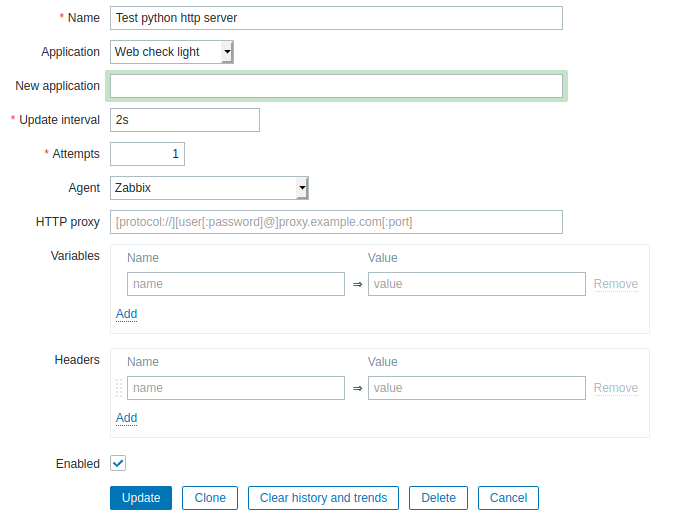

And query URL's are below, visible in the `Steps` tab:


Then I created a graph 

```
Configuration -> Hosts -> [hostname] -> Graphs -> Create Graph
```

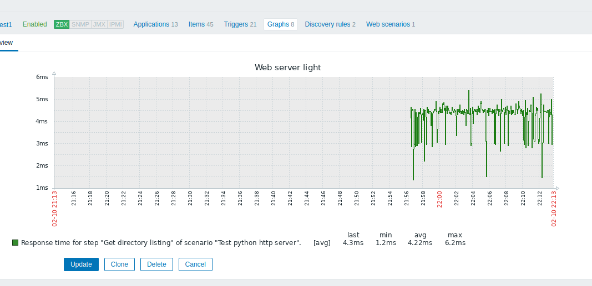


Setup trigger to fire when web service goes down. 

```
Configuration -> Hosts -> [hostname] ->Triggers -> Create trigger
```

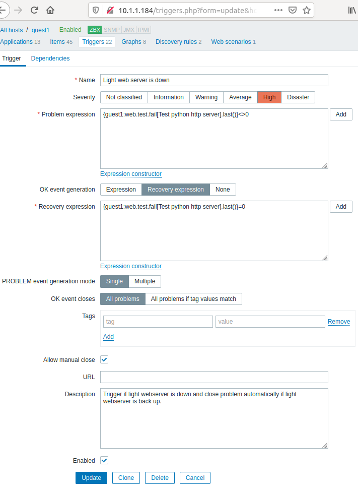


Once I stopped the server the error appeared response was almost immediate because I had set 2 seconds check interval when configuring the `Test python http server` Web check:


After starting the web server error was resolved:

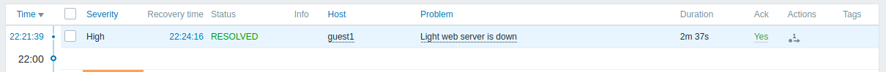


We can see the graph of access time to web server the gap on the right is when it was offline:

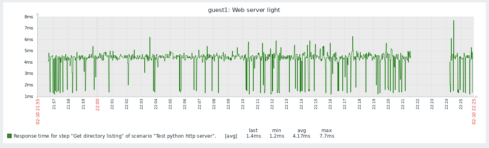


I did the same config for the heavy web server, basically the only thing that changed is the port. For the light web server it was port 8000, for the heavy it was 8080.


Here I added guest1's ip to the /etc/hosts on all the other machines:

```
# cat /etc/hosts
...
10.1.1.97	guest1.local
...
```


## Task 3 - Stress & performance graphs

#### Take a pick for stress benchmark

#### Then use your load-testing tool of choice and perform a few different load tests

I decided to use JMeter tool (inspired by the answer here https://stackoverflow.com/questions/10260526/which-gets-the-measurements-right-jmeter-or-apache-ab)

#### Define performance graphs for AT LEAST the four different kinds of resources (CPU, RAM, DISK I/O, Network TX/RX)

CPU utilization graph (last hour):

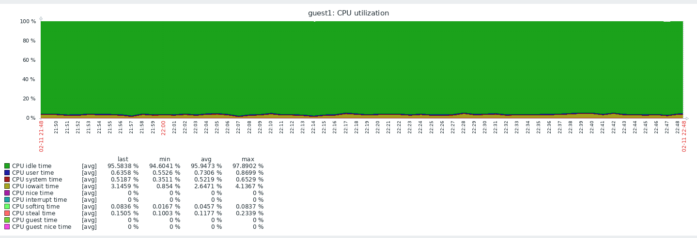


CPU load graph (for the last two days, the spike is when I was installing wordpress):

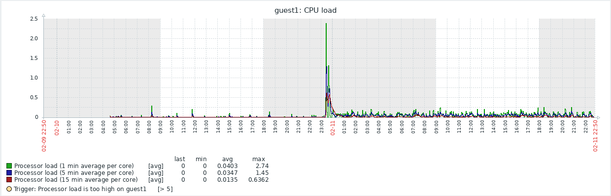


Processor load is given in the same values as `uptime`, i.e. load per core.

Disk I/O:

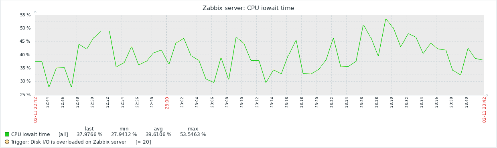


Network incoming / outgoing for the last 6 hours:

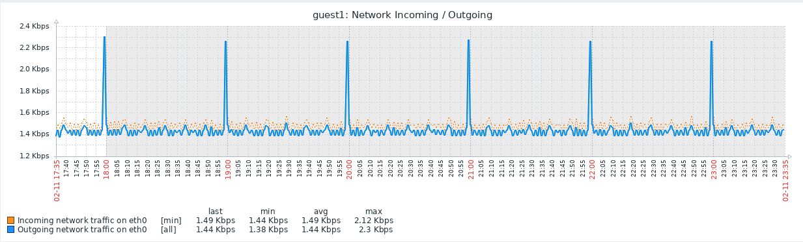

From this graph its visible that every hour there is a spike in traffic. I investigated and its due to multiple plugins that come with WordPress by default submit plugin usage information to their developers :) 


#### Play with the number of threads, number of clients, and request bodies while performing requests

source: https://medium.com/@harrietty/load-testing-an-api-with-apache-benchmark-or-jmeter-24cfe39d3a23


First test easy setup:

_032.png)

Request settings:

%20-%20Apache%20JMeter%20(2.13.20170723)_033.png)


Second settings, more aggressive:

%20-%20Apache%20JMeter%20(2.13.20170723)_034.png)


Results of the second, more aggressive test:

%20-%20Apache%20JMeter%20(2.13.20170723)_035.png)


Third setting, most aggressive:%20-%20Apache%20JMeter%20(2.13.20170723)_036.png)


To run more aggressive test its better to use the command line, instead of the GUI, then JMeter can utilize machine resources to saturate the server.

```
jmeter -n -t Lab-3-monitoring.jmx -l testresult.jlt
```

Result:


And a sample of responses:

```
# cat testresult.jlt
1581460780342,66,HTTP Request,200,OK,Thread Group 1-1,text,true,60180,1,1,65
1581460782947,51,HTTP Request,200,OK,Thread Group 1-2,text,true,60180,1,1,41
1581460785942,54,HTTP Request,200,OK,Thread Group 1-3,text,true,60180,1,1,45
1581460788940,38,HTTP Request,200,OK,Thread Group 1-4,text,true,60180,1,1,30
1581460791941,37,HTTP Request,200,OK,Thread Group 1-5,text,true,60180,1,1,29
```


#### Look at the monitoring screen to see how bad your system is.  What *resource* is the more impacted?..

Impact on memory (less green, means less free memory):

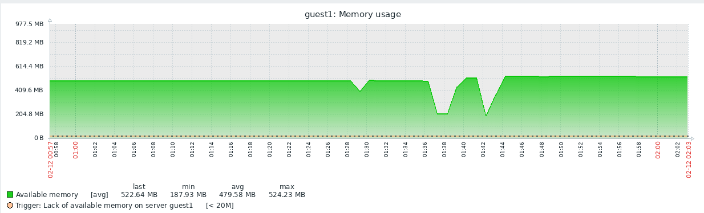


Network IO (for some reason it stayed at the same level, throughout the test, perhaps this is because the zabbix-agent is running inside a docker container in `guest1` and his traffic gets somehow limited):

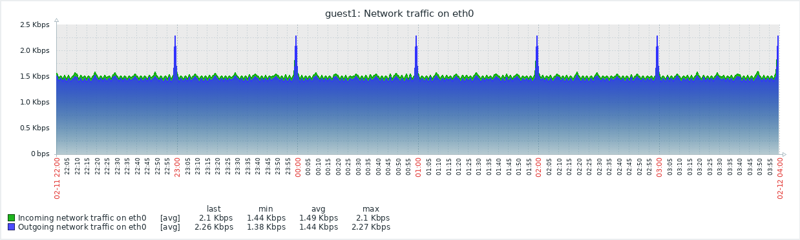


CPU load is shown below:

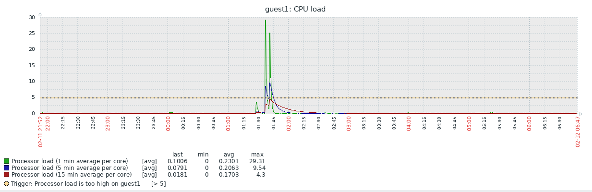


CPU time waiting for io (for disks):

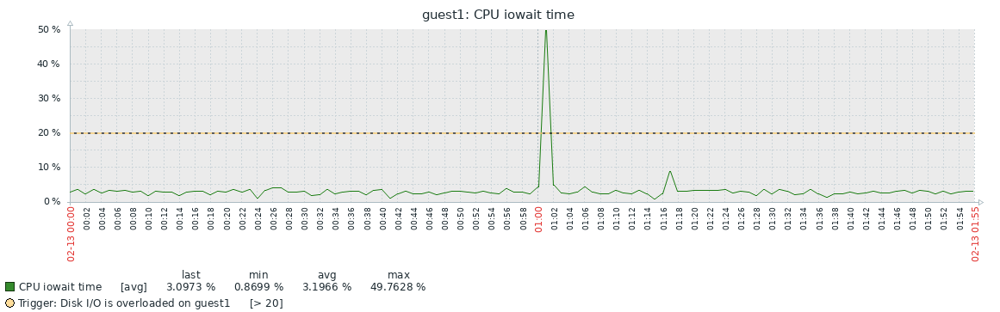


Overall it looks like the most impacted resource is the CPU load and CPU iowait time (i.e. disks!).


#### Configure an alert threshold for one of those and validate it (Note: it does not make sense to define a threshold for CPU or Network unless you can define a timer within it)

I setup a custom trigger for when the Free Memory reaches below 250M. Then I run the third variation of the JMeter test again. 

JMeter report:


Zabbix memory  graph:

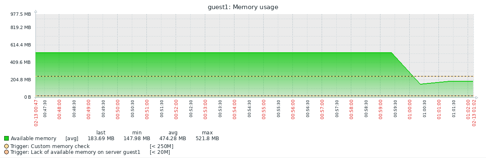


And the trigger working on the Dashboard (by the time I took the screenshot the memory problem `Custom memory check` was already marked as RESOLVED by zabbix, but we can see it lasted for 1 minute and had a 1 minute 2 seconds of recovery time):


#### Questions

- Do the resulting metrics match with your stress load-test?

The metrics (shown in answer to a question above as graphs)  indicate that the system was under stress load-test on 2020-02-12 at around 01:40.


- Are you metrics representative of the actual state of affairs?  Do they reflect reality?

The metrics taken by JMeter reflect reality because they avoid multiple common errors: 

1. Error - saturating the benchmark tool faster than saturating the webserver. For example benchmarking Nginx (web server in C on latest Intel CPU) with JMeter (big Java app on some standard CPU) is just useless, because Nginx can run circles around JMeter. In my case the server is a wordpress page heavy theming, which is definately slow enough for JMeter to saturate it.
2. Error - Running thousands of requests and then taking rough average / mean across everything. This is done by simple tools. JMeter does more, it records more data and is a fully featured load testing tool.
3. Error -  Testing with an unrealistic testing pattern. Bombarding server with a thousand requests to a single page is not realistic and has subtle interaction with caches, etc. JMeter allows to carefully simulate whatever usage patterns are expected, for example the queries ramp up period allowing the server time to warm up.
4. Error - Simplistic testing, because tools like Apache Benchmark and Siege cannot be used to define complex use-cases with form submission or multi-step processes (for example a checkout).  JMeter can search for values in the webpage and verify image/text, more than just response status.

On the other hand, the metrics reported by Zabbix might not be representative of the real state:

1. The network graph seems to be misleading, it does not show signs of stress testings, perhaps this is because zabbix-agent is run in the container and does not have access to actual network stats (?)
2. The metrics reported for CPU usage seem slightly unrealistic, because in the end each JMeter request completed successfully, however CPU graph shows just unbelievable CPU usage.

 

- Are some of those irrelevant and should be omitted?

Disk I/O by itself is not very useful, much better to investigate the time that CPU waits for IO, i.e. CPU iowait time. Fast disks are cool, but normally we need more context, such as is the CPU waiting for the disks or the other way around.


- So is your system high-load capable?  If not, What would it take to make it happen?

Its not highload capable. Clearly the CPU and free memory were exhausted (free memory by around 50%) from serving 1000 requests. One way to improve the system would be if it was taken out of the docker container, out of the Xen guest and run on the actual host hardware. Using Ubuntu as the base OS is also not the smartest choice as there are many useless services enabled and running by default that take up CPU and IO. Something like Alpine Linux is a much better choice. If there is more money, then instead of running on bare metal, put it behind reverse proxy, setup load balancing and multiple instances of the same docker container, that would help. 


## Task 4 - Trends & business metrics

**Trends** - collect and store metric results for some period of time to see the analytic and forecasts.  Define a few ones, for example

- RPC (requests per second) on web-server, DBMS, etc
- worker threads and processes
- queue size
- reply time (web-page generation time).
- MySQL/MariaDB types of operations, operations per second, db bandwidth, db disk i/o

and eventually define an alert threshold for one of those


Monitoring number of running processes and processes in the system with two triggers (two alerts):

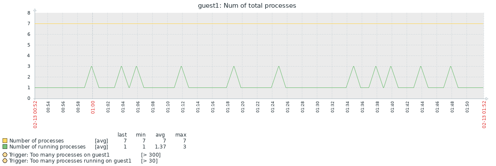


MySQL alert trigger that checks periodically  if the DB is up or down:

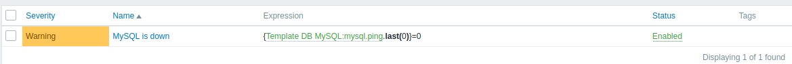


**Business metrics** - the above metric does not mean or cannot prove that you application works well in terms of functionality.  Proceed with more fine-grained data, for example

- user activity (number of visits/views)
- how many views vs how many applicants
- page load time
- login/sign ups/buys/comments/etc
- ad conversions
- high-level metrics


