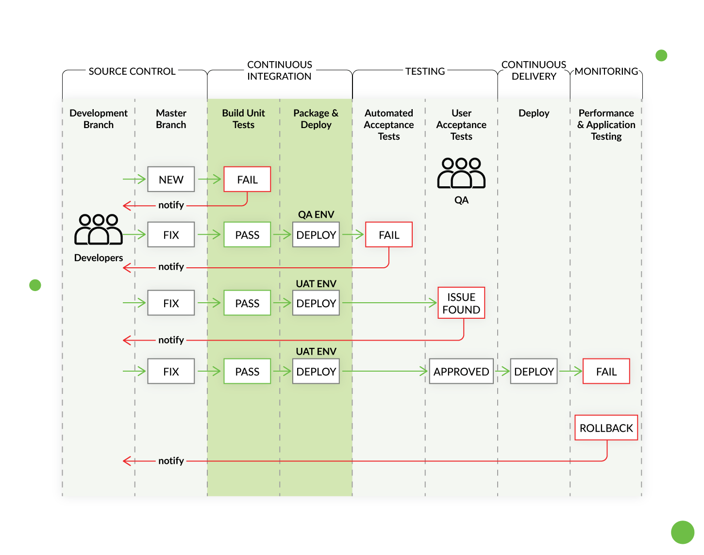
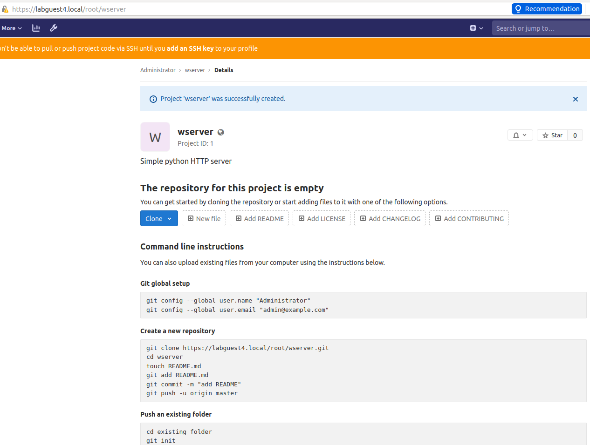
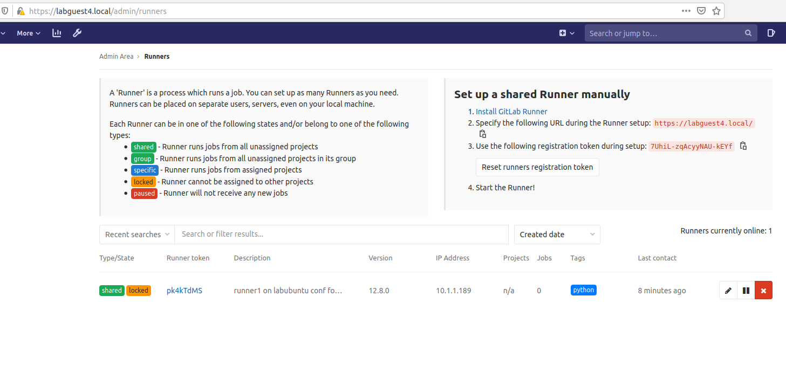
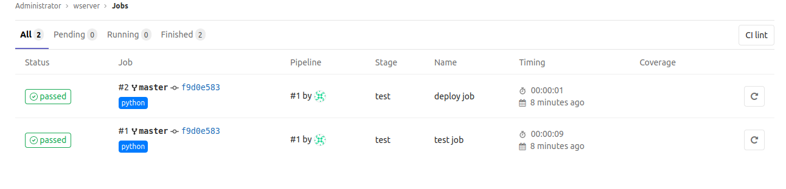
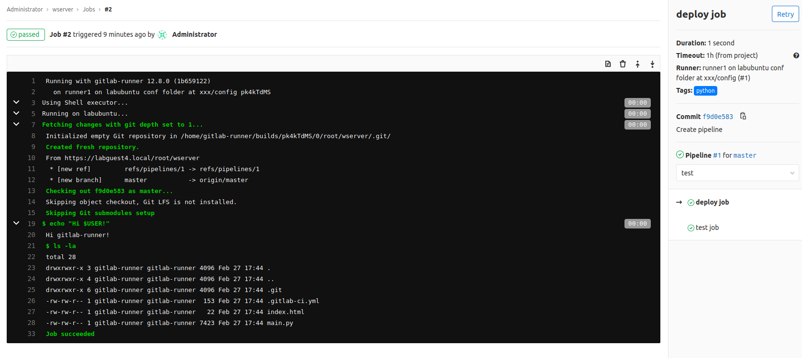
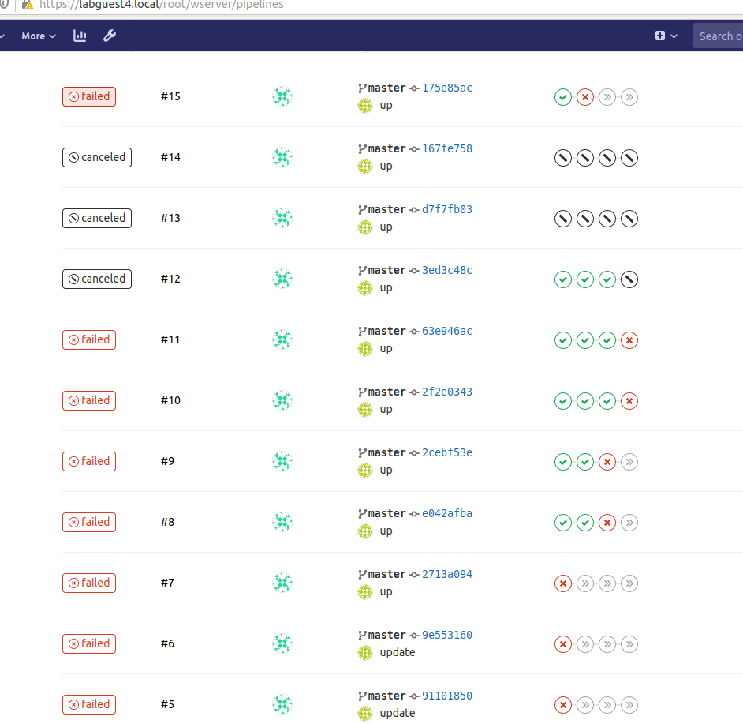
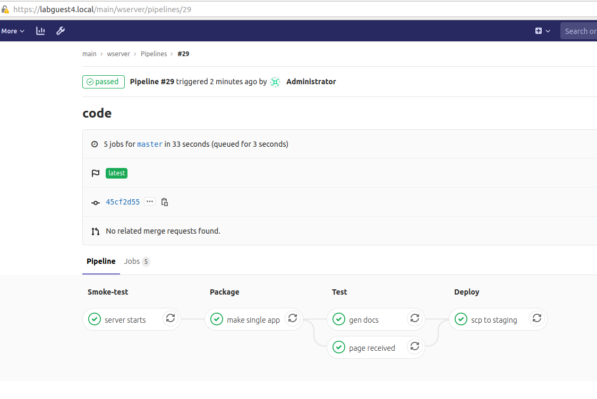

# LS Lab 5 CI/CD Pipeline

Artem Abramov


## Choice 1 - Continuous Integration

I decided to choose continuous integration. I was in particular interested how to organize tests and code combination automatically (instead of using the approach known as the Big Bang Integration).


The interesting options were:

- Jenkins (perhaps with Blue Ocean interface https://jenkins.io/projects/blueocean/) because it is open source and is basically standard.
- Gitlab CI/CD because it integrates with git hosting to make things easier to configure (you maintain a single server that is both git and CI/CD)
- GoCD is a much smaller project, but looks mature: https://www.gocd.org/pipelines-as-code.html


To unroll the project potentially the most hyped way would be to write a base image description with Packer, from which its possible to build either VMs or docker containers (see https://packer.io/docs/builders/docker.html). Then unroll this image with Terraform and finally as a cherry on top you get to run whatever Ansible scripts you need to make each VM a bit special in whatever way is necessary. 

The interaction between Packer and Terraform is described here: https://stackoverflow.com/questions/49314752/when-to-provision-in-packer-vs-terraform

The interaction between Packer and config tools (Chef, Puppet, Ansible) is described here: https://packer.io/intro/index.html

Packer is basically the new Vagrant.


An interesting read that goes into great detail: 

https://www.stupid-projects.com/devops-for-embedded-part-1/

### Pipeline stages

- Commit code - When developers write the actual code, and push their branches to a particular git repository.
- Merge code from different developers - because there can be many people working on one project, its best to daily merge the changes introduced by each developer, this keeps the diff and conflicts in code as simple as possible. 
- Run automated tests - after the merge is performed, unroll the code into a staging environment and run tests against it. For a basic setup this must check that the program runs and basic functionality is available. For web apps this could be testing in different browsers. For desktop apps this could be testing in multiple OS (inside a VM). In a proper software shop this would also include regression tests and code linter (e.g. for style or static analysis).
- Deploy to production  - This would happen after some extensive manual testing when the release would be considered to be ready.


The pipeline can look as below:




### Creating a simple project

To make the example more concrete I decided to write a simple HTTP server in python as the example application.

On my local i.e. developer machine I created a directory `wserver` for my project and inside placed a single file with a python web server (taken from https://raw.githubusercontent.com/enthought/Python-2.7.3/master/Lib/SimpleHTTPServer.py).

```
# tree wserver/
wserver/
└── main.py

0 directories, 1 file
```

And I could run it and get some output in the browser and the following log in the console:

```
# python wserver/main.py 8080
Serving HTTP on 0.0.0.0 port 8080 ...
127.0.0.1 - - [27/Feb/2020 06:25:18] "GET / HTTP/1.1" 200 -
127.0.0.1 - - [27/Feb/2020 06:25:21] "GET /wserver/ HTTP/1.1" 200 -
```

Then I initialized a git repository in the `wserver` directory and created an initial commit.


### Configuring Gitlab

source: https://docs.gitlab.com/omnibus/docker/#install-gitlab-using-docker-compose

Then I used a virtual machine to setup a  Community Edition of Gitlab aka gitlab-ce. Inside the virtual machine I got the docker image:

```
docker pull gitlab/gitlab-ce:latest
```

Installed docker-compose version 1.25.4.

```
sudo curl -L "https://github.com/docker/compose/releases/download/1.25.4/docker-compose-$(uname -s)-$(uname -m)" -o /usr/local/bin/docker-compose
```

and change permission:

```
sudo chmod +x /usr/local/bin/docker-compose
```

Created a `gitlab-compose.yml` in home dir:

```
web:
  image: 'gitlab/gitlab-ce:latest'
  restart: always
  hostname: 'labguest4.local'
  environment:
    GITLAB_OMNIBUS_CONFIG: |
      external_url 'https://labguest4.local'
  ports:
    - '80:80'
    - '443:443'
    - '22:22'
  volumes:
    - '/srv/gitlab/config:/etc/gitlab'
    - '/srv/gitlab/logs:/var/log/gitlab'
    - '/srv/gitlab/data:/var/opt/gitlab'
```

Created the directories on host:

```
mkdir -p /srv/gitlab/config
mkdir -p /srv/gitlab/logs
mkdir -p /srv/gitlab/data
```

Run the compose:

```
docker-compose -f gitlab-compose.yml up -d
```


The container took a long time to start because it was creating the database, etc.

The container attempted to get a signed certificate for `labguest4.local` but failed (of course, its a local ip: `10.1.1.136`). Never the less a self signed certificate was issued. For the purpose of this lab, it is enough. 


After going to `https://labguest4.local` I was prompted to set password of `root` user, then I could login as @root.


Then I create a `wserver` project:




And pushed the first commit.


#### Setting up the CI

First some basic settings. Go to the settings panel: https://labguest4.local/root/wserver/-/settings/ci_cd

- Disable Auto DevOps, because we will define our own pipeline
- configure to use git clone
- configure clone depth to be 1
- remove max size on binary artifacts
- specify file for our pipeline config: `.gitlab-ci.yml`


For each commit or push to trigger the CI/CD pipeline:

- Add a `.gitlab-ci.yml` to your repository's root directory.
- Ensure your project is configured to use a Runner.

In GitLab, Runners run the jobs that you define in `.gitlab-ci.yml`. A Runner is an agent that can be run on a virtual machine, a VPS, a bare-metal machine, a docker container or even a cluster of containers. GitLab and the Runners communicate through an API.  The official Runner supported by GitLab is written in Go.


##### Install a runner 

source: 

- https://docs.gitlab.com/runner/install/
- https://docs.gitlab.com/runner/install/docker.html

I used another machine, not gitlab's:

```
mkdir -p /srv/gitlab-runner/config
```

For different runners (with different config) use different host volumes e.g. config1, config2, config3:

```
/srv/gitlab-runner/config
```

Run docker image (in this case I specify `--network=host` flag to force docker to use the `/etc/hosts` from my machine because this is all running on LAN, normally the address would just resolve correctly):

```
docker run -d --name gitlab-runner --restart always \
  -v /srv/gitlab-runner/config:/etc/gitlab-runner \
  -v /var/run/docker.sock:/var/run/docker.sock \
  --network=host \
  gitlab/gitlab-runner:latest
```


Register the runner with my gitlab instance (Note that `--network=host` is only necessary to copy `/etc/hosts` to docker because I am setting this up on LAN):

```
docker run --rm -t -i \
	-v /srv/gitlab-runner/config:/etc/gitlab-runner \
	--network=host \
	gitlab/gitlab-runner register
```

This should result in output like:

```
Runtime platform                                    arch=amd64 os=linux pid=6 revision=1b659122 version=12.8.0
Running in system-mode.                            
             Selection_052                                      
Please enter the gitlab-ci coordinator URL (e.g. https://gitlab.com/):
https://labguest4.local/
Please enter the gitlab-ci token for this runner:
7UhiL-zqAcyyNAU-kEYf
Please enter the gitlab-ci description for this runner:
[labubuntu]: runner1 on labubuntu conf folder at xxx/config       
Please enter the gitlab-ci tags for this runner (comma separated):
python
Registering runner... succeeded                     runner=7UhiL-zq
Please enter the executor: custom, docker, docker-ssh, ssh, virtualbox, docker+machine, kubernetes, parallels, shell, docker-ssh+machine:
shell 
Runner registered successfully. Feel free to start it, but if it's running already the config should be automatically reloaded! 
```

##### Choosing the values:

- To share the runner register him as Shared Runner.
- To get a new token for a runner go to https://labguest4.local/admin/runners (the `/admin/runners` is the important part).
- Choosing tags is described here: https://labguest4.local/help/ci/runners/README#using-tags
- Choosing the executor is described here: https://docs.gitlab.com/runner/executors/README.html


Another problem particular to LAN only networks is that the Runner needs a properly signed certificate for the GitLab instance! This can be overcome as per instructions: https://docs.gitlab.com/runner/configuration/tls-self-signed.html

To get the certificate go to the Gitlab instance in browser and click on the shield/lock, then View Certificate, then both Firefox and Chrome provide options to download the certificate chain in PEM format, make sure to download the chain. 

Then per the link above (but remember to create the `certs` directory):

```
# cp ~/labguest4-local-chain.pem /srv/gitlab-runner/config/certs/labguest4.local.crt
```


Runner is configured:



### Pipeline

Overview https://labguest4.local/help/ci/quick_start/README

Details of .gitlab-ci.yml syntax and features: https://docs.gitlab.com/ee/ci/yaml/README.html


Dummy pipeline to explore committed to repository (note the `tag: python` to get run by the only available runner):

```
artem@labubuntu:~/Desktop/wserver$ cat .gitlab-ci.yml 
test job:
  tags:
  - python
  script:
  - echo "HEllo %USERNAME%!"
  - ls -la

deploy job:
  tags:
  - python
  script:
  - echo "Hi $USER!"
  - ls -la
```


After pushing to the repo we see two jobs that both were ok:



Clicking on one job we see the exact details, normally used to debug why the builds failed:




We see that the runner performed a clone of our repository. And executed our script.


Note that to deploy to production (I created a production machine `labguest3.local`), the runner must have ssh keys configured to access the production server (to place the binary). Source: https://docs.gitlab.com/ee/ci/ssh_keys/#ssh-keys-when-using-the-shell-executor

Attach to runner:

```
docker exec -it gitlab-runner /bin/bash
```

Change user:

```
su - gitlab-runner
```

Create id:

```
ssh-keygen -t ed25519 -C "gitlab-runner"
```

Copy id to production (to allow access without key):

```
ssh-copy-id root@labuser3.local
```

Done, now this selected runner can deploy to production machine `labguest3.local`.


Lets make the pipeline more realistic it will have 4 stages:

- Smoke-test: to just check if it runs after the merge and conflict resolution
- Package: to build one artifact (see Job Artifacts: https://docs.gitlab.com/ee/user/project/pipelines/job_artifacts.html) that is a standalone binary and runs without python installed.
- Test: to run automated tests, linting, code-coverage, documentation.
- Deploy: to copy the packaged artifact to the production server


```
# cat .gitlab-ci.yml
stages:
  - smoke-test
  - package
  - test
  - deploy

server starts:
  stage: smoke-test
  tags:
  - python
  before_script:
  - python main.py 8000 &
  script:
  - 'sleep 5 && pkill python'
  after_script:
  - pkill -9 python

make single app:
  stage: package
  tags:
  - python
  artifacts:
    paths:
    - dist/main
    - index.html
  before_script:
  - pip install pyinstaller
  - export PATH="~/.local/bin:$PATH"
  script:
  - pyinstaller --onefile --clean -y --noconfirm main.py

page received:
  stage: test
  tags:
  - python
  before_script:
  - python main.py 8080 &
  script:
  - 'sleep 3 && curl http://localhost:8080 | grep Hello'
  - pkill python

gen docs:
  stage: test
  tags:
  - python
  artifacts:
    paths:
    - documentation.html
  script:
  - pydoc -w main.py > documentation.html

scp to staging:
  stage: deploy
  tags:
  - python
  before_script:
  - 'ssh root@labguest3.local "pkill main || true" ; true'
  script:
  - 'scp dist/main root@labguest3.local:/srv/'
  - 'scp index.html root@labguest3.local:/srv/'
  - 'ssh root@labguest3.local -t "cd /srv && screen -d -m /srv/main 80" '
```


This is a result of many attempts:




Pipeline structure is shown below visually:




The are three artifacts created in the process:

- The actual web server application (it can run without python installed! Ready for production!)
- The www files (index.html)
- Documentation in html format (by standard python tooling).

The artifacts can be download after each job.

It was really cool to see the jobs run on each commit.