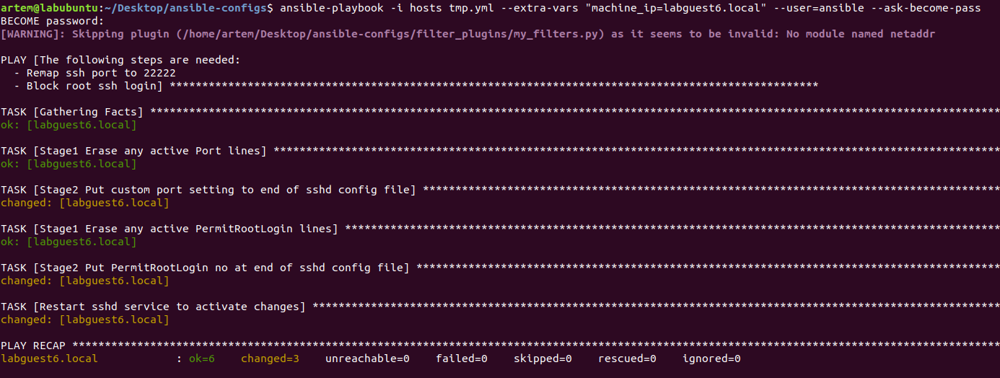
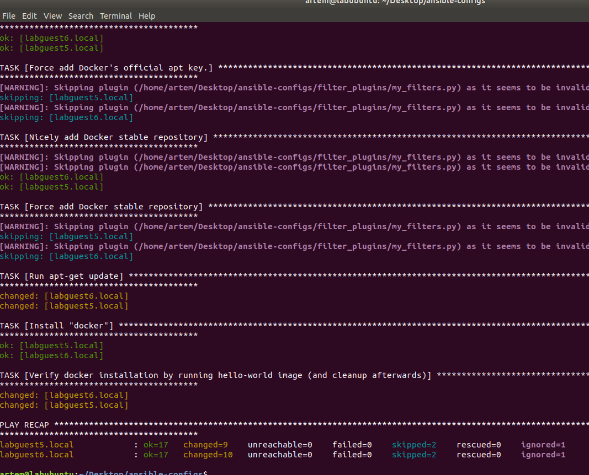
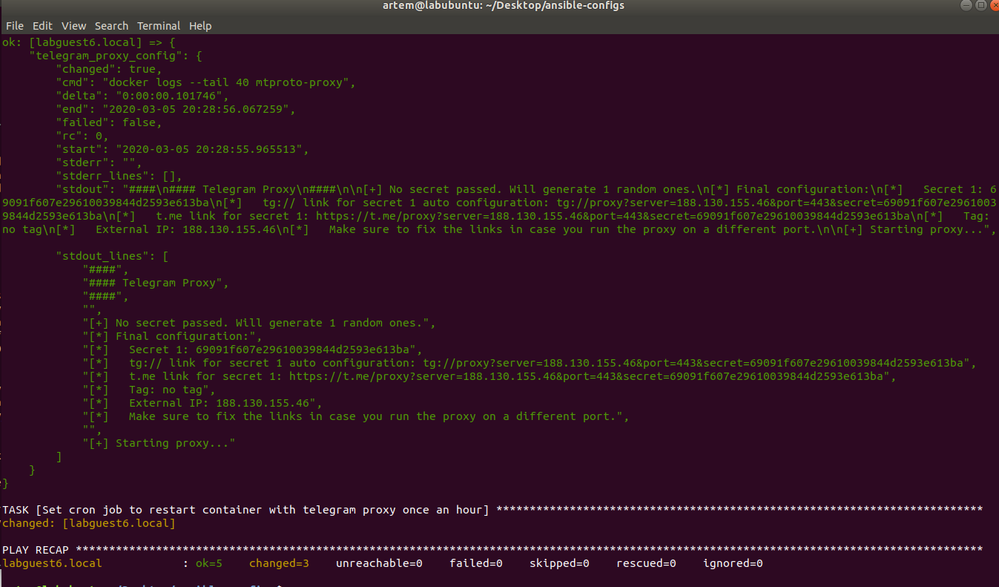
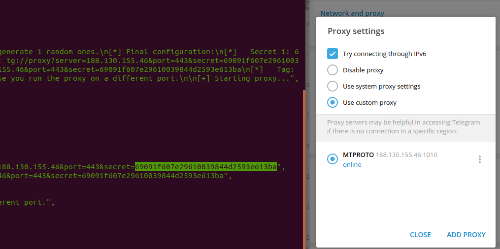
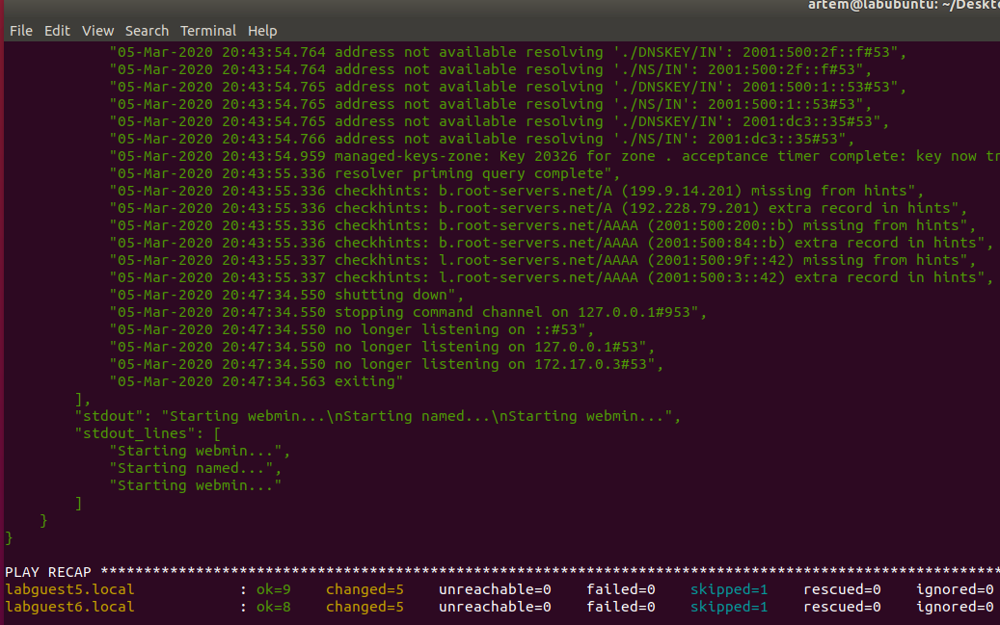

# LS Lab 6 Configuration Management

Artem Abramov


## Main lab - Infrastructure as Code (IaC)

I choose to use Ansible. 

My self claimed task was to set up each host with a custom user `artem`, particular config for SSH: (port 22222 and allow root login). Then to configure NTP and setup BIND master and slave servers. I decided to use the DNS master-slave setup to experiment with setting up different roles for the host.

For dom0 I disabled the network services (NetworkManager, systemd-networkd, systemd-resolved) and manually configured the network using the script below:
```
$ cat setbridge.sh 
#!/bin/bash
ip link set enp0s25 down
ip addr flush dev enp0s25
ip link add name xenbr0 type bridge
ip link set enp0s25 master xenbr0
ip link set enp0s25 up
ip link set xenbr0 up
ip addr add 188.130.155.42/27 dev xenbr0
ip route add default via 188.130.155.33 dev xenbr0
```

source: 
IP command cheat sheet https://access.redhat.com/sites/default/files/attachments/rh_ip_command_cheatsheet_1214_jcs_print.pdf

Then created two XEN guests. I created them from generic Ubuntu images, so they required some manual tweaking before Ansible could be used (connect to the internet, start openssh-server).  The following steps were taken manually:


Set ip configuration, via a script:

```
root@labguest5:~# cat internet.sh 
#!/bin/bash
ip addr add 188.130.155.45/27 dev eth0
ip route add default via 188.130.155.33 dev eth0
```

And on the other VM:
```
root@labguest6:~# cat internet.sh
#!/bin/bash
ip addr add 188.130.155.46/27 dev eth0
ip route add default via 188.130.155.33 dev eth0
```

Run the script:
```
# chmod +x internet.sh && ./internet.sh
```


Check that resolv.conf is broken (because I disabled NetworkManager when bootstrapping Xen VM):

```
# file /etc/resolv.conf 
/etc/resolv.conf: broken symbolic link to ../run/systemd/resolve/stub-resolv.conf
```

Fix resolv.conf by removing the link and pointing it to google nameserver:

```
# rm /etc/resolv.conf
# echo "nameserver 8.8.8.8" > /etc/resolv.conf
```


Update apt and install openssh-server (allows using ansible, which was really the whole point):

```
apt-get update && apt-get upgrade 
apt-get install openssh-server
```


We have a choice to either make a user (adduser) or permit root login with password (at least to copy ssh keys).  In the beginning I decided to add a new user:

```
# adduser ansible
```

Its tempting to use `--no-create-home` option to adduser, but then the following:

```
ssh-copy-id ansible@labguest.local
```
will fail, because ssh id needs to be stored in `/home/ansible` which is writable by ansible user. If you mess up with users then delete him with `userdel --remove ansible`.


List the machine fingerprint in different formats: MD5,  SHA256,  visual diagram (when you connect one of them should match):

```
for file in /etc/ssh/*_key.pub
do   
	echo -e "\n\n"
	echo $file
	ssh-keygen -l -v -E sha256 -f $file
	ssh-keygen -l -v -E md5 -f $file
done
```

source: https://www.phcomp.co.uk/Tutorials/Unix-And-Linux/ssh-check-server-fingerprint.html


**NOTE**
Really the images should have been prepared with Packer and all the software and config should have been pre-installed by it. Packer can create images for XEN hypervisor (requires tweaking).
Source:  https://packer.io/docs/builders/qemu.html 


Dom0 will be the config master. Edit his /etc/hosts:

```
188.130.155.45	labguest5.local
188.130.155.46	labguest6.local
```

Copy ssh id from dom0 to the minions:

```
# ssh-copy-id ansible@labguest5.local
# ssh-copy-id ansible@labguest6.local
```


Now everything is finally ready to run Ansible!


Check that it works.

Create hosts inventory file and note to specify python3 as interpreter:

```
# cat /home/artem/Desktop/ansible-configs/hosts
[main]
labguest5.local
labguest6.local

[main:vars]
ansible_python_interpreter=/usr/bin/python3
```

Run ping against them:

```
# ansible -i hosts all -m ping -vvv --user=ansible

labguest5.local | SUCCESS => {
    "changed": false, 
    "ping": "pong"
}
labguest6.local | SUCCESS => {
    "changed": false, 
    "ping": "pong"
}
```


I decided that my first steps would be as follows:

- Move ssh to another port
- Make sure PermitRootLogin is disabled
- Install sudo and allow sudo for ansible user

Note some peculiarities: in ansible the ssh port is part of the inventory, and I could not find a way to dynamically reconnect ansible to a different port after restarting ssh service on the client machine.

Therefore I decided to create one config that would do the role of bootstrapping the machine's ssh. This config is meant to be run only once against a new machine, therefore I decided that it should work not with HOSTS inventory file, but with command line args that would tell it what IP to configure.
To reiterate its a bad idea to run this script against a particular inventory group, because afterwards we might forget to remove machine from the group and it will be reset by this script.

The bootstrap.yml is below:
```
---
- name: >
      The following steps are needed:
        - Remap ssh port to 22222
        - Block root ssh login

  vars:
      v_machine_ip: "{{ machine_ip | mandatory }}"

  hosts: "{{ v_machine_ip }}"

  remote_user: ansible
  become_method: su
  become: yes

  tasks:
      - name: Stage1 Erase any active Port lines
        lineinfile:
            dest: "/etc/ssh/sshd_config"
            regex: "^Port"
            state: absent

      - name: Stage2 Put custom port setting to end of sshd config file
        lineinfile:
            dest: "/etc/ssh/sshd_config"
            insertafter: EOF
            line: "Port 22222"

      - name: Stage1 Erase any active PermitRootLogin lines
        lineinfile:
            dest: "/etc/ssh/sshd_config"
            regex: "^PermitRootLogin"
            state: absent

      - name: Stage2 Put PermitRootLogin no at end of sshd config file
        lineinfile:
            dest: "/etc/ssh/sshd_config"
            insertafter: EOF
            line: "PermitRootLogin no"

      - name: Restart sshd service to activate changes
        service:
            name: sshd
            state: restarted
```

The config is done in steps to make sure that it is truly idempotent.
source: https://dmsimard.com/2016/03/15/changing-the-ssh-port-with-ansible/


To check the syntax of a playbook, use:

```
ansible-playbook playbook.yml --syntax-check
```
This will run the playbook file through the parser to ensure its included files, roles, etc. have no syntax problems.

To see what hosts would be affected by a playbook before you run it, you can do this:
```
ansible-playbook playbook.yml --list-hosts
```


To actually run the bootstrap.yml:

```
ansible-playbook -i hosts tmp.yml --extra-vars "machine_ip=labguest5.local" --user=ansible --ask-become-pass
```

And do the same for the second host.


Below is sample output:




## Install basics: NTP, pip, docker

Now a more elaborate inventory:

```
[main]
labguest5.local
labguest6.local

[main:vars]
ansible_python_interpreter=/usr/bin/python3
ansible_port=22222
ansible_user=ansible
ansible_become_method=su
```


And a playbook for installing some utilities, pip, NTP and docker.

```
---
- name: >
    The following steps are needed:
        - Install a few utilities for human maintenance
        - Install docker
  
  hosts: main
    
  tasks:
      - name: Run apt-get update
        apt:
            name: [ git, mlocate, net-tools, util-linux ]
            update_cache: yes
        become: yes

      - name: set timezone
        shell: 'timedatectl set-timezone UTC'
        become: yes

      - name: Install NTP
        apt:
            name: ntp
            update_cache: yes
        become: yes

      - name: Make sure NTP is stopped
        service: name=ntp state=stopped enabled=yes
        become: yes

      - name: Sync time once
        shell: 'ntpd -gq'
        become: yes

      - name: Make sure NTP is started up
        service: name=ntp state=started enabled=yes
        become: yes

      - name: Sync hwclock
        shell: 'hwclock -w'
        become: yes
        ignore_errors: yes

      - name: Restart ntp service
        service: name=ntp state=restarted
        become: yes

      - name: Install pip
        apt:
            name: [ python-pip ]
            state: present
        become: yes

      - name: Setup python-docker bindings to allow docker ansible module to execute
        apt:
            name: [ python-docker ]
            state: present
        become: yes

      - name: Install "docker" prerequisites
        apt:
            name: [ apt-transport-https , ca-certificates , curl , gnupg2 , software-properties-common , curl ]
            state: present
        become: yes

      - name: Nicely add Docker's official apt key.
        apt_key:
            url: https://download.docker.com/linux/debian/gpg
            id: 9DC858229FC7DD38854AE2D88D81803C0EBFCD88
            state: present
        register: add_key_result
        ignore_errors: yes
        become: yes

        # ok, failed to do nicely
      - name: Force add Docker's official apt key.
        shell: 'curl -fsSL https://download.docker.com/linux/debian/gpg | sudo apt-key add - '
        become: yes
        when: add_key_result.failed

      # Try the nice way first
      - name: Nicely add Docker stable repository
        apt_repository:
            repo: "deb [arch=amd64] https://download.docker.com/linux/{{ ansible_distribution|lower }} {{ ansible_distribution_release }} stable"
            state: present
            update_cache: yes
        register: apt_repository_result
        become: yes

        # ok, failed to do nicely
      - name: Force add Docker stable repository
        shell: 'add-apt-repository "deb [arch=amd64] https://download.docker.com/linux/debian  $(lsb_release -cs) stable" '
        become: yes
        when: apt_repository_result.failed

      - name: Run apt-get update
        apt:
            update_cache: yes
        become: yes

      - name: Install "docker"
        apt:
            name: [ docker-ce , docker-ce-cli , containerd.io ]
            state: present
        become: yes

      - name: Verify docker by running hello-world image (and cleanup afterwards)
        docker_container:
            pull: yes
            image: "hello-world"
            name: hello-world
            cleanup: yes
            detach: no
        register: docker_test_result
        become: yes
```


Note:

- Registering result with `register` and checking it with `when`, this is used to provide a fallback way of installing docker.
- Ignoring errors with `ignore_errors`


Run it with:

```
ansible-playbook -i hosts basic.yml --ask-become-pass
```

Below is the output:



(we can ignore the warning, it was an experiment in creating an ansible plugin)

There was also one error because `hwsync` task failed (the OS is running on top of Xen hypervisor).


## Telegram proxy MTPROTO

Here is a more elaborated inventory configuration:

```
[main]
labguest5.local
labguest6.local

[main:vars]
ansible_python_interpreter=/usr/bin/python3
ansible_port=22222
ansible_user=ansible
ansible_become_method=su

[main:children]
telegram

[telegram]
labguest6.local
```


And a playbook to install telegram proxy on a machine:

```
---
- name: >
    The following steps are needed:
        - Install container with telegram proxy, run on port 1010
        - Add cron job to periodically restart telegram proxy

  hosts: telegram

  tasks:
      - name: Install container with telegram proxy
        docker_container:
            pull: yes
            image: 'telegrammessenger/proxy:latest'
            name: 'mtproto-proxy'
            restart_policy: always
            volumes: 'proxy-config:/data'
            published_ports: '1010:443'
        become: yes

      - name: Get telegram proxy info
        shell: 'docker logs --tail 40 mtproto-proxy'
        register: telegram_proxy_config
        become: yes

      - debug: var=telegram_proxy_config

      - name: Set cron job to restart container with telegram proxy once an hour
        cron:
            name: Restart docker with telegram proxy because it reconfigures telegram IP addresses
            special_time: hourly
            job: docker restart mtproto-proxy
        become: yes
```


Running the playbook:

```
ansible-playbook -i hosts telegram.yml --ask-become-pass
```


This was interesting because proxy prints a secret that can be used to connect it. Getting it out of ansible was not quite straightforward. Below is the output:



Text output:

```
        "stdout_lines": [
            "####", 
            "#### Telegram Proxy", 
            "####", 
            "", 
            "[+] No secret passed. Will generate 1 random ones.", 
            "[*] Final configuration:", 
            "[*]   Secret 1: 69091f607e29610039844d2593e613ba", 
            "[*]   tg:// link for secret 1 auto configuration: tg://proxy?server=188personal.130.155.46&port=443&secret=69091f607e29610039844d2593e613ba", 
            "[*]   t.me link for secret 1: https://t.me/proxy?server=188.130.155.46&port=443&secret=69091f607e29610039844d2593e613ba", 
            "[*]   Tag: no tag", 
            "[*]   External IP: 188.130.155.46", 
            "[*]   Make sure to fix the links in case you run the proxy on a different port.", 
            "", 
            "[+] Starting proxy..."
```


I checked that the proxy works via my desktop client:




### Bind 9 one master + one slave

Here is an even more elaborate inventory file:

```
[main]
labguest5.local
labguest6.local

[main:vars]
ansible_python_interpreter=/usr/bin/python3
ansible_port=22222
ansible_user=ansible
ansible_become_method=su

[main:children]
bind9
telegram

[bind9:children]
bind9master
bind9slaves

[bind9master]
labguest5.local dns_server_role="named.conf.local-dns-role-master"

[bind9slaves]
labguest6.local

[bind9slaves:vars]
dns_server_role="named.conf.local-dns-role-slave"

[telegram]
labguest6.local
```


I configure the master and slave with variables right in the inventory file. The playbook below can be improved, because currently it contains password to WEBMIN interface in plain text, ansible-vault can be used to solve this issue.

The structure of my folder where I run ansible is as follows:

```
artem@labubuntu:~/Desktop/ansible-configs$ tree
.
├── basic.yml
├── bootstrap.yml
├── configs
│   ├── docker-daemon.json
│   ├── named.conf.local-dns-role-master
│   ├── named.conf.local-dns-role-slave
│   ├── named.conf.options
│   └── rinserepeat.site.hosts
├── telegram.yml
├── filter_plugins
│   ├── my_filters.py
│   └── my_filters.pyc
├── hosts
├── bind9.yml
└── advanced.yml

```

The files inside the config/ directory are copied to remote machines into directories that are then mounted by BIND9 docker containers. This way configuration is provided to the docker containers.

The DNS configs are listed below for completeness.

$ cat rinserepeat.site.hosts

```
$ttl 3600
rinserepeat.site.       IN      SOA     ns0.rinserepeat.site tematibr.gmail.com. (
                        2019081100  ; Serial
                        10800       ; Refresh
                        3600        ; Retry
                        604800      ; Expire
                        38400 )     ; Negative Cache TTL
rinserepeat.site.       IN      NS      ns0.rinserepeat.site.
rinserepeat.site.       IN      NS      ns1.rinserepeat.site.
ns0.rinserepeat.site.       IN      A       188.130.155.45
ns1.rinserepeat.site.       IN      A       188.130.155.46
```


$ cat named.conf.options

```
options {
	directory "/var/cache/bind";
	
	notify yes;
	allow-transfer { any; };
	dnssec-validation auto;
	
	auth-nxdomain no;    # conform to RFC1035
	listen-on-v6 { any; };
	allow-query { any; };
};
```


$ cat named.conf.local-dns-role-slave

```
masters ns0 { 188.130.155.45; };
masters ns1 { 188.130.155.46; };

zone "rinserepeat.site" {
	type slave;
	masters { ns0; };
	file "/var/lib/bind/rinserepeat.site.hosts";
};
```


$ cat named.conf.local-dns-role-master

```
zone "rinserepeat.site" {
	type master;
	file "/var/lib/bind/rinserepeat.site.hosts";
};
```


The related ansible playbook to install DNS master and slave servers:

```
---
- name: >
    The following steps are needed:
        - Install Bind9 DNS server
        - Copy Bind9 zone config (either slave or master)

  vars:
      # like: "named.conf.local-dns-role-master" or "named.conf.local-dns-role-slave"
      v_dns_server_role: "{{ dns_server_role }}"

  hosts: bind9

  tasks:

      - name: Install dns server
        docker_container:
            pull: yes
            image: 'sameersbn/bind:latest'
            name: 'bind9-dns'
            detach: yes
            dns_servers: '127.0.0.1'
            restart_policy: always
            volumes: '/srv/docker/bind:/data'
            published_ports:
                - '53:53/tcp'
                - '53:53/udp'
                - '10000:10000'
            env:
                ROOT_PASSWORD: "bind-password-artem"
                WEBMIN_ENABLED: "true"
        become: yes

      - name: Pause while docker starts and creates directory structure
        pause:
            seconds: 20

      - name: Replace part of bind-9 confit ig. Ubuntu only. Change one line to allow any incoming connections.
        copy:
            src: "{{ playbook_dir }}/configs/named.conf.options"
            dest: '/srv/docker/bind/bind/etc/named.conf.options'
        become: yes
        when: ansible_distribution == 'Ubuntu'

      # Install particular zone config
      - name: Install bind-9 zone config for rinserepeat.site
        copy:
            src: "{{ playbook_dir }}/configs/rinserepeat.site.hosts"
            dest: '/srv/docker/bind/bind/lib/rinserepeat.site.hosts'
        become: yes
        when: ansible_distribution == 'Ubuntu'
        tags:
            - bind-9-update-zone

      - name: Install bind-9 config that lists all known user zones
        copy:
            src: "{{ playbook_dir }}/configs/{{ v_dns_server_role }}"
            dest: '/srv/docker/bind/bind/etc/named.conf.local'
            mode: "u=rw,g=rw,o=rw"
        become: yes
        when: ansible_distribution == 'Ubuntu'
        tags:
            - bind-9-update-zone

      - name: Warn that bind 9 is not setup if you are not on Ubuntu
        debug:
            msg: "Could NOT setup DNS BIND config. Do it manually! Your distribution {{ ansible_distribution }} != Ubuntu."
        when: ansible_distribution != 'Ubuntu'
        tags:
            - bind-9-update-zone

      - name: Restart BIND 9 container after modifying its config
        docker_container:
            name: bind9-dns
            state: started
            restart: yes
        become: yes
        tags:
            - bind-9-update-zone

      - name: Dump bind-9 logs for inspection in case there are errors
        shell: 'docker logs --tail 250 bind9-dns'
        register: bind_9_startup_logs
        become: yes
        tags:
            - bind-9-update-zone

      - debug: var=bind_9_startup_logs
        tags:
            - bind-9-update-zone
```


Running it:

```
ansible-playbook -i hosts bind9.yml --ask-become-pass
```


Finishes with success:




