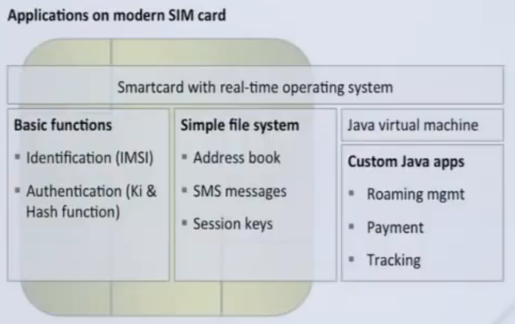

# OT Lab 6 GSM and SIM reader

Artem Abramov

## Different network generations

2G  refers to networks GSM, IS-95. In the end GSM is the most popular 2G network.

3G refers to networks UMTS, IS-2000 (note that IS-95 was already using CDMA tech). In the end the most popular 3G network was UMTS.

4G refers to network LTE.

The IS-95 and IS-2000 were developed by Qualcomm. GSM and UMTS were developed by a standards body.

Table from wikipedia is below:


source: https://en.wikipedia.org/wiki/Comparison_of_mobile_phone_standards


## Structure of the SIM card

SIM card is a smart card - it has an operating system, a microprocessor,  a file system and an authentication mechanism.

A SIM card is made of directories that hold files. For example file that holds the address book, file for SMS archive, Java applications, file for international mobile subscriber identity (IMSI) and one that holds Ki (secret key). Many can be read/written by the phone:



In order to clone a SIM card, every single file must be read and written to new SIM. Master authentication is necessary to read/write e.g. the Ki or any other secret parameters. This is definitely possible because the SIM cards can be transferred/restored by the mobile operator when you loose then or just need a SIM card with a different form factor (e.g. mini-SIM, micro-SIM, nano-SIM)

source: http://lazybit.com/index.php/2009/10/05/how-to-clone-a-sim-card-not

Interesting presentation describing the different layers of SIM card functionality and security:
https://www.youtube.com/watch?v=j-aSbQAiDM8


## Security in 2G networks

### Structure of the GSM

Presentation on locating and sniffing GSM communication:
https://media.ccc.de/v/27c3-4208-en-wideband_gsm_sniffing#t=2971

Presentation FakeBTS:
https://www.youtube.com/watch?v=fQSu9cBaojc
Interesting takeaway: 3G is more secure, but attacker can jam the 3G frequencies and phone will fallback to 2G (which happily connects to base stations with A5/0 encryption, that is NOT encrypted at all).


GSM authentication is composed of three functions:

- A3 - function that authenticates.
- A8 - function for symmetric encryption key generation (outputs Kc that is used in function A5).
- A5 - function that performs encryption using Kc key.

 


Many implementations of A5 algorithm:

- A5/0 - the non-encrypted version (plaintext).
- A5/1 - used  in  both  Europe,  and  the US, and is the strongest of the three.
- A5/2 - is a deliberate weakening of the A5/1 algorithm, used in certain export regions (cryptography is a military weapon in USA), such as Asia.

The A5 is a stream cypher with its own flaws.

sources:

- https://eprints.bournemouth.ac.uk/29835/1/WPC_paper1.pdf
- https://web.archive.org/web/20080831211629/https://cryptome.org/a51-bsw.htm
- https://web.archive.org/web/20181008224515/www.scard.org/gsm/a51.html


### Overview of SIM card cloning

Below is an extract from the book "Investigating the Cyber Breach: The Digital Forensics Guide for the Network Engineer" by  Joseph Muniz and Aamir Lakhan (Published in 2018). 

========  8< ======

SIM Card Cloning 

Before we continue, you should be aware that cloning a SIM card is highly illegal in some countries. We do not condone this activity but it is an important topic to address. The following description is for informational purposes only. Our goal is to help you understand how the process works and separate fact from fiction. 

First of all, It is Important to remember there are SIM card standards. You probably already know SIM cards come in different size. What you may not know is that SIM cards, regardless of their size, have different encryption standards built into them. SIM cards are manufactured based on three algorithm.: COMP128v1, COMP128v2, and COMP128v3. As of this writing, COMP128v1 is the only SIM card standard that can be cloned without help from the mobile operator. Most SIM cards being used today are COMP128v1. Apple Computers ships most devices with newer SIM cards or with an electronic SIM card that leverages a much higher encryption standard. In other words, don't bother trying to clone a SIM from an Apple device.

To clone, you first need to obtain a blank SIM card. It can be picked up from a cell phone store or ebay for around $50 US. You also need to go a SIM card reader/writer. Quite a few different reader/writer machines are available on ebay. One that we have seen is called the DIGIFLEX USB SIM Card Reader Writer Copy Clones Backup GSM CDMA (shown below):


Next, you need to get appropriate software to copy and restore a SIM card, MagicSim is a popular tool that is discussed in various forums on topics about hacking up and restoring SIN1 cards. You also can purchase commercial software kits that do the same thing that MagicSim does, sometimes with more features. We have seen SIM cloning software range anywhere from $30 to $1000 US. 

Depending on you. cell phone provider and your existing SIM card, you may be prompted for a SIM unlock code. In many case, you can call the mobile provider and tell the provider you are trying to use the SIM card in an overseas phone and are being prompted for an unlock code. The mobile provider usually provides the code. There are a few more obvious and basic steps to complete when cloning a SIM card, but we purposely left those out here bemuse we do not want to encourage anyone to do anything illegal.

Now let's separate some fact from fiction. How long does it actually take to clone a SIM card? Normally, between 10 and 30 minutes, Professional tools that look more like what you see in the movies allow you to plug in a SIM card and automate the copying and cloning process. You are likely to have to pay good money for one of those, and they are likely illegal to me. 

========  >8  ======

(extract source available at link: https://books.google.ru/books?id=8ntJDwAAQBAJ&pg=SA9-PA15&lpg=SA9-PA15&dq=COMP128v1,+COMP128v2+and+COMP128v3+what+is+my+algorithm&source=bl&ots=M9tPJyYq2v&sig=ACfU3U0XPrueEFpsK9WwK7i9h5rNFl_7uw&hl=en&sa=X&ved=2ahUKEwj5sKaIysDpAhVjxMQBHVTeDy0Q6AEwAXoECDIQAQ#v=onepage&q=COMP128v1%2C%20COMP128v2%20and%20COMP128v3%20what%20is%20my%20algorithm&f=false)

### COMP128 Algorithm

COMP128 algorithm (was initially a completely private) implementation of the A3 and A8 functions and is used to generate 32-bit signed response SRES and 64-bit cipher key Kc for use in A5 encryption function. 

It is not the only algorithm that fulfills the A3 and A8 functions, but its the overwhelming majority.

Regarding the COMP128v1 algorithm, research showed that its "compression function is vulnerable because it lacks sufficient diffusion". This allows for a "narrow pipe attack" which takes around 131,000 challenge-response pairs to recover Ki form a GSM SIM. 

sources: 

- http://www.isaac.cs.berkeley.edu/isaac/gsm.html
- https://eprint.iacr.org/2013/224.pdf 

Example implementation of COMP128v1: 

The variations of this algorithm known as COMP128v2 and COMP128v3 (released about 4-5 years later) protect against this vulnerability, but are known to be vulnerable to side-channel attacks. These do not appear to have been published, but have apparently been reversed engineered from SIM compliance testing software (and implemented in OsmocomBB). 

The python implementation is available at: https://docs.google.com/file/d/0B42lGUqM3S_aNTVQSm9XNWpmYjQ/edit  The code is reproduced here for completeness:

```python
# cat COMP128v23.py 
"""
Demonstaration software for COMP128 (aka A3A8) version 2 and 3
Use it for educational purposes if possible

http://www.hackingprojects.net/
"""

 
table0=[197, 235, 60, 151, 98, 96, 3, 100, 248, 118, 42, 117, 172, 211, 181, 203, 61,
		126, 156, 87, 149, 224, 55, 132, 186, 63, 238, 255, 85, 83, 152, 33, 160,
		184, 210, 219, 159, 11, 180, 194, 130, 212, 147, 5, 215, 92, 27, 46, 113,
		187, 52, 25, 185, 79, 221, 48, 70, 31, 101, 15, 195, 201, 50, 222, 137,
		233, 229, 106, 122, 183, 178, 177, 144, 207, 234, 182, 37, 254, 227, 231, 54,
		209, 133, 65, 202, 69, 237, 220, 189, 146, 120, 68, 21, 125, 38, 30, 2,
		155, 53, 196, 174, 176, 51, 246, 167, 76, 110, 20, 82, 121, 103, 112, 56,
		173, 49, 217, 252, 0, 114, 228, 123, 12, 93, 161, 253, 232, 240, 175, 67,
		128, 22, 158, 89, 18, 77, 109, 190, 17, 62, 4, 153, 163, 59, 145, 138,
		7, 74, 205, 10, 162, 80, 45, 104, 111, 150, 214, 154, 28, 191, 169, 213,
		88, 193, 198, 200, 245, 39, 164, 124, 84, 78, 1, 188, 170, 23, 86, 226,
		141, 32, 6, 131, 127, 199, 40, 135, 16, 57, 71, 91, 225, 168, 242, 206,
		97, 166, 44, 14, 90, 236, 239, 230, 244, 223, 108, 102, 119, 148, 251, 29,
		216, 8, 9, 249, 208, 24, 105, 94, 34, 64, 95, 115, 72, 134, 204, 43,
		247, 243, 218, 47, 58, 73, 107, 241, 179, 116, 66, 36, 143, 81, 250, 139,
		19, 13, 142, 140, 129, 192, 99, 171, 157, 136, 41, 75, 35, 165, 26 ]

table1=[170, 42, 95, 141, 109, 30, 71, 89, 26, 147, 231, 205, 239, 212, 124, 129, 216,
		79, 15, 185, 153, 14, 251, 162, 0, 241, 172, 197, 43, 10, 194, 235, 6,
		20, 72, 45, 143, 104, 161, 119, 41, 136, 38, 189, 135, 25, 93, 18, 224,
		171, 252, 195, 63, 19, 58, 165, 23, 55, 133, 254, 214, 144, 220, 178, 156,
		52, 110, 225, 97, 183, 140, 39, 53, 88, 219, 167, 16, 198, 62, 222, 76,
		139, 175, 94, 51, 134, 115, 22, 67, 1, 249, 217, 3, 5, 232, 138, 31,
		56, 116, 163, 70, 128, 234, 132, 229, 184, 244, 13, 34, 73, 233, 154, 179,
		131, 215, 236, 142, 223, 27, 57, 246, 108, 211, 8, 253, 85, 66, 245, 193,
		78, 190, 4, 17, 7, 150, 127, 152, 213, 37, 186, 2, 243, 46, 169, 68,
		101, 60, 174, 208, 158, 176, 69, 238, 191, 90, 83, 166, 125, 77, 59, 21,
		92, 49, 151, 168, 99, 9, 50, 146, 113, 117, 228, 65, 230, 40, 82, 54,
		237, 227, 102, 28, 36, 107, 24, 44, 126, 206, 201, 61, 114, 164, 207, 181,
		29, 91, 64, 221, 255, 48, 155, 192, 111, 180, 210, 182, 247, 203, 148, 209,
		98, 173, 11, 75, 123, 250, 118, 32, 47, 240, 202, 74, 177, 100, 80, 196,
		33, 248, 86, 157, 137, 120, 130, 84, 204, 122, 81, 242, 188, 200, 149, 226,
		218, 160, 187, 106, 35, 87, 105, 96, 145, 199, 159, 12, 121, 103, 112]


def comp128v23_internal(KXOR,RAND):

	temp = [0] * 16
	KM_RM = RAND + KXOR

	for i in range(5):
		for z in range(16):
			temp[z] = table0[table1[KM_RM[16+z]] ^ KM_RM[z] ]

		j = 0
		while ( (1 << i) > j):
			k = 0
			while ( (1 << (4 - i)) > k ):
				KM_RM[((2 * k + 1) << i )+j] = table0[table1[temp[(k << i) + j]] ^ (KM_RM[(k << i) + 16 + j])]
				KM_RM[ (k << (i + 1)) + j] = temp[(k << i) + j]
				k = k+1
			j = j + 1
		
	output = [0]*16

	for i in range(16):
		for j in range(8):
			output[i] = output[i] ^ (((KM_RM[(19 * (j + 8 * i) + 19) % 256 / 8] >> (3 * j + 3) % 8) & 1) << j)

	return output
	
def comp128v23(K, RAND, version = 2):
#every day IM suffling...
	
	K_MIX = [0]*16
	RAND_MIX = [0]*16
	KATYVASZ = [0]*16
	output = [0]*16
	
	for i in range(8):
		K_MIX[i] = K[15 - i]
		K_MIX[15 - i] = K[i]

	for i in range(8):
		RAND_MIX[i] = RAND[15 - i]
		RAND_MIX[15 - i] = RAND[i]
	
	for i in range(16):
		KATYVASZ[i] = K_MIX[i] ^ RAND_MIX[i]
	
	for i in range(8):
		RAND_MIX = comp128v23_internal(KATYVASZ,RAND_MIX)
	
	for i in range(16):
		output[i] = RAND_MIX[15-i]
	

	if version == 2:
		output[15] = 0
		output[14] = 4 * (output[14] >> 2)

	s = 8
	i = 0
	while i < 4:
		output[s+i-4] = output[s+i]
		output[s+i] = output[s+i+4]
		i = i+1

	#the algorithm uses 16 bytes until this point, but only 12 bytes are effective
	#also 12 bytes coming out from the SIM card
	
	output_final = output[:12]	
	return output_final

def hexstr2intarray(input):
	
	temp = [0]*(len(input)/2)
	i = 0
	k = 0
	while i < len(input):
		temp[k] = int(input[i:i+2],16)
		i = i+2
		k = k+1
	return temp
	
def array2hex(input):
	out = ''
	for i in input:
		a = hex(i)[2:]
		if len(a) == 1:
			a = '0'+a
		out = out+a
	return out.upper()
	
Ki = hexstr2intarray("AAAAAAAAAAAAAAAAAAAAAAAAAAAAAAAA")
RAND = hexstr2intarray("6E6989BE6CEE7154543770AE80B1EF0D")
version = 2


OUTPUT = comp128v23(Ki, RAND, version)
SRES = OUTPUT[:4]
Kc = OUTPUT[4:]

print "COMP128 version " + str(version)
print "SIM OUTPUT:" + array2hex(OUTPUT)
print "SRES:  " + array2hex(SRES)
print "Kc:    " + array2hex(Kc)
```

sources:

- (blog post)  https://web.archive.org/web/20141224034734/http://www.hackingprojects.net/2013/04/secrets-of-sim.html#
- https://en.wikipedia.org/wiki/COMP128#COMP128-2/3_description


### Extracting Ki from GSM SIM

The SIM card is designed to prevent non-admin user from reading the Ki. The phone can ask the SIM to "sign" the RAND with Ki to produce output value. Only the SIM itself and the mobile operator know the Ki value for this SIM. 

However the GSM cryptographic algorithm for signing SRES_2 with Ki (used in step 4 below) is vulnerable and allows to limit the brute force (using the "narrow pipe attack") and guess the value of Ki.

Authentication process:

1. When the phone boots, it passes the PIN to the SIM to authenticate. Then the phone gets the IMSI identity from the SIM. Then the phone passes IMSI to the mobile operator network requesting authentication and access to service. 
2. The operator network searches its database for the incoming IMSI and its associated Ki.
3. The operator network then generates a random number RAND and signs it with the Ki associated with the IMSI (which is also stored on the SIM card). The signed number is split into Signed Response 1 (SRES_1, 32  bits) and the encryption key Kc (64 bits).
4. The operator network then sends the RAND to the phone,  which passes it to the SIM card. The SIM card signs it with its Ki, producing SRES_2 and Kc, and gives it back to the phone. The phone passes SRES_2 on to the operator network.
5. The operator network compares its computed SRES_1 with the SRES_2 computed by the phone. If the two numbers match, the SIM is authenticated and the mobile equipment is granted  access to the operator's network. All further communications between the mobile equipment and the network is encrypted with Kc.

source: https://en.wikipedia.org/wiki/SIM_card#Authentication_key_.28Ki.29

### Using the SIM Reader

Initial plan was to run windows in virtual box and forward the usb peripheral. The applications to interact with the sim reader seemed to only support windows. 

For reference this is how to insert the sim into reader (photo from the internet):


Download what appears to be the MagicSim v10 program: https://download.cnet.com/MagicSIM/3055-2094_4-10601728.html

Checking with VirusTotal claimed that it was clean: 


Initally I tried using windows 10. However the software did not run properly. Any sort of software targeting Ki cracking via narrow pipe attack, must have been written at the time of COMP128v1 popularity i.e. Windows XP era. No wonder it did not run on Windows 10. 

Before trying windows XP I decided to try Windows 7. Install it and download the same MagicSim program.

Copy file to the VM and run the installer. Wow very flashy:

![ot-lab-6_default_1589948183409_49297 [Running] - Oracle VM VirtualBox_114](OT-Lab-6-sim-gsm.assets/ot-lab-6_default_1589948183409_49297%20%5BRunning%5D%20-%20Oracle%20VM%20VirtualBox_114.png)


Driver for PL-2303 (USB to serial converter) fails to install, must get that separately from https://support.lenovo.com/ru/en/downloads/ds034089 as shown below: ![ot-lab-6_default_1589948183409_49297 [Running] - Oracle VM VirtualBox_116](OT-Lab-6-sim-gsm.assets/ot-lab-6_default_1589948183409_49297%20%5BRunning%5D%20-%20Oracle%20VM%20VirtualBox_116.png)


With the driver installed:

![ot-lab-6_default_1589948183409_49297 [Running] - Oracle VM VirtualBox_117](OT-Lab-6-sim-gsm.assets/ot-lab-6_default_1589948183409_49297%20%5BRunning%5D%20-%20Oracle%20VM%20VirtualBox_117.png)


The MagicSim program now is able to locate the SIM reader hardware, however it is not able to talk to it and still fails:

![ot-lab-6_default_1589948183409_49297 [Running] - Oracle VM VirtualBox_118](OT-Lab-6-sim-gsm.assets/ot-lab-6_default_1589948183409_49297%20%5BRunning%5D%20-%20Oracle%20VM%20VirtualBox_118.png)


Because the SIM reader is connected via the serial port, I would not be surprised if every manufacturer implemented their own protocol (on top of RS232) to talk to the hardware. Looking into the Help manual for MagicSIM, notice that they seem to use different hardware:

![ot-lab-6_default_1589948183409_49297 [Running] - Oracle VM VirtualBox_119](OT-Lab-6-sim-gsm.assets/ot-lab-6_default_1589948183409_49297%20%5BRunning%5D%20-%20Oracle%20VM%20VirtualBox_119.png)


I tried installing software from http://tech.springcard.com/guides/sdd480-install/, to run the SIM reader as PC/SC device. But that did not work out.

Then I tried installing  https://usb_sim_card_reader_software.en.downloadastro.com/ (the reader presents a serial port to the OS):


It looked promising, but also did not work (and actually was bundled with Avast antivirus that was difficult to uninstall). I could not get a working connection to the SIM reader.

Installing and running a SmartCard manager service, also did not fix things:

![ot-lab-6_default_1589948183409_49297 [Running] - Oracle VM VirtualBox_121](OT-Lab-6-sim-gsm.assets/ot-lab-6_default_1589948183409_49297%20%5BRunning%5D%20-%20Oracle%20VM%20VirtualBox_121.png)


More failed attempts:

![ot-lab-6_default_1589948183409_49297 [Running] - Oracle VM VirtualBox_122](OT-Lab-6-sim-gsm.assets/ot-lab-6_default_1589948183409_49297%20%5BRunning%5D%20-%20Oracle%20VM%20VirtualBox_122.png)


Yet another fail:

![ot-lab-6_default_1589948183409_49297 [Running] - Oracle VM VirtualBox_123](OT-Lab-6-sim-gsm.assets/ot-lab-6_default_1589948183409_49297%20%5BRunning%5D%20-%20Oracle%20VM%20VirtualBox_123.png)


Eventually it became clear that because the SIM reader I have uses USB to serial adapter and it must fall into the "legacy"  SIM reader category, i.e. it is NOT a PC/SC device. However this was what I initially assumed, and my attempts were unsuccessful anyway.

I read more on the error given by MagicSim software: 

```
Dont receive ATR receive ATR responce of the Card, Please check the Connection.
```

The ATR is data that SIM sends after booting from reset - https://en.wikipedia.org/wiki/Answer_to_reset

This can be used to identify the SIM - https://smartcard-atr.apdu.fr/

So I was expecting to see the byte sequence (source: http://ludovic.rousseau.free.fr/softwares/pcsc-tools/smartcard_list.txt):

```
3B 16 94 72 04 01 00 00 00
	MTS SIM card, Russia (Telecommunication)
```

But it was not generated. Perhaps the reader was not resetting the card properly? 

With the USB reader came a CD that contained some software. Because the other methods were not working it was time to try to the software on the CD. Finding a CD reader was also not easy, however Gaspar had one and provided it to me. The extracted disk contents are available at the following link:  https://yadi.sk/d/khioUKcKweNtBA

Contents:

```
drwxrwxr-x 4 artem artem 4096 мар 26  2014  CM106
drwxrwxr-x 5 artem artem 4096 мар 26  2014 'CM108(7.1)'
drwxrwxr-x 4 artem artem 4096 мар 26  2014 'CM108 USB声卡'
drwxrwxr-x 2 artem artem 4096 мар 26  2014  Usb-SIM9.0
drwxrwxr-x 2 artem artem 4096 мар 26  2014 'USB SIM Editer'
```


One thing that concerned me was that ART info is supposed to be set on card reset, this could mean that there is a special command to reset the card, however what if this info was only printed on card boot i.e. when it got powered on? I was trying this in a virtual box Windows 7, but maybe it was not handling usb on/off properly?

So perhaps if windows 7 was directly installed on the bare metal, it would work. Refer to  https://askubuntu.com/questions/197868/grub-does-not-detect-windows to solve UEFI/MBR issues (windows 7 has them).

Then install  the software from the CD and the PL-2303 driver separately (from the lenovo link given above). 

Luckily there was a 32-bit laptop that was not used which I could scavenge for the lab. Unfortunately it took at least 4 attempts with each try of about 2 hours to get the right combination to actually install Windows 7. Spend the whole day on this search.


Eventually win7 was installed and software running:


I could connect to the SIM reader and get my contacts from MTS sim card (Cyrillic script had some problems with displaying correctly):


The sim reader also had limited functionality to read other memory areas.

The next step was running the scanner application, getting my ATR finally and trying the narrow pipe attack:


However, trying to attack the card was not successful:


### Conclusion

The sim reader works. During the last day I gave it to Ali, because his sim reader broke. Perhaps there was more regions that the sim reader could extract (by the way writing was also possible, best to test it on a temporary SIM card bought for this lab).

The attack took much longer to run than expected and did not produce the Ki. In retrospect this is to be expected, because modern SIM cards provide better security mechanisms. (see below section on 3G/4G). They contain not just Ki, but tweak values OPc and operator defined constants r1 through r5 and c1 through c5. Only knowing all of the its possible to get master access to the SIM. During the connection to GSM, the modern SIM uses just the master key K to authenticate, even if that was somehow intercepted and cracked, absence of the other secrets would still block us from cloning the SIM card.


## Security in 3G/4G networks

### MILENAGE Algorithm

USIM cards implement the AES-128-based MILENAGE algorithm used in 3G/4G communications.

They can be cloned! But with special equipment. The attack is a side channel attack. The main idea is that crypto system is more than only maths, it is also a hardware implementation that can leak extra data: power consumption, electro-magnetic waves, etc.

The new algorithm uses more secrets than just a single master key:


Successful attack can be see in the youtube video link below.

sources: 
-	https://www.blackhat.com/docs/us-15/materials/us-15-Yu-Cloning-3G-4G-SIM-Cards-With-A-PC-And-An-Oscilloscope-Lessons-Learned-In-Physical-Security-wp.pdf
-	https://www.youtube.com/watch?v=qKCQ1KL9GEc


### Downgrading 3G/4G connection to 2G

The vector of attack that stands out the most is if we can just downgrade the 3G connection to 2G and exploit the known vulnerabilities. For example my phone supports 4G and has a modern SIM card, however it also supports a "GSM only" mode, as shown below:


The big question is: Does this make my phone vulnerable to the GSM attacks, and to what extent?

Below is a paper, discussing the security flaws brought about by integrating the old GSM protocols into the  new  systems.

https://infonomics-society.org/wp-content/uploads/ijisr/published-papers/volume-3-2013/Securing-USIM-based-Mobile-Communications-from-Interoperation-of-SIMbased-Communications.pdf