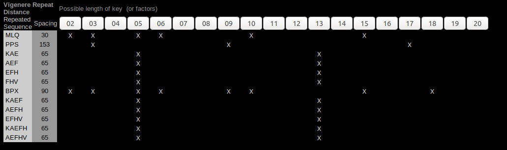
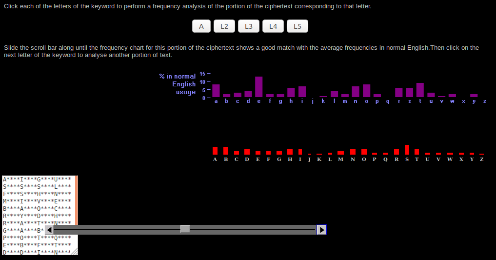
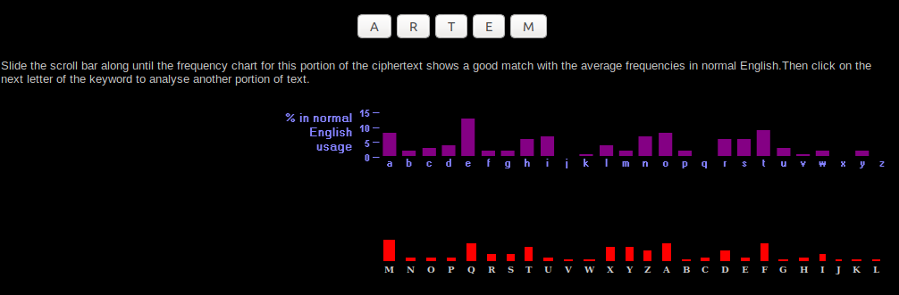

# SSN Lab 1 - Crypto
#### Artem Abramov SNE19


## Task 2 - Installing the VirtualBox and the Codebook

The version of virtual box from the package repository did not work with Ubuntu 18, becasue DKMS compilation was failing, so I had to follow the advice in https://askubuntu.com/questions/1157852/problem-installing-virtualbox-and-linux-headers-5-0-0-21-generic
And install `virtualbox-6.0` from Oracle's repository. Then I downloaded a Windows XP iso (because the Codebook software refused to run with newer versions of Windows) and installed it with VirtualBox. Finally I had to install GuestAdditions into WinXP and create a shared folder in VirtualBox settings. Then I could install and use the codebook. Screenshot of the WinXP installation and screenshot from the codebook are presented below:

 ![winxp-codebook [Running] - Oracle VM VirtualBox_407](SNN-Lab-1-historical.assets/winxp-codebook%20%5BRunning%5D%20-%20Oracle%20VM%20VirtualBox_407.png)


![winxp-codebook [Running] - Oracle VM VirtualBox_409](SNN-Lab-1-historical.assets/winxp-codebook%20%5BRunning%5D%20-%20Oracle%20VM%20VirtualBox_409.png)

## Task 3 - Crypto

### 1. (a) What is Affine?

This cypher is described in the CodeBook software. The idea is that each letter is mapped to a number, transformed and mapped back. The function is strictly bidirectional and normally uses a multiply and shift as shown below:

```
f(char) = (k * char + shift) mod 26
```

where f(char) is the cyphertext character, k is a constant, char is the number corresponding to plaintext character and shift is the magnitude of the shift (Ceasar cipher uses only the shift for encryption).

This cypher has the same weaknesses as all substitution cyphers.

Example encryption is shown below:

![winxp-codebook [Running] - Oracle VM VirtualBox_410](../../../Pictures/winxp-codebook%20%5BRunning%5D%20-%20Oracle%20VM%20VirtualBox_410.png)

sources:

	1. The CodeBook software

 	2. https://en.wikipedia.org/wiki/Affine_cipher


### 1. (b) What is Playfair?

Is a digraph cypher. The Playfair cipher uses a 5 by 5 table generated from a keyword. For encryption the message is split into pairs of letters, if a letter is repeated an X is inserted. If the total number of characters is odd, the last letter is also paired with an X.

Then three rules decide how each pair of letters is encoded depending on if the two letters are in the same column, same row, or in separate columns and rows.

Below is the process of encrypting the first two letters of the message, `me`:

![winxp-codebook [Running] - Oracle VM VirtualBox_411](SNN-Lab-1-historical.assets/winxp-codebook%20%5BRunning%5D%20-%20Oracle%20VM%20VirtualBox_411.png)

sources:

1. Appendix E on page 372 of `The Code Book: The Secret History of Codes and Code Breaking` by Simon Singh.
2. The CodeBook software

### 1. (c) What is ADFGVX?

Extension of the ADFGX cypher. This cypher uses both substitution and transposition so effectively a 2 part key. The encryption works on a 6 by 6 grid. The receiver must know the construction of the grid to decipher the message.

Example encryption along with algorithm details is shown on the screenshot below:

![winxp-codebook [Running] - Oracle VM VirtualBox_418](SNN-Lab-1-historical.assets/winxp-codebook%20%5BRunning%5D%20-%20Oracle%20VM%20VirtualBox_418.png)

sources:

1. Appendix F on page 374 of `The Code Book: The Secret History of Codes and Code Breaking` by Simon Singh.
2. The CodeBook software
3. https://en.wikipedia.org/wiki/ADFGVX_cipher


### 2. Encrypt an English text of at least 80 words using the Vigenere cipher and exchange it with one of your fellow students.

Vigenere is a polyalphabetic substitution cypher. Meaning that it uses multiple alphabets for encoding.

To encrypt the message I decided to write a small python script as shown below. There is an encoding algorithm, a decoding algorithm, code to parse input arguments, code to generate the lookup table and code to print the results. Note that space char was also added to the alphabet:

```python
#!/usr/bin/env python
# Simple Vigenere cipher decoder implementation in Python, using a graphical approach (as you would do in a piece of paper)
# Idea taken from the book: "The code book" by Simon Simgh
# Code inspiration from: https://bynario.com/2017-03-10-simple-Vigenere-cipher-in-python-(and-3).html
# Further reading: https://en.wikipedia.org/wiki/Vigen%C3%A8re_cipher
import string
import argparse
from pprint import pprint

alphabet_cypher = string.ascii_uppercase

vigenete = []

def encode(mykey, plain):
    cypher = []
    for index, char in enumerate(plain):
        if (char.upper() not in alphabet_cypher):
            cypher.append(char)
            continue

        index_modulus = index % len(mykey)
        row_c = mykey[index_modulus].upper()
        row_i = alphabet_cypher.index(row_c)

        col_c = char.upper()
        col_i = alphabet_cypher.index(col_c)

        cypher.append(vigenete[row_i][col_i])
    return "".join(cypher)


def decode(mykey, cypher):
    plain = []
    for index, char in enumerate(cypher):
        if (char not in alphabet_cypher):
            plain.append(char)
            continue

        index_modulus = index % len(mykey)
        row_c = mykey[index_modulus].upper()
        row_i = alphabet_cypher.index(row_c)

        col_c = char.upper()
        col_i = vigenete[row_i].index(col_c)

        plain.append(alphabet_cypher[col_i].lower())
    return "".join(plain)


def main():
    global vigenete

    parser = argparse.ArgumentParser()
    parser.add_argument("key", help="key")
    parser.add_argument("action", help="encode|decode")
    parser.add_argument("data", help="plaintext|cyphertext")

    args = parser.parse_args()

    print("Key: {}".format(args.key))
    print("Action: {}".format(args.action))
    print("Data: {}".format(args.data))

    for col in range(len(alphabet_cypher)):
        row = alphabet_cypher[col:] + alphabet_cypher[:col]
        vigenete.append(row)
    pprint(vigenete)

    mykey=args.key
    if args.action == "encode":
        cypher = encode(args.key, args.data)
        print("Cypher: {}".format(cypher))
    else:
        plain = decode(args.key, args.data)
        print("Plaintext: {}".format(plain))

    return 0

main()
```

The Vigenete table produced by the script is also shown in the output. I decided NOT to shift the first row by one. Running the script to encode a string `Send More Sunshine Please` works as shown below:

```
./vigenere.py A encode 'Send More Sunshine Please'
Key: A
Action: encode
Data: Send More Sunshine Please
['ABCDEFGHIJKLMNOPQRSTUVWXYZ',
 'BCDEFGHIJKLMNOPQRSTUVWXYZA',
 'CDEFGHIJKLMNOPQRSTUVWXYZAB',
 'DEFGHIJKLMNOPQRSTUVWXYZABC',
 'EFGHIJKLMNOPQRSTUVWXYZABCD',
 'FGHIJKLMNOPQRSTUVWXYZABCDE',
 'GHIJKLMNOPQRSTUVWXYZABCDEF',
 'HIJKLMNOPQRSTUVWXYZABCDEFG',
 'IJKLMNOPQRSTUVWXYZABCDEFGH',
 'JKLMNOPQRSTUVWXYZABCDEFGHI',
 'KLMNOPQRSTUVWXYZABCDEFGHIJ',
 'LMNOPQRSTUVWXYZABCDEFGHIJK',
 'MNOPQRSTUVWXYZABCDEFGHIJKL',
 'NOPQRSTUVWXYZABCDEFGHIJKLM',
 'OPQRSTUVWXYZABCDEFGHIJKLMN',
 'PQRSTUVWXYZABCDEFGHIJKLMNO',
 'QRSTUVWXYZABCDEFGHIJKLMNOP',
 'RSTUVWXYZABCDEFGHIJKLMNOPQ',
 'STUVWXYZABCDEFGHIJKLMNOPQR',
 'TUVWXYZABCDEFGHIJKLMNOPQRS',
 'UVWXYZABCDEFGHIJKLMNOPQRST',
 'VWXYZABCDEFGHIJKLMNOPQRSTU',
 'WXYZABCDEFGHIJKLMNOPQRSTUV',
 'XYZABCDEFGHIJKLMNOPQRSTUVW',
 'YZABCDEFGHIJKLMNOPQRSTUVWX',
 'ZABCDEFGHIJKLMNOPQRSTUVWXY']
Cypher: SEND MORE SUNSHINE PLEASE
```

So the script works correctly because encoding with a key of `A` produces the same cyphertext, this is as intended.  The next step is checking encoding with a proper key as shown below:

```
$ ./vigenere.py ARTEMIS encode 'Send More Sunshine Please'
Key: ARTEMIS
Action: encode
Data: Send More Sunshine Please
Cypher: SVGH UGRV WGVKHZGI XDERLI
```

And checking that decoding works as shown below:

```
$ ./vigenere.py ARTEMIS decode 'SVGH UGRV WGVKHZGI XDERLI'
Key: ARTEMIS
Action: decode
Data: SVGH UGRV WGVKHZGI XDERLI
Plaintext: send more sunshine please
```

Indeed that works. Lets test with a KEY that is wrong by one letter as shown below:

```
$ ./vigenere.py ARTEMIX decode 'SVGH UGRV WGVKHZGI XDERLI'
Key: ARTEMIX
Action: decode
Data: SVGH UGRV WGVKHZGI XDERLI
Plaintext: send mjre sunnhine pgease
```

The result looks like garbage, but parts of original text are visible.

This is the message that I gave to Ali (an extract from the Rust programming language book https://doc.rust-lang.org/stable/book/foreword.html):

```
It wasn’t always so clear, but the Rust programming language is fundamentally about empowerment: no matter what kind of code you are writing now, Rust empowers you to reach farther, to program with confidence in a wider variety of domains than you did before.

Take, for example, “systems-level” work that deals with low-level details of memory management, data representation, and concurrency. Traditionally, this realm of programming is seen as arcane, accessible only to a select few who have devoted the necessary years learning to avoid its infamous pitfalls. And even those who practice it do so with caution, lest their code be open to exploits, crashes, or corruption.

Rust breaks down these barriers by eliminating the old pitfalls and providing a friendly, polished set of tools to help you along the way. Programmers who need to “dip down” into lower-level control can do so with Rust, without taking on the customary risk of crashes or security holes, and without having to learn the fine points of a fickle toolchain. Better yet, the language is designed to guide you naturally towards reliable code that is efficient in terms of speed and memory usage.
```

I cleaned up the text to remove punctuation as below:

```
it wasnt always so clear but the rust programming language is fundamentally about empowerment no matter what kind of code you are writing now rust empowers you to reach farther to program with confidence in a wider variety of domains than you did before take for example systemslevel work that deals with lowlevel details of memory management data representation and concurrency traditionally this realm of programming is seen as arcane accessible only to a select few who have devoted the necessary years learning to avoid its infamous pitfalls and even those who practice it do so with caution lest their code be open to exploits crashes or corruption rust breaks down these barriers by eliminating the old pitfalls and providing a friendly polished set of tools to help you along the way programmers who need to dip down into lowerlevel control can do so with rust without taking on the customary risk of crashes or security holes and without having to learn the fine points of a fickle toolchain better yet the language is designed to guide you naturally towards reliable code that is efficient in terms of speed and memory usage
```

Then I encoded it as shown below:

```
$ ./vigenere.py ARTEMIS encode 'it wasnt always so clear but the rust programming language is fundamentally about empowerment no matter what kind of code you are writing now rust empowers you to reach farther to program with confidence in a wider variety of domains than you did before take for example systemslevel work that deals with lowlevel details of memory management data representation and concurrency traditionally this realm of programming is seen as arcane accessible only to a select few who have devoted the necessary years learning to avoid its infamous pitfalls and even those who practice it do so with caution lest their code be open to exploits crashes or corruption rust breaks down these barriers by eliminating the old pitfalls and providing a friendly polished set of tools to help you along the way programmers who need to dip down into lowerlevel control can do so with rust without taking on the customary risk of crashes or security holes and without having to learn the fine points of a fickle toolchain better yet the language is designed to guide you naturally towards reliable code that is efficient in terms of speed and memory usage'
Key: ARTEMIS
Action: encode
Cypher: IK AMAFT TPIIQS LS KDERK NCL KAI ZMSK TDWYRRFQUVY CTRSCSGV ME XUEWEYMFTREPK SBFNX MEPFPIDUWNK RA EAKMID OHRM WQFD HJ KGDV CAC AIX IZATZGK VGW KYEB EDISIMJS RSG LO KIMKZ WTVFPWR MS XJOXKEY OIKA OWFFZWIZKW ZG M OIUXV DSRZXXK GF WSYIANJ XTIF PHY LAD UIRWJE MEWM FFK QFSMGEI AQSKXQETWVVE IWJK MLMB DVTPE OIKA XWOLVOIX VEKTMXA OW QQUGRP QMVSGVFIZB DRME ZWPIXWQVLAKBSZ SNU GAVUUIKIZKQ KKEPQLIFGEXTQ KAME JEREQ WX GKSSZSMDBRS AS LIQV AJ EDKSNV EOKWSJBFXM OEEC BG R WQTWCK JQE WYH TINE WIHWLEU XTM NVVIEASRP CQIJS EIMZFIEZ FW AMHMP ATJ MZNSMFNW XATWTPXA AEW QDWN MLAAW NAS XJATMMOM IK HA KO PMFP CRNXUWF CXWF LHVBV KGDV FQ GPVG FW EOIPAQLS VVMAZEJ SD UOIKYBBAOE VGAL SKIMSK UHAZ LHVLI JSRIBIDA BP IXQEIETXUVY KAI WDD IMFNSLCL MVV GKSHQVIEZ M XRZXRPTQ GHPUAZEU WQB OW XAWDS MS PWLG CAC ACHRS LHV AMG PIHKDIEMVKW EZO GIQL TF HUX DFPR QFTF PAEWRCXZQT CFGXDWD TTR LG JH IQLH KYEB WZMLACL KTOUVY FG FPW TNWFWEAIR DQKK HJ KJAJAIE GR LIOCJIKR TWDEJ EZL WZMLACL YTZUVY KH XMSRE XTM FZGI XGIEMW WX R JUKCLV XAWDCYTMZ TEKMID QEK XTM LRGKGIYE BW LWSZZRQL TF KGQVE RSG FAKNVMTDY MSIIJDJ VQTAASEI KGDV XTIL ZL QNXITBIZB IE XQZES HJ AHEVW MVV DXQAZQ LLESM
```

I gave this cyphertext to Ali:
```
IK AMAFT TPIIQS LS KDERK NCL KAI ZMSK TDWYRRFQUVY CTRSCSGV ME XUEWEYMFTREPK SBFNX MEPFPIDUWNK RA EAKMID OHRM WQFD HJ KGDV CAC AIX IZATZGK VGW KYEB EDISIMJS RSG LO KIMKZ WTVFPWR MS XJOXKEY OIKA OWFFZWIZKW ZG M OIUXV DSRZXXK GF WSYIANJ XTIF PHY LAD UIRWJE MEWM FFK QFSMGEI AQSKXQETWVVE IWJK MLMB DVTPE OIKA XWOLVOIX VEKTMXA OW QQUGRP QMVSGVFIZB DRME ZWPIXWQVLAKBSZ SNU GAVUUIKIZKQ KKEPQLIFGEXTQ KAME JEREQ WX GKSSZSMDBRS AS LIQV AJ EDKSNV EOKWSJBFXM OEEC BG R WQTWCK JQE WYH TINE WIHWLEU XTM NVVIEASRP CQIJS EIMZFIEZ FW AMHMP ATJ MZNSMFNW XATWTPXA AEW QDWN MLAAW NAS XJATMMOM IK HA KO PMFP CRNXUWF CXWF LHVBV KGDV FQ GPVG FW EOIPAQLS VVMAZEJ SD UOIKYBBAOE VGAL SKIMSK UHAZ LHVLI JSRIBIDA BP IXQEIETXUVY KAI WDD IMFNSLCL MVV GKSHQVIEZ M XRZXRPTQ GHPUAZEU WQB OW XAWDS MS PWLG CAC ACHRS LHV AMG PIHKDIEMVKW EZO GIQL TF HUX DFPR QFTF PAEWRCXZQT CFGXDWD TTR LG JH IQLH KYEB WZMLACL KTOUVY FG FPW TNWFWEAIR DQKK HJ KJAJAIE GR LIOCJIKR TWDEJ EZL WZMLACL YTZUVY KH XMSRE XTM FZGI XGIEMW WX R JUKCLV XAWDCYTMZ TEKMID QEK XTM LRGKGIYE BW LWSZZRQL TF KGQVE RSG FAKNVMTDY MSIIJDJ VQTAASEI KGDV XTIL ZL QNXITBIZB IE XQZES HJ AHEVW MVV DXQAZQ LLESM
```


### 3. Crack the crypted text of your fellow student using the Vigenere cipher tool.

This is the cypher that I got from Ali:

```
AIMIYIJMLQGFHHSUPBAUSYAMYSLVGQSJBRMLCMLQFZXPPSKAEFHVBWMNUYVAMDRTAIEMSRVZXATENBPXBVTWFAIBJZOKTVACBLXMRZGEZYWBIXDKAEFHVHTQRRMIEAWMIDTYBWANCRIZGCBWTACILMBVMWIOLEHMPVTVFOWBPXTYXVQQLXWFEUGYYBVKWAFVBKTTPPSDDJTFODVYKTIADPYNFIUDSKNZIXPSENCUXJSHZCOXMEHTCRJMYHWORDMBTWIR
```

To start on the decryption process I looked at sequences of letter that appear more than once in the cypher text. This will help to determine the length of the keyword. For this I used the online tool: https://simonsingh.net/The_Black_Chamber/vigenere_cracking_tool.html

The result is shown below:



Its visible that most repetitions appear at length of 5, thus the most likely key length is 5 characters. 

This would mean that every 5th letter is encoded using the same row of the Vigenere square. Now we can extract every 5th letter and try to perform a frequency analysis on the data. The process is shown on the screenshot below:




The best match for the first letter was `A`, the best match for the second letter was `R`, at this moment I guessed that Ali used the Key `ARTEM` to encrypt the message :) So I took a guess as shown below:



Indeed the frequencies appear to match normal english frequencies pretty well. And the final text was readable as shown below:

```
ARTEMISTHEGOODGUYIWISHHIMSUCCESSINALLTHEFIELDSTHATHEISANDFROMMYPOINTOFVIEWHEWILLBEASTARIFNOTAROCKSTARINANYFIELDTHATHEOPERATESAFTERTHISONLYENGLISHALPHABETSWOULDAPEARTOFILLTHEREQUESTEDNUMBERSOFEIGHTYWORDSABCDEFGHIJKLMNOPQRSTUVWXYZABCDEFGHIJKLMNOPQRSTUVWXYZABCDEF
```


### 4. Go through the previous two steps again, this time using a cipher of your own choosing. Do not tell your fellow student what cipher you used!

I encoded the same message as for Vigenere above using a simple Affine cypher. I used the tool in the Codebook for this as shown below:

![winxp-codebook [Running] - Oracle VM VirtualBox_416](SNN-Lab-1-historical.assets/winxp-codebook%20%5BRunning%5D%20-%20Oracle%20VM%20VirtualBox_416.png)

The parameters for the encryption were `13` for the shift and `3` for the multiplication.

The resulting cypher text is shown below:

```
LS BNPAS NUBNHP PD TUZNM QVS SIZ MVPS GMDFMNXXLAF UNAFVNFZ LP CVAWNXZASNUUH NQDVS ZXGDBZMXZAS AD XNSSZM BINS RLAW DC TDWZ HDV NMZ BMLSLAF ADB MVPS ZXGDBZMP HDV SD MZNTI CNMSIZM SD GMDFMNX BLSI TDACLWZATZ LA N BLWZM YNMLZSH DC WDXNLAP SINA HDV WLW QZCDMZ SNRZ CDM ZENXGUZ PHPSZXPUZYZU BDMR SINS WZNUP BLSI UDBUZYZU WZSNLUP DC XZXDMH XNANFZXZAS WNSN MZGMZPZASNSLDA NAW TDATVMMZATH SMNWLSLDANUUH SILP MZNUX DC GMDFMNXXLAF LP PZZA NP NMTNAZ NTTZPPLQUZ DAUH SD N PZUZTS CZB BID INYZ WZYDSZW SIZ AZTZPPNMH HZNMP UZNMALAF SD NYDLW LSP LACNXDVP GLSCNUUP NAW ZYZA SIDPZ BID GMNTSLTZ LS WD PD BLSI TNVSLDA UZPS SIZLM TDWZ QZ DGZA SD ZEGUDLSP TMNPIZP DM TDMMVGSLDA MVPS QMZNRP WDBA SIZPZ QNMMLZMP QH ZULXLANSLAF SIZ DUW GLSCNUUP NAW GMDYLWLAF N CMLZAWUH GDULPIZW PZS DC SDDUP SD IZUG HDV NUDAF SIZ BNH GMDFMNXXZMP BID AZZW SD WLG WDBA LASD UDBZMUZYZU TDASMDU TNA WD PD BLSI MVPS BLSIDVS SNRLAF DA SIZ TVPSDXNMH MLPR DC TMNPIZP DM PZTVMLSH IDUZP NAW BLSIDVS INYLAF SD UZNMA SIZ CLAZ GDLASP DC N CLTRUZ SDDUTINLA QZSSZM HZS SIZ UNAFVNFZ LP WZPLFAZW SD FVLWZ HDV ANSVMNUUH SDBNMWP MZULNQUZ TDWZ SINS LP ZCCLTLZAS LA SZMXP DC PGZZW NAW XZXDMH VPNFZ
```

Ali send me this cyphertext:

```
33 40 20 74 27 70 76 75 68 44 06 72 54 01 06 61 21 88 60 73 11 23 39 93 27 36 61 13 41 74 76 36 32 71 47 51 51 49 56 74 10 83 55 37 01 19 75 23 92 30 65 55 70 11 09 71 01 31 42 00 27 22 21 38 72 88 71 85 90 10 34 83 57 60 50 87 60 83 37 84 48 16 67 86 69 78 40 83 10 66 72 75 09 29 72 62 04 36 85 67 35 73 91 92 66 52 31 83 46 37 45 43 65 78 85 50 64 05 38 98 35 47 85 46 96 92 10 17 98 80 17 56 70 36 07 71 84 52 87 18 25 84 83 86 50 47 26 38 56 78 48 55 17 86 89 90 61 84 45 67 95 64 78 77 30 00 10 93 84 26 97 65 14 80 82 94 61 64 96 75 16 45 18 63 22 48 87 35 96 72 31 55 83 25 23 49 21 89 05 77 45 86 92 48 41 79 74 10 25 50 93 15 04 26 27 66 54 95 94 40 19 30 63 34 60 28 52 02 33 48 41 01 74 10 06 65 70 15 04 51 27 18 00 95 94 80 76 97 08 34 60 28 21 02 09 81 41 01 16 31
```

To begin the analysis I noted that here there were more numbers than letters in the english alphabet. This suggested the use of either a book cypher or a homophonic substitution cypher. There are 93 distinct numbers as shown below:

```
33, 40, 20, 74, 27, 70, 76, 75, 68, 44, 6, 72, 54, 1, 61, 21, 88, 60, 73, 11, 23, 39, 93, 36, 13, 41, 32, 71, 47, 51, 49, 56, 10, 83, 55, 37, 19, 92, 30, 65, 9, 31, 42, 0, 22, 38, 85, 90, 34, 57, 50, 87, 84, 48, 16, 67, 86, 69, 78, 66, 29, 62, 4, 35, 91, 52, 46, 45, 43, 64, 5, 98, 96, 17, 80, 7, 18, 25, 26, 89, 95, 77, 97, 14, 82, 94, 63, 79, 15, 28, 2, 8, 81
```

Since to crack a book-cypher I would need to find the actual text, I decided to first give a try to the homophonic cypher. It is described in detail in page 53 of the book `The Code Book: The Secret History of Codes and Code Breaking` by Simon Singh.


According to http://practicalcryptography.com/ciphers/homophonic-substitution-cipher/:

```
Breaking homophonic substitution ciphers can be very difficult if the number of homophones is high. The usual method is some sort of hill climbing, similar to that used in breaking substitution ciphers. In addition to finding which letters map to which others, we also need to determine how many letters each plaintext letter can become. This is handled by having 2 layers of nested hill climbing: an outer layer to determine the number of symbols each letter maps to, then an inner layer to determine the exact mapping.
```

Detailed analysis and the hill climbing approach is presented here: http://www.cs.sjsu.edu/faculty/stamp/RUA/homophonic.pdf  Analysis of the Homophonic cypher begins on page 14.

However, before starting the analysis I realized that if Ali did indeed use the homophonic cypher, he probably used on of the tools in the CodeBook to generate the cyphertext. Looking through the software I indeed found the corresponding page. It has a very interesting limitation that the key can NOT be adjusted.

So I took a blind guess and run the text through the decyphering command using the same default key supplied in the CodeBook as shown below:

![winxp-codebook [Running] - Oracle VM VirtualBox_417](SNN-Lab-1-historical.assets/winxp-codebook%20%5BRunning%5D%20-%20Oracle%20VM%20VirtualBox_417.png)


And well that was successful because I got meaningful text as shown below:

```
artemisthegoodguyiwishhimsuccessinallthefieldsthatheisandfrommypointofviewhewillbeastarifnotarockstarinanyfieldthatheoperatesafterthisonlyenglishalphabetswouldapeartofilltherequestednumbersofeightywordsabcdefghijklmnopqrstuvwxyzabcdefghijklmnopqrstuvwxyzabcdef
```

So in this case I guessed correctly the method used by Ali to encrypt his message and was therefore able to decrypt it easily. If Ali had used the online version of the tool here:  https://simonsingh.net/The_Black_Chamber/homophonic_cipher.html, Then he could have adjusted the key to be some different value. Then I would have to resort to the methods outlined in http://www.cs.sjsu.edu/faculty/stamp/RUA/homophonic.pdf

There is a tool to carry out automated attack on the homomorphic cypher based on the papaer mentioned above: https://github.com/alimony/homophonic-cipher-attack

The tool claims to 

```
recover at  least  80%  of  the plaintext  characters  for  ciphers  having  42  ciphertext  symbols  or  less,  provided  we have a ciphertext of 1000 or more characters.  If the ciphertext length is at least 3000 characters,  then  we  achieve  the  same  level  of  success  for  ciphers  with  75  or  fewer ciphertext symbols.
```

Therefore this tool would not be useful in cracking the cypher I received from Ali. His key  of 93 distinct numbers is relatively large and the dataset of 260 letters is too small for meaningful analysis.

