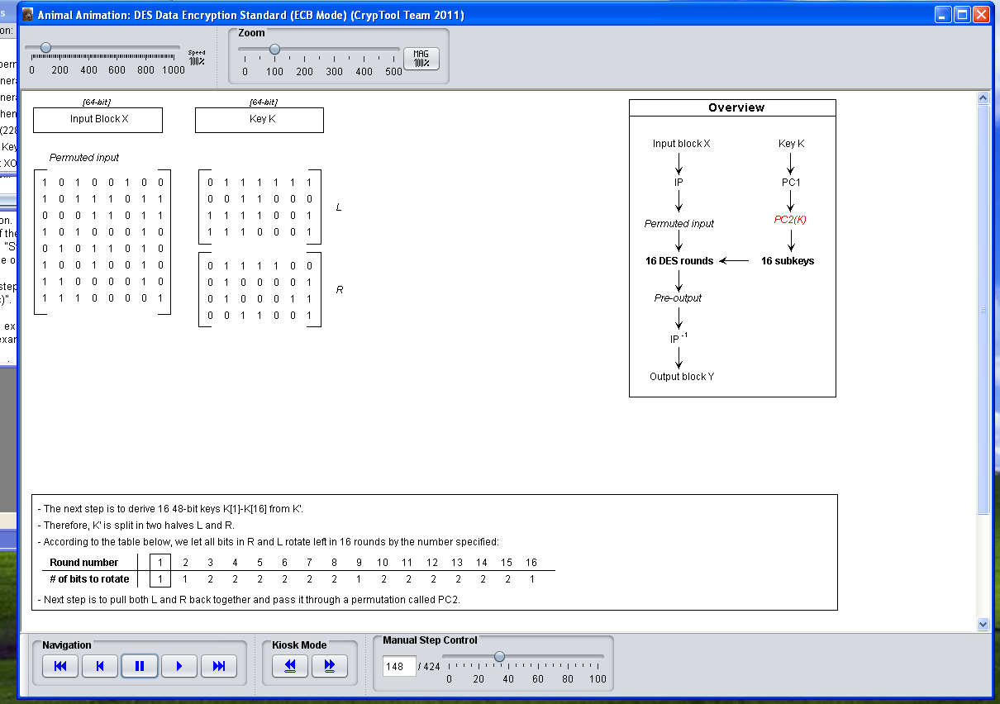
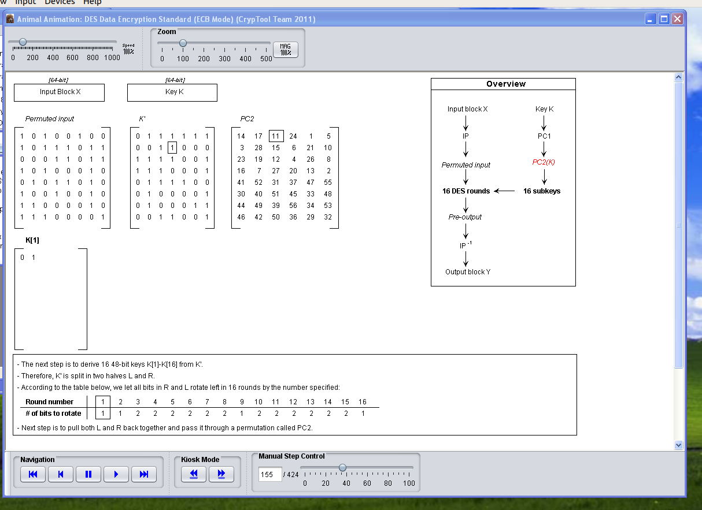
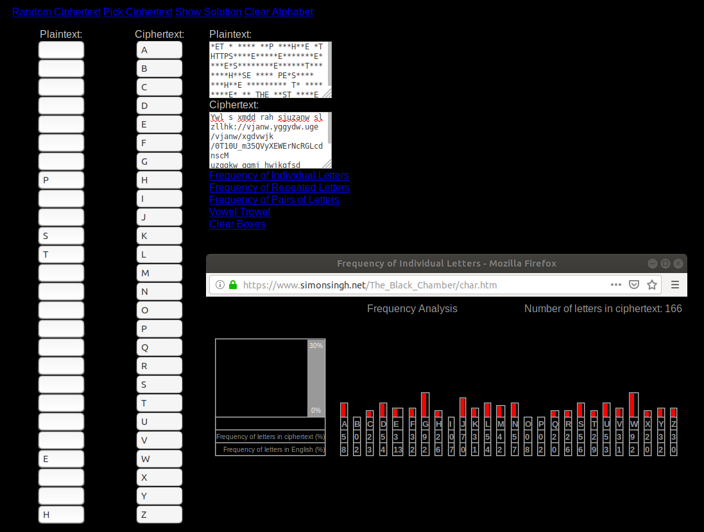
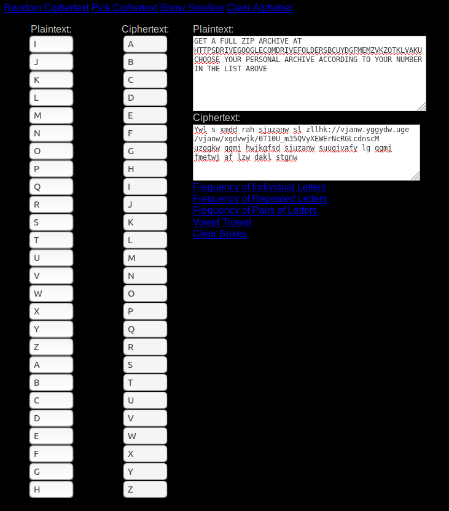
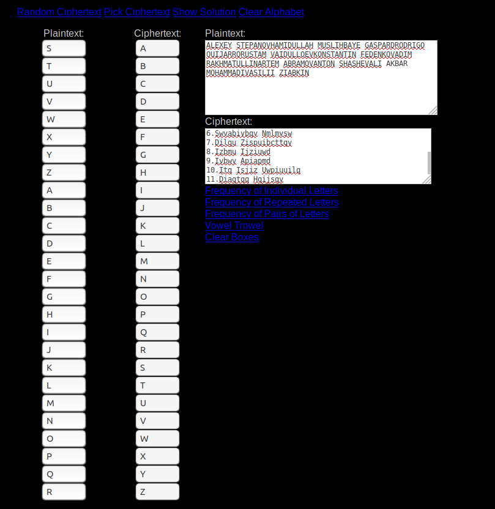

# SSN Lab 2 - Symmetrical Encryption
#### Artem Abramov SNE19

## 1. DES

### The Cryptool 1.x suite contains a simulator for the DES encryption algorithm in the menu “Individual Procedures / Visualization of Algorithms / DES”. Watch this animation.

I downloaded the English version of the CyptTool version 1.4.41 from https://www.cryptool.org/en/ct1-downloads and then configured it in Virtual Box WinXP. 

Then installing an older version of Java from https://www.oracle.com/technetwork/java/javase/downloads/java-archive-downloads-javase7-521261.html was really annoying (I had to register with oracle account, etc). Finally I had to downgrade the version of the CryptTool to 1.4.31, because version 1.4.41 has some sort of a bug and the visualizer does not work.  (To be honest, the tool is good, but the setup has been a tremendous waste of everyone's time, perhaps for next year the SNE students can at least get links to compatible software versions in the task description).

Then I could finally use the tool as shown in the screenshot below:

![winxp-codebook [Running] - Oracle VM VirtualBox_450](SSN-Lab-2-symmetrical.assets/winxp-codebook%20%5BRunning%5D%20-%20Oracle%20VM%20VirtualBox_450.png)


Another round is shown below:

![winxp-codebook [Running] - Oracle VM VirtualBox_452](SSN-Lab-2-symmetrical.assets/winxp-codebook%20%5BRunning%5D%20-%20Oracle%20VM%20VirtualBox_452.png)


### 1.1 Next, use the DES simulator at  http://lpb.canb.auug.org.au/adfa/src/DEScalc/index.html Step through the process of encrypting your name with the key 0x0101010101010101 and write
the internal state of the device at the 8th round.
I downloaded DEScalc.jar from the linked page and run it in WinXP. To encrypt my name I had to write it in hex. Assuming ASCII encoding my name `artem` would be `0x61 0x72 0x74 0x65 0x6d`, this is just from the ASCII table available from `man ascii` .  The tool expects the data to be padded, so I appended zeroes to the end. Below is a screenshot showing the final input to the DES Cypher Calculator:

![winxp-codebook [Running] - Oracle VM VirtualBox_453](SSN-Lab-2-symmetrical.assets/winxp-codebook%20%5BRunning%5D%20-%20Oracle%20VM%20VirtualBox_453.png)


The value on Round 8 is given by the line:

```
  Rnd8	f(R7=4fcef4e7, SK8=00 00 00 00 00 00 00 00 ) = 3550fd54
```


### 1.2 Inspect the key schedule phase for the given key and explain how the sub keys are generated for each of the 16 steps.

The subkeys are generated from the Primary Key. BEfore the subkeys are generated the primary key passes through a permutation called permuted choice 1 (PC1). Just prior to this the rightmost bit of every byte of the key is (i.e. every 8th bit is stripped. These bits are used for parity checking and do not influence encryption). The key then becomes 56-bits. Then we permute the key further with PC2.  This is shown below:




The next step is deriving 16 keys of 48 bits each. The first bit of K[1] comes by taking the bit from K' according to the number in PC2 as shown below:


Taking the the second bit `1` of K[1] from K' according to index `11` is shown below:




K[2] to K[16] use the same approach. The indices depend on the number of the round given in the table.


### 1.3 Comment on the behavior of DES when using the given key.

The subkey comes out to be all zero on each round. This is because ONLY the parity bit is set in the actual key, all the other bits are zero. The parity bit gets thrown out at the very beginning of the DES algorithm. Therefore even after all the permutations: PC1 and PC2 the Primary will still be all zeroes. Therefore any derived keys will also consist only of zero bits, because they are derived by taking bits (indexing bits) from the primary key.


## 2. AES

### The Cryptool 1.x suite contains an animation for the AES encryption algorithm. Watch the whole animation of AES using the Rijndael Animation flash video at http://poincare.matf.bg.ac.rs/~ezivkovm/nastava/rijndael_animacija.swf

I downloaded the Flash file, copied it to WinXP and opened it in Internet Explorer as shown below:

![winxp-codebook [Running] - Oracle VM VirtualBox_454](SSN-Lab-2-symmetrical.assets/winxp-codebook%20%5BRunning%5D%20-%20Oracle%20VM%20VirtualBox_454.png)

Stepping through the material is shown below:

![winxp-codebook [Running] - Oracle VM VirtualBox_456](SSN-Lab-2-symmetrical.assets/winxp-codebook%20%5BRunning%5D%20-%20Oracle%20VM%20VirtualBox_456.png)

### 2.4 Identify the Shannon diffusion element(s).

Diffusion elements ensure that a change of one bit in the input plaintext results in changing multiple different bits (at least more than half) of the resulting ciphertext. The shift-rows and mix-columns operations introduce diffusion, because one bit of difference will spread to multiple rows/columns, which will be amplified over multiple rounds.


### 2.5 Also identify the Shannon confusion element(s).

The confusion elements serve to make the relationship between the key and the cypher text as complex as possible. So it is impossible to make conclusions what the key was, based on the cyphertext. The S-boxes create confusion, because effectively they map every symbol to another making the relationship not a linear function of the input.


## 3 RC4

### Follow the instructions at  http://bit.ly/2gWJvqV, identify the URL and your personal archive accordingly, download it and inspect its contents.  There are two files encrypted with the RC4 cipher. 

The file contents are show below for reference:

```
1.Itmfmg Abmxivwd
2.Piuqlcttip Ucatqp
3.Jigm Oiaxizl
4.Zwlzqow Ycqrizzw
5.Zcabiu Diqlcttwmd
6.Swvabivbqv Nmlmvsw
7.Dilqu Zispuibcttqv
8.Izbmu Ijziuwd
9.Ivbwv Apiapmd
10.Itq Isjiz Uwpiuuilq
11.Diaqtqq Hqijsqv

Ywl s xmdd rah sjuzanw sl zllhk://vjanw.yggydw.uge/vjanw/xgdvwjk/0T10U_m35QVyXEWErNcRGLcdnscM
uzggkw qgmj hwjkgfsd sjuzanw suugjvafy lg qgmj fmetwj af lzw dakl stgnw 
```

It is clear that `Itq Isjiz Uwpiuuilq` is `Ali Akbar Mohammadi`, this will serve to start the analysis, I also noticed that `zllhk` is most likely to be `https`. To complete deciphering i started by trying the frequency analysis. I used the same tool as used in the previous lab https://www.simonsingh.net/The_Black_Chamber/letterfrequencies.html

Then I noticed that the letters were not matching, i.e. if `zllhk` is indeed `https` then we have the mapping:

```
z - h
l - t
h - p
k - s
```

But this did not fit Ali's name. So I decided to start with the bottom text first, as shown below:

```
Ywl s xmdd rah sjuzanw sl zllhk://vjanw.yggydw.uge/vjanw/xgdvwjk/0T10U_m35QVyXEWErNcRGLcdnscM
uzggkw qgmj hwjkgfsd sjuzanw suugjvafy lg qgmj fmetwj af lzw dakl stgnw 
```

The process is shown on the screenshot below:


Quick progress was made as shown below:




Then I realized this was a Caesar cipher and my guess was correct, the whole second text was deciphered as shown below:



The final text was as given below:

```
GET A FULL ZIP ARCHIVE AT HTTPSDRIVEGOOGLECOMDRIVEFOLDERSBCUYDGFMEMZVKZOTKLVAKUCHOOSE YOUR PERSONAL ARCHIVE ACCORDING TO YOUR NUMBER IN THE LIST ABOVE 
```

The link is:

```
HTTPSDRIVEGOOGLECOMDRIVEFOLDERSBCUYDGFMEMZVKZOTKLVAKU
```

We have to insert back the slashes, colons, numbers and unserscores and most importantly keeping the case correct, took me many attempts to get it right:

```
https://drive.google.com/drive/folders/0B10C_u35YDgFMEMzVkZOTklvakU
```


My name was deciphered in a similar manner. I suspected it was a Ceasar cypher and Ali's name gave a lot of the letters, so I just had to fill in the blanks as shown below:




The final text is as shown below:

```
ALEXEY STEPANOVHAMIDULLAH MUSLIHBAYE GASPARDRODRIGO QUIJARRORUSTAM VAIDULLOEVKONSTANTIN FEDENKOVADIM RAKHMATULLINARTEM ABRAMOV ANTONSHASHEVALI AKBAR MOHAMMADIVASILII ZIABKIN
```

Therefore my number is 8.

After I went to google disk and downloaded folder 8. Its contents are shown below:

```
artem@ ssn_8$ tree
.
└── files
    └── 8
        ├── 08471596.in
        ├── 10739426.in
        ├── 23856014.in
        ├── 35247961.in
        ├── 48301965.in
        ├── 49150763.in
        ├── 68157039.in
        ├── 78631025.in
        └── 82960357.in

2 directories, 9 files
```


### One of the files was encrypted using a 40 bit key that when represented in ASCII starts with the character a and contains only lowercase letters while the other uses a 48 bit key that can be written only with digits. Identify the encrypted files and using the brute force tool from https://gist.github.com/4017169 find the keys and decrypt the file. (Most likely you will have to install the pycrypto and numpy libraries first.)


### 3.6 (a) How did you identify the encrypted files?

We can only answer this question after trying to decrypt the files. We are given some information on each key, but not on the file. How can we tell if the file is encrypted or garbage? We have to try searching for possible keys and then match the key to the condition, or perhaps just see that the file was decrypted, before we can identify the files.

I installed the pycrypto dependency with the command below:

```
$ sudo pip3 install pycrypto
```

I  installed the numpy dependency with the command below:

```
$ sudo pip3 install numpy
```

Then I downloaded the script from github (I got the link after opening RAW view in github):

```
$ curl https://gist.githubusercontent.com/cosu/4017169/raw/84674aa4dee9b3432f98aa4b9561d5bc113c848a/rc4brute.py > rc4brute.py
```

By default the program expects a key with `KEY_LENGTH=5` which is 5 bytes and `ALPHABET = string.ascii_lowercase`.  At first I did not realize that ALPHABET was referring to the key, not to the file contents, after clearing this confusion, the next was obvious. Checking for the 40 bit key of lower case letters was done with the following command:

```
$ for f in *.in ; do python3 rc4brute.py $f && echo "done with $f" ; done
done with 08471596.in
done with 10739426.in
Key: afzds, Entropy: 4.514359073222539
done with 23856014.in
```

Therefore the key `afzds` can be applied to decrypt the file `23856014.in`. I terminated the script early when the key was found.

The next step was checking for the 48-bit key that is made up of only digits. To do this I modified the script to set `KEY_LENGTH=6` and set `ALPHABET = string.digits`.  Then I run the same bash command (in retrospect I could have excluded searching the `23856014.in` file):

```
artem@ 8$ for f in *.in ; do python3 rc4brute.py $f && echo "done with $f" ; done
done with 08471596.in
done with 10739426.in
done with 23856014.in
done with 35247961.in
done with 48301965.in
done with 49150763.in
Key: 027138, Entropy: 4.514359073222539
done with 68157039.in
```

Therefore the key `027138` can be applied to decrypt the file `68157039.in`. I terminated the script early when the key was found.

The Decrypted file is a fragment from Project Gutenberg and is given in the APPENDIX.

### 3.6 (b) What is the effective key strength for each of the keys?

Number of combinations for the first key and second keys:

1. Chose one out of 26 letters [a-z] and make the choice for 5 slots with repetitions: `26**5 =  11881376`

2. Chose one out of 10 numbers [0-9] and make the choice for 6 slots with repetitions: `10**6 = 1000000`

This means that the smaller alphabetic key should be about ten times harder to crack then the numeric key that is 8 bits longer. The fact that for me the script to find the first key worked faster was because the python script contains the following lines in function that generates the possible keys:

```
#We know prior that the key starts with a. Remove the next two lines for generic behavior
if string.ascii_lowercase in ALPHABET:
    base = tuple(['a']) + base
```

This means for the alphabetical key we were actually searching for `26**4 = 456976` combinations.


### 3.6 (c) Instrument the code to find out how many decryption attempts you can perform in one second. Where is the most time spent ?

Because our keys are only 5 or 6 bytes in length key generation should not be a  big deal, the most likely problem is in counting the bits into buckets in `numpy.bincount(int_array)` or doing other math (e.g. `log`).

The question asks how many attempts can be performed in one second. We already know that the exhaustive search for the second key takes `10**6 = 1000000` attempts. We can time the process for key generation and checking and then divide the total time by  `10**6`.

Note that to make the benchmark more accurate we should disable Garbage Collection, make sure not to write to stdout while timing (because this is an expensive operation). Because of this its not of much use to profile Python code.

The modified code is shown below:
```python
__author__ = 'cdumitru'

import sys
from Crypto.Cipher import ARC4
import numpy
import string
import itertools
from multiprocessing import Pool
from time import time
import cProfile


ALPHABET = string.digits
#ALPHABET = string.ascii_lowercase
#ALPHABET = string.ascii_uppercase
#ALPHABET = string.letters + string.digits
#ALPHABET = string.letters + string.digits + string.punctuation
#ALPHABET = string.printable

KEY_LENGTH = 6
FILE_NAME = sys.argv[1]
CPU_COUNT= 1


def gen():
    """
    Iterates through the alphabet one letter at a time
    """
    for i in ALPHABET:
        yield tuple([i])


def check(key, data):
    """
    Decrypts the data with the given key and checks the entropy
    """

    decr = ARC4.new(key).decrypt(data)

    #compute for the decrypted data block

    #interpret decrypted data as an int array
    int_array = numpy.frombuffer(decr, dtype=numpy.uint8)
    count = numpy.bincount(int_array)
    #compute probability for each int value
    prob = count/float(numpy.sum(count))
    #thow away zero values
    prob = prob [numpy.nonzero(prob)]
    #Shannon entropy
    entropy = -sum(prob * numpy.log2(prob))

    #if this doesn't look like a random stream then jackpot
    if entropy < 7.9:
        return 'Key: {0}, Entropy: {1}'.format(key, entropy)


def worker(base):
    #read 64KB from the file
    data = open(FILE_NAME, 'rb').read(2**16)

    #generate all the strings of KEY_LENGTH length and check them

    #We know prior that the key starts with a. Remove the next two lines for generic behavior
    if string.ascii_lowercase in ALPHABET:
        base = tuple(['a']) + base

    res = None
    t_start = time()
    for i in itertools.product(ALPHABET, repeat=KEY_LENGTH-len(base)):
        tmp = check(''.join(base + i), data)
        if tmp:
            res = tmp
    t_end = time()
    t_diff = t_end - t_start
    print("Start time={}, End time={}, Time for execution={}".format(t_start, t_end, t_diff))
    print(res)


def parallel():
    """
    Starts a number of threads that search through the key space
    """
    p = Pool(CPU_COUNT)
    p.map(worker, gen(), chunksize=2)
    p.close()
    p.join()

def serial():
    worker(tuple())


if __name__ == "__main__":
    serial()
```

The result of running the modified script was as below:

```
$ python3 rc4brute.py 08471596.in 
Start time=1572463795.5652683, End time=1572464162.9835927, Time for execution=367.41832447052
None
```

Therefore we can estimate how many keys were tried per second with  `10**6 / 367.41832447052 = 2721.69332175003` which means 2721 keys per second. Basically 2700 keys/sec.


### 3.6 (d) Modify the code to support parallel execution and calculate the speedup.

To make the code parallel I changed the last line in the script from `serial()` to `parallel()` and changed the constant `CPU_COUNT=1` into `CPU_COUNT=4` (according to the output of `/proc/cpuinfo` on my system, which showed 4 cores).

According to http://effbot.org/zone/thread-synchronization.htm Python provides atomic append to a list data structure out of the box (due to GIL). Therefore  I modified the code as shown below to time the parallel execution:

```python
__author__ = 'cdumitru'

import sys
from Crypto.Cipher import ARC4
import numpy
import string
import itertools
from multiprocessing import Pool
from time import time
import cProfile


ALPHABET = string.digits
#ALPHABET = string.ascii_lowercase
#ALPHABET = string.ascii_uppercase
#ALPHABET = string.letters + string.digits
#ALPHABET = string.letters + string.digits + string.punctuation
#ALPHABET = string.printable

KEY_LENGTH = 6
FILE_NAME = sys.argv[1]
CPU_COUNT= 4

t_results = []

def gen():
    """
    Iterates through the alphabet one letter at a time
    """
    for i in ALPHABET:
        yield tuple([i])


def check(key, data):
    """
    Decrypts the data with the given key and checks the entropy
    """

    decr = ARC4.new(key).decrypt(data)

    #compute for the decrypted data block

    #interpret decrypted data as an int array
    int_array = numpy.frombuffer(decr, dtype=numpy.uint8)
    count = numpy.bincount(int_array)
    #compute probability for each int value
    prob = count/float(numpy.sum(count))
    #thow away zero values
    prob = prob [numpy.nonzero(prob)]
    #Shannon entropy
    entropy = -sum(prob * numpy.log2(prob))

    #if this doesn't look like a random stream then jackpot
    if entropy < 7.9:
        return 'Key: {0}, Entropy: {1}'.format(key, entropy)


def worker(base):
    global t_results
    #read 64KB from the file
    data = open(FILE_NAME, 'rb').read(2**16)

    #generate all the strings of KEY_LENGTH length and check them

    #We know prior that the key starts with a. Remove the next two lines for generic behavior
    if string.ascii_lowercase in ALPHABET:
        base = tuple(['a']) + base

    res = None
    t_start=time()
    for i in itertools.product(ALPHABET, repeat=KEY_LENGTH-len(base)):
        tmp = check(''.join(base + i), data)
        if tmp:
            res = tmp
    t_end=time()
    t_diff = t_end - t_start
    t_results.append(t_diff)


def parallel():
    """
    Starts a number of threads that search through the key space
    """
    total_t_start = time()
    p = Pool(CPU_COUNT)
    p.map(worker, gen(), chunksize=2)
    p.close()
    p.join()
    total_t_end = time()
    total_t_diff = total_t_end - total_t_start
    print(t_results)
    print(total_t_diff)

def serial():
    worker(tuple())


if __name__ == "__main__":
    parallel()
```


The output of the command was as below:

```
$ python3 rc4brute-parralel.py 08471596.in 
[]
162.10495114326477
```

For come reason I kept getting empty list for the values of individual threads. However the overall time is also useful - `162.10495114326477` seconds. This is the time from initializing the Pool to exhausting all the keys. Because the full search was `10**6` combinations it means the parallel version can examine `10**6 / 162.10495114326477 = 6168.8430424078915` which is 6168 keys per second. Basically 6150 keys per second. This is a noticeable speedup! 


### 3.6 (e) If the same message would be encrypted with a key with of length 48 bits but which uses all the printable characters how much time would it take to explore the full key space ?

According to python3 there are 100 printable characters as shown below:
```
$ python3
Python 3.6.8 (default, Aug 20 2019, 13:12:48) 
[GCC 8.3.0] on linux
Type "help", "copyright", "credits" or "license" for more information.
>>> import string
>>> string.printable
'0123456789abcdefghijklmnopqrstuvwxyzABCDEFGHIJKLMNOPQRSTUVWXYZ!"#$%&\'()*+,-./:;<=>?@[\\]^_`{|}~ \t\n\r\x0b\x0c'
>>> len(string.printable)
100
```

The strength of the key is then `100**6 = 1000000000000`. Assuming we can check 6150 keys per second this will take: `162601626.01626018 seconds`  ~ `2710027.100271003 minutes` ~ `2710027.100271003 hours` ~ `1881.9632640770853 days` ~ `5 years`.


## 4 AES - 2

### 4.7 Modify the code to support AES brute-force in CBC mode. How many keys can you test per second? 


### Julian Assange has released an insurance file encrypted with AES256. Assuming that no disruptive technological breakthrough will take place in the future and the performance of CPUs will double every 18 months, when will it be possible to brute-force the file in reasonable time, i.e. less than 1year, using a single computer?


## APPENDIX

```
The Project Gutenberg EBook of On the Origin of Species, by Charles Darwin

This eBook is for the use of anyone anywhere at no cost and with
almost no restrictions whatsoever.  You may copy it, give it away or
re-use it under the terms of the Project Gutenberg License included
with this eBook or online at www.gutenberg.org


Title: On the Origin of Species
       1st Edition

Author: Charles Darwin

Release Date: Release Date: March, 1998 [EBook #1228]
Posting Date: November 23, 2009

Language: English


*** START OF THIS PROJECT GUTENBERG EBOOK ON THE ORIGIN OF SPECIES ***


Produced by Sue Asscher


ON THE ORIGIN OF SPECIES.

OR THE PRESERVATION OF FAVOURED RACES IN THE STRUGGLE FOR LIFE.


By Charles Darwin, M.A.,

Fellow Of The Royal, Geological, Linnaean, Etc., Societies;

Author Of 'Journal Of Researches During H.M.S. Beagle's Voyage Round The
World.'


LONDON:

JOHN MURRAY, ALBEMARLE STREET.

1859.


Down, Bromley, Kent,

October 1st, 1859.


"But with regard to the material world, we can at least go so far as
this--we can perceive that events are brought about not by insulated
interpositions of Divine power, exerted in each particular case, but by
the establishment of general laws."

W. Whewell: Bridgewater Treatise.


"To conclude, therefore, let no man out of a weak conceit of sobriety,
or an ill-applied moderation, think or maintain, that a man can search
too far or be too well studied in the book of God's word, or in the book
of God's works; divinity or philosophy; but rather let men endeavour an
endless progress or proficience in both."

Bacon: Advancement of Learning.


CONTENTS.


  INTRODUCTION.


  CHAPTER 1. VARIATION UNDER DOMESTICATION.

  Causes of Variability.
  Effects of Habit.
  Correlation of Growth.
  Inheritance.
  Character of Domestic Varieties.
  Difficulty of distinguishing between Varieties and Species.
  Origin of Domestic Varieties from one or more Species.
  Domestic Pigeons, their Differences and Origin.
  Principle of Selection anciently followed, its Effects.
  Methodical and Unconscious Selection.
  Unknown Origin of our Domestic Productions.
  Circumstances favourable to Man's power of Selection.


  CHAPTER 2. VARIATION UNDER NATURE.

  Variability.
  Individual Differences.
  Doubtful species.
  Wide ranging, much diffused, and common species vary most.
  Species of the larger genera in any country vary more than the species
  of the smaller genera.
  Many of the species of the larger genera resemble varieties in being
  very closely, but unequally, related to each other, and in having
  restricted ranges.


  CHAPTER 3. STRUGGLE FOR EXISTENCE.

  Bears on natural selection.
  The term used in a wide sense.
  Geometrical powers of increase.
  Rapid increase of naturalised animals and plants.
  Nature of the checks to increase.
  Competition universal.
  Effects of climate.
  Protection from the number of individuals.
  Complex relations of all animals and plants throughout nature.
  Struggle for life most severe between individuals and varieties of the
  same species; often severe between species of the same genus.
  The relation of organism to organism the most important of all
  relations.


  CHAPTER 4. NATURAL SELECTION.

  Natural Selection: its power compared with man's selection, its power
  on characters of trifling importance, its power at all ages and on
  both sexes.
  Sexual Selection.
  On the generality of intercrosses between individuals of the same
  species.
  Circumstances favourable and unfavourable to Natural Selection,
  namely, intercrossing, isolation, number of individuals.
  Slow action.
  Extinction caused by Natural Selection.
  Divergence of Character, related to the diversity of inhabitants of
  any small area, and to naturalisation.
  Action of Natural Selection, through Divergence of Character and
  Extinction, on the descendants from a common parent.
  Explains the Grouping of all organic beings.


  CHAPTER 5. LAWS OF VARIATION.

  Effects of external conditions.
  Use and disuse, combined with natural selection; organs of flight and
  of vision.
  Acclimatisation.
  Correlation of growth.
  Compensation and economy of growth.
  False correlations.
  Multiple, rudimentary, and lowly organised structures variable.
  Parts developed in an unusual manner are highly variable: specific
  characters more variable than generic: secondary sexual characters
  variable.
  Species of the same genus vary in an analogous manner.
  Reversions to long-lost characters.
  Summary.


  CHAPTER 6. DIFFICULTIES ON THEORY.

  Difficulties on the theory of descent with modification.
  Transitions.
  Absence or rarity of transitional varieties.
  Transitions in habits of life.
  Diversified habits in the same species.
  Species with habits widely different from those of their allies.
  Organs of extreme perfection.
  Means of transition.
  Cases of difficulty.
  Natura non facit saltum.
  Organs of small importance.
  Organs not in all cases absolutely perfect.
  The law of Unity of Type and of the Conditions of Existence embraced
  by the theory of Natural Selection.


  CHAPTER 7. INSTINCT.

  Instincts comparable with habits, but different in their origin.
  Instincts graduated.
  Aphides and ants.
  Instincts variable.
  Domestic instincts, their origin.
  Natural instincts of the cuckoo, ostrich, and parasitic bees.
  Slave-making ants.
  Hive-bee, its cell-making instinct.
  Difficulties on the theory of the Natural Selection of instincts.
  Neuter or sterile insects.
  Summary.


  CHAPTER 8. HYBRIDISM.

  Distinction between the sterility of first crosses and of hybrids.
  Sterility various in degree, not universal, affected by close
  interbreeding, removed by domestication.
  Laws governing the sterility of hybrids.
  Sterility not a special endowment, but incidental on other
  differences.
  Causes of the sterility of first crosses and of hybrids.
  Parallelism between the effects of changed conditions of life and
  crossing.
  Fertility of varieties when crossed and of their mongrel offspring not
  universal.
  Hybrids and mongrels compared independently of their fertility.
  Summary.


  CHAPTER 9. ON THE IMPERFECTION OF THE GEOLOGICAL RECORD.

  On the absence of intermediate varieties at the present day.
  On the nature of extinct intermediate varieties; on their number.
  On the vast lapse of time, as inferred from the rate of deposition and
  of denudation.
  On the poorness of our palaeontological collections.
  On the intermittence of geological formations.
  On the absence of intermediate varieties in any one formation.
  On the sudden appearance of groups of species.
  On their sudden appearance in the lowest known fossiliferous strata.


  CHAPTER 10. ON THE GEOLOGICAL SUCCESSION OF ORGANIC BEINGS.

  On the slow and successive appearance of new species.
  On their different rates of change.
  Species once lost do not reappear.
  Groups of species follow the same general rules in their appearance
  and disappearance as do single species.
  On Extinction.
  On simultaneous changes in the forms of life throughout the world.
  On the affinities of extinct species to each other and to living
  species.
  On the state of development of ancient forms.
  On the succession of the same types within the same areas.
  Summary of preceding and present chapters.


  CHAPTER 11. GEOGRAPHICAL DISTRIBUTION.

  Present distribution cannot be accounted for by differences in
  physical conditions.
  Importance of barriers.
  Affinity of the productions of the same continent.
  Centres of creation.
  Means of dispersal, by changes of climate and of the level of the
  land, and by occasional means.
  Dispersal during the Glacial period co-extensive with the world.


  CHAPTER 12. GEOGRAPHICAL DISTRIBUTION--continued.

  Distribution of fresh-water productions.
  On the inhabitants of oceanic islands.
  Absence of Batrachians and of terrestrial Mammals.
  On the relation of the inhabitants of islands to those of the nearest
  mainland.
  On colonisation from the nearest source with subsequent modification.
  Summary of the last and present chapters.


  CHAPTER 13. MUTUAL AFFINITIES OF ORGANIC BEINGS: MORPHOLOGY:
  EMBRYOLOGY: RUDIMENTARY
  ORGANS.

  CLASSIFICATION, groups subordinate to groups.
  Natural system.
  Rules and difficulties in classification, explained on the theory of
  descent with modification.
  Classification of varieties.
  Descent always used in classification.
  Analogical or adaptive characters.
  Affinities, general, complex and radiating.
  Extinction separates and defines groups.
  MORPHOLOGY, between members of the same class, between parts of the
  same individual.
  EMBRYOLOGY, laws of, explained by variations not supervening at an
  early age, and being inherited at a corresponding age.
  RUDIMENTARY ORGANS; their origin explained.
  Summary.


  CHAPTER 14. RECAPITULATION AND CONCLUSION.

  Recapitulation of the difficulties on the theory of Natural Selection.
  Recapitulation of the general and special circumstances in its favour.
  Causes of the general belief in the immutability of species.
  How far the theory of natural selection may be extended.
  Effects of its adoption on the study of Natural history.
  Concluding remarks.


ON THE ORIGIN OF SPECIES.


INTRODUCTION.

When on board H.M.S. 'Beagle,' as naturalist, I was much struck with
certain facts in the distribution of the inhabitants of South America,
and in the geological relations of the present to the past inhabitants
of that continent. These facts seemed to me to throw some light on the
origin of species--that mystery of mysteries, as it has been called by
one of our greatest philosophers. On my return home, it occurred to me,
in 1837, that something might perhaps be made out on this question by
patiently accumulating and reflecting on all sorts of facts which could
possibly have any bearing on it. After five years' work I allowed myself
to speculate on the subject, and drew up some short notes; these I
enlarged in 1844 into a sketch of the conclusions, which then seemed to
me probable: from that period to the present day I have steadily pursued
the same object. I hope that I may be excused for entering on these
personal details, as I give them to show that I have not been hasty in
coming to a decision.

My work is now nearly finished; but as it will take me two or three more
years to complete it, and as my health is far from strong, I have been
urged to publish this Abstract. I have more especially been induced to
do this, as Mr. Wallace, who is now studying the natural history of
the Malay archipelago, has arrived at almost exactly the same general
conclusions that I have on the origin of species. Last year he sent to
me a memoir on this subject, with a request that I would forward it
to Sir Charles Lyell, who sent it to the Linnean Society, and it is
published in the third volume of the Journal of that Society. Sir C.
Lyell and Dr. Hooker, who both knew of my work--the latter having read
my sketch of 1844--honoured me by thinking it advisable to publish, with
Mr. Wallace's excellent memoir, some brief extracts from my manuscripts.

This Abstract, which I now publish, must necessarily be imperfect. I
cannot here give references and authorities for my several statements;
and I must trust to the reader reposing some confidence in my accuracy.
No doubt errors will have crept in, though I hope I have always been
cautious in trusting to good authorities alone. I can here give only
the general conclusions at which I have arrived, with a few facts in
illustration, but which, I hope, in most cases will suffice. No one can
feel more sensible than I do of the necessity of hereafter publishing in
detail all the facts, with references, on which my conclusions have been
grounded; and I hope in a future work to do this. For I am well aware
that scarcely a single point is discussed in this volume on which facts
cannot be adduced, often apparently leading to conclusions directly
opposite to those at which I have arrived. A fair result can be obtained
only by fully stating and balancing the facts and arguments on both
sides of each question; and this cannot possibly be here done.

I much regret that want of space prevents my having the satisfaction of
acknowledging the generous assistance which I have received from very
many naturalists, some of them personally unknown to me. I cannot,
however, let this opportunity pass without expressing my deep
obligations to Dr. Hooker, who for the last fifteen years has aided me
in every possible way by his large stores of knowledge and his excellent
judgment.

In considering the Origin of Species, it is quite conceivable that a
naturalist, reflecting on the mutual affinities of organic beings,
on their embryological relations, their geographical distribution,
geological succession, and other such facts, might come to the
conclusion that each species had not been independently created, but
had descended, like varieties, from other species. Nevertheless, such
a conclusion, even if well founded, would be unsatisfactory, until it
could be shown how the innumerable species inhabiting this world
have been modified, so as to acquire that perfection of structure and
coadaptation which most justly excites our admiration. Naturalists
continually refer to external conditions, such as climate, food, etc.,
as the only possible cause of variation. In one very limited sense,
as we shall hereafter see, this may be true; but it is preposterous to
attribute to mere external conditions, the structure, for instance,
of the woodpecker, with its feet, tail, beak, and tongue, so admirably
adapted to catch insects under the bark of trees. In the case of the
misseltoe, which draws its nourishment from certain trees, which has
seeds that must be transported by certain birds, and which has flowers
with separate sexes absolutely requiring the agency of certain insects
to bring pollen from one flower to the other, it is equally preposterous
to account for the structure of this parasite, with its relations to
several distinct organic beings, by the effects of external conditions,
or of habit, or of the volition of the plant itself.

The author of the 'Vestiges of Creation' would, I presume, say that,
after a certain unknown number of generations, some bird had given birth
to a woodpecker, and some plant to the misseltoe, and that these had
been produced perfect as we now see them; but this assumption seems to
me to be no explanation, for it leaves the case of the coadaptations of
organic beings to each other and to their physical conditions of life,
untouched and unexplained.

It is, therefore, of the highest importance to gain a clear insight into
the means of modification and coadaptation. At the commencement of
my observations it seemed to me probable that a careful study of
domesticated animals and of cultivated plants would offer the best
chance of making out this obscure problem. Nor have I been disappointed;
in this and in all other perplexing cases I have invariably found that
our knowledge, imperfect though it be, of variation under domestication,
afforded the best and safest clue. I may venture to express my
conviction of the high value of such studies, although they have been
very commonly neglected by naturalists.

From these considerations, I shall devote the first chapter of this
Abstract to Variation under Domestication. We shall thus see that a
large amount of hereditary modification is at least possible, and, what
is equally or more important, we shall see how great is the power of man
in accumulating by his Selection successive slight variations. I will
then pass on to the variability of species in a state of nature; but
I shall, unfortunately, be compelled to treat this subject far too
briefly, as it can be treated properly only by giving long catalogues of
facts. We shall, however, be enabled to discuss what circumstances
are most favourable to variation. In the next chapter the Struggle
for Existence amongst all organic beings throughout the world, which
inevitably follows from their high geometrical powers of increase, will
be treated of. This is the doctrine of Malthus, applied to the whole
animal and vegetable kingdoms. As many more individuals of each species
are born than can possibly survive; and as, consequently, there is a
frequently recurring struggle for existence, it follows that any being,
if it vary however slightly in any manner profitable to itself, under
the complex and sometimes varying conditions of life, will have a better
chance of surviving, and thus be NATURALLY SELECTED. From the strong
principle of inheritance, any selected variety will tend to propagate
its new and modified form.

This fundamental subject of Natural Selection will be treated at
some length in the fourth chapter; and we shall then see how Natural
Selection almost inevitably causes much Extinction of the less improved
forms of life and induces what I have called Divergence of Character.
In the next chapter I shall discuss the complex and little known laws of
variation and of correlation of growth. In the four succeeding chapters,
the most apparent and gravest difficulties on the theory will be given:
namely, first, the difficulties of transitions, or in understanding how
a simple being or a simple organ can be changed and perfected into a
highly developed being or elaborately constructed organ; secondly
the subject of Instinct, or the mental powers of animals, thirdly,
Hybridism, or the infertility of species and the fertility of varieties
when intercrossed; and fourthly, the imperfection of the Geological
Record. In the next chapter I shall consider the geological succession
of organic beings throughout time; in the eleventh and twelfth, their
geographical distribution throughout space; in the thirteenth, their
classification or mutual affinities, both when mature and in an
embryonic condition. In the last chapter I shall give a brief
recapitulation of the whole work, and a few concluding remarks.

No one ought to feel surprise at much remaining as yet unexplained in
regard to the origin of species and varieties, if he makes due allowance
for our profound ignorance in regard to the mutual relations of all
the beings which live around us. Who can explain why one species ranges
widely and is very numerous, and why another allied species has a narrow
range and is rare? Yet these relations are of the highest importance,
for they determine the present welfare, and, as I believe, the future
success and modification of every inhabitant of this world. Still less
do we know of the mutual relations of the innumerable inhabitants of the
world during the many past geological epochs in its history. Although
much remains obscure, and will long remain obscure, I can entertain no
doubt, after the most deliberate study and dispassionate judgment of
which I am capable, that the view which most naturalists entertain,
and which I formerly entertained--namely, that each species has been
independently created--is erroneous. I am fully convinced that species
are not immutable; but that those belonging to what are called the
same genera are lineal descendants of some other and generally extinct
species, in the same manner as the acknowledged varieties of any one
species are the descendants of that species. Furthermore, I am convinced
that Natural Selection has been the main but not exclusive means of
modification.


1. VARIATION UNDER DOMESTICATION.

Causes of Variability. Effects of Habit. Correlation of Growth.
Inheritance. Character of Domestic Varieties. Difficulty of
distinguishing between Varieties and Species. Origin of Domestic
Varieties from one or more Species. Domestic Pigeons, their Differences
and Origin. Principle of Selection anciently followed, its Effects.
Methodical and Unconscious Selection. Unknown Origin of our Domestic
Productions. Circumstances favourable to Man's power of Selection.

When we look to the individuals of the same variety or sub-variety of
our older cultivated plants and animals, one of the first points which
strikes us, is, that they generally differ much more from each other,
than do the individuals of any one species or variety in a state of
nature. When we reflect on the vast diversity of the plants and animals
which have been cultivated, and which have varied during all ages under
the most different climates and treatment, I think we are driven to
conclude that this greater variability is simply due to our domestic
productions having been raised under conditions of life not so uniform
as, and somewhat different from, those to which the parent-species have
been exposed under nature. There is, also, I think, some probability
in the view propounded by Andrew Knight, that this variability may be
partly connected with excess of food. It seems pretty clear that organic
beings must be exposed during several generations to the new conditions
of life to cause any appreciable amount of variation; and that when the
organisation has once begun to vary, it generally continues to vary for
many generations. No case is on record of a variable being ceasing to be
variable under cultivation. Our oldest cultivated plants, such as wheat,
still often yield new varieties: our oldest domesticated animals are
still capable of rapid improvement or modification.

It has been disputed at what period of life the causes of variability,
whatever they may be, generally act; whether during the early or late
period of development of the embryo, or at the instant of conception.
Geoffroy St. Hilaire's experiments show that unnatural treatment of the
embryo causes monstrosities; and monstrosities cannot be separated by
any clear line of distinction from mere variations. But I am strongly
inclined to suspect that the most frequent cause of variability may
be attributed to the male and female reproductive elements having been
affected prior to the act of conception. Several reasons make me believe
in this; but the chief one is the remarkable effect which confinement or
cultivation has on the functions of the reproductive system; this
system appearing to be far more susceptible than any other part of the
organisation, to the action of any change in the conditions of life.
Nothing is more easy than to tame an animal, and few things more
difficult than to get it to breed freely under confinement, even in the
many cases when the male and female unite. How many animals there
are which will not breed, though living long under not very close
confinement in their native country! This is generally attributed to
vitiated instincts; but how many cultivated plants display the utmost
vigour, and yet rarely or never seed! In some few such cases it has
been found out that very trifling changes, such as a little more or less
water at some particular period of growth, will determine whether or not
the plant sets a seed. I cannot here enter on the copious details which
I have collected on this curious subject; but to show how singular the
laws are which determine the reproduction of animals under confinement,
I may just mention that carnivorous animals, even from the tropics,
breed in this country pretty freely under confinement, with the
exception of the plantigrades or bear family; whereas, carnivorous
birds, with the rarest exceptions, hardly ever lay fertile eggs. Many
exotic plants have pollen utterly worthless, in the same exact
condition as in the most sterile hybrids. When, on the one hand, we
see domesticated animals and plants, though often weak and sickly, yet
breeding quite freely under confinement; and when, on the other hand,
we see individuals, though taken young from a state of nature,
perfectly tamed, long-lived, and healthy (of which I could give numerous
instances), yet having their reproductive system so seriously affected
by unperceived causes as to fail in acting, we need not be surprised
at this system, when it does act under confinement, acting not quite
regularly, and producing offspring not perfectly like their parents or
variable.

Sterility has been said to be the bane of horticulture; but on this
view we owe variability to the same cause which produces sterility; and
variability is the source of all the choicest productions of the garden.
I may add, that as some organisms will breed most freely under the
most unnatural conditions (for instance, the rabbit and ferret kept
in hutches), showing that their reproductive system has not been thus
affected; so will some animals and plants withstand domestication or
cultivation, and vary very slightly--perhaps hardly more than in a state
of nature.

A long list could easily be given of "sporting plants;" by this term
gardeners mean a single bud or offset, which suddenly assumes a new and
sometimes very different character from that of the rest of the plant.
Such buds can be propagated by grafting, etc., and sometimes by seed.
These "sports" are extremely rare under nature, but far from rare under
cultivation; and in this case we see that the treatment of the parent
has affected a bud or offset, and not the ovules or pollen. But it is
the opinion of most physiologists that there is no essential difference
between a bud and an ovule in their earliest stages of formation; so
that, in fact, "sports" support my view, that variability may be largely
attributed to the ovules or pollen, or to both, having been affected by
the treatment of the parent prior to the act of conception. These cases
anyhow show that variation is not necessarily connected, as some authors
have supposed, with the act of generation.

Seedlings from the same fruit, and the young of the same litter,
sometimes differ considerably from each other, though both the young
and the parents, as Muller has remarked, have apparently been exposed to
exactly the same conditions of life; and this shows how unimportant the
direct effects of the conditions of life are in comparison with the laws
of reproduction, and of growth, and of inheritance; for had the action
of the conditions been direct, if any of the young had varied, all would
probably have varied in the same manner. To judge how much, in the case
of any variation, we should attribute to the direct action of heat,
moisture, light, food, etc., is most difficult: my impression is, that
with animals such agencies have produced very little direct effect,
though apparently more in the case of plants. Under this point of view,
Mr. Buckman's recent experiments on plants seem extremely valuable.
When all or nearly all the individuals exposed to certain conditions are
affected in the same way, the change at first appears to be directly
due to such conditions; but in some cases it can be shown that quite
opposite conditions produce similar changes of structure. Nevertheless
some slight amount of change may, I think, be attributed to the direct
action of the conditions of life--as, in some cases, increased size from
amount of food, colour from particular kinds of food and from light, and
perhaps the thickness of fur from climate.

Habit also has a decided influence, as in the period of flowering with
plants when transported from one climate to another. In animals it has
a more marked effect; for instance, I find in the domestic duck that
the bones of the wing weigh less and the bones of the leg more,
in proportion to the whole skeleton, than do the same bones in the
wild-duck; and I presume that this change may be safely attributed to
the domestic duck flying much less, and walking more, than its wild
parent. The great and inherited development of the udders in cows and
goats in countries where they are habitually milked, in comparison with
the state of these organs in other countries, is another instance of the
effect of use. Not a single domestic animal can be named which has not
in some country drooping ears; and the view suggested by some authors,
that the drooping is due to the disuse of the muscles of the ear, from
the animals not being much alarmed by danger, seems probable.

There are many laws regulating variation, some few of which can be dimly
seen, and will be hereafter briefly mentioned. I will here only allude
to what may be called correlation of growth. Any change in the embryo
or larva will almost certainly entail changes in the mature animal. In
monstrosities, the correlations between quite distinct parts are very
curious; and many instances are given in Isidore Geoffroy St. Hilaire's
great work on this subject. Breeders believe that long limbs are almost
always accompanied by an elongated head. Some instances of correlation
are quite whimsical; thus cats with blue eyes are invariably deaf;
colour and constitutional peculiarities go together, of which many
remarkable cases could be given amongst animals and plants. From the
facts collected by Heusinger, it appears that white sheep and pigs are
differently affected from coloured individuals by certain vegetable
poisons. Hairless dogs have imperfect teeth; long-haired and
coarse-haired animals are apt to have, as is asserted, long or many
horns; pigeons with feathered feet have skin between their outer toes;
pigeons with short beaks have small feet, and those with long beaks
large feet. Hence, if man goes on selecting, and thus augmenting, any
peculiarity, he will almost certainly unconsciously modify other parts
of the structure, owing to the mysterious laws of the correlation of
growth.

The result of the various, quite unknown, or dimly seen laws of
variation is infinitely complex and diversified. It is well worth while
carefully to study the several treatises published on some of our old
cultivated plants, as on the hyacinth, potato, even the dahlia, etc.;
and it is really surprising to note the endless points in structure and
constitution in which the varieties and sub-varieties differ slightly
from each other. The whole organisation seems to have become plastic,
and tends to depart in some small degree from that of the parental type.

Any variation which is not inherited is unimportant for us. But the
number and diversity of inheritable deviations of structure, both
those of slight and those of considerable physiological importance,
is endless. Dr. Prosper Lucas's treatise, in two large volumes, is the
fullest and the best on this subject. No breeder doubts how strong
is the tendency to inheritance: like produces like is his fundamental
belief: doubts have been thrown on this principle by theoretical writers
alone. When a deviation appears not unfrequently, and we see it in the
father and child, we cannot tell whether it may not be due to the same
original cause acting on both; but when amongst individuals, apparently
exposed to the same conditions, any very rare deviation, due to some
extraordinary combination of circumstances, appears in the parent--say,
once amongst several million individuals--and it reappears in the
child, the mere doctrine of chances almost compels us to attribute
its reappearance to inheritance. Every one must have heard of cases of
albinism, prickly skin, hairy bodies, etc., appearing in several members
of the same family. If strange and rare deviations of structure are
truly inherited, less strange and commoner deviations may be freely
admitted to be inheritable. Perhaps the correct way of viewing the
whole subject, would be, to look at the inheritance of every character
whatever as the rule, and non-inheritance as the anomaly.

The laws governing inheritance are quite unknown; no one can say why the
same peculiarity in different individuals of the same species, and in
individuals of different species, is sometimes inherited and sometimes
not so; why the child often reverts in certain characters to its
grandfather or grandmother or other much more remote ancestor; why a
peculiarity is often transmitted from one sex to both sexes or to one
sex alone, more commonly but not exclusively to the like sex. It is a
fact of some little importance to us, that peculiarities appearing
in the males of our domestic breeds are often transmitted either
exclusively, or in a much greater degree, to males alone. A much more
important rule, which I think may be trusted, is that, at whatever
period of life a peculiarity first appears, it tends to appear in the
offspring at a corresponding age, though sometimes earlier. In many
cases this could not be otherwise: thus the inherited peculiarities
in the horns of cattle could appear only in the offspring when nearly
mature; peculiarities in the silkworm are known to appear at the
corresponding caterpillar or cocoon stage. But hereditary diseases and
some other facts make me believe that the rule has a wider extension,
and that when there is no apparent reason why a peculiarity should
appear at any particular age, yet that it does tend to appear in the
offspring at the same period at which it first appeared in the parent. I
believe this rule to be of the highest importance in explaining the
laws of embryology. These remarks are of course confined to the first
APPEARANCE of the peculiarity, and not to its primary cause, which may
have acted on the ovules or male element; in nearly the same manner as
in the crossed offspring from a short-horned cow by a long-horned bull,
the greater length of horn, though appearing late in life, is clearly
due to the male element.

Having alluded to the subject of reversion, I may here refer to
a statement often made by naturalists--namely, that our domestic
varieties, when run wild, gradually but certainly revert in character to
their aboriginal stocks. Hence it has been argued that no deductions can
be drawn from domestic races to species in a state of nature. I have in
vain endeavoured to discover on what decisive facts the above statement
has so often and so boldly been made. There would be great difficulty
in proving its truth: we may safely conclude that very many of the most
strongly-marked domestic varieties could not possibly live in a wild
state. In many cases we do not know what the aboriginal stock was, and
so could not tell whether or not nearly perfect reversion had ensued.
It would be quite necessary, in order to prevent the effects of
intercrossing, that only a single variety should be turned loose in
its new home. Nevertheless, as our varieties certainly do occasionally
revert in some of their characters to ancestral forms, it seems to me
not improbable, that if we could succeed in naturalising, or were to
cultivate, during many generations, the several races, for instance,
of the cabbage, in very poor soil (in which case, however, some effect
would have to be attributed to the direct action of the poor soil),
that they would to a large extent, or even wholly, revert to the wild
aboriginal stock. Whether or not the experiment would succeed, is not of
great importance for our line of argument; for by the experiment itself
the conditions of life are changed. If it could be shown that our
domestic varieties manifested a strong tendency to reversion,--that
is, to lose their acquired characters, whilst kept under unchanged
conditions, and whilst kept in a considerable body, so that free
intercrossing might check, by blending together, any slight deviations
of structure, in such case, I grant that we could deduce nothing from
domestic varieties in regard to species. But there is not a shadow of
evidence in favour of this view: to assert that we could not breed
our cart and race-horses, long and short-horned cattle, and poultry of
various breeds, and esculent vegetables, for an almost infinite number
of generations, would be opposed to all experience. I may add, that when
under nature the conditions of life do change, variations and reversions
of character probably do occur; but natural selection, as will hereafter
be explained, will determine how far the new characters thus arising
shall be preserved.

When we look to the hereditary varieties or races of our domestic
animals and plants, and compare them with species closely allied
together, we generally perceive in each domestic race, as already
remarked, less uniformity of character than in true species. Domestic
races of the same species, also, often have a somewhat monstrous
character; by which I mean, that, although differing from each other,
and from the other species of the same genus, in several trifling
respects, they often differ in an extreme degree in some one part, both
when compared one with another, and more especially when compared with
all the species in nature to which they are nearest allied. With these
exceptions (and with that of the perfect fertility of varieties when
crossed,--a subject hereafter to be discussed), domestic races of the
same species differ from each other in the same manner as, only in most
cases in a lesser degree than, do closely-allied species of the same
genus in a state of nature. I think this must be admitted, when we find
that there are hardly any domestic races, either amongst animals or
plants, which have not been ranked by some competent judges as
mere varieties, and by other competent judges as the descendants of
aboriginally distinct species. If any marked distinction existed
between domestic races and species, this source of doubt could not so
perpetually recur. It has often been stated that domestic races do not
differ from each other in characters of generic value. I think it could
be shown that this statement is hardly correct; but naturalists differ
most widely in determining what characters are of generic value; all
such valuations being at present empirical. Moreover, on the view of
the origin of genera which I shall presently give, we have no right
to expect often to meet with generic differences in our domesticated
productions.

When we attempt to estimate the amount of structural difference between
the domestic races of the same species, we are soon involved in doubt,
from not knowing whether they have descended from one or several
parent-species. This point, if it could be cleared up, would be
interesting; if, for instance, it could be shown that the greyhound,
bloodhound, terrier, spaniel, and bull-dog, which we all know propagate
their kind so truly, were the offspring of any single species, then such
facts would have great weight in making us doubt about the immutability
of the many very closely allied and natural species--for instance, of
the many foxes--inhabiting different quarters of the world. I do not
believe, as we shall presently see, that all our dogs have descended
from any one wild species; but, in the case of some other domestic
races, there is presumptive, or even strong, evidence in favour of this
view.

It has often been assumed that man has chosen for domestication animals
and plants having an extraordinary inherent tendency to vary, and
likewise to withstand diverse climates. I do not dispute that these
capacities have added largely to the value of most of our domesticated
productions; but how could a savage possibly know, when he first tamed
an animal, whether it would vary in succeeding generations, and whether
it would endure other climates? Has the little variability of the ass or
guinea-fowl, or the small power of endurance of warmth by the rein-deer,
or of cold by the common camel, prevented their domestication? I
cannot doubt that if other animals and plants, equal in number to our
domesticated productions, and belonging to equally diverse classes and
countries, were taken from a state of nature, and could be made to breed
for an equal number of generations under domestication, they would
vary on an average as largely as the parent species of our existing
domesticated productions have varied.

In the case of most of our anciently domesticated animals and plants, I
do not think it is possible to come to any definite conclusion, whether
they have descended from one or several species. The argument mainly
relied on by those who believe in the multiple origin of our domestic
animals is, that we find in the most ancient records, more especially on
the monuments of Egypt, much diversity in the breeds; and that some of
the breeds closely resemble, perhaps are identical with, those still
existing. Even if this latter fact were found more strictly and
generally true than seems to me to be the case, what does it show, but
that some of our breeds originated there, four or five thousand years
ago? But Mr. Horner's researches have rendered it in some degree
probable that man sufficiently civilized to have manufactured pottery
existed in the valley of the Nile thirteen or fourteen thousand years
ago; and who will pretend to say how long before these ancient periods,
savages, like those of Tierra del Fuego or Australia, who possess a
semi-domestic dog, may not have existed in Egypt?

The whole subject must, I think, remain vague; nevertheless, I may,
without here entering on any details, state that, from geographical and
other considerations, I think it highly probable that our domestic dogs
have descended from several wild species. In regard to sheep and goats
I can form no opinion. I should think, from facts communicated to me by
Mr. Blyth, on the habits, voice, and constitution, etc., of the humped
Indian cattle, that these had descended from a different aboriginal
stock from our European cattle; and several competent judges believe
that these latter have had more than one wild parent. With respect to
horses, from reasons which I cannot give here, I am doubtfully inclined
to believe, in opposition to several authors, that all the races have
descended from one wild stock. Mr. Blyth, whose opinion, from his large
and varied stores of knowledge, I should value more than that of almost
any one, thinks that all the breeds of poultry have proceeded from
the common wild Indian fowl (Gallus bankiva). In regard to ducks and
rabbits, the breeds of which differ considerably from each other in
structure, I do not doubt that they all have descended from the common
wild duck and rabbit.

The doctrine of the origin of our several domestic races from several
aboriginal stocks, has been carried to an absurd extreme by some
authors. They believe that every race which breeds true, let the
distinctive characters be ever so slight, has had its wild prototype.
At this rate there must have existed at least a score of species of wild
cattle, as many sheep, and several goats in Europe alone, and several
even within Great Britain. One author believes that there formerly
existed in Great Britain eleven wild species of sheep peculiar to it!
When we bear in mind that Britain has now hardly one peculiar mammal,
and France but few distinct from those of Germany and conversely, and
so with Hungary, Spain, etc., but that each of these kingdoms possesses
several peculiar breeds of cattle, sheep, etc., we must admit that many
domestic breeds have originated in Europe; for whence could they have
been derived, as these several countries do not possess a number of
peculiar species as distinct parent-stocks? So it is in India. Even in
the case of the domestic dogs of the whole world, which I fully admit
have probably descended from several wild species, I cannot doubt that
there has been an immense amount of inherited variation. Who can believe
that animals closely resembling the Italian greyhound, the bloodhound,
the bull-dog, or Blenheim spaniel, etc.--so unlike all wild
Canidae--ever existed freely in a state of nature? It has often been
loosely said that all our races of dogs have been produced by the
crossing of a few aboriginal species; but by crossing we can get only
forms in some degree intermediate between their parents; and if we
account for our several domestic races by this process, we must
admit the former existence of the most extreme forms, as the Italian
greyhound, bloodhound, bull-dog, etc., in the wild state. Moreover,
the possibility of making distinct races by crossing has been greatly
exaggerated. There can be no doubt that a race may be modified
by occasional crosses, if aided by the careful selection of those
individual mongrels, which present any desired character; but that
a race could be obtained nearly intermediate between two extremely
different races or species, I can hardly believe. Sir J. Sebright
expressly experimentised for this object, and failed. The offspring from
the first cross between two pure breeds is tolerably and sometimes (as I
have found with pigeons) extremely uniform, and everything seems simple
enough; but when these mongrels are crossed one with another for several
generations, hardly two of them will be alike, and then the extreme
difficulty, or rather utter hopelessness, of the task becomes apparent.
Certainly, a breed intermediate between TWO VERY DISTINCT breeds could
not be got without extreme care and long-continued selection; nor can
I find a single case on record of a permanent race having been thus
formed.

ON THE BREEDS OF THE DOMESTIC PIGEON.

Believing that it is always best to study some special group, I have,
after deliberation, taken up domestic pigeons. I have kept every breed
which I could purchase or obtain, and have been most kindly favoured
with skins from several quarters of the world, more especially by the
Honourable W. Elliot from India, and by the Honourable C. Murray from
Persia. Many treatises in different languages have been published on
pigeons, and some of them are very important, as being of considerable
antiquity. I have associated with several eminent fanciers, and have
been permitted to join two of the London Pigeon Clubs. The diversity of
the breeds is something astonishing. Compare the English carrier and the
short-faced tumbler, and see the wonderful difference in their beaks,
entailing corresponding differences in their skulls. The carrier,
more especially the male bird, is also remarkable from the wonderful
development of the carunculated skin about the head, and this is
accompanied by greatly elongated eyelids, very large external orifices
to the nostrils, and a wide gape of mouth. The short-faced tumbler has a
beak in outline almost like that of a finch; and the common tumbler has
the singular and strictly inherited habit of flying at a great height in
a compact flock, and tumbling in the air head over heels. The runt is a
bird of great size, with long, massive beak and large feet; some of the
sub-breeds of runts have very long necks, others very long wings and
tails, others singularly short tails. The barb is allied to the carrier,
but, instead of a very long beak, has a very short and very broad
one. The pouter has a much elongated body, wings, and legs; and its
enormously developed crop, which it glories in inflating, may well
excite astonishment and even laughter. The turbit has a very short and
conical beak, with a line of reversed feathers down the breast; and it
has the habit of continually expanding slightly the upper part of the
oesophagus. The Jacobin has the feathers so much reversed along the back
of the neck that they form a hood, and it has, proportionally to its
size, much elongated wing and tail feathers. The trumpeter and laugher,
as their names express, utter a very different coo from the other
breeds. The fantail has thirty or even forty tail-feathers, instead of
twelve or fourteen, the normal number in all members of the great pigeon
family; and these feathers are kept expanded, and are carried so erect
that in good birds the head and tail touch; the oil-gland is quite
aborted. Several other less distinct breeds might have been specified.

In the skeletons of the several breeds, the development of the bones
of the face in length and breadth and curvature differs enormously. The
shape, as well as the breadth and length of the ramus of the lower
jaw, varies in a highly remarkable manner. The number of the caudal and
sacral vertebrae vary; as does the number of the ribs, together with
their relative breadth and the presence of processes. The size and shape
of the apertures in the sternum are highly variable; so is the degree
of divergence and relative size of the two arms of the furcula. The
proportional width of the gape of mouth, the proportional length of the
eyelids, of the orifice of the nostrils, of the tongue (not always in
strict correlation with the length of beak), the size of the crop and
of the upper part of the oesophagus; the development and abortion of
the oil-gland; the number of the primary wing and caudal feathers; the
relative length of wing and tail to each other and to the body; the
relative length of leg and of the feet; the number of scutellae on
the toes, the development of skin between the toes, are all points of
structure which are variable. The period at which the perfect plumage is
acquired varies, as does the state of the down with which the nestling
birds are clothed when hatched. The shape and size of the eggs vary. The
manner of flight differs remarkably; as does in some breeds the voice
and disposition. Lastly, in certain breeds, the males and females have
come to differ to a slight degree from each other.

Altogether at least a score of pigeons might be chosen, which if shown
to an ornithologist, and he were told that they were wild birds, would
certainly, I think, be ranked by him as well-defined species. Moreover,
I do not believe that any ornithologist would place the English carrier,
the short-faced tumbler, the runt, the barb, pouter, and fantail in
the same genus; more especially as in each of these breeds several
truly-inherited sub-breeds, or species as he might have called them,
could be shown him.

Great as the differences are between the breeds of pigeons, I am fully
convinced that the common opinion of naturalists is correct, namely,
that all have descended from the rock-pigeon (Columba livia), including
under this term several geographical races or sub-species, which differ
from each other in the most trifling respects. As several of the reasons
which have led me to this belief are in some degree applicable in other
cases, I will here briefly give them. If the several breeds are not
varieties, and have not proceeded from the rock-pigeon, they must have
descended from at least seven or eight aboriginal stocks; for it is
impossible to make the present domestic breeds by the crossing of any
lesser number: how, for instance, could a pouter be produced by crossing
two breeds unless one of the parent-stocks possessed the characteristic
enormous crop? The supposed aboriginal stocks must all have been
rock-pigeons, that is, not breeding or willingly perching on trees. But
besides C. livia, with its geographical sub-species, only two or three
other species of rock-pigeons are known; and these have not any of the
characters of the domestic breeds. Hence the supposed aboriginal stocks
must either still exist in the countries where they were originally
domesticated, and yet be unknown to ornithologists; and this,
considering their size, habits, and remarkable characters, seems very
improbable; or they must have become extinct in the wild state. But
birds breeding on precipices, and good fliers, are unlikely to be
exterminated; and the common rock-pigeon, which has the same habits with
the domestic breeds, has not been exterminated even on several of the
smaller British islets, or on the shores of the Mediterranean. Hence the
supposed extermination of so many species having similar habits with the
rock-pigeon seems to me a very rash assumption. Moreover, the several
above-named domesticated breeds have been transported to all parts of
the world, and, therefore, some of them must have been carried back
again into their native country; but not one has ever become wild or
feral, though the dovecot-pigeon, which is the rock-pigeon in a very
slightly altered state, has become feral in several places. Again, all
recent experience shows that it is most difficult to get any wild
animal to breed freely under domestication; yet on the hypothesis of the
multiple origin of our pigeons, it must be assumed that at least seven
or eight species were so thoroughly domesticated in ancient times by
half-civilized man, as to be quite prolific under confinement.

An argument, as it seems to me, of great weight, and applicable in
several other cases, is, that the above-specified breeds, though
agreeing generally in constitution, habits, voice, colouring, and
in most parts of their structure, with the wild rock-pigeon, yet are
certainly highly abnormal in other parts of their structure: we may look
in vain throughout the whole great family of Columbidae for a beak like
that of the English carrier, or that of the short-faced tumbler, or
barb; for reversed feathers like those of the jacobin; for a crop like
that of the pouter; for tail-feathers like those of the fantail.
Hence it must be assumed not only that half-civilized man succeeded in
thoroughly domesticating several species, but that he intentionally or
by chance picked out extraordinarily abnormal species; and further, that
these very species have since all become extinct or unknown. So many
strange contingencies seem to me improbable in the highest degree.

Some facts in regard to the colouring of pigeons well deserve
consideration. The rock-pigeon is of a slaty-blue, and has a white rump
(the Indian sub-species, C. intermedia of Strickland, having it bluish);
the tail has a terminal dark bar, with the bases of the outer feathers
externally edged with white; the wings have two black bars; some
semi-domestic breeds and some apparently truly wild breeds have, besides
the two black bars, the wings chequered with black. These several marks
do not occur together in any other species of the whole family. Now, in
every one of the domestic breeds, taking thoroughly well-bred birds, all
the above marks, even to the white edging of the outer tail-feathers,
sometimes concur perfectly developed. Moreover, when two birds belonging
to two distinct breeds are crossed, neither of which is blue or has
any of the above-specified marks, the mongrel offspring are very apt
suddenly to acquire these characters; for instance, I crossed some
uniformly white fantails with some uniformly black barbs, and they
produced mottled brown and black birds; these I again crossed together,
and one grandchild of the pure white fantail and pure black barb was of
as beautiful a blue colour, with the white rump, double black wing-bar,
and barred and white-edged tail-feathers, as any wild rock-pigeon! We
can understand these facts, on the well-known principle of reversion to
ancestral characters, if all the domestic breeds have descended from the
rock-pigeon. But if we deny this, we must make one of the two following
highly improbable suppositions. Either, firstly, that all the
several imagined aboriginal stocks were coloured and marked like the
rock-pigeon, although no other existing species is thus coloured and
marked, so that in each separate breed there might be a tendency to
revert to the very same colours and markings. Or, secondly, that each
breed, even the purest, has within a dozen or, at most, within a score
of generations, been crossed by the rock-pigeon: I say within a dozen or
twenty generations, for we know of no fact countenancing the belief that
the child ever reverts to some one ancestor, removed by a greater number
of generations. In a breed which has been crossed only once with some
distinct breed, the tendency to reversion to any character derived from
such cross will naturally become less and less, as in each succeeding
generation there will be less of the foreign blood; but when there has
been no cross with a distinct breed, and there is a tendency in both
parents to revert to a character, which has been lost during some former
generation, this tendency, for all that we can see to the contrary, may
be transmitted undiminished for an indefinite number of generations.
These two distinct cases are often confounded in treatises on
inheritance.

Lastly, the hybrids or mongrels from between all the domestic breeds
of pigeons are perfectly fertile. I can state this from my own
observations, purposely made on the most distinct breeds. Now, it is
difficult, perhaps impossible, to bring forward one case of the hybrid
offspring of two animals CLEARLY DISTINCT being themselves perfectly
fertile. Some authors believe that long-continued domestication
eliminates this strong tendency to sterility: from the history of the
dog I think there is some probability in this hypothesis, if applied to
species closely related together, though it is unsupported by a single
experiment. But to extend the hypothesis so far as to suppose that
species, aboriginally as distinct as carriers, tumblers, pouters, and
fantails now are, should yield offspring perfectly fertile, inter se,
seems to me rash in the extreme.

From these several reasons, namely, the improbability of man having
formerly got seven or eight supposed species of pigeons to breed freely
under domestication; these supposed species being quite unknown in a
wild state, and their becoming nowhere feral; these species having very
abnormal characters in certain respects, as compared with all other
Columbidae, though so like in most other respects to the rock-pigeon;
the blue colour and various marks occasionally appearing in all the
breeds, both when kept pure and when crossed; the mongrel offspring
being perfectly fertile;--from these several reasons, taken together, I
can feel no doubt that all our domestic breeds have descended from the
Columba livia with its geographical sub-species.

In favour of this view, I may add, firstly, that C. livia, or the
rock-pigeon, has been found capable of domestication in Europe and in
India; and that it agrees in habits and in a great number of points of
structure with all the domestic breeds. Secondly, although an English
carrier or short-faced tumbler differs immensely in certain characters
from the rock-pigeon, yet by comparing the several sub-breeds of these
breeds, more especially those brought from distant countries, we
can make an almost perfect series between the extremes of structure.
Thirdly, those characters which are mainly distinctive of each breed,
for instance the wattle and length of beak of the carrier, the shortness
of that of the tumbler, and the number of tail-feathers in the fantail,
are in each breed eminently variable; and the explanation of this fact
will be obvious when we come to treat of selection. Fourthly, pigeons
have been watched, and tended with the utmost care, and loved by many
people. They have been domesticated for thousands of years in several
quarters of the world; the earliest known record of pigeons is in the
fifth Aegyptian dynasty, about 3000 B.C., as was pointed out to me by
Professor Lepsius; but Mr. Birch informs me that pigeons are given in a
bill of fare in the previous dynasty. In the time of the Romans, as we
hear from Pliny, immense prices were given for pigeons; "nay, they are
come to this pass, that they can reckon up their pedigree and race."
Pigeons were much valued by Akber Khan in India, about the year 1600;
never less than 20,000 pigeons were taken with the court. "The monarchs
of Iran and Turan sent him some very rare birds;" and, continues the
courtly historian, "His Majesty by crossing the breeds, which method
was never practised before, has improved them astonishingly." About
this same period the Dutch were as eager about pigeons as were the old
Romans. The paramount importance of these considerations in explaining
the immense amount of variation which pigeons have undergone, will be
obvious when we treat of Selection. We shall then, also, see how it is
that the breeds so often have a somewhat monstrous character. It is also
a most favourable circumstance for the production of distinct breeds,
that male and female pigeons can be easily mated for life; and thus
different breeds can be kept together in the same aviary.

I have discussed the probable origin of domestic pigeons at some,
yet quite insufficient, length; because when I first kept pigeons and
watched the several kinds, knowing well how true they bred, I felt fully
as much difficulty in believing that they could ever have descended
from a common parent, as any naturalist could in coming to a similar
conclusion in regard to the many species of finches, or other large
groups of birds, in nature. One circumstance has struck me much;
namely, that all the breeders of the various domestic animals and
the cultivators of plants, with whom I have ever conversed, or whose
treatises I have read, are firmly convinced that the several breeds
to which each has attended, are descended from so many aboriginally
distinct species. Ask, as I have asked, a celebrated raiser of Hereford
cattle, whether his cattle might not have descended from long horns, and
he will laugh you to scorn. I have never met a pigeon, or poultry, or
duck, or rabbit fancier, who was not fully convinced that each main
breed was descended from a distinct species. Van Mons, in his treatise
on pears and apples, shows how utterly he disbelieves that the several
sorts, for instance a Ribston-pippin or Codlin-apple, could ever have
proceeded from the seeds of the same tree. Innumerable other examples
could be given. The explanation, I think, is simple: from long-continued
study they are strongly impressed with the differences between the
several races; and though they well know that each race varies slightly,
for they win their prizes by selecting such slight differences, yet they
ignore all general arguments, and refuse to sum up in their minds slight
differences accumulated during many successive generations. May not
those naturalists who, knowing far less of the laws of inheritance than
does the breeder, and knowing no more than he does of the intermediate
links in the long lines of descent, yet admit that many of our domestic
races have descended from the same parents--may they not learn a lesson
of caution, when they deride the idea of species in a state of nature
being lineal descendants of other species?

SELECTION.

Let us now briefly consider the steps by which domestic races have been
produced, either from one or from several allied species. Some little
effect may, perhaps, be attributed to the direct action of the external
conditions of life, and some little to habit; but he would be a bold
man who would account by such agencies for the differences of a dray and
race horse, a greyhound and bloodhound, a carrier and tumbler pigeon.
One of the most remarkable features in our domesticated races is that we
see in them adaptation, not indeed to the animal's or plant's own good,
but to man's use or fancy. Some variations useful to him have probably
arisen suddenly, or by one step; many botanists, for instance, believe
that the fuller's teazle, with its hooks, which cannot be rivalled by
any mechanical contrivance, is only a variety of the wild Dipsacus; and
this amount of change may have suddenly arisen in a seedling. So it has
probably been with the turnspit dog; and this is known to have been
the case with the ancon sheep. But when we compare the dray-horse and
race-horse, the dromedary and camel, the various breeds of sheep fitted
either for cultivated land or mountain pasture, with the wool of one
breed good for one purpose, and that of another breed for another
purpose; when we compare the many breeds of dogs, each good for man in
very different ways; when we compare the game-cock, so pertinacious
in battle, with other breeds so little quarrelsome, with "everlasting
layers" which never desire to sit, and with the bantam so small and
elegant; when we compare the host of agricultural, culinary, orchard,
and flower-garden races of plants, most useful to man at different
seasons and for different purposes, or so beautiful in his eyes, we
must, I think, look further than to mere variability. We cannot suppose
that all the breeds were suddenly produced as perfect and as useful as
we now see them; indeed, in several cases, we know that this has not
been their history. The key is man's power of accumulative selection:
nature gives successive variations; man adds them up in certain
directions useful to him. In this sense he may be said to make for
himself useful breeds.

The great powe
```


