# SSN Lab 3 - Enigma
#### Artem Abramov SNE19

## 1. Enigma

### Use the Enigma simulator as installed on the VirtualBox image. Write a phrase in English, not shorter than 20 characters which states what present you want for your next birthday. Lookup the settings corresponding to your birthday in 2015 in the code book available at: `https://www.os3.nl/_media/2015-2016/courses/ssn/sne_enigma_2015.zip` and use these to select the rotors and set the rings on the rotors. Next, follow the official German operating procedure described in http://www.ellsbury.com/enigma3.htm to encrypt the phrase.

I choose the phrase `I want to go to Hawaii next year`.

My birthday is on 2nd of November, the corresponding settings from the text file are shown below:

```
 GEHEIM!                              SNE2015                             NOVEMBER 2015

 --------------------------------------------------------------------------------------
 |Tag |   Walzenlage   |Ringstellung|      Steckerverbindungen      |   Kenngruppen   |
 --------------------------------------------------------------------------------------
 | 02 | V    III  II   |  19 05 07  | AE BX CI DT FP GH JU KV OR QS | UMS WQW CJR KUL |
```

The initial configuration of the Enigma simulator is shown below:

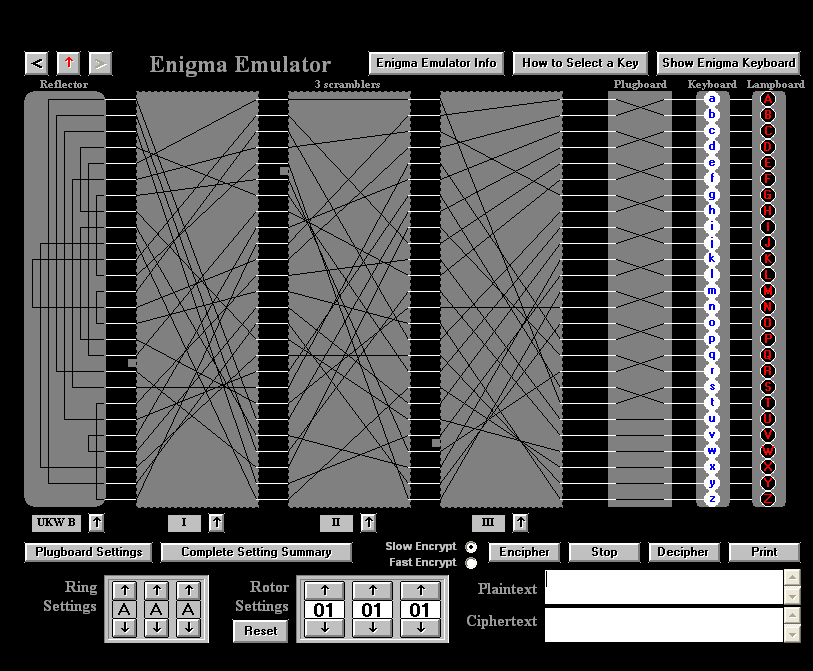


My first step was to configure the Walzenlage. Applying my configuration is shown below:

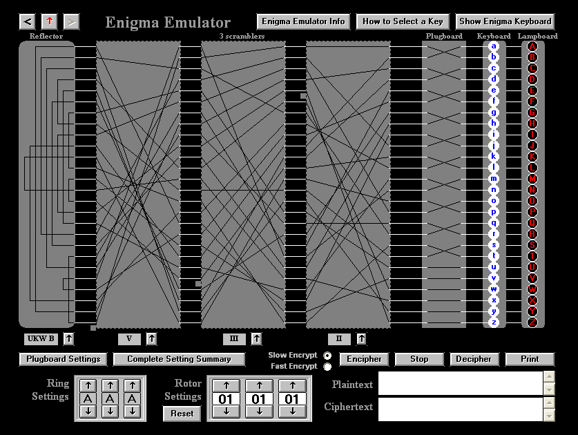


The next step was setting the Ringstellung as shown below:

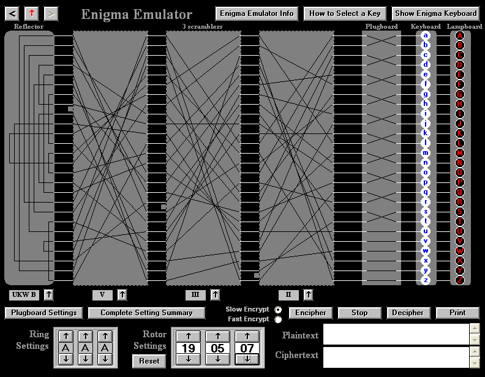


Then I had trouble understanding how to set the right plugboard configuration. Finally I found the `Plugboard Settings` button. Then I set the plugboard according to the config as shown below:

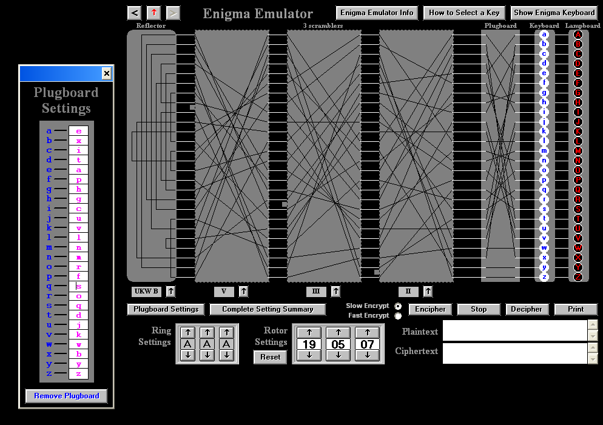

The next step was picking indicator-setting, I choose RNF (the same as in the instructions). This is shown below:

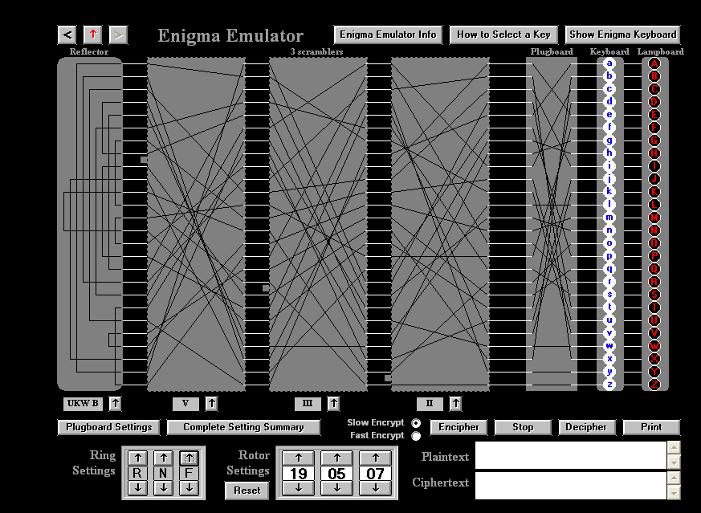


For the message setting I choose the letters JRM. Matching the letter `J` is shown below: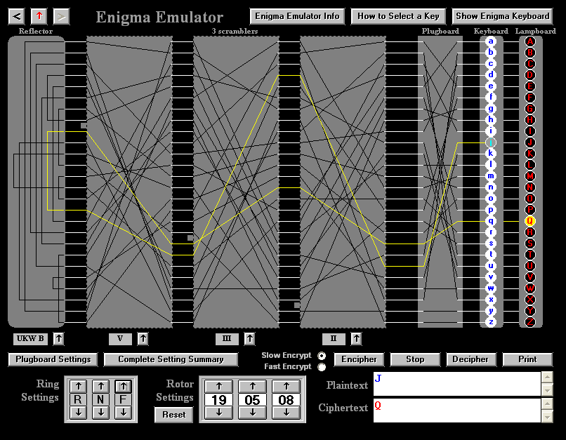

The mapping is :

```
J -> Q
R -> M
M -> V
```


Finally after noting the corresponding letters of the message setting, the rings are set to `JRM` as shown below:

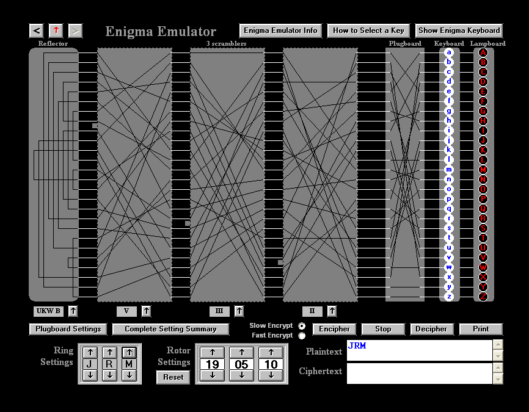


The Enigma is now set for enciphering or deciphering. The task is to encrypt the phrase `I want to go to Hawaii next year`.

However, it turned out that the instructions provided in the http://www.ellsbury.com/enigma3.htm link were not complete, therefore I had to reset the Ring Settings and start the again.

The right instructions were found in The Code Book and they are presented below. The first ring setting must be taken to be one of the Kenngruppen column. I choose `UMS` as shown below: 

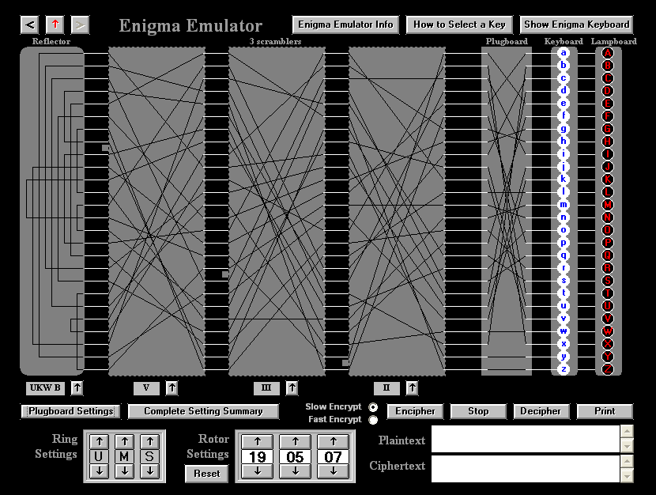


Then I decided on the second ring setting to be `XYZ`. I encoded this setting as shown below:

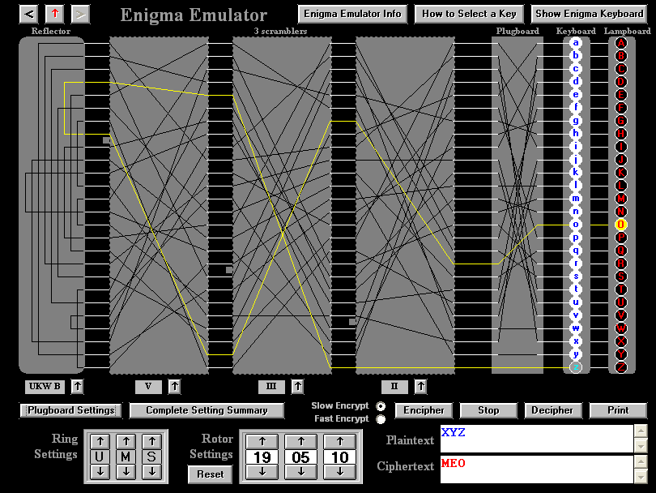

And getting ready to encrypt is shown below:

![winxp-codebook [Running] - Oracle VM VirtualBox_495](SSN-Lab-3-enigma.assets/winxp-codebook%20%5BRunning%5D%20-%20Oracle%20VM%20VirtualBox_495.png)


Finally I could actually encrypt my message as shown below:

![winxp-codebook [Running] - Oracle VM VirtualBox_498](SSN-Lab-3-enigma.assets/winxp-codebook%20%5BRunning%5D%20-%20Oracle%20VM%20VirtualBox_498.png)


Here are the current pieces of the message that I have:

1. My birth date - "2nd of November"
2. My choice of preselected setting - `UMS`
3. My chosen setting - `XYZ`
4. My message cypher text - `WRRQQ FEPBF JNTRJ REUWO VCJML`


The final message looks as below:

```
NOVEMBER 2
UMS
MEO
WRRQQ FEPBF JNTRJ REUWO VCJML
```


Now before I send it I want to check that I can decipher it. So I pretend to be Ali and configure the Enigma according to the text file settings. Then I put in the ring settings as `UMS`  and set up everything to decrypt the key as shown below:

![winxp-codebook [Running] - Oracle VM VirtualBox_497](SSN-Lab-3-enigma.assets/winxp-codebook%20%5BRunning%5D%20-%20Oracle%20VM%20VirtualBox_497.png)


Finally I decrypt the actual message as shown below:

![winxp-codebook [Running] - Oracle VM VirtualBox_496](SSN-Lab-3-enigma.assets/winxp-codebook%20%5BRunning%5D%20-%20Oracle%20VM%20VirtualBox_496.png)


## Task 

### Send the non-secret information required to decrypt the message (which includes the encrypted text and your birthday) to one of your colleagues by email (make sure that you add Nikita and Kirill to CC). Once you receive the corresponding message from your fellow colleague, configure your Enigma machine accordingly and decrypt the message.

This is the message I send to Ali:

```
NOVEMBER 2
UMS
MEO
WRRQQ FEPBF JNTRJ REUWO VCJML
```

And this is the message I got from Ali:

```
JUNE 13 
FGXGOP BONBS OQJMP MGMMF KYPLM ILGYC BYYOW IDXFI SXFUX EMYPO IZ
```

Configuration for June 13 is shown below:

```

 GEHEIM!                                SNE2015                               JUNI 2015

 --------------------------------------------------------------------------------------
 |Tag |   Walzenlage   |Ringstellung|      Steckerverbindungen      |   Kenngruppen   |
 --------------------------------------------------------------------------------------
 | 13 | II   III  I    |  15 12 25  | AF BR CM EQ GO HL PU SW TV XY | MGN KGI NBS AKU |
```


I configured Enigma to decrypt the message. Ali informed me that the second word contains his chosen Kenngruppen, which he perpended to 5 letters, this means that he used `NBS` as the first ring setting. Below is the screenshot of Enigma's configuration overview:

![winxp-codebook [Running] - Oracle VM VirtualBox_500](SSN-Lab-3-enigma.assets/winxp-codebook%20%5BRunning%5D%20-%20Oracle%20VM%20VirtualBox_500.png)


Then I decrypt his key from the cyphertext `FGXGOP`as shown below:

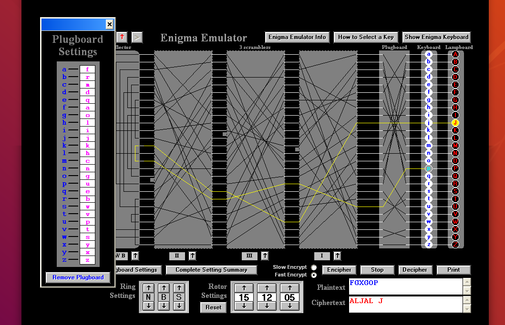


Finally I prepare to decrypt the message as shown below:

![winxp-codebook [Running] - Oracle VM VirtualBox_502](SSN-Lab-3-enigma.assets/winxp-codebook%20%5BRunning%5D%20-%20Oracle%20VM%20VirtualBox_502.png)


And decrypting the message we can see the text:

![winxp-codebook [Running] - Oracle VM VirtualBox_503](SSN-Lab-3-enigma.assets/winxp-codebook%20%5BRunning%5D%20-%20Oracle%20VM%20VirtualBox_503.png)


It looks like the text is misspelled but it reads as 

```
JWISH TOGET AMERC GNESB EDZCC OFSSS ORMYB JRTHN UY
```

Which is (after realizing the J and I are interchanged):

```
I wish to get a mercedes bedz cclass for my birthday
```


## Viola

### You’ve just uncovered a so far unknown encryption machine called Viola which looks a bit similar to the Enigma machine. You are asked to compute the upper bound of different keys (or machine start configurations) you have to search in a brute force attack on an intercepted message

• The Viola machine can fit 1 static reflector and 10 rotors each with 30 characters.
• There are 5 unique reflectors to select from.
• There are 50 unique (under all rotations) rotors to select from.
• The machine has a standard plugboard for all 30 characters.
• It is unknown how many plugboard cables are used so assume any number could be used.


1. A viola rotor has 30 positions, that is the key space of one rotor is 30. 

2. We have 5 unique reflectors of which only one is chosen, so the key space of 1 rotor + one of 5 reflectors is the key space of 1 rotor but now also multiplied by 5. 

3. There are 50 unique rotors and we chose 10 from them. The order of the rotors matters. Repetitions are not allowed. So this is permutation without repetitions. This multiplies the key space by  `50! / (50 - 10)!` . Also because now we chose 10 rotors means that we have to multiply by 30^10 (number of starting positions times the number of rotors that are participating).

4. The plugboards means that input letters can be permuted. This seems to be the most difficult number to get right. The number of slots is 30, but only 15 exchanges of letters are possible. First lets try calculating for a specific number of exchanges, for example for 10 exchanges (i.e. 10 cables). BEgin by examining all ordered combinations of letters: `30!`, but we need to throw some out:

   1. We only need 10 pairs, which is 20 letters, which means 10 letters will be unused. So we discard them by dividing by `10!`.

   2. Then we dont care about the order of the pairs, so we divide by `10!` again, to throw out repetitions.

   3. Then every pair (A,B) is the same as (B,A), to throw them out we divide by 2 to the power of "number of pairs" i.e. 10.

Therefore the final increase in key size if we use 10 cables over 30 letters is `30! / (10! * 10! * 2^10)`. 

5. Now for different number of cables we perform the same calculation, where `x` is the number of cables: `30! / ( (30 - 2x)! * x! * 2^x)` . These cases do NOT overlap. Therefore to get the increase in key space due to pluggable board we add them together for x  in [1, 15]


Computing the number of possibilities created by the plugboard in wolfram alpha is shown below:

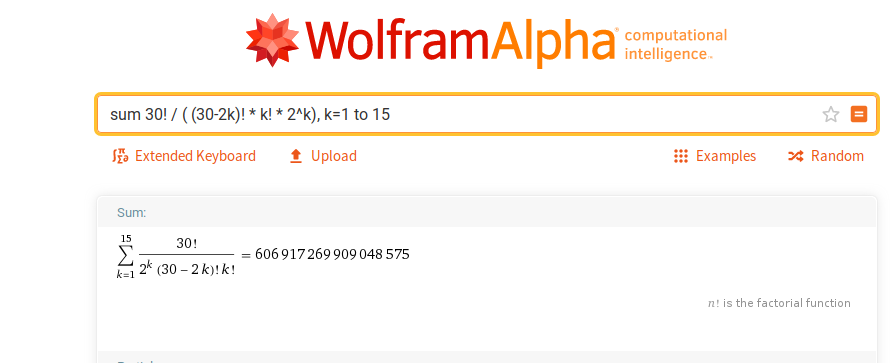 


Thus the total number of possibilities is 

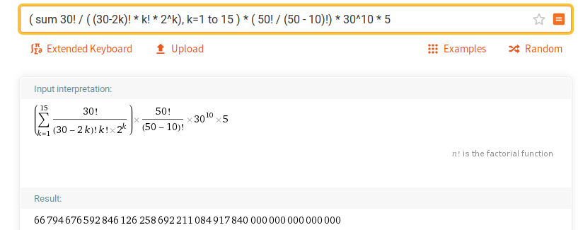


Therefore to investigate the possible varieties provided by the viola hardware would require examining 66794676592846126258692211084917840000000000000000 possible configurations. This includes different positions of rotors, reflectors, all the possible arrangements of the plugboard, etc.


### How does the number of keys compare to the number of keys of a typical Enigma machine with the following specification:
•  The typical Enigma machine can fit 1 static reflector and 3 rotors each with 26 characters.
•  There are 3 unique reflectors to select from.
•  There are 5 unique (under all rotations) rotors to select from.
•  The machine has a standard plugboard for all 26 characters.
•  It is known, the operator always uses 10 plugboard cables.

Enigma is a subset of Viola, therefore we can calculate the possibilities in a similar manner.  For the plugboard there is no need to calculate the sum of different cable possibilities. This calculation is shown below:

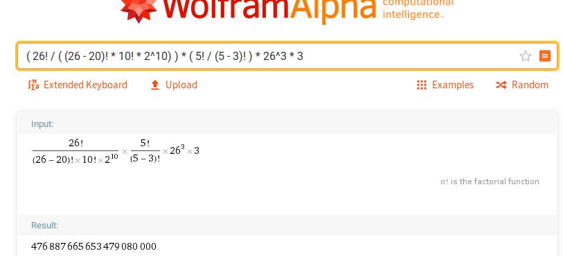


The result is 476887665653479080000 possibilities to be investigated.


Sources:

https://courses.csail.mit.edu/6.857/2018/project/lyndat-nayoung-ssrusso-Enigma.pdf

https://www.mathsisfun.com/combinatorics/combinations-permutations.html

https://www.youtube.com/watch?v=G2_Q9FoD-oQ