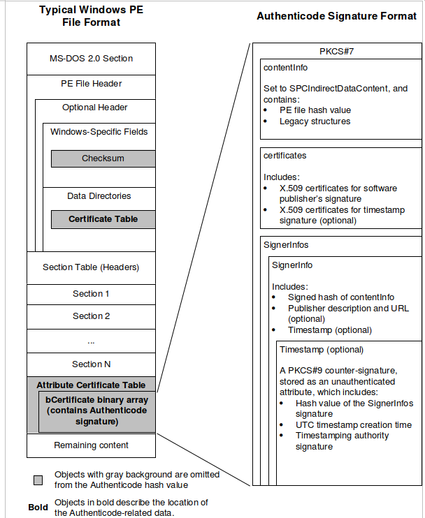

# SSN Lab 5 - UEFI Secure Boot
#### Artem Abramov SNE19

## Questions

### 1. Extract the Microsoft certificate that belongs to the key referred to in Step 1 from the UEFI firmware, and show its text representation on your log. Hint: efitools, openssl x509

I used the tool called `mokutil` to retrieve the certificate information. The tool can access `PK`, `KEK`, `DB` and `DBX` databases. It was interesting that the tool did not need root permissions to access this information. Running the tool with strace revealed that it was using the values from `efivars` (therefore it did not need root access). The output was as shown below:

```
$ mokutil --db
```


Interesting part from running `mokutil` with `strace` is shown below:
```

```

### 2. Is this certificate the root certificate in the chain of trust? What is the role of the Platform Key (PK)?

The role of the Platform Key is to control access to the PK and the KEK.  In most implementations, only one PK can be installed at once. What was examined in Task 1 is a Microsoft certificate, i.e. it is a certificate from a vendor of an operating system. It is a Key Exchange Key. It is not the root certificate for the chain of trust.  It is the job of the hardware manufacturer (Hewlett-Packard in my case) to install the root certificate. Hewlett-Packard can not know in advance what systems will run on this hardware, so they install what is called the Platform Key with which they sign Key Exchange Keys  (its possible to have multiple KEKs installed alongside each other). The KEK is used to actually sign the os/bootloader/bootmanager binary. To control the computer's secure boot, one needs to at minimum replace the PK (in order to prevent new keys being installed without your consent) and their own KEK (with which they will sign whatever UEFI application they want to run). 

source: https://www.linuxjournal.com/content/take-control-your-pc-uefi-secure-boot

## SHIM

### 3. Verify that the system indeed boots the ‘shim’ boot loader in the first stage. What is the full path name of this boot loader?

To verify this we can check the output of `efibootmgr` as shown below:

```
$ efibootmgr -v
BootCurrent: 0008
Timeout: 0 seconds
BootOrder: 0008,0000,0001,0002,0003,0004,0005,0006,0007
Boot0000* ubuntu	HD(1,GPT,f57ce334-0038-4c3b-8094-d3d2639871ae,0x800,0x100000)/File(\EFI\ubuntu\shimx64.efi)
Boot0001* DTO UEFI USB Floppy/CD	VenMedia(b6fef66f-1495-4584-a836-3492d1984a8d,0500000001)..BO
Boot0002* DTO UEFI USB Hard Drive	VenMedia(b6fef66f-1495-4584-a836-3492d1984a8d,0200000001)..BO
Boot0003* DTO UEFI ATAPI CD-ROM Drive	VenMedia(b6fef66f-1495-4584-a836-3492d1984a8d,0300000001)..BO
Boot0004* CD/DVD Drive 	BBS(CDROM,,0x0)..GO..NO{.......+.S.A.T.A. . .P.M.:. .h.p. . . . . . . .D.V.D.R.A.M. .G.T.B.0.........................rN.D+..,.\...........BO
Boot0005* DTO Legacy USB Floppy/CD	VenMedia(b6fef66f-1495-4584-a836-3492d1984a8d,0500000000)..BO
Boot0006* Hard Drive	BBS(HD,,0x0)..GO..NO?.........F.a.k.e. .U.s.b. .O.p.t.i.o.n.................BO..NOc.......+.T.O.S.H.I.B.A. .D.T.0.1.A.C.A.1.0.0.........................rN.D+..,.\...........BO
Boot0007* IBA GE Slot 00C8 v1550	BBS(Network,,0x0)..BO
Boot0008* rEFInd	HD(1,GPT,f57ce334-0038-4c3b-8094-d3d2639871ae,0x800,0x100000)/File(\EFI\refind\refind_x64.efi)
```

We can see multiple boot options. The interesting one among them is the `Boot0000` option which is labeled `ubuntu`: it is actually is set to execute `\EFI\ubuntu\shimx64.efi` which of course is the SHIM.


### 4. Verify that the ‘shim’ boot loader is indeed signed with the ‘Microsoft Corporation UEFI CA’ key.  Hint: sbsigntool, PEM format

The web page `http://www.microsoft.com/whdc/winlogo/drvsign/Authenticode_PE.mspx` was not accessible, however Vadim Rakhmatullin found the new link and shared the file with me. 

Personally its annoying that we have to waste time on trying to guess and old and broken link, because the actual file could have been very easily uploaded to Moodle or shared with us by the TA's!

We can find the Microsoft certificate with `mokutil --db > ms.cert`.  The we check the shim.efi file as below using `sbverify` from `sbsigntool` package. 

```
$ sudo sbverify --cert ms.cert  /boot/efi/EFI/ubuntu/shimx64.efi
```


### 5. Read the first 9 pages of the specification (up to “Authenticode-Specific Structures”). Focus on the structure of the binaries. What is the name of the part of the binary where the actual signature data is stored?

The specification describes a data structure that can be found in a PE binary (the format used for UEFI binaries). This data structure can be used to assert that:

1. The PE is from a specific software vendor.
2. The PE was not changed since it was signed.

Quoting the specification:

```
 is stored in the `SignerInfos`'s structure as the first of the `SignerInfo` entries as shown in the diagram below:

  


### 6. In what standard cryptographic format is the signature data stored?

The actual signature data is just the encrypted hashsum of the PE file, therefore the obvious answer is bytes! However, the binding between the signature and the identity of the software vendor who signed the PE file is specified with a `X.509 version 3` certificate. Furthermore the whole Authenticode format is based on the `PKCS #7: Cryptographic Message Syntax Standard`.

Looking at the description of the `SignerInfo` structure we can see that it contains the following fields that effectively define which cryptographic format was used for the actual signature:

- digestAlgorithm:
  - SHA1
  - MD5 
- digestEncryptionAlgorithm:
  - RSA
  - DSA
- encryptedDigest - the actual signature (encrypted hashsum of the PE file)

  

**To extract the signature data from the binary, one needs to determine the exact location and size of this data in the binary. This information is stored in the Data Directories section of the Optional Header of the executable, as shown in Figure 1 of the specification. To retrieve location and size you can used the pyew package, as follows:**

1.  **Start pyew from the command line with the full name of the ‘shim’ binary as argument.**
2. **Wait for the pyew prompt to appear (it will do an analysis on the binary which you can interrupt with Ctrl-C if it takes too long)**
3. **Type pyew.pe.OPTIONAL HEADER.DATA DIRECTORY to get a listing of all data directory entries.**
4. **Locate the one called IMAGE DIRECTORY ENTRY SECURITY. The location and size are given as the “VirtualAddress:” and “Size:” fields.**


###  7. Extract the signature data from the ‘shim’ binary using dd. Add 8 bytes to the location as given in the data directory to skip over the Microsoft WIN CERTIFICAT structure header (see page 14 of the specification if you are interested). Show the command you used.


### 8. Show the subject and issuer of any X.509 certificates stored in the signature data. Draw a diagram relating these certificates to the ‘Microsoft Corporation UEFI CA’ certificate. Hint: openssl, strongswan-starter


## GRUB 

### 9. Using your new knowledge about Authenticode binaries, extract the signing certificates from the GRUB boot loader, and show the subject and issuer. You now know that the GRUB binary is indeed signed, but how does ‘shim’ verify this signature? To do so ‘shim’ needs a certificate that it trusts and which must not be modifiable by an external party without detection. The solution chosen by Ubuntu is to store a certificate in the ‘shim’ binary. We will call this certificate X.


### 10. Why is storing the certificate X in the ‘shim’ binary secure?

Because if secure boot is enabled the shim binary will be verified before being executed to make sure that is has not been tampered with. The verification should ultimately lead to the PK certificate.


### 11. What do you think is the subject CommonName (CN) of this X certificate?

As seen above it is `CN=Canonical Ltd. Master Certificate Authority`.


### 12. Obtain the X certificate used by ‘shim’ to verify the GRUB binary. There are two ways to obtain it: from the source code or from the binary directly. Hints for the latter case: 1) The certificate is in X.509 DER/ASN.1 format (see openssl asn1parse). 2) DER/ASN 1 leaves the CommonName readable. 3) The certificate is 1080 bytes long. Show the X certificate on your log in text format.

I looked at the upstream source for the shim package in Ubuntu: https://code.launchpad.net/ubuntu/+source/shim

Cloned the code with the command shown below:

```
$ git clone https://git.launchpad.net/ubuntu/+source/shim
```

(Its the same as https://github.com/rhboot/shim)


### 13. Verify that this X certificate’s corresponding private key was indeed used to sign the GRUB binary.


## The Kernel

### 14. Verify the kernel you booted against the X certificate.

### 15. BONUS: Where does GRUB get its trusted certificate from? Hint: It is not stored in the binary, and it is not stored on the file system. We have now verified Steps 1–3 of the Ubuntu chain of trust. Verifying Step 4 is left asa bonus.

### 16. Draw a diagram that shows the chain of trust from the UEFI PK key to the signed kernel. Show all certificates, binaries and signing relations involved.


