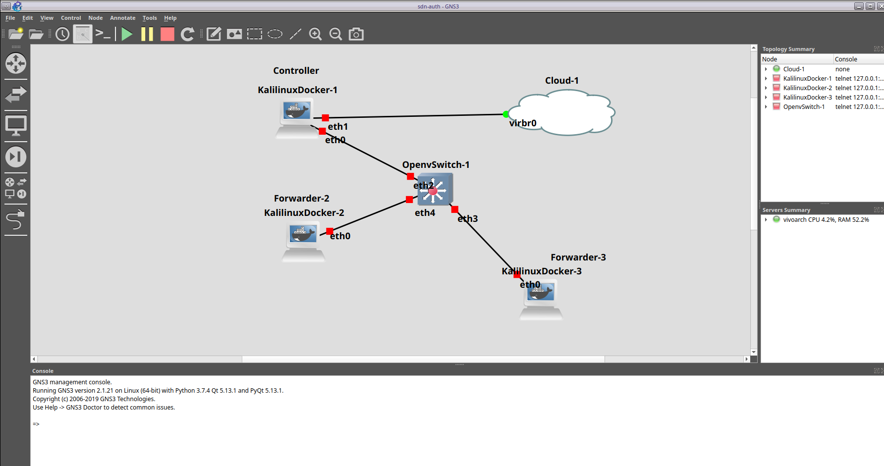
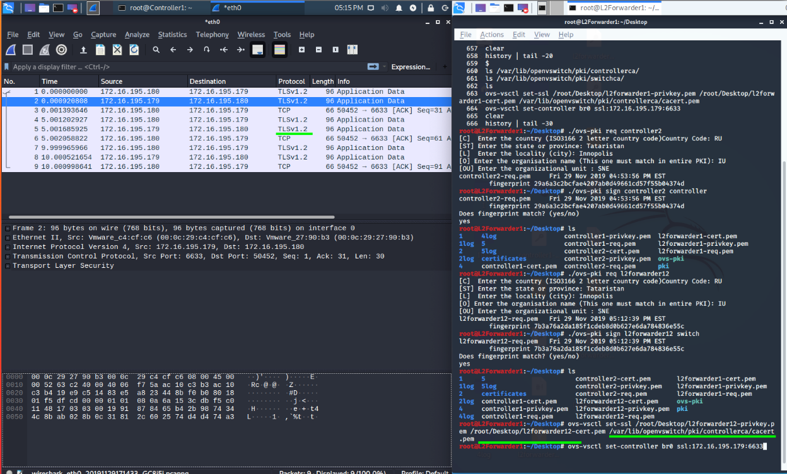
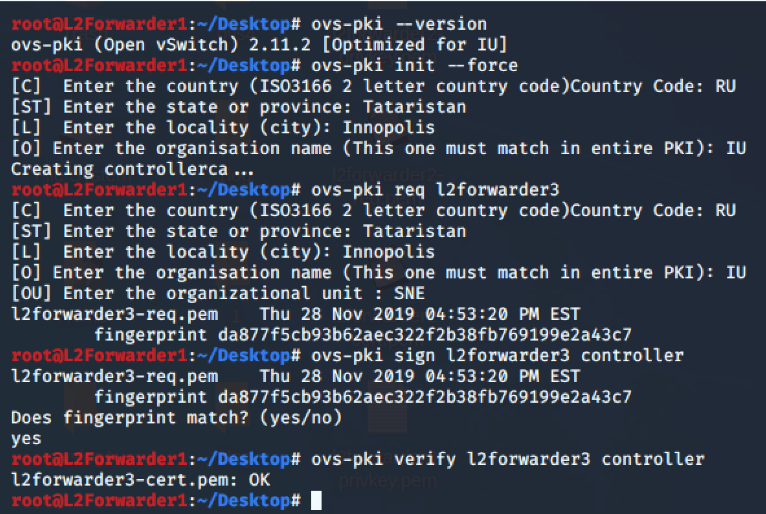

# RP1 Project Report

## **Topic: Authentication and non-repudiation in SDN network.**

# Team

- Ali Akbar Mohammadi
- Artem Abramov

# Abstract

SDN network allows centralised control over data flow in the network. Currently OpenFlow which is the main protocol used to deploy SDN, suffers from security issue - forwarders do not authenticate to the control unit. This opens up multiple vectors for attack on the network. We investigate multiple ways to remedy the situation. After the investigation we undertake to establish a PKI infrastructure and secure all communication with TLS certificates with the aim of providing mutual authentication (and of course encryption) between the controller and the forwarder. Doing so opens the potential of providing non-repudiation and much greater transparency of the SDN network.

# Introduction

SDN networks are an alternative to having the configuration defined individually at each router/switch (Could be Intelligent network nodes)in the network. Furthermore SDN is a vendor neutral solution, which has multiple benefits. OpenFlow is currently the most common protocol to establish SDN networks. This protocol has multiple properties that can be abused by an attacker. The vulnerabilities have been listed under CVE-2018-1000155 and CWE 863.

The term non-repudiation involves associating actions or changes with a unique forwarder or control unit.  To mitigate the risk of forwarders repudiating their own routing information, the standard approach is to involve a trusted third party, that is - a certificate authority. A public key certificate can be used by anyone to verify digital signatures without a shared secret between the signer and the verifier. We will show how to setup and maintain a PKI to achieve this property.

Non-repudiation is an important quality, because it will allow us to identify the source of the malicious information if any is detected on the network. Tacking the originator of the routing table updates would enable us to trace the attack vector and allow the network administrator to disable it. We handle disabling of an offending forwarder by revoking its TLS certificate, which works well in combination with running our own PKI infrastructure.

## Possible Attacks

The attack is based on the fact the the OpenFlow protocol does not provide a way for controller to verify the forwarder's certificate. In this work we will not go into particular details of each attack as this is most likely not an exhaustive list. However a short list is presented below:

- Denial of Service 
- Improper Authentication & Authorization 
- Covert Channel 
- Flow enforcement 
- SDN Teleportation 
- Out of band forwarding 
- Rogue Controllers 
- Rogue Forwarders (Switches)

## End Goal

OpenFlow offers support for TLS, however it was made optional in version 1.3 and furthermore the OpenFlow handshake anyway failed to authenticate forwarders to the controller, allowing certain attacks. Fixing the perceived vector of attack in the OpenFlow protocol. To achieve this we considered two approaches:

- Patch the OpenFlow protocol to include a step that would authenticate the forwarder to the controller
- Add a preliminary step before the OpenFlow actually starts running that would mutually authenticate the forwarder and controller to each other.

We decided that the second approach was less intrusive and easier to apply as an upgrade strategy for the current (vulnerable) networks. Therefore we chose the second approach and took the statements below to heart when considering this and our next steps:
	1. No new system
	2. No additinal import/plugin to the whole system
	3. As simple as possible
	4. No alteration to OpenFlow

## Analysis of the current implementations

To carry our research the decided to use Ryu as the controller software and OpenVSwitch as the software on the forwarder. There was not any serious alternative to the forwarding solution, however there are multiple controller software packages available. We also looked into OpenDaylight, ONOS, Project Floodlight. To summarize what we perceived as the advantages of Ryu over other software:

- Entirely open source
- Written in Python
- Has enough features yet is not bloated
- Configuration is done in code

A large part of our work focused on improving the existing features of Ryu and implementing new ones. In particular Ryu has provisions for authentication between the forwarders and controllers when setting up the OpenFlow connection. However the options were perceived by us as inadequate due to the reasons below:

- Authentication via password provides little to no protection against an attacker, because the only acceptable formats are: Plain Text, MD5, SHA1
- TLS authentication clearly has not been tested with multiple forwarders. We came across what was clearly a bug when trying to create an SDN test setup in GNS3.
- There is no way to provide a list of revoked TLS certificates or to revoke one.
- TLS certificates are not checked for uniqueness, i.e. multiple machines can connect using a copy of the same certificate.
- Ryu has no reporting system for monitoring the controllers currently online and their respective TLS certificates.

The second part of our work focused on OpenVSwitch. The developers of OpenVSwitch seems to be aware of the vulnerabilities in OpenFlow protocol and they in fact tried to provide a solution for that by implementing usage of TLS certificates, however they seemed to have the wrong understanding of the problem, because what was necessary is not just encryption, but authentication as well. In our work we used OpenVSwitch for establishing the PKI infrastructure on the CA machine and as the client software that runs on all forwarders. We identified the following issues in OpenVSwitch: 

- Certificates created by the ovs-pki script installed with OpenVSwitch rely on unique CA and CN names that are used effectively as passwords. 
- Not possible to list issued certificates (the only place to do so is a log file, which is not very convenient).
- There is no way to revoke a certificate or provide a list of revoked certificates.
- No database of issued certificates.
- SSL is disabled by default and requires re-compilation.

## Solution

TLS is not enough to mitigate the possible attacks. Some of them can take place over the encrypted channel, as they are based on flaws in the OpenFlow protocol, not TLS. To mitigate such attacks authentication is needed. This means issuing and distributing unique certificates that would pin the identity of the forwarder, for example its name and Data Path Identifier to the particular key pair. Furthermore, in case a controller or a forwarder is compromised a mechanism must be implemented to revoke this unique certificate.

Our chosen solution to maintaining the PKI was using ovs-pki scripts provided with every OpenVSwitch installation. The scripts are essentially wrappers around openssl. We used the controller as the host for the CA. We created a self-signed CA on the controller using ovs-pki. Each forwarder generated a key pair and submitted a CSR to the controller. The controller could verify the fingerprint and sign the request (adding it to the database of issued certificates). We added an extra check to the CSR signing process to make sure that the organization name was the same among all the certificates signed by this particular CA. Then the certificate was send back to the forwarder and Ryu instance was restarted to reload the list of valid certificates. The forwarder was configured with the address of the single controller running the Ryu instance. 

# Implementation Details

We created the test bed setup as shown below:

We fixed a bug in Ryu controller due to which it was impossible to connect more than one forwarder via TLS  connection. It appears we were the first one who wanted to have a network where multiple devices used distinct TLS certificates. 

We verified that we could connect multiple forwarders to the controller and that before the OpenFlow protocol was activated the extra step of establishing the TLS connection and mutual certificate verification was accomplished. This is shown on the screenshot below:

We explored multiple approaches and solutions to creating and maintaining a PKI including generating the private keys, signing requests and distributing the signed certificates. 

In particular we explored using certificates issued by Let’s Encrypt.  We identified the following benefits and drawbacks associated with this approach : 

 - Benefits

   - No need for complicated PKI

   - Less chance of vulnerability
   - Certificate renewal via certbot

 - Drawbacks

    - Must still distribute root cert
   - The forwarders need an internet connection to get certs, not good for isolated sites
   - SDN is about less branding, here we have to depend on third party Verisign/Let’s Encrypt/etc.
   - Let’s Encrypt imposes limits on certificates (maximum valid through period, etc)

We also explored multiple ways to maintain and organize our own PKI. We identified the following benefits and drawbacks associated with this approach : 

 - Benefits
   	- Complexity can potentially be hidden
   	- More freedom of configuration
   	- Complete certificate transparency
   	- Can be used on offline SDN sites
 - Drawbacks
   	- Complexity
    - Requires maintenance 
        

The first approach to maintaining PKI that we explored was using one machine as host for CA. This machine was not the controller, it was a separate machine used just for PKI. We used openssl to generate and sign all certificates there (even the ones for the forwarders) and then distribute them to the controller and the forwarders. This was a lot of manual work. Furthermore it was inconvenient, error prone and rather slow, because we used an offline machine and effectively a USB key for file transfer (keeping it secure). 

The second approach to maintaining our PKI that we explored was using PythonPKI program. This time we run the program directly on the controller machine. We used PythonPKI for the following:

- Create CA
- Create forwarder's private keys
- Create forwarder's certificate signing requests
- Create signed certificates
- Maintain log of issued certificates
- Nice command line interface

Then we distributed the certificates and the private key (which is wrong from security standpoint) via SCP to the forwarders from the controller. Using SSH meant we could ensure that transfer was secure and authenticated (assuming the admin checked the remote machine's fingerprint). 

The third and final approach that to maintaining PKI that we explored was chosen as our solution and is described under the heading `Solution`.

We modified ovs-pki scripts to maintain a database of issued certificates (as a text file).

Further more we modified the creation, signature and verification of a certificate when using ovs-pki to make it simpler and more straightforward. An example of the creation, signing and verification for `l2forwarder3` is shown below:

# Further Work

We did not manage to accomplish everything we set for this project. In particular a few important bits were missing:

	- Multiple CA are not supported in Ryu, this is an issue if one is compromised
	- Certificate revocation lists are not implemented in Ryu, not implemented in OpenVSwitch, this is a very serious issue.
	- There is no command in Ryu to list currently connected forwarders along with their TLS certificate and identify. There is no way to monitor active connections.
	- We want to achieve complete certificate transparency. This is a very important step towards better security. 
	- Certificate renewal is a difficult issue that could be automated.
	- Distribution of certificates and CSR should also be automated, not via SCP.
	- Ryu should maintain up-to-date database of valid and revoked certificates. 
	- Ryu should provide hot-reload to take into account newly issued certificates, without having to restart the controller instance.

# Sources

- https://seclists.org/oss-sec/2018/q2/99
- https://www.cvedetails.com/cve/CVE-2018-1000155/
- https://www.researchgate.net/publication/263917691_SDN-Driven_Authentication_and_Access_Control_System?enrichId=rgreq-a0eb8416e9cf8bd99cc4cf985a331c7f-XXX&enrichSource=Y292ZXJQYWdlOzI2MzkxNzY5MTtBUzoxMTkxNjA4NDc3MzY4MzJAMTQwNTQyMTU2ODQ0NQ%3D%3D&el=1_x_2&_esc=publicationCoverPdf
- https://nds2.ccs.neu.edu/papers/beads_raid2017.pdf
- https://benton.pub/research/openflow_vulnerability_assessment.pdf
- https://www.univie.ac.at/ct/stefan/eurosp17.pdf
- https://www.univie.ac.at/ct/stefan/ifip18covert-slides.pdf
- "SDN Teleportation: Exploiting the OpenFlow Handshake"  by Kashyap Thimmaraju at ONOS Security Brigade Workshop 